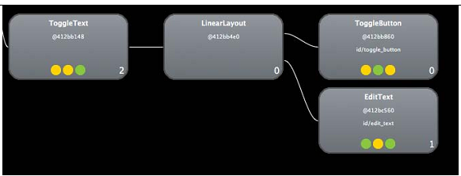
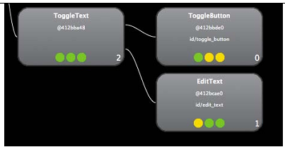

Android.UI.Fundamentals

[toc]

## 10 创建定制View

Android绘制View分为两阶段，测量阶段和布局阶段。创建定制View需要覆盖`onMeasure`和`onDraw`方法；定制的View特性（attributes）需要定义新的XML命名空间。还可以将多个View组合成复合View。

### 10.1 理解Android如何绘制View

通过`setContentView`方法设置活动的根节点。活动的布局占据屏幕的部分，从通知和Action Bar之下，到底部导航条（如果有）之上。

可以通过`invalidate()`强制系统重绘。重绘后，View被标记为有效（valid）。

绘制分两个阶段。首先，视图根被要求测量自己。然后根会测量每个子View。子View策略孙View，以此推进，最后View层级中所有View的大小都是测量好了的。在每一级，父View会给子View一个特定的大小，或者要求子View设定自己的大小。

测量阶段完成后，系统对View层级进行布局。它按照预定义的顺序沿布局树向下走，将每个View绘制在一个bitmap上。父View先被绘制，子View绘制在其上。布局完成后，绘制系统将bitmap绘制在屏幕上，显示给用户。

### 10.2 创建定制View

创建定制的View组件，要先扩展一个View类。可以扩展`View`类或其子类。

这只适用于静态View或低性能的 2D 图形。如果你想创建 3D 图形或复杂的动画，应该扩展 `SurfaceView` ，或使用*RenderScript*，或使用*OpenGL*。参见第11章。

例子，创建一个View，显示一个十字：
```java
public class CrossView extends View {
	public CrossView(Context context, AttributeSet attrs) {
		super(context, attrs);
	}
}
```

Note that the constructor takes both a `Context` and an `AttributeSet` object. The `AttributeSet` is required to pass XML parameters to your view. You’ll learn more about this when you learn how to create custom XML attributes. 在构造器中一般要调用父类。

#### 10.2.1 `onMeasure`

```java
private static final int DEFAULT_SIZE = 100;

@Override
protected void onMeasure(int widthMeasureSpec, int heightMeasureSpec) {
	setMeasuredDimension(calculateMeasure(widthMeasureSpec),
		calculateMeasure(heightMeasureSpec));
}
```

系统调用`onMeasure`方法，决定View机器孩子的大小。传入该方法的两个整数实际是两个 `MeasureSpec`。`MeasureSpec` 是一个模式标志加一个大小的整数值。使用整数的目的是减少对象分配。模式用来决定如何计算大小：
- `UNSPECIFIED`：父 View 不限制 View 大小，可以任意大。
- `AT_MOST`：大小任意，但不能超过 *MeasureSpec*。
- `EXACTLY`：View大小必须等于 *MeasureSpec*。

`onMeasure` 方法中必须调用 `setMeasuredDimensions`，否则会抛出`IllegalStateException`。

当系统或父View计算布局时，`onMeasure`可能被调用多次。例如，父View可能先调用每个孩子的`onMeasure`方法，传入`UNSPECIFIED`，收集它们期望的大小。然后，在计算出可用空间后，当View不能容纳所有孩子时，可能被要求重新计算。

```java
private int calculateMeasure(int measureSpec) {
	int result = (int) (DEFAULT_SIZE *
		getResources().getDisplayMetrics().density);
	// 抽出模式和大小
	int specMode = MeasureSpec.getMode(measureSpec);
	int specSize = MeasureSpec.getSize(measureSpec);
	if (specMode == MeasureSpec.EXACTLY) {
		 result = specSize;
	} else if (specMode == MeasureSpec.AT_MOST) {
		result = Math.min(result, specSize);
	}
	return result;
}
```

Because the pixel density of devices varies, you must calculate the actual pixel value using the display density.

若模式是`EXACTLY`，则返回传入的大小。如果是`AT_MOST`，则返回`DEFAULT_SIZE`和输入大小的最小值。否则，返回`DEFAULT_SIZE`。

#### 10.2.2 `onDraw`

> View还有一个`draw`方法。该方法供父母调用，要求View绘制。该方法处理一些绘图的基本步骤，如安装Canvas、会被背景。不要覆盖该方法。覆盖`onDraw`。

传入`onDraw`的`Canvas`对象，持有一个View的底层的bitmap。

可以利用`Canvas`的方法绘制基本UI元素：rectangles, ovals, paths, text, and bitmaps. `Paint`可以决定颜色、文本大小等样式。

```java
	float[] mPoints = {
		0.5f, 0f, 0.5f, 1f, 0f, 0.5f, 1f,0.5f};
	private Paint mPaint;
	public CrossView(Context context, AttributeSet attrs) {
		super(context);
		mPaint = new Paint();
		mPaint.setAntiAlias(true);
		mPaint.setColor(0xFFFFFFFF);
	...

	@Override
	protected void onDraw(Canvas canvas) {
		super.onDraw(canvas);
		canvas.save();

		int scale = getWidth();
		canvas.scale(scale,scale);
		canvas.drawLines(mPoints, mPaint);
		canvas.restore();
	}
}
```

`Canvas`上的所有绘制，要在`save()`和`restore()`之间。

To make your drawing code simpler, scale the canvas based on the size of the view. Doing this allows you to draw using simple floats between 0 and 1 without carrying around dimensions.

在布局中使用：
```xml
	<?xml version="1.0" encoding="utf-8"?>
	<LinearLayout xmlns:android="http://schemas.android.com/apk/res/android"
	android:layout_width="fill_parent"
	android:layout_height="fill_parent"
	android:orientation="vertical"
	android:gravity="center_horizontal" >
		 <com.example.CrossView
			 android:layout_width="wrap_content"
			 android:layout_height="wrap_content" />
	</LinearLayout>
```

自定义View类的全限名作为XML标签名。但如果View类是内部类。由于`$`不是有效字符。因此需要使用`class`特性：
```xml
	<view
		class="com.example.CustomViewsActivity$CrossView"
		android:layout_width="wrap_content"
		android:layout_height="wrap_content"/>
```

注意`<view>`是全小写的。

### 10.3 向定制View添加定制特性（Attribute）

涉及：声明特性，向XML布局添加命名空间，在定制View的构造器中处理`AttributeSet`对象。

#### 10.3.1 声明特性

新建文件`res/values/attrs.xml`，使用新的XML资源元素`<declare-styleable>`声明*styleable*。

为`CrossView`定义特性：

```xml
	<?xml version="1.0" encoding="utf-8"?>
	<resources>
		<declare-styleable name="cross">
			<attr name="android:color" />
			<attr name="rotation" format="string" />
		</declare-styleable>
	</resources>
```

`<declare-styleable>`的`name`特性指定一个名字，可以在代码中引用这个名字（如`R.styleable.cross`）。每个定制特性通过一个`<attr>`元素声明。`<attr>`元素有两个特性：`name`和`format`。`name`定义XML中定制特性的名字。`format`表示数据类型。上面的例子使用了一个系统默认的特性。使用系统特性时不需要声明`format`，因为Android已经声明它了。

Every attribute with a format can be declared only once. This example works because it uses the existing `android:color` format. 若你尝试使用其他格式，工程就无法构建。如果想在多个*styleable*中重用一个特性，可以将它放在`<resources>`下，需要指定`format`。然后在`<declare-styleable>`中使用它时，不要带`format`。例子：

```xml
	<?xml version="1.0" encoding="utf-8"?>
	<resources>
		<attr name="test" format="string" />
		<declare-styleable name="foo">
			<attr name="test" />
		</declare-styleable>
		<declare-styleable name="bar">
			<attr name="test" />
		</declare-styleable>
	</resources>
```

没有文档列出所有可能的`format`。The best documentation is the android source code for the `android.R.styleable.attr.xml` file and the `android.content.res.TypedArray` class. Current formats include `reference`, `string`, `color`, `dimension`, `Boolean`, `integer`, `float`, `fraction`, `enum`, and `flag`.

You can create custom attributes with predefined values that are similar to the built-in attributes like `wrap_content` and `match_parent`. To do that, you declare the values using `<enum>` or `<flag>` elements:
```xml
	<attr name="enum_attr">
		<enum name="value1" value="1" />
		<enum name="value2" value="2" />
	</attr>
	<attr name="flag_attr">
		<flag name="flag1" value="0x01" />
		<flag name="flag2" value="0x02" />
	</attr>
```

Enums and flags are required to be integers. The difference between them is that the flag attributes can be combined using a bitwise *OR* operation. Use flags when you want the option to combine multiple attribute values:
```xml
	<com.example.Foo example:flag_attr="flag1|flag2" />
```

#### 10.3.2 在XML中使用特性

要使用新特性，需要先声明命名空间。This prevents your custom attributes from colliding with system attributes that may be defined in later versions of Android.

```xml
	<?xml version="1.0" encoding="utf-8"?>
	<LinearLayout
		xmlns:android="http://schemas.android.com/apk/res/android"
		xmlns:example="http://schemas.android.com/apk/res/com.example"
		android:layout_width="fill_parent"
		android:layout_height="fill_parent"
		android:orientation="vertical"
		android:gravity="center_horizontal" >

		<com.example.CrossView
			android:layout_width="wrap_content"
			android:layout_height="wrap_content" />
		<com.example.CrossView
			android:layout_width="wrap_content"
			android:layout_height="wrap_content"
			example:rotation="30"
			android:color="#0000FF"/>
		<com.example.CrossView
			android:layout_width="wrap_content"
			android:layout_height="wrap_content"
			example:rotation="45"
			android:color="#FFFF00"/>
	</LinearLayout>
```

命名空间`android`的特性可以在`android`下找到。命名空间`example:`下的特性可以在`com.example`包下找到。命名空间前缀可以任意指定。

#### 10.3.3 在代码中使用特性

```java
public CrossView(Context context, AttributeSet attrs) {
	super(context, attrs);
	...
```

The `AttributeSet` object is passed to your view by the system when it is instantiated. This object contains all the attributes declared by the XML layout, but it stores them in a more efficient binary format. Use it to retrieve the attribute values and set them on your view.

```java
public CrossView(Context context, AttributeSet attrs) {
	super(context);
	mPaint = new Paint();
	mPaint.setAntiAlias(true);
	mPaint.setColor(0xFFFFFFFF);
	TypedArray arr = getContext()
		.obtainStyledAttributes(attrs, R.styleable.cross);
	int color = arr.getColor(R.styleable.cross_android_color, Color.WHITE);
	float rotation = arr.getFloat(R.styleable.cross_rotation, 0f);
	// Remember to call this when finished
	arr.recycle();
	setColor(color);
	setRotation(rotation);
}
```

`obtainStyleAttributes`用于创建`TypedArray`。`TypedArray`可以方便访问`AttributeSet`中的特性值。This class performs caching internally, so always call `recycle` when you are finished using it. 访问定制属性需要用到`<declare-styleable>`的`name`特性定义的名字，和`<attr>`的`name`特性定义的名字。

### 10.4 创建复合组件

指扩展Android内建的View，增强其功能。

#### 10.4.1 创建复合组件

复合组件比定制View有两个优势：1、利用存在的view group类做布局；2、不必覆盖`onMeasure`和`onDraw`方法。

创建一个新的布局`toggle_text.xml`：
```xml
	<?xml version="1.0" encoding="utf-8"?>
	<LinearLayout xmlns:android="http://schemas.android.com/apk/res/android"
		android:layout_width="match_parent"
		android:layout_height="match_parent"
		android:orientation="horizontal" >
		<ToggleButton
			android:id="@+id/toggle_button"
			android:layout_width="wrap_content"
			android:layout_height="wrap_content"
			android:text="ToggleButton" />
		<EditText
			android:id="@+id/edit_text"
			android:layout_width="0dp"
			android:layout_height="wrap_content"
			android:layout_weight="1" >
			<requestFocus />
		</EditText>
	</LinearLayout>
```

创建一个新类，继承`LinearLayout`。利用系统服务`LayoutInflater`充气布局：
```java
public class ToggleText extends LinearLayout {
	public ToggleText(Context context, AttributeSet attrs) {
		super(context, attrs);
		LayoutInflater inflater = (LayoutInflater) context.
			getSystemService(Context.LAYOUT_INFLATER_SERVICE);
		View view = inflater.inflate(R.layout.toggle_text, this);
	}
}
```

充气时，将`this`作为父容器。

添加定制功能。监听按钮改变，设置`EditText`状态：

```java
public class ToggleText extends LinearLayout
	implements OnCheckedChangeListener {
	
	EditText mTextView;
	public ToggleText(Context context, AttributeSet attrs) {
		super(context, attrs);
		LayoutInflater inflater = (LayoutInflater) context.
			getSystemService(Context.LAYOUT_INFLATER_SERVICE);
		View view = inflater.inflate(R.layout.toggle_text, this);
		mTextView = (EditText) view.findViewById(R.id.edit_text);
		ToggleButton toggle = (ToggleButton) view.findViewById(R.id.toggle_button);
		toggle.setChecked(true);
		toggle.setOnCheckedChangeListener(this);
	}

	@Override
	public void onCheckedChanged(CompoundButton buttonView,
		boolean isChecked) {
		mTextView.setEnabled(isChecked);
	}
}
```

#### 10.4.2 优化布局

查看布局，发现`ToggleText`有单个孩子，是个`LinearLayout`。但`ToggleText`本身就是一个个`LinearLayout`（继承自个`LinearLayout`）。因此需要移掉多余的`LinearLayout`。



通过`<merge>`解决：

```xml
	<?xml version="1.0" encoding="utf-8"?>
	<merge xmlns:android="http://schemas.android.com/apk/res/android"
		android:layout_width="match_parent"
		android:layout_height="match_parent"
		android:orientation="horizontal" >
		<ToggleButton
			android:id="@+id/toggle_button"
			android:layout_width="wrap_content"
			android:layout_height="wrap_content"
			android:text="ToggleButton" />
		<EditText
			android:id="@+id/edit_text"
			android:layout_width="0dp"
			android:layout_height="wrap_content"
			android:layout_weight="1" >
			<requestFocus />
		</EditText>
	</merge>
```

改后的层级：



## 11 创建高级图形

本章介绍：
- `SurfaceView`和`TextureView`利用标准`Canvas`和独立线程实现更高的性能。
- 用 RenderScript 框架创建架构独立的图形渲染
- OpenGL

### 11.1 利用 Canvas

提高性能的最简单办法是把绘制放到独立线程。By drawing in a separate thread, you can rapidly update graphics without waiting for the rest of the view hierarchy to finish drawing.

#### 实现`SurfaceView`

`SurfaceView`位于普通的View层级之外。它实际位于普通窗口的后面，通过在View布局上打个洞显示出现。`SurfaceView`可以被独立于其他View更新，不需要等待UI线程。

需要创建一个子类，继承`SurfaceView`，同时实现`SurfaceView.Callback`接口。

```java
public class ExampleSurfaceView extends SurfaceView
	implements SurfaceHolder.Callback {

	public ExampleSurfaceView(Context context) {
		super(context);
		SurfaceHolder holder = getHolder();
		holder.addCallback(this);
	}

	@Override
	public void surfaceCreated(SurfaceHolder holder) {
		// 当surface view首次被创建后调用。在这里开始绘制。
	}

	@Override
	public void surfaceChanged(SurfaceHolder holder, int format,
		int width, int height) {
		// 当surface view范围变化时调用。一般由于设备旋转。
	}

	@Override
	public void surfaceDestroyed(SurfaceHolder holder) {
		// 当surface被销毁。清理线程和绘制
	}
}
```


#### 绘制到`SurfaceView`

在`SurfaceView`上的所有绘制发生在一个独立的线程。先调用`SurfaceHolder.lockCanvas`，获得一个`Canvas`对象。`lockCanvas`方法会阻止`SurfaceView`更新底层的surface，直到钓鱼了`unlockCanvasAndPost`。This eliminates the need for synchronization around writing to the surface (though you still need to synchronize fields between your threads). 所有的绘制发生在`lockCanvas`和`unlockCanvasAndPost`之间。

> 不要用`lockCanvas()`返回的`Canvas`保存绘制状态。There is no guarantee that the surface will be unchanged the next time you call `lockCanvas`.


创建一个`Thread`的子类`DrawingThread`，调用View的`onDraw`方法。每隔20毫秒更新一次。

```java
private class DrawingThread extends Thread {
	boolean keepRunning = true;
	@Override
	public void run() {
		Canvas c;
		while (keepRunning) {
			c = null;
			try {
				c = mSurfaceHolder.lockCanvas();
				synchronized (mSurfaceHolder) {
					mAngle += 1;
					onDraw(c);
				}
			} finally {
				if (c != null)
					mSurfaceHolder.unlockCanvasAndPost(c);
			}
			// Run the draw loop at 50 fps
			try {
				Thread.sleep(20);
			} catch (InterruptedException e) {}
		}
	}
}
```

```java
DrawingThread mThread;
int mRed =	0;
int mGreen = 0;
int mBlue =	127;
float[] mVertices = new float[6];
int[] mColors = {
	0xFFFFFFFF, 0xFFFFFFFF, 0xFFFFFFFF,
	0xFFFFFFFF, 0xFFFFFFFF, 0xFFFFFFFF};
Paint mPaint = new Paint();
float mAngle = 0;
float mCenterX = 0;
float mCenterY = 0;
public ExampleSurfaceView(Context context) {
	super(context);
	mSurfaceHolder = getHolder();
	mSurfaceHolder.addCallback(this);
	mThread = new DrawingThread();
	mPaint.setColor(0xFFFFFFFF);
	Paint.setStyle(Paint.Style.FILL);
}

@Override
public void surfaceCreated(SurfaceHolder holder) {
	mThread.keepRunning = true;
	mThread.start();
}

@Override
public void surfaceDestroyed(SurfaceHolder holder) {
	 mThread.keepRunning = false;
	 boolean retry = true;
	 while (retry) {
	 	try {
			mThread.join();
			retry = false;
		} catch (InterruptedException e) {}
	}
}

@Override
public void surfaceChanged(SurfaceHolder holder, int format,
	int width, int height) {
	mVertices[0] = width/2;
	mVertices[1] = height/2;
	mVertices[2] = width/2 + width/5;
	mVertices[3] = height/2 + width/5;
	mVertices[4] = width/2;
	mVertices[5] = height/2 + width/5;
	mCenterX = width/2 + width/10;
	mCenterY = height/2 + width/10;
}

@Override
protected void onDraw(Canvas canvas) {
	canvas.drawRGB(mRed, mGreen, mBlue);
	canvas.rotate(mAngle, mCenterX, mCenterY);
	canvas.drawVertices(Canvas.VertexMode.TRIANGLES, 6,
		mVertices, 0, null, 0, mColors, 0, null, 0, 0, mPaint);
}
```

Implement the `onTouchEvent` method and update the color as you slide your finger across the screen. Note the **synchronization** on the changing of the color values:
```java
@Override
public boolean onTouchEvent(MotionEvent event) {
	switch (event.getAction()) {
	case MotionEvent.ACTION_DOWN:
	case MotionEvent.ACTION_MOVE:
		synchronized(mSurfaceHolder) {
			mRed = (int) (255*event.getX()/getWidth());
			mGreen = (int) (255*event.getY()/getHeight());
		}
		return true;
	}
	return super.onTouchEvent(event);
}
```

#### `TextureView`

`SurfaceView`有一些缺陷。In particular, because `SurfaceView` exists outside the normal view system, it can’t be transformed the way a normal view can. You can’t move, scale, or rotate a surface view. In addition, `SurfaceView` doesn’t support transparency effects using `setAlpha`.

为解决这些问题，Android 4.0 引入了`TextureView`。他与`SurfaceView`类似，但支持普通View的操作。You can use a texture view to display a content stream such as video camera preview, while also transforming it using the View API.

`TextureView` requires hardware acceleration and, because it is more flexible than `SurfaceView`, incurs a performance hit. You would not want to use it for running a full-screen game, for example. However, if you are developing on Android 4.0 and need to transform a high-performance canvas view, consider using `TextureView`.

### 11.2 RenderScript

### （未）11.3 OpenGL


