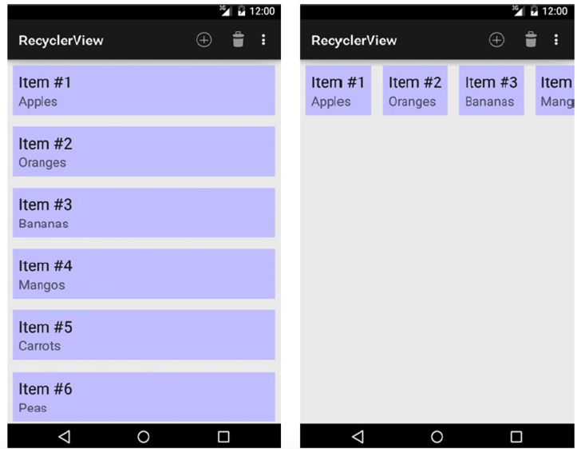
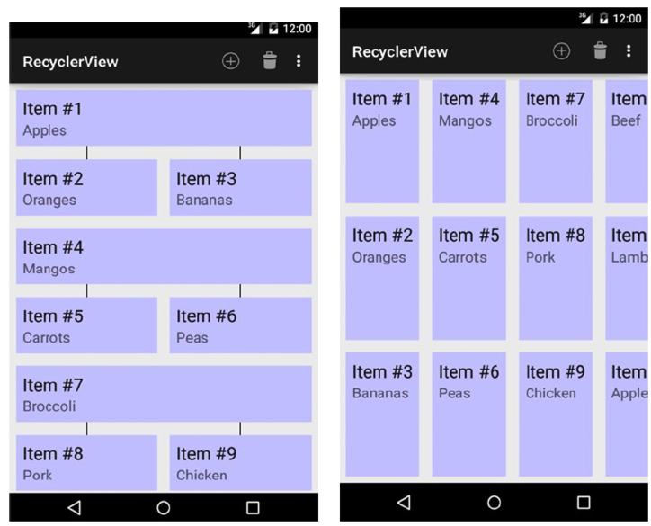

[toc]

# 1 布局和视图

## 1.1 样式和主题

`TextView` 除了 `style` 特性还支持 `android:textAppearance` 特性。该特性的值也是一个样式。但只有样式中的与文本相关的特性有用（如大小、样式、颜色等）。

### 主题

Theme aspects related to window customization can be found in the `R.attr` reference
of the SDK, but here are the most common items:

- `android:windowNoTitle`: Governs whether to remove the default title bar; set to true to remove the title bar.
- `android:windowFullscreen`: Governs whether to remove the system status bar; set to true to remove the status bar and fill the entire screen.
- `android:windowBackground`: Color or drawable resource to apply as a background.
- `android:windowContentOverlay`: Drawable placed over the window content foreground. By default, this is a shadow below the status bar. Set to any resource to use in place of the default status bar shadow, or null (`@null` in XML) to remove it.

In addition, the Material themes accept a series of color attributes that are used to tint the application interface widgets:

- `android:colorPrimary`: Used to tint primary interface elements, like the action bar and the scrolling edge glow effects. Also affects the recent tasks title bar color.
- `android:colorPrimaryDark`: Tints the system controls, such as the status bar background.
- `android:colorAccent`: Default color applied to controls that are focused or activated.
- `android:colorControlNormal`: Override color for controls that are not focused or activated.
- `android:colorControlActivated`: Override color for focused and activated controls. Takes place of the accent color if both are defined.
- `android:colorControlHighlight`: Override color for controls that are being pressed.

## （未）1.2 控制系统UI的显隐

## 1.3 创建和显示视图

### 完全定制视图

创建 `View` 的子类。类与框架间主要有两个交互点：测量和绘制。

**测量**

在一个视图层级被显示出来之前，Android 调用每个节点的 `onMeasure()` 方法，传入宽度和高度约束。约束是一个特殊的整数（MeasureSpec），包含一个模式和一个实际值。模式取值如下：

- `AT_MOST`：该模式一般用于布局参数是 `match_parent` 的情况，or there is some other upper limit on the size. 在该模式下视图报告的尺寸应小于等于约束的大小。
- `EXACTLY`：该模式用于当布局参数是一个固定值。此时，视图应将大小设为该值。
- `UNSPECIFIED`: This value is often used to figure out how big the view wants to be if unconstrained. This may be a precursor to another measurement with different constraints, or it may simply be because the layout parameters were set to `wrap_content` and no other constraints exist in the parent. The view may report its size to be whatever it wants in this case. The size in this spec is often zero.

在完成计算后，应在 `onMeasure()` 返回前调用 `setMeasuredDimension()` 方法。

During measurement, your view doesn’t actually have a size yet; it has only a measured dimension. If you want to do some custom work in your view after the size has been assigned, override `onSizeChanged()` and put your code there.

**绘制**

Once a view has been measured and placed inside the layout hierarchy, the framework will construct a Canvas instance, sized and placed appropriately for your view, and pass it via onDraw() for your view to use. The Canvas is an object that hosts individual drawing calls so it includes methods such as drawLine(), drawBitmap(), and drawText() for you to lay out the view content discretely. Canvas (as the name implies) uses a painter’s algorithm, so items drawn last will go on top of items drawn first.

Drawing is clipped to the bounds of the view provided via measurement and layout, so while the Canvas element can be translated, scaled, rotated, and so on, you cannot draw content outside the rectangle where your view has been placed.

`onDraw()` 不需要绘制视图的背景。

例子，绘制一个靶子。

```java
public class BullsEyeView extends View {
	private Paint mPaint;
	private Point mCenter;
	private float mRadius;

	public BullsEyeView(Context context) {
		this(context, null);
	}
	public BullsEyeView(Context context, AttributeSet attrs) {
		this(context, attrs, 0);
	}
	public BullsEyeView(Context context, AttributeSet attrs, int defStyle) {
		super(context, attrs, defStyle);
		// Do any initialization of your view in this constructor
		// Create a paintbrush to draw with
		mPaint = new Paint(Paint.ANTI_ALIAS_FLAG);
		// 我们想要实心的圆
		mPaint.setStyle(Style.FILL);
		// Create the center point for our circle
		mCenter = new Point();
	}
	@Override
	protected void onMeasure(int widthMeasureSpec, int heightMeasureSpec) {
		int width, height;
		// 定义内容的理想大小（在无约束的情况下）
		int contentWidth = 200;
		int contentHeight = 200;
		width = getMeasurement(widthMeasureSpec, contentWidth);
		height = getMeasurement(heightMeasureSpec, contentHeight);
		// MUST call this method with the measured values!
		setMeasuredDimension(width, height);
	}
	// 帮助测量宽度和高度
	private int getMeasurement(int measureSpec, int contentSize) {
		int specSize = MeasureSpec.getSize(measureSpec);
		switch (MeasureSpec.getMode(measureSpec)) {
			case MeasureSpec.AT_MOST:
				return Math.min(specSize, contentSize);
			case MeasureSpec.UNSPECIFIED:
				return contentSize;
			case MeasureSpec.EXACTLY:
				return specSize;
			default:
				return 0;
		}
	}
	@Override
	protected void onSizeChanged(int w, int h, int oldw, int oldh) {
		if (w != oldw || h != oldh) {
			// If there was a change, reset the parameters
			mCenter.x = w / 2;
			mCenter.y = h / 2;
			mRadius = Math.min(mCenter.x, mCenter.y);
		}
	}
	@Override
	protected void onDraw(Canvas canvas) {
		// Draw a series of concentric circles,
		// smallest to largest, alternating colors
		mPaint.setColor(Color.RED);
		canvas.drawCircle(mCenter.x, mCenter.y, mRadius, mPaint);
		mPaint.setColor(Color.WHITE);
		canvas.drawCircle(mCenter.x, mCenter.y, mRadius * 0.8f, mPaint);
		mPaint.setColor(Color.BLUE);
		canvas.drawCircle(mCenter.x, mCenter.y, mRadius * 0.6f, mPaint);
		mPaint.setColor(Color.WHITE);
		canvas.drawCircle(mCenter.x, mCenter.y, mRadius * 0.4f, mPaint);
		mPaint.setColor(Color.RED);
		canvas.drawCircle(mCenter.x, mCenter.y, mRadius * 0.2f, mPaint);
	}
}
```

## xxx 1.4 Animating a View

## （未）1.5 Animating Layout Changes

Your application dynamically adds or removes views from a layout, and you would like those changes to be animated.

## 1.6 适配不同设备的布局

### Layout Aliases

可能有几种情况下的布局是相同的，此时最好不要在不同的布局文件夹下重复一个完全相同的布局文件。布局别名可以解决该问题。在默认资源目录放一个布局文件，在不同配置的目录下创建它的别名。 The following snippet illustrates an alias to the `res/layout/main_tablet.xml` file:

```xml
<resources>
	<item name="main" type="layout">@layout/main_tablet</item>
</resources>
```

The `name` attribute represents the aliased name, which is the resource this alias is meant to represent in the selected configuration. This alias links the `main_tablet.xml` file to be used when `R.layout.main` is requested in code. This code could be placed into `res/values-xlarge/layout.xml` and `res/values-sw720dp/layout.xml`, and both configurations would link to the same layout.

## 1.7 Customizing AdapterView Empty Views

You want to display a custom view when an `AdapterView` (ListView, GridView, and the like) has an empty data set.

Lay out the view you would like displayed in the same tree as the AdapterView and call `AdapterView.setEmptyView()` to have the `AdapterView` manage it. The `AdapterView` will switch the visibility parameters between itself and its empty view based on the result of the attached `ListAdapter`’s `isEmpty()` method.

Be sure to include both the AdapterView and the empty view in your layout. The AdapterView changes only the visibility parameters on the two objects; it does not insert or remove them in the layout tree.

```xml
<?xml version="1.0" encoding="utf-8"?>
<FrameLayout
	xmlns:android="http://schemas.android.com/apk/res/android"
	android:layout_width="match_parent"
	android:layout_height="match_parent">
<TextView
	android:id="@+id/myempty"
	android:layout_width="match_parent"
	android:layout_height="wrap_content"
	android:text="No Items to Display" />
<ListView
	android:id="@+id/mylist"
	android:layout_width="match_parent"
	android:layout_height="match_parent"/>
</FrameLayout>
```

```java
public void onCreate(Bundle savedInstanceState) {
	super.onCreate(savedInstanceState);
	setContentView(R.layout.empty);
	ListView list = (ListView)findViewById(R.id.mylist);
	TextView empty = (TextView)findViewById(R.id.myempty);

	list.setEmptyView(empty);
	// Continue adding adapters and data to the list
}
```

## 1.8 定制 ListView 行

## （未）1.9 Making ListView Section Headers

## 1.10 创建复合控件

## 1.11 定义活动或Fragment切换的转场动画

To modify an activity transition, use the `overridePendingTransition()` API for a single occurrence, or declare custom animation values in your application’s theme to make a more global change. To modify a fragment transition, use the `onCreateAnimation()` or `onCreateAnimator()` API methods.

### Activity

When customizing the transitions from one activity to another, there are four animations to consider: the enter and exit animation pair when a new activity opens, and the entry and exit animation pair when the current activity closes. Each animation is applied to one of the two activity elements involved in the transition. For example, when starting a new activity, the current activity will run the “open exit” animation and the new activity will run the “open enter” animation. Because these are run simultaneously, they should create somewhat of a complementary pair or they may look visually incorrect. Listings 1-49 through 1-52 illustrate four such animations.

Listing 1-49. `res/anim/activity_open_enter.xml`

```xml
<?xml version="1.0" encoding="utf-8"?>
<set xmlns:android="http://schemas.android.com/apk/res/android">
	<rotate
		android:fromDegrees="90" android:toDegrees="0"
		android:pivotX="0%" android:pivotY="0%"
		android:fillEnabled="true"
		android:fillBefore="true" android:fillAfter="true"
		android:duration="500" />
	<alpha
		android:fromAlpha="0.0" android:toAlpha="1.0"
		android:fillEnabled="true"
		android:fillBefore="true" android:fillAfter="true"
		android:duration="500" />
</set>
```

Listing 1-50. `res/anim/activity_open_exit.xml`

```xml
<?xml version="1.0" encoding="utf-8"?>
<set xmlns:android="http://schemas.android.com/apk/res/android">
	<rotate
		android:fromDegrees="0" android:toDegrees="-90"
		android:pivotX="0%" android:pivotY="0%"
		android:fillEnabled="true"
		android:fillBefore="true" android:fillAfter="true"
		android:duration="500" />
	<alpha
		android:fromAlpha="1.0" android:toAlpha="0.0"
		android:fillEnabled="true"
		android:fillBefore="true" android:fillAfter="true"
		android:duration="500" />
</set>
```

Listing 1-51. `res/anim/activity_close_enter.xml`

```xml
<?xml version="1.0" encoding="utf-8"?>
<set xmlns:android="http://schemas.android.com/apk/res/android">
	<rotate
		android:fromDegrees="-90" android:toDegrees="0"
		android:pivotX="0%p" android:pivotY="0%p"
		android:fillEnabled="true"
		android:fillBefore="true" android:fillAfter="true"
		android:duration="500" />
	<alpha
		android:fromAlpha="0.0" android:toAlpha="1.0"
		android:fillEnabled="true"
		android:fillBefore="true" android:fillAfter="true"
		android:duration="500" />
</set>
```

Listing 1-52. `res/anim/activity_close_exit.xml`

```xml
<?xml version="1.0" encoding="utf-8"?>
<set xmlns:android="http://schemas.android.com/apk/res/android" >
	<rotate
		android:fromDegrees="0" android:toDegrees="90"
		android:pivotX="0%p" android:pivotY="0%p"
		android:fillEnabled="true"
		android:fillBefore="true" android:fillAfter="true"
		android:duration="500" />
	<alpha
		android:fromAlpha="1.0" android:toAlpha="0.0"
		android:fillEnabled="true"
		android:fillBefore="true" android:fillAfter="true"
		android:duration="500" />
</set>
```

What we have created are two “open” animations that rotate the old activity out and the new activity in, clockwise. The complementary “close” animations rotate the current activity out and the previous activity in, counterclockwise. Each animation also has with it a fade-out or fade-in effect to make the transition seem more smooth. 要应用这些动画，我们在调用 `startActivity()` 或 `finish()` 后立即调用 `overridePendingTransition()`：

```java
// Start a new Activity with custom transition
Intent intent = new Intent(...);
startActivity(intent);
overridePendingTransition(R.anim.activity_open_enter,
	R.anim.activity_open_exit);

// Close the current Activity with custom transition
finish();
overridePendingTransition(R.anim.activity_close_enter,
	R.anim.activity_close_exit);
```

This is useful if you need to customize transitions in only a few places. But suppose you need to customize every activity transition in your application; calling this method everywhere would be quite a hassle. Instead it would make more sense to customize the animations in your application’s theme. Listing 1-53 illustrates a custom theme that overrides these transitions globally.

Listing 1-53. res/values/styles.xml

```xml
<resources>
<style name="AppTheme" parent="android:Theme.Holo.Light">
	<item name="android:windowAnimationStyle">@style/ActivityAnimation</item>
</style>
<style name="ActivityAnimation" parent="@android:style/Animation.Activity">
	<item name="android:activityOpenEnterAnimation">@anim/activity_open_enter</item>
	<item name="android:activityOpenExitAnimation">@anim/activity_open_exit</item>
	<item name="android:activityCloseEnterAnimation">@anim/activity_close_enter</item>
	<item name="android:activityCloseExitAnimation">@anim/activity_close_exit</item>
</style>
</resources>
```

### Support Fragments

Customizing the animations for fragment transitions is different, depending on whether you are using the Support Library. The variance exists because the native version uses the new `Animator` objects, which are not available in the Support Library version.

When using the Support Library, you can override the transition animations for a single `FragmentTransaction` by calling `setCustomAnimations()`. The version of this method that takes two parameters will set the animation for the add/replace/remove action, but it will not animate on popping the back stack. The version that takes four parameters will add custom animations for popping the back stack as well. Using the same Animation objects from our previous example, the following snippet shows how to add these animations to a `FragmentTransaction`:

```java
FragmentTransaction ft = getSupportFragmentManager().beginTransaction();
// Must be called first!
ft.setCustomAnimations(R.anim.activity_open_enter, R.anim.activity_open_exit,
	R.anim.activity_close_enter, R.anim.activity_close_exit);
ft.replace(R.id.container_fragment, fragment);
ft.addToBackStack(null);
ft.commit();
```

If you would like the same animations to run for a certain fragment all the time, you may want to override the `onCreateAnimation()` method inside the fragment instead. Listing 1-54 reveals a fragment with its animations defined in this way.

```java
public class SupportFragment extends Fragment {
	@Override
	public View onCreateView(LayoutInflater inflater,
		ViewGroup container, Bundle savedInstanceState) {
		TextView tv = new TextView(getActivity());
		tv.setText("Fragment");
		tv.setBackgroundColor(Color.RED);
		return tv;
	}
	@Override
	public Animation onCreateAnimation(int transit, boolean enter, int nextAnim) {
		switch (transit) {
		case FragmentTransaction.TRANSIT_FRAGMENT_FADE:
			if (enter) {
				return AnimationUtils.loadAnimation(getActivity(), android.R.anim.fade_in);
			} else {
				return AnimationUtils.loadAnimation(getActivity(), android.R.anim.fade_out);
			}
		case FragmentTransaction.TRANSIT_FRAGMENT_CLOSE:
			if (enter) {
				return AnimationUtils.loadAnimation(getActivity(), R.anim.activity_close_enter);
			} else {
				return AnimationUtils.loadAnimation(getActivity(), R.anim.activity_close_exit);
			}
		case FragmentTransaction.TRANSIT_FRAGMENT_OPEN:
		default:
			if (enter) {
				return AnimationUtils.loadAnimation(getActivity(), R.anim.activity_open_enter);
			} else {
				return AnimationUtils.loadAnimation(getActivity(), R.anim.activity_open_exit);
			}
		}
	}
}
```

How the fragment animations behave has a lot to do with how the `FragmentTransaction` is set up. Various transition values can be attached to the transaction with `setTransition()`. If no call to `setTransition()` is made, the fragment cannot determine the difference between an open or close animation set, and the only data we have to determine which animation to run is whether this is an entry or exit.

To obtain the same behavior as we implemented previously with `setCustomAnimations()`, the transaction should be run with the transition set to `TRANSIT_FRAGMENT_OPEN`. This will call the initial transaction with this transition value, but it will call the action to pop the back stack with `TRANSIT_FRAGMENT_CLOSE`, allowing the fragment to provide a different animation in this case. The following snippet illustrates constructing a transaction in this way:

```java
FragmentTransaction ft = getSupportFragmentManager().beginTransaction();
// Set the transition value to trigger the correct animations
ft.setTransition(FragmentTransaction.TRANSIT_FRAGMENT_OPEN);
ft.replace(R.id.container_fragment, fragment);
ft.addToBackStack(null);
ft.commit();
```

Fragments also have a third state that you won’t find with activities, and it is defined by the `TRANSIT_FRAGMENT_FADE` transition value. This animation should occur when the transition is not part of a change, such as add or replace, but rather the fragment is just being hidden or shown. In our example, we use the standard system-fade animations for this case.

### Native Fragments

The native fragment implementation uses the newer `Animator` object to create the transitions rather than the older `Animation` object.

As before, we can customize a single transition directly on a `FragmentTransaction` with `setCustomAnimations()`; however, the newer version takes our `Animator` instances.

If you prefer to set the same transitions to always run for a given subclass, we can customize the fragment as before. However, a native fragment will not have `onCreateAnimation()`, but rather an `onCreateAnimator()` method instead.

The final method you can use to set these custom transitions globally for the entire application is to attach them to your application’s theme. Listing 1-60 shows a custom theme with our fragment animations applied.

Listing 1-60. res/values/styles.xml

```xml
<resources>
	<style name="AppTheme" parent="android:Theme.Holo.Light">
		<item name="android:windowAnimationStyle">@style/FragmentAnimation</item>
	</style>
	<style name="FragmentAnimation" parent="@android:style/Animation.Activity">
		<item name="android:fragmentOpenEnterAnimation">@animator/fragment_enter</item>
		<item name="android:fragmentOpenExitAnimation">@animator/fragment_exit</item>
		<item name="android:fragmentCloseEnterAnimation">@animator/fragment_pop_enter</item>
		<item name="android:fragmentCloseExitAnimation">@animator/fragment_pop_exit</item>
		<item name="android:fragmentFadeEnterAnimation">@android:animator/fade_in</item>
		<item name="android:fragmentFadeExitAnimation">@android:animator/fade_out</item>
	</style>
</resources>
```

As you can see, the attributes for a theme’s default fragment animations are part of the same `windowAnimationStyle` attribute. Therefore, when we customize them, we make sure to inherit from the same parent so as not to erase the other system defaults, such as activity transitions. You must still properly request the correct transition type in your `FragmentTransaction` to trigger the animation.

## 1.12 Creating View Transformations

## 1.13 显示批量数据的视图

要解决的问题是：显示批量数据，展示方式比较个性化，不想用垂直滚动的列表。或者，`AdapterView` 的样式不符合要求。

Build your solution on top of `RecyclerView` in the Android Support Library. `RecyclerView` is a widget that leverages the same view-recycling capabilities of `AdapterView` components to provide memory-efficient display of large data collections. 与核心框架中类似的组件不同，`RecyclerView` 拥有更灵活的模型：子视图的位置交给 `LayoutManager` 负责。库支持两个内建的布局管理器：

- `LinearLayoutManager`: 垂直或水平布局的列表。处置布局的版本类似于 `ListView`。
- `GridLayoutManager`: 水平或垂直网格。The manager supports adding a row/column span value to stagger the child views within the grid. The vertical layout behavior with single-span items is similar to the framework `GridView`.

`RecyclerView.ItemDecoration` 可以在子视图上面或下面做定制绘制，in addition to providing direct support for margins to add space between child views. This could be used to draw something as simple as grid lines and connector lines, or a more complex pattern or image within the content area.

`RecyclerView.Adapter` instances also include new methods for notifying the view of data set changes that better allow the widget to handle animating changes such as adding or removing elements—something that is much more difficult with `AdapterView`:

- `notifyItemInserted()`, `notifyItemRemoved()`, `notifyItemChanged()`: Indicate a single item in the associated data set that has been added, been removed, or changed position.
- `notifyItemRangeInserted()`, `notifyItemRangeRemoved()`, `notifyItemRangeChanged()`: Indicate a position range of items that were
modified in the associated data set.

Since these methods accept specific item positions, `RecyclerView` can make intelligent decisions about how to animate the change. The standard `notifyDataSetChanged()` method is still supported, but it will not animate the changes.

> `RecyclerView` 只在 Android Support Library 中有，不存在于任何版本的 SDK 中。

下面的例子使用四种不同的 `LayoutManager` 显示同一组数据集。



Figure 1-10 shows the same data displayed in a staggered vertical and uniform horizontal grid.



下面创建示例活动。一个菜单用来切换布局效果。

Listing 1-66. Activity Displaying Data with RecyclerView

```java
public class SimpleRecyclerActivity extends ActionBarActivity implements
	SimpleItemAdapter.OnItemClickListener {
	private RecyclerView mRecyclerView;
	private SimpleItemAdapter mAdapter;
	/* Layout Managers */
	private LinearLayoutManager mHorizontalManager;
	private LinearLayoutManager mVerticalManager;
	private GridLayoutManager mVerticalGridManager;
	private GridLayoutManager mHorizontalGridManager;
	/* Decorations */
	private ConnectorDecoration mConnectors;
	@Override
	protected void onCreate(Bundle savedInstanceState) {
		super.onCreate(savedInstanceState);
		mRecyclerView = new RecyclerView(this);
		mHorizontalManager = new LinearLayoutManager(this, LinearLayoutManager.HORIZONTAL, false);
		mVerticalManager = new LinearLayoutManager(this, LinearLayoutManager.VERTICAL, false);
		mVerticalGridManager = new GridLayoutManager(this, 2, /* Number of grid columns */
			LinearLayoutManager.VERTICAL, /* Orient grid vertically */
			false);
		mHorizontalGridManager = new GridLayoutManager(this, 3, /* Number of grid rows */
			LinearLayoutManager.HORIZONTAL, /* Orient grid horizontally */
			false);
		// Connector line decorations for vertical grid
		mConnectors = new ConnectorDecoration(this);
		// Stagger the vertical grid
		mVerticalGridManager.setSpanSizeLookup(new GridStaggerLookup());
		mAdapter = new SimpleItemAdapter(this);
		mAdapter.setOnItemClickListener(this);
		mRecyclerView.setAdapter(mAdapter);
		// Apply margins decoration to all collections
		mRecyclerView.addItemDecoration(new InsetDecoration(this));
		// Default to vertical layout
		selectLayoutManager(R.id.action_vertical);
		setContentView(mRecyclerView);
	}
	@Override
	public boolean onCreateOptionsMenu(Menu menu) {
		getMenuInflater().inflate(R.menu.layout_options, menu);
		return true;
	}
	@Override
	public boolean onOptionsItemSelected(MenuItem item) {
		return selectLayoutManager(item.getItemId());
	}
	private boolean selectLayoutManager(int id) {
		switch (id) {
		case R.id.action_vertical:
			mRecyclerView.setLayoutManager(mVerticalManager);
			mRecyclerView.removeItemDecoration(mConnectors);
			return true;
		case R.id.action_horizontal:
			mRecyclerView.setLayoutManager(mHorizontalManager);
			mRecyclerView.removeItemDecoration(mConnectors);
			return true;
		case R.id.action_grid_vertical:
			mRecyclerView.setLayoutManager(mVerticalGridManager);
			mRecyclerView.addItemDecoration(mConnectors);
			return true;
		case R.id.action_grid_horizontal:
			mRecyclerView.setLayoutManager(mHorizontalGridManager);
			mRecyclerView.removeItemDecoration(mConnectors);
			return true;
		case R.id.action_add_item:
			// Insert a new item
			mAdapter.insertItemAtIndex("Android Recipes", 1);
			return true;
		case R.id.action_remove_item:
			// Remove the first item
			mAdapter.removeItemAtIndex(1);
			return true;
		default:
			return false;
		}
	}
	/** OnItemClickListener Methods */
	@Override
	public void onItemClick(SimpleItemAdapter.ItemHolder item, int position) {
		Toast.makeText(this, item.getSummary(), Toast.LENGTH_SHORT).show();
	}
}
```

Listing 1-67. res/menu/layout_options.xml

```xml
<menu xmlns:android="http://schemas.android.com/apk/res/android"
	xmlns:app="http://schemas.android.com/apk/res-auto">
	<item
		android:id="@+id/action_add_item"
		android:title="Add Item"
		android:icon="@android:drawable/ic_menu_add"
		app:showAsAction="ifRoom" />
	<item
		android:id="@+id/action_remove_item"
		android:title="Remove Item"
		android:icon="@android:drawable/ic_menu_delete"
		app:showAsAction="ifRoom" />
	<item
		android:id="@+id/action_vertical"
		android:title="Vertical List"
		app:showAsAction="never"/>
	<item
		android:id="@+id/action_horizontal"
		android:title="Horizontal List"
		app:showAsAction="never"/>
	<item
		android:id="@+id/action_grid_vertical"
		android:title="Vertical Grid"
		app:showAsAction="never"/>
	<item
		android:id="@+id/action_grid_horizontal"
		android:title="Horizontal Grid"
		app:showAsAction="never"/>
</menu>
```

The `selectLayoutManager()` helper method is triggered on any change to
pass the requested manager to `setLayoutManager()`. This will reload the existing data from the existing adapter, so we don’t need to maintain multiple `RecyclerView` instances to change the layout on the fly.

As you can see, there isn’t much code involved in leveraging the built-in layout managers. The example constructs two `LinearLayoutManager` instances, which take the orientation constant in their constructor (either `VERTICAL` or `HORIZONTAL`). The manager also supports (via the final Boolean parameter) reversing the layout so that the adapter’s data is laid out with the last item first.

Similarly, we construct two `GridLayoutManager` instances for horizontal and vertical. 构造器参数 `spanCount` 表示布局打算使用的行数（水平网格）或列数（垂直网格）。This parameter does not have anything to do with supporting stagger; we will see that shortly.

As with all collection views, we need to have an adapter to bind our data items to the view. You may have noticed that in the activity listing we have created a `SimpleItemAdapter` class. The implementation can be found in Listings 1-68 and 1-69.

Listing 1-68. res/layout/collection_item.xml

```xml
<?xml version="1.0" encoding="utf-8"?>
<LinearLayout xmlns:android="http://schemas.android.com/apk/res/android"
	android:layout_width="match_parent"
	android:layout_height="wrap_content"
	android:orientation="vertical"
	android:padding="8dp"
	android:background="#CCF">
	<TextView
		android:id="@+id/text_title"
		android:layout_width="wrap_content"
		android:layout_height="wrap_content"
		android:textAppearance="?android:textAppearanceLarge"/>
	<TextView
		android:id="@+id/text_summary"
		android:layout_width="wrap_content"
		android:layout_height="wrap_content"
		android:textAppearance="?android:textAppearanceMedium"/>
</LinearLayout>
```

Listing 1-69. Adapter Implementation for `RecyclerView`

```java
public class SimpleItemAdapter extends RecyclerView.Adapter<SimpleItemAdapter.ItemHolder> {
	/*
	* Click handler interface. RecyclerView does not have
	* its own built in like AdapterViews do.
	*/
	public interface OnItemClickListener {
		public void onItemClick(ItemHolder item, int position);
	}
	private static final String[] ITEMS = {
		"Apples", "Oranges", "Bananas", "Mangos",
		"Carrots", "Peas", "Broccoli",
		"Pork", "Chicken", "Beef", "Lamb"
	};
	private List<String> mItems;
	private OnItemClickListener mOnItemClickListener;
	private LayoutInflater mLayoutInflater;
	public SimpleItemAdapter(Context context) {
		mLayoutInflater = LayoutInflater.from(context);
		//Create static list of dummy items
		mItems = new ArrayList<String>();
		mItems.addAll(Arrays.asList(ITEMS));
		mItems.addAll(Arrays.asList(ITEMS));
	}
	@Override
	public ItemHolder onCreateViewHolder(ViewGroup parent, int viewType) {
		View itemView = mLayoutInflater.inflate(R.layout.collection_item, parent, false);
		return new ItemHolder(itemView, this);
	}
	@Override
	public void onBindViewHolder(ItemHolder holder, int position) {
		holder.setTitle("Item #"+(position+1));
		holder.setSummary(mItems.get(position));
	}
	@Override
	public int getItemCount() {
		return mItems.size();
	}
	public OnItemClickListener getOnItemClickListener() {
		return mOnItemClickListener;
	}
	public void setOnItemClickListener(OnItemClickListener listener) {
		mOnItemClickListener = listener;
	}
	/* Methods to manage modifying the data set */
	public void insertItemAtIndex(String item, int position) {
		mItems.add(position, item);
		// Notify the view to trigger a change animation
		notifyItemInserted(position);
	}
	public void removeItemAtIndex(int position) {
		if (position >= mItems.size()) return;
		mItems.remove(position);
		// Notify the view to trigger a change animation
		notifyItemRemoved(position);
	}
	/* Required implementation of ViewHolder to wrap item view */
	public static class ItemHolder extends RecyclerView.ViewHolder implements View.OnClickListener {
		private SimpleItemAdapter mParent;
		private TextView mTitleView, mSummaryView;
		public ItemHolder(View itemView, SimpleItemAdapter parent) {
			super(itemView);
			itemView.setOnClickListener(this);
			mParent = parent;
			mTitleView = (TextView) itemView.findViewById(R.id.text_title);
			mSummaryView = (TextView) itemView.findViewById(R.id.text_summary);
		}
		public void setTitle(CharSequence title) {
			mTitleView.setText(title);
		}
		public void setSummary(CharSequence summary) {
			mSummaryView.setText(summary);
		}
		public CharSequence getSummary() {
			return mSummaryView.getText();
		}
		@Override
		public void onClick(View v) {
			final OnItemClickListener listener = mParent.getOnItemClickListener();
			if (listener != null) {
				listener.onItemClick(this, getPosition());
			}
		}
	}
}
```

`RecyclerView.Adapter` 使用 view holder 设计模式。要求 `RecyclerView.Adapter` 的子类返回 `RecyclerView.ViewHolder` 的子类。This class is used internally as a storage location for metadata associated with the child item (such as its current position and stable ID). It is common for your implementation to also provide direct access to the view fields within it, to minimize repeated calls to `findViewById()`, which can be expensive since it traverses the entire view hierarchy to find the requested child.

`RecyclerView.Adapter` 中创建和绑定是分开的，分别对应 `onCreateViewHolder()` 和 `onBindViewHolder()`。This is in contrast to an `ArrayAdapter`, which combines both into the single `getView()` method. In our example, we also leverage the adapter to provide one additional feature from `AdapterView` that is not inherently supported in `RecyclerView`: item click listeners. In order to handle click events on child views with the least amount of reference swapping, we set each `ViewHolder` as the `OnClickListener` for the root item view. These events are then processed by the view holder and sent back to a common listener interface defined on the adapter.

### 交错的网格（Staggered Grid）

In the activity example, the vertical grid layout manager was also outfitted with a `SpanSizeLookup` helper class, which allows us to generate the staggered effect seen in Figure 1-10. Listing 1-70 shows us the implementation.

Listing 1-70. Staggered Grid SpanSizeLookup

```swift
public class GridStaggerLookup extends GridLayoutManager.SpanSizeLookup {
	@Override
	public int getSpanSize(int position) {
		return (position % 3 == 0 ? 2 : 1);
	}
}
```

The `getSpanSize()` method lets us provide a lookup that tells the layout manager how many spans (rows or columns, depending on the layout orientation) the given position should take up. This example indicates that every third position should take up two columns, while all others should take only one.

### Decorating Items

You may have noticed that we also added two `ItemDecoration` instances in the activity example. The first decoration, `InsetDecoration`, is applied to all the example layout managers to provide margins for each child. The second, `ConnectorDecoration`, is applied to only the vertical staggered grid, and is used to draw connecting lines between the major and minor grid items. These decorations are defined in Listings 1-71 through 1-73.

Listing 1-71. ItemDecoration Providing Inset Margins

```swift
public class InsetDecoration extends RecyclerView.ItemDecoration {
	private int mInsetMargin;
	public InsetDecoration(Context context) {
		super();
		mInsetMargin = context.getResources()
		.getDimensionPixelOffset(R.dimen.inset_margin);
	}
	@Override
	public void getItemOffsets(Rect outRect, View view, RecyclerView parent,
		RecyclerView.State state) {
		// Apply the calculated margin to all four edges of the child view
		outRect.set(mInsetMargin, mInsetMargin, mInsetMargin, mInsetMargin);
	}
}
```

Listing 1-72. ItemDecoration Providing Connecting Lines

```swift
public class ConnectorDecoration extends RecyclerView.ItemDecoration {
	private Paint mLinePaint;
	private int mLineLength;
	public ConnectorDecoration(Context context) {
		super();
		mLineLength = context.getResources()
		.getDimensionPixelOffset(R.dimen.inset_margin);
		int connectorStroke = context.getResources()
		.getDimensionPixelSize(R.dimen.connector_stroke);
		mLinePaint = new Paint(Paint.ANTI_ALIAS_FLAG);
		mLinePaint.setColor(Color.BLACK);
		mLinePaint.setStyle(Paint.Style.STROKE);
		mLinePaint.setStrokeWidth(connectorStroke);
}
	@Override
	public void onDraw(Canvas c, RecyclerView parent, RecyclerView.State state) {
		final RecyclerView.LayoutManager manager = parent.getLayoutManager();
		for (int i=0; i < parent.getChildCount(); i++) {
			final View child = parent.getChildAt(i);
			boolean isLarge = parent.getChildViewHolder(child).getPosition() % 3 == 0;
			if (!isLarge) {
				final int childLeft = manager.getDecoratedLeft(child);
				final int childRight = manager.getDecoratedRight(child);
				final int childTop = manager.getDecoratedTop(child);
				final int x = childLeft + ((childRight - childLeft) / 2);
				c.drawLine(x, childTop - mLineLength, x, childTop + mLineLength,
mLinePaint);
			}
		}
	}
}
```

Listing 1-73. res/values/dimens.xml

```xml
<?xml version="1.0" encoding="utf-8"?>
<resources>
	<dimen name="inset_margin">8dp</dimen>
	<dimen name="connector_stroke">2dp</dimen>
</resources>
```

There are three primary callbacks that an `ItemDecoration` can implement. The first is `getItemOffsets()`, which provides a `Rect` instance that the decorator can use to apply margins to the given child view. In our case, we want all child views to have the same margins, so we set the same values in every call.

Even though you don’t get the position as a parameter in `getItemOffsets()`, you can still obtain it from the `RecyclerView` parameter via `getChildViewHolder(view).getPosition()` if you need it to determine how to apply margins.

The remaining callbacks, `onDraw()` and `onDrawOver()`, supply a `Canvas` that the decorator may use to draw additional content. These methods draw underneath and on top of, respectively, the child views. Our `ConnectorDecoration` uses `onDraw()` to render connecting lines between any visible children. To do this, we iterate through the child views and draw
a centered line above every child that is not taking up two spans (per our staggered lookup described previously).

These drawing callbacks will be invoked anytime the RecyclerView needs to redraw, such as while content is scrolling, so we must constantly read where the views are currently positioned in order to know where to draw the lines. Rather than asking the child view directly for its left/top/right/bottom coordinates, requesting this information from the layout manager via the `getDecoratedXxx()` methods is preferred. This is because other decorations
(such as our `InsetDecoration`, for example) may modify the bounds of the view after the fact, and our drawing needs to take those into account.、

### Item Animations

Logic to support change animations for the adapter’s data set are built into each layout manager. In order for the manager to appropriately determine how to animate the data set when it changes, we have to use the adapter update methods that are specific to RecyclerView, instead of the plain old notifyDataSetChanged().

Modifying the adapter data is a two-step process: the data item must first be added or removed, and then the adapter must notify the view with the exact position where the change occurred. In the example, the add option triggers `notifyItemInserted()` and the remove option triggers `notifyItemRemoved()` on the adapter.