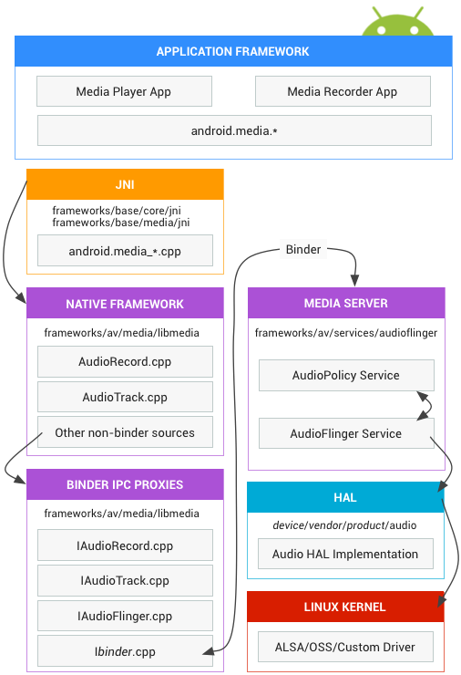

[toc]

## 音频

http://source.android.com/devices/audio/index.html

Android的音频HAL，连接高层的音频相关的框架API（位于包`android.media`），与底层的音频驱动和硬件。This section includes implementation instructions and tips for improving performance.

### 架构



**应用框架**

应用框架包括一些应用代码，它们使用 `android.media` API。内部，这些嗲吗调用相应的JNI。

**JNI**

与 `android.media` 相关的JNI位于 `frameworks/base/core/jni/` 和 `frameworks/base/media/jni`。

**原生框架**

The native framework provides a native equivalent to the `android.media` package, calling Binder IPC proxies to access the audio-specific services of the **media server**. 原生框架代码位于`frameworks/av/media/libmedia`。

**Binder IPC**

Binder IPC proxies facilitate communication over process boundaries. Proxies are located in `frameworks/av/media/libmedia` and begin with the letter "I".

**Media server**

**媒体服务器** 包含 **音频服务**，which are the actual code that interacts with your HAL implementations. The media server is located in `frameworks/av/services/audioflinger`.

**HAL**

The HAL defines the standard interface that audio services call into and that you must implement for your audio hardware to function correctly. The audio HAL interfaces are located in `hardware/libhardware/include/hardware`. For details, see [hardware/audio.h](http://source.android.com/devices/halref/audio_8h_source.html).

**内核驱动**

The audio driver interacts with your hardware and HAL implementation. 你可以使用 Advanced Linux Sound Architecture (ALSA)，Open Sound System (OSS)，或定制的驱动（HAL is driver-agnostic）。

Note: If you use ALSA, we recommend `external/tinyalsa` for the user portion of the driver because of its compatible licensing (the standard user-mode library is GPL-licensed).

**Android native audio based on Open SL ES (not shown)**

This API is exposed as part of Android NDK and is at the same architecture level as `android.media`.

### （未）术语

http://source.android.com/devices/audio/terminology.html

### 音频实现

http://source.android.com/devices/audio/implement.html

本届介绍如何实现音频HAL，如何配置共享库。

#### 实现HAL

音频HAL有三个接口组成，都必须实现：

- `hardware/libhardware/include/hardware/audio.h`：表示一个音频设备的主要功能。
- `hardware/libhardware/include/hardware/audio_policy.h`：represents the audio policy manager, which handles things like audio routing and volume control policies.
- `hardware/libhardware/include/hardware/audio_effect.h` - represents effects that can be applied to audio such as downmixing, echo, or noise suppression.

For an example, refer to the implementation for the Galaxy Nexus at `device/samsung/tuna/audio`.

除了实现HAL，你还需要创建一个 `device/<company_name>/<device_name>/audio/audio_policy.conf` 文件，表明你的产品有音频设备。For an example, see the file for the Galaxy Nexus audio hardware in `device/samsung/tuna/audio/audio_policy.conf`. Also, see the `system/core/include/system/audio.h` and `system/core/include/system/audio_policy.h` header files for a reference of the properties that you can define.

**Multi-channel support**

若你的硬件和驱动通过HDMI支持多通道（multichannel）音频，你可以将音频流直接送到音频硬件。This bypasses the `AudioFlinger` mixer so it doesn't get downmixed to two channels.

The audio HAL must expose whether an output stream profile supports multichannel audio capabilities. If the HAL exposes its capabilities, the default policy manager allows multichannel playback over HDMI.

For more implementation details, see the `device/samsung/tuna/audio/audio_hw.c` in the Android 4.1 release.

To specify that your product contains a multichannel audio output, edit the `audio_policy.conf` file to describe the multichannel output for your product. The following is an example from the Galaxy Nexus that shows a "dynamic" channel mask, which means the audio policy manager queries the actual channel masks supported by the HDMI sink after connection. You can also specify a static channel mask like `AUDIO_CHANNEL_OUT_5POINT1`.

```
audio_hw_modules {
  primary {
    outputs {
        ...
        hdmi {
          sampling_rates 44100|48000
          channel_masks dynamic
          formats AUDIO_FORMAT_PCM_16_BIT
          devices AUDIO_DEVICE_OUT_AUX_DIGITAL
          flags AUDIO_OUTPUT_FLAG_DIRECT
        }
        ...
    }
    ...
  }
  ...
}
```

`AudioFlinger`'s mixer downmixes the content to stereo automatically when sent to an audio device that does not support multichannel audio.

**Media codecs**

Ensure the audio codecs your hardware and drivers support are properly declared for your product. For details on declaring supported codecs, see [Exposing Codecs to the Framework](http://source.android.com/devices/media.html#expose).

#### 配置共享库

你需要将HAL实现打包成一个共享库，利用 `Android.mk` 将其拷贝到正确位置：

1、Create a `device/<company_name>/<device_name>/audio` directory to contain your library's source files.

2、Create an `Android.mk` file to build the shared library. Ensure that the Makefile contains the following line:

```
	LOCAL_MODULE := audio.primary.<device_name>
```

Notice your library must be named `audio_primary.<device_name>.so` so that Android can correctly load the library. The "primary" portion of this filename indicates that this shared library is for the primary audio hardware located on the device. The module names `audio.a2dp.<device_name>` and `audio.usb.<device_name>` are also available for bluetooth and USB audio interfaces. Here is an example of an Android.mk from the Galaxy Nexus audio hardware:

```
LOCAL_PATH := $(call my-dir)

include $(CLEAR_VARS)

LOCAL_MODULE := audio.primary.tuna
LOCAL_MODULE_RELATIVE_PATH := hw
LOCAL_SRC_FILES := audio_hw.c ril_interface.c
LOCAL_C_INCLUDES += \
        external/tinyalsa/include \
        $(call include-path-for, audio-utils) \
        $(call include-path-for, audio-effects)
LOCAL_SHARED_LIBRARIES := liblog libcutils libtinyalsa libaudioutils libdl
LOCAL_MODULE_TAGS := optional

include $(BUILD_SHARED_LIBRARY)
```

3、If your product supports low latency audio as specified by the Android CDD, copy the corresponding XML feature file into your product. For example, in your product's `device/<company_name>/<device_name>/device.mk` Makefile:

```
PRODUCT_COPY_FILES := ...

PRODUCT_COPY_FILES += \
frameworks/native/data/etc/android.android.hardware.audio.low_latency.xml:system/etc/permissions/android.hardware.audio.low_latency.xml \
```

4、Copy the `audio_policy.conf` file that you created earlier to the `system/etc/` directory in your product's `device/<company_name>/<device_name>/device.mk` Makefile. For example:

```
PRODUCT_COPY_FILES += \
        device/samsung/tuna/audio/audio_policy.conf:system/etc/audio_policy.conf
```

5、Declare the shared modules of your audio HAL that are required by your product in the product's `device/<company_name>/<device_name>/device.mk` Makefile. For example, the Galaxy Nexus requires the primary and bluetooth audio HAL modules:

```
PRODUCT_PACKAGES += \
        audio.primary.tuna \
        audio.a2dp.default
```

#### Audio pre-processing effects

The Android platform provides audio effects on supported devices in the `android.media.audiofx` package, which is available for developers to access. For example, on the Nexus 10, the following pre-processing effects are supported:

- [Acoustic Echo Cancellation](http://developer.android.com/reference/android/media/audiofx/AcousticEchoCanceler.html)
- [Automatic Gain Control](http://developer.android.com/reference/android/media/audiofx/AutomaticGainControl.html)
- [Noise Suppression](http://developer.android.com/reference/android/media/audiofx/NoiseSuppressor.html)

Pre-processing effects are paired with the use case mode in which the pre-processing is requested. In Android app development, a use case is referred to as an `AudioSource`; and app developers request to use the `AudioSource` abstraction instead of the actual audio hardware device. The Android Audio Policy Manager maps an `AudioSource` to the actual hardware with `AudioPolicyManagerBase::getDeviceForInputSource(int inputSource)`. The following sources are exposed to developers:

android.media.MediaRecorder.AudioSource.CAMCORDER
android.media.MediaRecorder.AudioSource.VOICE_COMMUNICATION
android.media.MediaRecorder.AudioSource.VOICE_CALL
android.media.MediaRecorder.AudioSource.VOICE_DOWNLINK
android.media.MediaRecorder.AudioSource.VOICE_UPLINK
android.media.MediaRecorder.AudioSource.VOICE_RECOGNITION
android.media.MediaRecorder.AudioSource.MIC
android.media.MediaRecorder.AudioSource.DEFAULT

The default pre-processing effects applied for each `AudioSource` are specified in the `/system/etc/audio_effects.conf` file. To specify your own default effects for every `AudioSource`, create a `/system/vendor/etc/audio_effects.conf` file and specify the pre-processing effects to turn on. For an example, see the implementation for the Nexus 10 in `device/samsung/manta/audio_effects.conf`. `AudioEffect` instances acquire and release a session when created and destroyed, enabling the effects (such as the Loudness Enhancer) to persist throughout the duration of the session.

> Warning: For the `VOICE_RECOGNITION` use case, do not enable the noise suppression pre-processing effect. It should not be turned on by default when recording from this audio source, and you should not enable it in your own `audio_effects.conf` file. Turning on the effect by default will cause the device to fail the compatibility requirement regardless of whether this was on by default due to configuration file , or the audio HAL implementation's default behavior.

The following example enables pre-processing for the VoIP `AudioSource` and Camcorder `AudioSource`. By declaring the `AudioSource` configuration in this manner, the framework will automatically request from the audio HAL the use of those effects.

```
pre_processing {
   voice_communication {
       aec {}
       ns {}
   }
   camcorder {
       agc {}
   }
}
```

**Source tuning**

For AudioSource tuning, there are no explicit requirements on audio gain or audio processing with the exception of voice recognition (`VOICE_RECOGNITION`).

The requirements for voice recognition are:

- "flat" frequency response (+/- 3dB) from 100Hz to 4kHz
- close-talk config: 90dB SPL reads RMS of 2500 (16bit samples)
- level tracks linearly from -18dB to +12dB relative to 90dB SPL
- THD < 1% (90dB SPL in 100 to 4000Hz range)
- 8kHz sampling rate (anti-aliasing)
-Effects/pre-processing must be disabled by default

Examples of tuning different effects for different sources are:

- Noise Suppressor
  - Tuned for wind noise suppressor for CAMCORDER
  - Tuned for stationary noise suppressor for VOICE_COMMUNICATION
- Automatic Gain Control
  - Tuned for close-talk for `VOICE_COMMUNICATION` and main phone mic
  - Tuned for far-talk for CAMCORDER

**More information**

For more information, see:

- Android documentation [for audiofx package](http://developer.android.com/reference/android/media/audiofx/package-summary.html)
- Android documentation for [Noise Suppression audio effect](http://developer.android.com/reference/android/media/audiofx/NoiseSuppressor.html)
- `device/samsung/manta/audio_effects.conf` file for the Nexus 10

### （及以下未）Audio Attributes

http://source.android.com/devices/audio/attributes.html

