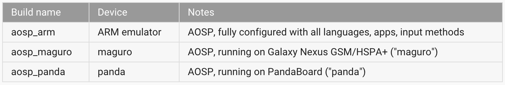

[toc]

https://source.android.com/source/index.html

## （未）概述

https://source.android.com/source/index.html

## 下载和构建

https://source.android.com/source/building.html

Android构建在Ubuntu LTS (14.04)上测过。但其他分发应该也行。

系统需求：

- A Linux or Mac system.
- Gingerbread (2.3.x)及以上需要64位系统。
- Checkout需要50GB；单次构建需要100GB；多次构建需要150GB或过多。If you employ **ccache**, you will need even more space.
- Python **2.6 -- 2.7**.
- GNU **Make 3.81 -- 3.82**, which you can download from gnu.org,
- JDK 7 to build the master branch of Android in the Android Open Source Project (AOSP); JDK 6 to build Gingerbread through KitKat; JDK 5 for Cupcake through Froyo. See *Initializing a Build Environment* for installation instructions by operating system.
- Git 1.7 or newer.

### 初始化构建环境

https://source.android.com/source/initializing.html

For an overview of the entire code-review and code-update process, see [Life of a Patch](https://source.android.com/source/life-of-a-patch.html).

选择一个分支。可选分支参见[列表](https://source.android.com/source/build-numbers.html)。

#### （未）Setting up a Linux build environment

#### 准备Mac OS构建环境

Mac OS默认的文件系统是大小写保留但case-insensitive。git不支持此类文件系统，会导致一些git命令出问题。因此我们推荐你使用一个case-sensitive文件系统。This can be done fairly easily using a disk image, discussed below.

Once the proper filesystem is available, building the master branch in a modern Mac OS environment is very straightforward. Earlier branches, including ICS, require some additional tools and SDKs.

##### 创建一个case-sensitive的磁盘镜像

You can create a case-sensitive filesystem within your existing Mac OS environment using a disk image. To create the image, launch Disk Utility and select "New Image". 最少需要25GB。Using sparse images saves space while allowing to grow later as the need arises. Be sure to select "case sensitive, journaled" as the volume format.

You can also create it from a shell with the following command:

	# hdiutil create -type SPARSE -fs 'Case-sensitive Journaled HFS+' -size 40g ~/android.dmg

This will create a `.dmg` (or possibly a `.dmg.sparsefile`) file which, once mounted, acts as a drive with the required formatting for Android development. For a disk image named "android.dmg" stored in your home directory, you can add the following to your `~/.bash_profile` to mount the image when you execute "mountAndroid":

	# mount the android file image
	function mountAndroid { hdiutil attach ~/android.dmg -mountpoint /Volumes/android; }

> Note: If your system created a `.dmg.sparsefile` file, replace `~/android.dmg` with `~/android.dmg.sparsefile`.

Once you've mounted, the android volume, you'll do all your work there. You can eject it (unmount it) just like you would with an external drive.

##### 安装JDK

The master and 5.0.x branches of Android in the Android Open Source Project (AOSP) require Java 7. On Mac OS, use **jdk-7u71-macosx-x64.dmg**.

To develop for versions of Android Gingerbread through KitKat, download and install the Java 6 version of the Java JDK.

##### 主分支

To build the latest source in a Mac OS environment, you will need an Intel/x86 machine running MacOS 10.8 (Mountain Lion) or later, along with **Xcode** 4.5.2 or later including the Command Line Tools.

##### Branch 5.0.x and earlier branches

To build 5.0.x and earlier source in a Mac OS environment, you will need an Intel/x86 machine running MacOS 10.8 (Mountain Lion), along with Xcode 4.5.2 and Command Line Tools.

##### Branch 4.4.x and earlier branches

To build 4.2.x and earlier source in a Mac OS environment, you will need an Intel/x86 machine running MacOS 10.6 (Snow Leopard) or MacOS 10.7 (Lion), along with Xcode 4.2 (Apple's Developer Tools). Although Lion does not come with a JDK, it should install automatically when you attempt to build the source.

下面内容只用于构建更早的分支。

##### Branch 4.0.x and all earlier branches

To build android-4.0.x and earlier branches in a Mac OS environment, you need an Intel/x86 machine running MacOS 10.5 (Leopard) or MacOS 10.6 (Snow Leopard). You will need the MacOS 10.5 SDK.

**安装所需的包**

Install Xcode from the Apple developer site. We recommend version 3.1.4 or newer, i.e. gcc 4.2. Version 4.x could cause difficulties.

Install MacPorts from macports.org.

Note: Make sure that `/opt/local/bin` appears in your path **BEFORE** `/usr/bin`. If not, add

	export PATH=/opt/local/bin:$PATH

to your `~/.bash_profile`.

Note: If you do not have a `.bash_profile` file in your home directory, create one.

Get make, git, and GPG packages from MacPorts:

	$ POSIXLY_CORRECT=1 sudo port install gmake libsdl git gnupg

If using Mac OS 10.4, also install **bison**:

	$ POSIXLY_CORRECT=1 sudo port install bison

**Reverting from make 3.82**

For versions of Android before ICS, there is a bug in gmake 3.82 that prevents android from building. You can install version **3.81** using **MacPorts** by taking the following steps:

Edit `/opt/local/etc/macports/sources.conf` and add a line that says

	file:///Users/Shared/dports

above the rsync line. Then create this directory:

	$ mkdir /Users/Shared/dports

In the new `dports` directory, run

	$ svn co --revision 50980 http://svn.macports.org/repository/macports/trunk/dports/devel/gmake/ devel/gmake/

Create a port index for your new local repository:

	$ portindex /Users/Shared/dports

Finally, install the old version of gmake with

	$ sudo port install gmake @3.81

**Setting a file descriptor limit**

On MacOS the default limit on the number of simultaneous file descriptors open is too low and a highly parallel build process may exceed this limit.

To increase the cap, add the following lines to your `~/.bash_profile`:

	# set the number of open files to be 1024
	ulimit -S -n 1024

### 下载源代码

https://source.android.com/source/downloading.html

#### 初始化Repo

**Repo** is a tool that makes it easier to work with Git in the context of Android. For more information about Repo, see the [Developing](https://source.android.com/source/developing.html) section.

To install Repo:

Make sure you have a **bin/** directory in your home directory and that it is included in your path:

    $ mkdir ~/bin
    $ PATH=~/bin:$PATH

Download the Repo tool and ensure that it is executable:

    $ curl https://storage.googleapis.com/git-repo-downloads/repo > ~/bin/repo
    $ chmod a+x ~/bin/repo

For version 1.17, the SHA-1 checksum for repo is ddd79b6d5a7807e911b524cb223bc3544b661c28

For version 1.19, the SHA-1 checksum for repo is 92cbad8c880f697b58ed83e348d06619f8098e6c

For version 1.20, the SHA-1 checksum for repo is e197cb48ff4ddda4d11f23940d316e323b29671c

For version 1.21, the SHA-1 checksum for repo is b8bd1804f432ecf1bab730949c82b93b0fc5fede

#### 初始化一个Repo客户端

创建一个工作目录。该目录要在一个大小写敏感的系统上。

    $ mkdir WORKING_DIRECTORY
    $ cd WORKING_DIRECTORY

运行`repo init`获取主分支。You must specify a URL for the manifest, which specifies where the various repositories included in the Android source will be placed within your working directory.

	$ repo init -u https://android.googlesource.com/platform/manifest

如果不想检出主分支，指定`-b`。

    $ repo init -u https://android.googlesource.com/platform/manifest -b android-4.0.1_r1

When prompted, configure Repo with your real name and email address. To use the Gerrit code-review tool, you will need an email address that is connected with a registered Google account. Make sure this is a live address at which you can receive messages. The name that you provide here will show up in attributions for your code submissions.

A successful initialization will end with a message stating that Repo is initialized in your working directory. Your client directory should now contain a **.repo** directory where files such as the manifest will be kept.

#### 下载Android代码树

To pull down the Android source tree to your working directory from the repositories as specified in the default manifest, run

	$ repo sync

The Android source files will be located in your working directory under their project names. The initial sync operation will take an hour or more to complete. For more about repo sync and other Repo commands, see the [Developing](https://source.android.com/source/developing.html) section.

#### Using Authentication

By default, access to the Android source code is anonymous. To protect the servers against excessive usage, each IP address is associated with a quota.

When sharing an IP address with other users (e.g. when accessing the source repositories from beyond a NAT firewall), the quotas can trigger even for regular usage patterns (e.g. if many users sync new clients from the same IP address within a short period).

In that case, it is possible to use authenticated access, which then uses a separate quota for each user, regardless of the IP address.

The first step is to create a password with the password generator and follow the instructions on the password generator page.

The second step is to force authenticated access, by using the following manifest URI: `https://android.googlesource.com/a/platform/manifest`. Notice how the `/a/` directory prefix triggers mandatory authentication. You can convert an existing client to use mandatory authentication with the following command:

	$ repo init -u https://android.googlesource.com/a/platform/manifest

#### 网络问题

When downloading from behind a proxy (which is common in some corporate environments), it might be necessary to explicitly specify the proxy that is then used by repo:

    $ export HTTP_PROXY=http://<proxy_user_id>:<proxy_password>@<proxy_server>:<proxy_port>
    $ export HTTPS_PROXY=http://<proxy_user_id>:<proxy_password>@<proxy_server>:<proxy_port>

More rarely, Linux clients experience connectivity issues, getting stuck in the middle of downloads (typically during "Receiving objects"). It has been reported that tweaking the settings of the TCP/IP stack and using non-parallel commands can improve the situation. You need root access to modify the TCP setting:

    $ sudo sysctl -w net.ipv4.tcp_window_scaling=0
    $ repo sync -j1

#### Using a local mirror

When using several clients, especially in situations where bandwidth is scarce, it is better to create a local mirror of the entire server content, and to sync clients from that mirror (which requires no network access). The download for a full mirror is smaller than the download of two clients, while containing more information.

These instructions assume that the mirror is created in /usr/local/aosp/mirror. The first step is to create and sync the mirror itself. Notice the `--mirror` flag, which can be specified only when creating a new client:

    $ mkdir -p /usr/local/aosp/mirror
    $ cd /usr/local/aosp/mirror
    $ repo init -u https://android.googlesource.com/mirror/manifest --mirror
    $ repo sync

Once the mirror is synced, new clients can be created from it. Note that it's important to specify an absolute path:

    $ mkdir -p /usr/local/aosp/master
    $ cd /usr/local/aosp/master
    $ repo init -u /usr/local/aosp/mirror/platform/manifest.git
    $ repo sync

Finally, to sync a client against the server, the mirror needs to be synced against the server, then the client against the mirror:

    $ cd /usr/local/aosp/mirror
    $ repo sync
    $ cd /usr/local/aosp/master
    $ repo sync

It's possible to store the mirror on a LAN server and to access it over NFS, SSH or Git. It's also possible to store it on a removable drive and to pass that drive around between users or between machines.

#### （未）Verifying Git Tags

### 构建与运行

The following instructions to build the Android source tree apply to all branches, including master.

#### 选择一个分支

Some of the requirements for your build environment are determined by which version of the source code you plan to compile. See Codenames, Tags, and Build Numbers for a full listing of branches you may choose from. You may also choose to download and build the latest source code (called master), in which case you will simply omit the branch specification when you initialize the repository.

The basic sequence of build commands is as follows:

#### 初始化

利用**envsetup.sh**脚本初始化环境。Note that replacing source with . (a single dot) saves a few characters, and the short form is more commonly used in documentation.

	$ source build/envsetup.sh

或

	$ . build/envsetup.sh

#### 选择一个目标

Choose which target to build with **lunch**. The exact configuration can be passed as an argument. For example, the following command:

	$ lunch aosp_arm-eng

refers to a complete build for the emulator, with all debugging enabled.

If run with no arguments **lunch** will prompt you to choose a target from the menu.

All build targets take the form `BUILD-BUILDTYPE`, where the `BUILD` is a codename referring to the particular feature combination. Here's a partial list:

and the BUILDTYPE is one of the following:

- **user**: 有限访问，适于产品
- **userdebug**: like "user" but with root access and debuggability; preferred for debugging
- **eng**: development configuration with additional debugging tools

#### 构建代码

Build everything with **make**. GNU make can handle parallel tasks with a `-jN` argument, and it's common to use a number of tasks N that's between 1 and 2 times the number of hardware threads on the computer being used for the build. For example, on a dual-E5520 machine (2 CPUs, 4 cores per CPU, 2 threads per core), the fastest builds are made with commands between make `-j16` and make `-j32`.

	$ make -j4

#### 运行

You can either run your build on an emulator or flash it on a device. Please note that you have already selected your build **target** with **lunch**, and it is unlikely at best to run on a different target than it was built for.

**Flash a Device**

To flash a device, you will need to use **fastboot**, which should be included in your path after a successful build. Place the device in fastboot mode either manually by holding the appropriate key combination at boot, or from the shell with

	$ adb reboot bootloader

Once the device is in fastboot mode, run

	$ fastboot flashall -w

The -w option wipes the **/data** partition on the device; this is useful for your first time flashing a particular device but is otherwise unnecessary.

For more information about building for and running on actual hardware, 见下一节。

**模拟一个Android设备**

The **emulator** is added to your path automatically by the build process. To run the emulator, type

	$ emulator

#### Using ccache

ccache is a compiler cache for C and C++ that can help make builds faster. In the root of the source tree, do the following:

    $ export USE_CCACHE=1
    $ export CCACHE_DIR=/<path_of_your_choice>/.ccache
    $ prebuilts/misc/linux-x86/ccache/ccache -M 50G

The suggested cache size is 50-100G.

On Linux, you can watch ccache being used by doing the following:

	$ watch -n1 -d prebuilts/misc/linux-x86/ccache/ccache -s

On Mac OS, you should replace linux-x86 with darwin-x86.

When using Ice Cream Sandwich (4.0.x) or older, you should replace **prebuilts/misc** with **prebuilt**.

#### 疑难解答

**错误的Java版本**

If you are attempting to build a version of Android inconsistent with your version of Java, make will abort with a message such as

    ************************************************************
    You are attempting to build with the incorrect version
    of java.

    Your version is: WRONG_VERSION.
    The correct version is: RIGHT_VERSION.

    Please follow the machine setup instructions at
        https://source.android.com/source/download.html
    ************************************************************

This may be caused by:

- Failing to install the correct JDK as specified in Initializing the Build Environment.
- Another JDK previously installed appearing in your path. Prepend the correct JDK to the beginning of your PATH or remove the problematic JDK.

**Python Version 3**

Repo is built on particular functionality from Python 2.x and is unfortunately incompatible with Python 3. In order to use repo, please install Python 2.x:

	$ apt-get install python

**Case Insensitive Filesystem**

If you are building on an HFS filesystem on Mac OS, you may encounter an error such as

    ************************************************************
    You are building on a case-insensitive filesystem.
    Please move your source tree to a case-sensitive filesystem.
    ************************************************************

**No USB Permission**

On most Linux systems, unprivileged users cannot access USB ports by default. If you see a permission denied error, follow the instructions 初始化构建环境 for configuring USB access.

If **adb** was already running and cannot connect to the device after getting those rules set up, it can be killed with `adb kill-server`. That will cause adb to restart with the new configuration.

### （未）Building for devices

https://source.android.com/source/building-devices.html

### （未）构建内核

https://source.android.com/source/building-kernels.html

