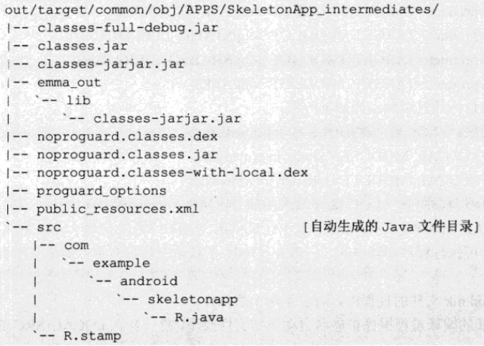

[toc]

## 2 编译结构和各种构建

### 2.2 各种部件的构建

使用了 envsetup 设置好环境变量后，可以通过 mmm 编译一个工程。

#### Android.mk 语法

Android.mk 语法跟普通 Makefile 略有不同。主要区别是 Android.mk 包含一些 Android 编译系统公共的宏。
Android.mk 中选项参考以下文件：`build/core/config.mk`。各个选项的默认值定义在文件`build/core/base_rules.mk`。

Android.mk文件只处理从根目录开始找到的第一个 Android.mk 文件。如果需要递归，需要在当前目录的 Android.mk 文件中作如下处理：

	# Android.mk 文件最后
    include $(call all-makefiles-under, $(LOCAL_PATH))

Android.mk 可以用于生成多个目标：可执行程序、动态库、静态库或Android应用程序。一个 Android.mk 可以生成多个目标。处理每个目标前调用`include $(CLEAR_VARS)`清理环境。

#### 各种部件的构建方式

##### 可执行程序

可执行程序师Linux标准ELF格式文件的一种，具有main入口，可以直接作为一个进程执行。在Android.mk 中编译一个可执行程序的模板如下：

	LOCAL_PATH := $(my-dir)
    include $(CLEAR_VARS)
    LOCAL_MODULE_TAGS := eng
    LOCAL_SRC_FILES := \
    	main.c
    LOCAL_MODULE := test_exe
    LOCAL_C_INCLUDES :=
    LOCAL_STATIC_LIBRARIES :=
    LOCAL_SHARED_LIBRARIES :=
    include $(BUILD_EXECUTABLE)

`LOCAL_C_INCLUDES`中指定依赖的头文件路径。`LOCAL_MODULE`决定最终生成的可执行程序的名称，这里是`test_one`。

一个可执行程序编译后生成独立的目标目录，在 `out/target/product/<TARGET_PRODUCT>/obj/EXECUATBLES/<LOCAL_MODULE>`。

##### 静态库

扩展名一般为`.a`。在 Android.mk 中编译一个静态库的模板如下：

	LOCAL_PATH := $(my-dir)
    include $(CLEAR_VARS)
    LOCAL_MODULE_TAGS := eng
    LOCAL_SRC_FILES := \
    	hello.c
    LOCAL_MODULE := libtest_static
    LOCAL_C_INCLUDES :=
    LOCAL_STATIC_LIBRARIES :=
    LOCAL_SHARED_LIBRARIES := libc
    include $(BUILD_STATIC_LIBRARY)

`LOCAL_MODULE`决定最终生成的静态库的名称是`libtest_static.a`。

一个静态库编译后生成的独立的目标目录，在 `out/target/product/<TARGET_PRODUCT>/obj/STATIC_LIBRARIES/<LOCAL_MODULE>`。

##### 动态库

动态库也称共享库，是Linux标准ELF格式文件的一种，扩展名常为`.so`。在 Android.mk 中编译一个动态库的模板如下：

	LOCAL_PATH := $(my-dir)
    include $(CLEAR_VARS)
    LOCAL_MODULE_TAGS := eng
    LOCAL_SRC_FILES := \
    	hello.c
    LOCAL_MODULE := libtest_shared
    TARGET_PRELINK_MODULE := false
    LOCAL_C_INCLUDES :=
    LOCAL_STATIC_LIBRARIES :=
    LOCAL_SHARED_LIBRARIES := libc
    include $(BUILD_SHARED_LIBRARY)

`LOCAL_MODULE`决定最终生成的静态库的名称是`libtest_shared.so`。

一个静态库编译后生成的独立的目标目录，在 `out/target/product/<TARGET_PRODUCT>/obj/SHARED_LIBRARIES/<LOCAL_MODULE>`。

##### Android应用程序

通常以apk作扩展名。在 Android.mk 中编译一个apk的模板如下：

	LOCAL_PATH := $(my-dir)
    include $(CLEAR_VARS)
    LOCAL_MODULE_TAGS := eng
    LOCAL_SRC_FILES := $(call all-subdir-java-files)
    LOCAL_PACKAGE_NAME := TestApplication
    include $(BUILD_PACKAGE)

在源码环境和在SDK中编译应用略有不同，涉及的目录主要有两个：

- `out/target/common/obj/APPS`：通用Javascript字节码目录。
- `out/target/product/<TARGET_PRODUCT>/obj/APPS`：Android应用包目录。

每个包在这两个目录中均具有名为`{LOCAL_PACKAGE_NAME}_intermediates/`的独立目录。离开如，对于SkeletonApp包的编译，公共目录生成结构如下：

一般都会根据资源目录res自动生成R.java文件。具有aidl时还会生成java源码。

SkeletonApp的目标目录 `out/target/product/<TARGET_PRODUCT>/obj/APPS/SkeletonApp_intermediates`其中包括3个apk包：

- 第一步生成的没有签名的包：package.apk.unsigned
- 第二步生成的具有签名但没有对齐的apk包：package.apk.unaligned
- 第三步生成的最终的apk包：package.apk

##### 总结

上述例子编译的是目标机的内容。编译可执行程序、静态库、动态库和Android应用程序包的编译宏分别是：

	include $(BUILD_EXECUTABLE)
    include $(BUILD_STATIC_LIBRARY)
    include $(BUILD_SHARED_LIBRARY)
    include $(BUILD_PACKAGE)

编译主机内容时，对应的宏：

	include $(BUILD_HOST_EXECUTABLE)
    include $(BUILD_HOST_STATIC_LIBRARY)
    include $(BUILD_HOST_SHARED_LIBRARY)

在 Android.mk 文件中，可以指定最后的目标安装路径。使用`LOCAL_MODULE_PATH`宏来指定模块的安装路径。

有几个表示文件系统路径的宏：

- `TARGET_ROOT_OUT` 表示根文件系统，路径为 `out/target/product/<TARGET_PRODUCT>/root`
- `TARGET_OUT` 表示system文件系统，路径为 `out/target/product/<TARGET_PRODUCT>/system`
- `TARGET_OUT_DATA` 表示data文件系统，路径为 `out/target/product/<TARGET_PRODUCT>/data`

#### 预编译内容的安装

除了编译，还需要向目标文件系统复制文件，或在目标文件系统中创建子目录。预编译内容的安装有两种方式，一是使用命令向文件系统复制，二是使用Android的预编译模板。

##### 使用命令

这种方式实际就是在 Android.mk 中调用主机的命令行，执行文件系统复制操作。

	LOCAL_PATH := $(call my-dir)
    include $(CLEAR_VARS)
    copy_from := \
    A.txt
    B.txt
    copy_to := $(addprefix $(TARGET_OUT)/txt/, $(copy_from))
    $(copy_to) : PRIVATE_MODULE := txt
    $(copy_to) : $(TARGET_OUT)/txt/% : $(LOCAL_PATH)/% | $(ACP)
    $(transform-prebuilt-to-target)
    ALL_PREBUILT = $(copy_to)
    DIR := $(addprefix $(TARGET_OUT)/, \
    txt \
    $(DIR):
    @echo Directory: $@
    @mkdir -p $@

`$(ACP)`是Android对cp命令的一个封装。上述代码在system文件系统（`TARGET_OUT`）中创建目录txt。将当前路径下的A.txt和B.txt复制到 system/txt 目录中。

##### 使用预编译模板的安装

Android具有一个特殊的预编译模板：`BUILD_PREBUILT`。使用这个模板可以将内容复制到目标系统中，也可以自动建立子目录。在Android中，使用预编译模板进程目录创建和安装的方法如下：

	LOCAL_PATH := $*(my-dir)
    include $(CLAER_VARS)
    LOCAL_MODULE := target.txt
    LOCAL_MODULE_CLASS := TEXT
    LOCAL_MOUDLE_TAGS := eng
    LOCAL_MODULE_PATH := $(TARGET_OUT)/text
    LOCAL_SRC_FILES := source.txt
    include $(BUILD_PREBUILT)

### （未）2.3 Android编译的板级支持

#### 2.3.1 支持一个板的工作

