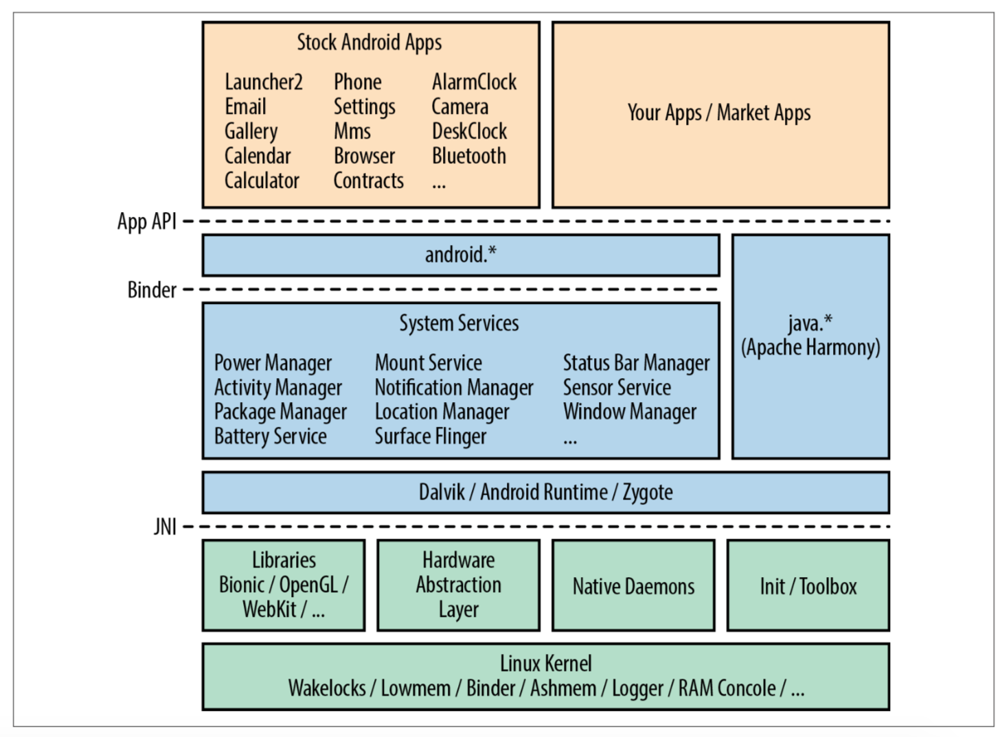
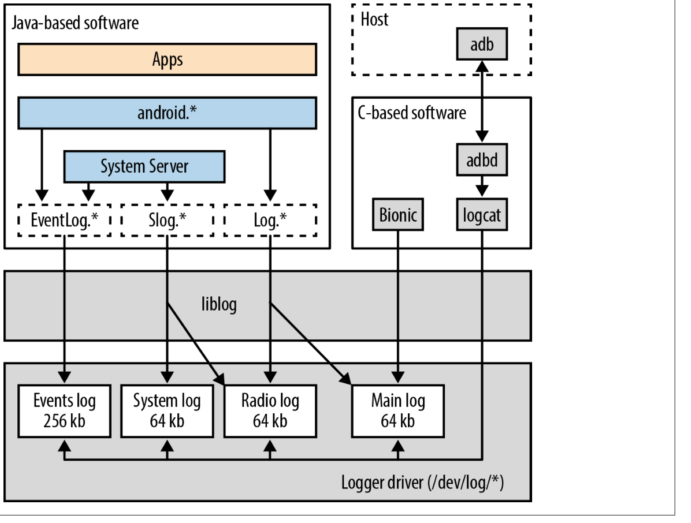
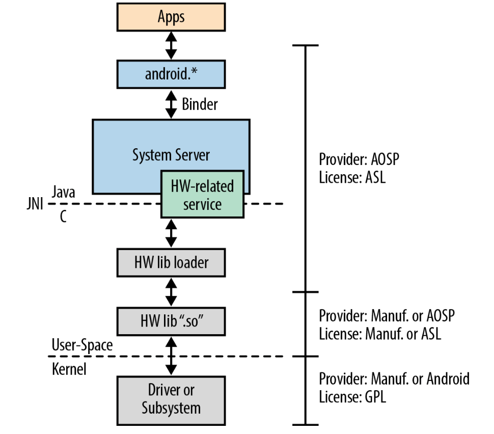
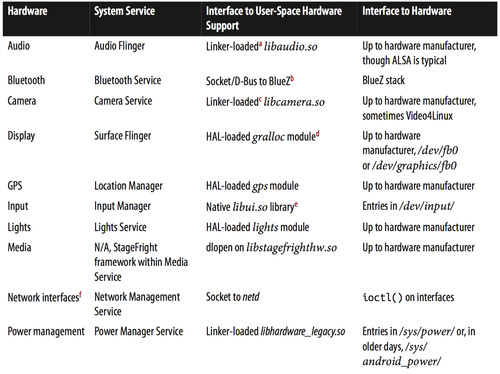
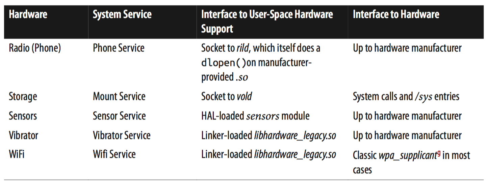

[toc]

## 2. 内部入门

### 2.1 应用开发者视角

Android定义了自己的RPC/IPC机制：Binder。因此跨组件的通讯不是使用典型的socket或System V IP；而是in-kernel Binder机制（可以通过**/dev/binder**服务）。

Android中的安全在进程级别得到加强。In other words, Android relies on Linux’s existing process isolation mechanisms to implement its own policies. 每个安装的app有自己的UID和GID，即每个app是系统中得独立的用户。

要退出沙箱，访问关键系统功能或资源，应用必须使用Android的权限机制；开发者需要在装箱文件中对权限进行静态的声明。系统预定了一些权限，如访问Internet。开发者可以自定义权限，其他使用的app可以申请。

#### NDK

That said, it’s crucial to understand that the NDK gives you access only to a very limited subset of the Android API.

Sometimes embedded and system developers coming to Android expect to be able to use the NDK to do platform-level work. The word “native” in the NDK can be misleading in that regard, because the use of the NDK still involves all the limitations and requirements that apply to Java app developers. So, as an embedded developer, remember that the NDK is useful for app developers to run native code that they can call from their Java code. Apart from that, the NDK will be of little to no use for the type of work you are likely to undertake.

### 2.2 整体架构

### 2.3 Linux内核

Android的用户空间组件依赖Android定制化的内核。Android定制的内核向标准内核打了几百个补丁，提供设备相关的功能、修改、增强。

尽管本书不会讨论Linux内核内部，但会涉及Android向内核添加的内容。下面几节介绍Android添加的最重要的东西。

**创建自己的Android化的内核**

若你想知道如何从头构建Android定制化的内核（例如假如你在SoC厂商工作），可以参考博客 **Androidization of linux kernel**，作者Vishal Bhoj。In this post, Vishal explains how to create an Androidized kernel using the **git rebase** command.

#### 2.3.1 Wakelocks

这可能是Android定制的部分中最有争议的。The discussion threads covering its inclusion in the mainline kernel generated close to 2,000 emails, and even then there was no clear path for merging the wakelock functionality. It was only after the 2011 Kernel Summit, where kernel developers agreed to merge most Androidisms into the mainline, that efforts were made to try to rehabilitate the wakelock mechanism or, as was ultimately decided, to create an equivalent that was more palatable to the rest of the kernel development community.

As of the end of May 2012, equivalents to the wakelocks and their correlated early suspend mechanisms have been merged into the mainline kernel. The early suspend replacement is called **autosleep**, and the wakelock mechanism has been replaced by a new `epoll()` flag called `EPOLLWAKEUP`. API因此与Android团队添加的原有的功能不同，但产生的功能是等效的。At the time of this writing, it’s expected that the new versions of the AOSP would start using the new mechanisms instead of the old ones.

要理解wakelock是什么做什么，必须先讨论电源管理在Linux中典型用法。如笔记本电脑，用户合上盖子后系统休眠。但这不适合手机。一个Android化的内核会尝试尽可能早的进入休眠。并保证系统做重要工作，或应用正在等待用户输入时，系统不会休眠；**wakelocks**就是用于保持系统醒着。

wakelocks和早期的挂起功能基于Linux存在的电源管理功能。However, they introduce a different development model, since application and driver developers must explicitly grab wakelocks whenever they conduct critical operations or must wait for user input. 应用开发者一般不需要直接处理wakelocks，因为它们使用的抽象已经自动负责请求锁。不过若想显式请求锁，可以与Power Manager Service通讯。Driver developers, on the other hand, can call on the added in-kernel wakelock primitives to grab and release wakelocks. 在驱动中使用wakelock的缺点是，驱动无法被推入主线内核，因为主线内核不支持wakelock。Given the recent inclusion of equivalent functionality into the mainline, this is no longer an issue.

The following LWN articles describe wakelocks in more detail and explain the various issues surrounding their inclusion in the mainline kernel:

- Wakelocks and the embedded problem
- From wakelocks to a real solution
- Suspend block
- Blocking suspend blockers
- What comes after suspend blockers
- An alternative to suspend blockers
- KS2011: Patch review
- Bringing Android closer to the mainline
- Autosleep and wake locks
- 3.5 merge window part 2

#### 2.3.2 Low-Memory Killer

Android开发团队向内核添加了一个额外的low-memory killer，且在默认的内核OOM killer之前。其策略参见应用开发文档。

Android’s low-memory killer is based on the OOM adjustments mechanism available in Linux that enables the enforcement of different OOM kill priorities for different processes. Basically, the OOM adjustments allow the user-space to control part of the kernel’s OOM killing policies. The OOM adjustments range from −17 to 15, with a higher number meaning the associated process is a better candidate for being killed if the system is out of memory.

Android therefore attributes different OOM adjustment levels to different types of processes according to the components they are running and configures its own low- memory killer to apply different thresholds for each category of process. This effectively allows it to preempt the activation of the kernel’s own OOM killer—which kicks in only when the system has no memory left—by kicking in when the given thresholds are reached, not when the system runs out of memory.

The user-space policies are themselves applied by the init process at startup (see “Init” on page 57), and readjusted and partly enforced at runtime by the Activity Manager Service, which is part of the System Server. The Activity Manager is one of the most important services in the System Server and is responsible for, among many other things, carrying out the component lifecycle presented earlier.

> Have a look at the Taming the OOM killer LWN article if you’d like to get more information regarding the kernel’s OOM killer and how An‐ droid traditionally builds on it.

At the time of this writing, Android’s low-memory killer is found in the kernel’s staging tree along with many of the other Android-specific drivers. Work is currently under way to rewrite this functionality within a more general framework for low-memory conditions. Have a look at the Userspace low memory killer daemon post to the Linux Kernel Mailing List (LKML) and the linux-vmevent patch for a glimpse of what’s currently being worked on. Essentially, the goal is to move the decision process about what to do in low-memory conditions to a daemon in user-space.

---

**Android and the Linux Staging Tree**

At the time of this writing, many of the drivers required to run Android have been merged into the staging tree. While this means they are still found in mainline kernels available at http://kernel.org, it also means that kernel developers believe those drivers require work before being considered mature enough to be merged alongside the “clean” set of drivers found in the rest of the kernel tree.

Specifically, many Android drivers are currently found in the drivers/staging/android directory of the kernel. They should remain there until they have been refactored or rewritten to suit the criteria for them to be admitted as official Linux drivers into the relevant location within the drivers/ directory.

If you aren’t familiar with the staging tree, have a look at Greg Kroah-Hartman’s3 The Linux Staging Tree, what it is and is not blog post from March 2009: “The Linux Staging tree (or just ‘staging’ from now on) is used to hold standalone drivers and filesystems that are not ready to be merged into the main portion of the Linux kernel tree at this point in time for various technical reasons. It is contained within the main Linux kernel tree so that users can get access to the drivers much easier than before, and to provide a common place for the development to happen, resolving the ‘hundreds of different download sites’ problem that most out-of-tree drivers have had in the past.”

---

#### 2.3.3 Binder

Binder一种跨进程通讯机制，类似于Windows的COM。它起源于BeOS及Palm，后来变成 **OpenBinder** 工程。

Android的 Binder 机制受之前的工作启发但其实现没有用 OpenBinder 的代码。它是 OpenBinder 的子集的重写。The OpenBinder Documentation remains a must-read if you want to understand the mechanism’s underpinnings and its design philosophy, and so is Dianne Hackborn’s explanation on the LKML of how the Binder is used in Android.

In essence, Binder attempts to provide remote object invocation capabilities on top of a classic OS. In other words, instead of reengineering traditional OS concepts, Binder “attempts to embrace and transcend them.” Hence, developers get the benefits of dealing with remote services as objects without having to deal with a new OS. It therefore becomes very easy to extend a system’s functionality by adding remotely invocable objects instead of implementing new daemons for providing new services, as would usually be the case in the Unix philosophy. The remote object can therefore be implemented in any desired language and may share the same process space as other remote services or have its own separate process. All that is needed to invoke its methods is its interface definition and a reference to it.

Binder 是 Android 架构的基础。通过它允许应用与System Server通讯，通过它使得应用可以与服务组件交互；但应用开发者不需要直接与 Binder 交互。Instead, they use the interfaces and stubs generated by the **aidl** tool. Even when apps interface with the System Server, the `android.*` APIs abstract its services, and the developer never actually sees that Binder is being used.

> System Server里的服务与应用开发者开发的服务组件是不同的概念。Most importantly, service components are subject to the same system mechanics as any other component. 运行在System Server中的服务，一般运行在系统权限，在启动后一直存活。The only things these two types of services share are: a) their name, and b) the use of Binder to interact with them.

Binder机制使用的内核驱动是一个字符设备，可以通过**/dev/binder**访问。It’s used to transmit parcels of data between the communicating parties using calls to `ioctl()`. It also allows one process to designate itself as the “Context Manager.” The importance of the Context Manager, along with the actual user-space use of the Binder driver, will be discussed in more detail later in this chapter.

Since the 3.3 release of the Linux kernel, the Binder driver has been merged into the staging tree. There is currently no project under way to clean this driver up or to rewrite it to make it applicable and/or useful for more general-purpose use in standard Linux desktop and server systems. It’s therefore likely to remain in drivers/staging/android/ for the foreseeable future.

#### 2.3.4 匿名共享内存 (ashmem)

Another IPC mechanism available in most OSes is shared memory. In Linux, this is usually provided by the POSIX SHM functionality, part of the System V IPC mechanisms. If you look at the bionic/libc/docs/SYSV-IPC.TXT file included in the AOSP, however, you’ll discover that the Android development team seems to have a dislike for SysV IPC. Indeed, the argument is made in that file that the use of SysV IPC mechanisms in Linux can lead to resource leakage within the kernel, opening the door for malicious or misbehaving software to cripple the system.

Though it isn’t stated as such by Android developers or any of the documentation within the ashmem code or surrounding its use, ashmem very likely owes part of its existence to SysV IPC’s shortcomings as seen by the Android development team. Ashmem is therefore described as being similar to POSIX SHM “but with different behavior.” For instance, it uses reference counting to destroy memory regions when all processes referring to them have exited, and will shrink mapped regions if the system is in need of memory. “Unpinning” a region allows it to be shrunk, whereas “pinning” a region disallows the shrinking.

Typically, a first process creates a shared memory region using ashmem, and uses Binder to share the corresponding file descriptor with other processes with which it wishes to share the region. Dalvik’s JIT code cache, for instance, is provided to Dalvik instances through ashmem. A lot of System Server components, such as the Surface Flinger and the Audio Flinger, rely on ashmem—through the IMemory interface, rather than directly.

> IMemory is an internal interface available only within the AOSP, not to app developers. The closest class exposed to app developers is Memory File.

At the time of this writing, the ashmem driver is included in the mainline’s `drivers/staging/android/` directory and is slated for rewriting.

#### 2.3.5 Alarm

将闹钟驱动添加到内核，是另一个例子，内核功能不满足Android的需求。Android的闹钟驱动实际建立在内核的 Real-Time Clock (RTC) 和 High-Resolution Timers (HRT) 之上。The kernel’s RTC functionality provides a framework for driver developers to create board-specific RTC functions, while the kernel exposes a single hardware-independent interface through the main RTC driver. The kernel HRT functionality, on the other hand, allows callers to get woken up at very specific points in time.

In “vanilla” Linux, application developers typically call the `setitimer()` system call to get a signal when a given time value expires; for more information, see the `setitimer()`’s man page. The system call allows for a handful of types of timers, one of which, `ITIMER_REAL`, uses the kernel’s HRT. This functionality, however, doesn’t work when the system is suspended. In other words, if an application uses `setitimer()` to request being woken up at a given time and then in the interim the device is suspended, that application will get its signal only when the device is woken up again.

Separately from the `setitimer()` system call, the kernel’s RTC driver is accessible through `/dev/rtc` and enables its users to use an `ioctl()` to, among other things, set an alarm that will be activated by the RTC hardware device in the system. That alarm will fire off whether the system is suspended or not, since it’s predicated on the behavior of the RTC device, which remains active even when the rest of the system is suspended.

Android’s alarm driver cleverly combines the best of both worlds. By default, the driver uses the kernel’s HRT functionality to provide alarms to its users, much like the kernel’s own built-in timer functionality. However, if the system is about to suspend itself, it programs the RTC so that the system gets woken up at the appropriate time. Hence, whenever an application from user-space needs a specific alarm, it just needs to use Android’s alarm driver to be woken up at the appropriate time, regardless of whether the system is suspended in the interim.

From user-space, the alarm driver appears as the `/dev/alarm` character device and allows its users to set up alarms and adjust the system’s time (wall time) through `ioctl()` calls. There are a few key AOSP components that rely on `/dev/alarm`. For instance, `Toolbox` and the `SystemClock` class, available through the app development API, rely on it to set/get the system’s time. Most importantly, though, the Alarm Manager service part of the System Server uses it to provide alarm services to apps that are exposed to app developers through the `AlarmManager` class.

Both the driver and Alarm Manager use the wakelock mechanism wherever appropriate to maintain consistency between alarms and the rest of Android’s wakelock-related behavior. Hence, when an alarm is fired, its consuming app gets the chance to do whatever operation is required before the system is allowed to suspend itself again, if need be.

At the time of this writing, Android’s alarm driver is in the kernel’s staging tree with upstreaming work pending.

#### 2.3.6 Logger

By default, most Linux distributions include two logging systems: the kernel’s own log, typically accessed through the **dmesg** command, and the system logs, typically stored in files in the `/var/log` directory. The kernel’s log usually contains the messages printed out by the various printk() calls made within the kernel, either by core kernel code or by device drivers. For their part, the system logs contain messages coming from various daemons and utilities running in the system. In fact, you can use the logger command to send your own messages to the system log.

With regard to Android, the kernel’s logging functionality is used as is. However, none of the usual system logging software packages typically found in most Linux distributions are found in Android. Instead, Android defines its own logging mechanisms based on the Android logger driver added to the kernel. The classic syslog relies on sending messages through sockets, and therefore generates a task switch. It also uses files to store its information, therefore generating writes to a storage device. In contrast, Android’s logging functionality manages a handful of separate kernel-hosted buffers for logging data coming from user-space. Hence, no task-switches or file-writes are required for each event being logged. Instead, the driver maintains circular buffers in RAM where it logs every incoming event and returns immediately back to the caller.

There are numerous benefits to avoiding file-writes in the settings in which Android is used. For example, unlike in a desktop or server environment, it isn’t necessarily desirable to have a log that grows indefinitely in an embedded system. It’s also desirable to have a system that enables logging even though the filesystem types used may be readonly. Furthermore, most Android devices rely on solid-state storage devices, which have a limited number of erase cycles. Avoiding superfluous writes is crucial in those cases.

Because of its lightweight, efficient, and embedded-system-friendly design, Android’s logger can actually be used by user-space components at runtime to regularly log events. In fact, the Log class available to app developers more or less directly invokes the logger driver to write to the main event buffer. Obviously, all good things can be abused, and it’s preferable to keep the logging light, but still the level of use made possible by exposing Log through the app API, along with the level of use of logging within the AOSP itself, likely would have been very difficult to sustain had Android’s logging been based on syslog.

Figure 2-2 describes Android’s logging framework in more detail. As you can see, the logger driver is the core building block on which all other logging-related functionality relies. Each buffer it manages is exposed as a separate entry within /dev/log/. However, no user-space component directly interacts with that driver. Instead, they all rely on liblog, which provides a number of different logging functions. Depending on the functions being used and the parameters being passed, events will get logged to different buffers. The liblog functions used by the Log and Slog classes, for instance, will test whether the event being dispatched comes from a radio-related module. If so, the event is sent to the “radio” buffer. If not, the Log class will send the event to the “main” buffer, whereas the Slog class will send it to the “system” buffer. The “main” buffer is the one whose events are shown by the logcat command when it’s issued without any parameters.

Both the Log and EventLog classes are exposed through the app development API, while Slog is for internal AOSP use only. Despite being available to app developers, though, EventLog is clearly identified in the documentation as mainly for system integrators, not app developers. In fact, the vast majority of code samples and examples provided as part of the developer documentation use the Log class. Typically, EventLog is used by system components to log binary events to the Android’s “events” buffer. Some system components, especially System Server−hosted services, will use a combination of Log, Slog, and EventLog to log different events. An event that might be relevant to app developers, for instance, might be logged using Log, while an event relevant to platform developers or system integrators might be logged using either Slog or EventLog.

Note that the logcat utility, which is commonly used by app developers to dump the Android logs, also relies on liblog. In addition to providing access functions to the logger driver, liblog also provides functionality for formatting events for pretty printing and filtering. Another feature of liblog is that it requires every event being logged to have a priority, a tag, and data. The priority is either verbose, debug, info, warn, or error. The tag is a unique string that identifies the component or module writing to the log, and the data is the actual information that needs to be logged. This description should in fact sound fairly familiar to anyone exposed to the app development API, as this is exactly what’s spelled out by the developer documentation for the Log class.

The final piece of the puzzle here is the adb command. As we’ll discuss later, the AOSP includes an Android Debug Bridge (ADB) daemon that runs on the Android device and that is accessed from the host using the adb command-line tool. When you type adb logcat on the host, the daemon actually launches the logcat command locally on the target to dump its “main” buffer and then transfers that back to the host to be shown on the terminal.

At the time of this writing, the logger driver has been merged into the kernel’s drivers/staging/android/ directory. Have a look at the Mainline Android logger project for more information regarding the state of this driver’s mainlining.

#### 2.3.7 Other Notable Androidisms

A few other Androidisms, in addition to those already covered, are worth mentioning, even if I don’t cover them in much detail.

**Paranoid networking**
Usually in Linux, all processes are allowed to create sockets and interact with the network. Per Android’s security model, however, access to network capabilities has to be controlled. Hence, an option is added to the kernel to gate access to socket creation and network interface administration based on whether the current pro‐ cess belongs to a certain group of processes or possesses certain capabilities. This applies to IPv4, IPv6, and Bluetooth.
At the time of this writing, this functionality hasn’t been merged into the mainline, and the path for its inclusion is unclear. You could run an AOSP on a kernel that doesn’t have this functionality, but Android’s permission system, especially with regard to socket creation, would be broken.

**RAM console**
As I mentioned earlier, the kernel manages its own log, which you can access using the dmesg command. The content of this log is very useful, as it often contains critical messages from drivers and kernel subsystems. On a crash or a kernel panic, its content can be instrumental for postmortem analysis. Since this information is typically lost on reboot, Android adds a driver that registers a RAM-based console that survives reboots and makes its content accessible through /proc/last_kmsg.
At the time of this writing, the RAM console’s functionality seems to have been merged into mainline within the pstore filesystem in the kernel’s fs/pstore/ directory.

**Physical memory (pmem)**
Like ashmem, the pmem driver allows for sharing memory between processes. However, unlike ashmem, it allows the sharing of large chunks of physically con‐ tiguous memory regions, not virtual memory. In addition, these memory regions may be shared between processes and drivers. For the G1 handset, for instance, pmem heaps are used for 2D hardware acceleration. Note, though, that pmem was used in very few devices. In fact, according to Brian Swetland, one of the Android kernel development team members, it was written to specifically address the MSM7201A’s limitations, the MSM7201A being the SoC in the G1.
At the time of this writing, this driver is considered obsolete and has been dropped. It isn’t found in the mainline kernel, and there are no plans to revive it. It appears that the ION memory allocator is poised to replace whatever uses pmem had.

### 2.4 硬件支持

Android的硬件支持方式与Linux内核和其他Linux分发显著不同。具体来说，硬件支持实现的方式，硬件支持之上的抽象，许可证和分发代码上的心态都是不同的。

#### 2.4.1 Linux的方式

Linux支持新硬件的常见方式是，创建设备驱动（内建到内核或者在启动时动态加载）。相应的硬件可被用户空间通过`/dev`访问。Linux驱动模型定义了三种基本类型的设备：字符设备（字节流）、块设备（基本上是磁盘）和网络设备。后来又增加了USB和Memory Technology Device (MTD)设备。然而，API和与`/dev`交互的方式基本是稳定不变的。

#### 2.4.2 Android的通用方法

从技术层面将，最大的区别是子系统和库不通过标准`/dev`。Android栈一般利用厂商的**共享库**与硬件交互。实际上，Android依赖Hardware Abstraction Layer (HAL)。但不同类型的、抽象硬件组件的接口、行为、函数差别非常大。

而且在Linux分发中常见的与硬件交互的软件栈未出现在Android中。例如，没有X Window系统；虽然有时会用到ALSA音频驱动，但这时硬件厂商决定基于它实现供HAL使用的硬件共享库。在桌面环境中典型的、与ALSA驱动交互的ALSA库，未出现在官方AOSP树中。Instead, recent Android releases include a BSD-licensed **tinyalsa** library as a replacement.

下图展示了，硬件被Android抽象和支持的典型方式，及分发和许可证方式。Android最终仍要依赖内核访问硬件，但是通过共享库完成的。你可以把HAL层看做硬件库的加载器，along with the header files defining the various hardware types, with those same header files being used as the API definitions for the hardware library .so files.

共享库的许可证取决于厂商。Hence, a device manufacturer can create a simplistic device driver that implements the most basic primitives to access a given piece of hardware and make that driver available under the GPL. Not much would be revealed about the hardware, since the driver wouldn’t do anything fancy. That driver would then expose the hardware to user-space through `mmap()` or `ioctl()`, and the bulk of the intelligence would be implemented within a proprietary shared library in user-space that uses those functions to drive the hardware.

Android未规定共享库与驱动或内核该如何交互。只是共享库提供给上层的API由HAL定义。Hence, it’s up to you to determine the specific driver interface that best fits your hardware, so long as the shared library you provide implements the appropriate API. Nevertheless, we will cover the typical methods used by Android to interface to hardware in the next section.

硬件支持共享库被上层加载的方式不是太一致。每种设备类型都必须有一个.so文件，由AOSP或者我们自己提供。不管如何加载，会有一个与硬件类型对应的**系统服务**负责加载共享库并与之交互。If you’re adding support for a given type of hardware, it’s therefore crucial that you try to understand in as much detail as possible the internals of the system service corresponding to your hardware. 系统服务一般分为两部分：一部分是Java的，另一部分是C/C++，主要负责与HAL交互。

#### 2.5.3 加载和接口的方式

系统服务和Android与共享库的交互方式有几种。It’s difficult to fully understand why there is such a variety of methods, but I suspect that some of them evolved organically. 幸运的是，看似大家正向统一迈进。Given that Android moves at a fairly rapid pace, this is one area that will require keeping an eye on for the foreseeable future, as it’s likely to evolve.

Note that the methods described here are not necessarily mutually exclusive. Often a combination of these is used within the Android stack to load and interface with a shared library or some software layer before or after it. I’ll cover specific hardware in the next section.

**dlopen() - 通过HAL加载**

适用于：GPS, Lights, Sensors, and Display. Also applies to Audio and Camera starting from 4.0/Ice-Cream Sandwich.

一些共享库由*libhardware*库加载。该库是Android HAL的一部分，对外暴露`hw_get_module()`，供系统服务显式加载一个特定的硬件支持共享库（即HAL词汇中的模块“module”）。`hw_get_module()`仍利用经典的`dlopen()`将共享库加载到调用者的地址空间。

> HAL “modules” shouldn’t be confused with loadable kernel modules, which are a completely different and unrelated software construct, even though they share some similar properties.

**Linker-loaded .so files**

Applies to: Audio, Camera, Wifi, Vibrator, and Power Management

In some cases, system services are simply linked against a given .so file at build time. Hence, when the corresponding binary is run, the dynamic linker automatically loads the shared library into the process’s address space.

**Hardcoded dlopen()s**

Applies to: StageFright and Radio Interface Layer (RIL)

In a few cases, the code invokes dlopen() directly instead of going through lib hardware to fetch a hardware-enabling shared library. The rationale for using this method instead of the HAL is unclear.

**Sockets**

Applies to: Bluetooth, Network Management, Disk Mounting, and Radio Interface Layer (RIL)

Sockets are sometimes used by system services or framework components to talk to a remote daemon or service that actually interacts with the hardware.

**Sysfs entries**

Applies to: Vibrator and Power Management

Some entries in sysfs (/sys) can be used to control the behavior of hardware and/or kernel subsystems. In some cases, Android uses this method instead of /dev entries to control the hardware. Use of sysfs entries instead of /dev nodes makes sense, for instance, when defaults need to be set during system initialization when no part of the framework is yet running.

**/dev nodes**

Applies to: Almost every type of hardware

Arguably, any hardware abstraction must at some point communicate with an entry in `/dev`, because that’s how drivers are exposed to user-space. Some of this communication is likely hidden from Android itself because it interacts with a shared library instead, but in some corner cases AOSP components directly access device nodes. Such is the case of input libraries used by the Input Manager.

**D-Bus**

Applies to: Bluetooth

D-Bus is a classic messaging system found in most Linux distributions for facilitating communication between various desktop components. It’s included in Android because it’s the prescribed way for a non-GPL component to talk to the GPL- licensed BlueZ stack—Linux’s default Bluetooth stack and the one used in Android —without being subject to the GPL’s redistribution requirements; D-Bus itself being dual-licensed under the Academic Free License (AFL) and the GPL. Have a look at freedesktop.org’s D-Bus page for more information.

Given that BlueZ has been removed from the AOSP starting with 4.2/Jelly Bean, it’s unclear what uses D-Bus will have, if any, in future Android releases.

#### 2.5.4 硬件支持的细节

下表总结了Android支持各种硬件的方式。若你要实现对某种硬件的支持，最好的方式是参考已存在的样例实现。The AOSP typically includes hardware support code for a few handsets, generally those that were used by Google to develop new Android releases and therefore served as lead devices. Sometimes the sources for hardware support are quite extensive, as was the case for the Samsung Nexus S (a.k.a. “Crespo,” its code name) in Gingerbread, and the Galaxy Nexus (a.k.a. “Maguro”) and the Nexus 7 (a.k.a. “Grouper”) in Jelly Bean.

The only type of hardware for which you are unlikely to find publicly available implementations on which to base your own is the RIL. For various reasons, it’s best not to let everyone be able to play with the airwaves. Hence, manufacturers don’t make such implementations available. Instead, Google provides a reference RIL implementation in the AOSP should you want to implement a RIL.

a This is HAL-loaded starting with 4.0/Ice-Cream Sandwich.
b BlueZ has been removed starting with 4.2/Jelly Bean. A Broadcom-supplied Bluetooth stack called bluedroid has replaced it. The new Bluetooth stack relies on HAL-loading like most other hardware types.
c This is HAL-loaded starting with 4.0/Ice-Cream Sandwich.
d The module used by the Surface Flinger is hwcomposer starting with 4.0/Ice-Cream Sandwich
e This has been replaced by the libinput.so library starting with 4.0/Ice-Cream Sandwich.
f This is for Tether, NAT, PPP, PAN, USB RNDIS (Windows). It isn’t for WiFi.
g wpa_supplicant is the same software package used on any Linux desktop to manage WiFi networks and connections.

### xxx 2.5 Native User-Space

### 2.6 Dalvik and Android’s Java

In a nutshell, Dalvik is Android’s Java virtual machine. It allows Android to run the byte-code generated from Java-based apps and Android’s own system components and provides both with the required hooks and environment to interface with the rest of the system, including native libraries and the rest of the native user-space.

For more information about the features and internals of Dalvik, I strongly encourage you to take a look at Dan Bornstein’s Google I/O 2008 presentation entitled “Dalvik Virtual Machine Internals.” It’s about one hour long and available on YouTube. You can also just go to YouTube and search for “Dan Bornstein Dalvik.”

A feature of Dalvik very much worth highlighting, though, is that since 2.2/Froyo it has included a Just-in-Time (JIT) compiler for ARM, with x86 and MIPS having been added since. Historically, JIT has been a defining feature for many VMs, helping them close the gap with noninterpreted languages. Indeed, having a JIT means that Dalvik converts apps’ byte-codes to binary assembly instructions that run natively on the target’s CPU instead of being interpreted one instruction at a time by the VM. The result of this conversion is then stored for future use. Hence, apps take longer to load the first time, but once they’ve been JIT’ed, they load and run much faster. The only caveat here is that JIT is available for a limited number of architectures only, namely ARM, x86, and MIPS.

#### 2.6.1 Java Native Interface (JNI)

A large part of the heavy lifting to allow Java to communicate with other languages through JNI is actually done by Dalvik. If you go back to Table 2-3 in the previous section, for instance, you’ll notice the **libnativehelper.so** library, which is provided as part of Dalvik for facilitating JNI calls.

Appendix B shows an example use of JNI to interface Java and C code. There is one authoritative book on the topic, The Java Native Interface Programmer’s Guide and Specification by Sheng Liang (Addison-Wesley, 1999).

### xxx 2.7 系统服务

### xxx 2.8 AOSP自带的应用

### xxx 2.9 系统启动
