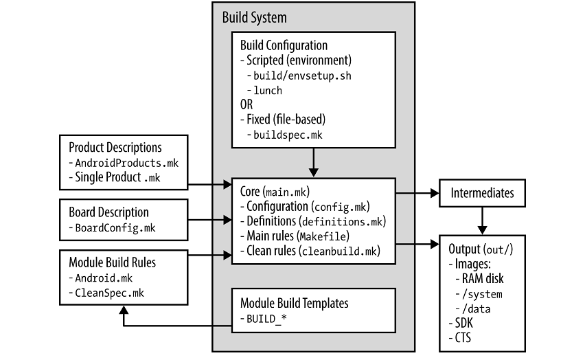
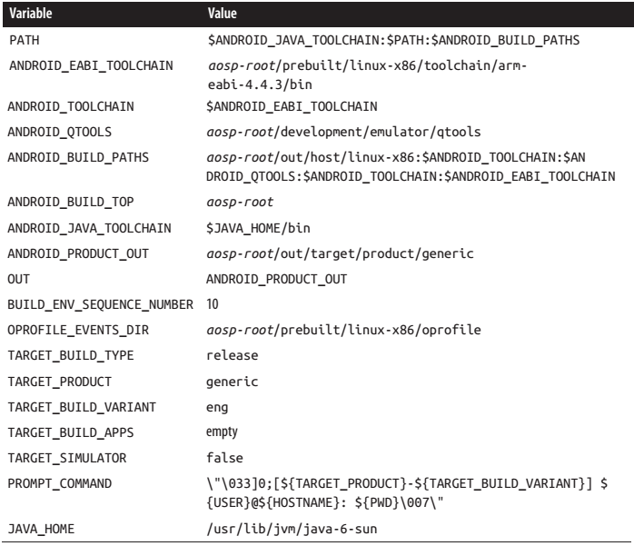
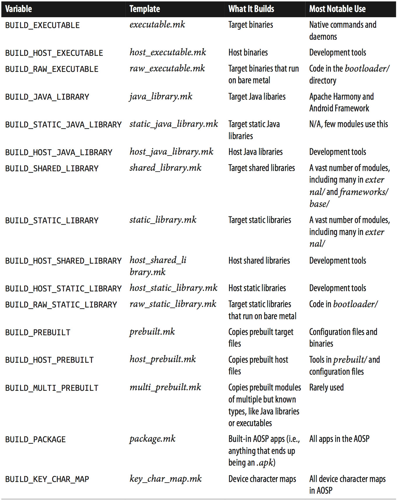
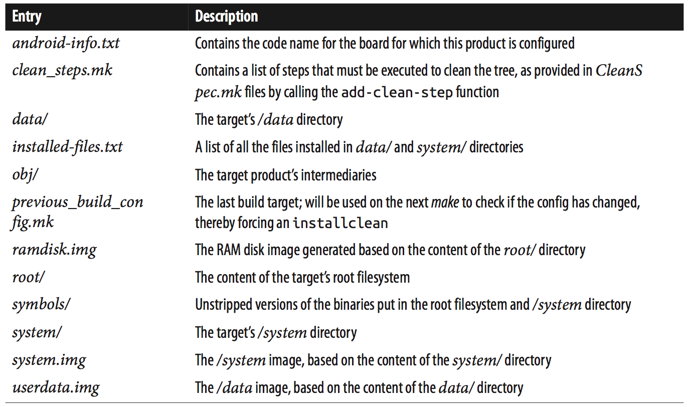
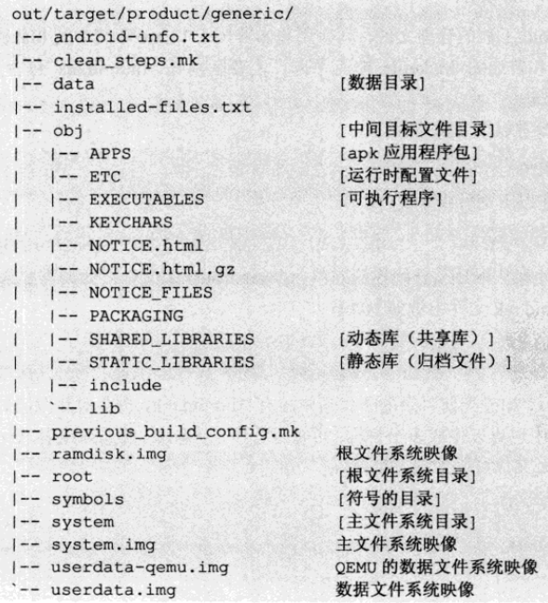

[toc]

## 4. 构建系统

Android 构建系统很特别。虽使用 **make**，但用法特别。

### 4.1 与其他构建系统比较

与多数基于 make 的构建系统不同，Android 构建系统不依赖**递归的 makefile**：如  Linux 内核，有一个顶级的 makefile，会自动调用子目录的 makefile。
而 Android，用一个脚本检查所有目录和子目录，直到发现一个 **Android.mk** 文件，就不再继续搜寻了。
总结：Android 不依赖 Makefile。是 **Android.mk** 文件决定本地模块如何构建。

> 有多少个模块？2.3.7 有 1143 个，4.2 有 2,037 个。

Android 的另一个特殊性是构建系统的配置方法。Android 依赖一组变量，这些变量有的通过**Shell环境变量**动态设置（通过 envsetup.sh 和 lunch），有的在 buildspec.mk 中静态定义。总体来说能对 Android 构建系统做的配置是相当有限的。没有办法禁用某些特性，比如不想要 Location Service。

构建系统不产生对象文件（`.o`）或其他中间文件。所有的构建结果都放在 `out/` 目录。因此 `make clean` 等价于 `rm -rf out/`。

构建系统与 GNU make 耦合的非常紧密。特别是**版本3.81**；即使3.82往往也需要打补丁。构建系统其实非常依赖一些 GNU make 特有的特性，如 define, include, ifndef 指令。

如果你想深入了解下 Android 的构建系统为何这样设计，参见AOSP的 **build/core/buildsystem.html** 文件。It’s dated May 2006 and seems to have been the document that went around within the Android dev team to get consensus on a rework of the build system. Some of the information and the hypothesis are out of date or have been obsoleted, but most of the nuggets of the current build system are there. In general, I’ve found that the further back the document was created by the Android dev team, the more insightful it is regarding raw motivations and technical background. Newer documents tend to be “cleaned up” and abstract, if they exist at all.

若你想了解 Android 构建系统为什么不用递归的 **make**，参见论文 “Recursive Make Considered Harmful” by Peter Miller in AUUGN Journal of AUUG Inc., 19(1), pp. 14−25. The paper explores the issues surrounding the use of recursive makefiles and explains a different approach involving the use of a single global makefile for building the entire project based on module-provided .mk files, which is exactly what Android does.

### 4.2 架构

Android 源码的根目录有一个 `Makefile` 文件。其内容如下：

	### DO NOT EDIT THIS FILE ###
    include build/core/main.mk
    ### DO NOT EDIT THIS FILE ###

这个 **Makefile** 其实是在 `repo sync` 阶段，由 `build/core/rook.mk` 拷贝来的。即底层的 Makefile 文件即 `build/core/rook.mk`。

Android构建系统的入口是 `build/core/main.mk` 文件。该文件一段内容如下：

	.PHONY: droid
    DEFAULT_GOAL := droid
    $(DEFAULT_GOAL):

即，make 的默认目标是`droid`。除了该目标，main.mk 还定义了几个重要的目标，如 `make docs` 是生成文档。此外还有：

- ramdisk：生成 RAM disk 镜像
- bootimage：生成启动镜像
- systemimage：生成系统镜像
- userdataimage：生成用户数据镜像
- apps_only：仅生成应用程序

除此之外，`showcommands` 也是一个有用的辅助目标，可以列出编译时详细执行的各个命令。

手工在目标文件系统中添加了内容，需要通过手动制作得到文件系统镜像。例如，默认情况下制作 yaffs2 格式的镜像文件方法如下：

	$ ./out/host/linux-x86/bin/mkyaffs2image -f out/target/product/generic/system out/target/product/generic/system.img
    $ ./out/host/linux-x86/bin/mkyaffs2image -f out/target/product/generic/data out/target/product/generic/userdata.img

记住，Android 的构建系统会把所有东西放入单个 makefile。因此每个 .mk 文件最终都会成为单个巨大的 makefile 的一部分。每次输入 `make` 后构建系统看上去会挂起一段时间。这段时间，系统将每个 Android.mk 进行整合，完成后才开始常规的构建工作。

#### 4.2.1 配置

构建系统首先要通过引入 config.mk 配置构建系统。配置构建系统有两种方式：一是通过 envsetup.sh 和 lunch 命令，二是在目录顶层放置一个 buildspec.mk 文件。不管通过何种方式，都需要设置变量：`TARGET_PRODUCT`。

要构建什么口味的 Android。每道菜单包含了不同的应用、语言或构建树的不同部分。看一下被 AndroidProducts.mk 文件引入到各个产品 .mk 文件，它们在  build/target/product/ 、 device/samsung/crespo/、 device/htc/passion/ 目录下（2.3）。对于 4.2，查看 device/asus/grouper/ 和 device/samsung/amgnuro/ 目录。`TARGET_PRODUCT` 取值如下：

- `generic`：最简单的构建
- `full`：带多数应用和主要语言
- `full_crespo`：类似于full，但是为Crespo (Samsung Nexus S).
- `full_grouper`：Same as full but for Grouper (Asus Nexus 7)
- `sim`：Android simulator. 4.2已移除该目标。要理解**simulator**与**emulator**完全不同的两个概念。
- `sdk`：The SDK; includes a vast number of locales.

`TARGET_BUILD_VARIANT`

选择安装哪些模块。每个模块的 Android.mk 中都应该包含一个 `LOCAL_MODULE_TAGS` 变量，值至少包含下面几个值中的一个：`user`, `debug`, `eng`, `tests`, `optional`, `samples`。`TARGET_BUILD_VARIANT` 决定构建包含哪个模块的子集。这些规则不影响包模块（即产生 `.apk` 的模块）。

- eng：包含标记为 user, debug 或 eng 的所有模块
- userdebug：包含标记为 user 和 debug 的模块
- user：只包含标记为 user 的模块

`TARGET_BUILD_TYPE`

Dictates whether or not special build flags are used or `DEBUG` variables are defined in the code. 可选的两个取值是 `release` 或 `debug`。Most notably, the `frameworks/base/Android.mk` file chooses between either `frameworks/base/core/config/debug` or `frameworks/base/core/config/ndebug`, depending on whether or not this variable is set to `debug`. The former causes the `ConfigBuildFlags.DEBUG` Java constant to be set to `true`, whereas the latter causes it to be set to `false`. Some code in parts of the system services, for instance, is conditional on `DEBUG`. Typically, `TARGET_BUILD_TYPE` is set to `release`.

`TARGET_TOOLS_PREFIX`

By default, the build system will use one of the cross-development toolchains **shipped** with it underneath the **prebuilt/** directory — **prebuilts/** as of 4.2. However, if you’d like it to use another toolchain, you can set this value to point to its location.

`OUT_DIR`

默认所有构建都输出到 `out/`。通过该变量修改输出位置。

`BUILD_ENV_SEQUENCE_NUMBER`

If you use the template `build/buildspec.mk.default` to create your own `buildspec.mk` file, this value will be properly set. However, if you create a `buildspec.mk` with an older AOSP release and try to use it in a future AOSP release that contains important changes to its build system and, hence, a different value, this variable will act as a safety net. It will cause the build system to inform you that your build `spec.mk` file doesn’t match your build system.

In addition to selecting which parts of the AOSP to build and which options to build them with, the build system also needs to know about the target it’s building for. This is provided through a `BoardConfig.mk` file, which will specify things such as 内核的命令行，内核要加载到的地址，最适合CPU的指令集版本（`TARGET_ARCH_VARIANT`）。Have a look at `build/target/board/` for a set of per-target directories that each contain a `BoardConfig.mk` file. Also have a look at the various `device/*/TARGET_DEVICE/BoardConfig.mk `files included in the AOSP. 后者比前者更丰富，因为它们包含更多硬件相关的信息。The device name (i.e., `TARGET_DEVICE`) is derived from the `PRODUCT_DEVICE` specified in the `product.mk` file provided for the `TARGET_PRODUCT` set in the configuration. In 2.3, for example, `device/samsung/crespo/AndroidProducts.mk` includes `device/samsung/crespo/full_crespo.mk`, which sets `PRODUCT_DEVICE` to `crespo`. Hence, the build system looks for a `BoardConfig.mk` in `device/*/crespo/`, and there happens to be one at that location. The same goes on in 4.2 for the `PRODUCT_DEVICE` set in `device/asus/grouper/full_grouper.mk` to grouper, thereby pointing the build system to `device/*/grouper/BoardConfig.mk`.

The final piece of the puzzle with regard to configuration is the CPU-specific options used to build Android. 对于ARM，它们在 `build/core/combo/arch/arm/armv*.mk`，其中`TARGET_ARCH_VARIANT`决定实际使用的文件。Each file lists CPU-specific cross-compiler and cross-linker flags used for building C/C++ files. They also contain a number of `ARCH_ARM_HAVE_*` variables that enable others parts of the AOSP to build code conditionally based on whether a given ARM feature is found in the target’s CPU.

#### 4.2.2 envsetup.sh

**envsetup.sh** 用于建立部分构建环境。主要是定义一组 Shell 命令。

    $ cd ~/android/aosp-2.3.x
    $ . build/envsetup.sh
    $ help
    Invoke ". build/envsetup.sh" from your shell to add the following functions to
    your environment:
    - croot: Changes directory to the top of the tree.
    - m: Makes from the top of the tree.
    - mm: Builds all of the modules in the current directory.
    - mmm: Builds all of the modules in the supplied directories.
    - cgrep: Greps on all local C/C++ files.
    - jgrep: Greps on all local Java files.
    - resgrep: Greps on all local res/*.xml files.
    - godir: Go to the directory containing a file.
    ...

在 4.2 中，`help` 被替换为 `hmm`：

    $ cd ~/android/aosp-4.2
    $ . build/envsetup.sh
    $ hmm
    Invoke ". build/envsetup.sh" from your shell to add the following functions to y
    our environment:
    - lunch: lunch <product_name>-<build_variant>
    - tapas: tapas [<App1> <App2> ...] [arm|x86|mips] [eng|userdebug|user]
    - croot: Changes directory to the top of the tree.
    - m: Makes from the top of the tree.
    - mm: Builds all of the modules in the current directory.
    - mmm: Builds all of the modules in the supplied directories.
    - cgrep: Greps on all local C/C++ files.
    - jgrep: Greps on all local Java files.
    - resgrep: Greps on all local res/*.xml files.
    - godir: Go to the directory containing a file.
    ...

`m` 允许你从顶级目录开始构建，不管当前你在哪级目录。和 `mm` 则允许构建当前目录可以发现的模块。例如，如果你修改了 `packages/apps/Launcher2`，若想只构建该模块，可以使用 `mm`。注意由于 `mm` 不会重建整个树，因此不会重新生成AOSP镜像。`m` 会引发重新生成镜像。

`lunch` 也是 envsetup.sh 定义的一个命令。直接运行 `lunch` 输出一个列表。This is the list from 2.3:

    $ lunch
    You're building on Linux
    Lunch menu... pick a combo:
     1. generic-eng
     2. simulator
     3. full_passion-userdebug
     4. full_crespo4g-userdebug
     5. full_crespo-userdebug
    Which would you like? [generic-eng]

This is the list from 4.2:

    $ lunch
    You're building on Linux
    Lunch menu... pick a combo:
     1. full-eng
     2. full_x86-eng
     3. vbox_x86-eng
     4. full_mips-eng
     5. full_grouper-userdebug
     6. full_tilapia-userdebug
     7. mini_armv7a_neon-userdebug
     8. mini_armv7a-userdebug
     9. mini_mips-userdebug
     10. mini_x86-userdebug
     11. full_mako-userdebug
     12. full_maguro-userdebug
     13. full_manta-userdebug
     14. full_toroplus-userdebug
     15. full_toro-userdebug
     16. full_panda-userdebug
    Which would you like? [full-eng]

选项不是固定的。Most depend on what’s in the AOSP at the time **envsetup.sh** runs. They’re in fact individually added using the `add_lunch_combo()` function that the script defines. In 2.3, for instance, **envsetup.sh** adds **generic-eng** and **simulator** by default:

    # add the default one here
    add_lunch_combo generic-eng
    # if we're on linux, add the simulator. There is a special case
    # in lunch to deal with the simulator
    if [ "$(uname)" = "Linux" ] ; then
	    add_lunch_combo simulator
    fi

In 4.2, **simulator** is no longer a valid target and **envsetup.sh** does this instead:

    # add the default one here
    add_lunch_combo full-eng
    add_lunch_combo full_x86-eng
    add_lunch_combo vbox_x86-eng
    add_lunch_combo full_mips-eng

envsetup.sh 还引入了它能找到的所有厂商提供的脚本。Here’s how it’s done in 2.3:

    # Execute the contents of any vendorsetup.sh files we can find.
    for f in `/bin/ls vendor/*/vendorsetup.sh vendor/*/build/vendorsetup.sh device/*/*/vendorsetup.sh 2> /dev/null`
    do
     echo "including $f"
     . $f
    done
    unset f

Here’s how it’s done in 4.2:

    # Execute the contents of any vendorsetup.sh files we can find.
    for f in `/bin/ls vendor/*/vendorsetup.sh vendor/*/*/vendorsetup.sh device/*/*/vendorsetup.sh 2> /dev/null`
    do
     echo "including $f"
     . $f
    done
    unset f

In 2.3 the device/samsung/crespo/vendorsetup.sh file, for instance, does this:

	add_lunch_combo full_crespo-userdebug

Similarly, in 4.2 the device/asus/grouper/vendorsetup.sh file does this:

	add_lunch_combo full_grouper-userdebug

So that’s how you end up with the menu we saw earlier. Note that the menu asks you to choose a combo. Essentially, this is a combination of a `TARGET_PRODUCT` and `TARGET_BUILD_VARIANT`, with the exception of the **simulator** in 2.3. The menu provides the default combinations, but the others remain valid and can be passed to `lunch` as parameters on the command line. In 2.3, for instance, you can do something like this:

	$ lunch generic-user
    $ lunch full_crespo-eng

Once `lunch` has finished running for a **generic-eng** combo, it will set up environment variables described in Table 4-1 in your current shell to provide the build system with the required configuration information.

Table 4-1. Environment variables set by `lunch` (in no particular order) for the default build target (i.e., generic-eng) in 2.3

如果不想用**build/envsetup.sh**和**lunch**，all you need to do is copy the build/buildspec.mk.default into the top-level directory, rename it to **buildspec.mk**, and edit it to match the configuration that would have otherwise been set by running those commands. 该文件已经包含了你需要提供的所有变量；it’s just a matter of uncommenting the corresponding lines and setting the values appropriately. Once you’ve done that, 剩下所要做的只是进入AOSP目录，调用`make`。

#### 4.2.3 函数定义

由于构建系统太大，在 build/core/ 中有至少40个mk文件，因此要尽量复用代码。因此构建系统在 **definitions.mk** 中定义了大量函数。该文件实际是构建系统中最大的一个文件。这些函数提供了大量操作，如文件查找（`all-makefiles-under` 和 `all-c-files-under`）、转换（如 `transform-c-to-o` 和 `transform-java-to-classes.jar`）、拷贝（如 `copy-file-to-target`）、工具（如 `my-dir`）。这些函数构成了构建系统的核心，同时也被模块的 **Android.mk** 文件直接使用。下面是 Calculator 应用的Android.mk（部分）：

	LOCAL_SRC_FILES := $(call all-java-files-under, src)

#### 4.2.4 主食谱

So without further ado, have a look at the Makefile in `build/core/` (not the top-level one). 下面是用于产生RAM disk的片段（2.3）：

    # -----------------------------------------------------------------
    # the ramdisk
    INTERNAL_RAMDISK_FILES := $(filter $(TARGET_ROOT_OUT)/%, \
    $(ALL_PREBUILT) \
    $(ALL_COPIED_HEADERS) \
    $(ALL_GENERATED_SOURCES) \
    $(ALL_DEFAULT_INSTALLED_MODULES))

    BUILT_RAMDISK_TARGET := $(PRODUCT_OUT)/ramdisk.img

    # We just build this directly to the install location.
    INSTALLED_RAMDISK_TARGET := $(BUILT_RAMDISK_TARGET)
    $(INSTALLED_RAMDISK_TARGET): $(MKBOOTFS) $(INTERNAL_RAMDISK_FILES) | $(MINIGZIP)
    $(call pretty, "Target ram disk: $@")
    $(hide) $(MKBOOTFS) $(TARGET_ROOT_OUT) | $(MINIGZIP) > $@

And here’s the snippet that creates the certs packages for checking over-the-air (OTA) updates in the same AOSP version:

    # -----------------------------------------------------------------
    # Build a keystore with the authorized keys in it, used to verify the
    # authenticity of downloaded OTA packages.
    #
    # This rule adds to ALL_DEFAULT_INSTALLED_MODULES, so it needs to come
    # before the rules that use that variable to build the image.
    ALL_DEFAULT_INSTALLED_MODULES += $(TARGET_OUT_ETC)/security/otacerts.zip
    $(TARGET_OUT_ETC)/security/otacerts.zip: KEY_CERT_PAIR :=
    $(DEFAULT_KEY_CERT_PAIR)
    $(TARGET_OUT_ETC)/security/otacerts.zip: $(addsuffix .x509.pem,
    $(DEFAULT_KEY_CERT_PAIR))
    $(hide) rm -f $@
    $(hide) mkdir -p $(dir $@)
    $(hide) zip -qj $@ $<
    .PHONY: otacerts
    otacerts: $(TARGET_OUT_ETC)/security/otacerts.zip

其他内容就不详述了。从这个文件中可以找到以下内容：

- 属性（包括目标的 /default.prop 和 /system/build.prop）。
- RAM disk.
- 启动镜像（包含 RAM disk 和一个内核镜像）。
- NOTICE文件：These are files required by the AOSP’s use of the Apache Software License (ASL). Have a look at the ASL for more information about NOTICE files.
- OTA keystore.
- 恢复镜像。
- 系统镜像（目标的 /system 目录）。
- 数据分区镜像（目标的 /data 目录）。
- OTA 升级包。
- SDK

但有些东西不在这个文件里：

- 内核镜像。官方 AOSP 分发中不含内核。但一些第三方工程（附录E）把内核源码打包进了AOSP。你需要你自己找到一个合适的内核，在AOSP外构建好，然后放入AOSP。在`device/`目录下有一些例子。例如，2.3，`device/samsung/crespo/`中有一个内核镜像（文件名就叫`kernel`），和一个可加载的模块，用于Crespo的 WiFi （文件名是`bcm4329.ko`）。这些文件都是在 AOSP 之外构建的，然后拷贝进来。
- NDK：构建NDK的代码不在 AOSP 的构建系统中（`build/`），而是在一个独立的目录：`ndk/build/`。
- CTS：The rules for building the CTS are in `build/core/tasks/cts.mk`.

#### 4.2.5 清理

`make clean` 几乎与直接删除 `out/` 目录等效。目标 `clean` 定义在 `main.mk`。此外还有其他几个清理的目标。其中，`installclean`，定义在 `cleanbuild.mk`。每当 `TARGET_PRODUCT`、 `TARGET_BUILD_VARIANT`、 `PRODUCT_LOCALES` 改变后会自动调用。For instance, if I had first built 2.3 for the `generic-eng` combo and then used lunch to switch the combo to `full-eng`, the next time I started make, some of the build output would be automatically pruned using `installclean`:

`installclean` 不会清空整个 `out/` 目录。Instead, it only nukes the parts that need rebuilding given the combo configuration change. There’s also a `clobber` target which is essentially the same thing as a `clean`.

#### 4.2.6 模块构建模板

上面的讨论尚未深入 AOSP 模块的构建。模块的构建食谱与构建系统内部相当独立。一些构建模板用于构建模块。每个模板用于一种类型的模块，模块开发者可以利用一些变量（全部以 `LOCAL_`）开头，控制模板的行为和输出。模板与底层的支持文件（`base_rules.mk`）与构建系统的其他部分紧密交互，以产生正确的构建输出。但对于模块的开发者来说，不必关心这些。

这些模板也位于`build/core/`。`Android.mk`通过`include`指令引用他们，例如：

	include $(BUILD_PACKAGE)

As you can see, Android.mk files don’t actually include the .mk templates by name. Instead, they include a variable that is set to the corresponding .mk file. Table 4-2 provides the full list of available module templates.

Table 4-2. Module build templates list

These build templates allow Android.mk files to be usually fairly lightweight:

	LOCAL_PATH := $(call my-dir) # 模块位置
    include $(CLEAR_VARS) # 清除所有 LOCAL_* 变量
    LOCAL_VARIABLE_1 := value_1 # 设置模块用到的 LOCAL_* 变量
    LOCAL_VARIABLE_2 := value_2 ...
	include $(BUILD_MODULE_TYPE) # 调用当前模块适用的相应模板

`CLEAR_VARS`由 `clear_vars.mk` 文件提供。该文件内定义了一些 `LOCAL_` 变量。若变量未在该文件中列出，则它不会被 `CLEAR_VARS` 处理。Recall that the build system includes all Android.mk into what amounts to a single huge makefile. Including `CLEAR_VARS` ensures that the `LOCAL_*` values set for modules preceding yours are zeroed out by the time your Android.mk is included. 此外，`CLEAR_VARS`使得一个 Android.mk 文件可以依次描述多个模块。

Here’s the Service Manager’s Android.mk in 2.3, for instance (frameworks/ base/cmds/servicemanager/):

    LOCAL_PATH:= $(call my-dir)
    include $(CLEAR_VARS)
    LOCAL_SHARED_LIBRARIES := liblog
    LOCAL_SRC_FILES := service_manager.c binder.c
    LOCAL_MODULE := servicemanager
    ifeq ($(BOARD_USE_LVMX),true)
        LOCAL_CFLAGS += -DLVMX
    endif
    include $(BUILD_EXECUTABLE)

And here’s the one from 2.3’s Desk Clock app (packages/app/DeskClock/):

	LOCAL_PATH:= $(call my-dir)
    include $(CLEAR_VARS)
    LOCAL_MODULE_TAGS := optional
    LOCAL_SRC_FILES := $(call all-java-files-under, src)
    LOCAL_PACKAGE_NAME := DeskClock
    LOCAL_OVERRIDES_PACKAGES := AlarmClock
    LOCAL_SDK_VERSION := current
    include $(BUILD_PACKAGE)
    include $(call all-makefiles-under,$(LOCAL_PATH))

可以看到二者结构类似。Notice also the last line from the Desk Clock’s Android.mk, which basically includes all subdirectories’ Android.mk files. As I said earlier, the build system looks for the first makefile in a hierarchy and doesn’t look in any subdirectories underneath the directory where one was found, 因此我们需要手工调用。Obviously, the code here just goes out and looks for all makefiles underneath. However, some parts of the AOSP either explicitly list subdirectories or conditionally select them based on configuration.

http://source.android.com 上的文档曾经列出所有`LOCAL_*`变量及其含义。不幸的是现在已经没有了。`build/core/build-system.html`文件，包含是上述列表的一个早期版本，下面列出了一些最常遇到的`LOCAL_*`变量：

- `LOCAL_PATH`：当前模块源码路径，一般取值为 `$(call my-dir)`。
- `LOCAL_MODULE`：影响模块输出的名字。实际的文件名或输出，及位置取决于后面调用的构建模板。If this is set to `foo`, for example, and you build an executable, then the final executable will be a command called `foo` and it will be put in the target’s `/system/bin/`. If `LOCAL_MODULE` is set to `libfoo` and you include `BUILD_SHARED_LIBRARY` instead of `BUILD_EXECUTABLE`, the build system will generate `libfoo.so` and put it in `/system/lib/`. 注意同一模块类型下的名字不能重复。例如，不能有两个 libfoo.so 库。最好能做到全局的唯一。
- `LOCAL_SRC_FILES`：模块的源码。取值一般使用构建系统预定义的函数。例如 Desk Clock 用的是 `all-java-files-under`；或逐个列出文件。
- `LOCAL_PACKAGE_NAME`：应用类的模块使用该变量，不使用 `LOCAL_MODULE` 变量。
- `LOCAL_SHARED_LIBRARIES`：列出模块依赖的库。As mentioned earlier, the Service Manager’s dependency on `liblog` is specified using this variable.
- `LOCAL_MODULE_TAGS`：As I mentioned earlier, this allows you to control under which `TARGET_BUILD_VARIANT` this module is built. Usually, this should just be set to `optional`.
- `LOCAL_MODULE_PATH`：用于覆盖改型模块默认的安装位置。

要了解 `LOCAL_*` 变量，最好去阅读AOSP中已存在的 Android.mk 文件。Also, `clear_vars.mk` contains the full list of variables that are cleared. So while it doesn’t give you the meaning of each, it certainly lists them all.

Also, in addition to the cleaning targets that affect the AOSP globally, each module can define its own cleaning rules by providing a `CleanSpec.mk`, much like modules provide Android.mk files. Unlike the latter, though, the former aren’t required. By default, the build system has cleaning rules for each type of module. But you can specify your own rules in a `CleanSpec.mk` in case your module’s build does something the build system doesn’t generate by default and, therefore, wouldn’t typically know how to clean up.

#### 4.2.7 输出

看构建系统在`out/`下产生的内容。构建输出运行于三个阶段、两种模式，一种用于主机一种用于目标：

1. 模块源码产生中间结果。如`.o`文件，`.jar`文件。
2. 中间结果产生实际二进制和包。生成root、system、data这3个目录。
3. 二进制和包组装在一起产生输出。例如，二进制文件拷贝到包含根和`/system`文件系统的目录。然后将这些目录压成镜像。生成ramdisk.img、system.img和userdata.img。

`out/`大体上分成两个目录，反映其操作模式：`host/`和`target/`。在每个目录下，有几个`obj/`目录，存放构建产生的中间结果。Most of these are stored in subdirectories named like the one that the `BUILD_*` macros presented earlier and serve a specific complementary purpose during the build system’s operation:

- `EXECUTABLES/`：可执行文件
- JAVA_LIBRARIES/
- `SHARED_LIBRARIES/`：共享库
- STATIC_LIBRARIES/
- `APPS/`：Android的应用
- DATA/
- ETC/
- KEYCHARS/
- PACKAGING/
- NOTICE_FILES/
- include/
- lib/

你最应该感兴趣的目录是`out/target/product/PRODUCT_DEVICE/`。That’s where the output images will be located for the `PRODUCT_DEVICE` defined in the corresponding product configuration’s .mk. Table 4-3 explains the content of that directory.

Table 4-3. Product output

关于根文件系统、`/system`、`/data`参见第二章。概括说，内核启动时，它会挂载 RAM disk 镜像，执行其中的 /init。该文件根据 /init.rc 脚本，挂载 /system 和 /data 镜像。

产品目录：

### （未）4.3 构建菜谱

#### 4.3.1 默认 droid 构建

直接运行`make`，相当于运行：

	$ make droid

`droid`其实是定义在 main.mk 中的默认目标。

#### 4.3.2 查看构建命令

构建 AOSP 时你应注意到它并不显示它正在运行什么命令。它只是打印出每一步的总结。若你想看每一步操作，如`gcc`命令行，使用`showcommands`目标：

    $ make showcommands
    ...

结合上一节的说法，上述命令等效于：

	$ make droid showcommands

上述命令会产生大量输出。可以重定向它们：

	$ make showcommands > aosp-build-stdout 2> aosp-build-stderr

You can also do something like this to merge all output into a single file:

	$ make showcommands 2>&1 | tell build.log

Some also report that they prefer using the `nohup` command instead:

	$ nohup make showcommands

#### 4.3.3 为 Linux 和 Mac OS 构建 SDK

自己构建SDK，可能是你向AOSP添加了新API，想让开发者可以利用这些API。To do so, you’ll need to select a special combo:

	$ . build/envsetup.sh
    $ lunch sdk-eng
	$ make sdk

生成的SDK，Linux和Macmini版，分别位于 out/host/linux-x86/sdk/ 和 out/host/darwin-x86/sdk/。

#### 4.3.4 为 Windows 构建 SDK

The instructions for building the SDK for Windows are slightly different from Linux and Mac OS:

	$ . build/envsetup.sh
    $ lunch sdk-eng
	$ make win_sdk

The resulting output will be in out/host/windows/sdk/.

#### （未）4.3.5 Building the CTS

#### （未）4.3.6 Building the NDK

#### 4.3.7 Updating the API

The build systems has safeguards in case you modify the AOSP’s core API. If you do, the build will fail by default with a warning such as this:

    ******************************
    You have tried to change the API from what has been previously approved.
    To make these errors go away, you have two choices:
       1) You can add "@hide" javadoc comments to the methods, etc. listed in the
          errors above.
       2) You can update current.xml by executing the following command:
             make update-api
          To submit the revised current.xml to the main Android repository,
          you will need approval.
	******************************
    make: *** [out/target/common/obj/PACKAGING/checkapi-current-timestamp] Error 38
    make: *** Waiting for unfinished jobs....

As the error message suggests, to get the build to continue, you’ll need to do something like this:

    $ make update-api
    ...
    Install: out/host/linux-x86/framework/apicheck.jar
    Install: out/host/linux-x86/framework/clearsilver.jar
    Install: out/host/linux-x86/framework/droiddoc.jar
    Install: out/host/linux-x86/lib/libneo_util.so
    Install: out/host/linux-x86/lib/libneo_cs.so
    Install: out/host/linux-x86/lib/libneo_cgi.so
    Install: out/host/linux-x86/lib/libclearsilver-jni.so
    Copying: out/target/common/obj/JAVA_LIBRARIES/core_intermediates/emma_out/lib/cl asses-jarjar.jar
    Install: out/host/linux-x86/framework/dx.jar
    Install: out/host/linux-x86/bin/dx
    Install: out/host/linux-x86/bin/aapt
    Copying: out/target/common/obj/JAVA_LIBRARIES/bouncycastle_intermediates/emma_ou t/lib/classes-jarjar.jar
    Copying: out/target/common/obj/JAVA_LIBRARIES/ext_intermediates/emma_out/lib/cla sses-jarjar.jar
    Install: out/host/linux-x86/bin/aidl
    Copying: out/target/common/obj/JAVA_LIBRARIES/core-junit_intermediates/emma_out/ lib/classes-jarjar.jar
    Copying: out/target/common/obj/JAVA_LIBRARIES/framework_intermediates/emma_out/l ib/classes-jarjar.jar
    Copying current.xml

The next time you start make, you won’t get any more errors regarding API changes. Obviously at this point you’re no longer compatible with the official APIs and are therefore unlikely to be able to get certified as an “Android” device by Google.

#### 4.3.8 构建单个模块

例如，构建 Launcher2 模块：

	$ make Launcher2

也可以单独清理一个模块：

	$ make clean-Launcher2

若想要构建系统重新产生system镜像，包含更新的模块，可以向命令行添加`snod`目标：

	$ make Launcher2 snod

#### （未）4.3.9 在源码树之外构建

If you’d ever like to build code against the AOSP and its Bionic library but don’t want to incorporate that into the AOSP, you can use a makefile such as the following to get the job done. This makefile is inspired by a blog post by Row Boat developer Amit Pundir and is based on the example makefile provided in Chapter 4 of Building Embedded Linux Systems, 2nd ed. (O’Reilly).

#### （未）4.3.10 Building Recursively, In-Tree

You can, if you really want to, hack yourself a makefile to build within the AOSP a component that is based on recursive makefiles instead of trying to reproduce the same functionality using Android.mk files, as was suggested in the last section. Several of the AOSP forks mentioned in Appendix E, for instance, include the kernel sources at the top level of the AOSP and modify the AOSP’s main makefile to invoke the kernel’s existing build system.

### 4.4 简单的 AOSP Hacks

#### 4.4.1 添加一个设备（产品）

你在一家叫 ACME 的公司，要出一个新产品 *CoyotePad*。

我们这款产品特有代码、构建文件应该放在哪？
应将其放在一个目录下。而不是分散在AOSP源码各处。这个在 AOSP 的`device/`目录下创建文件夹，先是公司的文件夹`device/acme`；然后公司每个产品一个目录，如`device/acme/coyotepad`。

    $ cd ~/android/aosp-2.3.x
    $ . build/envsetup.sh
    $ mkdir -p device/acme/coyotepad
    $ cd device/acme/coyotepad

> 通过把板子相关的东西放在一个目录下，可以方便于产品支持未来的AOSP版本：只要将相应的目录拷贝到新版本 AOSP 的`device/`目录下，调整一些代码适应新API。

在产品目录下，首先创建 **AndroidProducts.mk**，描述 CoyotePad 都可以构建出哪些 AOSP 产品：

    PRODUCT_MAKEFILES := \
     $(LOCAL_DIR)/full_coyotepad.mk

尽管我们可以描述多个产品（参见 **build/target/product/AndroidProducts.mk**），但实际一般只指定一个，本例就是这样。它在 **full_coyotepad.mk** 中描述：

    $(call inherit-product, $(SRC_TARGET_DIR)/product/languages_full.mk)
    # If you're using 4.2, use full_base.mk instead of full.mk
    $(call inherit-product, $(SRC_TARGET_DIR)/product/full.mk)
    DEVICE_PACKAGE_OVERLAYS :=

    PRODUCT_PACKAGES +=
    PRODUCT_COPY_FILES +=

	PRODUCT_NAME := full_coyotepad
    PRODUCT_DEVICE := coyotepad
    PRODUCT_MODEL := Full Android on CoyotePad, meep-meep

上面是一个 AOSP 产品的描述文件。首先，利用`inherit-product`函数引入其他产品描述作为基础。 引入 `languages_full.mk` 将引入大量 locales。引入 `full.mk` 使得我们可以获得与 `full-eng` 相同的一系列模块。

变量解释：

- `DEVICE_PACKAGE_OVERLAYS`：Allows us to specify a directory that will form the basis of an overlay that will be applied onto the AOSP’s sources, thereby allowing us to substitute default package resources with device-specific resources. 利用该功能，可以为 Launcher2 提供定制的布局或色彩。用法见下一节。
- `PRODUCT_PACKAGES`：指定除了继承来的产品中包含的包外，还包含哪些包。若你有定制的应用、二进制文件或库（位于`device/acme/coyotepad/`），吧它们加入到这这样它们就会进入最终产生的镜像。注意运算符`+=`：它允许我们追加值，而不是替换值。
- `PRODUCT_COPY_FILES`：列出文件，拷贝到目标的文件系统的特定位置。源地址和目标地址冒号分隔，地址对直接空格分隔。
- `PRODUCT_NAME`：The `TARGET_PRODUCT`, which you can set either by selecting a lunch combo or passing it as part of the combo parameter to lunch, as in: `$ lunch full_coyotepad-eng`
- `PRODUCT_DEVICE`：The name of the actual finished product shipped to the customer. `TARGET_DEVICE` derives from this variable. `PRODUCT_DEVICE` has to match an entry in `device/acme/`, since that’s where the build looks for the corresponding **BoardConfig.mk**. In this case, the variable is the same as the name of the directory we’re already in.
- `PRODUCT_MODEL`：The name of this product as provided in the “Model number” in the “About the phone” section of the settings. This variable actually gets stored as the `ro.product.model` global property accessible on the device.

4.2添加了一个 `PRODUCT_BRAND` 变量，一般设为 `Android`。该变量的值后续可以通过全局属性 `ro.product.brand` 取到。The latter is used by some parts of the stack that take action based on the device’s vendor.

描述完产品后，我们还需要提供板子和设备的信息，通过 `BoardConfig.mk` 文件：

    TARGET_NO_KERNEL := true
    TARGET_NO_BOOTLOADER := true
    TARGET_CPU_ABI := armeabi
    BOARD_USES_GENERIC_AUDIO := true
    USE_CAMERA_STUB := true

This is a very skinny BoardConfig.mk and ensures that we actually build successfully. For a real-life version of that file, have a look at `device/samsung/crespo/BoardConfigCommon.mk` in 2.3, and also at `device/asus/grouper/BoardConfigCommon.mk` in 4.2.

再创建一个 `Android.mk`，使得构建系统可以自动构建该产品目录下所有的模块：

    LOCAL_PATH := $(call my-dir)
    include $(CLEAR_VARS)
    ifneq ($(filter coyotepad,$(TARGET_DEVICE)),)
    include $(call all-makefiles-under,$(LOCAL_PATH))
    endif

推荐将设备相关的应用、二进制和库放在你的产品目录下，而不是AOSP其余全局的位置。还需要将它们添加到`PRODUCT_PACKAGES`（见之前的讨论）。否则，虽然它们会被构建（如有相应 Android.mk）。但不会被包含进最终的镜像。

若你有多个产品，它们共享一些包，可以创建一个 `device/acme/common/` 目录放置这些包。You can see an example of this in 4.2 `device/generic/` directory. In that same version, you can also check how `device/samsung/maguro/device.mk` inherits from `device/samsung/tuna/device.mk` for an example of how one device can be based on another device.

最后，让刚才添加的设备对 envsetup.sh 和 lunch 可见。为此，在你的产品目录下添加一个 `vendorsetup.sh` 文件：

	add_lunch_combo full_coyotepad-eng

You also need to make sure that it’s executable if it’s to be operational:

	$ chmod 755 vendorsetup.sh

We can now go back to the AOSP’s root and take our brand-new ACME CoyotePad for a runchase:

    $ croot
    $ . build/envsetup.sh $ lunch
        You're building on Linux
        Lunch menu... pick a combo:
             1. generic-eng
             2. simulator
             3. full_coyotepad-eng
             4. full_passion-userdebug
             5. full_crespo4g-userdebug
             6. full_crespo-userdebug

        Which would you like? [generic-eng] 3
            ============================================
            PLATFORM_VERSION_CODENAME=REL
            PLATFORM_VERSION=2.3.4
            TARGET_PRODUCT=full_coyotepad
            TARGET_BUILD_VARIANT=eng
            TARGET_SIMULATOR=false
            TARGET_BUILD_TYPE=release
            TARGET_BUILD_APPS=
            TARGET_ARCH=arm
            HOST_ARCH=x86
            HOST_OS=linux
            HOST_BUILD_TYPE=release
            BUILD_ID=GINGERBREAD
            ============================================

    $ make -j16

构建完成后，输出在特定产品的目标下：

	$ ls -al out/target/product/coyotepad/

Also, have a look at the **build.prop** file in **system/**. It contains various global properties that will be available at runtime on the target and that relate to our configuration and build:

    # begin build properties
    # autogenerated by buildinfo.sh
    ro.build.id=GINGERBREAD
    ro.build.display.id=full_coyotepad-eng 2.3.4 GINGERBREAD eng.karim.20110921.1908
    49 test-keys
    ro.build.version.incremental=eng.karim.20110921.190849
    ro.build.version.sdk=10
    ro.build.version.codename=REL
    ro.build.version.release=2.3.4
	ro.build.date=Wed Sep 21 19:10:04 EDT 2011
    ro.build.date.utc=1316646604
    ro.build.type=eng
    ro.build.user=karim
    ro.build.host=w520
    ro.build.tags=test-keys
    ro.product.model=Full Android on CoyotePad, meep-meep
    ro.product.brand=generic
    ro.product.name=full_coyotepad
    ro.product.device=coyotepad
    ro.product.board=
    ro.product.cpu.abi=armeabi
    ro.product.manufacturer=unknown
    ro.product.locale.language=en
    ro.product.locale.region=US
    ro.wifi.channels=
    ro.board.platform=
    # ro.build.product is obsolete; use ro.product.device
    ro.build.product=coyotepad
    # Do not try to parse ro.build.description or .fingerprint
    ro.build.description=full_coyotepad-eng 2.3.4 GINGERBREAD eng.karim.20110921.190
    849 test-keys
    ro.build.fingerprint=generic/full_coyotepad/coyotepad:2.3.4/GINGERBREAD/eng.kari
    m.20110921.190849:eng/test-keys
    # end build properties
    ...

> You may want to carefully vet the default properties before using the build on a real device. Some developers have encountered some severe issues due to default values. In both 2.3 and 4.2, for instance, `ro.com.android.dataroaming` is set to true in some builds. Hence, if you’re doing development on a device connected to a live cell network, changing the value to `false` might save you some money.

#### 4.4.2 添加一个APP

向板子添加一个APP相对直接。首先用Eclipse等工具创建一个 HelloWorld! 应用。然后将其拷贝到设备相关的目录下：

	$ cp -a ~/workspace/HelloWorld ~/android/aosp-2.3.x/device/acme/coyotepad/

在 aosp-root/device/acme/coyotepad/HelloWorld/ 目录下创建一个 Android.mk，用于构建该APP：

	LOCAL_PATH:= $(call my-dir)
    include $(CLEAR_VARS)
    LOCAL_MODULE_TAGS := optional
    LOCAL_SRC_FILES := $(call all-java-files-under, src)
    LOCAL_PACKAGE_NAME := HelloWorld
    include $(BUILD_PACKAGE)

Given that we’re tagging this module as optional, it won’t be included by default in the AOSP build. To include it, you’ll need to add it to the `PRODUCT_PACKAGES` listed in the CoyotePad’s `full_coyotepad.mk`.

如果你想让某个APP，不只是给特定板子使用，而是让它成为AOSP产生的所有产品都能使用的APP，你需要将其放入 `packages/apps/`。还需要修改某个内建的 `built-in.mk` 文件，如 `aosp-root/build/target/product/core.mk`，让APP默认被构建。

#### 4.4.3 添加一个APP覆盖

有时想修改一个默认包含进AOSP的APP。That’s what app overlays are for. 覆盖是 AOSP 的一个机制，允许厂商修改资源，而不必修改AOSP中原来的资源。该弄弄需要我们创建一个覆盖树（对应原来的代码层级）。覆盖树最方便简单的放置位置是设备的目录内，如我们之前用的那个：

	$ cd device/acme/coyotepad/
    $ mkdir overlay

To tell the build system to take this overlay into account, we need to modify our `full_coyotepad.mk` such that:

	DEVICE_PACKAGE_OVERLAYS := device/acme/coyotepad/overlay

假设我们要修改 Launcher2 的一些字符串，我们可以：

	$ mkdir -p overlay/packages/apps/Launcher2/res/values
	$ cp aosp-root/packages/apps/Launcher2/res/values/strings.xml \
    > overlay/packages/apps/Launcher2/res/values/

然后可以修改你的设备文件夹下的 strings.xml，它会覆盖AOSP原来的。Most importantly, your device will have a Launcher2 that has your custom strings, but the default Launcher2 will still have its original strings. So if someone relies on the same AOSP sources you’re using to build for another product, they’ll still get the original strings.

> 覆盖只能用于资源。不能覆盖源代码！

#### 4.4.4 添加原生工具或守护进程

类似，在 device/acme/coyotepad/ 下为模块创建一个目录。并在其中为模块创建一个 Android.mk 文件：

    LOCAL_PATH:= $(call my-dir)
    include $(CLEAR_VARS)
    LOCAL_MODULE := hello-world
    LOCAL_MODULE_TAGS := optional
    LOCAL_SRC_FILES := hello-world.cpp
    LOCAL_SHARED_LIBRARIES := liblog

	include $(BUILD_EXECUTABLE)

As in the app’s case, you’ll also need to make sure `hello-world` is part of the CoyotePad’s `PRODUCT_PACKAGES`.

If you intend to add your binary globally for all product builds instead of just locally to your board, you need to know that there are a number of locations in the tree where native tools and daemons are located. Here are the most important ones:

- `system/core/` 和 `system/`：Custom Android binaries that are meant to be used outside the Android Framework or are standalone pieces.
- `frameworks/base/cmds/`：Binaries that are tightly coupled to the Android Framework. This is where the Service Manager and installd are found, for example.
- `external/`：Binaries that are generated by an external project that is imported into the AOSP. `strace`, for instance, is here.

Having identified from the list above where the code generating your binary should go, you’ll also need to add it as part of one of the global .mk files such as `aosp-root/build/target/product/core.mk`. As I said above, however, such global additions are not recommended since they can’t be transferred as easily to newer AOSP versions.

#### 4.4.5 添加原生库

Assuming, as above, that the sources to build the library are in a subdirectory of device/acme/coyotepad/, you’ll need an Android.mk to build your library:

    LOCAL_PATH:= $(call my-dir)
    include $(CLEAR_VARS)
    LOCAL_MODULE := libmylib
    LOCAL_MODULE_TAGS := optional
    LOCAL_PRELINK_MODULE := false
    LOCAL_SRC_FILES := $(call all-c-files-under,.)

	include $(BUILD_SHARED_LIBRARY)

> Note that `LOCAL_PRELINK_MODULE` has been removed and is no longer necessary as of 4.0.

To use this library, you must add it to the libraries listed by the Android.mk file of whichever binaries depend on it:

    LOCAL_SHARED_LIBRARIES := libmylib

You’ll also likely need to add relevant headers to an `include/` directory located in about the same location as you put your library, so that the code that needs to link against your library can find those headers, such as `device/acme/coyotepad/include/`.

Should you want to make your library apply globally to all AOSP builds, not just your device, you’ll need a little bit more information regarding the various locations where libraries are typically found in the tree. First, you should know that, unlike binaries, a lot of libraries are used within a single module but nowhere else. Hence, these libraries will typically be placed within that module’s code and not in the usual locations where libraries used systemwide are found. The latter are typically in the following locations:

- `system/core/`：Libraries used by many parts of the system, including some outside the Android Framework. This is where liblog is, for instance.
- `frameworks/base/libs/`：Libraries intimately tied to the framework. This is where libbinder is.
- `frameworks/native/libs/`：In 4.2, many libraries that were in frameworks/base/libs/ in 2.3 have been moved out and into frameworks/native/libs/.
- `external/`：Libraries generated by external projects imported into the AOSP. OpenSSL’s libssl is here.

Similarly, instead of using a CoyotePad-specific include directory, you’d use a global directory such as `system/core/include/` or `frameworks/base/include/` or, in 4.2, `frameworks/base/include/`. Again, as stated earlier, you should carefully review whether such global additions are truly required, as they’ll represent additional work when you try to port for your device to the next version of Android.

**Library Prelinking**

If you look closely at the example Android.mk we provide for the library, you’ll notice a `LOCAL_PRELINK_MODULE` variable. To reduce the time it takes to load libraries, Android versions up to 2.3 used to prelink most of their libraries. Prelinking is done by specifying ahead of time the address location where the library will be loaded instead of letting it be figured out at runtime. The file where the addresses are specified in 2.3 is `build/core/prelink-linux-arm.map`, and the tool that does the mapping is called `apriori`.

**Library prelinking was dropped starting in 4.0.**

