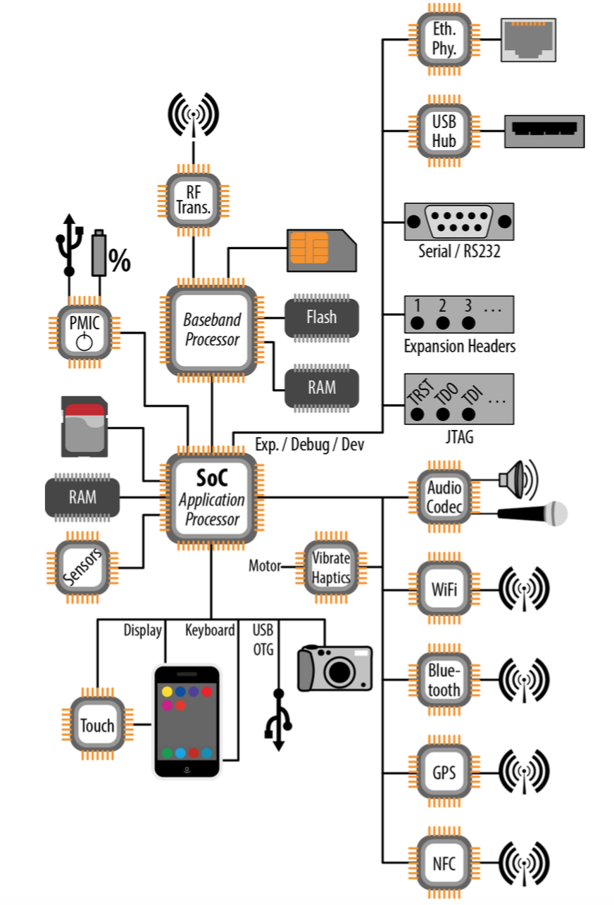
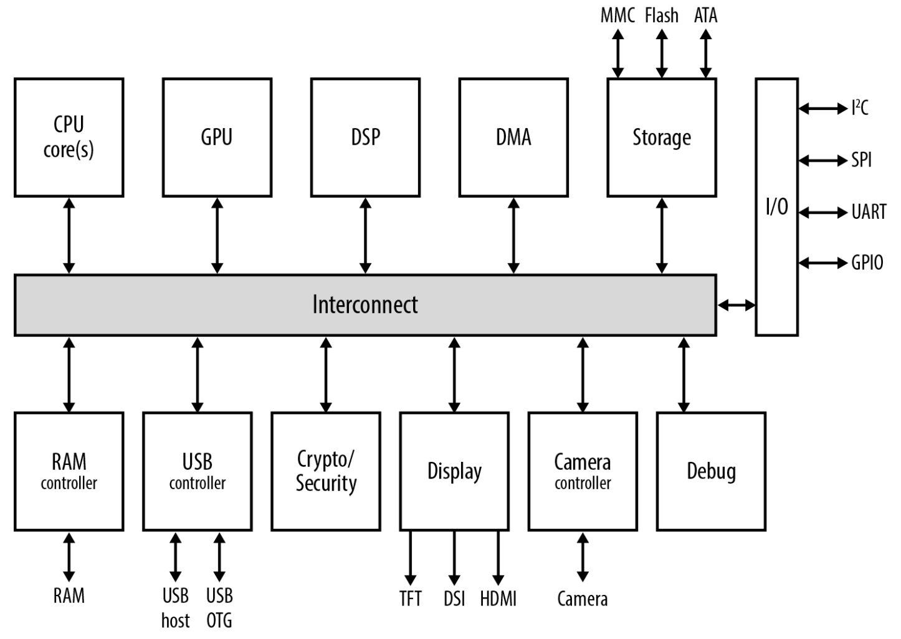
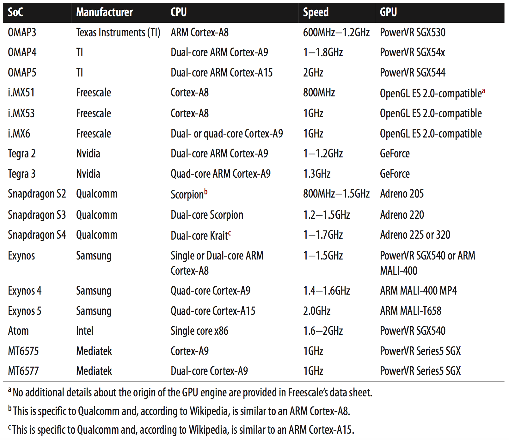
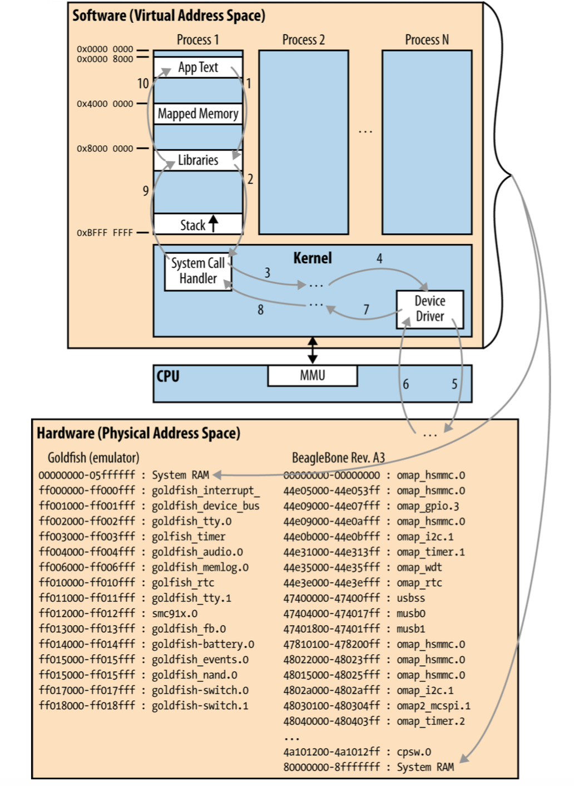

[toc]

## 5. 硬件基础

### 5.1 典型系统架构

下图展示了运行Android的典型的嵌入式系统架构图。

Figure 5-1. Typical system architecture block diagram

系统的核心是一个SoC。SoC包括CPU和外围控制器。

#### 5.1.1 Baseband处理器

市场上多数手持设备，负责用户界面软件和管理无线电（radio）功能的处理器单元是分离的。它们一般分布成为 Application Processor (AP) 和 Baseband Processor (BP)。分离两个处理器由法律和技术因素。如果你的嵌入式设备没有无线电功能，则上图中相应的部分可以去掉。

Nevertheless, it’s worth understanding the BP and its interaction with the AP, since the architecture of Android’s RIL is tightly coupled to the underlying hardware. Notice that the BP has its own flash and RAM. This guarantees that the certified software running on the BP is isolated from the software running on the AP, and that the real-time OS (RTOS) running on the BP is focused on running a single thing: the radio’s operation. The BP, for instance, runs software implementing the GSM stack. Notice also that the SIM card and an RF transceiver are connected to the BP. The transceiver takes care of the actual RF transmission and reception with the tower, while the SIM card is used to identify the handset user with the mobile network operator (MNO).

> If you’d like to get more information on the radio architecture of smart‐ phones, I would suggest reading Harald Welte’s “Anatomy of contemporary GSM cellphone hardware” and visiting this xda-developers thread.

#### 5.1.2 核心组件

过去嵌入式系统一般使用 NOR 或 NAND flash，用某种Flashlight文件系统管理这些芯片。最近趋势是使用 embedded Multi‐MediaCard (eMMC) 芯片。它们看似像SD开，但Linux内核将它们作为传统的块设备管理。Their SoC chips have the required modules to do basic reads and boot directly from a partition on the eMMC.

可能有不值一个设备连接到系统。Android区分内部和外部存储。内部存储一般为板上的 eMMC，外部存储一般是用户可插拔的SD卡。

> 注意最近开始，外部存储可能只是一个 FUSE (Filesystem in User SpacE)：挂载在内部存储特定目录下的一个文件系统。

有电池的设备还有一个 Power Management IC (PMIC) 组件。PMIC负责电池的各个方面，包括控制输出电压、充电等。多数消费电子设备，外部DC电源来自 USB On-the-Go (OTG) 连接器。

PMIC 通过 SPI, I2C, and/or GPIO 连接到 SoC。它会产生中断，如低电压或中断时。It can (and increasingly does) also include functionality other than just power management. For instance, it may include a real-time clock (RTC), an audio codec, and a USB transceiver.

#### 5.1.3 与外界交互

尽管手机一般直接使用 SoC 集成的显示功能，但对于一个更大屏的设备，will typically have a display bridge for low-voltage differential signaling (LVDS)–driven LCD displays. 一般还有一个触摸控制器，处理屏幕上的触摸传感器。一些电路处理键盘或其他物理按键。

摄像头由 SoC 控制。音频 I/O，由音频编解码IC控制。

accelerometer（加速度）、gyroscope（陀螺仪）、thermometer（温度计）、barometer（气压计）、photometer（测光计）、magnetometer（磁场）、proximity sensor（接近）。

#### 5.1.4 联系

包括 USB, WiFi, Bluetooth, GPS, and NFC。

多数消费类Android设备只提供一个 USB OTG 接头，用于连接电脑或其他USB设备，如摄像头。少量产品会允许 USB OTG 连接器作为 USB host。Even fewer devices provide separate USB host connectors for plugging in peripherals, as you typically would to a USB host such as a PC or a Mac.

#### 5.1.5 开发、调试、扩展、以太网

还有一些组件和外围设备，不会出现在多数消费电子产品。其中部分被Android栈支持，部分不支持。

有些开发板上有 Ethernet, USB host, serial (RS-232), JTAG, and expansion headers。例如 BeagleBoard 和 PandaBoard 就有。JTAG是一个硬件的调试接口，不需要Linux或Android软件支持。Expansion headers exposed by development boards will usually allow a peripheral board (i.e., add-on modules connected through the expansion headers) to be connected to some of the SoC’s pins, such as I2C or GPIO. It’ll then be up to you to make sure you load the appropriate device drivers to enable Linux to talk to the peripherals on the add-on module.

串口连接由 Linux 内核 **TTY** 层提供。So long as your kernel has support for console on serial for your SoC, this should work practically “out of the box.” 串口连接对于嵌入式系统很关键，例如它是主机与目标通讯简单有效的方式。

USB host 模式在 Android 3.1 以后才可用。早期版本 Android stack 不支持。But that doesn’t preclude the underlying Linux kernel from supporting the same set of USB devices it does by default. It only means that the **app API** for USB host mode, available starting with Android 3.1, won’t be available to you.

AOSP官方目前不支持以太网。While you can connect an Android device using an Ethernet connection to a network, the Android stack doesn’t recognize Ethernet as a valid data communication path—only WiFi and packet switching (i.e., your wireless carrier’s data connection.) Hence, while some applications will work when the Ethernet connection is properly set, some others won’t.

若你想要支持以太网，参考：

- Fabien Brisset and Benjamin Zores have put together a set of patches for 4.0 and 4.1 to support Ethernet. The patches are on [GitHub](https://github.com/gxben/aosp-ethernet), and you can find the presentation Benjamin did about this work at the [Embedded Linux Conference](http://www.slideshare.net/gxben/elce-2012-dive-into-android-networking-adding-ethernet-connectivity) Europe in November 2012.
- Linaro has created its own set of patches for adding the same functionality. These changes are available [here](http://review.android.git.linaro.org/#change,2599), [here](https://android-review.linaro.org/#change,2598), and [here](https://android-review.linaro.org/#change,2598).

### 5.2 SoC中有什么

下面是一个典型的SoC的内部。

This, after all, is a simplified view. Note also that not all components within an SoC operate at the same clock speed. So while the CPU may be listed as operating close to or above the gigahertz mark, for instance, the graphics processing unit (GPU) is likely operating at several hundred megahertz only.

> GPUs typically have a clock speed divided down from the CPU’s own speed. If the CPU is clocked at 1GHz, for instance, the GPU may be running at 250MHz. Though they run slower, GPUs are made up of massively parallel computing units. 即使CPU所以双核的，GPU可以是16核或64核的。

下表列出了目前统治Android的常见SoC。

Linux内核支持对称（symmetric）多处理器已经很久了，因此不必担心多核SoC。The Android stack has only recently started being run on multicore processors, and while it implicitly benefits from Linux’s multicore capabilities, the Android stack itself doesn’t, at the time of this writing, contain any specific multicore optimizations. Hence, if you have code that must run on multiple CPUs simultaneously, you will need to manually make sure that each thread has its CPU affinity properly set.

While most CPU cores for Android SoCs are ARM-based, there’s no standard GPU used by all SoC manufacturers. Instead, each manufacturer uses a different GPU, as you can see in Table 5-1. As mentioned earlier, these are clocked at several hundred megahertz (300 to 500) even if the CPU core(s) they’re packaged with on the same SoC are clocked at speeds close to or above 1GHz.

其他组件：

- RAM控制器：控制板上的RAM。
- DMA：处理RAAM和内存映射硬件直接的自动数据传输。
- USB控制器
- DSP：如JPEG编码
- Display：驱动显示器
- Camera：Allows the SoC to interface with a camera.
- Storage：Manages I/O with the various types of storage that can be used with the SoC.
- Debug：Enables the SoC to be connected to hardware debugging tools through various mechanisms, such as JTAG.

最后，SoC一般能够通过总线或借口连接到外部IC。这些总线或借口包括I2C, SPI, UART, and GPIO等。

SoC的能力和组成一般会列在厂商的data sheets上。SoC厂商还会为SoC上的重要组件提供驱动，如GPU。但多数 SoC 还会为其评估板提供 AOSP 树。

### 5.3 内存布局和映射

One of the buses connected to any CPU is an address bus. This bus is connected so as to allow the CPU access to the components attached to it using separate address ranges. In fact, most components occupy several, often consecutive, address regions. The addresses accessible by the CPU through its address bus are typically referred to as physical addresses, meaning they represent real, physical components connected to the CPU. When the CPU refers to any of these addresses, there are actual electrical signals being applied to the address bus on the printed circuit board (PCB) by the CPU, allowing it to designate a specific IC component.

Figure 5-3. Virtual versus physical address spaces

The actual location of each of the components in the physical adress space is typically known as the physical address map and is determined by the device’s designers as they route the connections from the SoC to the various components included on the PCB.

Two separate boards having identical components can have totally different physical memory maps. What’s important is that each device driver know the location of the component or components it needs to talk to. Sometimes, the component the driver communicates with is actually a bus itself. In that case, that component acts as a bridge for additional components connected to it using its own specific bus. Such is the case for components connected to the SoC through I2C, for instance.

> If you’d like to look at the physical memory map that your kernel sees at runtime, all you need to do is go to a command line and type `cat /proc/iomem`. That map might not contain all peripherals on your actual board, but it will contain those seen by the kernel. Some ICs or peripherals might not be listed because no driver registered with the kernel recognizes or deals with them.

The mapping between applications and devices works because the CPU manages two entirely separate address spaces through its memory management unit (MMU). Using its MMU, the CPU can present a virtual address space to applications running on it and still use a physical address space to communicate with components connected to it through its address bus.

One of the components residing in the physical address space is the system RAM. As you can see in Figure 5-3, the RAM location in the physical address space can vary greatly. Obviously, RAM is used to hold all active software code and data. However, this code and data is rarely addressed using references to its actual physical location. Instead, the OS collaborates with the MMU to implement a virtual address space wherein each process gets a similar view of the world. Virtual addresses eventually map to actual physical addresses, but the conversion is automatically handled by the MMU based on OS-maintained page tables.

It’s beyond the scope of this book to explain paging and MMUs’ operation in full, but just remember that the address ranges you see in your applications have nothing to do with the actual addresses being put by the CPU on its address bus to access your code and data. Figure 5-3 illustrates the virtual address space where Android processes live—bear in mind that the layout is not proportional. Some objects may be larger or smaller than they appear. The kernel is always seen as occupying an address range starting at 0xC0000000 as its low address. Android apps, on the other hand, occupy the entire address space below that address.

The actual application “text,” that is, the application’s code, sits very near the beginning of the virtual address space. It’s followed by mapped memory regions. These are virtual addresses that point either to RAM shared with other processes for interprocess communication, or physical address ranges mapped into the process’s address space using the corresponding driver’s `mmap()` function.

The mapping of physical address ranges into a process’s address space allows that process to directly drive an IC component or another connected device, instead of having to go through the kernel and the device’s driver for every operation. This is especially useful for performance-intensive operations such as graphics rendering. However, it’s also an effective means of exporting critical device-driver intelligence outside the kernel and, therefore, subtracting it from the kernel’s GPL requirements. In fact, it’s a very effective way of implementing key driver functionality in Android HAL components.

Finally, libraries start at `0x8000 0000`, and the process’s stack grows downward from the process’s topmost address. Except where your software uses memory-mapped reg‐ isters and regions to operate on hardware, the path for calls affecting hardware is usually as follows:

1. Your code calls on a function that interacts with a file descriptor associated with hardware. The immediate code called is actually in one of the system libraries mapped into your process’s address space. This function typically has more “sugar- coating” than the raw kernel system call.
2. The library does some processing and eventually calls a matching system call.
3. The system call handler then does further processing and invokes various functions inside the kernel.
4. Eventually some part of the kernel invokes the device driver matching the device associated with the file descriptor held by your application.
5. The device driver interacts with the hardware using which ever method is applicable. The result of this is of course hardware dependent. In some cases, the device driver may be able to read back a status and return it immediately. In other cases, the hardware feedback may occur only at a much later time. In other cases still, there may be no expected feedback.
6. Assuming the hardware does provide some feedback to the driver or generates an interrupt in response to the earlier operation, the call path will start to return from where it came.
7. The call path returns back from the driver to whatever invoked it.
8. The call path returns back to the system call handler.
9. The call path returns back to the system library.
10. The call path returns back to your code.

The only part of the preceding call chain that might involve physical addresses is where the device driver code communicates with its designated hardware. The rest of the calls being made and data being exchanged all happen in virtual address space.

