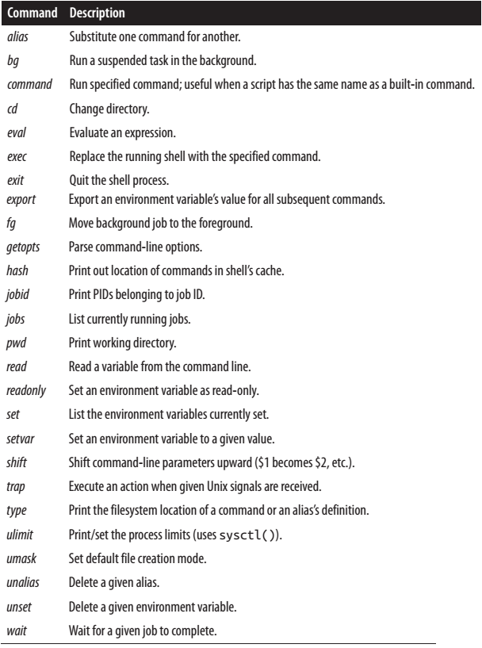
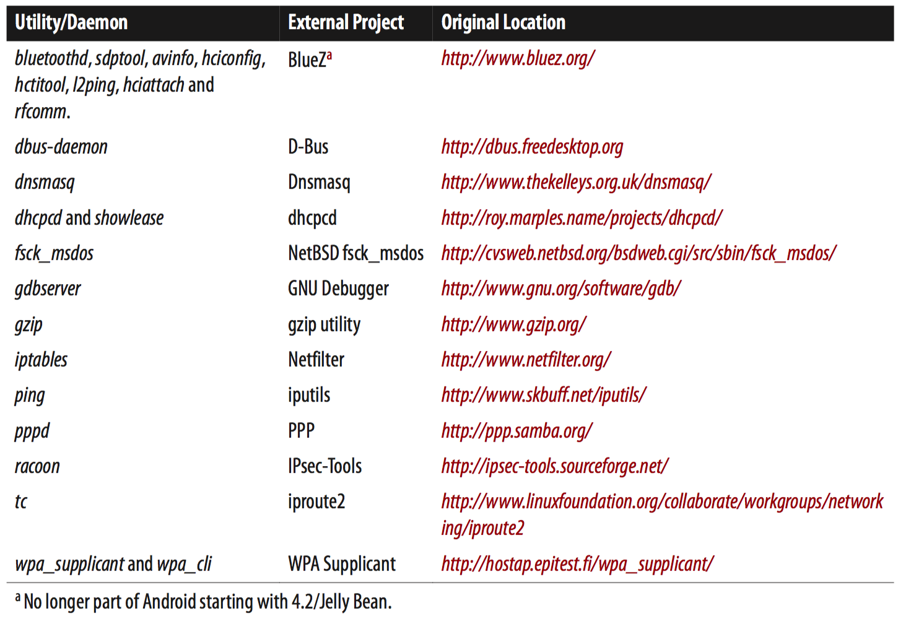
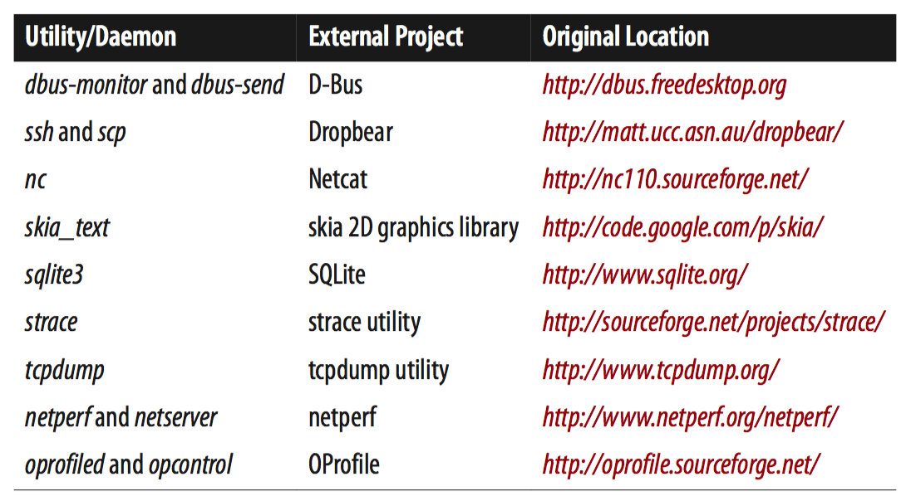
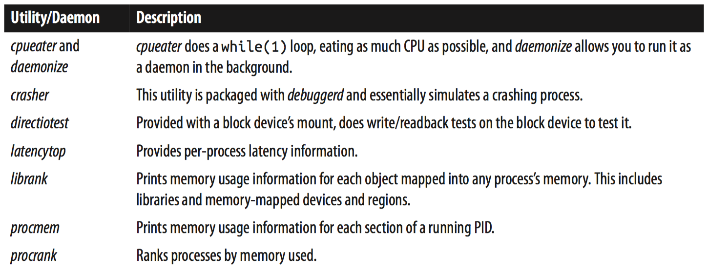
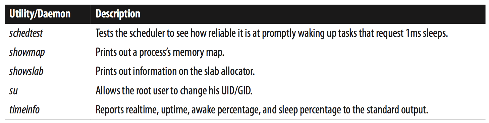

[toc]

## 6. 用户空间

获取Android兼容的内核最好向SoC厂商要；内核的移植、板子的启动已超出本书的讨论范围。

### xxx 6.1 文件系统

### xxx 6.2 adb

## 6.3 Android的命令行

启动时，有可能你需要直接面对Android命令行，或许是通过serial console。此时ADB尚未就绪：或者由于USB驱动尚未工作，或TCP/IP网络接口尚未启动。

#### 6.3.1 2.3/Gingerbread及之前的Shell

2.3/Gingerbread及之前的标准Shell在Android源码的`system/core/sh/`目录，产生的二进制在`/system/bin/sh`。Android使用的是**NetBSD的sh工具**（少量修改）。The AOSP in fact preserves sh’s man page as is, so you can do something like this on your host to get more information on how to use the shell:

	$ man system/core/sh/sh.1

不幸的是这个Shell比bash或BusyBox的ash简单的多。例如，不支持tab完成。If for no other reason, these limitations have been good justification for developers to include BusyBox on their targets, at least during development.

Comparisons aside, here’s an overview of **sh**’s capabilities:

- 输出重定向
- 管道，`|`
- 运行后台命令`&`
- Scripting using if/then/fi, while/do/done, for/do/done, continue/break, and case/in/pattern/esac
- 环境变量
- Parameter expansion (${...})
- Command substitution ($(...))
- Shell patterns (*, ?, !, etc.)

Table 6-12 describes **sh**’s built-in commands.

#### 6.3.2 4.0/Ice-Cream Sandwich之后的Shell

从4.0/Ice-Cream Sandwich开始，Android换成MirBSD Korn Shell。源码在`external/mksh/`，生成的二进制在`/system/bin/mksh`。

Even though mksh was included in AOSP versions before 4.2/Jelly Bean, it was disabled when building for the emulator. There is a `TARGET_SHELL` configuration variable in the build system that is set by default to `mksh`. However, a board config can change the default to whatever is appropriate for that board. Prior to 4.2/Jelly Bean, this variable was set to `ash`, which is the new name of the executable that replaces the `sh` command described in the previous section.

mksh比sh强大的多。它支持tab完成等功能。It also has a man page that you can check on the host by typing:

	$ man system/external/mksh/src/mksh.1

#### 6.3.3 Toolbox

与其他Linux系统一样，Android的Shell只提供部分功能。更多功能由独立工具提供。Android中提供这些功能的是Toolbox。源码在`system/core/toolbox/`。产生的二进制和符号链接位于`/system/bin`。

不幸的是，Toolbox比BusyBox弱，也缺乏文档。

> 附录A将介绍如何让 BusyBox 与 Toolbox 共存。

##### 常见Linux命令

`ifconfig`与典型Linux或BusyBox的功能有差异：无参数调用时它不会打印出当前网络的配置，需要使用命令`netcfg`。

（列表略）

##### 全局属性

Toolbox提供几个工具用于房屋全局属性：

    getprop <key>
    setprop <key> <value>
    watchprops

首先，列出所有属性及当前值：

    # getprop
    [ro.ril.wake_lock_timeout]: [0]
    [ro.secure]: [0]
    [ro.allow.mock.location]: [1]
	...

获取单个属性的值：

    # getprop ro.hardware
    am335xevm

设置属性值：

    # setprop acme.birdradar.enable 1
    # getprop acme.birdradar.enable
    1

属性在重启后消失，除非属性名以`persist`开头。后者，会在`/data/property`目录下有一个名为属性全名的文件，包含属性的值。

可以实时监控属性的修改。Assuming the `acme.birdradar.enable` is set after watchprop is started:

    # watchprops
    946709853 acme.birdradar.enable = '1'

##### 输入事件

Android依靠Linux的输入层获取用户输入事件。暴露Linux输入层的设备位于`/dev/input`文件夹下。用户触屏、按下物理键等都会触发输入事件。While Android’s System Server already handles those events appropriately, you might want to either observe or generate your own events. Toolbox lets you do just that:

    getevent [-t] [-n] [-s <switchmask>] [-S] [-v [<mask>]] [-p] [-q] [-c <count>]
    [-r][<device>]
        -t: show time stamps
        -n: don't print newlines
        -s: print switch states for given bits
        -S: print all switch states
        -v: verbosity mask (errs=1, dev=2, name=4, info=8, vers=16, pos. events=32)
        -p: show possible events (errs, dev, name, pos. events)
        -q: quiet (clear verbosity mask)
        -c: print given number of events then exit
        -r: print rate events are received
    sendevent <device> <type> <code> <value>

To observe the events, you can do something like this:

	# getevent
	/dev/input/event0: 0003 0000 0000007d
    /dev/input/event0: 0003 0001 0000011b
    ...

`getevent`显示收到的事件，直到你输入Ctrl-C。输出格式是事件类型、事件代码和事件值。

手工发送事件：

	# sendevent /dev/input/event0 1 330 1

`getevent`输出是十六进制的，`sendevent`输入是十进制的。

##### 控制服务

第2章讲过，Android的init脚本启动了一些本地守护进程。它们在init的配置脚本中成为服务。init的服务与系统服务或APP的服务没有关系。As we’ll see shortly, such services can be either started automatically or marked as disabled. Either way, you can start and stop services using the following:

    start <servicename>
    stop <servicename>

上面两条命令都不会有任何输出。没有办法能让Android列出所有运行中的服务。你需要了解init的配置脚本，了解你可以启动和停止的服务。For instance, if you want to stop all the system’s Java components, you can do this:

	# stop zygote

We’ll cover Android’s init and its handling of services in the next section.

##### 日志

Another interesting Toolbox feature is its ability to allow you to add your own events to Android’s logger:

	log [-p <prioritychar>] [-t <tag>] <message>
    prioritychar should be one of:
    v,d,i,w,e

For example:

	# log -p i -t ACME Initiating bird tracking sequence

Now, if you check the logs with logcat, you see this:

	# logcat
    ...
    I/ACME    (  336): Initiating bird tracking sequence
    ...

This can be very useful if you have shell scripts that execute alongside the rest of the Android stack.

##### ioctl

字符设备，读写`/dev`下的项，即相当于调用`read()`、`write()`函数。例如，读取：

	# cat /dev/birdlocator0

写入：

	# echo "Fire" > /dev/birdlaser0

Another very important file operation available on character devices is ioctl(). There is, however, no standard Linux utility for invoking this operation, since it’s driver-specific. On embedded systems, however, where those manipulating the system are typically either the driver authors themselves or working with them very closely, it makes sense to have a utility to enable developers to invoke drivers’ `ioctl()` functions. And Toolbox provides just that:

    ioctl [-l <length>] [-a <argsize>] [-rdh] <device> <ioctlnr>
      -l <length>   Length of io buffer
      -a <argsize>  Size of each argument (1-8)
      -r            Open device in read only mode
      -d            Direct argument (no iobuffer)
      -h            Print help

Obviously the use you make of this will be highly driver-specific. You’ll need to refer to your driver’s documentation and/or sources to know exactly the parameters you need to pass to this command and what effects they’ll have.

> `ioctl()` is a very powerful driver operation. Uses can go from benign status reporting to outright hardware destruction. Make sure you know exactly what the specific I/O control operation you’re about to issue does on the designated device. You probably want to use it only on drivers you wrote.

##### 擦除设备

In some extreme cases, it’s necessary to destroy data on an Android device. This extreme and irreversible operation is made possible using Toolbox’s wipe command:

    wipe <system|data|all>
    system means '/system'
    data means '/data'

If you need to destroy all data on a system, you can do this:

	# wipe data
    Wiping /data
	Done wiping /data

一旦擦除，不可恢复。

##### 其他Android特有的命令

Toolbox还包含一些Android特定的命令。

`nandread`，用于读取一个NAND Flash设备到文件：

    nandread [-d <dev>] [-f <file>] [-s <size>] [-vh]
        -d <dev>   Read from <dev>
        -f <file>  Write to <file>
        -s <size>  Number of spare bytes in file (default 64)
        -R         Raw mode
        -S <start> Start offset (default 0)
        -L <len> Length (default 0)
        -v Print info
        -h Print help

`newfs_msdos`，将设备格式化为VFAT文件系统；

    newfs_msdos [ -options ] <device> [<disktype>]
    where the options are:
    -@ create file system at specified offset
    -B get bootstrap from file
    -C create image file with specified size
    -F FAT type (12, 16, or 32)
    -I volume ID
    -L volume label
    -N don't create file system: just print out parameters
    -O OEM string
    -S bytes/sector
    -a sectors/FAT
    -b block size
    -c sectors/cluster
    -e root directory entries
    -f standard format
    -h drive heads
    -i file system info sector
    -k backup boot sector
    -m media descriptor
    -n number of FATs
    -o hidden sectors
    -r reserved sectors
    -s file system size (sectors)
    -u sectors/track

`newfs_msdos` is the tool used by the *vold* daemon to format devices for VFAT; vold being itself used by the Mount system service for managing mounted devices.

`notify`，This command uses the `inotify` system call an API to monitor directories or files for modifications:

	notify [-m <eventmask>] [-c <count>] [-p] [-v <verbosity>] <path> [<path> ...]

`r`. In 4.2/Jelly Bean, you’ll also find an `r` command. It’s shorthand for repeating the previous command you typed on the shell. So, instead of pressing the up arrow and then Enter, you can just type `r`.

`schedtop`. Like top, schedtop is for continuous, real-time monitoring of the kernel’s scheduler. Unlike top, which only reports the real-time CPU usage percentage for each process, this command continuously reports on the cumulative execution time of each process:

    schedtop [-d <delay>] [-bitamun]
        -d refresh every <delay> seconds
        -b batch - continuous prints instead of refresh
        -i hide idle tasks
        -t show threads
        -a use alternate screen
        -m use millisecond precision
        -u use microsecond precision
        -n use nanosecond precision

`setconsole`. This command lets you switch consoles:

#### 6.3.4 核心原生工具和守护进程

As I mentioned in Chapter 2, Android has about 150 utilities spread around its filesystem. In this chapter, we’ll cover those used independent of the Java framework and services. Specifically, we’ll focus in this section mostly on those in `/system/bin`, which we could consider core to Android. Some utilities are also found in `/system/xbin`, but they aren’t essential for the system to operate properly.

We already saw how Toolbox implements a lot of functionality commonly found in standard Linux systems, as well as Android-specific functionality. Similarly, there are two categories of core Android utilities and daemons, some which are derived from external projects and others that are Android specific. Table 6-15 presents a number of core utilities and daemons that are compiled from projects in the `external/` directory.

Table 6-15. Core utilities and daemons from external projects

不是所有系统都包含这些工具或组件。Remember that BlueZ has been replaced with another stack in 4.2/Jelly Bean.

##### logcat

（略）

##### netcfg

除了Toolbox的`ifconfig`，Android提供了另一个工具管理网络接口：

    netcfg [<interface> {dhcp|up|down}]

二者功能有相同的部分。例如，二者都可以让接口开启或禁用。`netcfg`还能发送DHCP请求，病打印当前接口的配置而`ifconfig`不能。`ifconfig`可以设置接口的镜头IP地址和掩码，但`netcfg`不能。

	# netcfg
	lo UP 127.0.0.1 255.0.0.0 0x00000049
    eth0 UP 10.0.2.15 255.255.255.0 0x00001043
    tunl0 DOWN 0.0.0.0 0.0.0.0 0x00000080
    gre0 DOWN 0.0.0.0 0.0.0.0 0x00000080

##### debuggerd

This daemon is actually started by init early during startup. It opens the android:debuggerd abstract Unix domain socket and awaits connections. It remains dormant until a user-space process crashes. It’s activated by Bionic’s linker, which sets up signal handlers for dealing with crashes and connects to debuggerd whenever that happens. debuggerd then does two things: creates a tombstone file in `/data/tombstones` and, if required, allows postmortem debugging to be done through gdbserver.

You don’t need to do anything special for tombstone files to be generated. They’ll be created automatically and will contain information about the crashing process that you might find useful for postmortem analysis. Here’s one from the frequently crashing VNC server on my BeagleBone:

	# cat /data/tombstones/tombstone_06

Also, if you set the `debug.db.uid` to some UID larger than that of the crashing process (just use a large integer value such as 32767 [2^15 - 1]), debuggerd will then use the `ptrace()` system call to attach to the dying process and allow you to start gdbserver to take control of it. Here’s the output printed out by debuggerd to the log when I do that on my BeagleBone: （略）

Once gdbserver is attached to the dying process, you can then use one of the arm-eabi-gdb debuggers that are part of the AOSP’s prebuilt/ directory to attach to the gdbserver running on the target and proceed with debugging the dying process.

##### （未）Other Android-specific core utilities and daemons

#### 6.3.5 其他本地工具和守护进程

还有一个不是必需的工具或守护进程，多数放在`/system/xbin`。

Table 6-16. Extra utilities and daemons from external projects

Table 6-17. Extra Android-specific utilities and daemons

#### 6.3.6 框架工具和守护进程

In addition to the utilities and daemons just covered, Android contains quite a number of others that are tightly tied to the system services and Android Framework, such as `servicemanager`, `installd`, and `dumpsys`. We’ll discuss those in the next chapter.

### xxx 6.4 Init

