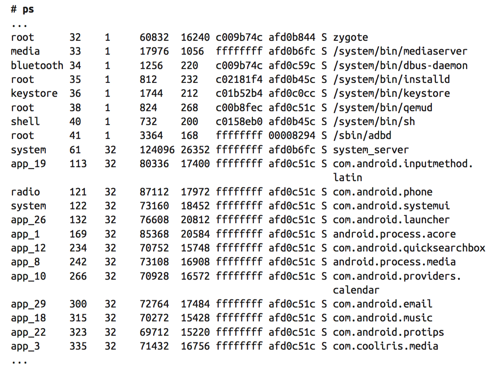

[toc]

## 7. Android Framework

本章讨论Android框架如何运行在原生用户空间之上，即如何定制它。

修改Framework一般需要进入源代码，添加自己的代码实现定制需求。因此需要你熟悉Android源代码。

究竟什么是Android Framework？根据Figure 2-1，Android框架包括`android.*`包、系统服务（System Services）、Android运行时，及一些原生的守护进程。从代码角度看，Android框架由frameworks/目录下的代码组成。

### 7.1 启动框架

Android框架的启动，是通过**Zygote**，后面会详述。

**Building the AOSP Without the Framework**

虽然奇怪，但有时你想构建AOSP，但不要基于Java的系统服务、APP等。例如你想在一个无头系统上运行Android。There’s an AOSP build for you: **Tiny Android**.

To make the AOSP generate Tiny Android, you just need to go to the AOSP’s source directory and type this:

	$ BUILD_TINY_ANDROID=true make -j16

会产生几个租金，包含内核和Android的用户空间。如Toolbox, Bionic, init, adbd, logcat, sh和其他库及二进制文件。

#### 7.1.1 核心构建块

Framework的运行取决于一组关键的构建块：Service Manager、Android Runtime、Zygote和Dalvik。其中大部分已经在第2章介绍过。在看下面的解释前，最好先看附录D，主**init.rc**文件。

**init**首先启动的服务中有**service manager**。如前文所述，它是所有运行的系统服务的黄页。在它启动时没有任何已启动的服务，它先启动，为了后续启动的服务可以向它注册。因此它并不是一个可选的组件，它在**init.rc**中的顺序也不得定制。

下一个启动的核心组件是Zygote。**init.rc**中相关行是：

	service zygote /system/bin/app_process -Xzygote /system/bin --zygote --start-system-server

实际运行的命令是`app_process`，其格式是：

	Usage: app_process [java-options] cmd-dir start-class-name [options]

`app_process`启动一个新的Dalvik VM，让你可以通过命令行运行Android代码。这并不表示你可以用它在命令行启动常规的Android app（此时该用**am**命令）。However, some key system components and tools must be started from the command line without a reference to any existing Dalvik VM instance. The Zygote is one of these, 因为它是第一个运行的Dalvik进程；**am**和**pm**是后面的两个进程。

`app_process`依赖 **Android运行时**。**Android运行时** 打包成共享库**libandroid_runtime.so**，能够启动和管理一个Dalvik VM，以运行Android代码。它预加载一个虚拟机，及一些常用的库，包括所有本地调用。

The Runtime also includes functions for facilitating operations typically done for all Android-type applications running on Dalvik. You can, in fact, consider Dalvik to be a very raw, low-level VM that doesn’t assume you’re running Android-type code on top of it. To run Android-type code on top of Dalvik, the Runtime starts Dalvik with parameters specifically tailored for its use to run Java code that relies on the Android Java APIs—either those publicly documented in the developer documentation and made available through the SDK, or internal APIs available only as part of building internal Android code within the AOSP.

运行时依赖很多原生用户空间的功能。例如，启动Dalvik VM时它会考虑一些init维护的全局属性。它使用Android的日志功能，记录Dalvik VM初始化的过程。In addition to setting up the parameters used to start the Dalvik VM used to run Java code, the Runtime also initializes some key aspects of the Java and Android environment before calling the code’s main() method. 它还为它创建的VM的所有线程，提供了一个默认的异常处理器。

注意运行时并不预加载类：That’s something the Zygote does when it sets up the system for running Android apps. And since each use of the `app_process` command results in starting a separate VM, all non-Zygote instances of Dalvik will load classes on demand, not before your code starts running.

---

**Dalvik的全局属性**

In addition to the global properties maintained by init that we discussed in the last chapter, Dalvik continues to provide the property system found in Java through **java.lang.System**. As such, if you’re browsing some of the system services’ sources, you might notice calls to `System.getProperty()` or `System.setProperty()`. 注意这些调用与init的全局属性无关。

例如，Package Manager Service会在启动时读取`java.boot.class.path`。但如果你在命令行调用**getprop**，并不会发现该属性。Instead, such variables are maintained within each Dalvik instance for retrieval and/or use by running Java code. The specific **java.boot.class.path**, for instance, is set in dalvik/vm/Properties.c using the BOOT CLASSPATH variable set in init.rc.

---

Once it’s started, a Java class launched using app_process can start using “regular” Android APIs and talk to existing system services. If it’s built as part of the AOSP, it can use many of the `android.*` packages available to it at build time. The **am** and **pm** commands, for instance, do exactly that. 你也可以完全用Java和Android API编写命令行工具，and have it start separately from the rest of the Framework. In other words, it would be started and would run independently of the Zygote and everything that the Zygote causes to start as part of its own initialization.

But this still won’t let you write a regular Android app that is started by `app_process`. Android应用只能被**Activity Manager**启动，使用intents，and the Activity Manager is itself started as part of the rest of the system services once the Zygote itself is started. Which brings the discussion back to the startup of the Zygote.

For the Zygote to start properly and have it start the **System Server**, you must leave its corresponding `app_process` line intact in init.rc, in its default location. There’s nothing that you can configure about the Zygote’s startup. You can, however, influence the way the Android Runtime starts any of its Dalvik VMs by modifying some of the system’s global properties. Have a look at the `AndroidRuntime::startVm(JavaVM** pJavaVM, JNIEnv** pEnv)` function in `frameworks/base/core/jni/AndroidRuntime.cpp` in either 2.3/Gingerbread or 4.2/Jelly Bean to see which global properties are read by the Android Runtime as it prepares to start a new VM. Note that any use of these properties to influence the setup of Dalvik VMs is likely to be version specific.

Zygote的VM启动后，调用`com.android.internal.os.ZygoteInit`类的`main()`方法，它会预加载所有Android包，然后启动System Server，再然后启动并循环监听来自Activity Manager的、请求fork并启动新Android APP的请求。Again, there is nothing to be customized here unless you can see something relevant to you in the list of parameters used to start the System Server in the `startSystemServer()` function in frameworks/base/core/java/com/android/internal/os/ZygoteInit.java. My recommendation is to leave this as is unless you have a very strong understanding of Android’s internals.

---

**禁用Zygote**

尽管你无法修改Zygote启动时做什么，但你可以完全禁止它启动：在init.rc中添加disabled选项。Here’s how this is done in 2.3/Gingerbread:

	service zygote /system/bin/app_process -Xzygote /system/bin --zygote --start-system-server
        socket zygote stream 666
        onrestart write /sys/android_power/request_state wake
        onrestart write /sys/power/state on
        onrestart restart media
        onrestart restart netd
        disabled

This will effectively prevent init from starting the Zygote at boot time, so none of the Android Framework’s parts will start, 包括System Server. This may be very useful if you’re in the process of debugging critical system errors or developing one of the HAL modules, and you must manually set up debugging tools, load files, or monitor system behavior before key system services start up. 而后，你可以手工启动Zygote及系统其他部分：

	# start zygote

---

#### 7.1.2 系统服务

System Server被Zygote启动。However, and as was discussed in Chapter 2, there are also system services started from processes other than the System Server, and we’ll discuss those in this section.

从4.0开始，第一个启动的系统服务是 **Surface Flinger**。2.3的时候，它还是作为 System Server 的一部分启动的。但4.0开始，它先于 Zygote 启动。其运行，独立于 System Server 和其他系统服务。下面这段代码，位于init.rc文件 Zygote 相关代码之前（Android 4.2版本）：

    service surfaceflinger /system/bin/surfaceflinger
        class main
        user system
        group graphics drmrpc
        onrestart restart zygote

Surface Flinger的源代码，在2.3和4.2版本，分别位于frameworks/base/services/surfaceflinger/ 和 frameworks/native/services/surfaceflinger/。他的任务是，讲APP使用的绘图屏幕组合成显示给用户的最终图像。

从Android 4.0开始，由于 Surface Flinger 先于 Zygote启动，系统的启动动画比之前的板块出现的快。

为启动System Server，Zygote fork并运行`com.android.server.SystemServer`类的`main()`方法。其中加载 libandroid_servers.so 库，调用frameworks/base/cmds/system_server/library/system_init.cpp 中的本地代码，启动C编写的系统服务，运行于 `system_server` 进程。In 2.3, this includes the Surface Flinger and the Sensor Service. In 4.2/Jelly Bean, however, the Surface Flinger is started separately, as we just saw, and the only C-coded system service started by system_server is the Sensor Service.

然后System Server回到Java，启动关键的系统服务，如Power Manager, Activity Manager, Package Manager。It then continues to initialize all the system services it hosts and registers them with the Service Manager. This is all done in code in frameworks/base/services/java/com/android/server/ SystemServer.java. 这些都是不可配置的，都被硬编码到SystemServer.java。没有标志或参数可以控制System Server启动或不启动哪些系统服务。

> 系统服务间是相互依赖的。Android几乎所有部分，包括Android API，都假定AOSP当内奸的系统服务总是可用的。

---

**/system/bin/system_server是什么**

You might notice while browsing your target’s root filesystem that there’s a binary called `system_server` in /system/bin. That binary, however, has nothing to do with the startup of the System Server or with any of the system services. It’s unclear what purpose, if any, this binary has. It’s very likely that this is a legacy utility from Android’s early days.
This factoid is often a source of confusion, because a quick look at the list of binaries and the output of ps may lead you to believe that the `system_server` process is in fact started by the `system_server` command. I was in fact very skeptical of my own reading of the sources on that matter and posted a question about it to the android-building mailing list. The ensuing response seems to confirm my reading of the sources, however.

---

In addition to the Surface Flinger and the system services started by the System Server, another set of system services stems from the starting of mediaserver. Here’s the relevant snippet from 2.3/Gingerbread’s init.rc (4.2/Jelly Bean’s is practically identical):

    service media /system/bin/mediaserver
        user media
        group system audio camera graphics inet net_bt net_bt_admin net_raw
        ioprio rt 4

The mediaserver, whose sources are in frameworks/base/media in 2.3/Gingerbread and frameworks/av/media in 4.2/Jelly Bean, starts the following system services: Audio Flinger, Media Player Service, Camera Service, and Audio Policy Service. Again, none of this is configurable, and it’s recommended that you leave the relevant init.rc portions untouched unless you fully understand the implications of your modifications. For instance, if you try to remove the startup of the mediaplayer service from init.rc or use the disabled option to prevent it from starting, you will notice messages such as these in logcat’s output:

    ...
    I/ServiceManager(56): Waiting for service media.audio_policy...
    I/ServiceManager(56): Waiting for service media.audio_policy...
    I/ServiceManager(56): Waiting for service media.audio_policy...
    W/AudioSystem(56): AudioPolicyService not published, waiting...
    I/ServiceManager(56): Waiting for service media.audio_policy...
    I/ServiceManager(56): Waiting for service media.audio_policy...
    ...

And the system will hang and continue to print out those messages until the mediaserver is started.

Note that the mediaserver is one of the only init services that uses the `ioprio` option. Presumably—and there’s unfortunately no official documentation to confirm this—this is used to make sure that media playback has an appropriate priority to avoid choppy playback.

There is finally one odd player in this game, the Phone app, which provides the Phone system service. Generally speaking, apps are the wrong place to put system services because apps are lifecycle managed and can therefore be stopped and restarted at will. System services, on the other hand, are supposed to live from boot to reboot and cannot therefore be stopped midstream without affecting the rest of the system. The Phone app is different, however, because its manifest file has the `android:persistent` property of the application XML element set to true. This indicates to the system that this app should not be lifecycle managed, which therefore enables it to house a system service.

It will also lead to this app being automatically started as part of the initialization of the Activity Manager.

Again, there’s nothing typically configurable about the Phone app’s startup. You can, however, relatively easily remove the Phone app from the list of apps built into the AOSP. The result, however, will be that any part of the system depending on that system service will fail to function correctly. Again, you might as well leave it in. If you want to remove the dialer icon from the home screen, then what you actually want to remove is the Contacts app. As counterintuitive as it may sound, the typical phone dialer Android users are accustomed to isn’t part of the Phone app; it’s part of the Contacts app.

Another example of an app that houses a system service is the NFC app found in packages/apps/Nfc/.

The Phone app way of providing a system service is very interesting, because it opens the door for us to emulate its example and to add system services as apps within our own device/acme/coyotepad/directory—without having to modify the sources of the default system services in frameworks/base/services/.

#### 7.1.3 启动动画

Here’s the corresponding entry in 2.3 init.rc (the one in 4.2/Jelly Bean is practically identical):

    service bootanim /system/bin/bootanimation
        user graphics
        group graphics
        disabled
        oneshot

Notice that this service is marked as disabled. Hence, init won’t actually start this right away. Instead, it must be explicitly started somewhere else. In this case, it’s the Surface Flinger that actually starts the boot animation after it has finished its own initialization by setting the `ctl.start` global property. Here’s code from the `SurfaceFlinger::readyToRun()` function in 2.3/Gingerbread’s frameworks/base/services/surfaceflinger/Surfa ceFlinger.cpp:

    // start boot animation
    property_set("ctl.start", "bootanim");

The code in 4.2/Jelly Bean’s frameworks/native/services/surfaceflinger/SurfaceFlin ger.cpp does effectively the same thing:

    ...
    void SurfaceFlinger::startBootAnim() {
        // start boot animation
        property_set("service.bootanim.exit", "0");
        property_set("ctl.start", "bootanim");
    }
    ...
    status_t SurfaceFlinger::readyToRun()
    {
    ...
        // start boot animation
        startBootAnim();
        return NO_ERROR;
    }
    ...

And given that the Surface Flinger is one of the first system services started—if not the first—the boot animation ends up continuously displaying while critical parts of the system are initializing. Typically, it will stop only when the phone’s home screen finally comes to the fore. We’ll take a look at some of the things happening during the boot animation shortly.

As you can see in the previous init.rc snippet, the bootanim service corresponds to the bootanimation binary. The latter’s sources are in frameworks/base/cmds/bootanimation/, and if you dig into them you’ll notice that this utility talks directly through Binder to the Surface Flinger in order to render its animation; hence the need for the Surface Flinger to be live before the animation can start. Android默认的启动动画，是Android logo，扫光。

bootanimation actually has two modes of operation. In one mode it creates the default Android logo boot animation using the images in frameworks/base/core/res/assets/images/. 不同想通过修改这些文件来修改启动动画。Instead, by providing either /data/local/bootanimation.zip or /system/media/bootanimation.zip, you will force bootanimation to enter its other mode of operation, where it uses the content of one of those ZIP files to render a boot animation. It’s worth taking some time to see how that can be done, even though a book is not the ideal medium for illustrating a running animation.

**bootanimation.zip**

The bootanimation.zip is a regular, **uncompressed** ZIP file with at least a `desc.txt` file at the top-level directory inside and a bunch of directories containing PNG files. The latter are animated in sequence according to the rules in the desc.txt file. Note that bootanimation doesn’t support anything but PNG files. Here are the semantics of the desc.txt file:

    <width> <height> <fps>
    p <count> <pause> <path>
    p <count> <pause> <path>

文件格式非常简单。第一行表示动画的长、宽和帧率。Each subsequent line is a part of the animation. For each part, you must provide the number of times this part is played (count), the number of frames to pause after each time the part is played (pause), and the directory where that part of the animation is located (path). Parts are played in the order they appear in the desc.txt.

Each animation part, and therefore the associated directory, is made of several PNG files, with filenames being a string representing the sequential number of that frame in the full sequence. Files could, for instance, be named 001.png, 002.png, 003.png, etc. If the count is set to zero, the part will loop playing until the system has finished booting and the Launcher starts. Typically, initial parts are likely to have a count of 1, while the last part usually has a count of 0, so it continues playing until the boot is done.

The best way to create your own boot animation is to look at the existing bootanimation.zip files that have been created by others. If you look for that filename in your favorite search engine, you should find a few examples relatively easily. Have a look, for example, at some of the latest boot animations created for the CyanogenMod aftermarket Android distribution.

> Again, make sure the ZIP file you created isn’t compressed. Otherwise it won’t work. Have a look at the zip command’s man page—especially the -0 flag.

**禁用启动动画**

You can also outright disable the boot animation if you don’t want it. Just use the setprop command in init.rc to set the debug.sf.nobootanimation to 1:

	setprop debug.sf.nobootanimation 1

In this case, the screen will go black at some point after the boot logo has been displayed, and stay black until the Launcher app displays the home screen.

#### （未）7.1.4 Dex优化

#### 7.1.5 应用的启动

As the startup of the system services nears its end, apps start to get activated, including the home screen. As I explained in Chapter 2, the **Activity Manager** ends its initialization by sending an intent of type `Intent.CATEGORY_HOME`, which causes the **Launcher** app to start and the home screen to appear. That’s only part of the story, though. The startup of the system services will in fact cause quite a few apps to start. Here’s a portion of the output of the `ps` command on a freshly booted 2.3 emulator image:

All the processes that have a Java-style process name are actually apps that were automatically started with no user intervention whatsoever at system startup. Various system mechanisms cause these apps to start given the content of their respective manifest files. And this is a welcome change, since controlling apps’ activation requires a lot less internals work than is required for controlling many other aspects of the startup, as we’ve seen above. Instead, it’s all about creating carefully crafted apps for packaging with the AOSP. Sure, there’s the case where you’ll want to modify a stock app to make it behave or start differently, but at least we’re into the app world, where functionality is more loosely coupled and documentation more readily accessible. Which leads us to discussing the triggers that cause stock apps to be activated.

##### 输入法

One of the earliest types of apps to start are input methods. The Input Method Manager Service’s constructor goes around and activates all app services that have an intent filter for `android.view.InputMethod`. This is how, for example, the **LatinIME** app, which runs as the `com.android.inputmethod.latin` process, is activated.

As you can see by reading the *Creating an Input Method* blog post on the Android Developers Blog, input methods are actually carefully crafted services.

##### Persistent apps

Apps that have the `android:persistent="true"` attribute in the `<application>` element of their manifest file will be automatically spawned at startup by the Activity Manager. In fact, should such an app ever die, it will also be automatically **restarted** by the Activity Manager.

As I explained earlier, unlike regular apps, apps that are marked as persistent are not lifecycle managed by the Activity Manager. Instead, they are kept alive throughout the lifetime of the system. This allows using such apps to implement special functionality. 状态条和电话应用（进程分别是 `com.android.systemui` 和 `com.android.phone`）就是持久化应用。

尽管开发文档解释了`android:persistent`的作用，但该属性只**用于AOSP自带的应用**。

##### Home屏

Typically there’s only one home screen app, and it reacts to the `Intent.CATEGORY _HOME` intent, which is sent by the Activity Manager at the end of the system services’ startup. There’s a sample home app in `development/samples/Home/`, but the real home app activated is in `packages/apps/Launcher2/`. Here’s the Launcher’s main activity and its intent filter in 2.3 (4.2 is basically the same):

    <activity
        android:name="com.android.launcher2.Launcher"
        android:launchMode="singleTask"
        android:clearTaskOnLaunch="true"
        android:stateNotNeeded="true"
        android:theme="@style/Theme"
        android:screenOrientation="nosensor"
        android:windowSoftInputMode="stateUnspecified|adjustPan">
        <intent-filter>
            <action android:name="android.intent.action.MAIN" />
            <category android:name="android.intent.category.HOME" />
            <category android:name="android.intent.category.DEFAULT" />
            <category android:name="android.intent.category.MONKEY"/>
        </intent-filter>
    </activity>

Note that this intent isn’t sent just at startup. Depending on the state of the system, the Activity Manager will send this intent whenever it needs to bring the home screen to the foreground.

##### `BOOT_COMPLETED` intent

The Activity Manager also broadcasts the `Intent.BOOT_COMPLETED` intent at startup. This is an intent commonly used by apps to be notified that the system has finished booting. A number of stock apps in the AOSP actually rely on this intent, such as Media provider, Calendar provider, Mms app, and Email app. Here’s the broadcast receiver used by the Media Provider in 2.3, along with its intent filter (4.2 is very similar):

    <receiver android:name="MediaScannerReceiver">
        <intent-filter>
            <action android:name="android.intent.action.BOOT_COMPLETED" />
        </intent-filter>
        <intent-filter>
            <action android:name="android.intent.action.MEDIA_MOUNTED" />
            <data android:scheme="file" />
        </intent-filter>
        <intent-filter>
            <action android:name="android.intent.action.MEDIA_SCANNER_SCAN_
             FILE" />
            <data android:scheme="file" />
        </intent-filter>
    </receiver>

要接收该广播，需要权限：

    <uses-permission android:name="android.permission.RECEIVE_BOOT_COMPLETED" />

##### `APPWIDGET_UPDATE` intent

In addition to apps, the App Widget Service, which is itself a system service, registers itself to receive the `Intent.BOOT_COMPLETED`. It uses the receipt of that intent as a trigger to activate all app widgets in the system by sending `Intent.APPWIDGET_UPDATE`. Hence, if you’ve developed an app widget as part of your app, your code will be activated at this point. Have a look at the App Widgets section of the Android developer documentation for more information on how to write your own app widget.

Several stock AOSP apps have app widgets, such as Quick Search Box, Music, Protips, and Media. Here’s the Quick Search Box’s app widget declaration in its manifest file, for example:

    <receiver android:name=".SearchWidgetProvider"
              android:label="@string/app_name">
        <intent-filter>
            <action android:name="android.appwidget.action.APPWIDGET_
             UPDATE" />
        </intent-filter>
        <meta-data android:name="android.appwidget.provider" android:
         resource="@xml/search_widget_info" />
    </receiver>

### 7.2 工具和命令

Once the Framework and the basic set of apps is up and running, there are quite a few commands that you can use to query or interact with system services and the Framework. Much like the commands covered in Chapter 6, these can be used on the command line once you shell into the device. But these commands have no meaning, and therefore no effect, unless the Framework is running. Of course you’ll find many of these useful, even crucial, as you’re bringing up Android on new devices and/or debugging parts of the Framework. And as with the commands in the native user-space, the tools available for interacting with the Framework vary greatly in terms of documentation and capabilities. Yet they provide the essential capabilities required to bring Android up on new hardware or to troubleshoot it on existing products. Let’s take a look at the command set available to you for interacting with the Android Framework.

Many of the commands here are located in the `frameworks/base/cmds/` directory of the AOSP sources, though in 4.2, some of those commands have been moved to `frameworks/native/cmds/`. I encourage you to refer to those sources when using some of these commands, as their effects aren’t always obvious just by looking at their online help, when it exists.

#### 7.2.1 通用工具

##### service

The service command allows us to interact with any system service registered with the Service Manager:

    # service -h
    Usage: service [-h|-?]
       service list
       service check SERVICE
       service call SERVICE CODE [i32 INT | s16 STR] ...
    Options:
       i32: Write the integer INT into the send parcel.
       s16: Write the UTF-16 string STR into the send parcel.

You can also check if a given service exists:

    # service check power
    Service power: found

Most interestingly, you can use `service call` to directly invoke system services’ Binder-exposed methods. In order to do that, you first need to understand that service’s interface. Here’s the `IStatusBarService` interface definition from 2.3  `frameworks/base/core/java/com/android/internal/statusbar/IStatusBarService.aidl` (4.2 interface name is the same, though setIcon()’s prototype has changed):

    ...
    interface IStatusBarService
    {
        void expand();
        void collapse();
        void disable(int what, IBinder token, String pkg);
        void setIcon(String slot, String iconPackage, int iconId, int iconLevel);
	...

Note that `service call` actually needs a method **code**, not a method’s name. To find the codes matching the method names defined in the interface, you’ll need to look up the code generated by the aidl tool based on the interface definition. Here’s the relevant snippet from the `IStatusBarService.java` file generated in out/target/common/obj/ JAVA_LIBRARIES/framework_intermediates/src/core/java/com/android/internal/ statusbar/:

    ...
    static final int TRANSACTION_expand = (android.os.IBinder.FIRST_CALL_
    TRANSACTION + 0);
    static final int TRANSACTION_collapse = (android.os.IBinder.FIRST_CALL_
    TRANSACTION + 1);
    static final int TRANSACTION_disable = (android.os.IBinder.FIRST_CALL_
    TRANSACTION + 2);
    static final int TRANSACTION_setIcon = (android.os.IBinder.FIRST_CALL_
    TRANSACTION + 3);
    ...

Also, note that `frameworks/base/core/java/android/os/IBinder.java` has the following definition for `FIRST_CALL_TRANSACTION`:

	int FIRST_CALL_TRANSACTION = 0x00000001;

Hence, `expand()`’s code is 1 and `collapse()`’s code is 2. Therefore, this command will cause the status bar to expand:

	# service call statusbar 1

While this command will cause the status bar to collapse:

	# service call statusbar 2

This is a very simple case where the action is rather obvious and the methods invoked don’t take any parameters. In other cases, you’ll need to look more closely at the system service’s API and understand the parameters expected. In addition, keep in mind that system services’ interfaces aren’t necessarily exposed through `.aidl` files. In some cases, such as for the Activity Manager, the interface definition is hardcoded directly into a regular Java file instead of being autogenerated. And in the case of C-based system services, the Binder marshaling and unmarshaling is all done straight in C code. Hence, try using grep on the AOSP’s frameworks/ directory in addition to out/target/common/ to find all instances of `FIRST_CALL_TRANSACTION`.

##### dumpsys

Another interesting thing to do is to query system services’ internal state. Indeed, every system service implements a `dump()` method internally that can be queried using the `dumpsys` command:

    dumpsys [ <service> ]

By default, if no system service name is provided as a parameter, `dumpsys` will first print out the list of system services and will then dump their status.

Obviously the output is very verbose and, most importantly, requires understanding the corresponding system service’s internals. If you’re implementing your own system service, however, being able to query its state at runtime can be crucial. Of course, if you’re not interested in dumping the state of all system services, you just need to provide the name of the specific service you’d like to get information about as a parameter to dumpsys:

	# dumpsys power
    Power Manager State:
      mIsPowered=true mPowerState=1 mScreenOffTime=46793204 ms
      mPartialCount=1
      mWakeLockState=SCREEN_ON_BIT
      mUserState=
      mPowerState=SCREEN_ON_BIT
      mLocks.gather=SCREEN_ON_BIT
      mNextTimeout=94351 now=46880555 -46786s from now
      mDimScreen=true mStayOnConditions=1
      mScreenOffReason=0 mUserState=0
      mBroadcastQueue={-1,-1,-1}
      mBroadcastWhy={0,0,0}
      mPokey=0 mPokeAwakeonSet=false
	...

##### dumpstate

In some cases, what you’re trying to do is get a snapshot of the entire system, not just the system services. This is what `dumpstate` takes care of. In fact, you might recall our discussion of this command when we covered adb’s `bugreport` in Chapter 6, since dumpstate is what provides bugreport with its information. Here’s dumpstate’s detailed help in 2.3:

    # dumpstate -h
    usage: dumpstate [-d] [-o file] [-s] [-z]
      -d: append date to filename (requires -o)
      -o: write to file (instead of stdout)
      -s: write output to control socket (for init)
      -z: gzip output (requires -o)

In 4.2, `dumpstate`’s capabilities have expanded:

    root@android:/ # dumpstate -h
    usage: dumpstate [-b soundfile] [-e soundfile] [-o file [-d] [-p] [-z]] [-s] [-q]
      -o: write to file (instead of stdout)
      -d: append date to filename (requires -o)
      -z: gzip output (requires -o)
      -p: capture screenshot to filename.png (requires -o)
      -s: write output to control socket (for init)
      -b: play sound file instead of vibrate, at beginning of job
      -e: play sound file instead of vibrate, at end of job
      -q: disable vibrate

If you invoke it without any parameters, it goes ahead and queries several parts of the sytem to provide you with a complete snapshot of the system’s status.

##### rawbu

In some cases, you may want to back up and later restore the contents of `/data`. You can use the `rawbu` command to do that.

Here’s how it can be used to create a backup:

	# rawbu backup /sdcard/backup.dat

The first thing the command does is stop the Zygote, thereby stopping all system serv‐ ices. It then proceeds to copy everything from /data and finishes by restarting the Zygote. Once data is backed up, you can restore it later:

	# rawbu restore /sdcard/backup.dat

#### 7.2.2 服务相关的工具

As we saw earlier, there are dozens of system services. Typically, using these system services requires writing code that interacts with their Binder-exposed API in some way, shape, or form. In some cases, however, the AOSP includes command-line utilities for directly interacting with certain system services. Some of these utilities are very powerful and allow us to tap into Android’s functionality straight from the command line. This opens the door for using many of the following utilities as part of scripts either in production or during development.

The system services’ APIs are typically protected by Android’s permission system, which requires apps’ manifest files to declare upfront which permissions they require. Gener‐ ally, a system service will check whether its caller has the appropriate permissions before going ahead and servicing the caller’s request. Part of this checking will require checking the caller’s PID and using the Package Manager’s services to verify the originating .apk’s rights.

There is one case, however, that circumvents all safeguards: when the caller is running as root. Indeed, if you look at the permission-checking code of the Activity Manager, which is used by the other system services to check for permissions, you will see this snippet in frameworks/base/services/java/com/android/server/am/ActivityManagerSer vice.java in 2.3:

    int checkComponentPermission(String permission, int pid, int uid,
    	...
    	// Root, system server and our own process get to do everything.
    	if (uid == 0 || uid == Process.SYSTEM_UID || pid == MY_PID ||
    		!Process.supportsProcesses()) {
    	return PackageManager.PERMISSION_GRANTED;
    }

In 4.2, you’ll find this instead:

	int checkComponentPermission(String permission, int pid, int uid,
    	...
    	if (pid == MY_PID) {
    		return PackageManager.PERMISSION_GRANTED;
    	}
        return ActivityManager.checkComponentPermission(permission, uid,
    		owningUid, exported);
    }

With `ActivityManager.checkComponentPermission()` being defined as the following in frameworks/base/core/java/android/app/ActivityManager.java:

    public static int checkComponentPermission(String permission, int uid,
    	int owningUid, boolean exported) {
    // Root, system server get to do everything.
    if (uid == 0 || uid == Process.SYSTEM_UID) {
    	return PackageManager.PERMISSION_GRANTED;
    }

Hence, in both versions of the AOSP, any of the commands you see here that talk to a system service will typically be granted a green light on anything they ask for from a system service. You must, therefore, be very careful when talking to system services while running as root. The same applies if you write a command-line utility that mimics the way many of the commands we cover in this section interact with system services.

##### am

`am`命令可以直接与 **Activity Manager** 交互。它可以启动活动、服务，发送广播Intent等。详情直接输入`am`显示它的帮助。

`am`的一大功能是可以通过命令行直接发送Intent（激活活动、服务、广播等）。Here’s how you can use am to get the browser to navigate to a given website along with the relevant log excerpts:

	# am start -a android.intent.action.VIEW -d http://source.android.com
	Starting: Intent { act=android.intent.action.VIEW dat=http://source.android.com }

That’s a rather straightforward example. Let’s look at something a little more customized. Here’s a broadcast receiver declaration from a custom application:

    <receiver android:name="FastBirdApproaching">
        <intent-filter >
        	<action android:name="com.acme.coyotebirdmonitor.FAST_BIRD"/>
        </intent-filter>
    </receiver>

And here’s the corresponding code:

    public class FastBirdApproaching extends BroadcastReceiver {
        private static final String TAG = "FastBirdApproaching";
        @Override
        public void onReceive(Context context, Intent intent) {
            Log.i(TAG, "**********");
            Log.i(TAG, "Meep Meep!");
            Log.i(TAG, "**********");
        }
    }

Here’s how you can use am to trigger this broadcast receiver and the resulting output in the logs:

	# am broadcast -a com.acme.coyotebirdmonitor.FAST_BIRD
    Broadcasting: Intent { act=com.acme.coyotebirdmonitor.FAST_BIRD }
    Broadcast completed: result=0

As you can see from `am`’s online help, you can specify a lot of details regarding the intent to be sent. Whereas the previous two examples used implicit intents, you can also send explicit intents to activate designated components:

	# am start -n com.android.settings/.Settings

In this case, this will start the **Settings** activity of the settings app in the system. 有趣的是`am`有些启动组件的方式，应用开发API是不能复现的。这是因为 `am` 是AOSP的一部分，因此可以访问AOSP内部一些隐藏的调用。

`am`实际是一个命令行脚本，见frameworks/based/cmds/am/am/：

    # Script to start "am" on the device, which has a very rudimentary
    # shell.
    #
    base=/system
    export CLASSPATH=$base/framework/am.jar
    exec app_process $base/bin com.android.commands.am.Am "$@"

The script uses app_process to start Java code that implements am’s functionality. All parameters passed on the command line are actually passed on to the Java code as is.

You can also use `am` for instrumentation, profiling, and monitoring. Have a look at the Testing Fundamentals and Testing from Other IDEs sections of the Android developer manual for more information on Android testing and the use of the `am instrument` command.

The `am profile` commands allow us to generate data that can then be visualized on the host using the `traceview` command. You can find more information about traceview in the relevant section of the Android developer manual. Note that the documentation says there are two ways to create trace files, and the use of the am command on the command line isn’t listed as one of them.

Finally, the am monitor command allows us to monitor apps run by the Activity Manager. Here’s a session where I start the command and then start several apps:

    # am monitor
    Monitoring activity manager... available commands:
    (q)uit: finish monitoring
    ** Activity starting: com.android.browser
    ** Activity resuming: com.android.launcher
    ** Activity starting: com.android.settings
    ** Activity resuming: com.android.launcher
    ** Activity starting: com.android.browser
    ** Activity starting: com.android.launcher
    ...

Note that when you start an app and click Back, the command reports that the Launcher is resuming, whereas if you click the Home button, the Launcher is reported as starting. This monitoring capability will also allow you to catch ANRs (Application Not Responding) and enable you to attach gdb to a crashing process.

##### pm

Another very important system service is the Package Manager and, much like the Activity Manager, it’s got its own command-line tool.

例如，列出已安装的包：

    # pm list packages
    package:android
    package:android.tts
    package:com.android.bluetooth
    package:com.android.browser
    ...

Installing an app (the command used by the adb install command covered in the last chapter):

	# pm install FastBirds.apk
    pkg: FastBirds.apk
	Success

Note that removing the app requires knowing its package name, not the original .apk’s name:

	# pm uninstall com.acme.fastbirds
    Success

pm is also a shell script that starts Java code:

	# Script to start "pm" on the device, which has a very rudimentary
    # shell.
    #
    base=/system
    export CLASSPATH=$base/framework/pm.jar
    exec app_process $base/bin com.android.commands.pm.Pm "$@"

##### svc

Unlike the two previous commands, svc is something of a Swiss Army knife in attempting to provide you with the ability to control several system services. The online help for 4.2:

	root@android:/ # svc Available commands:
        help     Show information about the subcommands
        power    Control the power manager
        data     Control mobile data connectivity
        wifi     Control the Wi-Fi manager
        usb      Control Usb state

Note how `svc`’s capabilities are limited to enabling and disabling the behavior of the designated system services:

	# svc help power
	Control the power manager
	usage: svc power stayon [true|false|usb|ac]
         Set the 'keep awake while plugged in' setting.

	# svc help data
	Control mobile data connectivity
    usage: svc data [enable|disable]
             Turn mobile data on or off.
           svc data prefer
              Set mobile as the preferred data network
	# svc help wifi
	Control the Wi-Fi manager
    usage: svc wifi [enable|disable]
             Turn Wi-Fi on or off.
           svc wifi prefer
              Set Wi-Fi as the preferred data network

Overall, you should be aware of `svc`, but it’s unlikely that you’ll make regular use of it. Like `am` and `pm`, svc is also a script that uses `app_process` to start Java code.

##### ime

The ime command lets you communicate with the Input Method system service to control the system’s use of available input methods, and it’s the same in 2.3 and 4.2:

    # ime
    usage: ime list [-a] [-s]
           ime enable ID
           ime disable ID
           ime set ID
    The list command prints all enabled input methods.  Use
    the -a option to see all input methods.  Use
    the -s option to see only a single summary line of each.
    The enable command allows the given input method ID to be used.
    The disable command disallows the given input method ID from use.
    The set command switches to the given input method ID.

Again, `ime` uses `app_process` from within a script to start Java code. Like svc, `ime` is a command worth keeping in mind, but you’re unlikely to use it very often.

##### input

input connects to the Window Manager system service and injects text or key events into the system. Here’s how it works on 4.2:

	root@android:/ # input
    usage: input ...
           input text <string>
           input keyevent <key code number or name>
           input [touchscreen|touchpad] tap <x> <y>
           input [touchscreen|touchpad] swipe <x1> <y1> <x2> <y2>
           input trackball press
           input trackball roll <dx> <dy>

input’s functionality is very simple, however. It doesn’t, for instance, know anything about what’s receiving the events, just that the events are sent to whatever presently has focus. It’s therefore up to you to make sure that whatever needs to receive your input actually has focus. Evidently this is difficult when you’re not in front of the screen and are, instead, trying to script such behavior. Still, input gives you a tool to provide raw input from the command line. And, in some cases, the meaning of the input you send doesn’t require focus. Here’s how to click the Home button from the command line, for example:

	# input keyevent 3

You’re probably wondering how I know that 3 is the Home key. Have a look at `frameworks/base/core/java/android/view/KeyEvent.java` and `frameworks/base/native/include/android/keycodes.h` in 2.3 or `frameworks/native/include/android/keycodes.h` in 4.2 for the full list of key codes recognized by Android. The former, for example, contains code such as this:

    ...
    public static final int KEYCODE_HOME = 3;
    /** Key code constant: Back key. */
    public static final int KEYCODE_BACK = 4;
    /** Key code constant: Call key. */
    public static final int KEYCODE_CALL = 5;
    /** Key code constant: End Call key. */
    public static final int KEYCODE_ENDCALL = 6;
    /** Key code constant: '0' key. */
    public static final int KEYCODE_0 = 7;

Like all other commands, `input` is a script that relies on `app_process`.

##### （未）monkey

There’s another tool that allows you to provide input to Android. It’s called monkey, and there’s an entire section about it in the app developer documentation entitled UI/Application Exerciser Monkey. As the documentation says, monkey can be used to provide random yet repeatable input to your application. This command, for instance, will send 50 pseudo-random inputs to the browser app:

	# monkey -p com.android.browser -v 50

##### bmgr

Since 2.2, Android has included a backup capability, allowing users to have their data backed up into the cloud so it can be restored later should they lose or change their device. Google itself provides some of this capability by acting as one of the possible transports, but others could provide alternative transports. The API provided within Android and to app developers is transport-independent. This remains, however, a functionality that is very specific to the use of Android for phones and tablets and may not be required in an embedded environment. There’s a tool that allows you to control the behavior of the Backup Manager system service from the command line:

    # bmgr
    usage: bmgr [backup|restore|list|transport|run]

If this is relevant to your use of Android, have a look at the Data Backup section of the app developer manual, along with the information provided by Google regarding its own backup transport. Much like many of the other commands we saw, `app_process` is used to start the actual Java code that interfaces with the Backup Manager service.

##### stagefright

One of Android’s key features is its rich media layer, and the AOSP includes tools that enable you to interact with it. More specifically, the `stagefright` command interacts with the Media Player service to allow you to do media playback. Here’s its online help in 2.3 (4.2’s is slightly expanded):

	# stagefright -h
    usage: stagefright
       -h(elp)
       -a(udio)
       -n repetitions
       -l(ist) components
       -m max-number-of-frames-to-decode in each pass
       -b bug to reproduce
       -p(rofiles) dump decoder profiles supported
       -t(humbnail) extract video thumbnail or album art
       -s(oftware) prefer software codec
       -o playback audio
       -w(rite) filename (write to .mp4 file)
       -k seek test

Here’s how you can play an .mp3 file, for example:

	# stagefright -a -o /sdcard/trainwhistle.mp3

You might also want to investigate the `record` and `audioloop` utilities found alongside stagefright’s sources in frameworks/base/cmds/stagefright/ in 2.3 and frameworks/av/cmds/stagefright/ in 4.2. Their documentation is severely lacking, though, and few examples of their uses can be found online or elsewhere. Interestingly, though, all three utilities are coded in C, unlike the majority of the system service-specific utilities we’ve seen thus far, which were mostly written in Java and activated through a script using app_process. Also, while stagefright directly communicates with the Media Player service, the record and audioloop commands use an OMXClient, which conveniently wraps the communication to the same service.

#### （未）7.2.3 Dalvik工具

### （未）7.3 Support Daemons

While the bulk of Android’s intelligence is implemented in system services, there are a number of cases where a system service acts partly as intermediary to a native daemon that actually does the key operations required. There are likely two main reasons why this approach has been favored instead of conducting the actual operations directly as part of a system server: security and reliability.

As I explained in Chapter 1, Android’s permission model requires app developers who need to call on privileged operations to request specific permissions at build time. Typically, these permissions will resemble something like this in an app’s manifest file:

    ...
    <uses-permission android:name="android.permission.INTERNET" />
    <uses-permission android:name="android.permission.WAKE_LOCK" />
    ...

In this case, these permissions ask for the ability to open sockets and grab wakelocks. There are obviously a whole lot more permissions than this. Have a look at the app developer documentation on the full list of permissions available. Without these permissions, an app can’t conduct some of the most critical Android operations. And the main reason is that apps run as unprivileged users that can’t, for instance, invoke any system call that requires root privileges or access most of the key devices in /dev. Instead, apps must ask system services to act on their behalf and, in turn, system services check apps’ permissions before following through with any requests they get.

System services don’t, however, themselves run as root. Instead, the system_server process runs as system; the mediaserver process runs as media; and the Phone app runs as radio. And if you check in /dev, you’ll see that some entries belong exclusively to some of these users. You’ll also see quite a few entries that belong to the root user. Hence, much like apps, system services can’t typically use system calls that require root privileges nor access key devices in /dev.

Instead, many key operations require system services to communicate through Unix domain sockets in /dev/socket/ with native daemons running as either root or as a specific user to conduct privileged operations. Many of those daemons are Android-specific, though some, such as bluetoothd prior to 4.2, we’ve already covered in Chapter 6 as being legacy Linux daemons.

In some specific cases, such as `rild`, for example, which takes care of the communication with the Baseband Processor, it seems that the choice to run as a separate process might likely have more to do with reliability. Indeed, the phone functionality of a smartphone is so critical that it’s worth ensuring that its operation is independent of any potential issues that could affect the system services housed in the `system_server` process.

Let’s take a look at the main support daemons used by system services, their configuration, and related command-line tools. Note that we won’t cover the daemons we covered earlier, such as the Zygote; or those that aren’t tied to system services, such as `ueventd` and `dumpsys`; or those, such as bluetoothd or `wpa_supplicant`, that are not Android specific.
