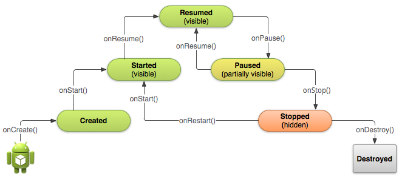

[toc]

## Launcher Activity

在 AndroidManifest.xml 中定义哪个活动是主活动。

```xml
	<activity android:name=".MainActivity" android:label="@string/app_name">
		<intent-filter>
			<action android:name="android.intent.action.MAIN" />
			<category android:name="android.intent.category.LAUNCHER" />
		</intent-filter>
	</activity>
```

`MAIN` 或 `LAUNCHER` 都必须声明，否则你的应用图标不会显示在HOME屏。

## 生命周期

理解活动生命周期的前提是理解**Android对进程策略**，及在资源不足的情况下，Android对进程和应用**强杀的策略**。理解在资源不足去情况下，强杀活动和进程的策略。例如 `onPause` 分隔的两个状态是：活跃和可视，`onStop` 分隔的两个状态是：可视和后台。在资源不足的情况下，Android先杀后台活动，一般不会杀死可视的，更不会杀活跃的（杀死别的活动目的就是让活跃的活动拥有资源）。既然如此，在 `onStop` 中释放资源几乎是完全安全的，因为 `onStop` 几乎一定会被调用，因为不调用它，活动就不会进入后台状态，就不会被强杀。


合理的实现生命周期回调方法，以期实现：

- 当用户收到一个电话或切换到另一个app时，应用不会崩溃
- 当用户不使用时，不耗费宝贵的系统资源
- 用户离开又返回后，不用丢失用户的进度
- 当屏幕朝向改变后，不要丢失用户进度，或崩溃

例子：流媒体播放。当用户去到另一个应用时，你需要暂停视频，中止网络连接。当用户回来时，重新连接网络，让用户从相同的地方继续播放。

### 概述



上面的状态，只有3个是可以静态的，即，活动可以静止在以下三个状态：

- Resumed：活动在前端，用户可以与之交互。
- Paused：活动被其他活动部分遮盖，在最前端的活动是半透明的或不占据整个屏幕。暂行的活动不能接受用户输入也不能执行代码。
- Stopped：活动完全对用户不可见；在后台运行。尽管暂停了，但活动的实例和所有的状态信息（如成员变量）仍保持，只是不执行代码。

其他状态是瞬态。

### 创建与销毁

在 `onCreate()` 方法中做一些基本的启动逻辑，这些逻辑在活动的整个生命周期中只应该执行一次。例如在 `onCreate()` 中的定义UI，实例化类级别的变量。

技术上说，`onStart()` 之后，活动对用户可见。

系统会在 `onDestroy()` 前先调用 `onPause()` 和 `onStop()`。但如果在 `onCreate()` 中直接调用了 `finish()`，系统将直接调用 `onDestroy()`，不再调用其他生命周期方法。

### 暂停和恢复

前台活动被其他可视组件阻塞造成活动暂停。例如当一个半透明活动（对话框风格）启动，之前的活动被暂停。只要活动仍部分可见但没有焦点，活动保持暂停。

一旦活动被完全阻塞、不可见，它停止（Stop）。

活动进入暂停态，系统调用 `onPause()`。在此方法中可以暂停一些操作（如视频）；或持久化任何应被持久化存储的信息；以防止用户接下来直接离开你的应用。用户返回处于暂停的活动，系统调用 `onResume()` 方法。

> 注意：当活动 `onPause()` 被调用时，可能是用户只是暂时离开，还会回来。但也有可能不会再回来了。

当系统调用 `onPause()`，从技术上讲，意味着活动现在是部分可见。但更多时候，这表示用户打算离开活动，活动马上要进入停止状态。`onPause()` 应被用于：

- 停掉动画等耗费CPU的资源
- 提交未保存的修改，但只有当用户期望这些改变被永久保存时（如邮件草稿）。
- 释放系统资源，如**广播接收器**，引用的传感器（如GPS），或其他会影响电池寿命的。例如，如果应用使用了摄像头，在 `onPause()` 方法中释放比较合适。

```java
@Override
public void onPause() {
    super.onPause(); // 必须先调用父类
    if (mCamera != null) {
        mCamera.release()
        mCamera = null;
    }
}
```

注意不要在 `onPause()` 中做太多耗费CPU的事，如写数据库，因为这会减慢到下一个活动的转场（费事操作放到 `onStop()` 中做）。

当活动暂停后，活动实例保留在内存中。在活动恢复后会继续使用该实例，不需要重新初始化在进入Resumed态之前的回调中创建的组件。

从暂停态恢复，系统调用 `onResume()` 方法。

每次应用进入前台时都会调用该方法，包括首次创建。在 `onResume()` 中应该初始化在 `onPause()` 中释放的组件，或其他需要每次进入Resumed状态时要初始化的工作。（如开始动画，或初始化只在有焦点时才使用的组件。）

```java
@Override
public void onResume() {
    super.onResume();  // Always call the superclass method first
    // Get the Camera instance as the activity achieves full user focus
    if (mCamera == null) {
        initializeCamera(); // Local method to handle camera init
    }
}
```

### 启动、停止和重启

`onStop()` 和 `onRestart()` 处理活动的停止和重启。停止态时，UI一定是不可见的，活动的焦点在另一个活动中。

合理的停止和重启活动，让用户感觉活动一直是活着的，并且不会丢失用户的进度。活动停止、重启的典型场景：

- 用户打开Recent Apps创建，从一个app切换到另一个。当前在前台的活动会被停止｛｛是停止！｝｝。如果用户从Home屏、Recent Apps回到你的活动，活动被重启。
- 用户从一个活动启动另一个活动。第二个活动创建后，当前活动停止｛｛是停止！｝｝。当用户按下Back按钮，第一个活动重启。
- The user receives a phone call while using your app on his or her phone.

停止时，系统在内存中保留Activity的实例，因此不去实现onStop()和onRestart()也是可能的（甚至onStart()也不实现）。对于多数相对简单的活动，活动自己能很好的停止和重启，你只需要在onPause()中停止正在进行的操作（如视频），断开与系统资源的连接｛｛停断系统资源在暂停、恢复中做！｝｝。

活动一旦停止，系统可能因回收系统内存，销毁活动。极端情况下，系统可能直接杀死app进程，不调用活动的onDestroy()回调。因此在onStop()中释放资源能防止内存泄漏。｛｛因为调用完onStop活动才停止，停止后可可能被随意杀死。因此若在onStop中释放资源，一定能确保资源被释放。｝｝

需要更多CPU的关闭操作更适合在 `onStop()` 中做，而不是 `onPause()`，如写数据库。

下面的onStop()在存草稿，为的是不丢失用户进度：

```java
@Override
protected void onStop() {
    super.onStop(); //  一定要先调用父类

    ContentValues values = new ContentValues();
    values.put(NotePad.Notes.COLUMN_NAME_NOTE, getCurrentNoteText());
    values.put(NotePad.Notes.COLUMN_NAME_TITLE, getCurrentNoteTitle());

    getContentResolver().update(
            mUri,    // The URI for the note to update.
            values,  // The map of column names and new values to apply to them.
            null,    // No SELECT criteria are used.
            null     // No WHERE columns are used.
            );
}
```

{{在到达Resumed状态之前创建的组件都不需要重新初始化。}} 系统会负责跟踪布局中每个View的当前状态，例如，若用户向EditText输入，内容会被保留，因此不需要保存和恢复。

当系统销毁已处于停止态的活动，系统会将视图的状态保存在一个 `Bundle` 中。当用户回到同一个活动实例后，会恢复这些状态。

活动从停止状态回到前台，调用 `onRestart()`。系统也会调用 `onStart()`，实际上每次活动可见时都会调用该方法。但 `onRestart()` 方法只有在从停止态恢复时才调用。

用onRestart()恢复活动状态并不常见。However, because your onStop() method should essentially clean up all your activity's resources, you'll need to re-instantiate them when the activity restarts. Yet, you also need to instantiate them when your activity is created for the first time (when there's no existing instance of the activity). 因此你应该用onStart()作为onStop()的反向方法，因为onStart()总会被调用。

例如，因为用户可能离开你的应用很长时间后才返回，因此在 `onStart()` 中检查某些系统功能比较靠谱：

```java
@Override
protected void onStart() {
    super.onStart();  // Always call the superclass method first

    // 判断GPS是否可用
    LocationManager locationManager =
            (LocationManager) getSystemService(Context.LOCATION_SERVICE);
    boolean gpsEnabled = locationManager.isProviderEnabled(LocationManager.GPS_PROVIDER);

    if (!gpsEnabled) {
        ...
    }
}

@Override
protected void onRestart() {
    super.onRestart();  // Always call the superclass method first
    // Activity being restarted from stopped state
}
```

When the system destroys your activity, it calls the onDestroy() method for your Activity. Because you should generally have released most of your resources with onStop(), by the time you receive a call to onDestroy(), there's not much that most apps need to do. This method is your last chance to clean out resources that could lead to a memory leak, so you should be sure that additional threads are destroyed and other long-running actions like method tracing are also stopped.

### 重新创建一个活动

一些正常操作会导致活动被销毁，如用户按下返回键，或活动自己调用 `finish()`。如果活动**停止**且长时间未用，系统也可能销毁活动。当前台活动需要额外资源时，系统会关闭后台进程，以回收内存。

如果是用户按下返回键或活动自己结束自己，在系统看来这些行为标识活动永不再需要了，于是活动的实例彻底消失。但如果是系统因为系统限制销毁了活动，则尽管活动实例消失了，但系统会记住它存在过。于是，待用户导航回去，系统会利用销毁活动前保存的活动状态，创建一个新的活动实例。系统用于恢复之前状态的、保存下来的数据称为"instance state"，它是一组键值对，保存在 `Bundle` 对象中。

> 警告：用户旋转屏幕会导致活动被销毁、重建。因为活动可能需要另外的资源（如布局）。

系统默认使用 Bundle instance state 保存布局中的每个视图的信息（如 EditText 中的文本）。当活动被销毁并重建后，布局的状态恢复到之前的状态 —— 不需要额外写代码。但有时，活动需要保存和恢复额外的信息，如追踪用户进度的成员变量。

> 注意：要能恢复视图的状态，每个视图必须有唯一ID，由 `android:id` 提供。

当系统要停止活动时，会先调用 `onSaveInstanceState()` 方法，你可以保存额外的状态。当活动被销毁又重启后，这些状态会传给 `onCreate()` 和 `onRestoreInstanceState()` 方法。

`onSaveInstanceState()` 方法的默认实现保存活动中视图的状态，如 EditText 中的文本，ListView 滚动条的位置。

保存附加状态：

```java
static final String STATE_SCORE = "playerScore";
static final String STATE_LEVEL = "playerLevel";
...
@Override
public void onSaveInstanceState(Bundle savedInstanceState) {
    // Save the user's current game state
    savedInstanceState.putInt(STATE_SCORE, mCurrentScore);
    savedInstanceState.putInt(STATE_LEVEL, mCurrentLevel);
    // 一定要调用父类
    super.onSaveInstanceState(savedInstanceState);
}
```

当之前销毁的活动被重新创建，可以从 Bundle 中恢复状态。`onCreate()` 和 `onRestoreInstanceState()` 两个方法都能收到一个 `Bundle`，它们收到的是同一个 `Bundle`。注意检查 Bundle 是否为 null。首次创建时，`onCreate()` 收到 null。

```java
@Override
protected void onCreate(Bundle savedInstanceState) {
    super.onCreate(savedInstanceState);

    // Check whether we're recreating a previously destroyed instance
    if (savedInstanceState != null) {
        // Restore value of members from saved state
        mCurrentScore = savedInstanceState.getInt(STATE_SCORE);
        mCurrentLevel = savedInstanceState.getInt(STATE_LEVEL);
    } else {
        // Probably initialize members with default values for a new instance
    }
    ...
}
```

若不想在 `onCreate()` 中恢复状态，可以在 `onRestoreInstanceState()` 中，该方法在 `onStart()` 之后调用。系统只有在有状态需要恢复时才调用 `onRestoreInstanceState()`，因此不必检查 `Bundle` 是否为 `null`：

```java
public void onRestoreInstanceState(Bundle savedInstanceState) {
    // 一定要调用父类的
    super.onRestoreInstanceState(savedInstanceState);
    // Restore state members from saved instance
    mCurrentScore = savedInstanceState.getInt(STATE_SCORE);
    mCurrentLevel = savedInstanceState.getInt(STATE_LEVEL);
}
```

To learn more about recreating your activity due to a restart event at runtime (such as when the screen rotates), read [Handling Runtime Changes](http://developer.android.com/guide/topics/resources/runtime-changes.html).

### 其他

> 任何时候都可以调用 `Activity.isFinishing()` 检查活动是否将要被杀死。在活动被杀死前 `onPause()` 方法是肯定会被调用的，因此可以在 `onPause()` 中用 `isFinishing()` 检查活动是否将要被杀死。如果是，**可能需要将状态保存到磁盘**。
—— *Beginning.Android.Games*

