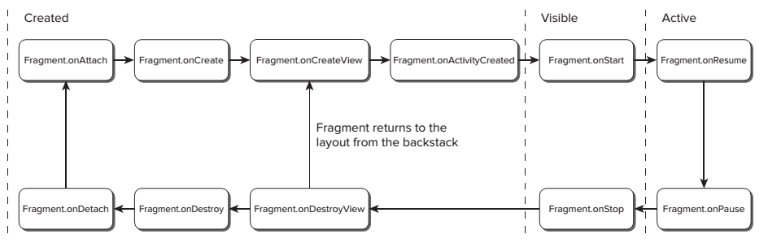

[toc]

## Fragment

为了重用 Fragment UI，你需要将每个 Fragment 定义为完全自包含的组件，拥有自己的布局和行为。Fragment 有自己的生命周期，接受自己的输入事件。可以在活动运行过程中添加或删除 Fragment。
Fragment 可以不带 UI；向活动提供后台功能。
Fragment 不需要向装箱文件注册。

Fragment 是 Android 3.0 Honeycomb (API level 11) 才引入的。支持库可以支持到 Android 1.6 (API level 4)。

### 创建 Fragment

注意：Fragment 必须有一个默认无参构造器。当宿主 Activity 被重建后，系统利用该默认构造器实例化 Fragment。忘记提供默认构造器不会报错，但会导致不确定行为。如果想在构造期传递方法，可以使用 `setArguments` 方法。

#### 继承 Fragment 类（3.0+）

若 Fragment 需要UI，覆盖 `onCreateView` 方法，充气并返回 View。

```java
import android.app.Fragment;

public class MySkeletonFragment extends Fragment {
    @Override
    public View onCreateView(LayoutInflater inflater,
        ViewGroup container, Bundle savedInstanceState) {
        // 如果Fragment没有UI返回null
        // ｛｛第三个参数一定要传且是false｝｝
        return inflater.inflate(R.layout.my_fragment, container, false);
    }
}
```

#### 使用支持库

本节介绍使用支持库中的 Fragment 类。兼容 Android 1.6 以上。

```java
import android.support.v4.app.Fragment;

public class ArticleFragment extends Fragment {
    @Override
    public View onCreateView(LayoutInflater inflater, ViewGroup container,
        Bundle savedInstanceState) {
        // Inflate the layout for this fragment
        return inflater.inflate(R.layout.article_view, container, false);
    }
}
```

### 生命周期

Fragment 部分生命周期回调与父 Activity 对应。还有部分自身特有的生命周期回调。例如，当活动的 `onPause()` 被调用，则活动内的所有 `Fragment` 都将收到 `onPause()`。



注意在子类的回调方法中调用父类的方法。｛｛`onCreateView()` 不需要。｝｝

Fragment 的生命周期回调方法：

- `onAttach(Activity activity)`：首次与活动关联时。
- `onCreate(Bundle savedInstanceState)`：初始化 Fragment。注意此时宿主活动可能尚未完成 `onCreate` 方法。
- `onCreateView(LayoutInflater inflater, ViewGroup container, Bundle savedInstanceState)`：在 `onCreate` 之后调用。创建 Fragment 的UI。该方法应该返回已充气的布局。注意，Fragment可以没有UI组件。此时返回 null。
- `onActivityCreated(Bundle savedInstanceState)`：在宿主活动完成 `onCreate` 后、 在 Fragment 的UI创建后调用。
- `onStart()`：当 Fragment 对用户可见时调用。进入可视生命周期。一般与宿主 `onStart` 方法同时调用。
- `onResume()`：当 Fragment 对用户可见。进入 Active 生命周期。一般与宿主 `onResume` 方法同时调用。
- `onPause()`：可能由于活动被暂停，或 Fragment 被替换。一般与宿主活动的 `onPause` 方法同时被调用。
- `onSaveInstanceState(Bundle savedInstanceState)`：在Active生命周期结束后，保存UI状态。在父活动被杀死又重启后，`savedInstanceState` 会被传给 `onCreate`, `onCreateView`。
- `onStop()`：活动不再可见。可能由于活动被停止，或 Fragment 被替换。一般与宿主活动的 `onStop` 方法同时被调用。
- `onDestroyView()`：`onCreateView` 返回的视图与 Fragment 解除关联后。清理所有与视图相关的资源。
- `onDestroy()`: 当 Fragment 不再使用时。释放虽有资源，包括线程，数据库等。
- `onDetach()`：当 Fragment 不再与宿主活动关联

由于 Fragment 可能被动态的添加、删除。因此在父活动活跃的情况下，Fragment 自身可能多次经历完整的生命周期。

Fragment特有的生命周期回调：

**与父活动关联/解除**

Fragment 生命周期从绑定到父活动开始，结束于与父活动解除绑定。分别由 `onAttach` 和 `onDetach` 表示。若 Fragment/Activity 已被暂停（退出Active状态），且父活动的进程被直接终止，则 `onDetach` 可能不会被调用。`onAttach` 事件发生在创建 Fragment 的UI前，设置发生在 Fragment 自己和父活动**完成**初始化前。`onAttach` 一般用于获取对父活动的引用。

**创建和销毁 Fragment**

活动的 `onDestroy` 不保证一定会被调用，同样也不保证 Fragment 的 `onDestroy` 被调用。用 ` ` 方法初始化 Fragment。应该在此创建 class scoped 对象，以确保在 Fragment 生命周期内它们只被创建一次。

但与活动不同的是，UI不在 `onCreate` 方法中创建。

**创建和销毁UI**

Fragment 的 UI 在 `onCreateView` 和 `onDestroyView` 中创建和销毁。

利用 `onCreateView` 初始化 Fragment：充气UI，绑定数据到视图，创建所需的服务和定时器。返回充气后的视图：

```java
return inflater.inflate(R.layout.my_fragment, container, false);
```

如果 Fragment 需要与父活动的UI交互，等到 `onActivityCreated` 触发再做。此时活动的UI已构建好。

### 添加到父活动

每个 Fragment 实例都必须与父活动关联。这种关联，可以通过在活动的布局文件中定义 Fragment 实现。但注意，通过布局文件向活动添加的 Fragment 不能在运行时被移除。

> Note: 在API level API 11前，要使用 FragmentActivity 做父 Activity，但在之后可以直接使用常规 Activity。
如果使用v7 appcompat library，活动应该继承 `ActionBarActivity` 类（`FragmentActivity` 的子类）。

#### 用XML向活动添加Fragment（静态）

下面这个布局文件，当屏幕large时使用，在活动中并排放置两个Fragment。

res/layout-large/news_articles.xml

```
	<LinearLayout xmlns:android="http://schemas.android.com/apk/res/android"
	    android:orientation="horizontal"
	    android:layout_width="fill_parent"
	    android:layout_height="fill_parent">

	    <fragment android:name="com.example.android.fragments.HeadlinesFragment"
	              android:id="@+id/headlines_fragment"
	              android:layout_weight="1"
	              android:layout_width="0dp"
	              android:layout_height="match_parent" />

	    <fragment android:name="com.example.android.fragments.ArticleFragment"
	              android:id="@+id/article_fragment"
	              android:layout_weight="2"
	              android:layout_width="0dp"
	              android:layout_height="match_parent" />

	</LinearLayout>
```
Fragment 的实现类可以用 `android:name` 特性指定，也可以用 `class` 特性指定。Android 内部代码先找 `class`特性，找不到才找 `android:name` 特性。

```
	<fragment class=”com.example.ExampleFragment”
		android:id=”@+id/example”
		android:layout_width=”match_parent” 
		android:layout_height=”match_parent” />
	</FrameLayout>
```
在活动中使用该布局：

```
	import android.os.Bundle;
	import android.support.v4.app.FragmentActivity;
	public class MainActivity extends FragmentActivity {
	    @Override
	    public void onCreate(Bundle savedInstanceState) {
	        super.onCreate(savedInstanceState);
	        setContentView(R.layout.news_articles);
	    }
	}
````

Fragment 被充气后，会变成一个 View Group。

### Fragment Manager

每个 Activity 都包含一个 Fragment Manager，用于管理所包含的 Fragments。获取FragmentManager：

```java
FragmentManager fragmentManager = getFragmentManager();
```

若使用支持库，用 `getSupportFragmentManager()` 获得 `FragmentManager`（这是支持库的API）

利用 Fragment Manager 增加、移除、替换Fragment；访问已添加的Fragment。
可以设置 transition 动画。
可以指定是否将 Transaction 放入后退栈。

Fragment Transaction 从 `beginTransaction` 开始，最后提交。

```java
FragmentTransaction fragmentTransaction = fragmentManager.beginTransaction();
// Add, remove, and/or replace Fragments.
// Specify animations.
// Add to back stack if required.
fragmentTransaction.commit();
```

> 注意：只有当活动处于resumed状态时，Fragment才可以被添加或移除。

#### 添加

除了指定 Fragment，还需要指定在哪里放置 Fragment，即 Fragment 的父视图。还可以指定一个标签，此后，可以利用这个标签和 `findFragmentByTag` 方法查询到这个 Fragment：

```java
FragmentTransaction fragmentTransaction = fragmentManager.beginTransaction();
fragmentTransaction.add(R.id.ui_container, new MyListFragment());
fragmentTransaction.commit();
```

#### 移除

先利用 Manager 的 `findFragmentById` 或 `findFragmentByTag` 方法获取到 Fragment。然后将这个实例传入 `remove()` 方法：

```java
FragmentTransaction fragmentTransaction = fragmentManager.beginTransaction();
Fragment fragment = fragmentManager.findFragmentById(R.id.details_fragment);
fragmentTransaction.remove(fragment);
fragmentTransaction.commit();
```

#### 替换

指定要被替换的 Fragment 所在的容器ID，指定替换后的 Fragment 实例。一个可选的标签识别新插入的Fragment。

```java
FragmentTransaction fragmentTransaction = fragmentManager.beginTransaction();
fragmentTransaction.replace(R.id.details_fragment, new DetailFragment(selected_index));
fragmentTransaction.commit();
```

#### 查找

利用 Fragment Manager 的 `findFragmentById`方法。

```java
MyFragment myFragment = (MyFragment)fragmentManager.findFragmentById(R.id.MyFragment);
```

或 `findFragmentByTag`：

```java
MyFragment myFragment = (MyFragment)fragmentManager.findFragmentByTag(MY_FRAGMENT_TAG);
```

没有 UI 的 Fragment 只能通过 `findFragmentByTag` 找到。Because they’re not part of the Activity’s View hierarchy, 它们没有资源标识符，或 container resource identifier，因此不能用 `findFragmentById`。

### 用 Fragment 动态布局 Activity

对于运行时添加的 Fragment，布局中必须有一个Fragment的父视图，以容纳 Fragment。
例如，下面的布局，一次显示一个 Fragment。为了能替换一次显示一个 Fragment。活动的布局包含一个空FrameLayout，｛｛注意是Frame不是Fragment！只是一种普通的布局容器！｝｝作为fragment容器。

res/layout/news_articles.xml:

```
	<FrameLayout xmlns:android="http://schemas.android.com/apk/res/android"
	    android:id="@+id/fragment_container"
	    android:layout_width="match_parent"
	    android:layout_height="match_parent" />
```

如果活动允许 Fragment 被移除或替换，你应该在活动的 `onCreate()` 方法中初始化 Fragment。先要检查UI是否已被填充。若由于配置改变导致活动被重启，Android 会持久化 Fragment 布局及关联的后退栈。

官方教程的写法：

```java
import android.os.Bundle;
import android.support.v4.app.FragmentActivity;
public class MainActivity extends FragmentActivity {
    @Override
    public void onCreate(Bundle savedInstanceState) {
        super.onCreate(savedInstanceState);
        setContentView(R.layout.news_articles);

        // {{检查容器是否为空的目的是，该活动根据不同配置会有不同布局；}}
        // {{可能某个替换布局采用静态布局，因此没有此容器}}
        if (findViewById(R.id.fragment_container) != null) {
            // 如果是从之前的状态恢复，什么也不要做
            // 否则会又创建一个Fragment，遮在上面！
            if (savedInstanceState != null) {
                return;
            }

            HeadlinesFragment firstFragment = new HeadlinesFragment();
            firstFragment.setArguments(getIntent().getExtras());
            // Add the fragment to the 'fragment_container' FrameLayout
            getSupportFragmentManager().beginTransaction()
                    .add(R.id.fragment_container, firstFragment).commit();
        }
    }
}
```

For the same reason, when creating alternative layouts for run time configuration changes, it’s considered good practice to include any view containers involved in any transactions in all the layout variations. Failing to do so may result in the Fragment Manager attempting to restore Fragments to containers that don’t exist in the new layout.

### Fragment、后退栈与生命周期

Fragment 替换对 UI 的改变是巨大的，可以看成是另一个屏幕。因此要允许用户后退。

To allow the user to navigate backward through the fragment transactions, you must call `addToBackStack()` before you commit the `FragmentTransaction`.

```java
FragmentTransaction fragmentTransaction = fragmentManager.beginTransaction();
fragmentTransaction.add(R.id.ui_container, new MyListFragment());
Fragment fragment = fragmentManager.findFragmentById(R.id.details_fragment);
fragmentTransaction.remove(fragment);
String tag = null;
fragmentTransaction.addToBackStack(tag);
fragmentTransaction.commit();
```

> 当移除或替换一个 Fragment，且事务被放入后退栈中，被移除的 Fragment 被停止（而不是销毁）。如果用户导航回 Fragment，它会被重启。如果不把 Transaction 放入后退栈，被移除或替换的 fragment 被销毁。

The `addToBackStack()` method takes an optional string parameter that specifies a unique name for the transaction. The name isn't needed unless you plan to perform advanced fragment operations using the FragmentManager.BackStackEntry APIs.

可以通过程序要求事务退栈，调用 `FragmentManager.popBackStack()`，上一个事务会被退栈。

### Fragment 转场动画

要使用预设的转场动画，调用 `setTransition` 方法，传入某个 `FragmentTransaction.TRANSIT_FRAGMENT_*` 常量。

```java
transaction.setTransition(FragmentTransaction.TRANSIT_FRAGMENT_OPEN);
```

可以利用 `setCustomAnimations` 设置定制动画。该方法接受两个 animator 资源：一个用于将要被加入布局的 Fragment，另一个用于被移除的：

```java
fragmentTransaction.setCustomAnimations(R.animator.slide_in_left,
    R.animator.slide_out_right);
```

> `setCustomAnimations` 方法要在 replace/add/remove 等方法之前调用，否则无效！！

The Android animation libraries were significantly improved in Android 3.0 (API level 11) with the inclusion of the **Animator** class. 于是，传入 `setCustomAnimations` 方法的动画资源，不同于使用 support library 的应用。API level 11 之后应该使用 `Animator`，之前使用视图动画。

### 与其他 Fragments 通信

所有的 Fragment-to-Fragment 通讯都通过关联的活动。两个 Fragments 永远不要相互直接通信。

**定义几个接口**

要允许 Fragment 与上层活动通信，可以在 Fragment 中定义一个接口，并在活动中实现它。在 Fragment 的 `onAttach()` 方法中捕获接口实现，利用此接口与活动通信。

```java
public class HeadlinesFragment extends ListFragment {
    OnHeadlineSelectedListener mCallback;

    // Container Activity must implement this interface
    public interface OnHeadlineSelectedListener {
        public void onArticleSelected(int position);
    }

    @Override
    public void onAttach(Activity activity) {
        super.onAttach(activity);
        // 检查活动是否实现了回调接口
        try {
            mCallback = (OnHeadlineSelectedListener) activity;
        } catch (ClassCastException e) {
            throw new ClassCastException(activity.toString()
                    + " must implement OnHeadlineSelectedListener");
        }
    }
    ...
}
```

现在 Fragment 可以利用 `onArticleSelected()` 与活动通讯。下面是 Fragment 中的代码：

```java
@Override
public void onListItemClick(ListView l, View v, int position, long id) {
    // Send the event to the host activity
    mCallback.onArticleSelected(position);
}
```

**实现接口**

活动实现接口：

```java
public static class MainActivity extends Activity
        implements HeadlinesFragment.OnHeadlineSelectedListener{
    ...
    public void onArticleSelected(int position) {
        // The user selected the headline of an article from the HeadlinesFragment
        // Do something here to display that article
    }
}
```

**向 Fragment 送消息**

宿主活动可以用 `findFragmentById()` 捕获 Fragment 实例，然后直接调用其public方法。

```java
public static class MainActivity extends Activity
        implements HeadlinesFragment.OnHeadlineSelectedListener {
    ...

    public void onArticleSelected(int position) {
        // The user selected the headline of an article from the HeadlinesFragment
        // Do something here to display that article

        ArticleFragment articleFrag = (ArticleFragment)
                getSupportFragmentManager().findFragmentById(R.id.article_fragment);

        if (articleFrag != null) {
            // If article frag is available, we're in two-pane layout...
            // Call a method in the ArticleFragment to update its content
            articleFrag.updateArticleView(position);
        } else {
            // Otherwise, we're in the one-pane layout and must swap frags...

            // Create fragment and give it an argument for the selected article
            ArticleFragment newFragment = new ArticleFragment();
            Bundle args = new Bundle();
            args.putInt(ArticleFragment.ARG_POSITION, position);
            newFragment.setArguments(args);

            FragmentTransaction transaction = getSupportFragmentManager().beginTransaction();

            // Replace whatever is in the fragment_container view with this fragment,
            // and add the transaction to the back stack so the user can navigate back
            transaction.replace(R.id.fragment_container, newFragment);
            transaction.addToBackStack(null);

            // Commit the transaction
            transaction.commit();
        }
    }
}
```

### 没有 UI 的 Fragment

没有UI的 Fragment 可以提供后台功能，且能在活动重启后保持住。This is particularly well suited to background tasks that regularly touch the UI，或者，配置改变导致活动重启，维持某些状态。

利用 `setRetainInstance` 方法，可以令 active Fragment 保持它的状态，跨活动重建。调用该方法后，Fragment的生命周期将改变。

活动被重启后，Fragment 不会被销毁、重建，同一个 Fragment 实例会被保持。父活动被销毁后它会收到 `onDetach` 事件，新活动被实例化后，接着会调用 `onAttach`、 `onCreateView` 和 `onActivityCreated`。｛｛虽然OnDetach方法被调用了，但 Fragment 实例仍然存在，因此其实例变量仍有效？？？｝｝

> 尽管也可以在一个带UI的 Fragment 中使用该技术，但这是不推荐的。更好的办法是，将后台任务和所需的状态移到一个新的、不带UI的Fragment。令两个Fragment交互。

下面是无UI的Fragment的骨架：

```java
public class NewItemFragment extends Fragment {
    @Override
    public void onAttach(Activity activity) {
        super.onAttach(activity);
        // Get a type-safe reference to the parent Activity.
    }
    @Override
    public void onCreate(Bundle savedInstanceState) {
        super.onCreate(savedInstanceState);
        // Create background worker threads and tasks.
    }
    @Override
    public void onActivityCreated(Bundle savedInstanceState) {
        super.onActivityCreated(savedInstanceState);
        // Initiate worker threads and tasks.
    }
}
```

To add this Fragment to your Activity, create a new Fragment Transaction, specifying a tag to use to identify it. 因为Fragment没有UI，因此不应该记入到后退栈。

```java
FragmentTransaction fragmentTransaction = fragmentManager.beginTransaction();
fragmentTransaction.add(workerFragment, MY_FRAGMENT_TAG);
fragmentTransaction.commit();
```

### Android Fragment 子类

Android SDK 包含几个 Fragment 子类：

* DialogFragment
A Fragment that you can use to display a floating Dialog over the parent Activity. You can customize the Dialog’s UI and control its visibility directly via the Fragment API. Dialog Fragments参见第10章。
* ListFragment  
A wrapper class for Fragments that feature a ListView bound to a data source as the primary UI metaphor. It provides methods to set the Adapter to use and exposes the event handlers for list item selection. The List Fragment is used as part of the To-Do List example in the next section.
* WebViewFragment  
A wrapper class that encapsulates a WebView within a Fragment. The child WebView will be paused and resumed when the Fragment is paused and resumed.

### 例子

- 官方Tutorials：[FragmentBasics.zip](http://developer.android.com/shareables/training/FragmentBasics.zip)


