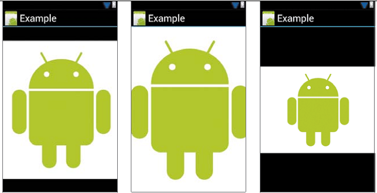
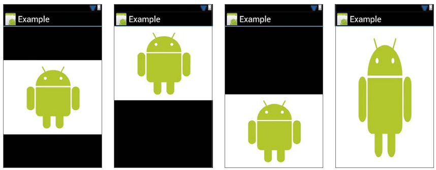

# 图像

[toc]

## 参考

* [Bitmap质量](http://www.curious-creature.org/2010/12/08/bitmap-quality-banding-and-dithering/)。

## ImageView

一般使用内建的`ImageView`显示图像。此View负责加载和优化图像。

### 缩放、对齐

显示图像的最简单的方式是，在布局文件中声明一个ImageView，`src`特性指向一个图像资源（位于`/res/drawable`）。

```xml
	<ImageView
		android:id="@+id/image"
		android:layout_width=”match_parent"
		android:layout_height="match_parent"
		android:scaleType="center"
		android:src="@drawable/ico" />
```

ImageView会负责加载和缩放。选择`android:scaleType`为`center`，图像将以原来的分辨率显示在View中央。其他`android:scaleType`见下表：

- `center` 在View中居中显示，不缩放
- `centerCrop` 缩放图像使x和y轴都要大于等于视图；保持比例；超过View的部分截掉；在View居中。
- `centerInside` 缩放图像，适应View大小；保持比例；｛｛整个图像都要显示出来｝｝居中。
- `fitCenter` 缩放图像，适应View大小，保持比例。至少有一边匹配View，居中。
- `fitStart` 与`fitCenter`类似，差别在于对齐View的左上角。
- `fitEnd` 与`fitCenter`类似，差别在于对齐View的右下角。
- `fitXY` 缩放，大小与视图相同，因此可能改变比例。
- `matrix` Scales the image using a supplied Matrix class. The matrix can be supplied using the `setImageMatrix` method. A Matrix class can be used to apply `transformations` such as rotations to an image.

下面展示`android:scaleType`的各种效果。上面一行从左到右分别是：center, centerCrop, centerInside。下面一行，从左到右：fitCenter, fitStart, fitEnd, fitXY。






## Bitmaps

图片放在`/res/drawable`文件夹下。可以为不同设备放置不同规格的图像：drawable-ldpi, drawable-mdpi, drawable-hdpi和drawable-xhdpi。每个文件夹下的文件名要相同，Android资源管理器会为你选择合适的文件夹。

如果某个解析度的图片未找到，Android将选择最近匹配。Android一般会选择*缩小大的*图像。默认应该创建*hdpi*图像。你应该努力为所有解析度创建资源，**避免不必要的硬件缩放**，防止减慢UI的绘制。利用R对象引用图片资源。

图片应该是以下几种格式：PNG（最优）、JPEG（可接受）、GiF（不推荐使用）。也可以9-patch图像。

可以在运行时创建图像并添加到布局。例如从Internet下载。使用Bitmap封装图像，并加载到UI。`Bitmap`类是一个到bitmap图像的引用。可以利用`BitmapFactory`从任何源创建bitmap图像，包括App内资源、文件、任意的InputStream。通过setImageBitmap可以将Bitmap对象加载到ImageView。

```java
Bitmap bitmap = Bitmap.createBitmap(100, 100, Bitmap.Config.ARGB_8888);
ImageView iv = (ImageView) findViewById(R.id.image);
iv.setImageBitmap(bitmap);
```

处理和加载Bitmap时要考虑的三个问题：

* 保持UI响应，一般要异步加载。
* 异步进一步可能引发并发问题。如果ImageView被重用，之前一个异步未完成，又要加载另一个图片，又启动一个新的异步。两个异步完成的前后时序是不定的。
* 避免超出内存限制。如果不小心，bitmap很容易消耗掉内存budget，导致应用因下面的异常崩溃：`java.lang.OutofMemoryError: bitmap size exceeds VM budget`。

内存限制对加载Bitmap造成的麻烦：

* 设备一般有受限的系统资源。对单个应用最少可以分配16MB内存。The Android Compatibility Definition Document (CDD), Section 3.7. Virtual Machine Compatibility 规定过了不同屏幕大小和解析度要求达到的最少应用内存。应用应该根据这个限制优化。很多设备会提高这个限制。
* Bitmaps会占据很多内存。例如，Galaxy Nexus上的摄像头能拍摄`2592 * 1936`像素（`5M`像素）。如果bitmap配置使用`ARGB_8888`（Android 2.3之后的默认配置），则将该图片加载到内存要消耗19MB（`2592 * 1936 * 4 bytes`）——立刻超出了一些设备上的*单应用限制*。
* Android应用的UI经常需要多个bitmaps同时加载。如`ListView`, `GridView`和`ViewPager`。

## Drawable

不是所有的图形都是图像——Android可以让你使用XML创建图形或使用定制的绘图代码。要使用XML创建图形，需要使用Drawable类。一个Drawable可以是图像、一个XML资源或一个定制的类，Drawable是它们的通用抽象。

Android框架大量对内建的UI View使用drawables。例如Button类，使用XML定义按钮可能的状态。例子：

```xml
<?xml version=”1.0” encoding=”utf-8”?>
<selector xmlns:android=”http://schemas.android.com/apk/res/android”>
    <item android:state_pressed=”true”
        android:drawable=”@drawable/button_pressed” />
    <item android:state_focused=”true”
        android:drawable=”@drawable/button_focused” />
    <item android:state_hovered=”true”
        android:drawable=”@drawable/button_hovered” />
    <item android:drawable=”@drawable/button_normal” />
</selector>
```

这是一个`StateListDrawable`。它为不同状态定义了一组drawables。StateListDrawable中的每个`item`定义了一个drawable：android:drawable特性引入一个实际的i图像的drawable。`StateListDrawable`不是寻找最优匹配，而是找到第一个匹配的就停下。查找是从上到下进行的，因此顺序是重要的。

其他可能。在一个bitmap的基础上增加简单的**变换（transformations）**。向图像上添加padding和抖动（dithering）。可以组合多个bitmaps创建一个复合图像。或使用XML绘制一个形状：ShapeDrawable。可以添加渐变、阴影、圆角。本书不会介绍各种XML drawable。

注意：将图像绘制进View使用系统标准的绘制过程。在Android 3.0之前，该过程不是完全硬件加速的。注意大量图形的应用使用这种过程在老版本上将不能表现良好。

## 加载大分辨率（resolution）图像通用建议

> 这里讨论的是加载大分辨率图像，如`1920*1080`，即最终显示的图像就要这么大。而后面几节讨论的问题，是原图很大，但显示目标很小，如显示缩略图。我们要解决的问题是，原图很大，目标也很大，如把`1920*1080`显示在`1920*1080`的屏幕上。

* 确保内存中只有一个Bitmap实例。显示完之后，调用`recycle()`，**并把引用设置null**。 可以使用[Memory Allocation Tracker](http://android-developers.blogspot.com/2009/02/track-memory-allocations.html)。 You can also read HPROF files, as suggested in comments.

## 加载缩小版的Bitmap

图片的实际大小很可能超过显示它的UI大小。For example, the system Gallery application displays photos taken using your Android devices's camera which are typically much higher resolution than the screen *density* of your device.因为内存有限，理想情况下只加载**低分辨率（lower resolution）**的版本到内存。高出屏幕的分辨率没有什么用处。例如，不必要将一个`1024x768`像素的图片加载到一个`128x96`大的ImageView中。

本课介绍，解码（decode）大的bitmaps，加载一个采样到内存，不超过单应用内存限制。

### 读取Bitmap分辨率和类型

避免`java.lang.OutOfMemory`异常，解耦前检查bitmap维度，除非你完全信任图片源的大小适合。

BitmapFactory类提供的解码方法（decodeByteArray()、decodeFile()、decodeResource()等），会尝试为构建的bitmap分配内存。但如果解码时设置解码选项（`BitmapFactory.Options`）`inJustDecodeBounds`为`true`，会避免分配内存，此时bitmap对象返回`null`，但`outWidth`, `outHeight`和`outMimeType`会被设值。这些技术使得你可以在构造bitmap（和分配内存）之前读取维度和图像类型。

```java
BitmapFactory.Options options = new BitmapFactory.Options();
options.inJustDecodeBounds = true;
BitmapFactory.decodeResource(getResources(), R.id.myimage, options);
int imageHeight = options.outHeight;
int imageWidth = options.outWidth;
String imageType = options.outMimeType;
```

### 加载一个缩小（Scaled Down）的版本到内存

在知道图像尺寸后，可以决定直接加载完整图片，还是加载采样版本。下面是要考虑的因素：

* 估计将全部图像加载到内存的内存使用
* 你向使用多少内存加载此图片
* 目标ImageView或UI组件的尺寸。
* 当前设备的屏幕大小和分辨率。

若想告诉解码器加载小版本图像到内存，设置`BitmapFactory.Options`对象的`inSampleSize` 为`true`｛｛这里应该有错，貌似不是`inSampleSize`｝｝。例如`inSampleSize` 取4，即`2048x1536`压缩4倍到`512x384`，将加载`0.75MB`而不是`12MB`（假如使用ARGB_8888）。下面是计算`inSampleSize`的方法。这个值是2的倍数。使用2的倍数是因为解码器最终会把值近似到2的倍数，参见`inSampleSize`文档｛｛缩小时，一半一半的缩小（比缩小0.75获取其他非一半的值）失真小｝｝：

```java
public static int calculateInSampleSize(BitmapFactory.Options options, int reqWidth, int reqHeight) {
    // 图像的原生高度和宽度
    final int height = options.outHeight;
    final int width = options.outWidth;
    int inSampleSize = 1;

    if (height > reqHeight || width > reqWidth) {
        final int halfHeight = height / 2;
        final int halfWidth = width / 2;

        // 计算可能的inSampleSize的最大值。该值要是2的平方
        // 同时使得宽和高要大于请求的宽高
        while ((halfHeight / inSampleSize) > reqHeight && (halfWidth / inSampleSize) > reqWidth) {
            inSampleSize *= 2;
        }
    }

    return inSampleSize;
}
```

要使用该方法，先设置`inJustDecodeBounds`为true。然后再利用`inSampleSize`（inJustDecodeBounds改回false）重新解码：

```java
public static Bitmap decodeSampledBitmapFromResource(Resources res, int resId, 
    int reqWidth, int reqHeight) {
    // 先检测大小，设置inJustDecodeBounds=true
    final BitmapFactory.Options options = new BitmapFactory.Options();
    options.inJustDecodeBounds = true;
    BitmapFactory.decodeResource(res, resId, options);

    // Calculate inSampleSize
    options.inSampleSize = calculateInSampleSize(options, reqWidth, reqHeight);

    // Decode bitmap with inSampleSize set
    options.inJustDecodeBounds = false;
    return BitmapFactory.decodeResource(res, resId, options);
}
```

使用实例，将任意大的图片加载为100*100大小：

	mImageView.setImageBitmap(decodeSampledBitmapFromResource(getResources(), R.id.myimage, 100, 100));

## 在UI线程之外处理Bitmap

如果数据源在磁盘或网络，不要在主UI线程中使用`BitmapFactory.decode*`。加载需要的时间是不可预测的。本节介绍用`AsyncTask`在后台线程处理图像。

### 使用AsyncTask

例子，使用AsyncTask将图片加载到ImageView：

	class BitmapWorkerTask extends AsyncTask<Integer, Void, Bitmap> {
	    private final WeakReference<ImageView> imageViewReference;
	    private int data = 0;
	
	    public BitmapWorkerTask(ImageView imageView) {
	        // 使用WeakReference，确保ImageView可被GC
	        imageViewReference = new WeakReference<ImageView>(imageView);
	    }
	
	    // Decode image in background.
	    @Override
	    protected Bitmap doInBackground(Integer... params) {
	        data = params[0];
	        return decodeSampledBitmapFromResource(getResources(), data, 100, 100));
	    }
	
	    @Override
	    protected void onPostExecute(Bitmap bitmap) {
	        if (imageViewReference != null && bitmap != null) {
	            final ImageView imageView = imageViewReference.get();
	            if (imageView != null) {
	                imageView.setImageBitmap(bitmap);
	            }
	        }
	    }
	}

`WeakReference`使得`AsyncTask`不会阻碍GC。当任务完成后，`ImageView`可能已不在，因此必须在onPostExecute()中检查它是否存在。

使用Task：

	public void loadBitmap(int resId, ImageView imageView) {
	    BitmapWorkerTask task = new BitmapWorkerTask(imageView);
	    task.execute(resId);
	}

### 处理并发

`ListView`和`GridView`与`AsyncTask`连用时有新问题。为了高效使用内存，这些组件在用户滚动后，会重用子View。当一个子View被重用时，之前注册的`AsyncTask`可能尚未执行完。**异步任务启动的次序与结束的顺序可能不一致**。

解决办法是`ImageView`保存一个最新的`AsyncTask`引用。任务完成后，检查自己是不是`ImageView`最新的`AsyncTask`。为此，创建一个`BitmapDrawable`子类，引用`AsyncTask`。本例使用一个`BitmapDrawable`，在完成前先显式一个占位图像：
	
	static class AsyncDrawable extends BitmapDrawable {
	    private final WeakReference<BitmapWorkerTask> bitmapWorkerTaskReference;
	
	    public AsyncDrawable(Resources res, Bitmap bitmap, BitmapWorkerTask bitmapWorkerTask) {
	        super(res, bitmap);
	        bitmapWorkerTaskReference = new WeakReference<BitmapWorkerTask>(bitmapWorkerTask);
	    }
	
	    public BitmapWorkerTask getBitmapWorkerTask() {
	        return bitmapWorkerTaskReference.get();
	    }
	}

执行`BitmapWorkerTask`前，创建一个`AsyncDrawable`，绑定到目标`ImageView`：

	public void loadBitmap(int resId, ImageView imageView) {
	    if (cancelPotentialWork(resId, imageView)) {
	        final BitmapWorkerTask task = new BitmapWorkerTask(imageView);
	        final AsyncDrawable asyncDrawable =
				new AsyncDrawable(getResources(), mPlaceHolderBitmap, task);
	        imageView.setImageDrawable(asyncDrawable);
	        task.execute(resId);
	    }
	}

`cancelPotentialWork`检查是否已有一个任务与`ImageView`关联。如果是，尝试先取消之前的任务。如果任务恰好在处理同一个图像｛｛相同resourceId｝｝，则返回false。

	public static boolean cancelPotentialWork(int data, ImageView imageView) {
	    final BitmapWorkerTask bitmapWorkerTask = getBitmapWorkerTask(imageView);
	
	    if (bitmapWorkerTask != null) {
	        final int bitmapData = bitmapWorkerTask.data;
	        // If bitmapData is not yet set or it differs from the new data
	        if (bitmapData == 0 || bitmapData != data) {
	            // Cancel previous task
	            bitmapWorkerTask.cancel(true);
	        } else {
	            // The same work is already in progress
	            return false;
	        }
	    }
	    // No task associated with the ImageView, or an existing task was cancelled
	    return true;
	}

`getBitmapWorkerTask()`方法获取与`ImageView`关联的任务：

	private static BitmapWorkerTask getBitmapWorkerTask(ImageView imageView) {
	   if (imageView != null) {
	       final Drawable drawable = imageView.getDrawable();
	       if (drawable instanceof AsyncDrawable) {
	           final AsyncDrawable asyncDrawable = (AsyncDrawable) drawable;
	           return asyncDrawable.getBitmapWorkerTask();
	       }
	    }
	    return null;
	}

最后在`onPostExecute()`中检查，任务是否已被取消，检查`ImageView`的最新任务是否是自己：

	class BitmapWorkerTask extends AsyncTask<Integer, Void, Bitmap> {
	    ...
	
	    @Override
	    protected void onPostExecute(Bitmap bitmap) {
	        if (isCancelled()) {
	            bitmap = null;
	        }
	
	        if (imageViewReference != null && bitmap != null) {
	            final ImageView imageView = imageViewReference.get();
	            final BitmapWorkerTask bitmapWorkerTask =
	                    getBitmapWorkerTask(imageView);
	            if (this == bitmapWorkerTask && imageView != null) {
	                imageView.setImageBitmap(bitmap);
	            }
	        }
	    }
	}


## 缓存Bitmaps

离屏View可能被重用。GC会释放掉已加载的bitmaps（只要没有其他引用）。为保证流畅，应避免图片每次出现时都要处理一次。内存和磁盘缓存可以加快加载已处理的图片。

### 内存缓存

`LruCache`类（支持库中也有）特别适合缓存bitmaps，将最近引用的对象放在一个强引用的`LinkedHashMap`中，当缓存超出限制后移除之前的成员。

> 注意：之前流行的Bitmap内存缓存实现`SoftReference`或`WeakReference`已不推荐使用。从Android 2.3 (API Level 9)开始，GC对soft/weak引用的收集更加激进，使得它们不是很有效。Android 3.0 (API Level 11)之前，bitmap背后的数据存在在native memory，其施放不能很好的预测，potentially causing an application to briefly exceed its memory limits and crash。

考虑LruCache的大小时，考虑｛｛基本很难实践｝｝：

* How memory intensive is the rest of your activity and/or application?
* How many images will be on-screen at once? How many need to be available ready to come on-screen?
* What is the screen size and density of the device? An extra high density screen (xhdpi) device like Galaxy Nexus will need a larger cache to hold the same number of images in memory compared to a device likeNexus S (hdpi).
* What dimensions and configuration are the bitmaps and therefore how much memory will each take up?
* How frequently will the images be accessed? Will some be accessed more frequently than others? If so, perhaps you may want to keep certain items always in memory or even have multiple LruCache objects for different groups of bitmaps.
* Can you balance quality against quantity? Sometimes it can be more useful to store a larger number of lower quality bitmaps, potentially loading a higher quality version in another background task.

太小的缓存其附加开销得不偿失，太大的缓存由可能造成`java.lang.OutOfMemory`。

Here’s an example of setting up a LruCache for bitmaps:

	private LruCache<String, Bitmap> mMemoryCache;
	
	@Override
	protected void onCreate(Bundle savedInstanceState) {
	    ...
	    // 获取最多可用的VM内存。
	    final int maxMemory = (int) (Runtime.getRuntime().maxMemory() / 1024);
	
	    // 利用1/8
	    final int cacheSize = maxMemory / 8;
	
	    mMemoryCache = new LruCache<String, Bitmap>(cacheSize) {
	        @Override
	        protected int sizeOf(String key, Bitmap bitmap) {
	            // 缓存大小单位K
	            return bitmap.getByteCount() / 1024;
	        }
	    };
	    ...
	}
	
	public void addBitmapToMemoryCache(String key, Bitmap bitmap) {
	    if (getBitmapFromMemCache(key) == null) {
	        mMemoryCache.put(key, bitmap);
	    }
	}
	
	public Bitmap getBitmapFromMemCache(String key) {
	    return mMemoryCache.get(key);
	}

> Note: In this example, one eighth of the application memory is allocated for our cache. On a normal/hdpi device this is a minimum of around 4MB (32/8). A full screen GridView filled with images on a device with 800x480 resolution would use around 1.5MB (800*480*4 bytes), 因此少可以缓存2.5页图片在内存。

加载BIT时，先检查`LruCache`：

	public void loadBitmap(int resId, ImageView imageView) {
	    final String imageKey = String.valueOf(resId);
	
	    final Bitmap bitmap = getBitmapFromMemCache(imageKey);
	    if (bitmap != null) {
	        mImageView.setImageBitmap(bitmap);
	    } else {
	        mImageView.setImageResource(R.drawable.image_placeholder);
	        BitmapWorkerTask task = new BitmapWorkerTask(mImageView);
	        task.execute(resId);
	    }
	}

`BitmapWorkerTask`在加载成功后填充缓存：

	class BitmapWorkerTask extends AsyncTask<Integer, Void, Bitmap> {
	    ...
	    // Decode image in background.
	    @Override
	    protected Bitmap doInBackground(Integer... params) {
	        final Bitmap bitmap = decodeSampledBitmapFromResource(
	                getResources(), params[0], 100, 100));
	        addBitmapToMemoryCache(String.valueOf(params[0]), bitmap);
	        return bitmap;
	    }
	    ...
	}

### 磁盘缓存

内存缓存还易失。如果被其他应用打断（如电话），内存缓存可能丢失。

从匹配获取图片比内存慢（或不可预测），应在后台线程中做。

> Note: A ContentProvider might be a more appropriate place to store cached images if they are accessed more frequently, for example in an image gallery application.

The sample code of this class uses a DiskLruCache implementation that is pulled from the Android source. Here’s updated example code that adds a disk cache in addition to the existing memory cache:

	private DiskLruCache mDiskLruCache;
	private final Object mDiskCacheLock = new Object();
	private boolean mDiskCacheStarting = true;
	private static final int DISK_CACHE_SIZE = 1024 * 1024 * 10; // 10MB
	private static final String DISK_CACHE_SUBDIR = "thumbnails";
	
	@Override
	protected void onCreate(Bundle savedInstanceState) {
	    ...
	    // Initialize memory cache
	    ...
	    // Initialize disk cache on background thread
	    File cacheDir = getDiskCacheDir(this, DISK_CACHE_SUBDIR);
	    new InitDiskCacheTask().execute(cacheDir);
	    ...
	}
	
	class InitDiskCacheTask extends AsyncTask<File, Void, Void> {
	    @Override
	    protected Void doInBackground(File... params) {
	        synchronized (mDiskCacheLock) {
	            File cacheDir = params[0];
	            mDiskLruCache = DiskLruCache.open(cacheDir, DISK_CACHE_SIZE);
	            mDiskCacheStarting = false; // Finished initialization
	            mDiskCacheLock.notifyAll(); // Wake any waiting threads
	        }
	        return null;
	    }
	}
	
	class BitmapWorkerTask extends AsyncTask<Integer, Void, Bitmap> {
	    ...
	    // Decode image in background.
	    @Override
	    protected Bitmap doInBackground(Integer... params) {
	        final String imageKey = String.valueOf(params[0]);
	
	        // Check disk cache in background thread
	        Bitmap bitmap = getBitmapFromDiskCache(imageKey);
	
	        if (bitmap == null) { // Not found in disk cache
	            // Process as normal
	            final Bitmap bitmap = decodeSampledBitmapFromResource(
	                    getResources(), params[0], 100, 100));
	        }
	
	        // Add final bitmap to caches
	        addBitmapToCache(imageKey, bitmap);
	
	        return bitmap;
	    }
	    ...
	}
	
	public void addBitmapToCache(String key, Bitmap bitmap) {
	    // Add to memory cache as before
	    if (getBitmapFromMemCache(key) == null) {
	        mMemoryCache.put(key, bitmap);
	    }
	
	    // Also add to disk cache
	    synchronized (mDiskCacheLock) {
	        if (mDiskLruCache != null && mDiskLruCache.get(key) == null) {
	            mDiskLruCache.put(key, bitmap);
	        }
	    }
	}
	
	public Bitmap getBitmapFromDiskCache(String key) {
	    synchronized (mDiskCacheLock) {
	        // Wait while disk cache is started from background thread
	        while (mDiskCacheStarting) {
	            try {
	                mDiskCacheLock.wait();
	            } catch (InterruptedException e) {}
	        }
	        if (mDiskLruCache != null) {
	            return mDiskLruCache.get(key);
	        }
	    }
	    return null;
	}
	
	// Creates a unique subdirectory of the designated app cache directory. Tries to use external
	// but if not mounted, falls back on internal storage.
	public static File getDiskCacheDir(Context context, String uniqueName) {
	    // Check if media is mounted or storage is built-in, if so, try and use external cache dir
	    // otherwise use internal cache dir
	    final String cachePath =
	            Environment.MEDIA_MOUNTED.equals(Environment.getExternalStorageState()) ||
	                    !isExternalStorageRemovable() ? getExternalCacheDir(context).getPath() :
	                            context.getCacheDir().getPath();
	
	    return new File(cachePath + File.separator + uniqueName);
	}

> Note: Even initializing the disk cache requires disk operations and therefore should not take place on the main thread. However, this does mean there's a chance the cache is accessed before initialization. To address this, in the above implementation, a lock object ensures that the app does not read from the disk cache until the cache has been initialized.

检查内存缓存可以在UI线程，但检查磁盘缓存要在后台线程中做。

### 处理运行时配置改变

如朝向改变。导致Android销毁和重启活动。You want to avoid having to process all your images again so the user has a smooth and fast experience when a configuration change occurs.

可以将内存缓存通过一个Fragment传给Activity。并将此Fragment通过`setRetainInstance(true)`保存。活动被重建后，该保持的Fragment被重新赋给Activity，allowing images to be quickly fetched and re-populated into the ImageView objects。

Here’s an example of retaining a LruCache object across configuration changes using a Fragment:

	private LruCache<String, Bitmap> mMemoryCache;
	@Override
	protected void onCreate(Bundle savedInstanceState) {
	    ...
	    RetainFragment retainFragment =
	            RetainFragment.findOrCreateRetainFragment(getFragmentManager());
	    mMemoryCache = retainFragment.mRetainedCache;
	    if (mMemoryCache == null) {
	        mMemoryCache = new LruCache<String, Bitmap>(cacheSize) {
	            ... // Initialize cache here as usual
	        }
	        retainFragment.mRetainedCache = mMemoryCache;
	    }
	    ...
	}
	
	class RetainFragment extends Fragment {
	    private static final String TAG = "RetainFragment";
	    public LruCache<String, Bitmap> mRetainedCache;
	
	    public RetainFragment() {}
	
	    public static RetainFragment findOrCreateRetainFragment(FragmentManager fm) {
	        RetainFragment fragment = (RetainFragment) fm.findFragmentByTag(TAG);
	        if (fragment == null) {
	            fragment = new RetainFragment();
	            fm.beginTransaction().add(fragment, TAG).commit();
	        }
	        return fragment;
	    }
	
	    @Override
	    public void onCreate(Bundle savedInstanceState) {
	        super.onCreate(savedInstanceState);
	        setRetainInstance(true);
	    }
	}

## 管理Bitmap内存

扩展阅读：

* [Memory Analysis for Android Applications blog post](http://android-developers.blogspot.com/2011/03/memory-analysis-for-android.html)
* [Memory management for Android AppsGoogle I/O presentation](http://www.google.com/events/io/2011/sessions/memory-management-for-android-apps.html)

帮助GC或Bitmap重用，接下来是一些与特定Android版本相关的技巧。

下面是Android对关联bitmap内存的演进：

* 在Android Android 2.2 (API level 8)及之前，GC是，应用的线程们停止。Android 2.3增加了并发GC，which means that the memory is reclaimed soon after a bitmap is no longer referenced.
* 在Android 2.3.3 (API level 10)和之前，bitmap之后的像素数据存放在native内存。与bitmap自身不在一起（Bitmap放在Dalvik heap中）。native内存中像素数据的释放不是可预测的，potentially causing an application to briefly exceed its memory limits and crash. 从Android 3.0 (API level 11)开始，像素数据与Bitmap一起存放在Dalvik heap中。

### 管理Android 2.3.3（和之前）的内存

On Android 2.3.3 (API level 10) and lower, using recycle() is recommended. If you're displaying large amounts of bitmap data in your app, you're likely to run into OutOfMemoryError errors. The recycle() method allows an app to reclaim memory as soon as possible.

> Caution: You should use recycle() only when you are sure that the bitmap is no longer being used. If you callrecycle() and later attempt to draw the bitmap, you will get the error: "Canvas: trying to use a recycled bitmap".

The following code snippet gives an example of calling recycle(). It uses reference counting (in the variablesmDisplayRefCount and mCacheRefCount) to track whether a bitmap is currently being displayed or in the cache. The code recycles the bitmap when these conditions are met:

* The reference count for both mDisplayRefCount and mCacheRefCount is 0.
* The bitmap is not null, and it hasn't been recycled yet.

代码：

	private int mCacheRefCount = 0;
	private int mDisplayRefCount = 0;
	...
	// Notify the drawable that the displayed state has changed.
	// Keep a count to determine when the drawable is no longer displayed.
	public void setIsDisplayed(boolean isDisplayed) {
	    synchronized (this) {
	        if (isDisplayed) {
	            mDisplayRefCount++;
	            mHasBeenDisplayed = true;
	        } else {
	            mDisplayRefCount--;
	        }
	    }
	    // Check to see if recycle() can be called.
	    checkState();
	}
	
	// Notify the drawable that the cache state has changed.
	// Keep a count to determine when the drawable is no longer being cached.
	public void setIsCached(boolean isCached) {
	    synchronized (this) {
	        if (isCached) {
	            mCacheRefCount++;
	        } else {
	            mCacheRefCount--;
	        }
	    }
	    // Check to see if recycle() can be called.
	    checkState();
	}
	
	private synchronized void checkState() {
	    // If the drawable cache and display ref counts = 0, and this drawable
	    // has been displayed, then recycle.
	    if (mCacheRefCount <= 0 && mDisplayRefCount <= 0 && mHasBeenDisplayed
	            && hasValidBitmap()) {
	        getBitmap().recycle();
	    }
	}
	
	private synchronized boolean hasValidBitmap() {
	    Bitmap bitmap = getBitmap();
	    return bitmap != null && !bitmap.isRecycled();
	}


### 关联Android 3.0及之后

Android 3.0 (API level 11)引入了`BitmapFactory.Options.inBitmap`。如果设置了这个选项，解码方法在加载内容时将尝试重用一个存在的bitmap。This means that the bitmap's memory is reused, resulting in improved performance, and removing both memory allocation and de-allocation. However, there are certain restrictions with how inBitmap can be used. In particular, before Android 4.4 (API level 19), 只有大小相等bitmaps才支持。参见[inBitmap](http://developer.android.com/reference/android/graphics/BitmapFactory.Options.html#inBitmap)文档。

#### Save a bitmap for later use

The following snippet demonstrates how an existing bitmap is stored for possible later use in the sample app. When an app is running on Android 3.0 or higher and a bitmap is evicted from the LruCache, a soft reference to the bitmap is placed in a HashSet, for possible reuse later with inBitmap:

	Set<SoftReference<Bitmap>> mReusableBitmaps;
	private LruCache<String, BitmapDrawable> mMemoryCache;
	
	// If you're running on Honeycomb or newer, create a
	// synchronized HashSet of references to reusable bitmaps.
	if (Utils.hasHoneycomb()) {
	    mReusableBitmaps =
	            Collections.synchronizedSet(new HashSet<SoftReference<Bitmap>>());
	}
	
	mMemoryCache = new LruCache<String, BitmapDrawable>(mCacheParams.memCacheSize) {
	
	    // Notify the removed entry that is no longer being cached.
	    @Override
	    protected void entryRemoved(boolean evicted, String key,
	            BitmapDrawable oldValue, BitmapDrawable newValue) {
	        if (RecyclingBitmapDrawable.class.isInstance(oldValue)) {
	            // The removed entry is a recycling drawable, so notify it
	            // that it has been removed from the memory cache.
	            ((RecyclingBitmapDrawable) oldValue).setIsCached(false);
	        } else {
	            // The removed entry is a standard BitmapDrawable.
	            if (Utils.hasHoneycomb()) {
	                // We're running on Honeycomb or later, so add the bitmap
	                // to a SoftReference set for possible use with inBitmap later.
	                mReusableBitmaps.add
	                        (new SoftReference<Bitmap>(oldValue.getBitmap()));
	            }
	        }
	    }
	....
	}

#### Use an existing bitmap

In the running app, decoder methods check to see if there is an existing bitmap they can use. For example:

	public static Bitmap decodeSampledBitmapFromFile(String filename,
		int reqWidth, int reqHeight, ImageCache cache) {
	
	    final BitmapFactory.Options options = new BitmapFactory.Options();
	    ...
	    BitmapFactory.decodeFile(filename, options);
	    ...
	
	    // If we're running on Honeycomb or newer, try to use inBitmap.
	    if (Utils.hasHoneycomb()) {
	        addInBitmapOptions(options, cache);
	    }
	    ...
	    return BitmapFactory.decodeFile(filename, options);
	}

The next snippet shows the addInBitmapOptions() method that is called in the above snippet. It looks for an existing bitmap to set as the value for inBitmap. Note that this method only sets a value for inBitmap if it finds a suitable match (your code should never assume that a match will be found):

	private static void addInBitmapOptions(BitmapFactory.Options options,
		ImageCache cache) {
	    // inBitmap only works with mutable bitmaps, so force the decoder to
	    // return mutable bitmaps.
	    options.inMutable = true;
	
	    if (cache != null) {
	        // Try to find a bitmap to use for inBitmap.
	        Bitmap inBitmap = cache.getBitmapFromReusableSet(options);
	
	        if (inBitmap != null) {
	            // If a suitable bitmap has been found, set it as the value of
	            // inBitmap.
	            options.inBitmap = inBitmap;
	        }
	    }
	}
	
	// This method iterates through the reusable bitmaps, looking for one 
	// to use for inBitmap:
	protected Bitmap getBitmapFromReusableSet(BitmapFactory.Options options) {
	        Bitmap bitmap = null;
	
	    if (mReusableBitmaps != null && !mReusableBitmaps.isEmpty()) {
	        synchronized (mReusableBitmaps) {
	            final Iterator<SoftReference<Bitmap>> iterator
	                    = mReusableBitmaps.iterator();
	            Bitmap item;
	
	            while (iterator.hasNext()) {
	                item = iterator.next().get();
	
	                if (null != item && item.isMutable()) {
	                    // Check to see it the item can be used for inBitmap.
	                    if (canUseForInBitmap(item, options)) {
	                        bitmap = item;
	
	                        // Remove from reusable set so it can't be used again.
	                        iterator.remove();
	                        break;
	                    }
	                } else {
	                    // Remove from the set if the reference has been cleared.
	                    iterator.remove();
	                }
	            }
	        }
	    }
	    return bitmap;
	}

Finally, this method determines whether a candidate bitmap satisfies the size criteria to be used for inBitmap:

	static boolean canUseForInBitmap(
	        Bitmap candidate, BitmapFactory.Options targetOptions) {
	
	    if (Build.VERSION.SDK_INT >= Build.VERSION_CODES.KITKAT) {
	        // From Android 4.4 (KitKat) onward we can re-use if the byte size of
	        // the new bitmap is smaller than the reusable bitmap candidate
	        // allocation byte count.
	        int width = targetOptions.outWidth / targetOptions.inSampleSize;
	        int height = targetOptions.outHeight / targetOptions.inSampleSize;
	        int byteCount = width * height * getBytesPerPixel(candidate.getConfig());
	        return byteCount <= candidate.getAllocationByteCount();
	    }
	
	    // On earlier versions, the dimensions must match exactly and the inSampleSize must be 1
	    return candidate.getWidth() == targetOptions.outWidth
	            && candidate.getHeight() == targetOptions.outHeight
	            && targetOptions.inSampleSize == 1;
	}
	
	/**
	 * A helper function to return the byte usage per pixel of a bitmap based on its configuration.
	 */
	static int getBytesPerPixel(Config config) {
	    if (config == Config.ARGB_8888) {
	        return 4;
	    } else if (config == Config.RGB_565) {
	        return 2;
	    } else if (config == Config.ARGB_4444) {
	        return 2;
	    } else if (config == Config.ALPHA_8) {
	        return 1;
	    }
	    return 1;
	}

## 小结：在UI中显示Bitmap

本课是一个总结。介绍如何加载多个bitmaps到ViewPager和GridView，使用后台线程和Bitmap缓存，处理并发的配置改变。

The swipe view pattern is an excellent way to navigate the detail view of an image gallery. You can implement this pattern using a ViewPager component backed by a PagerAdapter. 但更合适的适配器是子类`FragmentStatePagerAdapter`，which automatically destroys and saves state of the Fragments in the ViewPager as they disappear off-screen, keeping memory usage down.

### 加载Bitmaps到ViewPager

> 如果图片数量不多，不会超过内存限制，则使用普通的`PagerAdapter` 或 `FragmentPagerAdapter`可能更合适。

下面实现ViewPager，ImageView做孩子。主活动负责持有`ViewPager`和适配器：

	public class ImageDetailActivity extends FragmentActivity {
	    public static final String EXTRA_IMAGE = "extra_image";
	
	    private ImagePagerAdapter mAdapter;
	    private ViewPager mPager;
	
	    // A static dataset to back the ViewPager adapter
	    public final static Integer[] imageResIds = new Integer[] {
	            R.drawable.sample_image_1, R.drawable.sample_image_2, R.drawable.sample_image_3,
	            R.drawable.sample_image_4, R.drawable.sample_image_5, R.drawable.sample_image_6,
	            R.drawable.sample_image_7, R.drawable.sample_image_8, R.drawable.sample_image_9};
	
	    @Override
	    public void onCreate(Bundle savedInstanceState) {
	        super.onCreate(savedInstanceState);
	        setContentView(R.layout.image_detail_pager); // 只包含一个ViewPager
	
	        mAdapter = new ImagePagerAdapter(getSupportFragmentManager(), imageResIds.length);
	        mPager = (ViewPager) findViewById(R.id.pager);
	        mPager.setAdapter(mAdapter);
	    }
	
	    public static class ImagePagerAdapter extends FragmentStatePagerAdapter {
	        private final int mSize;
	
	        public ImagePagerAdapter(FragmentManager fm, int size) {
	            super(fm);
	            mSize = size;
	        }
	
	        @Override
	        public int getCount() {
	            return mSize;
	        }
	
	        @Override
	        public Fragment getItem(int position) {
	            return ImageDetailFragment.newInstance(position);
	        }
	    }

	
	    public void loadBitmap(int resId, ImageView imageView) {
	        mImageView.setImageResource(R.drawable.image_placeholder);
	        BitmapWorkerTask task = new BitmapWorkerTask(mImageView);
	        task.execute(resId);
	    }
    
		... // include BitmapWorkerTask class
	}

下面是详情Fragment，有一个孩子ImageView。

	public class ImageDetailFragment extends Fragment {
	    private static final String IMAGE_DATA_EXTRA = "resId";
	    private int mImageNum;
	    private ImageView mImageView;
	
	    static ImageDetailFragment newInstance(int imageNum) {
	        final ImageDetailFragment f = new ImageDetailFragment();
	        final Bundle args = new Bundle();
	        args.putInt(IMAGE_DATA_EXTRA, imageNum);
	        f.setArguments(args);
	        return f;
	    }
	
	    // Empty constructor, required as per Fragment docs
	    public ImageDetailFragment() {}
	
	    @Override
	    public void onCreate(Bundle savedInstanceState) {
	        super.onCreate(savedInstanceState);
	        mImageNum = getArguments() != null ? getArguments().getInt(IMAGE_DATA_EXTRA) : -1;
	    }
	
	    @Override
	    public View onCreateView(LayoutInflater inflater, ViewGroup container,
	            Bundle savedInstanceState) {
	        // image_detail_fragment.xml contains just an ImageView
	        final View v = inflater.inflate(R.layout.image_detail_fragment, container, false);
	        mImageView = (ImageView) v.findViewById(R.id.imageView);
	        return v;
	    }

	    @Override
	    public void onActivityCreated(Bundle savedInstanceState) {
	        super.onActivityCreated(savedInstanceState);
	        if (ImageDetailActivity.class.isInstance(getActivity())) {
	            final int resId = ImageDetailActivity.imageResIds[mImageNum];
	            // Call out to ImageDetailActivity to load the bitmap in a background thread
	            ((ImageDetailActivity) getActivity()).loadBitmap(resId, mImageView);
	        }
	    }

	}

Here's the additional modifications for a memory cache:

	public class ImageDetailActivity extends FragmentActivity {
	    ...
	    private LruCache<String, Bitmap> mMemoryCache;
	
	    @Override
	    public void onCreate(Bundle savedInstanceState) {
	        ...
	        // initialize LruCache as per Use a Memory Cache section
	    }
	
	    public void loadBitmap(int resId, ImageView imageView) {
	        final String imageKey = String.valueOf(resId);
	
	        final Bitmap bitmap = mMemoryCache.get(imageKey);
	        if (bitmap != null) {
	            mImageView.setImageBitmap(bitmap);
	        } else {
	            mImageView.setImageResource(R.drawable.image_placeholder);
	            BitmapWorkerTask task = new BitmapWorkerTask(mImageView);
	            task.execute(resId);
	        }
	    }
	
	    ... // include updated BitmapWorkerTask from Use a Memory Cache section
	}

### 加载Bitmaps到GridView

	public class ImageGridFragment extends Fragment implements AdapterView.OnItemClickListener {
	    ...
	
	    private class ImageAdapter extends BaseAdapter {
	        ...
	
	        @Override
	        public View getView(int position, View convertView, ViewGroup container) {
	            ...
	            loadBitmap(imageResIds[position], imageView)
	            return imageView;
	        }
	    }
	
	    public void loadBitmap(int resId, ImageView imageView) {
	        if (cancelPotentialWork(resId, imageView)) {
	            final BitmapWorkerTask task = new BitmapWorkerTask(imageView);
	            final AsyncDrawable asyncDrawable =
	                    new AsyncDrawable(getResources(), mPlaceHolderBitmap, task);
	            imageView.setImageDrawable(asyncDrawable);
	            task.execute(resId);
	        }
	    }
	
	    static class AsyncDrawable extends BitmapDrawable {
	        private final WeakReference<BitmapWorkerTask> bitmapWorkerTaskReference;
	
	        public AsyncDrawable(Resources res, Bitmap bitmap,
	                BitmapWorkerTask bitmapWorkerTask) {
	            super(res, bitmap);
	            bitmapWorkerTaskReference =
	                new WeakReference<BitmapWorkerTask>(bitmapWorkerTask);
	        }
	
	        public BitmapWorkerTask getBitmapWorkerTask() {
	            return bitmapWorkerTaskReference.get();
	        }
	    }
	
	    public static boolean cancelPotentialWork(int data, ImageView imageView) {
	        final BitmapWorkerTask bitmapWorkerTask = getBitmapWorkerTask(imageView);
	
	        if (bitmapWorkerTask != null) {
	            final int bitmapData = bitmapWorkerTask.data;
	            if (bitmapData != data) {
	                // Cancel previous task
	                bitmapWorkerTask.cancel(true);
	            } else {
	                // The same work is already in progress
	                return false;
	            }
	        }
	        // No task associated with the ImageView, or an existing task was cancelled
	        return true;
	    }
	
	    private static BitmapWorkerTask getBitmapWorkerTask(ImageView imageView) {
	       if (imageView != null) {
	           final Drawable drawable = imageView.getDrawable();
	           if (drawable instanceof AsyncDrawable) {
	               final AsyncDrawable asyncDrawable = (AsyncDrawable) drawable;
	               return asyncDrawable.getBitmapWorkerTask();
	           }
	        }
	        return null;
	    }
	
	    ... // include updated BitmapWorkerTask class
