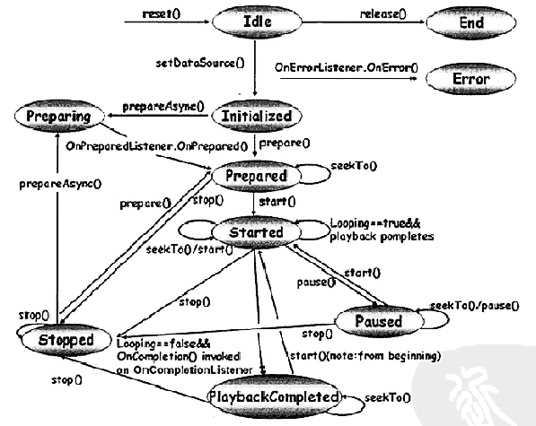

## 1、播放声音（Sound）

`SoundPool`可以高效、轻松的播放声音。

实例化`SoundPool`：
 
	SoundPool soundPool = new SoundPool(20, AudioManager.STREAM_MUSIC, 0);

第一个参数限制多个音效可以同时播放。注意不是限制可以加载多少。

要把音频文件加载到堆，可以使用`SoundPool.load()`方法。我们所有的文件都在`assets/`，因此可用`AssetFileDescriptor`

	AssetFileDescriptor descriptor = assetManager.openFd("explosion.ogg"); 
	intexplosionId = soundPool.load(descriptor, 1);
	soundPool.play(explosionId, 1.0f, 1.0f, 0, 0, 1);

或者，如果文件是`res/raw/musictest`：

	soundPool.load(this, R.raw.musictest, 1)

`SoundPool.load()`的第二个参数指定此声音的优先级。

`soundPool.play()`的第二、三个参数指定左右声道的音量，取值0到1。第四个参数是优先级。第五个是指定循环次数。不推荐循环播放声音特效，因此这里是0。最后一个是播放速度。大于1将快播。

音量参数应该传入当前设定的音量：

	AudioManager am = (AudioManager) this.getSystemService(Context.AUDIO_SERVICE);
	float streamVolumeCurrent = am.getStreamVolume(AudioManager.STREAM_MUSIC);
	float streamVolumeMax = am.getStreamMaxVolume(AudioManager.STREAM_MUSIC);
	float volume = streamVolumeCurrent / streamVolumeMax;
	currStreamId = sp.play(hm.get(sound), volume, volume, 1, loop, 1.0f);

例如SoundPool还可以停止正在播放的声音：

	sp.stop(currStreamId);

注意`currStreamId`是`SoundPool.play`的返回值，不是`SoundPool.load`的返回值。`pause`方法用于暂停音频流。

当我们不再需要某个声音时，可以释放内存：

	soundPool.unload(explosionId); 

一个游戏只要一个SoundPool实例就够了。用完后，最后调用`SoundPool.release()`释放。一般在`onPause()`方法中释放。释放后实例不可再被使用。

注意事项：

* `SoundPool.load()`是异步加载的。即在使用`SoundPool.play()`前需要等。且无法判断加载是否完成（Version 8之前）。
* `SoundPool`播放MP3和长文件有问题（超过五六秒）。我建议只用`OGG`不用MP3。尽可能降低采样率和时间。

## 2、播放音乐（Music）

将短的声音文件放入堆是没问题的。但音乐太长了，因此需要将音乐以流的形式送入音频硬件。即一次只读入一小块，解码成raw PCM，and throw that at the audio chip。

`MediaPlayer`类有10个生命周期状态：

- **Idle状态**：使用new新建一个MediaPlayer实例，或调用其reset方法后，MediaPlayer进入idle状态。  
但通过两种不同方式进入idle状态是有区别的，例如，在此状态下调用`getDuration`方法。若是通过reset进入idle状态会触发`OnErrorListener.onError`，并且MediaPlayer会进入Error状态；如果是新创建的MediaPlayer对象，不会触发onError也不会进入Error状态。
- **End状态**。通过`released`方法进入End状态。不再使用MediaPlayer后，应尽快释放，以释放资源。End是状态。
- **Initialized状态**。调用`setDataSource`后进入Initialized状态。表示要播放的文件已设置好。
- **Prepared状态**。初始化完后，还需要调用`prepare`或`prepareAsync`方法准备。只有进入Prepared状态，才是可播放的。
- **Preparing状态**。主要是为了配合`prepareAsync`方法。异步准备完成后，会触发`OnPreparedListener.onPrepared`，进入Prepared状态。
- **Started状态**。准备好后，调用`start`方法进入Started状态，及播放中状态。可以调用`isPlaying`判断是否在播放中。  
如果设置了循环播放，则播放完毕后，仍会处于Started状态。在该状态了又调用了`seekTo`或`start`方法均可以让MediaPlayer停留在Started状态。
- **Paused状态**。Started状态下调用`pause`方法暂停播放。暂停后可以再调用`start`方法继续播放。暂停状态可以调用`seekTo`方法，不会改变状态。
- **Stop状态**。Started和Paused状态下均可以调用`stop`方法进入Stop状态。处于Stop状态的MediaPlayer想重新播放，需要再次调用`prepare`或`prepareAsync`进入Prepared状态。
- **PlaybackCompleted状态**。文件正常播放完毕，又没有设置循环播放。会触发`OnCompletionListener.onCompletion`。此时可以用`start`重新播放，用`stop`停止，或用`seekTo`重新定位播放位置。
- **Error状态**。发生错误后，会触发`OnErrorListener.onError`方法。进入Error状态后，可以通过`reset`方法恢复，重新进入Idle扎状态。

实例化`MediaPlayer`类：

	MediaPlayer mediaPlayer = new MediaPlayer();

	AssetFileDescriptor descriptor = assetManager.openFd("music.ogg"); 
	mediaPlayer.setDataSource(descriptor.getFileDescriptor(),
		descriptor.getStartOffset(), descriptor.getLength());

`MediaPlayer.setDataSource()`的第一个参数不是`AssetFileDescriptor`，而是`FileDescriptor`。此外还要指定音频文件的偏移和长度。原因是，所有的Assets其实都放在一个文件中。For the MediaPlayer to get to the start of the file we have to provide it with the *offset* of the file within the containing asset file. 

播放前必须先

	mediaPlayer.prepare(); 

在这一步才实际打开文件，检查文件是否能被播放。

循环播放

	mediaPlayer.setLooping(true);

设置左右声道音量，取值0到1：
 
	mediaPlayer.setVolume(1, 1); 

注册`OnCompletionListener`监听器

	mediaPlayer.setOnCompletionListener(listener);  

注意如果`MediaPlayer`处在循环播放过程中，上述方法均无法判断是否结束。