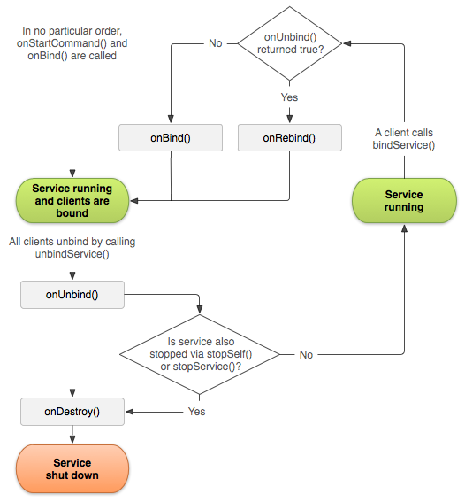

## 服务

[toc]

### 使用场景

使用场景：

- 播放音乐。即使播放器活动已被GC。
- 维护在线聊天连接，即使聊天客户端已丢失焦点（如因为有电话打进）。

### 基础

> **服务运行在宿主进程的主线程** —— 服务不是运行在单独的进程（除非你不这样设定）。如果服务要做一些 CPU 密集或阻塞的操作，如播放 MP3 或网络，应该在服务中创建新线程。防止ANR。

#### 创建服务类

要定义一个服务，创建 `Service` 的子类，并实现关键回调方法：

- `onStartCommand()`：当调用者调用 `startService()` 请求活动启动时，系统调用此方法。此方法执行后，服务被启动，将在后台无限运行。在这种模式下，需要显式停止服务，可以通过 `stopSelf()` 或 `stopService()` 方法。如果服务只用于绑定，不需要实现此方法。
- `onBind()`：当组件想要绑定到服务时（调用 `bindService()`），系统调用该方法。此方法需要返回一个 `IBinder`。该方法必须实现，但如果不想被绑定，只需要返回 `null`。
- `onCreate()`：当活动被第一次创建时，系统调用该方法。（该方法在 `onStartCommand()` 或 `onBind()`）之前执行。如果服务已在运行，不会调用该方法。
- `onDestroy()`：当服务不再被使用，要被摧毁时，系统调用该方法。服务利用该方法清理资源，如线程、监听器、广播接收器。该方法是服务收到的最后一次调用。

#### 在装箱文件中声明服务

服务必须在装箱文件中声明。

```xml
    <manifest ... >
      ...
      <application ... >
          <service android:name=".ExampleService" />
          ...
      </application>
    </manifest>
```

`android:name` 是唯一必须指定的特性。

为了保证应用安全，总是显式的启动或绑定服务，不要为服务声明 intent filters。If it's critical that you allow for some amount of ambiguity as to which service starts, you can supply intent filters for your services and exclude the component name from the Intent, but you then must set the package for the intent with `setPackage()`, which provides sufficient disambiguation for the target service.

若想限制只有你的 App 可以使用此服务，设置 `android:exported` 特性为 `false`。这将阻止其他 App 启动你的服务，使用显式 Intent 也不行。

#### 在前台运行服务

前台服务是用户有知觉的服务，因此最好不要因低内存而杀死。前台服务必须在 status bar 提供一个通知，在"Ongoing"之下，表示通知不能被移除，除非服务被停止，或被移出前台。

例如，播放音乐的服务应该在前台运行，因为用户对它有知觉。status bar 的通知告诉用户当前歌曲，通过它还可以启动一个 Activity 与播放器交互。

要使服务前台运行，调用 `startForeground()`。该方法取两个参数，一个唯一标识通知的整数，一个 Notification 用于 status bar。例如：

```java
Notification notification = new Notification(R.drawable.icon,
	getText(R.string.ticker_text), System.currentTimeMillis());
Intent notificationIntent = new Intent(this, ExampleActivity.class);
PendingIntent pendingIntent = PendingIntent.getActivity(this, 0,
	notificationIntent, 0);
notification.setLatestEventInfo(this, getText(R.string.notification_title),
	getText(R.string.notification_message), pendingIntent);
startForeground(ONGOING_NOTIFICATION_ID, notification);
```

> Caution: The integer ID you give to startForeground() must not be 0.

要把通知从前台移除，调用 `stopForeground()`。该方法接受一个布尔，表示是否同时移除状态条通知。该方法不会停止服务。但，如果你直接停止了一个在前台运行的服务，通知也会被移除。

### 不同的服务类型

服务可以有两种形态：

- Started。应用组件（如活动）通过调用 `startService()` 启动服务。启动后，服务一直在后台运行，*即使启动它的组件被销毁了*。服务一般只做**一个**操作，不返回结果给调用者。例如下载一个文件。完成后，结束自己。
- Bound。一个应用组件通过 `bindService()` 绑定到服务，利用服务提供 *client-server* 接口，与服务交互：发请求接收结果，甚至做跨进程通讯(IPC)。服务可被多个组件绑定。当所有组件都解除绑定后，服务被销毁。

服务可以同时支持启动（一直运行下去）和绑定。关键看你如何实现 `onStartCommand()` 和 `onBind()`。

### Started 服务

应用组件调用 `startService()` 时传入 Intent 指定要启动的服务。这个 Intent 会传给 `onStartCommand()`。记住，`onStartCommand()` 在**主应用线程**调用，因此动作要快。复杂东西放在后台线程做。

要创建一个 started 服务，可以继承两个类：

- `Service`：所有服务的基类。使用该类时，记得开新线程处理费时操作。
- `IntentService`：`Service` 的子类。使用后台线程处理所有start请求，一次一个。如果你不需要你的服务并行处理请求，这是最好的选择。你只要实现 `onHandleIntent()`。`onHandleIntent()` 在默认的后台线程执行。

#### 继承 IntentService 类

`IntentService` 做的事情：

* 创建一个默认的后台线程，执行所有传给 `onStartCommand()` 的 Intent。
* 创建一个工作队列，每次向 `onHandleIntent()` 传一个 Intent。
* 在所有start请求被处理后，停止服务，于是你不必再调用 `stopSelf()`。
* 实现 `onBind()` 并返回 null。
* 实现 `onStartCommand()`，将 Intent 放入队列。

例子：

```java
public class HelloIntentService extends IntentService {

  // 必须有构造器。调用父类。传入后台线程的名字
  public HelloIntentService() {
	  super("HelloIntentService");
  }

  @Override
  protected void onHandleIntent(Intent intent) {
	  long endTime = System.currentTimeMillis() + 5*1000;
	  while (System.currentTimeMillis() < endTime) {
		  synchronized (this) {
			  try {
				  wait(endTime - System.currentTimeMillis());
			  } catch (Exception e) {
			  }
		  }
	  }
  }
}
```

若要覆盖回调方法，如 `onCreate()`, `onStartCommand()`, `onDestroy()`，记得调用父类的方法！

#### 扩展 Service 类

下面的类做的实现与 `IntentService` 一样。即，每次处理一个请求，使用工作线程处理。

```java
public class HelloService extends Service {
  private Looper mServiceLooper;
  private ServiceHandler mServiceHandler;

  // Handler that receives messages from the thread
  private final class ServiceHandler extends Handler {
	  public ServiceHandler(Looper looper) {
		  super(looper);
	  }
	  @Override
	  public void handleMessage(Message msg) {
		  long endTime = System.currentTimeMillis() + 5*1000;
		  while (System.currentTimeMillis() < endTime) {
			  synchronized (this) {
				  try {
					  wait(endTime - System.currentTimeMillis());
				  } catch (Exception e) {
				  }
			  }
		  }
		  // Stop the service using the startId, so that we don't stop
		  // the service in the middle of handling another job
		  stopSelf(msg.arg1);
	  }
  }

  @Override
  public void onCreate() {
	// 创建并启动线程
	HandlerThread thread = new HandlerThread("ServiceStartArguments",
			Process.THREAD_PRIORITY_BACKGROUND);
	thread.start();

	// Get the HandlerThread's Looper and use it for our Handler
	mServiceLooper = thread.getLooper();
	mServiceHandler = new ServiceHandler(mServiceLooper);
  }

  @Override
  public int onStartCommand(Intent intent, int flags, int startId) {
	  Toast.makeText(this, "service starting", Toast.LENGTH_SHORT).show();

	  // For each start request, send a message to start a job and deliver the
	  // start ID so we know which request we're stopping when we finish the job
	  Message msg = mServiceHandler.obtainMessage();
	  msg.arg1 = startId;
	  mServiceHandler.sendMessage(msg);

	  // If we get killed, after returning from here, restart
	  return START_STICKY;
  }

  @Override
  public IBinder onBind(Intent intent) {
	  return null;
  }

  @Override
  public void onDestroy() {
	Toast.makeText(this, "service done", Toast.LENGTH_SHORT).show();
  }
}
```

#### onStartCommand() 的返回值

`onStartCommand()` 的返回值表示，服务被杀死后，系统该如何继续服务。返回值取值：

- `START_NOT_STICKY`：如果系统在 `onStartCommand()` 返回后杀死了服务，不要重启服务，除非有 intent 尚未递送。This is the safest option to avoid running your service when not necessary and when your application can simply restart any unfinished jobs.
- `START_STICKY`：如果系统在 `onStartCommand()` 返回后杀死了服务，重启服务并调用  `onStartCommand()`，但不要递送上一个 Intent。系统调用 `onStartCommand()`，Intent 传 null。但尚未递送的还未执行的（pending）intents会被递送。此选项适合于媒体播放器：不用于执行命令，而是无限运行等待工作。
- `START_REDELIVER_INTENT`：如果系统在 `onStartCommand()` 返回后杀死了服务，重启服务并调用 `onStartCommand()`，递送之前已递送过的**最后一个** Intent。然后调用尚未递送的 intent。此选项适用于服务做的工作需要被立即恢复，如下载一个文件。

#### 启动服务

例子：

```java
Intent intent = new Intent(this, HelloService.class);
startService(intent);
```

`startService()` 方法会立即返回，Android 调用服务的 `onStartCommand()` 方法。如果服务尚未运行，服务会先调用 `onCreate()`，再调用 `onStartCommand()`。

如果期望服务响应一个结果，客户端启动服务时可以创建一个 `PendingIntent` 做广播（with `getBroadcast()`），将此 `PendingIntent` 递送给服务。服务可以用广播返回结果。

多次请求启动服务导致多次调用服务的 `onStartCommand()` 方法。但关闭服务只需一次（`stopSelf()` 或 `stopService()`）。

#### 停止服务

Started 服务必须管理自己的生命周期。因此服务必须调用 `stopSelf()` 停止自己。或者，让其他组件通过  `stopService()` 停止服务。

一旦收到 `stopSelf()` 或 `stopService()`，系统会尽可能快的销毁服务。

如果服务并发收到多个 `onStartCommand()` 请求，在你完成一个请求后，不应该停止服务，因为你可能已经收到一个新的start请求，停止将终止第二个请求。为避免该问题，可以利用 `stopSelf(int)` to ensure that your request to stop the service is always based on the most recent start request. 即调用 `stopSelf(int)` 时，传入请求的ID（`onStartCommand()` 方法的 `startId` 参数）。Then if the service received a new start request before you were able to call `stopSelf(int)`, then the ID will not match and the service will not stop.

> 注意：为了避免浪费系统资源，耗费电池，完成功能后应该停止服务。Even if you enable binding for the service, you must always stop the service yourself if it ever received a call to `onStartCommand()`.

### Bound 服务

绑定服务可以让应用内其他组件与之交互，或令其他应用访问（通过IPC）。

服务在首次收到绑定请求时，会调用 `onBind()` 方法，产生一个 `IBinder`。之后的来自任何组件的绑定请求都将返回同一个 `IBinder`。

#### 创建Bound服务

服务提供 `IBinder` 供客户端与服务交互。定义 `IBinder` 接口有几种方式。

* 继承 `Binder` 类。如果服务是你的应用私有的，与调用者运行在同一进程，应该扩展 `Binder` 类，在 `onBind()` 中返回该类的实例。收到 `Binder` 实例的客户端可以直接访问其公有方法。推荐使用该方法。除非服务可能被其他应用使用，或被其他进程访问。
* 利用 `Messenger`。如果需要跨进程，可以利用 [Messenger](http://developer.android.com/reference/android/os/Messenger.html)为服务创建一个接口。服务定义一个 Handler，处理不同类型的 Message 对象。This Handler is the basis for a Messenger that can then share an IBinder with the client, 其他客户端利用 Message 对象向服务发送命令。客户端还可以定义自己的 Messenger，这样服务就能回送数据。**这是进行IPC最简单的方式**。因为 `Messenger` 将所有请求在单个线程中排队，因此你的服务不需要设计成线程安全的。
* 使用 AIDL。AIDL (Android Interface Definition Language) performs all the work to decompose objects into primitives that the operating system can understand and marshall them across processes to perform IPC. 上一节讲的 `Messenger` 技术，底层实际是基于 `AIDL` 的。As mentioned above, the Messenger creates a queue of all the client requests in a single thread, so the service receives requests one at a time. If, however, 如果你想让服务并发处理多个请求，则可以直接使用 AIDL。此时你的服务必须能解决多线程和线程安全。
To use AIDL directly, you must create an .aidl file that defines the programming interface. The Android SDK tools use this file to generate an abstract class that implements the interface and handles IPC, which you can then extend within your service.

> 注意：多数应用不应使用AIDL实现绑定服务，因为它需要多线程处理，导致实现更复杂。

#### 继承 `Binder` 类

如果你的服务只在应用内使用，且不需要跨进程，则可以实现一个 `Binder` 类并让客户端直接访问该类的公有方法。

Here's how to set it up:

* 创建 `Binder` 类的一个实例，
  * 可以包含公有方法供客户端调用
  * 返回当前的`Service`实例，让客户端调用`Service`的公有方法
  * 或者，returns an instance of another class hosted by the service with public methods the client can call
* `onBind()`方法返回这个`Binder`实例。
* 客户端从`onServiceConnected()`方法接收`Binder`实例。

> The service and client must also be in the same process, because this technique does not perform any marshalling across processes.

For example, here's a service that provides clients access to methods in the service through a Binder implementation:

```java
public class LocalService extends Service {
    // 准备交给客户端的 Binder
    private final IBinder mBinder = new LocalBinder();
    // 随机数产生器
    private final Random mGenerator = new Random();

    /**
     * 限制同进程使用，因此不处理IPC
     */
    public class LocalBinder extends Binder {
        LocalService getService() {
		 	// 返回Service实例，让客户端直接调用Service的方法
            return LocalService.this;
        }
    }

    @Override
    public IBinder onBind(Intent intent) {
        return mBinder;
    }

    /** 客户端可以调用此方法 */
    public int getRandomNumber() {
      return mGenerator.nextInt(100);
    }
}
```

服务使用者代码：

```java
public class BindingActivity extends Activity {
    LocalService mService;
    boolean mBound = false;

    @Override
    protected void onCreate(Bundle savedInstanceState) {
        super.onCreate(savedInstanceState);
        setContentView(R.layout.main);
    }

    @Override
    protected void onStart() {
        super.onStart();
        // Bind to LocalService
        Intent intent = new Intent(this, LocalService.class);
        bindService(intent, mConnection, Context.BIND_AUTO_CREATE);
    }

    @Override
    protected void onStop() {
        super.onStop();
        // Unbind from the service
        if (mBound) {
            unbindService(mConnection);
            mBound = false;
        }
    }

    public void onButtonClick(View v) {
        if (mBound) {
            int num = mService.getRandomNumber();
            Toast.makeText(this, "number: " + num, Toast.LENGTH_SHORT).show();
        }
    }

    /** Defines callbacks for service binding, passed to bindService() */
    private ServiceConnection mConnection = new ServiceConnection() {

        @Override
        public void onServiceConnected(ComponentName className,
                IBinder service) {
            LocalBinder binder = (LocalBinder) service;
            mService = binder.getService(); // 调用Binder的公有方法
            mBound = true;
        }

        @Override
        public void onServiceDisconnected(ComponentName arg0) {
            mBound = false;
        }
    };
}
```

调用服务方法时也要注意，不要阻塞UI线程。

客户端利用`ServiceConnection.onServiceConnected()`绑定到服务。

> Note: The example above doesn't explicitly unbind from the service, but all clients should unbind at an appropriate time (such as when the activity pauses).

For more sample code, see the [LocalService.java](http://developer.android.com/resources/samples/ApiDemos/src/com/example/android/apis/app/LocalService.html) class and the [LocalServiceActivities.java](http://developer.android.com/resources/samples/ApiDemos/src/com/example/android/apis/app/LocalServiceActivities.html) class in [ApiDemos](http://developer.android.com/resources/samples/ApiDemos/index.html).

#### 利用 Messenger

> **与 AIDL 比较**：需要做 IPC 时，利用 `Messenger` 比利用实现 AIDL 简单。因为 Messenger 会把到服务的所有请求放入一个队列；而纯 AIDL 接口向服务并发发送请求，于是必须处理多线程。多数应用不需要多线程，因此 `Messenger` 允许服务一次处理一个调用。

若你需要服务与远程进程通讯，则你可以用 `Messenger` 为服务提供接口。该项技术使得我们不依赖 AIDL 即可进行跨进程通讯。

下面是 `Messenger` 的用法概述：

- 服务实现 `Handler`，接收来自客户端的回调。
- Handler 用于创建一个 Messenger 对象（一个到 Handler 的引用）。
- Messenger 创建一个 IBinder，服务的 `onBind()`返回这个 IBinder。
- 客户端使用 `IBinder` 实例化 `Messenger`（到服务的 `Handler` 的引用），然后利用其向服务发 `Message` 对象。
- 服务在 `Handler` 中接受消息（即在 `handleMessage()` 方法中）。

客户端与服务的交互不是通过调用服务的方法，而是通过向服务发消息。

下面是一个简单的服务的例子：

```java
public class MessengerService extends Service {
    /** Command to the service to display a message */
    static final int MSG_SAY_HELLO = 1;

    // 处理客户端的消息
    class IncomingHandler extends Handler {
        @Override
        public void handleMessage(Message msg) {
            switch (msg.what) {
                case MSG_SAY_HELLO:
                    Toast.makeText(getApplicationContext(), "hello!", Toast.LENGTH_SHORT).show();
                    break;
                default:
                    super.handleMessage(msg);
            }
        }
    }

    // Target we publish for clients to send messages to IncomingHandler.
    final Messenger mMessenger = new Messenger(new IncomingHandler());

    @Override
    public IBinder onBind(Intent intent) {
        Toast.makeText(getApplicationContext(), "binding", Toast.LENGTH_SHORT).show();
        return mMessenger.getBinder();
    }
}
```

客户端在收到 `Ibinder` 后，用它创建一个 `Messenger`，调用 `send()` 方法发向服务消息。例如：

```java
public class ActivityMessenger extends Activity {
    /** Messenger for communicating with the service. */
    Messenger mService = null;
    /** Flag indicating whether we have called bind on the service. */
    boolean mBound;

    /* Class for interacting with the main interface of the service. */
    private ServiceConnection mConnection = new ServiceConnection() {
        public void onServiceConnected(ComponentName className, IBinder service) {
            mService = new Messenger(service);
            mBound = true;
        }
        public void onServiceDisconnected(ComponentName className) {
            mService = null;
            mBound = false;
        }
    };

    public void sayHello(View v) {
        if (!mBound) return;
        // Create and send a message to the service, using a supported 'what' value
        Message msg = Message.obtain(null, MessengerService.MSG_SAY_HELLO, 0, 0);
        try {
            mService.send(msg);
        } catch (RemoteException e) {
            e.printStackTrace();
        }
    }

    @Override
    protected void onCreate(Bundle savedInstanceState) {
        super.onCreate(savedInstanceState);
        setContentView(R.layout.main);
    }

    @Override
    protected void onStart() {
        super.onStart();
        // Bind to the service
        bindService(new Intent(this, MessengerService.class), mConnection,
            Context.BIND_AUTO_CREATE);
    }

    @Override
    protected void onStop() {
        super.onStop();
        // Unbind from the service
        if (mBound) {
            unbindService(mConnection);
            mBound = false;
        }
    }
}
```

上面仅是客户端到服务的单向通讯。如果服务要向客户端返回结果，需要在客户端也创建一个 `Messenger`。然后当客户端收到 `onServiceConnected()` 回调后，把客户端的 `Messenger` 通过消息发给服务：把客户端 `Messenger` 作为 `send()` 方法的 `replyTo` 参数。

You can see an example of how to provide two-way messaging in the MessengerService.java (service) and MessengerServiceActivities.java (client) samples.

#### 绑定到服务

绑定是异步的。应用组件调用`bindService()`绑定服务，该方法立即返回，不返回任何值。服务产生的`IBinder`实例，通过`ServiceConnection`的回调方法传给调用者。调用者需要创建一个`ServiceConnection`对象。调用`bindService()`时传入`ServiceConnection`这个对象。

> Note: Only activities, services, and content providers can bind to a service—you cannot bind to a service from a broadcast receiver.

绑定步骤：

- 实现`ServiceConnection`。实现需实现以下方法：
  - `onServiceConnected()`：利用此方法获得`IBinder`。
  - `onServiceDisconnected()`：Android调用此方法，表示服务意外丢失，如服务崩溃或被杀死。客户端解除绑定时不调用该方法。
- 调用`bindService()`，传入`ServiceConnection`实例。
- 要断开与服务的连接，调用`unbindService()`。若客户端被销毁，它会与服务解除绑定。但与服务结束交互后，或当活动暂停后，你总是应该unbind。要让服务不再被使用后被及时关闭。

```java
LocalService mService;
private ServiceConnection mConnection = new ServiceConnection() {
    // Called when the connection with the service is established
    public void onServiceConnected(ComponentName className, IBinder service) {
        LocalBinder binder = (LocalBinder) service;
        mService = binder.getService();
        mBound = true;
    }

    // Called when the connection with the service disconnects unexpectedly
    public void onServiceDisconnected(ComponentName className) {
        Log.e(TAG, "onServiceDisconnected");
        mBound = false;
    }
};
```

With this `ServiceConnection`, the client can bind to a service by passing it to bindService(). For example:

```java
Intent intent = new Intent(this, LocalService.class);
bindService(intent, mConnection, Context.BIND_AUTO_CREATE);
```

`bindService`的第三个参数是绑定选项。It should usually be `BIND_AUTO_CREATE` in order to create the service if its not already alive. Other possible values are `BIND_DEBUG_UNBIND` and `BIND_NOT_FOREGROUND`, or 0 for none.

Android 4.0还可以向`bindService()`传一个参数，`BIND_ALLOW_OOM_MANAGEMENT`。Those familiar with OOM know it as the abbreviation for out of memory, and many operating systems employ an "OOM killer" to select processes for destruction in order to avert total memory exhaustion. `BIND_ALLOW_OOM_MANAGEMENT` 表示你的应用和绑定的服务不是重要的，allowing more aggressive consideration for it to be killed and the related service to be stopped inthe event of low memory issues.

如果客户端是活动，要想活动能挺过配置改变（如屏幕旋转），需要：

* 不要调用 Activity 的`bindService()`方法，调用Application Context（`getApplicationContext()`）的`bindService()`方法。
* 更新从原来活动获取到的`ServiceConnection`，一般通过`onRetainNonConfigurationInstance()`。

注意事项：

- 远程方法唯一可能抛出的异常是`DeadObjectException`，表示连接中断。
- Objects are reference counted across processes.
- You should usually pair the binding and unbinding during matching bring-up and tear-down moments of the client's lifecycle. For example:
  - 应该仅当Activity可见时才与服务交互，因此在`onStart()`上绑定，在`onStop()`上解除绑定。
  - 如果你想活动在后台时仍收到相应，应在`onCreate()`绑定在`onDestroy()`解绑。Beware that this implies that your activity needs to use the service the entire time it's running (even in the background), so if the service is in another process, then you increase the weight of the process and it becomes more likely that the system will kill it.

> Note: 一般不要在`onResume()`和`onPause()`中绑定或解除绑定，because these callbacks occur at every lifecycle transition and you should keep the processing that occurs at these transitions to a minimum. Also, if multiple activities in your application bind to the same service and there is a transition between two of those activities, the service may be destroyed and recreated as the current activity unbinds (during pause) before the next one binds (during resume). (This activity transition for how activities coordinate their lifecycles is described in the Activities document.)

For more sample code, showing how to bind to a service, see the [RemoteService.java](http://developer.android.com/resources/samples/ApiDemos/src/com/example/android/apis/app/RemoteService.html) class in [ApiDemos](http://developer.android.com/resources/samples/ApiDemos/index.html).

### 管理活动生命周期

活动的生命周期，从创建开始到销毁结束。

启动和绑定服务可以同时进行。例如启动服务放音乐，后来，又绑定它，例如获取当前歌曲信息。此时，`stopService()` 或 `stopSelf()` 不会实际停止服务，直到服务被解除绑定。

下面是活动的生命周期回调：

```java
public class ExampleService extends Service {
	int mStartMode;       // indicates how to behave if the service is killed
	IBinder mBinder;      // interface for clients that bind
	boolean mAllowRebind; // indicates whether onRebind should be used

	@Override
	public void onCreate() {
		// The service is being created
	}
	@Override
	public int onStartCommand(Intent intent, int flags, int startId) {
		// The service is starting, due to a call to startService()
		return mStartMode;
	}
	@Override
	public IBinder onBind(Intent intent) {
		// A client is binding to the service with bindService()
		return mBinder;
	}
	@Override
	public boolean onUnbind(Intent intent) {
		// All clients have unbound with unbindService()
		return mAllowRebind;
	}
	@Override
	public void onRebind(Intent intent) {
		// A client is binding to the service with bindService(),
		// after onUnbind() has already been called
	}
	@Override
	public void onDestroy() {
		// The service is no longer used and is being destroyed
	}
}
```

> Note: 与 Activity 不同的是，**你不必调用父类的生命周期回调**。

通过实现这些方法，你可以监控服务生命周期中的两个嵌套的循环：

- 服务的整个生命周期从`onCreate()` 到 `onDestroy()` 方法返回。初始在 `onCreate()` 中做，在 `onDestroy()` 中释放所有资源。例如在 `onCreate()` 创建线程，在 `onDestroy()` 中停止。
- 服务的活跃（active）生命周期从 `onStartCommand() `或 `onBind()` 开始。如果服务是被启动的（started），the active lifetime ends the same time that the entire lifetime ends (the service is still active even after `onStartCommand()` returns). If the service is bound, the active lifetime ends when onUnbind() returns.

> Note: Although a started service is stopped by a call to either stopSelf() or stopService(), there is not a respective callback for the service (there's no `onStop()` callback). So, unless the service is bound to a client, the system destroys it when the service is stopped — `onDestroy()` is the only callback received.

When a service is unbound from all clients, the Android system destroys it (unless it was also started with `onStartCommand()`). As such, you don't have to manage the lifecycle of your service if it's purely a bound service—the Android system manages it for you based on whether it is bound to any clients.

However, if you choose to implement the `onStartCommand()` callback method, then you must explicitly stop the service, because the service is now considered to be started. In this case, the service runs until the service stops itself with `stopSelf()` or another component calls `stopService()`, regardless of whether it is bound to any clients.

Additionally, if your service is started and accepts binding, then when the system calls your `onUnbind()` method, you can optionally return true if you would like to receive a call to `onRebind()` the next time a client binds to the service (instead of receiving a call to `onBind()`). `onRebind()` returns void, but the client still receives the IBinder in its `onServiceConnected()` callback. Below, figure 1 illustrates the logic for this kind of lifecycle.




