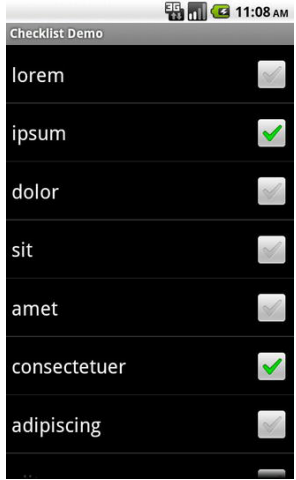
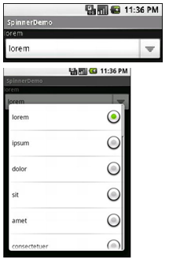

[toc]

`getView()`的第二个参数，一般叫`convertView`。它可能是null。但如果不为null，则它实际是我们之前创建过的一个View。这种情况主要发生在用户滚动了列表。As new rows appear, Android will attempt to recycle the views of the rows that scrolled off the other end of the list, to save us from having to rebuild them from scratch. The advantage is that we avoid the potentially expensive inflation step. In fact, according to statistics cited by Google at the 2010 Google I|O conference, a ListView that uses a recycling `ListAdapter` will perform 150 percent faster than one that does not.

### 适配器

Android的适配器为选择控件（如列表）提供给一个统一的数据模型接口。
Android的适配器不仅为选择控件提供数据，也负责将数据项转换为特定的View，显示在选择控件上。

最简单的适配器是`ArrayAdapter`。它能适配数组或`java.util.List`：
```java
	String[] items = {"this", "is", "a", "really", "silly", "list"};
	new ArrayAdapter<String>(this, android.R.layout.simple_list_item_1, items);
```

上面的三个参数是：
- Context
- 视图的资源ID（如内建的系统资源ID，如上面的例子所示）
- 数组或列表

`ArrayAdapter`默认将列表中的对象取`toString()`，显示在View上。`android.R.layout.simple_list_item_1`只是简单的将这些字符串显示在TextView上。若你想知道`android.R.layout.simple_list_item_1`的布局，你可以在SDK中找`simple_list_item_1.xml`。

### ListView和ListActivity

最简单的列表控件是`ListView`。调用setAdapter()提供数据和子视图，通过`setOnItemSelectedListener()`响应选择。

若活动只是一个列表，考虑让活动继承`ListActivity`（而不是常见的Activity）。如果主View只是一个列表，甚至不用指定布局｛｛不调用setContentView｝｝，ListActivity会帮你构建一个全屏列表。如果想定制布局｛｛调用setContentView｝｝，只要将你的ListView标记为`@android:id/list`，ListActivity绘制到那个控件是活动的主列表。

ListActivity的`getListView()`可以获取ListView。在ListActivity中可以使用`setListAdapter()`设置List适配器。


For example, here is a layout pulled from the Selection/List sample project, a simple list with a label on top to show the current selection:
```xml
<LinearLayout
	xmlns:android="http://schemas.android.com/apk/res/android"
	android:orientation="vertical"
	android:layout_width="fill_parent"
	android:layout_height="fill_parent" >
	<TextView android:id="@+id/selection"
		android:layout_width="fill_parent"
		android:layout_height="wrap_content"/>
	<ListView android:id="@android:id/list"
		android:layout_width="fill_parent"
		android:layout_height="fill_parent"
		android:drawSelectorOnTop="false" />
</LinearLayout>
```

```java
public class ListViewDemo extends ListActivity {
	private TextView selection;
	private static final String[] items={"lorem", "ipsum", "dolor", "sit", "amet",
	"consectetuer", "adipiscing", "elit", "morbi", "vel",
	"ligula", "vitae", "arcu", "aliquet", "mollis",
	"etiam", "vel", "erat", "placerat", "ante",
	"porttitor", "sodales", "pellentesque", "augue", "purus"};
	@Override
	public void onCreate(Bundle icicle) {
		super.onCreate(icicle);
		setContentView(R.layout.main);
		setListAdapter(new ArrayAdapter<String>(this, android.R.layout.simple_list_item_1, items));
		selection=(TextView)findViewById(R.id.selection);
	}

	@Override
	public void onListItemClick(ListView parent, View v, int position, long id) {
		selection.setText(items[position]);
	}
}
```

### 选择模式

`ListView`默认只用于捕捉用户的点击。如果想要列表追踪用户的选择，甚至多选，需要做些调整。

通过调用`ListView.setChoiceMode()`决定是单选还是多选。传入`CHOICE_MODE_SINGLE` 或 `CHOICE_MODE_MULTIPLE`。还可以通过 `android:choiceMode` 特性设置。

此时不能再用 `android.R.layout.simple_list_item_1`，要用 `android.R.layout.simple_list_item_single_choice` 或 `android.R.layout.simple_list_item_multiple_choice`。



调用ListView的`getCheckedItemPositions()`查看选中的项，`setItemChecked()`用户选中（或取消选中）特定项。

For example, here is an activity layout from the Selection/Checklist sample project:
```xml
<ListView xmlns:android="http://schemas.android.com/apk/res/android"
	android:id="@android:id/list"
	android:layout_width="fill_parent"
	android:layout_height="fill_parent"
	android:drawSelectorOnTop="false"
	android:choiceMode="multipleChoice" />
```

### 下拉列表框：Spinner

Spinner是下拉列表框。设置适配器也通过setAdapter()，监听选择通过`setOnItemSelectedListener()`。

若想定制下拉视图，应设置适配器，而不是Spinner：调用适配器的`setDropDownViewResource()`方法。

The Spinner property `android:drawSelectorOnTop` controls whether the arrow is drawn on the selector button on the right side of the Spinner UI.

代码：
```java
public class SpinnerDemo extends Activity
	implements AdapterView.OnItemSelectedListener {
	private TextView selection;
	private static final String[] items={"lorem", "ipsum", "dolor", "sit", "amet",
	"consectetuer", "adipiscing", "elit", "morbi", "vel",
	"ligula", "vitae", "arcu", "aliquet", "mollis",
	"etiam", "vel", "erat", "placerat", "ante",
	"porttitor", "sodales", "pellentesque", "augue", "purus"};
	@Override
	public void onCreate(Bundle icicle) {
		super.onCreate(icicle);
		setContentView(R.layout.main);
		selection=(TextView)findViewById(R.id.selection);
		Spinner spin=(Spinner)findViewById(R.id.spinner);
		spin.setOnItemSelectedListener(this);
		ArrayAdapter<String> aa=new ArrayAdapter<String>(this,
			android.R.layout.simple_spinner_item, items);
		aa.setDropDownViewResource(android.R.layout.simple_spinner_dropdown_item);
		spin.setAdapter(aa);
	}
	public void onItemSelected(AdapterView<?> parent, View v, int position, long id) {
		selection.setText(items[position]);
	}
	public void onNothingSelected(AdapterView<?> parent) {
		selection.setText("");
	}
}
```



### AutoCompleteTextView

AutoCompleteTextView是EditText和Spinner的混合。用户输入与列表内容做前缀比较。

AutoCompleteTextView是EditText的子类。AutoCompleteTextView的`android:completionThreshold`属性控制，用户必须输入多少个字符然后才开始过滤。

可以为AutoCompleteTextView提供一个适配器，提供候选值列表。由于用户可能输出不在列表中的内容，因此AutoCompleteTextView不支持选择监听器。但可以注册一个`TextWatcher`（任何EditText都支持），监听文本的改变。手工输入或从列表选择都会触发该事件。

代码：
```java
public class AutoCompleteDemo extends Activity
	implements TextWatcher {
	private TextView selection;
	private AutoCompleteTextView edit;
	private static final String[] items={"lorem", "ipsum", "dolor", "sit", "amet"};
	@Override
	public void onCreate(Bundle icicle) {
		super.onCreate(icicle);
		setContentView(R.layout.main);
		selection=(TextView)findViewById(R.id.selection);
		edit=(AutoCompleteTextView)findViewById(R.id.edit);
		edit.addTextChangedListener(this);
		edit.setAdapter(new ArrayAdapter<String>(this,
			android.R.layout.simple_dropdown_item_1line, items));
	}
	public void onTextChanged(CharSequence s, int start, int before, int count) {
		selection.setText(edit.getText());
	}
	public void beforeTextChanged(CharSequence s, int start, int count, int after) {
		// needed for interface, but not used
	}
	public void afterTextChanged(Editable s) {
		// needed for interface, but not used
	}
}
```

### GridView

GridView可以提供二维网格，从中选择一项。可以控制列的数量和大小；行的数量根据元素数量决定。

下面的属性决定列的数量和大小：
- `android:numColumns`：指定列的数量。如果设为`auto_fit`，Android将根据可用控件和下面的属性自动计算列数。
- `android:verticalSpacing`和`android:horizontalSpacing`：网格中元素间的空白大小
- `android:columnWidth`：指定每一列的像素宽度
- `android:stretchMode`：当`android:numColumns`的值为`auto_fit`时，若有额外空间如何分配。若取值`columnWidth`，则由列占据多余空间。若为`spacingWidth`，则由列间距吸收额外空间。

GridView跟其他选择控件一样，`setAdapter()`提供数据和子视图，用`setOnItemSelectedListener()`注册选择监听器。

```xml
<GridView android:id="@+id/grid"
	android:layout_width="fill_parent"
	android:layout_height="fill_parent"
	android:verticalSpacing="40dip"
	android:horizontalSpacing="5dip"
	android:numColumns="auto_fit"
	android:columnWidth="100dip"
	android:stretchMode="columnWidth"
	android:gravity="center" />
```

```java
public class GridDemo extends Activity implements AdapterView.OnItemSelectedListener {
	private TextView selection;
	private static final String[] items={"lorem", "ipsum", "dolor", "sit", "amet",
	"consectetuer", "adipiscing", "elit", "morbi", "vel",
	"ligula", "vitae", "arcu", "aliquet", "mollis",
	"etiam", "vel", "erat", "placerat", "ante",
	"porttitor", "sodales", "pellentesque", "augue", "purus"};
	@Override
	public void onCreate(Bundle icicle) {
		super.onCreate(icicle);
		setContentView(R.layout.main);
		selection=(TextView)findViewById(R.id.selection);
		GridView g=(GridView) findViewById(R.id.grid);
		g.setAdapter(new ArrayAdapter<String>(this, R.layout.cell, items));
		g.setOnItemSelectedListener(this);
	}
	public void onItemSelected(AdapterView<?> parent, View v, int position, long id) {
		selection.setText(items[position]);
	}
	public void onNothingSelected(AdapterView<?> parent) {
		selection.setText("");
	}
}
```

### Gallery

Gallery是水平的列表。在Android上，用户可以通过D-pad按钮的左右键，在选项间切换。

与ListView相比，Gallery占得空间少。

Gallery的典型例子是图片预览。

Code-wise, the Gallery works much like a Spinner or GridView. In your XML layout, you have a few properties at your disposal:
- `android:spacing`：列表中项之间的间隔
- `android:spinnerSelector`：如何表示选中项。This can either be a reference to a Drawable(see the resources chapter) or an RGB value in #AARRGGBB or similar notation.
- `android:drawSelectorOnTop`: Indicates if the selection bar (or Drawable) should be drawn before (false) or after (true) drawing the selected child. If you choose true, be sure that your selector has sufficient transparency to show the child through the selector; otherwise, users will not be able to read the selection.


