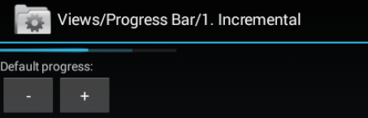
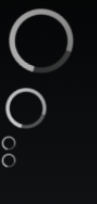
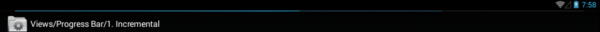
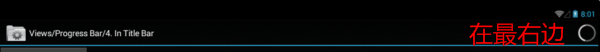
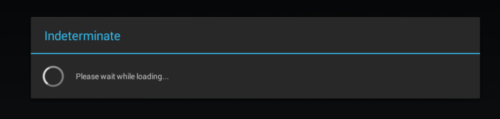
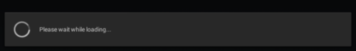

## 进度控件

### 水平进度条

有两级。



```xml
	<LinearLayout xmlns:android="http://schemas.android.com/apk/res/android"
		android:orientation="vertical"
		android:layout_width="match_parent"
		android:layout_height="wrap_content">
		<ProgressBar android:id="@+id/progress_horizontal"
			style="?android:attr/progressBarStyleHorizontal"
			android:layout_width="200dip"
			android:layout_height="wrap_content"
			android:max="100"
			android:progress="50"
			android:secondaryProgress="75" />
```

```java
ProgressBar progressHorizontal = (ProgressBar) findViewById(R.id.progress_horizontal);
progressHorizontal.incrementProgressBy(1);
```

### 无限滚动



```xml
    <LinearLayout xmlns:android="http://schemas.android.com/apk/res/android"
        android:orientation="vertical"
        android:layout_width="match_parent"
        android:layout_height="wrap_content">

        <ProgressBar
            style="?android:attr/progressBarStyleLarge"
            android:layout_width="wrap_content"
            android:layout_height="wrap_content" />

        <ProgressBar
            android:layout_width="wrap_content"
            android:layout_height="wrap_content" />

        <ProgressBar
            style="?android:attr/progressBarStyleSmall"
            android:layout_width="wrap_content"
            android:layout_height="wrap_content" />

        <ProgressBar
            style="?android:attr/progressBarStyleSmallTitle"
            android:layout_width="wrap_content"
            android:layout_height="wrap_content" />
    </LinearLayout>
```

### 在标题栏中显示进度条



```java
@Override
protected void onCreate(Bundle savedInstanceState) {
    super.onCreate(savedInstanceState);

    // Request the progress bar to be shown in the title
    requestWindowFeature(Window.FEATURE_PROGRESS);
    setProgressBarVisibility(true);

    setProgress(100);
    setSecondaryProgress(1000);
```

### 在标题栏中显示无限滚动进度



{{`setProgressBarIndeterminateVisibility`方法貌似只有在页面出现后调用才有效。比如，在`onCreate`中调用无效。}}

```java
@Override
protected void onCreate(Bundle savedInstanceState) {
	super.onCreate(savedInstanceState);

	// Request progress bar
	requestWindowFeature(Window.FEATURE_INDETERMINATE_PROGRESS);
	setContentView(R.layout.progressbar_4);
	setProgressBarIndeterminateVisibility(mToggleIndeterminate);

	Button button = (Button) findViewById(R.id.toggle);
	button.setOnClickListener(new Button.OnClickListener() {
		public void onClick(View v) {
			mToggleIndeterminate = !mToggleIndeterminate;
			setProgressBarIndeterminateVisibility(mToggleIndeterminate);
		}
	});
}
```

### 进度对话框





利用`Activity`的回调方法`onCreateDialog`创建对话框：

```java
@Override
protected Dialog onCreateDialog(int id) {
	switch (id) {
		case DIALOG1_KEY: {
			ProgressDialog dialog = new ProgressDialog(this);
			dialog.setTitle("Indeterminate");
			dialog.setMessage("Please wait while loading...");
			dialog.setIndeterminate(true);
			dialog.setCancelable(true);
			return dialog;
		}
	}
	return null;
}
```

利用`Activity.showDialog`方法让特定对话框显示出现。注意该方法已被废弃。推荐使用`DialogFragment`。

```java
button.setOnClickListener(new View.OnClickListener() {
	public void onClick(View v) {
		showDialog(DIALOG2_KEY);
	}
});
```
