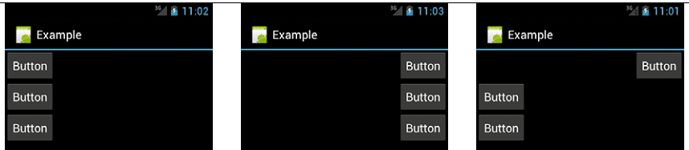

[toc]

## View

### View 通用 Attribute

#### Margin 和 Padding

两个特性：`layout_margin`和`padding`。可以对四个边设置，也可以对单边设置。

#### Gravity

Android 默认将视图放在屏幕的左边。`gravity` 特性控制视图中的孩子的默认位置。例如，如果设置线性布局的 `gravity` 特性，让所有的孩子位于屏幕右边。
布局容器的 `gravity` 默认是 `left`。其他视图默认一般是 `center`。

`layout_gravity` 设置视图相对于父母的位置。例如，`LinearLayout` 的 `gravity` 默认将所有视图放在屏幕左边。如果你把**一个孩子的** `layout_gravity` 特性设为 `right`，这个孩子将位于屏幕右边。

> `gravity` 对容器设置，`layout_gravity` 对孩子设置

