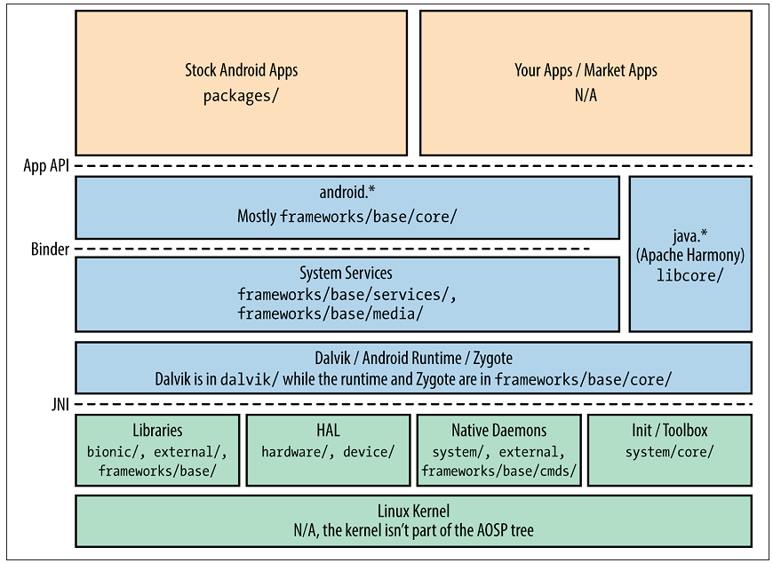
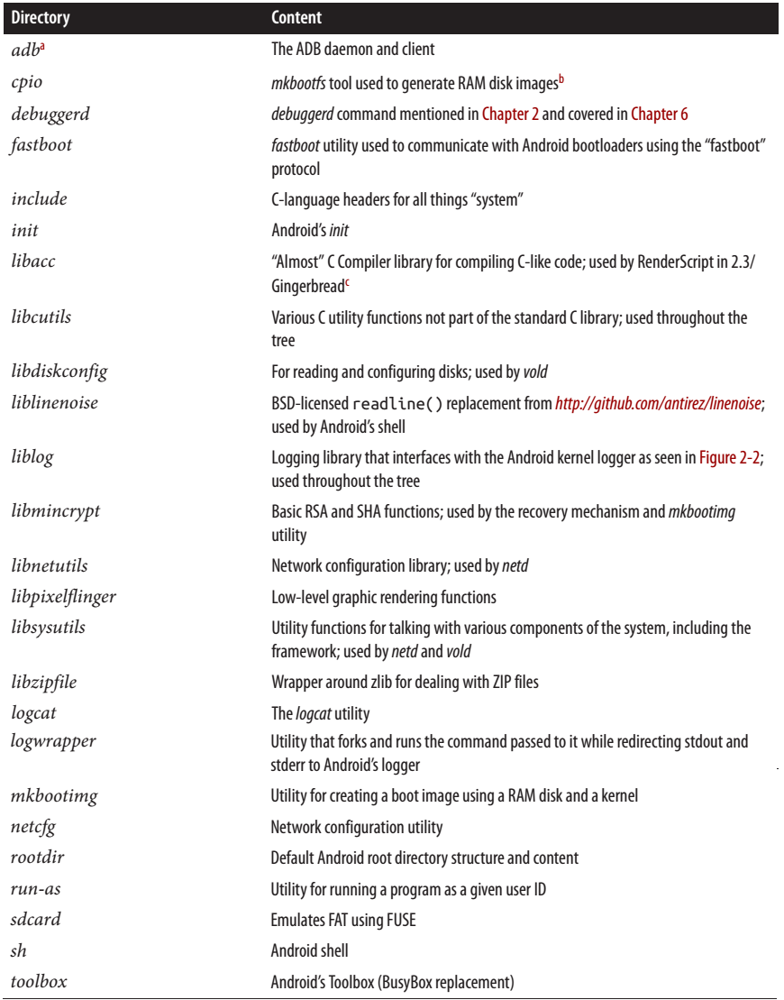
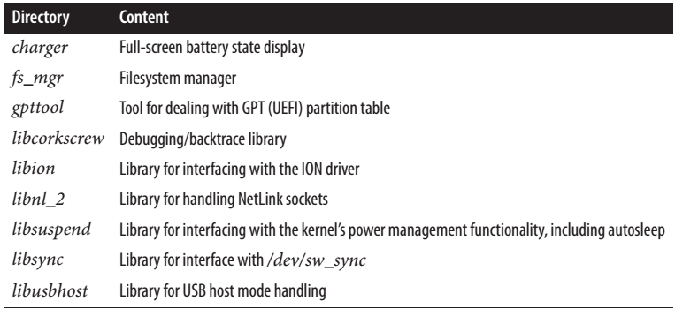

[toc]

## AOSP 结构

### 目录结构

- `abi`：Minimal C++ Run-Time Type Information support
- `bionic`：Android定制的C库
- `bootable`：OTA，恢复机制和参考bootloader
- `build`：构建系统
- `cts`：Comptability Test Suite
- `dalvik`：Dalvik VM
- `development`：Development tools
- `device`：设备相关的文件和组件
- `docs` Content of http://source.android.com
- `external`：External projects imported into the AOSP
- `frameworks`：核心组件，如系统服务
- `gdk`：未知
- `hardware`：HAL and hardware support libraries
- `libcore`：Apache Harmony
- `libnativehelperb`：Helper functions for use with JNI
- `ndk`：Native Development Kit
- `packages`：Stock Android apps, providers, and IMEs
- `pdk`：Platform Development Kit
- `prebuilt`：Prebuilt binaries, including toolchains
- `prebuilts`：4.2开始用于替代prebuilt
- `sdk`：Software Development Kit
- `system`：“Embedded Linux” platform that houses Android
- `tools`：Various IDE tools

可以看到 prebuilt 和 external 是两个最大的目录。这两个目录的主img/要内容多数来自其他开源项目，包括多个版本的 GNU 工具链，内核镜像，通用库，OpenSSL 和 WebKit 等框架，等等。

下面给出一些组件在源码中的位置：

2.3 的 **frameworks/base/** 文件夹下的内容：

- `cmds`：框架相关的命令和守护进程
- `core`：`android.*` 包
- `data`：字体和声音
- `graphics`：2D图形和 Renderscript
- `include`：C语言的include文件
- `keystore`：安全 key store
- `libs`：C库
- `location`：location provider
- `media`：Media Service, StageFright, codecs 等
- `native`：一些框架的本地代码
- `obex`：Bluetooth Obex
- `opengl`：OpenGL 库和 Java 代码
- `packages`：一些核心包，如 Status Bar
- `services`：System services
- `telephony`：Telephony API
- `tools`：一些核心工具，如aapt, aidl
- `voip`：RTP 和 SIP API
- `vpn`：VPN Manager
- `wifi`：Wifi Manager 和 API

4.2 移动了一些 frameworks/base/ 下的目录。例如 frameworks/base/media/ 现在变成了 frameworks/av/media/。frameworks/native/ 现在包含了一些本地库和系统服务，它们之前都在 frameworks/base/ 下。

Content summary for **system/core/** in 2.3

Major additions made to **system/core/** between 2.3 and 4.2.

