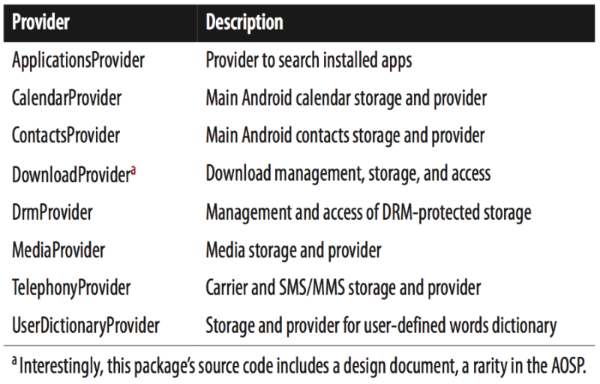

[toc]

## AOSP自带的应用

Android内置应用具有以下特点：

- 主要基于框架层的API，但可以调用框架层内部的隐藏接口。
- 可以通过JNI使用本地库。
- 某些包可以使用特殊的安全机制。
- 某些包和组件是可以替换的。
- 内置的包通过Intent与外界交互。

一些应用，如 Maps、YouTube 和 Gmail 并不属于 AOSP。Table 2-7列出了2.3最重要的常备（stock）包；Table 2-8是AOSP中主要的内容提供者。Table 2-9是相应的**IMEs** (input method editors)。

常备应用不能在AOSP外被标准SDK构建。因此要修改这些应用，需要在AOSP中进行。因为这些应用有时会用到在AOSP中可以访问，但未暴露给标准SDK的接口。


Table 2-8. Stock AOSP providers


Table 2-9. Stock AOSP input methods


AOSP包含的包比上面列出的多很多。在4.2中有大约500个应用。其中多数用于测试或演示。大约只有四分之一的应用值得放到最终的产品中，它们主要位于以下目录：

- packages/apps/
- packages/inputmethods/
- packages/providers/
- packages/screensavers/ (new to 4.2/Jelly Bean)
- packages/wallpapers/
- frameworks/base/packages/
- development/apps/

下面列出了2.3.4到4.2的一些位置变化：

- `AccountAndSyncSettings` 和 `Gallery3D` 从 `packages/apps/` 中移除，添加了以下包：CellBroadcastReceiver, SmartCardService, BasicSmsReceiver, Exchange, **Gallery2**, KeyChain, MusicFX, SpareParts, VideoEditor, and LegacyCamera.
- TtsService and VpnServices have been removed from frameworks/base/packages/, and the following packages have been added: BackupRestoreConfirmation, SharedStorageBackup, VpnDialogs, `WAPPushManager`, FakeOemFeatures, FusedLocation, and `InputDevices`.

通过各个应用程序的AndroidManifest.xml文件，可以了解各个组件接受的IntentFilter。

### Launcher

> Android 4.4 出现了 Launcher3。

Launcher的主要功能：

- 入口为系统的启动界面。
- 主活动作为系统的启动UI入口。
- 墙纸选择活动，负责选择预置的墙纸。
- 处理快捷方式的广播接收器。
- 基于数据库的内容提供者存储状态。

#### Launcher2

Launcher2的包名为`com.android.launcher`。使用`LOCAL_CERTIFICATE:=shared`签名。

Launcher2的主活动声明如下。单任务。屏幕不随传感器转动。

```xml
    <activity
        android:name="com.android.launcher2.Launcher"
        android:launchMode="singleTask"
        android:clearTaskOnLaunch="true"
        android:stateNotNeeded="true"
        android:theme="@style/Theme"
        android:windowSoftInputMode="adjustPan"
        android:screenOrientation="nosensor">
        <intent-filter>
            <action android:name="android.intent.action.MAIN" />
            <category android:name="android.intent.category.HOME" />
            <category android:name="android.intent.category.DEFAULT" />
            <category android:name="android.intent.category.MONKEY"/>
        </intent-filter>
    </activity>
```

`WallpaperChooser`是Launcher2的另一个独立活动，是默认的墙纸选择器。处理 `android.intent.action.SET_WALLPAPER` 这个Intent动作。

> 我们自定义的Launcher也要响应这个Intent？换墙纸。

#### Launcher3

包名`com.android.launcher3`。

主活动声明如下。单任务。屏幕不随传感器转动。

```xml
    <activity
        android:name="com.android.launcher3.Launcher"
        android:launchMode="singleTask"
        android:clearTaskOnLaunch="true"
        android:stateNotNeeded="true"
        android:theme="@style/Theme"
        android:windowSoftInputMode="adjustPan"
        android:screenOrientation="nosensor">
        <intent-filter>
            <action android:name="android.intent.action.MAIN" />
            <category android:name="android.intent.category.HOME" />
            <category android:name="android.intent.category.DEFAULT" />
            <category android:name="android.intent.category.MONKEY"/>
        </intent-filter>
    </activity>
```

### 设置

Setting是程序包名为 `com.android.setttings`。其 `android:sharedUserId` 为 `android.uid.system`，并且使用了 `LOCAL_CERTIFICATE:=platform` 签名。由于以上设置，Setting是程序具有特殊权限的system用户。

Setting是及各个设置屏幕，一般都是基于 `PreferenceActivity` 实现的。每一个列表对话框的根部是一个 `PreferenceScreen`。

`Settings`活动使用 `res/xml/settings.xml` 作为 Preference 的配置文件。

### SystemUI

SystemUI提供了状态栏的功能，也包括一些USB管理界面。

SystemUI位于 `frameworks/base/packages/SystemUI`。在SystemUI的 AndroidManifest.xml 根部，定义了 `android:sharedUserid` 为 `android.uid.system`，`android:process` 为 `system`。为此SystemUI运行在 `system` 进程，与 `system_server` 相同。