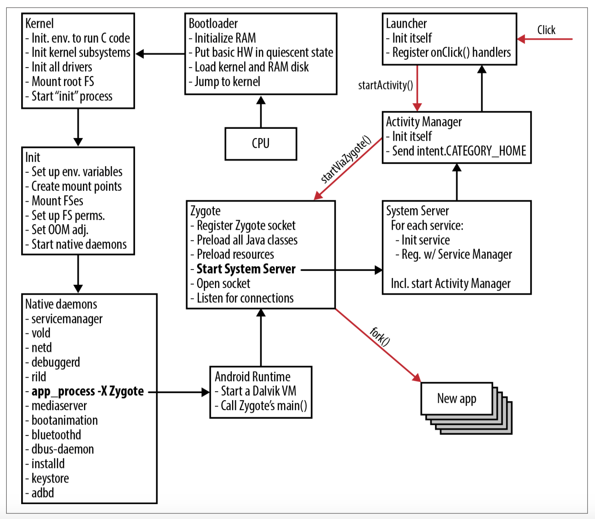
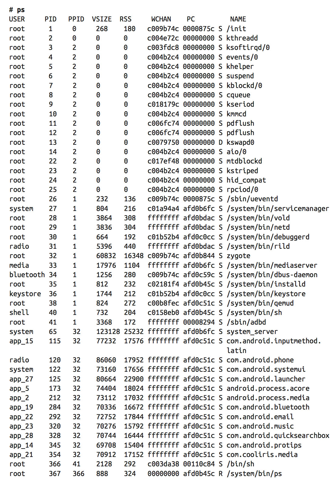

[toc]

## Android系统启动

如下图所示，第一个启动的构件是 CPU。它从一个硬编码的地址获取第一条指令，该指令一般指向一个 **bootloader**。bootloader 初始化 RAM，初始化基础的硬件，加载内核和 **RAM disk**，而后启动内核。最近的SoC设备（CPU和一些外围设备在一块芯片上）可以从SD卡或类似于SD的芯片启动。**PandaBoard** 和最近版本的 **BeagleBoard** 没有板载Flashlight芯片，因为他们可以直接从SD卡启动。

Figure 2-6. Android’s boot sequence

内核启动的开始阶段非常取决于硬件，它的目的是搭载好环境以便CPU可以执行C代码。然后，内核进入与架构无关的`start_kernel()`函数，初始化它的各个子系统。内核启动时打出的多数消息都属于该阶段。

接着内核挂载其根文件系统并启动其 **init** 进程。这是Android初始化开始的地方：执行 **/init.rc** 文件，设置环境变量（如系统路径）、创建挂载点、挂载文件系统、调整OOM、启动本地守护进程。守护进程中较关键的的是 **Zygote**，它是一个特殊的守护进程，用于启动应用（launch apps）。init 并不直接启动 Zygote；它使用`app_process`命令，让 **Android运行时** 启动 Zygote。运行时随后启动第一个 Dalvik 虚拟机，让它调用 Zygote 的`main()`。

仅当有新的应用需要加载时 Zygote 才活动。为了加速应用的启动，Zygote 会预加载所用应用共用的Java类和资源。然后 Zygote 在它的 socket (`/dev/socket/zygote`) 上监听启动应用的请求。收到请求后，它会 **fork** 自己、启动新应用。Linux 内核实现了 copy-on-write (COW) 式的 fork。在 Unix 中 fork 创建的新进程是父进程的完全拷贝。而 COW 使得 Linux 不用做任何实际拷贝：它只是将新进程的页面映射到父进程的页面，仅当新进程做写操作时才会做拷贝。由于预加载的类和资源是只读的、不会被修改，因此从 Zygote fork 的进程都使用 Zygote 的版本；不管有多少应用运行，只有一份系统类和资源被加载到RAM。

有一个应用是 Zygote 显式启动的：**System Server**。它是 Zygote 启动的第一个应用，并作为一个独立的进程一直存活。System Server 启动它管理的系统服务，并将它们注册到之前已启动的 **Service Manager**。其中一个是 **Activity Manager**，在它初始化的最后，会发送一个 intent （`Intent.CATEGORY_HOME`），使得 **Launcher** 启动。

当用户点击主屏上的一个图标时，Launcher 让 Activity Manager 开始处理，将请求发至 Zygote，fork并启动新应用。

系统完成启动后，其进程列表类似于下表：

上面的输出来自2.3的 Android 模拟器，因此它包含一些模拟器相关的组件，如qemud守护进程。
注意到 Zygote 启动的应用显示的都是全限的包名。（This is a neat trick that can be pulled in Linux by using the `prctl()` system call with `PR_SET_NAME` to tell the kernel to change the calling process’s name.）Zygote 进程的 PID 是 32，所有应用的 PID 也是 32 —— Zygote 是所有应用的父进程。

注意 init 启动的第一个进程是 **ueventd**。它之前的进程都是由内核子系统或驱动启动的。