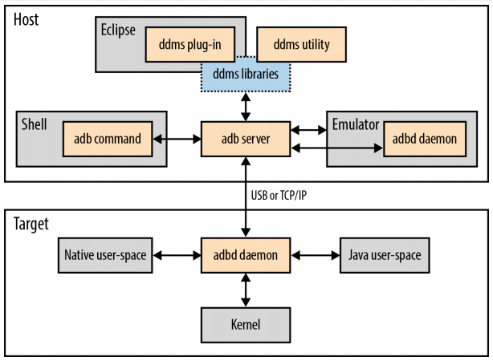
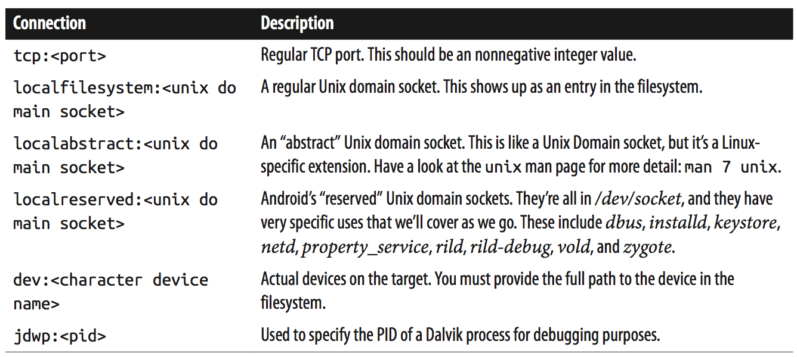

[toc]

## adb

### 6.2.1 理论

adb由几个组件组成，这些组件自己又链接到其他系统组件。下图展示了这些关系。

Figure 6-3. ADB and its interconnections

adb的主机端和目标端，除了DDMS相关的组件，都来自源码`system/core/adb/`，以确保组件间的版本相容。

adb的两个重要组件是：运行在主机端的**adb server**，运行在目标端的**adbd**守护进程。二者可以通过 USB 或 TCP/IP 连接。两种连接方式可使用的命令集是一样的。

通过命令和通过DDMS暴露的 adb server 的功能不完全相同。例如 adb server 可以截图，但只能通过DDMS使用，不能通过命令行。adb server在主机端打开5037端口监听连接。若你想写代码直接与adb server交互，参考`system/core/adb/`下的 OVERVIEW.TXT 和 SERVICES.TXT。

adb还可以与模拟器的console交互。Every emulator instance that starts listens for connections on a different port number; the number is displayed on the upper-left corner of the emulator window and starts from 5554. When you connect to that port number using **telnet**, you are able to issue special commands to control the emulator’s behavior, as detailed in [Using the Android Emulator](https://developer.android.com/guide/developing/devices/emulator.html) in Google’s app developers guide. These commands include forwarding ports from the host to the emulator and resizing the emulator’s window. To simplify matters, adb makes it possible to send the same commands to the emulator without actually having to go through **telnet**.

### 6.2.2 主要flag、参数和环境变量

- `-d`：该选项告诉adb在通过USB连接的设备上执行命令。如果模拟器和通过USB连接的Android设备同时连接，则该标记确保 adb 命令在到设备上，而不是模拟器。当然如果有多个设备连接该命令就没用了。
- `-e`：与`-d`类似，该标记告诉adb连接到模拟器，即使有Android设备连接。同样如果有多个模拟器该命令也没用。
- `-s <serial number>`：让adb连接到序号标识的设备。如果你同时连接多个设备或多个模拟器，则该命令（和下面的`ANDROID_SERIAL`）是唯一方式；尽管输入完整序号略麻烦。
- `-p <product name or path>`：一些adb命令需要（用于构建AOSP的）源码。如果你在构建AOSP时使用的Shell中使用adb，源码已配置好，因为`ANDROID_PRODUCT_OUT`环境变量已设置好。但如果不是，就需要通过`-p`指定AOSP源码树内、产品的输出目录。
- `ANDROID_SERIAL`：若连接到多个设备，但你不想每次使用adb时都使用`-s`，设置环境变量`ANDROID_SERIAL`为目标设备的序号，则adb将默认连接到那个设备，除非显式指定`-s`。
- `ADB_TRACE`：If you want to debug or monitor the interaction betweeen the adb server on the host and the adbd daemon on the target, you can set the `ADB_TRACE` environment variable to one of or a series of comma-, colon-, semicolon-, or space-separated combinations from the following values: 1, all, adb, sockets, packets, rwx, usb, sync, sysdeps, transport, jdwp.

### 6.2.3 基本的本地命令

一些命令在本地运行。如，手工运行 adb server：

    $ adb start-server
    * daemon not running. starting it now on port 5037 *
    * daemon started successfully *

adb server在执行adb命令时一般自动启动，一般不需要自己手工启动。但有时需要手工关闭：

	$ adb kill-server

获取帮助：

	$ adb help

获取版本：

	$ adb version

### 6.2.4 设备连接和状态

当前可用的设备：

    $ adb devices
    List of devices attached
    emulator-5554 device
    0123456789ABCDEF device
    emulator-5556 device

通过TCP/IP连接到远程adbd：

	$ adb connect 192.168.202.79:7878
    connected to 192.168.202.79:7878
    $ adb devices
    List of devices attached
    emulator-5554 device
    0123456789ABCDEF device
    emulator-5556 device
    192.168.202.79:7878 device

连接格式（5555是默认端口）：

	adb connect <host>[<:port>]

此时设备的序号是`IP:PORT`，例如：

	$ adb -s 192.168.202.79:7878 shell

与设备端口连接：

	$ adb disconnect 192.168.202.79:7878

`disconnect`的格式是（如果设备是通过TCP/IP连接的）：

	adb disconnect [<host>[<:port>]]

If you’d like adb to hang waiting for the device to come online, you can type this:

	$ adb wait-for-device

The shell will then suspend until the device comes online. adb will return to the shell when the device is online. 这条命令在脚本中有用：可以让脚本等待设备就绪后再执行后续命令。

获取设备状态：

    $ adb -s 0123456789ABCDEF get-state
    device

设备的值包括：bootloader, device, offline, unknown四种。`device`表示设备在线。

If, for any reason, you need to explicitly ask about a device’s serial number, such as when you’re scripting adb commands, you can do so:

    $ adb -d get-serialno
    0123456789ABCDEF

Finally, if you need to have a shell window open that continuously reports the current device’s state, you can do so with this:

	$ adb -d status-window

To exit, you just type Ctrl-C.

### 6.2.5 基本的远程命令

**Shell**

进入设备的Shell：

	$ adb shell

退出输入Ctrl-D。直接执行命令：

	$ adb -d shell cat /proc/cpuinfo

**输出日志**

	$ adb -d logcat

等价于

	$ adb -d shell logcat

后面会详细讲`logcat`命令。通过`adb logcat`获取的日志功能与直接在目标机器上运行`logcat`命令是相同的。So, for instance, if you want to dump the “radio” buffer instead of the “main” buffer, you can do this:

	$ adb -d logcat -b radio

adb也受主机上设置的`ANDROID_LOG_TAGS`环境变量的控制。

**BUG报告**

	$ adb -d bugreport

等价于

	$ adb -d shell dumpstate

`dumpstate`必须以root身份运行。但`bugreport`不必。

Essentially, `bugreport` causes init to start *dumpsys* in a mode where it opens a Unix domain socket and listens for connections for dumping its output. `bugreport` then connects to that socket and copies the content it reads to its own standard output.

**端口转发**

例如，下面的命令将本地8080端口转发到目标机的80端口：

	$ adb -d forward tcp:8080 tcp:80

即，到你主机8080端口的连接将被重定向到目标机的80端口。若你的Android设备上有在80端口运行Web服务器，输入`localhost:8080`即可浏览设备。

主机的端口不仅可以转发到目标机的端口，例如，还可以转发到字符设备：

	$ adb -d forward tcp:8000 dev:/dev/ttyUSB0

此时，在8000端口上的读写操作将变成在远程`/dev/ttyUSB0`上的操作。Table 6-10 lists the connection types supported by forward:

Table 6-10. adb forward’s connection types

**Dalvik调试**

It’s worth expanding a bit more on forward’s ability to proxy connections to Dalvik processes. Dalvik implements the Java Debug Wire Protocol (JDWP), thereby allowing you to use the regular Java debugger jdb to debug your apps. Obviously this is shrinkwrapped into Eclipse for app developers, but if you want to use jdb on the command line, forward’s ability to redirect Dalvik processes’ debug ports to your host becomes essential. Here’s an example:

    $ adb forward tcp:8000 jdwp:376
    $ jdb -attach localhost:8000
    Set uncaught java.lang.Throwable
    Set deferred uncaught java.lang.Throwable Initializing jdb ...
    >

To know which PIDs are debuggable through JDWP, you type:

	$ adb jdwps

adb is in fact a crucial component for debugging any Java on the target. When the adbd daemon starts on the target, it opens the “abstract” Unix domain socket jdwp-control and awaits connections. Dalvik processes that start afterward connect to that socket and therefore make themselves “visible” for debugging. To allow app developers to debug their apps, the ddms Eclipse plug-in goes through ddmlib to talk to the adb server to debug the app. Or, as we just saw, you can use jdb to debug on the command line.

Note that all of this requires that adbd be running on the target before any Dalvik app is started. Only those Dalvik apps that you start after adbd will be debuggable.

### 6.2.6 文件系统命令

与目标机器的文件系统交互。例如拷贝文件到设备上：

	$ adb push acme_user_manual.pdf /data/local
	$ adb shell ls /data/local acme_user_manual.pdf

也可以从目标机拷贝文件到主机：

	$ adb pull /proc/cpuinfo
	$ cat cpuinfo

有些文件系统，如`/system`，是只读。向其发送文件，需要先重新挂载为可读写模式：

    $ adb remount
    remount succeeded
    $ adb push acme_utility /system/bin

push一般只用于拷贝少量文件。如果你要更新整个目录，如`/data`或`/system`，可以使用`sync`命令。It will essentially conduct an operation similar to the `rsync` command. If you run `adb sync` from the same directory where the target’s AOSP was built, then it will automatically find the files to sync because the `ANDROID_PRODUCT_OUT` environment variable will point to the right directory. Otherwise, you’ll need to manually point it to the right output directory like this:

	$ adb -d -p ~/android/beaglebone/out/target/product/beaglebone/ sync
    syncing /system...
    push: /home/karim/android/beaglebone/out/target/product/beaglebone/system/xbin/c rasher -> /system/xbin/crasher
    ...

You probably want to reboot the target after such an update, as there might be stale file references lingering. 注意`sync`只能通过`/system`和`/data`。不能同步其他。In other words, you can’t use sync to synchronize the contents of the RAM disk mounted as the root filesystem for the target. Even if it allowed you to, it wouldn’t be of much use, since the RAM disk lives only in RAM and its contents are not written through to persistent storage.

`sync` can also be told to sync only the data or the system partitions, instead of both. Simply pass the partition you’d like to sync as a parameter:

	$ adb -e sync data
    syncing /data...
    ...

安装新应用：

	$ adb install FastBirds.apk

背后实际会调用目标机器上的`pm`命令。`pm`与系统服务PackageManager交互，安装应用。要卸载应用，执行：

	$ adb uninstall com.acme.fastbirds

两个命令都接受一些标记：

	adb install [-l] [-r] [-s] <file>
    adb uninstall [-k] <package>

`-l`安装的应用放在`/data/app-private`，而不是`/data/app`：将阻止应用从设备中拷出。`-r`表示重新安装应用，保留数据。`-s`表示安装在外部存储（SD卡）。 `-k`表示删除应用，但保留应用的数据。

### 6.2.7 重启等其他命令

#### 重启

	$ adb reboot

This actually invokes the reboot() system call on the target’s kernel while passing it the appropriate magic values to effect a reboot. 可以传给reboot一个参数，制定重启模式是bootloader还是recovery：

	$ adb reboot bootloader
	$ adb reboot recovery

这些参数原样传给内核。若板子的使用的内核不能处理这些参数，则就当做普通重启，忽略这些参数。重启进入bootloader的另一种方式是：

	$ adb reboot-bootloader

注意，这些重启都会立即执行，不会先自动优雅的关闭进程或系统服务。

#### 作为根用户

在开发版上，由于adbd守护进程一般作为root运行，因此多数命令都能全功能使用。但最终产品，adbd可能只作为普通shell用户运行。因此adb命令将受限。

The adbd daemon’s default privileges will depend on how the AOSP is built and the target that it’s running on. 如果在模拟器上运行，adbd将作为根用户运行。其他情况下，adbd的权限取决于构建AOSP时的`TARGET_BUILD_VARIANT`。若是`userdebug` 或`user`，adbd不会作为根运行，而是作为shell用户运行。在`userdebug`下，可以令其重启作为根用户运行：

    $ adb root
    restarting adbd as root

但在`user`下，`adb root`无效：

    $ adb root
    adbd cannot run as root in production builds

If you build with the `eng` variant, as is likely the case during development, adbd will start as root, and here’s what happens when you insist:

    $ adb root
    adbd is already running as root

All of this behavior is gated by the `ro.secure`, `ro.debuggable`, and `service.adb.root` global properties. 前两个是构建时设置的，最后一个由`adb  root`命令设置。Both `user` and `userdebug` cause `ro.secure` to be set to 1, but only `userdebug` and `eng` cause `ro.debuggable` to be set to 1.

#### Switching connection type

adb server默认只检查主机上的模拟器，以及通过USB连接到主机上的设备。You can, as we saw earlier, nonetheless connect devices that have their adbd daemons listening on a TCP/IP port instead of USB using `adb connect`. What we haven’t looked at yet is how to get adbd to use TCP/IP instead of USB. 假设设备已通过USB连接，可以令其换用TCP/IP：

	$ adb -s 0123456789ABCDEF tcpip 7878
    restarting in TCP mode port: 7878

上述命令将设置全局属性`service.adb.tcp.port`为7878，然后重启adbd守护进程。然后，你就可以连接：

	$ adb connect 192.168.202.79:7878
    connected to 192.168.202.79:7878

转换回USB，可以输入：

	$ adb -s 192.168.172.79:7878 usb
    restarting in USB mode

或，等价输入：

	$ adb -s 192.168.172.79:7878 shell
    # setprop service.adb.tcp.port 0
    # ps
    ...
    root  66  1  3412  164   ffffffff 00008294 S /sbin/adbd
    ...
    # kill 66

In both cases, adbd is made to exit and is automatically restarted by init. It then checks `service.adb.tcp.port` and starts accordingly. If, for any reason, you don’t have a USB connection to your device, you can always manually preset `service.adb.tcp.port` on the device so that adbd always starts on that port number. We’ll discuss global property setting later. connect’s formal description is:

	adb tcpip <port>

#### 控制模拟器

As explained earlier, you can connect to each emulator’s **console** using telnet:

	$ telnet localhost 5554
    Trying 127.0.0.1...
    Connected to localhost.
	Escape character is '^]'.
	Android Console: type 'help' for a list of commands
    OK
	help
    Android console command help:
        help|h|?         print a list of commands
        event            simulate hardware events
        geo              Geo-location commands
        gsm              GSM related commands
        kill             kill the emulator instance
        network          manage network settings
        power            power related commands
        quit|exit        quit control session
        redir            manage port redirections
        sms              SMS related commands
        avd              manager virtual device state
        window           manage emulator window
    try 'help <command>' for command-specific help
    OK

Google’s online manual explains the use of each of these commands in detail. Unfortunately, having to use telnet to access each of these commands can be cumbersome, especially if you need to script part of what you need to do. Hence, adb allows you to launch these same exact commands like any of its other commands:

	$ adb -e emu redir add tcp:8080:80

This will redirect all connections to the host’s port 8080 to the target’s port 80. The part of the command line after emu is exactly the same command that you could have typed through the telnet session to redirect the port.

### 6.2.8 Tunneling PPP

One of the external projects included in the AOSP is the standard PPP daemon used in most Linux-based distributions and available at https://ppp.samba.org/. You can ask adb to set up a PPP connection between the host and the target. This might be for tethering or simply to create a network connection between the host and the target when you have only a USB connection between both. Here’s the formal definition of the ppp command:

	adb ppp <adb service name> [ppp opts]

Unfortunately, this by itself is insufficient to understand how to use this command. Worse, of all adb commands, this one is the most poorly documented. The more common way you’re likely to use this command is:

	adb ppp "shell:pppd nodetach noauth noipdefault /dev/tty" nodetach noauth \
    > noipdefault notty <local-ip>:<remote-ip>
Essentially, what’s happening here is that the host’s pppd daemon is being started with the following parameters:

    nodetach noauth noipdefault notty <local-ip>:<remote-ip>

And the target’s pppd is being started with the following parameters:

	nodetach noauth noipdefault /dev/tty

adb then proxies the communication between the two pppd daemons and you therefore have a network connection established between the host and the target. You’ll likely need to do a little more legwork to figure out exactly what kind of networking connection you want to establish and the specific IP parameters. But with the above, you’ll at least have a good starting point. I would encourage you to read pppd’s man page on your host for more information on its full capabilities.

I also encourage you to have a look at some of the following articles on the web for more details and examples on the use of this adb feature:

- ppp over adb (for linux/unix users)
- device shows up in lsusb + adb but not in ifconfig
- USB Tether for Xperia X10 Mini Pro
- creates a ppp link between my Ubuntu development machine and BeagleBoard running Android connected via USB