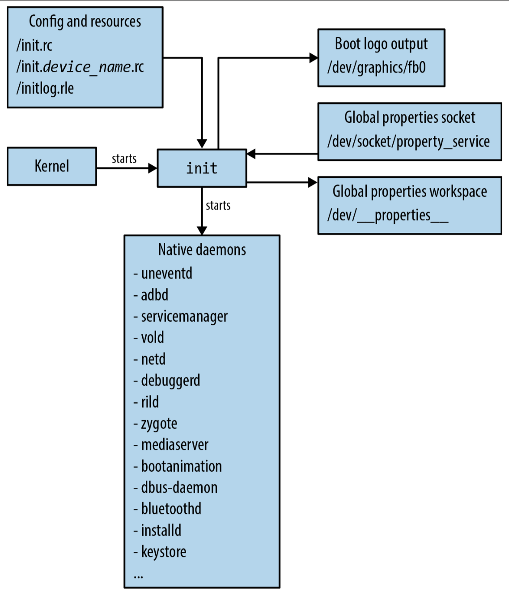
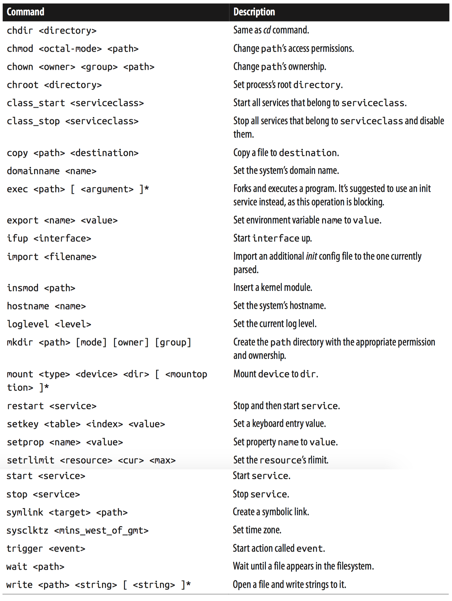
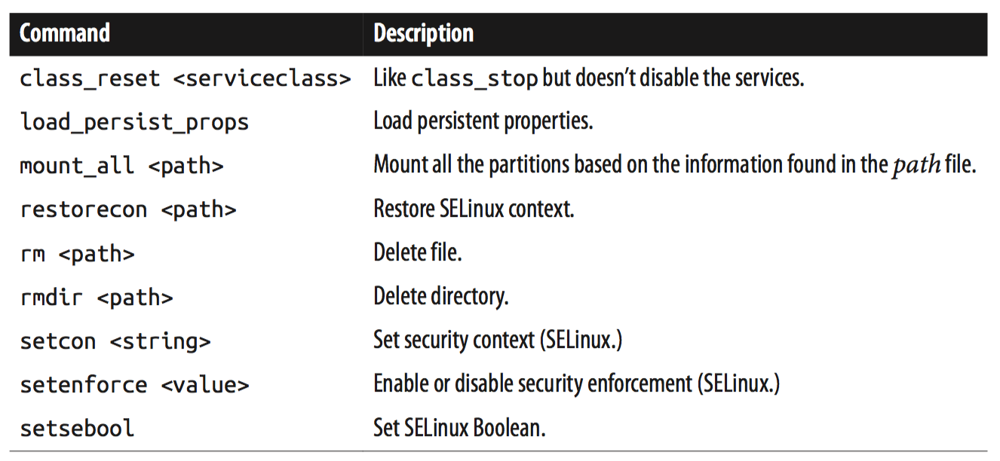
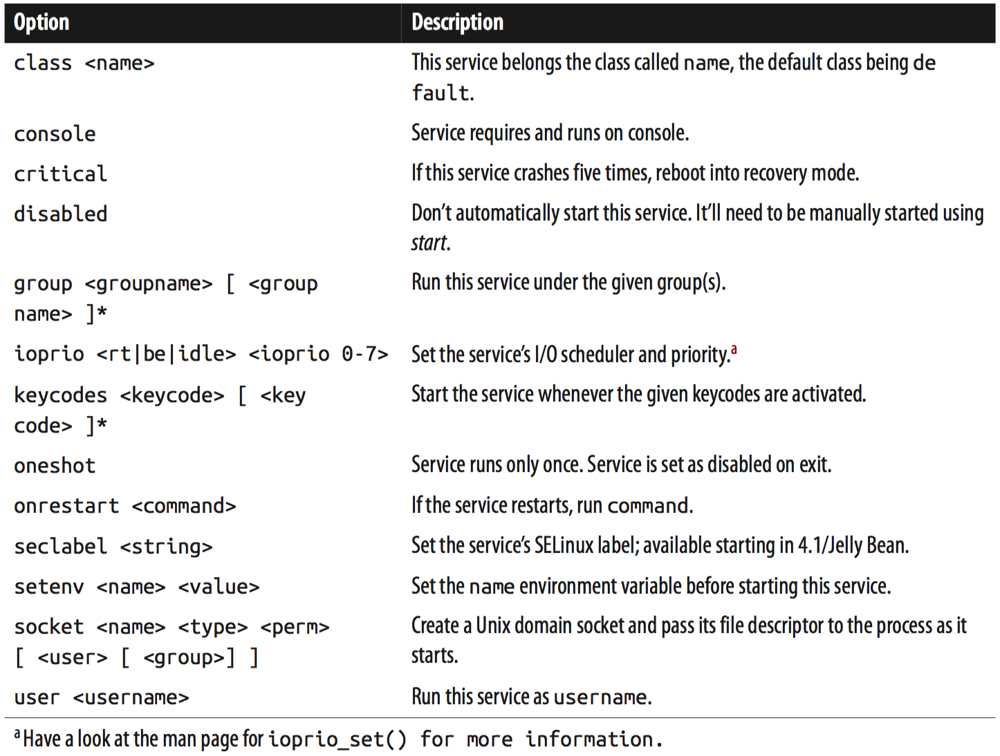
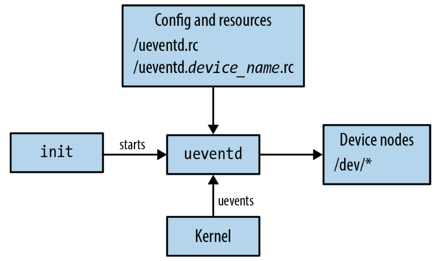
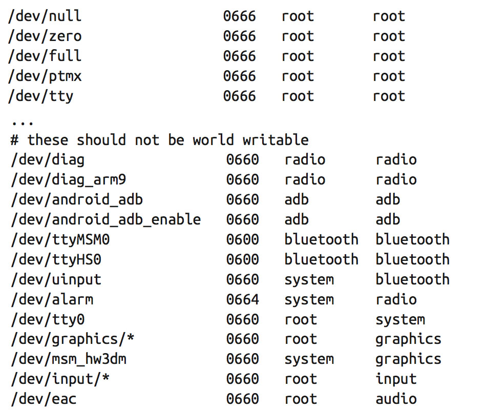

[toc]

## init

Android有自己定制的init。在典型Linux系统中，init的角色仅限于启动守护进程。因此仅从多一个 *属性服务* 的角度看，Android的init是特殊的。与Linux init类似，Android的init不会死。init，作为内核启动的第一个进程，PID为1。

### 6.4.1 理论

下图展示了init如何与其他Android组件集成。内核启动init后，它读取自己的配置文件，在屏幕上输出启动消息或LOGO，为其属性服务打开一个socket，启动所有的守护进程和服务，将整个Android带进用户空间。

Figure 6-4. Android’s init

init首先检查自己是否作为`ueventd`调用。As I mentioned in Chapter 2, init includes an implementation of the udev hotplug events handler. Because this code is compiled within init’s own code, init checks the command-line that was used to invoke it, and if it was invoked through the `/sbin/ueventd` symbolic link to `/init`, then init immediately runs as `ueventd`.

接下来init做的是创建和挂载`/dev`、 `/proc` 和 `/sys`。然后 `init` 读取 `/init.rc` 和 `/init.<device_name>.rc` 文件，根据其内容继续初始化系统。

所有初始化完成后，init进入无限循环，用以重启任何需要重启的服务，and then polls file descriptors it handles, such as the property service’s socket, for any input that needs to be processed. This is how `setprop` property setting requests are serviced, for instance.

### 6.4.2 配置文件

#### 位置

init相关东西都在根目录。包括init二进制，它的两个配置文件是 `init.rc` 和 `init.<device_name>.rc`。

`<device_name>`取自`/proc/cpuinfo`。在这个文件中，有一个以`Hardware`开头的行。init解析这一行，**全部取小写后**，得到`<device_name>`。例如对于BeagleBone，它是`am335xevm`；对于模拟器来说，取`goldfish`。

在执行任何指令前，init会先读取两个文件。

#### 语义

init的.rc文件包含一系列声明，分两类：操作（actions）和服务（services）。每个声明节以一个关键字开头，表明声明的类型。`on`表示一个操作，`service`表示一个服务。后面几行是声明的细节。

    on <trigger>
        <command>
        <command>
        <command>
    ...
    service <name> <pathname> [ <argument> ]*
        <option>
        <option>
        <option>
    ...

> 注意：init的**服务**，既不是指系统服务，也不是指应用的服务组件。

源码中有一个文件`system/core/init/readme.txt`。但其中有些描述并未被实际实现。它只能做部分参考。

一块声明结束于下一个声明开始处。只有action会导致实际命令的执行。服务的声明只是用于描述服务；它们实际不启动任何东西。服务的启动和停止随action触发。

有两类action触发器：预定义的触发器和随属性值改变后激活的触发器。init定义了一组固定的预定义的触发器，以特定顺序运行。属性激发的触发器，在属性值等于init.rc文件中设定的值时触发。下面是init配置文件中可以使用的预定义触发器：

- early-init
- init
- early-fs
- fs
- post-fs
- early-boot
- boot

下面是init执行预定义触发器及内建action的顺序：

1. 运行early-init命令
2. coldboot: Check that ueventd has populated /dev.
3. 初始化属性服务内部的数据结构。
4. Set up handler for keychords.
5. Initialize the console and display startup text or image.
6. Set up initial properties such as ro.serialno, ro.baseband, and ro.carrier.
7. 运行init命令
8. 运行early-fs命令
9. 运行fs命令
10. 运行post-fs命令
11. 启动属性服务
12. Prepare to receive SIGCHLD signals.
13. Make sure that the property service socket and SIGCHLD handler are ready.
14. 运行early-boot命令
15. 运行boot命令
16. Run all property-triggered commands based on current property values.

**基于属性的触发器**。根据属性值得改变激发某些操作：

	on property:<name>=<value>

即，当属性值变成指定值时，运行后续指定的命令。例如，默认的 init.rc 会根据设置应用的 **USB debugging**选项，启动或停止 adbd 守护进程：

	on property:persist.service.adb.enable=1
        start adbd
    on property:persist.service.adb.enable=0
        stop adbd

**Action命令**。在利用`on`关键字声明一个新的操作后，下面是此操作要执行的命令。尽管下表中多数命令在命令行（Toolbox）都有等价的命令。但只有这个列表中的命令能被init识别。不识别的命令会被忽略。

Table 6-18. init’s commands in 2.3/Gingerbread

4.2 also has a few additional commands that are recognized by init, as you can see in Table 6-19.

Table 6-19. New init commands in 4.2/Jelly Bean

**服务声明**。init只能识别服务名，不能识别服务的路径。因此要运行特定文件，要先为其创建一个服务。服务声明的格式是：

	service <name> <pathname> [ <argument> ]*

例如，Zygote：

	service zygote /system/bin/app_process -Xzygote /system/bin --zygote --start -system-server

实际运行的二进制文件是`app_process`。但在剩下的init.rc文件中，使用的一直是`zygote`这个服务名。

    onrestart restart zygote

**服务选项**。Much like actions, the service declaration is often followed by a number of lines that provide more information on the options to use for the service and how to run it. Table 6-20 details those options.

Table 6-20. init’s service options

在一组特定按键按下时启动特定服务的例子。Here’s an example of how this is used by the board-specific .rc file for the Nexus S (a.k.a. “Crespo”) in 2.3:

    # bugreport is triggered by holding down volume down, volume up and power
    service bugreport /system/bin/dumpstate -d -v -o /sdcard/bugreports/bugreport
        disabled
        oneshot
        keycodes 114 115 116

#### 主init.rc

主init.rc提供所有板子共有的默认行为。附录D有两个该文件的版本。一个是2.3的，一个是4.2的。我强烈建议通读附录D，因为init.rc是很多系统行为的基础。至少读读注释。

init.rc产生的操作对系统影响深远。**尽量不要修改init.rc**，修改board-specific.rc。

Note that not all predefined actions are necessarily in use in your AOSP’s default init.rc. Neither `early-fs` nor `early-boot` are actually used in 2.3’s, for example. You can therefore use these in your board-specific.rc file if you need to preempt commands run in the `fs` or `boot` actions.

#### 板子相关的.rc文件

If you need to add board-specific configuration instructions for init, the best way is to use an `init.<device_name>.rc` tailored to your system. What it does specifically is up to you. However, I suggest you take a look at the board-specific .rc files that are already part of your AOSP. Here are the files from 2.3, for example:

- system/core/rootdir/etc/init.goldfish.rc
- device/htc/passion/init.mahimahi.rc
- device/samsung/crespo4g/init.herring.rc
- device/samsung/crespo/init.herring.rc

Here are the ones in 4.2:

- system/core/rootdir/etc/init.goldfish.rc
- build/target/board/vbox_x86/init.vbox_x86.rc
- device/asus/tilapia/init.tilapia.rc
- device/asus/grouper/init.grouper.rc
- device/samsung/tuna/init.tuna.rc
- device/ti/panda/init.omap4pandaboard.rc
- device/lge/mako/init.mako.rc

As you’d expect, these files typically contain hardware-specific commands. Very often, for instance, they’ll include specific mount instructions for the board. Here’s an example from the Crespo-specific file in 2.3:

    on fs
        mkdir /efs 0775 radio radio
        mount yaffs2 mtd@efs /efs nosuid nodev
            chmod 770 /efs/bluetooth
            chmod 770 /efs/imei
        mount ext4 /dev/block/platform/s3c-sdhci.0/by-name/system /system wait ro
        mount ext4 /dev/block/platform/s3c-sdhci.0/by-name/userdata /data wait noati
    me nosuid nodev

As you can see, this mounts `/system` and `/data` from ext4 partitions found in the onboard eMMC. Another example is the snippet from an earlier section that showed how the bugreport command was activated when a certain key combination was pressed on the device.

Again, as I had mentioned earlier, init reads both its main init.rc and the board-specific .rc file before executing any of the actions therein. Hence, by declaring a boot action or an fs action in your board-specific file, the commands therein will be queued up for running right after the commands found in the same action in the main config file. They will, therefore, still run within that action. Hence, commands found in `boot` actions will run after commands found in `fs` actions, regardless of which file either set of commands are declared in.

Here’s, for example, an `init.coyotepad.rc`:

	on property:acme.birdradar.enable=1
        start birdradar
    service birdradar /system/vendor/bin/bradard -d /system/vendor/etc/rcalibrate.data
        user birdradar
        group birdradar
        disabled

This states that the `birdradar` service should be started whenever the acme.birdradar.enable property is set to 1. In the earlier explanation about Toolbox, we used the `setprop` command on the command line to set the property to 1. Had the above init.coyotepad.rc been part of the system at startup, that previous `setprop` command would have therefore resulted in bradard being started.

---

What about `init.<device_name>.sh`?

In some cases, it makes sense to have a shell script run in addition to the commands run by init’s configuration files. The emulator, for instance, relies on a `init.goldfish.sh` found in /system/etc. Despite the name of the file, init itself doesn’t recognize such scripts and has no code that looks for them. Instead, board-specific .rc files can be made to run shell scripts like they’d run any other service. Here’s how `init.goldfish.rc` gets `init.gold fish.sh` to be executed:

    service goldfish-setup /system/etc/init.goldfish.sh
        oneshot

In this specific case, the shell script runs commands that are available on the shell but aren’t part of init’s lexicon. And that is in fact a very good reason for having a shell script such as this if you need one.

---

### 6.4.3 全局属性

虽然前面已经提及全局属性多次，但尚未深入研究它。全局属性对于整个Android架构是非常重要的。

#### 理论

之前提到过，**init**维护一个**属性服务**（property service）。属性服务暴露给系统其他部分有两种方式：

- `/dev/socket/property_service`：这是一个Unix domain socket，进程可以通过它设置或修改全局属性的值。
- `/dev/__properties__`：这是一个不可见文件（即你在/dev下找它的话根本找不到，that is created within the tmpfs-mounted /dev and that is memory-mapped into the address space of all services started by init. 通过该映射区域，init的所有后代（即，系统中所有的用户空间进程）可以读取该全局属性。

---

`/dev/__properties__`的不可见性

You won’t find `/dev/__properties__` in the filesystem because of the way init handles the file. Here’s what it actually does to the file during initialization:

1. Creates `/dev/__properties__` in read-write mode.
2. Sets its size to a desired global properties workspace size.
3. Memory-maps the file into init’s address space.
4. Closes the file descriptor.
5. 以只读方式打开文件
6. 从文件系统中删除

最后一步使得人们无法从/dev中找到它。However, since the file was memory-mapped while it was still open in read-write mode, init’s property service is able to continue writing to the memory-mapped file. Also, since it was opened in read-only mode before it was deleted, init also has a file descriptor it can pass to its children, so they can in turn memory-map the file, which will remain read-only for them.

---

属性服务实际将所有全局属性存储在RAM中。且只有属性服务可以写这个工作空间，但任何进程都可以读。This design allows the property service to apply permission checks on the write requests submitted to it through the `/dev/socket/property_service` Unix domain socket. The specific permissions required to set certain global properties are hardcoded. Here’s the relevant snippet from 2.3/ Gingerbread’s `system/core/init/property_service.c`:

    /* White list of permissions for setting property services. */
    struct {
    	const char *prefix;
    	unsigned int uid;
    	unsigned int gid;
    } property_perms[] = {
        { "net.rmnet0.", AID_RADIO, 0 },
        { "net.gprs.", AID_RADIO, 0 },
        { "net.ppp", AID_RADIO, 0 },
        { "ril.", AID_RADIO, 0 },
        { "gsm.", AID_RADIO, 0 },
        { "persist.radio", AID_RADIO, 0 },
        ...

To understand the meaning of each `AID_*` UID, please refer to the discussion about the `android_filesystem_config.h` file in “The Build System and the Filesystem” on page 185 where user IDs and other core filesystem properties are defined. For instance, the above says that only processes running as the system user can change properties that start with `sys.` or `hw.`, while only processes running as the radio user—the rild, for instance— can change properties that start with `ril.` or `gsm.`.

Note that processes running as root can change any property they wish. Note also that in the case of properties whose names starts with ro., these three characters are stripped from the name before permissions are checked with the above array. Such properties can be set only once, however. Trying to change the value of an existing property whose name starts with ro. will fail. Furthermore, if a permission isn’t explicitly granted by the above array for a given property (or property set) to the user under which a process is running, that process won’t be allowed to set that property. Here’s an attempt to set acme.birdradar.enable from a non-root shell for example:

    $ setprop acme.birdradar.enable 1
    [ 1992.292414] init: sys_prop: permission denied uid:2000 name:acme.birdradar .enable

As we discussed in the Toolbox section, you can use `getprop`, `setprop`, and `watchprops` to interact with the property service from the command line. You can also interact with the property service from within the code you build as part of the AOSP. If you’re coding in Java, have a look at the `frameworks/base/core/java/android/os/SystemProperties.java` class. To use this class, you would need to import android.os.SystemProper ties. If you’re coding in C, have a look at `system/core/include/cutils/properties.h`. To use the functions in this header, you need to include `<cutils/properties.h>`.

> Global properties aren’t accessible through the regular app development API exposed by the SDK.

#### 术语与分组

全局属性遵循一些命名习惯。有几个部分组成。每个部分通过点分隔。

Of course, the permissions array we saw earlier somewhat dictates a base set of root categories. And quite a few properties are created as part of the build system, as we’ll see shortly. There are also a few special properties worth keeping in mind. 每个设备有自己一套全局属性，并没有一套官方的全局属性列表。

你可以为自己的系统创建特殊的全局属性。Up to now, I’ve used the `acme.birdradar.enable` property to illustrate some of the examples. 我可以定义很多`acme.*`属性，用作不同目的。你还可以修改一些已存在的全局属性，符合你的目的。但在此之前要了解这些属性会被Android哪些系统读取和设置。例如，可以对整个代码属用grep过滤。

> You should use `getprop` after the initial boot of your system to get your device’s base list of properties. Also, you can look at the default list of properties loaded at startup from property files. We’ll take a look at those in the next section.

There are, as I said, some special properties, as well as some properties that are processed differently based on their prefixes:

`ro.*`
以这个前缀开头的是只读属性。Hence, they can be set only once in the system’s lifetime. The only way to change their value is to change the source of the information to which they are set and reboot the system. Such is the case for `ro.hardware` and `ro.build.id`, for example.

`persist.*`
Properties marked with this prefix are committed to persistent storage each time they are set. Such is the case for `persist.service.adb.enable`, which is used to start/stop adbd.

`ctl.*`
There’s a ctl.start and a ctl.stop, and setting them doesn’t actually result in any property being saved to the global set of properties. Instead, when the property service receives a request to set either of these, it starts/stops the service whose name is provided as the value for the property. The Surface Flinger, for instance, does this as part of its startup:

	property_set("ctl.start", "bootanim");

This effectively results in the `bootanim` service being started by init. The bootanim service and its options are described in the init.rc file we covered earlier. Toolbox’s start and stop also rely on `ctl.*` to start/stop services.

`net.change`
Whenever a net.* property is changed, net.change is set to the name of that property. Hence, net.change always contains the name of the last net.* property that was modified.

#### 存储

There isn’t a single location in which global properties are stored or from which they’re set. Instead, different pieces of the system are responsible for setting different sets of global properties, and several system parts are involved in creating the final set of global properties found in any single Android device.

**The build system**. Two property files are generated by the build system:

- `/system/build.prop`：This one contains information about the build itself, such as the version of Android and the date it was built.
- `/default.prop`：This one contains default values for certain key properties, such as the `persist.service.adb.enable` property that we saw earlier.

Both of these files are found in the target’s root filesystem for the initial boot and serve as the base set of properties for the system. You can find them in the root/ and system/ subdirectories of out/target/product/PRODUCT_DEVICE/.

The files contain one-liner name-value pairs. They’re read and parsed by the property service started early during init’s own startup. Most of the content of these files is generated by the core AOSP build code in build/core/. Still, as in the following snippet from Crespo’s makefiles in 2.3/Gingerbread, some of it is device specific:

    PRODUCT_PROPERTY_OVERRIDES += \
        wifi.interface=eth0 \
        wifi.supplicant_scan_interval=15 \
        dalvik.vm.heapsize=32m

**Additional property files**. In addition to the files generated by the build system, you can add your own target-specific /system/default.prop and device-specific /data/local.prop, both of which will be read by the property service alongside the files generated by the build system we just discussed.

**.rc files**. As we saw earlier, both the `init.rc` file and `init.<device_name>.rc` can set global properties. init.rc in fact sets quite a few crucial global properties.

**Code**. Some parts of the code also set properties. The Connectivity Service, for instance, does this:

	SystemProperties.set("net.hostname", name);

To confuse things even further, some parts of the code attempt to read global properties and apply defaults if the value isn’t found. The following is from frameworks/base/core/jni/AndroidRuntime.cpp:

	property_get("dalvik.vm.heapsize", heapsizeOptsBuf+4, "16m");

In this case, the caller attempts to get dalvik.vm.heapsize, and if it isn’t found, the value 16m is used as the default.

**/data/property**. All the storage methods we’ve seen thus far require manual intervention to either make changes to the AOSP before it’s built or to edit files on the device. Obviously, the system needs to be able to automatically update values at runtime and have them available at the next reboot. That’s the role of the entries in the /data/property directory. Indeed, any property that starts with persist. is stored as an individual file in that directory. Each of the files there contains the value assigned to the property. Hence, the /data/property/persist.service.adb.enable file contains the value of `persist.service.adb.enable`.

Properties found in /data/property are read by the property service at startup and restored. As I mentioned earlier when discussing Toolbox’s setprop, the only way to destroy a persistent stored property is to delete its file from /data/property.

### 6.4.4 ueventd

As discussed earlier, init includes functionality to handle kernel hotplug events. When the `/init` binary is invoked through the `/sbin/ueventd` symbolic link, it immediately switches its identity from running as the regular init to running as ueventd. Figure 6-5 illustrates ueventd’s operation.

Figure 6-5. Android’s ueventd

**ueventd** is one of the very first services started by the default init.rc. It proceeds to read its main configuration files, `/ueventd.rc` and `/ueventd.<device_name>.rc`, replays all kernel uevents (i.e., hotplug events), and then waits, listening for all future uevents. Kernel uevents are delivered to ueventd through a netlink socket, a common way for certain kernel functionalities to communicate with user-space tools and daemons.

Based on the events ueventd receives and its configuration files, it automatically creates device node entries in /dev. And since the latter is mounted as a tmpfs filesystem, and therefore lives only in RAM, these entries are re-created from scratch, based on ueventd’s configuration files, at every reboot. The key to ueventd’s operation, therefore, is its configuration files.

Unlike init, ueventd’s configuration files have a rather simple format. Essentially, every device entry is described with a one-liner such as this:

	/dev/<node> <mode> <user> <group>

When a uevent corresponding to node occurs, ueventd creates /dev/node with access permissions set to mode and assigns the entry to user/group. Permissions and ownership are very important, since key daemons and services must have access to relevant /dev entries in order to operate properly. The System Server, for instance, runs as the sys tem user.

Here’s a snippet from the default ueventd.rc from 2.3/Gingerbread, for example:

As with init, you should put your board-specific node entries in `ueventd.<de vice_name>.rc`. Here’s a device entry from ueventd.coyotepad.rc, for example:

    /dev/bradar     0660   system     birdradar

Note that some uevents might require ueventd to load firmware files on behalf of the kernel. There’s no configuration option available for that in ueventd’s configuration files. Instead, make sure those firmware files are in either /etc/firmware or /vendor/firmware. In the case of the CoyotePad, for instance, we put rfirmware.bin in /system/vendor/firmware using `PRODUCT_COPY_FILES`.

### 6.4.5 启动Logo

Not counting whatever the device’s bootloader might display at startup, Android devices’ screens typically go through four stages during boot:

- 内核启动屏：Android设备一般不会将其启动信息显示在LCD上。内核一般选择在init启动前保持黑屏，或显示一个静态的logo，built as part of the kernel image, to the framebuffer. 本书不讨论这个显示。
- init的启动过logo：文本或图片，在init早期显示。This section’s purpose is to discuss what init displays here.
- 启动动画：This is a series of animated images, possibly a loop, that displays during the Surface Flinger’s start up. 在下一章介绍。
- Home屏：Launcher的开始屏。You’ll need to dig into the Launcher’s sources if you’d like to customize what it displays.

If you refer back to the earlier explanation in “Configuration Files” on page 230 of the execution order enforced by init on predefined actions and built-in commands, you’ll notice that the fifth step is initializing the console and display startup text or image. During this step, init attempts to load a logo image from the `/initlogo.rle` file and display it to the screen. If it doesn’t find such a file, 就显示简单的Android的字样。

If you’d like to change that string, have a look at the `console_init_action()` in `system/core/init/init.c`. If you’d like to have a graphic logo to display instead of just text, you’ll need to create a proper `initlogo.rle`. Let’s see how that’s done.

首先，确定屏幕大小。制作相应大小的图片。转换成init能识别的格式。需要用到两个工具：ImageMagick的`convert`，或AOSP的`rgb2565`（需要先调用build/envsetup.sh和lunch设置好环境）：

    $ cd device/acme/coyotepad
    $ convert -depth 8 acmelogo.png rgb:acmelogo.raw
    $ rgb2565 -rle < acmelogo.raw > acmelogo.rle 153600 pixels

This will take the acmelogo.png and convert it into an acmelogo.rle, which you can then copy by modifying the CoyotePad’s `full_coyote.mk` to add this snippet:

	PRODUCT_COPY_FILES += \
		device/acme/coyotepad/acmelogo.rle:root/initlogo.rle

Generally, the LCD screen will then remain unchanged until the Surface Flinger starts and launches the boot animation while the rest of the system services are starting.
