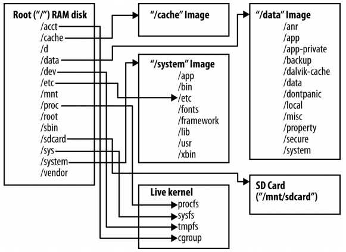
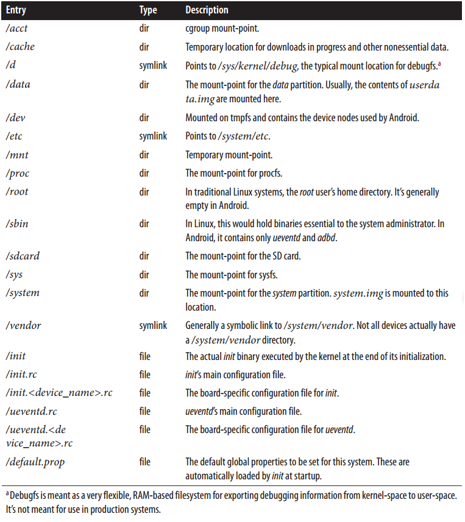
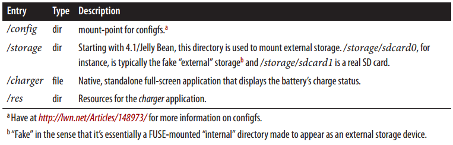
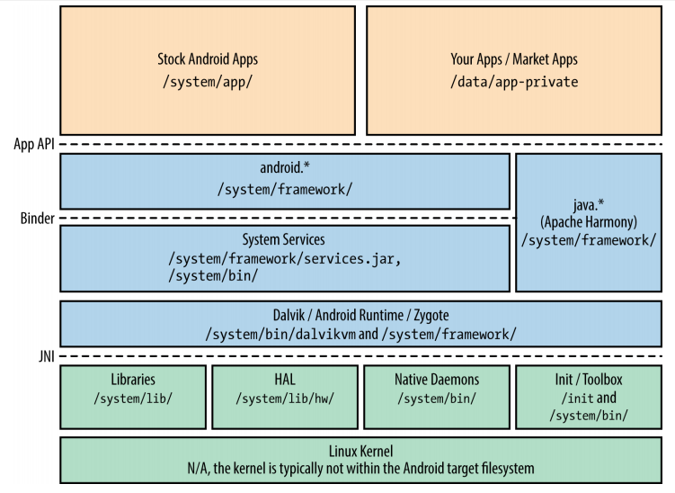
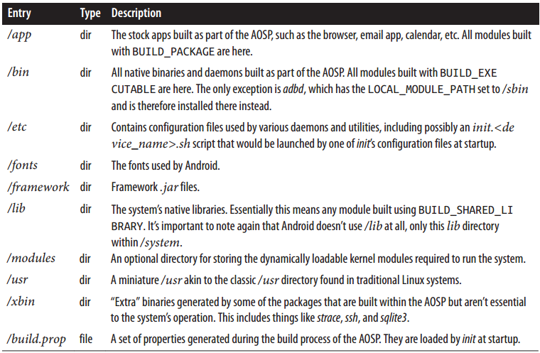
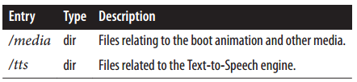
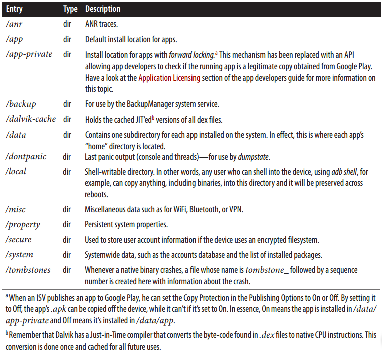
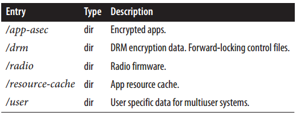
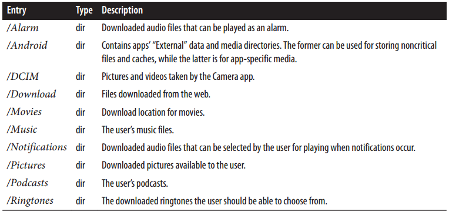
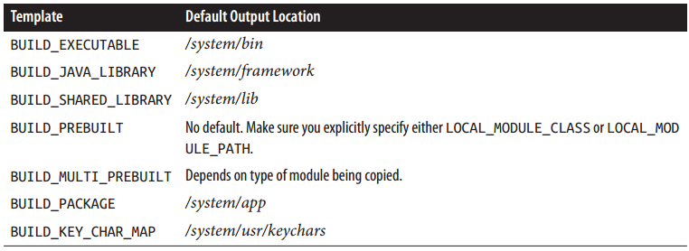

[toc]

## 文件系统

下图列出了构建系统生成的镜像，及它们在运行时的关系。除了少数例外，这个布局在2.3和4.2上基本相同。系统启动时，内核挂载RAM disk镜像作为根文件系统，然后运行其中的 `init` 进程。`init`进程的配置文件，将另外几个镜像和虚拟文件系统，挂载到根文件系统相应目录。

Figure 6-1. Android根文件系统

为什么有这么多镜像？因为它们的目的不同，有不同的存储特性。例如，**RAM disk**镜像，要尽量小，它的目的仅是提供初始骨架。它一般以压缩镜像的形式存放在某种介质上，由内核加载到RAM中，挂载为只读根文件系统。`/cache`、 `/data`、 `/system` 一般从物理介质的其他分区挂载。`/cache` 和 `/data` 一般挂载成可读写的， `/system` 一般挂载成只读的。

> **使用单个文件系统**
将所有Android构建的输出做到单个文件系统，没什么不可以。TI的 RowBoat 就是这样。它产生单个根文件系统镜像。In the case of the BeagleBone or BeagleBoard, for example, the root filesystem in its entirety is programmed into a single partition of the microSD card used for booting and as the device’s main storage device.
合并成一个文件系统，我们得保证能够一下更新整个文件系统。此时要做到安全的容忍更新失败是很难得。对于Beagles问题不大，因为它们是开发板。但对于实际产品就是问题了。

In Android versions 2.2 and prior, `/cache`, `/data`, and `/system` directories would typically be mounted from YAFFS2-formatted NAND flash partitions. 由于手机厂商慢慢用 **eMMC** 替代 NAND flash，在 Android 2.3 设备 *Samsung Nexus S* 中，**ext4** 替代了YAFFS2。从那时起就假定所有的Android手机都应该用**ext4**，而不是**YAFFS2**。当然你完全可以用其他文件系统，你需要修改构建系统的makefile，产生适合的镜像，更新 **init** 配置文件中的 `mount` 命令选项。

《Building Embedded Linux Systems, 2nd》一书讲到，Linux 的 MTD 层用于关联、操作、访问Flash设备（包括NOR和NAND flash）。很多文件系统基于 MTD 层，如JFFS2, UBIFS, YAFFS2。
eMMC设备（第5章），作为传统的块设备出现。它包含着控制器和RAM，因此操作系统可以使用常规磁盘文件系统，如 **ext4**。Flash文件系统设计时考虑的是单核系统。而Linux中的磁盘文件系统从很久之前就要能与多核协作。因此它更适合将来的多核Android设备。

SD卡总是以块设备的形式出现，一般用 **VFAT** 文件系统。使用该系统，因为用户需要将SD卡从Android移除，插入到他的电脑。`/proc`、 `/sys` 和 `/acct` 分别使用 **procfs**、 **sysfs**、 **cgroupfs** 挂载。**cgroups** 在Linux中一般挂载在 `/cgroup`，但在Android中一般挂载为 `/acct`。`/dev` 挂载成 **tmpfs**；这没啥问题，因为Android通过Linux的**udev**机制，动态创建`/dev`项。

Procfs, sysfs, tmpfs 和 cgroup 都是虚拟文件系统，由内核管理。Procfs 是内核向用户空间暴露信息的传统方式。procfs 下的项一般可以看做文件文件（或目录）。例如CPU信息可以通过`cat /proc/cpuinfo`获取。

随着内核成熟度的提升，大家逐渐认识到，不是所有的内核到用户空间的信息都应该由 procfs 暴露。**sysfs** 与内核的设备和硬件的管理紧密绑定。**sysfs** 下的项，可用户获取外围设备的详细信息，或在用户空间直接修改控制驱动行为的标记位。例如，Android的很多电源管理功能，通过`/sys/power/`目录下的项控制。

**Tmpfs** 允许你创建虚拟的、只使用RAM的文件系统，用于存储临时文件。只要RAM上电，内核就允许读写这些文件。但重启后它们全部丢失。

**Cgroupfs** is a relatively recent addition to the kernel for managing the control group functionality added in Linux 2.6.24. In sum, cgroups allow you to group certain processes and their children and dictate resource limits and priorities onto those groups. **Android uses cgroups to prioritize foreground tasks**.

### 6.1.1 根目录

经典的Linux根文件系统由Filesystem Hierarchy Standard (FHS)定义。但Android并未遵守FHS。多数关键功能都在 `/system` 和 `/data` 两个目录中。

Android的根目录挂载自 **ramdisk.img** （AOSP构建系统产生）。**ramdisk.img** 一般会与内核一起放在设备的主要存储介质，由 bootloader 加载。下表给出了挂载后根目录的内容：

Table 6-1. Android’s root directory

4.2后，根目录下增加了几个目录：

Table 6-2. Additions to Android’s root directory in 4.2/Jelly Bean

### 6.1.2 `/system`

`/system` 包含AOSP构建系统产生的、不可变的组件。下面给出了Android关键部分在文件系统中的位置。

Figure 6-2. Filesystem location of key Android components

Table 6-3. /system directory contents

4.2增加的项：

Table 6-4. New /system directory entries in 4.2/Jelly Bean

`/system` 一般挂载成只读，因为它的更新一般只发生于整个Android OS更新时。只读的好处之一是，一些OTA升级脚本使用二进制的补丁；若该分区不会被修改，就能得到一个干净的delta。

### 6.1.3 `/data`

`/data`包含可以改变的数据和英语欧诺个。AOSP构建系统产生的 `userdata.img` 多数情况下是空的。下表是该目录下的内容：

Table 6-5. /data directory contents

4.2新增内容：

Table 6-6. New /data directory entries in 4.2/Jelly Bean

#### 多用户支持

多用户支持4.2新增的重要特性之一。In fact, some have argued that this addition was a watershed moment, opening Android to new use cases. 尽管只能用于平板模式，it allows multiple users to share the same device in a coherent fashion. Specifically, it means every user can utilize the device by logging in separately and can have her own set of account credentials and data for each application.

To achieve this, the AOSP’s data-storage mechanism has been slightly modified. For instance, `/data/data` is now the directory containing the app data for the device’s owner (i.e., “administrator”). All other users have their data stored in `/data/user/<user_id>` instead. Here’s the content of `/data/user` in an emulator running 4.2/Jelly Bean:(The emulator doesn’t support multiple users by default. A few hacks must be made to get it to add a fake user.)

    root@android:/ # ls -l /data/user/
    lrwxrwxrwx root root 2012-11-30 20:46 0 -> /data/data/
    drwxrwx--x system system 2012-12-04 23:38 10
    root@android:/ # ls -l /data/user/0/
    drwxr-x--x u0_a27 u0_a27 2012-11-30 20:46 com.android.backupconfirm
    drwxr-x--x bluetooth bluetooth 2012-11-30 20:46 com.android.bluetooth
    drwxr-x--x u0_a17 u0_a17 2012-12-14 18:01 com.android.browser
    drwxr-x--x u0_a43 u0_a43 2012-11-30 20:46 com.android.calculator2
    drwxr-x--x u0_a20 u0_a20 2012-11-30 20:47 com.android.calendar
    drwxr-x--x u0_a33 u0_a33 2012-11-30 20:46 com.android.certinstaller
    drwxr-x--x u0_a0 u0_a0 2012-11-30 20:47 com.android.contacts
    drwxr-x--x u0_a25 u0_a25 2012-11-30 20:46 com.android.defcontainer
    drwxr-x--x u0_a6 u0_a6 2012-11-30 20:47 com.android.deskclock
    ...
    root@android:/ # ls -l /data/user/10/
    drwxr-x--x u10_system u10_system 2012-12-04 23:38 android
    drwxr-x--x u10_a27 u10_a27 2012-12-04 23:38 com.android.backupconfirm
    drwxr-x--x u10_bluetooth u10_bluetooth2012-12-04 23:38 com.android.bluetooth
    drwxr-x--x u10_a17 u10_a17 2012-12-04 23:38 com.android.browser
    drwxr-x--x u10_a43 u10_a43 2012-12-04 23:38 com.android.calculator2
    drwxr-x--x u10_a20 u10_a20 2012-12-04 23:38 com.android.calendar
    drwxr-x--x u10_a33 u10_a33 2012-12-04 23:38 com.android.certinstaller
    drwxr-x--x u10_a0 u10_a0 2012-12-04 23:38 com.android.contacts
    drwxr-x--x u10_a25 u10_a25 2012-12-04 23:38 com.android.defcontainer
    drwxr-x--x u10_a6 u10_a6 2012-12-04 23:38 com.android.deskclock
    ...

Similarly, there are now per-user account credentials for each of the Internet accounts that may be tied to a given user. Prior to 4.2, there was a single `/data/system/accounts.db` to hold all accounts. Now there is one such file for each user:

    root@android:/ # ls /data/system/users/ -l
    drwx------ system system 2013-01-19 01:03 0
    -rw------- system system 155 2012-11-30 20:46 0.xml
    drwx------ system system 2013-01-19 01:03 10
    -rw------- system system 166 2012-12-04 23:38 10.xml
    -rw------- system system 141 2013-01-19 01:03 userlist.xml
    root@android:/ # ls /data/system/users/0 -l
    -rw-rw---- system system 57344 2012-11-30 20:47 accounts.db
    -rw------- system system 8720 2012-11-30 20:47 accounts.db-journal
    -rw------- system system 534 2013-01-19 01:03 appwidgets.xml
    -rw-rw---- system system 549 2013-01-19 01:03 package-restrictions.xml
    -rw------- system system 97 2013-01-19 01:03 wallpaper_info.xml
    root@android:/ # ls /data/system/users/10 -l
    -rw-rw---- system system 57344 2012-12-04 23:39 accounts.db
    -rw------- system system 8720 2012-12-04 23:39 accounts.db-journal
    -rw-rw---- system system 129 2013-01-19 01:03 package-restrictions.xml

### 6.1.4 SD卡

下表列出了 `/sdcard` 目录下常见的内容。

Table 6-7. Sample /sdcard directory contents

### 6.1.5 构建系统和文件系统

本节探索如何控制构建系统产生文件系统。

#### 构建模板和文件位置

Table 4-2 listed the available build templates. Table 6-8 details the default install location for modules built using each target build template. Note how everything gets installed in one of `/system`’s subdirectories.

Table 6-8. Build templates and corresponding output locations

Internally, the build system generates a `LOCAL_MODULE_PATH` for each module built, depending on the module’s build template. This is where the compiled output is installed. You can override the default by changing the value of `LOCAL_MODULE_PATH` within your `Android.mk`. Let’s say, for instance, that you have a custom tool for your board that has to be installed in `/sbin` instead of `/system/bin`. Your `Android.mk` could then look something like this:

    LOCAL_PATH := $(call my-dir)
    include $(CLEAR_VARS)
    LOCAL_MODULE_TAGS := optional
    LOCAL_SRC_FILES := $(call all-c-files-under, src)
    LOCAL_PACKAGE_NAME := calibratebirdradar
    LOCAL_MODULE_PATH := $(TARGET_ROOT_OUT_SBIN)
    include $(BUILD_PACKAGE)

Note that this specifies `$(TARGET_ROOT_OUT_SBIN)`, not `/sbin`. This is so the binary gets installed in the proper `out/target/product/PRODUCT_DEVICE/` directory. The `TARGET_ROOT_OUT_*` macros are defined in `build/core/envsetup.mk`, along with quite a few installation default macros. Here’s the relevant snippet for our purposes:

    TARGET_ROOT_OUT := $(PRODUCT_OUT)/root
    TARGET_ROOT_OUT_BIN := $(TARGET_ROOT_OUT)/bin
    TARGET_ROOT_OUT_SBIN := $(TARGET_ROOT_OUT)/sbin
    TARGET_ROOT_OUT_ETC := $(TARGET_ROOT_OUT)/etc
    TARGET_ROOT_OUT_USR := $(TARGET_ROOT_OUT)/usr

#### 显式拷贝文件

有些文件，不需要构建系统构建；只需要将它们拷贝到产生的文件系统中。在你的mk文件中，拷贝通过`PRODUCT_COPY_FILES`宏实现。Here’s an updated version of the CoyotePad’s `full_coyote.mk` from Chapter 4:

    $(call inherit-product, $(SRC_TARGET_DIR)/product/languages_full.mk)
    $(call inherit-product, $(SRC_TARGET_DIR)/product/full.mk)
    DEVICE_PACKAGE_OVERLAYS :=
    PRODUCT_PACKAGES +=
    PRODUCT_COPY_FILES += \
    	device/acme/coyotepad/rfirmware.bin:system/vendor/firmware/rfirmware.bin \
    	device/acme/coyotepad/rcalibrate.data:system/vendor/etc/rcalibrate.data
    PRODUCT_NAME := full_coyotepad
    PRODUCT_DEVICE := coyotepad
    PRODUCT_MODEL := Full Android on CoyotePad, meep-meep

This will copy `rfirmware.bin` and `rcalibrate.data` from `device/acme/coyotepad/` to the target’s `/system/vendor/firmware` and `/system/vendor/etc` directories, respectively.

#### 默认的权限和所有权

One aspect we haven’t yet discussed is what and how filesystem rights and ownership are assigned to each directory and file in the Android filesystem. If you’re willing to get your hands dirty, I strongly encourage you to take a look at the `system/core/include/private/android_filesystem_config.h` file. It doesn’t get a lot of publicity and it’s not documented anywhere. It is, however, extremely important, as it provides the list of predefined system users, as well as the rights and ownership assigned to everything in the system. Here’s a partial list of the UIDs/GIDs it defines, along with the associated user/group names in 2.3:

    #define AID_ROOT 0 /* traditional unix root user */
    #define AID_SYSTEM 1000 /* system server */
    #define AID_RADIO 1001 /* telephony subsystem, RIL */
    #define AID_BLUETOOTH 1002 /* bluetooth subsystem */
    #define AID_GRAPHICS 1003 /* graphics devices */
    #define AID_INPUT 1004 /* input devices */
    ...
    #define AID_RFU2 1024 /* RFU */
    #define AID_NFC 1025 /* nfc subsystem */
    #define AID_SHELL 2000 /* adb and debug shell user */
    #define AID_CACHE 2001 /* cache access */
    #define AID_DIAG 2002 /* access to diagnostic resources */
    ...
    #define AID_MISC 9998 /* access to misc storage */
    #define AID_NOBODY 9999
    #define AID_APP 10000 /* first app user */
    ...
    static const struct android_id_info android_ids[] = {
        { "root", AID_ROOT, },
        { "system", AID_SYSTEM, },
        { "radio", AID_RADIO, },
        { "bluetooth", AID_BLUETOOTH, },
        { "graphics", AID_GRAPHICS, },
        { "input", AID_INPUT, },
    ...

If you go to your target’s shell and type `ps`, for instance, you’ll see something like this:

    ...
    root 18048 1 61552 26700 c00a6548 afd0b844 S zygote
    system 18090 18048 141756 50224 ffffffff afd0b6fc S system_server
    system 18187 18048 75664 21828 ffffffff afd0c51c S com.android.systemui
    app_16 18197 18048 78548 19292 ffffffff afd0c51c S com.android.inputmethod.
    latin
    radio 18200 18048 86400 19580 ffffffff afd0c51c S com.android.phone
    app_19 18201 18048 78636 23472 ffffffff afd0c51c S com.android.launcher
    app_1 18234 18048 83904 22232 ffffffff afd0c51c S android.process.acore
    app_2 18281 18048 72364 16696 ffffffff afd0c51c S com.android.deskclock
    ...

Notice how the `system_server` runs as the `system` user，每个APP运行的用户名为`app_N`、The kernel itself doesn’t provide those names. Instead, Bionic uses the previous definitions to provide PID/GID-to-name conversion. In the case of apps, since each app is installed as a separate user (starting from the base UID/GID for apps, 10000), app user names all start with `app_` and are followed by an integer value matching the actual UID/GID assigned to the app minus 10000. This is slightly different starting with 4.2, with multiuser support. Now app names also show user ownership with the form `uM_appN`, where M is the user ID and N is the app ID.

Unlike other aspects of the AOSP’s build system, which allow you to isolate most of your board-specific additions within a directory in `device/`, like `device/acme/coyotepad` from our earlier example, there’s no substitute for modifying the main `android_filesystem_config.h` if you need to add new default users. The bold lines in the following snippet, for instance, show modifications for adding a birdradar user:

    ...
    #define AID_RFU2 1024 /* RFU */
    #define AID_NFC 1025 /* nfc subsystem */
    #define AID_BIRDRADAR 1999 /* Bird radar subsystem */
    #define AID_SHELL 2000 /* adb and debug shell user */
    #define AID_CACHE 2001 /* cache access */
    #define AID_DIAG 2002 /* access to diagnostic resources */
    ...
    static const struct android_id_info android_ids[] = {
        { "root", AID_ROOT, },
        { "system", AID_SYSTEM, },
        { "radio", AID_RADIO, },
        ...
        { "media", AID_MEDIA, },
        { "nfc", AID_NFC, },
        { "birdradar", AID_BIRDRADAR, },
        { "shell", AID_SHELL, },
        { "cache", AID_CACHE, },
    ...

Reasons for adding new default users might include the addition of a new, still-unsupported hardware type to the Android stack, or the desire to isolate from the Android stack a custom stack you’re running side by side with Android. It could also simply be a matter of isolating a specific daemon using a separate user.

Conversely, here are snippets of the directory and file rights defined in `android_filesystem_config.h`:

    static struct fs_path_config android_dirs[] = {
        { 00770, AID_SYSTEM, AID_CACHE, "cache" },
        { 00771, AID_SYSTEM, AID_SYSTEM, "data/app" },
        { 00771, AID_SYSTEM, AID_SYSTEM, "data/app-private" },
        { 00771, AID_SYSTEM, AID_SYSTEM, "data/dalvik-cache" },
        { 00771, AID_SYSTEM, AID_SYSTEM, "data/data" },
        ...
        { 00750, AID_ROOT, AID_SHELL, "sbin" },
        { 00755, AID_ROOT, AID_SHELL, "system/bin" },
        { 00755, AID_ROOT, AID_SHELL, "system/vendor" },
        ...
        { 00755, AID_ROOT, AID_ROOT, 0 },
        };
        ...
    static struct fs_path_config android_files[] = {
        { 00440, AID_ROOT, AID_SHELL, "system/etc/init.goldfish.rc" },
        { 00550, AID_ROOT, AID_SHELL, "system/etc/init.goldfish.sh" },
        ...
        { 00644, AID_SYSTEM, AID_SYSTEM, "data/app/*" },
        { 00644, AID_SYSTEM, AID_SYSTEM, "data/app-private/*" },
        { 00644, AID_APP, AID_APP, "data/data/*" },
        ...
        { 00755, AID_ROOT, AID_SHELL, "system/bin/*" },
        { 00755, AID_ROOT, AID_SHELL, "system/xbin/*" },
        { 00755, AID_ROOT, AID_SHELL, "system/vendor/bin/*" },
        { 00750, AID_ROOT, AID_SHELL, "sbin/*" },
        { 00755, AID_ROOT, AID_ROOT, "bin/*" },
        { 00750, AID_ROOT, AID_SHELL, "init*" },
        { 00644, AID_ROOT, AID_ROOT, 0 },
    };

If, for any reason, you add a new directory or a file into an unlisted (new) directory in the filesystem, the default ownership and access rights will be dictated by the last entry in the array just shown—the one with a 0 instead of a path within quotes. In other words, a new directory will have 755 access rights and be owned by the `AID_ROOT` user and group, and a file added to an unlisted directory will have 644 access rights and be owned by the `AID_ROOT` user and group.

If you’d like to add glibc-linked binaries to your target, as is shown in Appendix A, for instance, you’ll likely want to have a `/lib` directory to host the glibc-libraries; `/lib` being the default library for traditional C libraries under Linux. However, by default, the libraries in there won’t be executable, even if they were on your host as you generated them, and, therefore, any binary linked against glibc will fail to run. To remedy this problem, you’ll need to modify the `android_files` array in `android_filesystem_config.h` to look something like this:

    	...
        { 00750, AID_ROOT, AID_SHELL, "sbin/*" },
        { 00755, AID_ROOT, AID_ROOT, "bin/*" },
        { 00755, AID_ROOT, AID_ROOT, "lib/*" },
        { 00750, AID_ROOT, AID_SHELL, "init*" },
        { 00644, AID_ROOT, AID_ROOT, 0 },
    };

This is yet another modification that you couldn’t isolate into a device-specific directory like `device/acme/coyotepad`.

`/system/vendor`目录保留做厂商自己的扩展。实际上，`android_filesystem_config.h`定义`/system/vendor/bin`下的二进制文件应该是可执行的。因此，如果你要向文件系统添加大量文件，可以考虑放到`/system/vendor`目录。That would be the clean way to do it. But, hey, who ever said embedded and clean were synonymous?

---

一般来说，只做AOSP构建系统允许做的事情，可以方便我们支持今后的Android版本。如果把所有你自己设备相关的代码放到`device/`目录下，支持后续AOSP版本，理论上，只需要拷贝`device/`目录。
但电话、嵌入式系统常常是一锤子买卖：下一版本可能已经用完全不同的SoC。此时严格守规矩有点过于死板、低效。I’ll keep pointing out the “Android way”and all other possibilities as we move forward, but I’ll leave it up to you to decide what’s best for your own project.

---