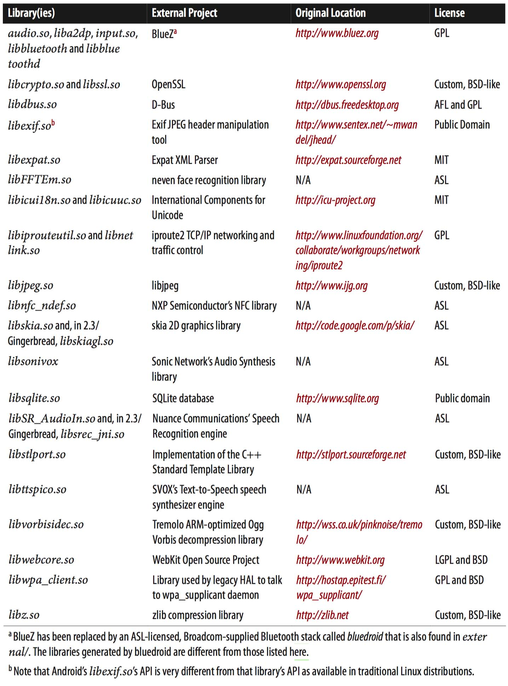
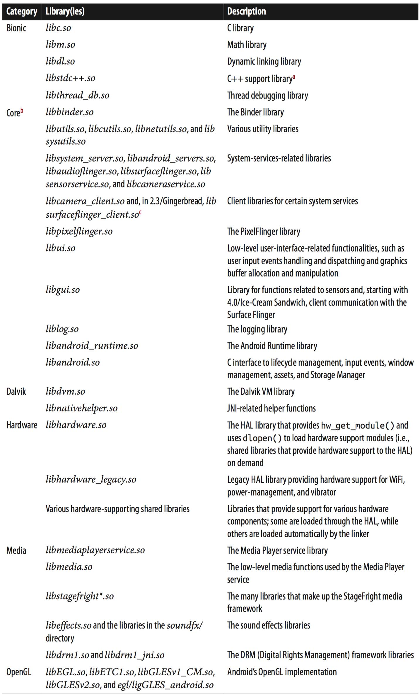
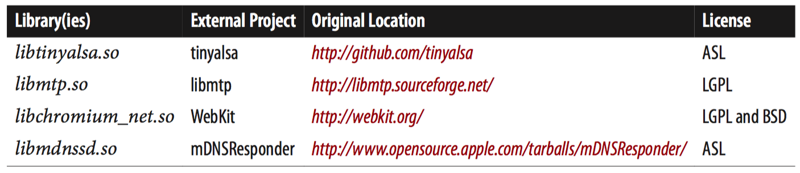
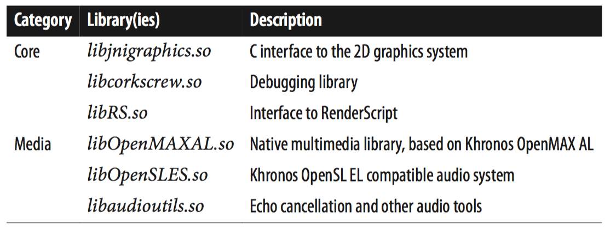
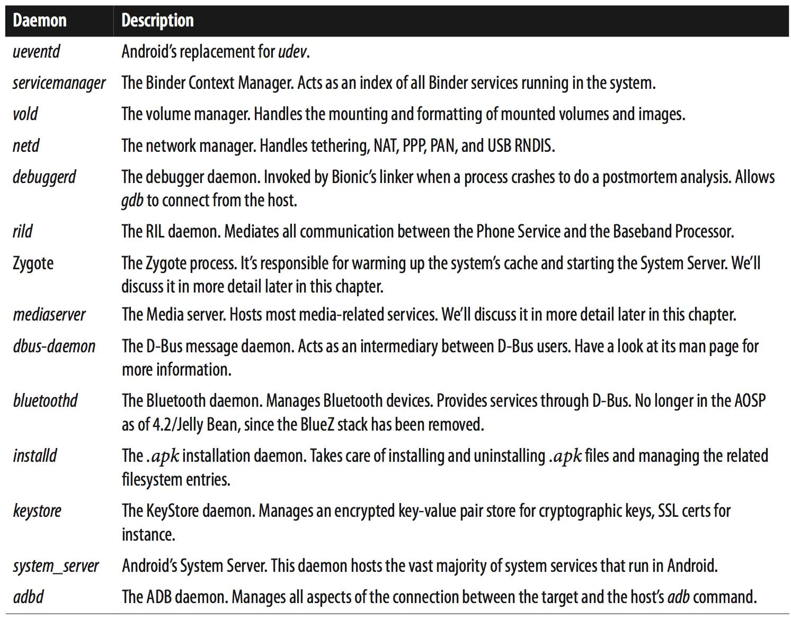

[toc]

## 用户空间

原生用户空间，我指的是运行在虚拟机之外的所有用户空间组件。它们或者自动启动，或者被init按配置启动，或者可以从命令行调用。这些二进制程序一般可以直接访问根文件系统和原生库。它们的能力只受限于分配给它们的文件系统权限和UID、GID。Android框架对Android应用的限制并不适用于它们，因为它们运行在框架之外。

注意Android的用户空间几乎完全是重写设计的，与标准的Linux分发有很大差异。

### 2.5.1 文件系统布局

与其他基于Linux的分发一样，Android使用一个根文件系统存储应用、库和数据。但Android的根文件系统布局并不遵循 Filesystem Hierarchy Standard (FHS)。内核自身并不要求遵循FHS，但多数Linux软件包依赖FHS。因此若要移植一个Linux应用到Android，可能需要做一些工作保证应用依赖的文件路径仍是有效的，或利用某种**chroot jail**，将它以及它依赖的包与根文件系统的其他部分隔离（参见`chroot`的man手册）。

由于运行在Android用户空间的多数软件包都是从头为Android编写的，因此不遵循FHS对Android影响不大。（甚至有好处，见后文）。

Android中两个重要目录是 `/system`和 `/data`。这两个目录不是FHS的。这一点暗示你可以在同一个根文件系统下、Android系统旁边并排放另一个Linux分发。参见附录A。

`/system` 主要用于存储不可变的组件（构建AOSP时产生）。包括原生二进制、原生库、框架包、stock应用。一般将一个单独的镜像挂载到该目录，只读。而根文件系统一般挂载在一个RAM磁盘镜像上。`/data` 主要用于存储不断变化的数据和应用。包括用户安装的应用，及Android运行时产生的数据。它一般也从一个独立的镜像挂载，一般是可读写模式。

Android也包含一些其他Linux系统中常见的目录，如`/dev`、 `/proc`、 `/sys`、 `/sbin`、 `/root`、 `/mnt`等。有些目录，虽然有，但里面基本不剩东西了，如 `/sbin` 、 `/etc`、 `/root`。

有趣的是，Android没有 `/bin` 或 `/lib` 目录。这又是让我们可以并排放另一个Linux系统的一点。

### 2.5.2 库

Android依赖约100个动态加载的库，它们都存储在 `/system/lib` 目录。其中一部分来自外部工程，但大部分都是 AOSP 自己产生的库。Table 2-2 和 Table 2-3 分别列出了来自外部和AOSP自己产生的库。

Table 2-2. Libraries generated from external projects imported into the AOSP

Table 2-3. Android-specific libraries generated from within the AOSP

**a** Some say that this library is similar in its role to the `libsupc++.a` found in standard Linux systems, while Android’s libstlport.so is closer to traditional Linux systems’ `libstdc++.so`.
**b** I’m using this category as catchall for many core Android functionalities.
c Starting with 4.0/Ice-Cream Sandwich, the functionality corresponding to libsurfaceflinger_client.so has been merged into libgui.so.

2.3后由增加了很多库。Tables 2-4 and 2-5 list some of the most notable additions you’ll find in 4.1/Jelly Bean.

Table 2-4. Important libraries from external projects found in 4.1/Jelly Bean

Table 2-5. Important Android-specific libraries found in 4.1/Jelly Bean

### 2.5.3 Init

Android没有改变内核的启动进程。Hence, whatever you know about the kernel’s startup continues to apply just the same to Android’s use of Linux. 改变的时内核启动后Android做什么。在内核初始化自己及驱动，内核启动一个用户空间的进程，**init**进程。This process is then responsible for spawning all other processes and services in the system and for conducting critical operations such as reboots. Traditionally, Linux distributions have relied on **SystemV** init for the init process, although in recent years many distributions have created their own variants. Ubuntu, for instance, uses **Upstart**. 在嵌入Linux领域，提供init的包一般是**BusyBox**。

Android引入了自己的init。

**配置语言**

Android’s init defines its own configuration semantics and relies on changes to global properties to trigger the execution of specific instructions.

init的主要配置文件是`/init.rc`，但一般还有一个设备特定的配置文件，`/init.<device_name>.rc`。有时，如emulator，还有一个设备特定的脚本`/system/etc/init.<device_name>.sh`。修改这些文件可以高度定制系统的启动。

We’ll discuss the init’s configuration language in depth in Chapter 6.

**全局变量**

A very interesting aspect of Android’s init is how it manages a global set of properties that can be accessed and set from many parts of the system, with the appropriate rights. Some of these properties are set at build time, while others are set in init’s configuration files, and still others are set at runtime. Some properties are also persisted to storage for permanent use. Since init manages the properties, it can detect any changes and therefore trigger the execution of a set of commands based on its configuration.

The OOM adjustments mentioned earlier, for instance, are set on startup by the **init.rc** file. So are network properties. 在构建期设置的一些树形存储在**/system/build.prop**。At runtime, the system will have over 100 different properties, ranging from IP and GSM configuration parameters to the battery’s level. Use the `getprop` command to get the current list of properties and their values.

We’ll discuss the init’s global properties, the files used to provide its default values, and the relevant commands in greater detail in Chapter 6.

**udev events**

As I explained earlier, access to devices in Linux is done through nodes within the /dev directory. In the old days, Linux distributions would ship with thousands of entries in that directory to accommodate all possible device configurations. Eventually, though, a few schemes were proposed to make the creation of such nodes dynamic. For some time now, the system in use has been udev, which relies on runtime events generated by the kernel every time hardware is added or removed from the system.
In most Linux distributions, the handling of udev **hotplug** events is done by the **udevd** daemon. In Android, these events are handled by the **ueventd** daemon built as part of Android’s init and accessed through a symbolic link from `/sbin/ueventd` to /init. To know which entries to create in /dev, ueventd relies on the /ueventd.rc and `/ueventd.<device_name>.rc` files.

We’ll discuss the **ueventd** and its configuration files in detail in Chapter 6.

### 2.5.4 Toolbox

Much like the root filesystem’s directory hierarchy, there are essential binaries on most Linux systems, listed by the FHS for the /bin and /sbin directories. In most Linux distributions, the binaries in those directories are built from separate packages coming from different projects available on the Internet. In an embedded system, it doesn’t make sense to have to deal with so many packages, nor necessarily to have that many separate binaries.

The approach taken by the classic **BusyBox** package is to build a single binary that essentially has what amounts to a huge switch-case, which checks for the first parameter on the command line and executes the corresponding functionality. 所有的命令都是到`busybox`的符号链接。例如，当你调用`ls`时，实际调用的时BusyBox。

Android不使用BusyBox，使用自己的Toolbox（因此符号链接都到`toolbox`命令）。但Toolbox功能远不如BusyBox。The rationale for creating a tool from scratch in this case seems to be the licensing angle, BusyBox being GPL licensed. At any rate, Toolbox is BSD licensed, and manufacturers can therefore modify it and distribute it without having to track the modifications made by their developers or making any sources available to their customers.

You might still want to include BusyBox alongside Toolbox to benefit from its capabilities. If you don’t want to ship it as part of your final product because of its licensing, you could include it temporarily during development and strip it from the final production release. I’ll cover this in more detail in Appendix A.

### 2.5.5 Daemons

As part of the system startup, Android’s init starts a few key daemons that continue to run throughout the lifetime of the system. Some daemons, such as **adbd**, are started on demand, depending on build options and changes to global properties. Table 2-6 provides a list of some of the more prominent daemons that Android runs. Many of these are discussed in much greater detail in Chapters 6 and 7.

### 2.5.6 命令行工具

More than 150 command-line utilities are scattered throughout Android’s root filesystem. `/system/bin` contains the majority of them, but some “extras” are in /system/xbin, and a handful are in /sbin. Around 50 of those in /system/bin are actually symbolic links to /system/bin/toolbox. The majority of the rest come from the Android base framework, from external projects merged into the AOSP, or from various other parts of the AOSP. We’ll get the chance to cover the various binaries found in the AOSP in more detail in Chapters 6 and 7.