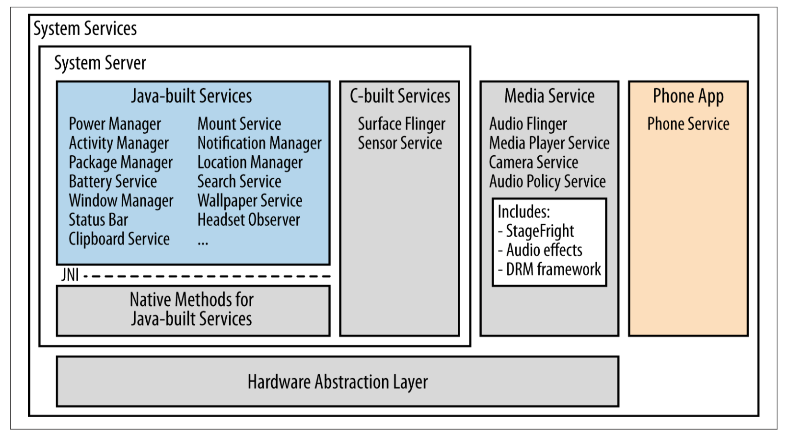
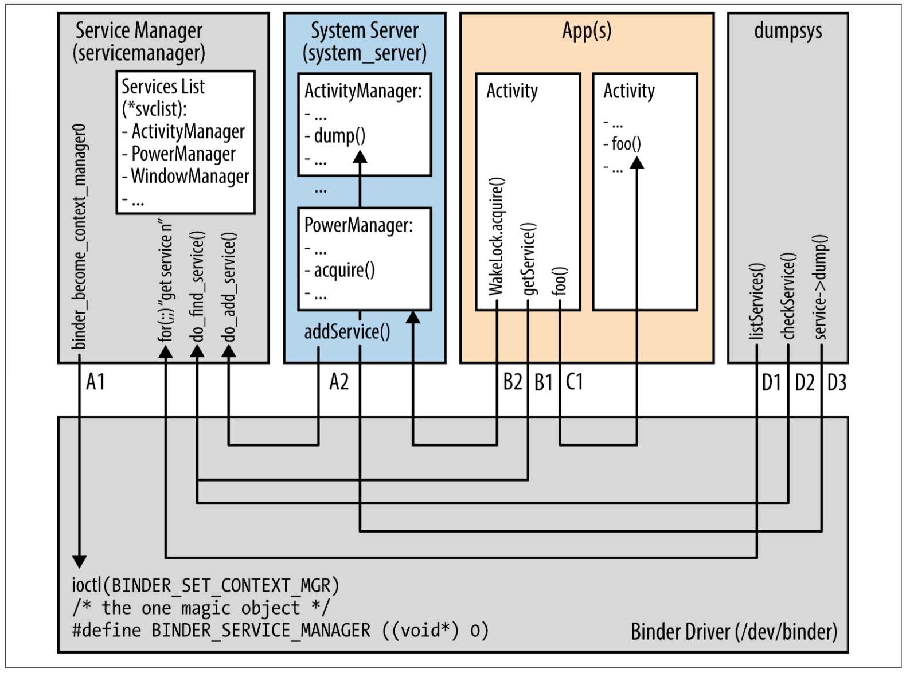

[toc]

## 系统服务

有大约50到70个系统服务。这些服务一起构成了Linux之上的一个面向对象的操作系统，which is exactly what Binder—the mechanism on which all system services are built—was intended for. 本地用户空间设计用于Android系统服务的支持环境。

下表列出了各个系统服务。最重要的是 **System Server**，它的组件都运行在同一个进程，**system_server**；由多个Java编写的服务和两个C编写的服务构成。
另一组系统服务属于**Media Service**，以**mediaserver**进程运行。这些服务都是C/CPP编码的，包含媒体相关的组件。Finally, the Phone application houses the Phone service separately from the rest. 从4.0开始，**Surface Flinger**已经成为了一个独立的进程。

Figure 2-4


注意名词。**System Server**和**Media Service**本身都不是系统服务，它们是系统服务运行的进程。

Note that despite there being only a handful of processes to house the entirety of the Android’s system services, they all appear to operate independently to anyone connecting to their services through Binder. Here’s the output of the `service` utility on an Android 2.3:

	# service list
    Found 50 services:
    0 phone: [com.android.internal.telephony.ITelephony]
    1 iphonesubinfo: [com.android.internal.telephony.IPhoneSubInfo]
    2 simphonebook: [com.android.internal.telephony.IIccPhoneBook]
    3 isms: [com.android.internal.telephony.ISms]
    4 diskstats: []
    5 appwidget: [com.android.internal.appwidget.IAppWidgetService]
    6 backup: [android.app.backup.IBackupManager]
    7 uimode: [android.app.IUiModeManager]
    8 usb: [android.hardware.usb.IUsbManager]
    9 audio: [android.media.IAudioService]
    10 wallpaper: [android.app.IWallpaperManager]
    11 dropbox: [com.android.internal.os.IDropBoxManagerService]
    12 search: [android.app.ISearchManager]
    13 location: [android.location.ILocationManager]
    14 devicestoragemonitor: []
    15 notification: [android.app.INotificationManager]
    16 mount: [IMountService]
    17 accessibility: [android.view.accessibility.IAccessibilityManager]
    18 throttle: [android.net.IThrottleManager]
    19 connectivity: [android.net.IConnectivityManager]
    20 wifi: [android.net.wifi.IWifiManager]
    21 network_management: [android.os.INetworkManagementService]
    22 netstat: [android.os.INetStatService]
    23 input_method: [com.android.internal.view.IInputMethodManager]
    24 clipboard: [android.text.IClipboard]
    25 statusbar: [com.android.internal.statusbar.IStatusBarService]
    26 device_policy: [android.app.admin.IDevicePolicyManager]
    27 window: [android.view.IWindowManager]
    28 alarm: [android.app.IAlarmManager]
    29 vibrator: [android.os.IVibratorService]
    30 hardware: [android.os.IHardwareService]
    31 battery: []
    32 content: [android.content.IContentService]
    33 account: [android.accounts.IAccountManager]
    34 permission: [android.os.IPermissionController]
    35 cpuinfo: []
    36 meminfo: []
    37 activity: [android.app.IActivityManager]
    38 package: [android.content.pm.IPackageManager]
    39 telephony.registry: [com.android.internal.telephony.ITelephonyRegistry]
    40 usagestats: [com.android.internal.app.IUsageStats]
    41 batteryinfo: [com.android.internal.app.IBatteryStats]
    42 power: [android.os.IPowerManager]
    43 entropy: []
    44 sensorservice: [android.gui.SensorServer]
    45 SurfaceFlinger: [android.ui.ISurfaceComposer]
    46 media.audio_policy: [android.media.IAudioPolicyService]
    47 media.camera: [android.hardware.ICameraService]
    48 media.player: [android.media.IMediaPlayerService]
    49 media.audio_flinger: [android.media.IAudioFlinger]

Here’s the same output on a 4.2:

	root@android:/ # service list
    Found 68 services:
    0 phone: [com.android.internal.telephony.ITelephony]
    1 iphonesubinfo: [com.android.internal.telephony.IPhoneSubInfo]
    2 simphonebook: [com.android.internal.telephony.IIccPhoneBook]
    3 isms: [com.android.internal.telephony.ISms]
    4 dreams: [android.service.dreams.IDreamManager]
    5 commontime_management: []
    6 samplingprofiler: []
    7 diskstats: []
    8 appwidget: [com.android.internal.appwidget.IAppWidgetService]
    9 backup: [android.app.backup.IBackupManager]
    10 uimode: [android.app.IUiModeManager]
    11 serial: [android.hardware.ISerialManager]
    12 usb: [android.hardware.usb.IUsbManager]
    13 audio: [android.media.IAudioService]
    14 wallpaper: [android.app.IWallpaperManager]
    15 dropbox: [com.android.internal.os.IDropBoxManagerService]
    16 search: [android.app.ISearchManager]
    17 country_detector: [android.location.ICountryDetector]
    18 location: [android.location.ILocationManager]
    19 devicestoragemonitor: []
    20 notification: [android.app.INotificationManager]
    21 updatelock: [android.os.IUpdateLock]
    22 throttle: [android.net.IThrottleManager]
    23 servicediscovery: [android.net.nsd.INsdManager]
    24 connectivity: [android.net.IConnectivityManager]
    25 wifi: [android.net.wifi.IWifiManager]
    26 wifip2p: [android.net.wifi.p2p.IWifiP2pManager]
    27 netpolicy: [android.net.INetworkPolicyManager]
    28 netstats: [android.net.INetworkStatsService]
    29 textservices: [com.android.internal.textservice.ITextServicesManager]
    30 network_management: [android.os.INetworkManagementService]
    31 clipboard: [android.content.IClipboard]
    32 statusbar: [com.android.internal.statusbar.IStatusBarService]
    33 device_policy: [android.app.admin.IDevicePolicyManager]
    34 lock_settings: [com.android.internal.widget.ILockSettings]
    35 mount: [IMountService]
    36 accessibility: [android.view.accessibility.IAccessibilityManager]
    37 input_method: [com.android.internal.view.IInputMethodManager]
    38 input: [android.hardware.input.IInputManager]
    39 window: [android.view.IWindowManager]
    40 alarm: [android.app.IAlarmManager]
    41 vibrator: [android.os.IVibratorService]
    42 battery: []
    43 hardware: [android.os.IHardwareService]
    44 content: [android.content.IContentService]
    45 account: [android.accounts.IAccountManager]
    46 user: [android.os.IUserManager]
    47 permission: [android.os.IPermissionController]
    48 cpuinfo: []
    49 dbinfo: []
    50 gfxinfo: []
    51 meminfo: []
    52 activity: [android.app.IActivityManager]
    53 package: [android.content.pm.IPackageManager]
    54 scheduling_policy: [android.os.ISchedulingPolicyService]
    55 telephony.registry: [com.android.internal.telephony.ITelephonyRegistry]
    56 display: [android.hardware.display.IDisplayManager]
    57 usagestats: [com.android.internal.app.IUsageStats]
    58 batteryinfo: [com.android.internal.app.IBatteryStats]
    59 power: [android.os.IPowerManager]
    60 entropy: []
    61 sensorservice: [android.gui.SensorServer]
    62 media.audio_policy: [android.media.IAudioPolicyService]
    63 media.camera: [android.hardware.ICameraService]
    64 media.player: [android.media.IMediaPlayerService]
    65 media.audio_flinger: [android.media.IAudioFlinger]
    66 drm.drmManager: [drm.IDrmManagerService]
    67 SurfaceFlinger: [android.ui.ISurfaceComposer]

不幸的是并没有什么文档描述这些服务，你得看源码了解。

---

**反向工程**

Fully understanding the internals of Android’s system services is like trying to swallow a whale. In 2.3 there were about 85,000 lines of Java code in the System Server alone, spread across 100 different files. And that didn’t count any system service code written in C/C++. To add insult to injury, so to speak, the comments are few and far between and the design documents nonexistent. Arm yourself with a good dose of patience if you want to dig further here.

One trick is to create a new Java project in Eclipse and import the System Server’s code into that project. This won’t compile in any way, but it’ll allow you to benefit from Eclipse’s Java browsing capabilities in trying to understand the code. For instance, you can open a single Java file, right-click the source browsing scrollbar area, and select Folding → Collapse All. This will essentially collapse all methods into a single line next to a plus sign (+) and will allow you to see the trees (the method names lined up one after another) instead of the leaves (the actual content of each method.) You’ll very much still be in a forest, though.

---

#### 2.7.1 Service Manager 和 Binder 交互

As I explained earlier, the Binder mechanism used as system services’ underlying fabric enables object-oriented RPC/IPC. For a process in the system to invoke a system service through Binder, though, it must first have a handle to it. For instance, Binder will enable an app developer to request a wakelock from the Power Manager by invoking the `acquire()` method of its `WakeLock` nested class. Before that call can be made, though, the developer must first get a handle to the Power Manager service. As we’ll see in the next section, the app development API actually hides the details of how it gets this handle in an abstraction to the developer, but under the hood all system service handle lookups are done through the Service Manager, as illustrated in Figure 2-5.

Figure 2-5. Service Manager and Binder interaction


Service Manager可以看做是系统中所有服务的黄页。若服务未向Service Manager注册，则它对系统其他部分是不可见的。Service Manager由init启动，先于其他所有服务。然后，它打开`/dev/binder`，利用一个特殊的`ioctl()`调用，将自己作为Binder的Context Manager (A1 in Figure 2-5)。Thereafter, any process in the system that attempts to communicate with Binder ID 0 (a.k.a. the “magic” Binder or “magic object” in various parts of the code) is actually communicating **through Binder** to the Service Manager.

例如当System Server启动时，它将自己实例化的所有服务都注册到Service Manager (A2)。后续当一个应用打算与一个系统服务交互时，应用先向Service Manager申请服务的句柄，然后调用服务的方法。In contrast, a call to a service component running within an app goes directly through Binder (C1) and is not looked up through the Service Manager.

The Service Manager is also used in a special way by a number of command-line utilities such as the **dumpsys** utility, which allows you to dump the status of a single or all system services. To get the list of all services, dumpsys loops around to get every system service (D1), requesting the nth plus one at every iteration until there aren’t any more. To get each service, dumpsys just asks the Service Manager to locate that specific one (D2). With a service handle in hand, dumpsys invokes that service’s dump() function to dump its status (D3) and displays that on the terminal.

#### 2.7.2 调用服务

上述内容实际对开发者是透明的，例如：

```java
PowerManager pm = (PowerManager) getSystemService(POWER_SERVICE);
PowerManager.WakeLock wakeLock =
	pm.newWakeLock(PowerManager.FULL_WAKE_LOCK, "myPreciousWakeLock");
wakeLock.acquire(100);
```
#### 2.7.3 系统服务的例子：Activity Manager

在2.3中Activity Manager的源码跨了30个文件2万多行代码。它负责启动新组建，如活动或或服务，along with the fetching of Content Providers and intent broadcasting. ANR (Application Not Responding)对话框也是由它控制的。It’s also involved in the maintenance of OOM adjustments used by the in-kernel low-memory handler, permissions, task management, etc.

例如，当用户点击了主屏上的应用，Launcher 会通过 Binder 调用 Activity Manager 服务的 `startActivity()` 方法。服务会接着调用 `startViaZygote()` 方法，打开一个到 Zygote 的socket，让其启动活动。
