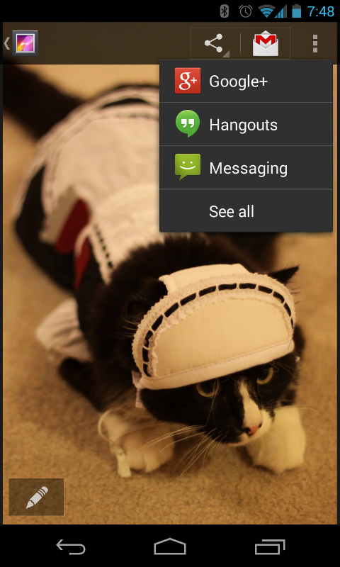

[toc]

http://developer.android.com/guide/topics/ui/actionbar.html

## 功能条（Action bar）

功能条（Action bar）有三大功能：提示用户当前在哪，提供用户功能入口，提供导航、视图切换功能（Tab或下拉列表）。


Figure 1. An action bar that includes the [1] app icon, [2] two action items, and [3] action overflow.

Action Bar提供以下功能：

参见[Action Bar设计指导](http://developer.android.com/design/patterns/actionbar.html)。

ActionBar APIs是Android 3.0 (API level 11)添加的，可以通过支持库可以兼容到Android 2.1 (API level 7)。本文档使用支持库做介绍。

### 添加Action Bar

创建活动，继承 [ActionBarActivity](http://developer.android.com/reference/android/support/v7/app/ActionBarActivity.html)。

使用（或扩展）某个 [Theme.AppCompat](http://developer.android.com/reference/android/support/v7/appcompat/R.style.html#Theme_AppCompat) 主题。例如：

```xml
	<activity android:theme="@style/Theme.AppCompat.Light" ... >
```

> **On API level 11 or higher**  任何使用 [Theme.Holo](http://developer.android.com/reference/android/R.style.html#Theme_Holo) 主题的Activity都带Action Bar。如果`targetSdkVersion`或`minSdkVersion`大于11，Theme.Holo是默认主题。如果不想要Action Bar，设置主题为 [Theme.Holo.NoActionBar](http://developer.android.com/reference/android/R.style.html#Theme_Holo_NoActionBar)。

### 移除Action Bar

在运行时可以调用`hide()`隐藏Action Bar。调用`show()`可以再让Action Bar回来。

```java
	ActionBar actionBar = getSupportActionBar();
	actionBar.hide();
```

> **On API level 11 or higher** Get the ActionBar with the `getActionBar()` method.

隐藏或移除Action Bar将导致活动重新布局。如果活动需要经常显示、隐藏Action Bar，考虑使用遮盖（overlay）模式。遮盖模式下，Action Bar在Activity布局之上，占据顶部空。于是隐藏显示Action Bar不影响活动布局。要启用遮盖模式，为活动自定义一个主题，设置` windowActionBarOverlay`为true。

### 不使用icon，使用logo

在Action Bar上默认使用应用图标（`<application>`或`<activity>`元素的`icon`特性）。但如果指定了`logo`特性，Action Bar将使用logo。

### 添加Action项

The action bar provides users access to the most important action items **relating to the app's current context**. 直接显示在action bar上的图标或文字称为action按钮。不重要的或放不下的隐藏在action overflow。按下overflow按钮可以显示overflow。


Figure 2. Action bar with three action buttons and the overflow button.

启动活动时，系统调用活动的`onCreateOptionsMenu()`，充气Menu，定义action items。

res/menu/main_activity_actions.xml

```xml
	<menu xmlns:android="http://schemas.android.com/apk/res/android" >
	    <item android:id="@+id/action_search"
	          android:icon="@drawable/ic_action_search"
	          android:title="@string/action_search"/>
	    <item android:id="@+id/action_compose"
	          android:icon="@drawable/ic_action_compose"
	          android:title="@string/action_compose" />
	</menu>
```
```java
	@Override
	public boolean onCreateOptionsMenu(Menu menu) {
	    // Inflate the menu items for use in the action bar
	    MenuInflater inflater = getMenuInflater();
	    inflater.inflate(R.menu.main_activity_actions, menu);
	    return super.onCreateOptionsMenu(menu);
	}
```

要菜单项直接显示在Action Bar上，设置特性`showAsAction="ifRoom"`：

	<menu xmlns:android="http://schemas.android.com/apk/res/android"
	      xmlns:yourapp="http://schemas.android.com/apk/res-auto" >
	    <item android:id="@+id/action_search"
	          android:icon="@drawable/ic_action_search"
	          android:title="@string/action_search"
	          yourapp:showAsAction="ifRoom"  />
	    ...
	</menu>

但如果没有足够空间，菜单项将进入action overflow。

> **使用支持库中的XML特性** 注意到`showAsAction`特性使用的命名空间。当XML特性来自支持库时，需要使用自定义命名空间。因为老设备的Android框架没有该特性。

若同时定义了`title`和`icon`特性，默认，Action项只会显示图标。如果要显示标题文本：

```xml
	<item yourapp:showAsAction="ifRoom|withText" ... />
```

> "withText"仅是一个提示。尽可能显示文本。但如果控件不够，又有图标可用则可能不显示文本。

即使多数时候不显示，还是要定义title。如果Action Item隐藏到了Overflow中，**则只会显示文本**。如果action item只显示了它的图标，用户可以长按此项，出现一个工具提示显式它的action title。

图标是可选的，但是推荐的。For icon design recommendations, see the [Iconography](http://developer.android.com/design/style/iconography.html#action-bar) design guide. 可以从[这](http://developer.android.com/design/downloads/index.html)下载标准图标（如搜索）。

可以使用"always"令一项菜单总是显示做action button。但不应该强制一项显示在action bar上。在窄屏上可能有布局问题。最好使用"ifRoom"。必须使用"always"的情况，包括菜单项包含action view，于是不能收起，必须总是显式出来。

### 处理点击

按下一个Action，系统调用活动的`onOptionsItemSelected()`方法。传入选中的`MenuItem`。识别此项可以调用`getItemId()`，返回菜单项的`android:id`。

```java
	@Override
	public boolean onOptionsItemSelected(MenuItem item) {
	    // Handle presses on the action bar items
	    switch (item.getItemId()) {
	        case R.id.action_search:
	            openSearch();
	            return true;
	        case R.id.action_compose:
	            composeMessage();
	            return true;
	        default:
	            return super.onOptionsItemSelected(item);
	    }
	}
```

> 注意：如果从Fragment充气菜单项（通过Fragment的`onCreateOptionsMenu()`，系统调用Fragment的`onOptionsItemSelected()`。但活动有权利先处理事件，因此系统先调用活动的`onOptionsItemSelected()`，再调用fragment的。To ensure that any fragments in the activity also have a chance to handle the callback, always pass the call to the superclass as the default behavior instead of returning false when you do not handle the item.

### 使用分离的功能条

当活动运行在窄屏上时，分离的功能条在屏幕底部显示另一个条，在其中显示所有的功能性（Action Item）。

使用支持库时，若想启用分离的功能条，需要做两件事：

1. 在每个`<activity>`或`<application>`上添加`uiOptions="splitActionBarWhenNarrow"`。This attribute is understood only by API level 14 and higher (it is ignored by older versions).
1. 要支持老版本，add a `<meta-data>` element as a child of each `<activity>` element that declares the same value for `android.support.UI_OPTIONS`.

例子：

```xml
	<manifest ...>
	    <activity uiOptions="splitActionBarWhenNarrow" ... >
	        <meta-data android:name="android.support.UI_OPTIONS"
	                   android:value="splitActionBarWhenNarrow" />
	    </activity>
	</manifest>
```

Using split action bar also allows [navigation tabs](http://developer.android.com/guide/topics/ui/actionbar.html#Tabs) to collapse into the main action bar if you remove the icon and title (as shown on the right in figure 3). To create this effect, disable the action bar icon and title with `setDisplayShowHomeEnabled(false)` and `setDisplayShowTitleEnabled(false)`.


Figure 3. Mock-ups showing an action bar with tabs (left), then with split action bar (middle); and with the app icon and title disabled (right).

### App按钮用作向上导航

让App图标作为向上按钮，允许用户在屏幕层级关系之间导航。例如，屏A显示列表，屏B显示列表项。则屏B的向上按钮应返回屏A。

> Note: 向上导航与向后不同。向后是按屏幕历史，屏幕之间的关系是临时建立的。

要启动App图标做向上按钮，使用`setDisplayHomeAsUpEnabled()`。例如：

```java
	@Override
	protected void onCreate(Bundle savedInstanceState) {
	    super.onCreate(savedInstanceState);
	    setContentView(R.layout.activity_details);

	    ActionBar actionBar = getSupportActionBar();
	    actionBar.setDisplayHomeAsUpEnabled(true);
	    ...
	}
```

还需要指定上级活动是哪个。有两种方式：

1、在manifest中指定父活动。如果父活动是固定的，这是最好的方式。从Android 4.1 (API level 16)，利用`<activity>`的`parentActivityName`特性声明父Activity。要使用支持库，利用`<meta-data>`：

```xml
	<application ... >
	    ...
	    <!-- The main/home activity (has no parent activity) -->
	    <activity
	        android:name="com.example.myfirstapp.MainActivity" ...>
	        ...
	    </activity>
	    <!-- A child of the main activity -->
	    <activity
	        android:name="com.example.myfirstapp.DisplayMessageActivity"
	        android:label="@string/title_activity_display_message"
	        android:parentActivityName="com.example.myfirstapp.MainActivity" >
	        <!-- Parent activity meta-data to support API level 7+ -->
	        <meta-data
	            android:name="android.support.PARENT_ACTIVITY"
	            android:value="com.example.myfirstapp.MainActivity" />
	    </activity>
	</application>
```

2、覆盖活动的`getSupportParentActivityIntent()`和`onCreateSupportNavigateUpTaskStack()`方法。当父活动是动态的。The system calls `getSupportParentActivityIntent()` when the user presses the Up button while navigating your app (within your app's own task). If the activity that should open upon up navigation differs depending on how the user arrived at the current location, then you should override this method to 返回一个启动父活动的Intent。

The system calls `onCreateSupportNavigateUpTaskStack()` for your activity when the user presses the Up button while your activity is running in a task that does not belong to your app. Thus, you must use the TaskStackBuilder passed to this method to construct the appropriate back stack that should be synthesized when the user navigates up.

Even if you override `getSupportParentActivityIntent()` to specify up navigation as the user navigates your app, you can avoid the need to implement `onCreateSupportNavigateUpTaskStack()` by declaring "**default**" parent activities in the manifest file as shown above. Then the default implementation of `onCreateSupportNavigateUpTaskStack()` will synthesize a back stack based on the parent activities declared in the manifest.

> 注意：如果你的App层级是通过一些列Fragment构建的，而不是一系列活动。则上面两个方法都不会起作用。要在Fragment之间做向上导航，应该覆盖`onSupportNavigateUp()`方法，进行Fragment转场。例如调用`popBackStack()`。

For more information about implementing Up navigation, read [Providing Up Navigation](http://developer.android.com/training/implementing-navigation/ancestral.html).

### 添加功能视图（Action View）

功能视图是显示在功能条上的控件（widget）。功能视图提供快速访问。例如，搜索功能，可以签入一个`SearchView`控件到功能条。


声明功能视图，可以通过`actionLayout`（指定一个布局资源）或`actionViewClass`（指定一个Widget类）特性。例如，指定一个`SearchView`类：

```xml
	<?xml version="1.0" encoding="utf-8"?>
	<menu xmlns:android="http://schemas.android.com/apk/res/android"
	      xmlns:yourapp="http://schemas.android.com/apk/res-auto" >
	    <item android:id="@+id/action_search"
	          android:title="@string/action_search"
	          android:icon="@drawable/ic_action_search"
	          yourapp:showAsAction="ifRoom|collapseActionView"
	          yourapp:actionViewClass="android.support.v7.widget.SearchView" />
	</menu>
```

注意到`showAsAction`特性的值包含`collapseActionView`。它是可选的，表示功能视图应该收起到一个按钮中。

若要配置功能视图（如添加事件监听器），可以在`onCreateOptionsMenu()`回调中做。可以利用静态方法`MenuItemCompat.getActionView()`获取功能视图，传入相应的`MenuItem`。例如：

```java
	@Override
	public boolean onCreateOptionsMenu(Menu menu) {
	    getMenuInflater().inflate(R.menu.main_activity_actions, menu);
	    MenuItem searchItem = menu.findItem(R.id.action_search);
	    SearchView searchView = (SearchView) MenuItemCompat.getActionView(searchItem);
	    // Configure the search info and add any event listeners
	    ...
	    return super.onCreateOptionsMenu(menu);
	}
```

> On API level 11 or higher
Get the action view by calling getActionView() on the corresponding MenuItem: `menu.findItem(R.id.action_search).getActionView()`

For more information about using the search widget, see Creating a [Search Interface](http://developer.android.com/guide/topics/search/search-dialog.html).

### 处理收起的功能视图

为节省功能条控件，可以将功能视图收起成一个功能按钮。收起后，这个功能甚至可能被放入action overflow。但当用户选择它后，功能视图仍能显式在功能条上。要令功能视图收起，令`showAsAction`特性包含`collapseActionView`。

在`onOptionsItemSelected()`中，不用返回`true`，这表示由你来处理事件，会导致功能视图不能展开——放着让系统去处理吧。

当用户按下向后或向上按钮后，功能视图会被收起。

If you need to update your activity based on the visibility of your action view, you can receive callbacks when the action is expanded and collapsed by defining an `OnActionExpandListener` and passing it to `setOnActionExpandListener()`. For example:

```java
	@Override
	public boolean onCreateOptionsMenu(Menu menu) {
	    getMenuInflater().inflate(R.menu.options, menu);
	    MenuItem menuItem = menu.findItem(R.id.actionItem);
	    ...

	    // When using the support library, the setOnActionExpandListener() method is
	    // static and accepts the MenuItem object as an argument
	    MenuItemCompat.setOnActionExpandListener(menuItem, new OnActionExpandListener() {
	        @Override
	        public boolean onMenuItemActionCollapse(MenuItem item) {
	            // Do something when collapsed
	            return true;  // Return true to collapse action view
	        }
	        @Override
	        public boolean onMenuItemActionExpand(MenuItem item) {
	            // Do something when expanded
	            return true;  // Return true to expand action view
	        }
	    });
	}
```

### Adding an Action Provider

与功能视图类似，action provider将一个功能按钮替换成自定义的布局。但与功能视图不同的是action provider控制功能的所有行为。按下action provider时可以显式一个子菜单。

要声明一个action provider，菜单`<item>`的`actionViewClass`特性指向一个全限的类名。

要构建自己的action provider，继承`ActionProvider`类。Android提供一些内建的action providers，如`ShareActionProvider`。



Because each `ActionProvider` class defines its own action behaviors, you don't need to listen for the action in the `onOptionsItemSelected()` method. If necessary though, you can still listen for the click event in the `onOptionsItemSelected()` method in case you need to simultaneously perform another action. But be sure to return `false` so that the the action provider still receives the `onPerformDefaultAction()` callback to perform its intended action.

如果action provider提供子菜单，当用户打开菜单或选择子菜单时，活动不会收到`onOptionsItemSelected()`。

### 使用`ShareActionProvider`

To add a "share" action with `ShareActionProvider`, define the `actionProviderClass` for an `<item>` tag with the `ShareActionProvider` class. For example:

```xml
	<?xml version="1.0" encoding="utf-8"?>
	<menu xmlns:android="http://schemas.android.com/apk/res/android"
	      xmlns:yourapp="http://schemas.android.com/apk/res-auto" >
	    <item android:id="@+id/action_share"
	          android:title="@string/share"
	          yourapp:showAsAction="ifRoom"
	          yourapp:actionProviderClass="android.support.v7.widget.ShareActionProvider"
	          />
	    ...
	</menu>
```

Now the action provider takes control of the action item and handles both its appearance and behavior. But you must still provide a title for the item to be used when it appears in the action overflow.

The only thing left to do is define the Intent you want to use for sharing. To do so, edit your `onCreateOptionsMenu()` method to call `MenuItemCompat.getActionProvider()` and pass it the `MenuItem` holding the action provider. Then call `setShareIntent()` on the returned `ShareActionProvider` and pass it an `ACTION_SEND` intent with the appropriate content attached.

You should call setShareIntent() once during onCreateOptionsMenu() to initialize the share action, but because the user context might change, you must update the intent any time the shareable content changes by again calling setShareIntent().

For example:

```java
	private ShareActionProvider mShareActionProvider;

	@Override
	public boolean onCreateOptionsMenu(Menu menu) {
	    getMenuInflater().inflate(R.menu.main_activity_actions, menu);

	    // Set up ShareActionProvider's default share intent
	    MenuItem shareItem = menu.findItem(R.id.action_share);
	    mShareActionProvider = (ShareActionProvider)
	            MenuItemCompat.getActionProvider(shareItem);
	    mShareActionProvider.setShareIntent(getDefaultIntent());

	    return super.onCreateOptionsMenu(menu);
	}

	/** Defines a default (dummy) share intent to initialize the action provider.
	  * However, as soon as the actual content to be used in the intent
	  * is known or changes, you must update the share intent by again calling
	  * mShareActionProvider.setShareIntent()
	  */
	private Intent getDefaultIntent() {
	    Intent intent = new Intent(Intent.ACTION_SEND);
	    intent.setType("image/*");
	    return intent;
	}
```

The ShareActionProvider now handles all user interaction with the item and you do not need to handle click events from the onOptionsItemSelected() callback method.

By default, the ShareActionProvider retains a ranking for each share target based on how often the user selects each one. The share targets used more frequently appear at the top of the drop-down list and the target used most often appears directly in the action bar as the default share target. By default, the ranking information is saved in a private file with a name specified by `DEFAULT_SHARE_HISTORY_FILE_NAME`. If you use the ShareActionProvider or an extension of it for only one type of action, then you should continue to use this default history file and there's nothing you need to do. However, if you use ShareActionProvider or an extension of it for multiple actions with semantically different meanings, then each ShareActionProvider should specify its own history file in order to maintain its own history. To specify a different history file for the ShareActionProvider, call setShareHistoryFileName() and provide an XML file name (for example, "`custom_share_history.xml`").

### 定制action provider

Creating your own action provider allows you to re-use and manage dynamic action item behaviors in a self-contained module, rather than handle action item transformations and behaviors in your fragment or activity code.

要定制action provider，继承`ActionProvider`类，实现回调：

`ActionProvider()`：This constructor passes you the application Context, which you should save in a member field to use in the other callback methods.

`onCreateActionView(MenuItem)`：定义功能的视图。Use the Context acquired from the constructor to instantiate a LayoutInflater and inflate your action view layout from an XML resource, then hook up event listeners. For example:

```java
	public View onCreateActionView(MenuItem forItem) {
	    // Inflate the action view to be shown on the action bar.
	    LayoutInflater layoutInflater = LayoutInflater.from(mContext);
	    View view = layoutInflater.inflate(R.layout.action_provider, null);
	    ImageButton button = (ImageButton) view.findViewById(R.id.button);
	    button.setOnClickListener(new View.OnClickListener() {
	        @Override
	        public void onClick(View v) {
	            // Do something...
	        }
	    });
	    return view;
	}
```

`onPerformDefaultAction()`：The system calls this when the menu item is selected from the action overflow and the action provider should perform a default action for the menu item. 但如果action provider提供子菜单（通过`onPrepareSubMenu()`回调），则the submenu appears even when the action provider is placed in the action overflow. Thus, `onPerformDefaultAction()` is never called when there is a submenu.

> Note: An activity or a fragment that implements `onOptionsItemSelected()` can override the action provider's default behavior (unless it uses a submenu) by handling the item-selected event (and returning true), in which case, the system does not call `onPerformDefaultAction()`.

For an example extension of `ActionProvider`, see [ActionBarSettingsActionProviderActivity](http://developer.android.com/resources/samples/ApiDemos/src/com/example/android/apis/app/ActionBarSettingsActionProviderActivity.html).

### 导航Tabs


Figure 7. Action bar tabs on a wide screen.


Figure 8. Tabs on a narrow screen.

标签会根据屏幕宽度调整显示。In some cases, the Android system will instead show your tab items as a drop-down list to ensure the best fit in the action bar.

布局中必须有一个`ViewGroup`，用于放置与Tab关联的Fragment。Be sure the ViewGroup has a resource ID so you can reference it from your code and swap the tabs within it. Alternatively, if the tab content will fill the activity layout, then your activity doesn't need a layout at all (you don't even need to call `setContentView()`). Instead, you can place each fragment in the default root view, which you can refer to with the `android.R.id.content` ID.

Once you determine where the fragments appear in the layout, the basic procedure to add tabs is:

- 实现`ActionBar.TabListener`接口，处理事件，如用户按下某个标签。
- For each tab you want to add, instantiate an `ActionBar.Tab` and set the `ActionBar.TabListener` by calling `setTabListener()`. Also set the tab's title and with `setText()` (and optionally, an icon with setIcon()).
- Then add each tab to the action bar by calling `addTab()`.

Notice that the `ActionBar.TabListener` callback methods don't specify which fragment is associated with the tab, but merely which `ActionBar.Tab` was selected. You must define your own association between each `ActionBar.Tab` and the appropriate Fragment that it represents. There are several ways you can define the association, depending on your design.

For example, here's how you might implement the ActionBar.TabListener such that each tab uses its own instance of the listener:

```java
    public static class TabListener<T extends Fragment> implements ActionBar.TabListener {
        private Fragment mFragment;
        private final Activity mActivity;
        private final String mTag;
        private final Class<T> mClass;

        /** Constructor used each time a new tab is created.
          * @param activity  The host Activity, used to instantiate the fragment
          * @param tag  The identifier tag for the fragment
          * @param clz  The fragment's Class, used to instantiate the fragment
          */
        public TabListener(Activity activity, String tag, Class<T> clz) {
            mActivity = activity;
            mTag = tag;
            mClass = clz;
        }

        /* The following are each of the ActionBar.TabListener callbacks */

        public void onTabSelected(Tab tab, FragmentTransaction ft) {
            // Check if the fragment is already initialized
            if (mFragment == null) {
                // If not, instantiate and add it to the activity
                mFragment = Fragment.instantiate(mActivity, mClass.getName());
                ft.add(android.R.id.content, mFragment, mTag);
            } else {
                // If it exists, simply attach it in order to show it
                ft.attach(mFragment);
            }
        }

        public void onTabUnselected(Tab tab, FragmentTransaction ft) {
            if (mFragment != null) {
                // Detach the fragment, because another one is being attached
                ft.detach(mFragment);
            }
        }

        public void onTabReselected(Tab tab, FragmentTransaction ft) {
            // User selected the already selected tab. Usually do nothing.
        }
    }
```

> 注意，对于Fragment转场，不能调用`commit()`。系统会自己调用。否则会抛出异常。也不能将fragment transactions加入到后退栈。

In this example, the listener simply attaches (`attach()`) a fragment to the activity layout—or if not instantiated, creates the fragment and adds (`add()`) it to the layout (as a child of the android.R.id.content view group)—when the respective tab is selected, and detaches (`detach()`) it when the tab is unselected.

All that remains is to create each `ActionBar.Tab` and add it to the `ActionBar`. Additionally, you must call `setNavigationMode(NAVIGATION_MODE_TABS)` to make the tabs visible.

For example, the following code adds two tabs using the listener defined above:

```java
    @Override
    protected void onCreate(Bundle savedInstanceState) {
        super.onCreate(savedInstanceState);
        // 注意：未调用setContentView()，because we use the root
        // android.R.id.content as the container for each fragment

        // setup action bar for tabs
        ActionBar actionBar = getSupportActionBar();
        actionBar.setNavigationMode(ActionBar.NAVIGATION_MODE_TABS);
        actionBar.setDisplayShowTitleEnabled(false);

        Tab tab = actionBar.newTab()
        	.setText(R.string.artist)
            .setTabListener(new TabListener<ArtistFragment>(
            	this, "artist", ArtistFragment.class));
        actionBar.addTab(tab);

        tab = actionBar.newTab()
        	.setText(R.string.album)
        	.setTabListener(new TabListener<AlbumFragment>(
				this, "album", AlbumFragment.class));
        actionBar.addTab(tab);
    }
```

活动**停止**时，应该给就爱那个当前选中的标签页存到saved instance，以便后续恢复。可以利用`getSelectedNavigationIndex()`获取当前的选择。

> For information about saving the state of your fragment, see the [Fragments](http://developer.android.com/guide/components/fragments.html) API guide.

> Note: The above implementation for ActionBar.TabListener is one of several possible techniques. 另一个常用的技术是`ViewPager`管理Fragment，用户可以用滑动切换标签页。In this case, you simply tell the `ViewPager` the current tab position in the `onTabSelected()` callback. For more information, read [Creating Swipe Views with Tabs](http://developer.android.com/training/implementing-navigation/lateral.html).

### 添加下拉导航


另一种活动的导航模式是，功能条内建的下拉列表（称为"spinner"）。其用途，例如，通过自列表可以改变活动内内容的排序方式。

Using the drop-down list is useful when changing the content is important but not necessarily a frequent occurrence. In cases where switching the content is more frequent, 应该使用导航标签。

The basic procedure to enable drop-down navigation is:

1. Create a `SpinnerAdapter` that provides the list of selectable items for the drop-down and the layout to use when drawing each item in the list.
1. Implement `ActionBar.OnNavigationListener` to define the behavior that occurs when the user selects an item from the list.
1. During your activity's `onCreate()` method, enable the action bar's drop-down list by calling `setNavigationMode(NAVIGATION_MODE_LIST)`.
1. Set the callback for the drop-down list with `setListNavigationCallbacks()`. For example:

```java
	actionBar.setListNavigationCallbacks(mSpinnerAdapter, mNavigationCallback);
```

This method takes your `SpinnerAdapter` and `ActionBar.OnNavigationListener`.

This procedure is relatively short, but implementing the SpinnerAdapter and ActionBar.OnNavigationListener is where most of the work is done. There are many ways you can implement these to define the functionality for your drop-down navigation and implementing various types of SpinnerAdapter is beyond the scope of this document (you should refer to the SpinnerAdapter class reference for more information). However, below is an example for a SpinnerAdapter and ActionBar.OnNavigationListener to get you started (click the title to reveal the sample).

#### Example SpinnerAdapter and OnNavigationListener

SpinnerAdapter is an adapter that provides data for a spinner widget, such as the drop-down list in the action bar. SpinnerAdapter is an interface that you can implement, but Android includes some useful implementations that you can extend, such as ArrayAdapter and SimpleCursorAdapter. For example, here's an easy way to create a SpinnerAdapter by using ArrayAdapter implementation, which uses a string array as the data source:

SpinnerAdapter mSpinnerAdapter = ArrayAdapter.createFromResource(this,
        R.array.action_list, android.R.layout.simple_spinner_dropdown_item);
The createFromResource() method takes three parameters: the application Context, the resource ID for the string array, and the layout to use for each list item.

A string array defined in a resource looks like this:

<?xml version="1.0" encoding="utf-8"?>
<resources>
    <string-array name="action_list">
        <item>Mercury</item>
        <item>Venus</item>
        <item>Earth</item>
    </string-array>
</resources>
The ArrayAdapter returned by createFromResource() is complete and ready for you to pass it to setListNavigationCallbacks() (in step 4 from above). Before you do, though, you need to create the OnNavigationListener.

Your implementation of ActionBar.OnNavigationListener is where you handle fragment changes or other modifications to your activity when the user selects an item from the drop-down list. There's only one callback method to implement in the listener: onNavigationItemSelected().

The onNavigationItemSelected() method receives the position of the item in the list and a unique item ID provided by the SpinnerAdapter.

Here's an example that instantiates an anonymous implementation of OnNavigationListener, which inserts a Fragment into the layout container identified by R.id.fragment_container:

mOnNavigationListener = new OnNavigationListener() {
  // Get the same strings provided for the drop-down's ArrayAdapter
  String[] strings = getResources().getStringArray(R.array.action_list);

  @Override
  public boolean onNavigationItemSelected(int position, long itemId) {
    // Create new fragment from our own Fragment class
    ListContentFragment newFragment = new ListContentFragment();
    FragmentTransaction ft = getSupportFragmentManager().beginTransaction();

    // Replace whatever is in the fragment container with this fragment
    // and give the fragment a tag name equal to the string at the position
    // selected
    ft.replace(R.id.fragment_container, newFragment, strings[position]);

    // Apply changes
    ft.commit();
    return true;
  }
};
This instance of OnNavigationListener is complete and you can now call setListNavigationCallbacks() (in step 4), passing the ArrayAdapter and this OnNavigationListener.

In this example, when the user selects an item from the drop-down list, a fragment is added to the layout (replacing the current fragment in the R.id.fragment_container view). The fragment added is given a tag that uniquely identifies it, which is the same string used to identify the fragment in the drop-down list.

Here's a look at the ListContentFragment class that defines each fragment in this example:

public class ListContentFragment extends Fragment {
    private String mText;

    @Override
    public void onAttach(Activity activity) {
      // This is the first callback received; here we can set the text for
      // the fragment as defined by the tag specified during the fragment
      // transaction
      super.onAttach(activity);
      mText = getTag();
    }

    @Override
    public View onCreateView(LayoutInflater inflater, ViewGroup container,
            Bundle savedInstanceState) {
        // This is called to define the layout for the fragment;
        // we just create a TextView and set its text to be the fragment tag
        TextView text = new TextView(getActivity());
        text.setText(mText);
        return text;
    }
}

### 功能条样式

> 注意：九点图*在高度上要小于40dp，宽度上小于30dp。*

#### 一般外观

`actionBarStyle`

指定一个**样式**资源，定义功能条的多个样式属性。默认是`Widget.AppCompat.ActionBar`。应将此样式用作父样式。支持的样式包括：

- `background`：功能条背景，一个drawable资源。
- `backgroundStacked`：定义Tabs部分的背景。
- `backgroundSplit`：Defines a drawable resource for the split action bar.
- `actionButtonStyle`：Defines a style resource for action buttons. The default for this style for this is `Widget.AppCompat.ActionButton`, which is what you should use as the parent style.
- `actionOverflowButtonStyle`：Defines a style resource for overflow action items. The default for this style for this is `Widget.AppCompat.ActionButton.Overflow`, which is what you should use as the parent style.
- `displayOptions`：Defines one or more action bar display options, such as whether to use the app logo, show the activity title, or enable the Up action. See [displayOptions](http://developer.android.com/reference/android/R.attr.html#displayOptions) for all possible values.
- `divider`：Defines a drawable resource for the divider between action items.
- `titleTextStyle`：Defines a style resource for the action bar title. The default for this style for this is `TextAppearance.AppCompat.Widget.ActionBar.Title`, which is what you should use as the parent style.

`windowActionBarOverlay`

Declares whether the action bar should overlay the activity layout rather than offset the activity's layout position. This is false by default.

Normally, the action bar requires its own space on the screen and your activity layout fills in what's left over. When the action bar is in overlay mode, your activity layout uses all the available space and the system draws the action bar on top. Overlay mode can be useful if you want your content to keep a fixed size and position when the action bar is hidden and shown. You might also like to use it purely as a visual effect, because you can use a semi-transparent background for the action bar so the user can still see some of your activity layout behind the action bar.

> Note: The Holo theme families draw the action bar with a semi-transparent background by default. However, you can modify it with your own styles and the `DeviceDefault` theme on different devices might use an opaque background by default.

When overlay mode is enabled, your activity layout has no awareness of the action bar lying on top of it. So, you must be careful not to place any important information or UI components in the area overlaid by the action bar. If appropriate, you can refer to the platform's value for actionBarSize to determine the height of the action bar, by referencing it in your XML layout. For example:

```java
    <SomeView
        ...
        android:layout_marginTop="?android:attr/actionBarSize" />
```

You can also retrieve the action bar height at runtime with getHeight(). This reflects the height of the action bar at the time it's called, which might not include the stacked action bar (due to navigation tabs) if called during early activity lifecycle methods. To see how you can determine the total height at runtime, including the stacked action bar, see the TitlesFragment class in the [Honeycomb Gallery sample app](http://developer.android.com/resources/samples/HoneycombGallery/index.html).

#### Action items

`actionButtonStyle`：Defines a style resource for the action item buttons. The default for this style for this is `Widget.AppCompat.ActionButton`, which is what you should use as the parent style.

`actionBarItemBackground`：Defines a drawable resource for each action item's background. This should be a state-list drawable to indicate different selected states.

`itemBackground`：Defines a drawable resource for each action overflow item's background. This should be a state-list drawable to indicate different selected states.

`actionBarDivider`：Defines a drawable resource for the divider between action items.

`actionMenuTextColor`：Defines a color for text that appears in an action item.

`actionMenuTextAppearance`：Defines a style resource for text that appears in an action item.

`actionBarWidgetTheme`：Defines a theme resource for widgets that are inflated into the action bar as action views.

#### 导航tabs

- `actionBarTabStyle`：为单个导航Tab指定样式资源。默认是`Widget.AppCompat.ActionBar.TabView`，应该用它来做父样式。
- `actionBarTabBarStyle`：为整个导航Tab条定义样式资源。默认是`Widget.AppCompat.ActionBar.TabBar`，应该用它来做父样式。｛｛默认，没有额外的样式定义。｝｝
- `actionBarTabTextStyle`：为导航Tab中的文本定义样式资源。默认样式是`Widget.AppCompat.ActionBar.TabText`，应该用它来做父样式。

`actionBarTabStyle`控制（红色）和`actionBarTabBarStyle`控制（蓝色）区域的区别：


#### Drop-down lists

`actionDropDownStyle`：Defines a style for the drop-down navigation (such as the background and text styles). The default for this style for this is `Widget.AppCompat.Spinner.DropDown.ActionBar`, which is what you should use as the parent style.

#### 样例主题

Here's an example that defines a custom theme for an activity, `CustomActivityTheme`, that includes several styles to customize the action bar.

Notice that there are two version for each action bar style property. The first one includes the `android:` prefix on the property name to support API levels 11 and higher that include these properties in the framework. The second version does not include the `android:` prefix and is for older versions of the platform, on which the system uses the style property from the support library. The effect for each is the same.

```xml
    <?xml version="1.0" encoding="utf-8"?>
    <resources>
        <!-- the theme applied to the application or activity -->
        <style name="CustomActionBarTheme"
               parent="@style/Theme.AppCompat.Light">
            <item name="android:actionBarStyle">@style/MyActionBar</item>
            <item name="android:actionBarTabTextStyle">@style/TabTextStyle</item>
            <item name="android:actionMenuTextColor">@color/actionbar_text</item>

            <!-- Support library compatibility -->
            <item name="actionBarStyle">@style/MyActionBar</item>
            <item name="actionBarTabTextStyle">@style/TabTextStyle</item>
            <item name="actionMenuTextColor">@color/actionbar_text</item>
        </style>

        <!-- general styles for the action bar -->
        <style name="MyActionBar"
               parent="@style/Widget.AppCompat.ActionBar">
            <item name="android:titleTextStyle">@style/TitleTextStyle</item>
            <item name="android:background">@drawable/actionbar_background</item>
            <item name="android:backgroundStacked">@drawable/actionbar_background</item>
            <item name="android:backgroundSplit">@drawable/actionbar_background</item>

            <!-- Support library compatibility -->
            <item name="titleTextStyle">@style/TitleTextStyle</item>
            <item name="background">@drawable/actionbar_background</item>
            <item name="backgroundStacked">@drawable/actionbar_background</item>
            <item name="backgroundSplit">@drawable/actionbar_background</item>
        </style>

        <!-- action bar title text -->
        <style name="TitleTextStyle"
               parent="@style/TextAppearance.AppCompat.Widget.ActionBar.Title">
            <item name="android:textColor">@color/actionbar_text</item>
        </style>

        <!-- action bar tab text -->
        <style name="TabTextStyle"
               parent="@style/Widget.AppCompat.ActionBar.TabText">
            <item name="android:textColor">@color/actionbar_text</item>
        </style>
    </resources>
```

> Caution: Be certain that each theme and style declares a parent theme in the `<style>` tag, from which it inherits all styles not explicitly declared by your theme. When modifying the action bar, using a parent theme is important so that you can simply override the action bar styles you want to change without re-implementing the styles you want to leave alone (such as text size or padding in action items).

#### 定义Tab的样式

参考：http://alwold.files.wordpress.com/2013/08/2013-08-27-20-16-46.png。

包括下部指示条的颜色，按下时的效果等。关键是指定`actionBarTabStyle`样式，把背景指定成一个根据状态变化的背景：

```xml
    <style name="FindMyTrain" parent="Theme.Sherlock">
        <item name="android:actionBarTabStyle">@style/FindMyTrain.ActionBar.Tab</item>
        <item name="actionBarTabStyle">@style/FindMyTrain.ActionBar.Tab</item>
    </style>

    <style name="FindMyTrain.ActionBar.Tab">
        <item name="android:background">@drawable/tab_bar_background</item>
    </style>
```

```xml
    <selector xmlns:android="http://schemas.android.com/apk/res/android">
      <item android:state_focused="false" android:state_selected="false" android:state_pressed="false" android:drawable="@color/transparent"/>
      <item android:state_focused="false" android:state_selected="true" android:state_pressed="false" android:drawable="@drawable/tab_bar_background_selected"/>
      <item android:state_selected="false" android:state_pressed="true" android:drawable="@color/tab_highlight"/>
      <item android:state_selected="true" android:state_pressed="true" android:drawable="@drawable/tab_bar_background_selected_pressed"/>
    </selector>
```

为了让指示条是位于标签下面的一个长条（而不是覆盖整个标签的高度）。使用了下面的技巧,h画一个矩形描边，并通过位移让其他三个边消失，只留下下边：

```xml
    <layer-list xmlns:android="http://schemas.android.com/apk/res/android">
        <item android:top="-5dp" android:left="-5dp" android:right="-5dp">
            <shape android:shape="rectangle">
                <stroke android:color="#ff4ba587" android:width="5dp"/>
            </shape>
        </item>
    </layer-list>
```


