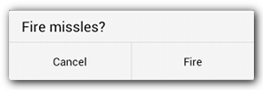
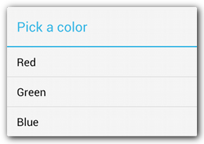
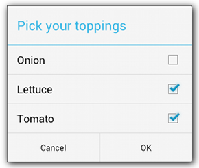
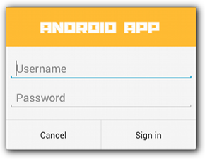

# 对话框

[toc]

对话框设计参见：http://developer.android.com/design/building-blocks/dialogs.html。

`Dialog`是所有对话框的基类。不要直接实例化`Dialog`，应该使用它的子类：

- `AlertDialog`：显示标题，至多三个按钮，一组可选择的项，或自定义布局。
- `DatePickerDialog`或`TimePickerDialog`：允许用户选择日期或时间。

> 避免使用`ProgressDialog`。`ProgressDialog`显示一个带进度条的对话框。但如果你想展示的是加载或无限进度，应该遵循[Progress & Activity](http://developer.android.com/design/building-blocks/progress.html)，使用`ProgressBar`。

上述类定义了对话框的样式和结构，但还需要一个`DialogFragment`作为对话框的容器。`DialogFragment`控制对话框的创建的显示。利用`DialogFragment`关联对话框，能确保它正确处理生命周期事件，如用户按下后退键或旋转屏幕。`DialogFragment`还可以将对话框嵌入一个更大的UI（正如普通的`Fragment`的作用）。

下面介绍如何结合使用`DialogFragment`和`AlertDialog`。关于日期事件选择，[参见Pickers](http://developer.android.com/guide/topics/ui/controls/pickers.html)。

> 支持库`android.support.v4.app.DialogFragment`和普通`android.app.DialogFragment`。

## 创建Dialog Fragment

继承`DialogFragment`，在`onCreateDialog()`回调中创建并返回`AlertDialog`。

```java
public class FireMissilesDialogFragment extends DialogFragment {
    @Override
    public Dialog onCreateDialog(Bundle savedInstanceState) {
        // 使用Builder类
        AlertDialog.Builder builder = new AlertDialog.Builder(getActivity());
        builder.setMessage(R.string.dialog_fire_missiles)
               .setPositiveButton(R.string.fire, new DialogInterface.OnClickListener() {
                   public void onClick(DialogInterface dialog, int id) {
                       // FIRE ZE MISSILES!
                   }
               })
               .setNegativeButton(R.string.cancel, new DialogInterface.OnClickListener() {
                   public void onClick(DialogInterface dialog, int id) {
                       // User cancelled the dialog
                   }
               });
        // Create the AlertDialog object and return it
        return builder.create();
    }
}
```

实例化并调用`show()`方法。效果如下：



根据对话框的复杂程度，可以实现`DialogFragment`的各种回调方法，包括Fragment所有基本的回调。


## 构建Alert Dialog

利用`AlertDialog`可以构建出多种不同的对话框。多数情况下使用这个类就够了。下面是对话框的三个区域：


- 标题：可选。
- 内容区：可以显示消息、列表或其他自定义布局。
- 功能按钮：按钮数量不应超过3个。

利用`AlertDialog.Builder`可以定制这三个区域。

```java
// 1. 实例化AlertDialog.Builder
AlertDialog.Builder builder = new AlertDialog.Builder(getActivity());

// 2. 链式调用一组set方法，设置对话框特征
builder.setMessage(R.string.dialog_message)
       .setTitle(R.string.dialog_title);

// 3. 利用create()创建对话框
AlertDialog dialog = builder.create();
```

### 添加按钮

```java
AlertDialog.Builder builder = new AlertDialog.Builder(getActivity());
// Add the buttons
builder.setPositiveButton(R.string.ok, new DialogInterface.OnClickListener() {
           public void onClick(DialogInterface dialog, int id) {
               // User clicked OK button
           }
       });
builder.setNegativeButton(R.string.cancel, new DialogInterface.OnClickListener() {
           public void onClick(DialogInterface dialog, int id) {
               // User cancelled the dialog
           }
       });
// Set other dialog properties
...

// Create the AlertDialog
AlertDialog dialog = builder.create();
```

三种按钮：

- Positive
- Negative
- Neutral：例如，"Remind me later."

一种类型的按钮只能在对话框中出现一次。


### 添加列表

AlertDialog API提供三种列表：

- 传统的单选列表
- 一个持久化的单选列表（radio buttons）
- 一个持久化的多选列表（checkboxes）

持久化的意思是，用户第二次打开对话框时，上一次的选择会被保留。

要创建下面风格的列表，使用`setItems()`方法：



```java
@Override
public Dialog onCreateDialog(Bundle savedInstanceState) {
    AlertDialog.Builder builder = new AlertDialog.Builder(getActivity());
    builder.setTitle(R.string.pick_color)
           .setItems(R.array.colors_array, new DialogInterface.OnClickListener() {
               public void onClick(DialogInterface dialog, int which) {
               // The 'which' argument contains the index position
               // of the selected item
           }
    });
    return builder.create();
}
```

由于列表显示在内容区，于是不同同时显示消息和列表。数组形式的列表项可以通过`setItems()`传入。还可以使用`setAdapter()`。This allows you to back the list with dynamic data (such as from a database) using a `ListAdapter`. If you choose to back your list with a `ListAdapter`, always use a `Loader` so that the content loads asynchronously. This is described further in [Building Layouts with an Adapter](http://developer.android.com/guide/topics/ui/declaring-layout.html#AdapterViews) and the [Loaders](http://developer.android.com/guide/components/loaders.html) guide.

默认，触摸一个列表项将隐藏对话框。除非你使用下面的persistent choice lists。



#### 添加persistent单选、多选列表

To add a list of multiple-choice items (checkboxes) or single-choice items (radio buttons), use the `setMultiChoiceItems()` or `setSingleChoiceItems()` methods, respectively.

```java
@Override
public Dialog onCreateDialog(Bundle savedInstanceState) {
    mSelectedItems = new ArrayList();  // Where we track the selected items
    AlertDialog.Builder builder = new AlertDialog.Builder(getActivity());
    builder.setTitle(R.string.pick_toppings)
    // Specify the list array, the items to be selected by default (null for none),
    // and the listener through which to receive callbacks when items are selected
           .setMultiChoiceItems(R.array.toppings, null,
                      new DialogInterface.OnMultiChoiceClickListener() {
               @Override
               public void onClick(DialogInterface dialog, int which,
                       boolean isChecked) {
                   if (isChecked) {
                       // If the user checked the item, add it to the selected items
                       mSelectedItems.add(which);
                   } else if (mSelectedItems.contains(which)) {
                       // Else, if the item is already in the array, remove it
                       mSelectedItems.remove(Integer.valueOf(which));
                   }
               }
           })
    // Set the action buttons
           .setPositiveButton(R.string.ok, new DialogInterface.OnClickListener() {
               @Override
               public void onClick(DialogInterface dialog, int id) {
                   // User clicked OK, so save the mSelectedItems results somewhere
                   // or return them to the component that opened the dialog
                   ...
               }
           })
           .setNegativeButton(R.string.cancel, new DialogInterface.OnClickListener() {
               @Override
               public void onClick(DialogInterface dialog, int id) {
                   ...
               }
           });

    return builder.create();
}
```

### 自定义布局

创建一个布局，调用`AlertDialog.Builder`的`setView()`方法。By default, the custom layout fills the dialog window, but you can still use `AlertDialog.Builder` methods to add buttons and a title.



```xml
	<LinearLayout xmlns:android="http://schemas.android.com/apk/res/android"
		android:orientation="vertical"
		android:layout_width="wrap_content"
		android:layout_height="wrap_content">
		<ImageView
			android:src="@drawable/header_logo"
			android:layout_width="match_parent"
			android:layout_height="64dp"
			android:scaleType="center"
			android:background="#FFFFBB33"
			android:contentDescription="@string/app_name" />
		<EditText
			android:id="@+id/username"
			android:inputType="textEmailAddress"
			android:layout_width="match_parent"
			android:layout_height="wrap_content"
			android:layout_marginTop="16dp"
			android:layout_marginLeft="4dp"
			android:layout_marginRight="4dp"
			android:layout_marginBottom="4dp"
			android:hint="@string/username" />
		<EditText
			android:id="@+id/password"
			android:inputType="textPassword"
			android:layout_width="match_parent"
			android:layout_height="wrap_content"
			android:layout_marginTop="4dp"
			android:layout_marginLeft="4dp"
			android:layout_marginRight="4dp"
			android:layout_marginBottom="16dp"
			android:fontFamily="sans-serif"
			android:hint="@string/password"/>
	</LinearLayout>
```

> Tip: By default, when you set an `EditText` element to use the "textPassword" input type, the font family is set to monospace, so you should change its font family to "sans-serif" so that both text fields use a matching font style.

要先将布局重启，再调用`setView()`。

```java
@Override
public Dialog onCreateDialog(Bundle savedInstanceState) {
    AlertDialog.Builder builder = new AlertDialog.Builder(getActivity());
    // Get the layout inflater
    LayoutInflater inflater = getActivity().getLayoutInflater();

    // Inflate and set the layout for the dialog
    // Pass null as the parent view because its going in the dialog layout
    builder.setView(inflater.inflate(R.layout.dialog_signin, null))
    // Add action buttons
           .setPositiveButton(R.string.signin, new DialogInterface.OnClickListener() {
               @Override
               public void onClick(DialogInterface dialog, int id) {
                   // sign in the user ...
               }
           })
           .setNegativeButton(R.string.cancel, new DialogInterface.OnClickListener() {
               public void onClick(DialogInterface dialog, int id) {
                   LoginDialogFragment.this.getDialog().cancel();
               }
           });
    return builder.create();
}
```

> 定制对话框的另一种方式是，将Activity显示成一个对话框：将Activity主题设置为`Theme.Holo.Dialog`：
```xml
	<activity android:theme="@android:style/Theme.Holo.Dialog" >
```

## 将事件传回对话框的宿主


定义一个接口，让宿主实现此接口。

```java
public class NoticeDialogFragment extends DialogFragment {

    /* 宿主Activity需要实现此接口。
     * Each method passes the DialogFragment in case the host needs to query it. */
    public interface NoticeDialogListener {
        public void onDialogPositiveClick(DialogFragment dialog);
        public void onDialogNegativeClick(DialogFragment dialog);
    }

    // Use this instance of the interface to deliver action events
    NoticeDialogListener mListener;

    // Override the Fragment.onAttach() method to instantiate the NoticeDialogListener
    @Override
    public void onAttach(Activity activity) {
        super.onAttach(activity);
        // Verify that the host activity implements the callback interface
        try {
            // Instantiate the NoticeDialogListener so we can send events to the host
            mListener = (NoticeDialogListener) activity;
        } catch (ClassCastException e) {
            // The activity doesn't implement the interface, throw exception
            throw new ClassCastException(activity.toString()
                    + " must implement NoticeDialogListener");
        }
    }
    ...
}
```

```java
public class MainActivity extends FragmentActivity
                          implements NoticeDialogFragment.NoticeDialogListener{
    ...

    public void showNoticeDialog() {
        // Create an instance of the dialog fragment and show it
        DialogFragment dialog = new NoticeDialogFragment();
        dialog.show(getSupportFragmentManager(), "NoticeDialogFragment");
    }

    // The dialog fragment receives a reference to this Activity through the
    // Fragment.onAttach() callback, which it uses to call the following methods
    // defined by the NoticeDialogFragment.NoticeDialogListener interface
    @Override
    public void onDialogPositiveClick(DialogFragment dialog) {
        // User touched the dialog's positive button
        ...
    }

    @Override
    public void onDialogNegativeClick(DialogFragment dialog) {
        // User touched the dialog's negative button
        ...
    }
}
```

```java
public class NoticeDialogFragment extends DialogFragment {
    ...

    @Override
    public Dialog onCreateDialog(Bundle savedInstanceState) {
        // Build the dialog and set up the button click handlers
        AlertDialog.Builder builder = new AlertDialog.Builder(getActivity());
        builder.setMessage(R.string.dialog_fire_missiles)
               .setPositiveButton(R.string.fire, new DialogInterface.OnClickListener() {
                   public void onClick(DialogInterface dialog, int id) {
                       // Send the positive button event back to the host activity
                       mListener.onDialogPositiveClick(NoticeDialogFragment.this);
                   }
               })
               .setNegativeButton(R.string.cancel, new DialogInterface.OnClickListener() {
                   public void onClick(DialogInterface dialog, int id) {
                       // Send the negative button event back to the host activity
                       mListener.onDialogNegativeClick(NoticeDialogFragment.this);
                   }
               });
        return builder.create();
    }
}
```

## 显示对话框

要显示对话框，创建`DialogFragment`的实例，调用`show()`。


```java
public void confirmFireMissiles() {
    DialogFragment newFragment = new FireMissilesDialogFragment();
    newFragment.show(getSupportFragmentManager(), "missiles");
}
```

## 全屏显示对话框；将对话框显示成嵌入的Fragment

此时，不能使用`AlertDialog.Builder`或其他`Dialog`对象构造对话框。如果想让`DialogFragment`被嵌入，必须在布局中定义对话框UI，在`onCreateView()`中加载布局。

Here's an example DialogFragment that can appear as either a dialog or an embeddable fragment (using a layout named `purchase_items.xml`):

```java
public class CustomDialogFragment extends DialogFragment {
    /** The system calls this to get the DialogFragment's layout, regardless
        of whether it's being displayed as a dialog or an embedded fragment. */
    @Override
    public View onCreateView(LayoutInflater inflater, ViewGroup container,
            Bundle savedInstanceState) {
        // Inflate the layout to use as dialog or embedded fragment
        return inflater.inflate(R.layout.purchase_items, container, false);
    }
  
    /** The system calls this only when creating the layout in a dialog. */
    @Override
    public Dialog onCreateDialog(Bundle savedInstanceState) {
        // The only reason you might override this method when using onCreateView() is
        // to modify any dialog characteristics. For example, the dialog includes a
        // title by default, but your custom layout might not need it. So here you can
        // remove the dialog title, but you must call the superclass to get the Dialog.
        Dialog dialog = super.onCreateDialog(savedInstanceState);
        dialog.requestWindowFeature(Window.FEATURE_NO_TITLE);
        return dialog;
    }
}
```

And here's some code that decides whether to show the fragment as a dialog or a fullscreen UI, based on the screen size:

```java
public void showDialog() {
    FragmentManager fragmentManager = getSupportFragmentManager();
    CustomDialogFragment newFragment = new CustomDialogFragment();

    if (mIsLargeLayout) {
        // The device is using a large layout, so show the fragment as a dialog
        newFragment.show(fragmentManager, "dialog");
    } else {
        // The device is smaller, so show the fragment fullscreen
        FragmentTransaction transaction = fragmentManager.beginTransaction();
        // For a little polish, specify a transition animation
        transaction.setTransition(FragmentTransaction.TRANSIT_FRAGMENT_OPEN);
        // To make it fullscreen, use the 'content' root view as the container
        // for the fragment, which is always the root view for the activity
        transaction.add(android.R.id.content, newFragment)
                   .addToBackStack(null).commit();
    }
}
```

In this example, the `mIsLargeLayout` boolean specifies whether the current device should use the app's large layout design (and thus show this fragment as a dialog, rather than fullscreen). The best way to set this kind of boolean is to declare a bool resource value with an alternative resource value for different screen sizes. For example, here are two versions of the bool resource for different screen sizes:

res/values/bools.xml
```xml
	<!-- Default boolean values -->
	<resources>
		<bool name="large_layout">false</bool>
	</resources>
```

res/values-large/bools.xml
```xml
	<!-- Large screen boolean values -->
	<resources>
		<bool name="large_layout">true</bool>
	</resources>
```

Then you can initialize the `mIsLargeLayout` value during the activity's `onCreate()` method:

```java
boolean mIsLargeLayout;

@Override
public void onCreate(Bundle savedInstanceState) {
    super.onCreate(savedInstanceState);
    setContentView(R.layout.activity_main);

    mIsLargeLayout = getResources().getBoolean(R.bool.large_layout);
}
```

### 将活动显示成一个对话框

如果你已经为小屏幕设计了一个Activity，现在想在大屏幕上显示，可以显示成对话框以提高体验。

To show an activity as a dialog only when on large screens, apply the `Theme.Holo.DialogWhenLarge` theme to the `<activity>` manifest element:

```xml
	<activity android:theme="@android:style/Theme.Holo.DialogWhenLarge" >
```

## 关闭对话框

When the user touches any of the action buttons created with an `AlertDialog.Builder`, the system dismisses the dialog for you.

The system also dismisses the dialog when the user touches an item in a dialog list, except when the list uses radio buttons or checkboxes. 可以通过`DialogFragment.dismiss()`手工关闭对话框。

In case you need to perform certain actions when the dialog goes away, you can implement the `onDismiss()` method in your `DialogFragment`.

You can also cancel a dialog. This is a special event that indicates the user explicitly left the dialog without completing the task. This occurs if the user presses the Back button, touches the screen outside the dialog area, or if you explicitly call `cancel()` on the Dialog (such as in response to a "Cancel" button in the dialog).

As shown in the example above, you can respond to the cancel event by implementing `onCancel()` in your `DialogFragment` class.

> Note: The system calls `onDismiss()` upon each event that invokes the `onCancel()` callback. However, if you call `Dialog.dismiss()` or `DialogFragment.dismiss()`, the system calls `onDismiss()` but not `onCancel()`. So you should generally call `dismiss()` when the user presses the positive button in your dialog in order to remove the dialog from view.