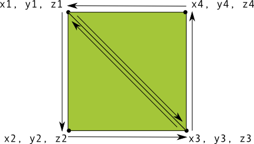

# （未）Displaying Graphics with OpenGL ES

Demo下载： http://developer.android.com/shareables/training/OpenGLES.zip

The example code in this class uses the OpenGL ES 2.0 APIs, which is the recommended API version to use with current Android devices.

> 注意：不要混 用OpenGL ES 1.x API 和 OpenGL ES 2.0。二者是不兼容的！

## OpenGL ES 环境

容纳 OpenGL ES 图形的容器，可以实现`GLSurfaceView`和`GLSurfaceView.Renderer`。`GLSurfaceView`是OpenGL图形的容器，`GLSurfaceView.Renderer`控制在View上绘制什么。

`GLSurfaceView`只是将OpenGL ES图形混入你的应用的一种方式。适于全屏或接近全屏的View。如果只是想将OpenGL ES图形混入布局中的一部分，考虑[TextureView](http://developer.android.com/reference/android/view/TextureView.html)。还可能利用`SurfaceView`构建一个OpenGL ES的View，但这需要写很多额外的代码。

本课讨论`GLSurfaceView`和`GLSurfaceView.Renderer`。

### 在MANIFEST中声明使用OpenGL ES

应用若要使用 OpenGL ES 2.0 API，必须声明：

	<uses-feature android:glEsVersion="0x00020000" android:required="true" />

If your application uses *texture compression*, you must also declare which compression formats you support so that devices that do not support theses formats do not try to run your application:

	<supports-gl-texture android:name="GL_OES_compressed_ETC1_RGB8_texture" />
	<supports-gl-texture android:name="GL_OES_compressed_paletted_texture" />

For more information about texture compression formats, see the [OpenGL developer guide](http://developer.android.com/guide/topics/graphics/opengl.html#textures).

### 创建一个活动

让活动使用`GLSurfaceView`。

The following code example shows a minimal implementation of an activity that uses a GLSurfaceView as its primary view:

	public class OpenGLES20Activity extends Activity {
	
	    private GLSurfaceView mGLView;
	
	    @Override
	    public void onCreate(Bundle savedInstanceState) {
	        super.onCreate(savedInstanceState);
	
	        // Create a GLSurfaceView instance and set it
	        // as the ContentView for this Activity.
	        mGLView = new MyGLSurfaceView(this);
	        setContentView(mGLView);
	    }
	}

> Note: OpenGL ES 2.0 requires Android 2.2 (API Level 8) or higher.

### GLSurfaceView对象

对象绘制实际由`GLSurfaceView.Renderer`控制。不要直接实例化`GLSurfaceView`，先创建一个它的子类，才能捕获触摸事件。

在活动中创建一个内部类：

	class MyGLSurfaceView extends GLSurfaceView {
	
	    public MyGLSurfaceView(Context context){
	        super(context);
	
	        // Set the Renderer for drawing on the GLSurfaceView
	        setRenderer(new MyRenderer());
	    }
	}

使用 OpenGL ES 2.0，还需要在构造器中指定使用 2.0 API：

	// Create an OpenGL ES 2.0 context
	setEGLContextClientVersion(2);

可选配置：

	// Render the view only when there is a change in the drawing data
	setRenderMode(GLSurfaceView.RENDERMODE_WHEN_DIRTY);

当你调用`requestRender()`才会绘制，这种方式适用于测试App。

### Renderer 类

`GLSurfaceView.Renderer`控制在`GLSurfaceView`上绘制什么。系统会调用三个方法：

- `onSurfaceCreated()` 安装View的OpenGL ES环境
- `onDrawFrame()` 每次重绘时调用
- `onSurfaceChanged()` View的几何系统改变，如设备的屏幕方向改变

例子，在`GLSurfaceView`上绘制灰色背景：

	public class MyGLRenderer implements GLSurfaceView.Renderer {
	
	    public void onSurfaceCreated(GL10 unused, EGLConfig config) {
	        // Set the background frame color
	        GLES20.glClearColor(0.0f, 0.0f, 0.0f, 1.0f);
	    }
	
	    public void onDrawFrame(GL10 unused) {
	        // Redraw background color
	        GLES20.glClear(GLES20.GL_COLOR_BUFFER_BIT);
	    }
	
	    public void onSurfaceChanged(GL10 unused, int width, int height) {
	        GLES20.glViewport(0, 0, width, height);
	    }
	}

> 虽然使用OpengGL ES 2.0 APIs，但类名仍是`GL10`，这是为了Android框架代码简单。

## 定义形状

### 定义一个三角形

OpenGL ES允许你在三维空间内使用坐标绘制对象。典型方法是，定义图形的定点数组（浮点数数组）。For maximum efficiency, you write these coordinates into a ByteBuffer, that is passed into the OpenGL ES graphics pipeline for processing.

	public class Triangle {
	
	    private FloatBuffer vertexBuffer;
	
	    // number of coordinates per vertex in this array
	    static final int COORDS_PER_VERTEX = 3;
	    static float triangleCoords[] = {   // in counterclockwise order:
	             0.0f,  0.622008459f, 0.0f, // top
	            -0.5f, -0.311004243f, 0.0f, // bottom left
	             0.5f, -0.311004243f, 0.0f  // bottom right
	    };
	
	    // Set color with red, green, blue and alpha (opacity) values
	    float color[] = { 0.63671875f, 0.76953125f, 0.22265625f, 1.0f };
	
	    public Triangle() {
	        // initialize vertex byte buffer for shape coordinates
	        ByteBuffer bb = ByteBuffer.allocateDirect(
	                // (number of coordinate values * 4 bytes per float)
	                triangleCoords.length * 4);
	        // use the device hardware's native byte order
	        bb.order(ByteOrder.nativeOrder());
	
	        // create a floating point buffer from the ByteBuffer
	        vertexBuffer = bb.asFloatBuffer();
	        // add the coordinates to the FloatBuffer
	        vertexBuffer.put(triangleCoords);
	        // set the buffer to read the first coordinate
	        vertexBuffer.position(0);
	    }
	}

By default, OpenGL ES assumes a coordinate system where [0,0,0] (X,Y,Z) specifies the center of the `GLSurfaceView` frame, [1,1,0] is the top right corner of the frame and [-1,-1,0] is bottom left corner of the frame.

Note that the coordinates of this shape are defined in a counterclockwise order. The drawing order is important because it defines which side is the front face of the shape, which you typically want to have drawn, and the back face, which you can choose to not draw using the OpenGL ES cull face feature.

### 定义一个形状

Defining triangles is pretty easy in OpenGL, but what if you want to get a just a little more complex? Say, a square? There are a number of ways to do this, 在OpenGL ES中绘制该形状的典型路径是同时绘制两个三角形：

Again, you should define the vertices in a counterclockwise order for both triangles that represent this shape, and put the values in a ByteBuffer. In order to avoid defining the two coordinates shared by each triangle twice, use a drawing list to tell the OpenGL ES graphics pipeline how to draw these vertices. Here’s the code for this shape:

	public class Square {
	
	    private FloatBuffer vertexBuffer;
	    private ShortBuffer drawListBuffer;
	
	    // number of coordinates per vertex in this array
	    static final int COORDS_PER_VERTEX = 3;
	    static float squareCoords[] = {
	            -0.5f,  0.5f, 0.0f,   // top left
	            -0.5f, -0.5f, 0.0f,   // bottom left
	             0.5f, -0.5f, 0.0f,   // bottom right
	             0.5f,  0.5f, 0.0f }; // top right
	
	    private short drawOrder[] = { 0, 1, 2, 0, 2, 3 }; // order to draw vertices
	
	    public Square() {
	        // initialize vertex byte buffer for shape coordinates
	        ByteBuffer bb = ByteBuffer.allocateDirect(
	        // (# of coordinate values * 4 bytes per float)
	                squareCoords.length * 4);
	        bb.order(ByteOrder.nativeOrder());
	        vertexBuffer = bb.asFloatBuffer();
	        vertexBuffer.put(squareCoords);
	        vertexBuffer.position(0);
	
	        // initialize byte buffer for the draw list
	        ByteBuffer dlb = ByteBuffer.allocateDirect(
	        // (# of coordinate values * 2 bytes per short)
	                drawOrder.length * 2);
	        dlb.order(ByteOrder.nativeOrder());
	        drawListBuffer = dlb.asShortBuffer();
	        drawListBuffer.put(drawOrder);
	        drawListBuffer.position(0);
	    }
	}

## （未）绘制形状

After you define shapes to be drawn with OpenGL, you probably want to draw them. Drawing shapes with the OpenGL ES 2.0 takes a bit more code than you might imagine, because the API provides a great deal of control over the graphics rendering pipeline.

This lesson explains how to draw the shapes you defined in the previous lesson using the OpenGL ES 2.0 API.

### Initialize Shapes

Before you do any drawing, you must initialize and load the shapes you plan to draw. Unless the structure (the original coordinates) of the shapes you use in your program change during the course of execution, you should initialize them in the onSurfaceCreated() method of your renderer for memory and processing efficiency.

	public void onSurfaceCreated(GL10 unused, EGLConfig config) {
	    ...
	
	    // initialize a triangle
	    mTriangle = new Triangle();
	    // initialize a square
	    mSquare = new Square();
	}

### Draw a Shape

Drawing a defined shape using OpenGL ES 2.0 requires a significant amount of code, because you must provide a lot of details to the graphics rendering pipeline. Specifically, you must define the following:

- *Vertex Shader* OpenGL ES graphics code for rendering the vertices of a shape.
- *Fragment Shader* OpenGL ES code for rendering the face of a shape with colors or textures.
- *Program* An OpenGL ES object that contains the shaders you want to use for drawing one or more shapes.

You need at least one vertex shader to draw a shape and one fragment shader to color that shape. These shaders must be complied and then added to an OpenGL ES program, which is then used to draw the shape. Here is an example of how to define basic shaders you can use to draw a shape:

