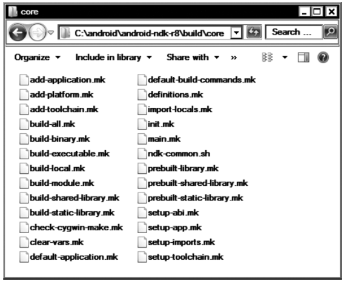

[toc]

## 2 探索 Android NDK

You will be taking the **hello-jni** sample application that comes with the Android NDK and manipulating it to demonstrate the Android NDK build system.

### 2.1 Android NDK 提供的组件

The following are some of the key components of Android NDK:

 ARM, x86, and MIPS cross-compilers
 Build system
 Java Native Interface headers
 C library
 Math library
 POSIX threads
 Minimal C++ library
 ZLib compression library
 Dynamic linker library
 Android logging library
 Android pixel buffer library
 Android native application APIs
 OpenGL ES 3D graphics library
 OpenSL ES native audio library
 OpenMAX AL minimal support

### 2.2 Android NDK 的结构

- `ndk-build`: 构建系统的起始脚本。
- `ndk-gdb`: This shell script allows debugging native components using the GNU Debugger. Chapter 5 will cover ndk-gdb in detail while discussing the debugging of native components.
- `ndk-stack`: This shell script helps facilitate analyzing the stack traces that are produced when native components crash. Chapter 5 will cover `ndk-stack` in detail while discussing the troubleshooting and crash dump analysis of native components.
- `build`: 该目录下包含 NDK 构建系统的模块。
- `platforms`: This directory contains header files and libraries for each supported Android target version. These files are used automatically by the Android NDK build system based on the specified target version.
- `samples`: 该目录包含多个样例应用。
- `sources`: This directory contains shared modules that developers can import into their existing Android NDK projects.
- `toolchains`: This directory contains cross-compilers for different target machine architectures that the Android NDK currently supports. Android NDK currently supports ARM, x86, and MIPS machine architectures. The Android NDK build system uses the cross-compiler based on the selected machine architecture.

### 2.3 从一个例子开始

先从 NDK 自带的例子 **hello-jni** 开始。Later, you will modify it to demonstrate the different functionalities provided by the Android NDK build system, such as

 Building a shared library
 Building multiple shared libraries
 Building static libraries
 Sharing common modules using shared libraries
 Sharing modules between multiple NDK projects
 Using prebuilt libraries
 Building standalone executables
 Other build system variables and macros
 Defining new variables and conditional operations

下面代码在 Eclipse IDE 中进行。把 **hello-jni** 导入到 Eclipse。

#### 从命令行构建

先构建原生代码，再构建Java代码，然后组合在一起。

构建原生代码：在 **hello-jni** 目录下执行 `ndk-build`。

构建Java代码。先执行

```
android update project –p . –n hello-jni –t android-14 --subprojects
```

产生 ANT 脚本。

#### NDK 工程的结构

比标准 Android 工程增加的目录：

- `jni`：包含原生源代码，Android.mk 文件。The Android NDK build system refers to this directory as the NDK project directory and it expects to find it at project root.
- `libs`: 由 NDK 构建系统创建。It contains individual subdirectories for target machine architecture that are specified, such as armeabi for the ARM. This directory gets incorporated into the APK file during the packaging process.
- `obj`: This directory is an intermediate directory holding the object files that are produced after compiling the source code. Developers are not expected to touch this directory.

### 2.4 构建系统

Android NDK 构建系统由多个 GNU Makefile 片段（fragments）组成。The build system includes the necessary fragments based on type of the NDK project needed to render the build process. As shown in Figure 2-12, these build system fragments can be found in the `build/core` sub-directory of the Android NDK installation. Although developers are not expected to directly interface with these files, knowing their locations becomes highly beneficial when troubleshooting build-system–related problems.



除了这些片段，Android NDK 构建系统依赖两个由开发者提供的文件：Android.mk 和 Application.mk。下面讲这两个文件。

#### Android.mk

Android.mk is a GNU Makefile fragment that describes the NDK project to the Android NDK build system. 每个 NDK 工程都必须有该文件。该文件必须放在 `jni` 目录下。下面是 hello-jni 工程的 Android.mk 文件：

```
LOCAL_PATH := $(call my-dir)
include $(CLEAR_VARS)
LOCAL_MODULE := hello-jni
LOCAL_SRC_FILES := hello-jni.c
include $(BUILD_SHARED_LIBRARY)
```

Since this is a GNU Makefile fragment, its syntax is exactly the same as any other Makefile. 每一行包含单条指令（instruction）。

Android.mk 都应该从定义 `LOCAL_PATH` 开始。构建系统根据 `LOCAL_PATH` 确定源文件的位置。`my-dir` 是一个宏，返回当前目录。

`CLEAR_VARS` 的值由构建系统设置，它指向 `clear-vars.mk` 的位置。引入该文件将导致清除 `LOCAL_<name>` 变量，如 `LOCAL_MODULE`。唯一例外是 `LOCAL_PATH`。
引入的目的是，在一次执行中，构建系统需要引入多个构建文件和模块定义。而 `LOCAL_<name>` 变量是全局的。清理是为了防止冲突。

Each native component is referred to as a **module**. `LOCAL_MODULE` 用于给模块命令（唯一）。模块名也用作产生的文件的名字。构建系统负责添加响应的前缀和后缀。如这里会产生 `libhello-jni.so`。

`LOCAL_SRC_FILES` 给出源文件列表。如果有多个文件，空格分隔。

##### 构建一个共享库

`BUILD_SHARED_LIBRARY` 变量由构建系统设置，指向 `build-shared-library.mk` 文件。该文件中的代码能够构建和组装（assemble）一个共享库。

##### 构建多个共享库

一个 Android.mk 文件允许产生多个共享库模块。例子：

```
LOCAL_PATH := $(call my-dir)
#
# Module 1
#
include $(CLEAR_VARS)
LOCAL_MODULE := module1
LOCAL_SRC_FILES := module1.c
include $(BUILD_SHARED_LIBRARY)
#
# Module 2
#
include $(CLEAR_VARS)
LOCAL_MODULE := module2
LOCAL_SRC_FILES := module2.c
include $(BUILD_SHARED_LIBRARY)
```

##### 构建静态库

Static libraries are also supported by the Android NDK build system. 静态库不能直接被 Android 应用使用。不能打包到应用中。静态库用于构建共享库。For example, when integrating third party code into an existing native project, instead of including the source code directly, the third party code can be compiled as a static library and then combined into the shared library, as shown in Listing 2-3.

```
LOCAL_PATH := $(call my-dir)
#
# 3rd party AVI library
#
include $(CLEAR_VARS)
LOCAL_MODULE := avilib
LOCAL_SRC_FILES := avilib.c platform_posix.c
include $(BUILD_STATIC_LIBRARY)
#
# Native module
#
include $(CLEAR_VARS)
LOCAL_MODULE := module
LOCAL_SRC_FILES := module.c
LOCAL_STATIC_LIBRARIES := avilib
include $(BUILD_SHARED_LIBRARY)
```

##### 利用共享库共享通用模块

Static libraries allow you to keep your source code modular; however, when the static library gets linked into a shared library, it becomes part of that shared library. In the case of multiple shared libraries, linking with the same static library simply increases the application size due to multiple copies of the common module. 此时应将共用模块构建为共享库，and the dependent modules then dynamically link to it to eliminate the duplicate copies (see Listing 2-4).

```
LOCAL_PATH := $(call my-dir)

include $(CLEAR_VARS)
LOCAL_MODULE := avilib
LOCAL_SRC_FILES := avilib.c platform_posix.c

include $(BUILD_SHARED_LIBRARY)
#
# Native module 1
#
include $(CLEAR_VARS)
LOCAL_MODULE := module1
LOCAL_SRC_FILES := module1.c
LOCAL_SHARED_LIBRARIES := avilib
include $(BUILD_SHARED_LIBRARY)
#
# Native module 2
#
include $(CLEAR_VARS)
LOCAL_MODULE := module2
LOCAL_SRC_FILES := module2.c
LOCAL_SHARED_LIBRARIES := avilib
include $(BUILD_SHARED_LIBRARY)
```

##### （未）在多个 NDK 工程之间共享模块

##### 构建独立可执行文件

However, in order to facilitate testing and quick prototyping, Android NDK also provides support for building a standalone executable. The standalone executables are regular Linux applications that can be copied to the Android device without being packaged into an APK file, and they can get executed directly without being loaded through a Java application. Standalone executables can be produced by importing the `BUILD_EXECUTABLE` variable in the `Android.mk` build file instead of `BUILD_SHARED_LIBRARY`, as shown in Listing 2-8.

```
include $(CLEAR_VARS)
LOCAL_MODULE := module
LOCAL_SRC_FILES := module.c
LOCAL_STATIC_LIBRARIES := avilib
include $(BUILD_EXECUTABLE)
```

The `BUILD_EXECUTABLE` variable points to the `build-executable.mk` Makefile fragment that contains the necessary build steps to produce a standalone executable on Android platform. The standalone executable gets placed into `libs/<machine architecture>` directory with the same name as the module. Although it is placed into this directory, it does not get included into the APK file during the packaging phase.

##### 其他构建系统变量

Besides the variables covered in the previous sections, there are other variables that are supported by the Android NDK build system. This section will briefly mention them. The variables that are defined by the build system are

- `TARGET_ARCH`: Name of the target CPU architecture, such as `arm`.
- `TARGET_PLATFORM`: Name of the target Android platform, such as `android-3`.
- `TARGET_ARCH_ABI`: Name of the target CPU architecture and the ABI, such as `armeabi-v7a`.
- `TARGET_ABI`: Concatenation of target platform and ABI, such as `android-3-armeabi-v7a`.

The variables that can be defined as a part of the module description are

- `LOCAL_MODULE_FILENAME`: Optional variable to redefine the name of the generated output file. By default the build system uses the value of `LOCAL_MODULE` as the name of the generated output file, but it can be overridden using this variable.
- `LOCAL_CPP_EXTENSION`: The default extension of **C++** source files is `.cpp`. This variable can be used to specify one or more file extensions for the C++ source code.
```
...
LOCAL_CPP_EXTENSION := .cpp .cxx
...
```

- `LOCAL_CPP_FEATURES`: Optional variable to indicate that the module relies on specific C++ features such as RTTI, exceptions, etc.
```
...
LOCAL_CPP_FEATURES := rtti
...
```
- `LOCAL_C_INCLUDES`: Optional list of paths, relative to NDK installation directory, to search for header files.
```
...
LOCAL_C_INCLUDES := sources/shared-module
LOCAL_C_INCLUDES := $(LOCAL_PATH)/include
...
```
- `LOCAL_CFLAGS`: Optional set of compiler flags that will be passed to the compiler while compiling the C and C++ source files.
```
...
LOCAL_CFLAGS := − DNDEBUG –DPORT = 1234
...
```
- `LOCAL_CPP_FLAGS`: Optional set of compiled flags that will be passed to the compiler while compiling the C++ source files only.
- `LOCAL_WHOLE_STATIC_LIBRARIES`: A variant of `LOCAL_STATIC_LIBRARIES` that indicates that the whole content of the static library should be included in the generated shared library. `LOCAL_WHOLE_STATIC_LIBRARIES` is very useful when there are circular dependencies between several static libraries.
- `LOCAL_LDLIBS`: Optional list of linker flags that will be passed to the linker while linking the object files to generate the output file. It is primarily used to pass the list of system libraries to dynamically link with. For example, to link with the Android NDK logging library, use this code:
```
LOCAL_LDFLAGS := − llog
```
- `LOCAL_ALLOW_UNDEFINED_SYMBOLS`: Optionally disables the checking for missing symbols in the generated file. When not defined, the linker will produce error messages indicating the missing symbols.
- `LOCAL_ARM_MODE`: Optional and ARM machine architecture-specific variable
indicating the type of ARM binary to be generated. By default, the build system generates in thumb mode with 16-bit instructions, but this variable can be set to `arm` to indicate that the 32-bit instructions should be used.
```
LOCAL_ARM_MODE := arm
```
This variable changes the build system behavior for the entire module; the .arm extension can also be used to only build specific files in arm mode.
```
LOCAL_SRC_FILES := file1.c file2.c.arm
```
- `LOCAL_ARM_NEON`: Optional and ARM machine architecture-specific variable indicating that ARM Advanced Single Instruction Multiple Date (SIMD) (a.k.a. NEON) intrinsics should be enabled in the source files.
```
LOCAL_ARM_NEON := true
```
This variable changes the build system behavior for the entire module; the .neon extension can also be used to only build specific files with NEON intrinsics.
```
LOCAL_SRC_FILES := file1.c file2.c.neon
```

- `LOCAL_DISABLE_NO_EXECUTE`: Optional variable to disable the NX Bit security feature. NX Bit, which stands for Never Execute, is a technology used in CPUs to segregate areas of memory for use by either code or storage. This prevents malicious software from taking control of the application by inserting its code into the application’s storage memory area.
```
LOCAL_DISABLE_NO_EXECUTE := true
```
- `LOCAL_EXPORT_CFLAGS`: This variable allows recording a set of compiler flags that will be added to the `LOCAL_CFLAGS` definition of any other module that is using this module through either `LOCAL_STATIC_LIBRARIES` or `LOCAL_SHARED_LIBRARIES`.
```
LOCAL_MODULE := avilib
...
LOCAL_EXPORT_CFLAGS := − DENABLE_AUDIO
...
LOCAL_MODULE := module1
LOCAL_CFLAGS := − DDEBUG
...
LOCAL_SHARED_LIBRARIES := avilib
```
The compiler will get executed with flags `–DENABLE_AUDIO –DDEBUG` while
building the module1.

- `LOCAL_EXPORT_CPPFLAGS`: Same as the `LOCAL_EXPORT_CLAGS` but for C++
code-specific compiler flags.
- `LOCAL_EXPORT_LDFLAGS`: Same as the `LOCAL_EXPORT_CFLAGS` but for the linker flags.
- `LOCAL_EXPORT_C_INCLUDES`: This variable allows recording set include paths that will be added to the `LOCAL_C_INCLUDES` definition of any other module that is using this module through either `LOCAL_STATIC_LIBRARIES` or `LOCAL_SHARED_LIBRARIES`.
- `LOCAL_SHORT_COMMANDS`: This variable should be set to true for modules with a very high number of sources or dependent static or shared libraries. Operating systems like Windows only allow a maximum of 8191 characters on the command line; this variable makes the build commands shorter than this limit by breaking them. This is not recommended for smaller modules since enabling it will make the build slower.
- `LOCAL_FILTER_ASM`: This variable defines the application that will be used to filter the assembly files from the `LOCAL_SRC_FILES`.

##### 其他构建系统的函数宏

This section covers the other function macros that are supported by the Android NDK build system.

- `all-subdir-makefiles`: Returns a list of Android.mk build files that are located in all sub-directories of the current directory. For example, calling the following includes all Android.mk files in the sub-directories into the build process:
```
include $(call all-subdir-makefiles)
```

- `this-makefile`: Returns the path of the current Android.mk build file.

- `parent-makefile`: Returns the path of the parent Android.mk build file that included the current build file.

- `grand-parent-makefile`: Same as the `parent-makefile` but for the grandparent.

##### 定义新变量

Developers can define other variables to simplify their build files. The names beginning with `LOCAL_` and `NDK_` prefixes are reserved for use by the Android NDK build system. It is recommended to use `MY_` prefix for variables that are defined by the developers, as shown in Listing 2-9.

```
...
MY_SRC_FILES := avilib.c platform_posix.c
LOCAL_SRC_FILES := $(addprefix avilib/, $(MY_SRC_FILES))
...
```

##### 条件

The Android.mk build file can also contain conditional operations on these variables, for example, to include a different set of source files per architecture, as shown in Listing 2-10.

```
...
ifeq ($(TARGET_ARCH),arm)
	LOCAL_SRC_FILES + = armonly.c
else
	LOCAL_SRC_FILES + = generic.c
endif
...
```

#### Application.mk

Application.mk 是可选的。它也放在 `jni` 目录下。Application.mk is also a GNU Makefile fragment. 它描述应用需要哪些模块；it also defines the variables that are common for all modules. The following variables are supported in the Application.mk build file:

- `APP_MODULES`: By default the Android NDK build system builds all modules that are declared by the `Android.mk` file. This variable can override this behavior and provide a space-separated list of modules that need to be built.

- `APP_OPTIM`: This variable can be set to either `release` or `debug` to alter the optimization level of the generated binaries. By default the `release` mode is used and the generated binaries are highly optimized. This variable can be set to `debug` mode to generate un-optimized binaries that are easier to debug.

- `APP_CLAGS`: This variable lists the compiler flags that will be passed to the compiler while compiling C and C++ source files for any of the modules.

- `APP_CPPFLAGS`: This variable lists the compilers flags that will be passed to the compiler while compiling the C++ source files for any of the modules.

- `APP_BUILD_SCRIPT`: By default the Android NDK build system looks for the `Android.mk` build file under the jni sub-directory of the project. This behavior can be altered by using this variable, and a different build file can be used.

- `APP_ABI`: By default Android NDK build system generates binaries for armeabi ABI. This variable can be used to alter this behavior and generate binaries for a different ABI, like so:
```
APP_ABI := mips
```
Additionally, more than one ABI can be set
```
APP_ABI := armeabi mips
```
in order to generate binaries for all supported ABIs
```
APP_ABI := all
```

- `APP_STL`: By default the Android NDK build system uses the minimal STL runtime library, also known as the system library. This variable can be used to select a different STL implementation.
```
APP_STL := stlport_shared
```

- `APP_GNUSTL_FORCE_CPP_FEATURES`: Similar to `LOCAL_CPP_EXTENSIONS` variable, this variable indicates that all modules rely on specific C++ features such as RTTI, exceptions, etc.

- `APP_SHORT_COMMANDS`: Similar to the `LOCAL_SHORT_COMMANDS` variable, this variable makes the build system use shorter commands on projects with high amount of source files.

### 2.5 使用 NDK-Build 脚本

`ndk-build` 脚本。

- By default the `ndk-build` script expects to be executed within the main project directory. The `–C` argument can be used to specify the location the NDK project on the command line so that the `ndk-build` script can be started from an arbitrary location.
```
ndk-build –C /path/to/the/project
```

- The Android NDK build system does not rebuild objects if their source file is not being modified. You can execute the `ndk-build` script using the `–B` argument to force rebuilding all source code.
```
ndk-build -B
```
In order to clean the generated binaries and object files, you can execute `ndk-build clean` on the command line. Android NDK build system removes the generated binaries.

- GNU Make can execute build commands in parallel if the `–j` argument is provided on the command line. Optionally, the number of commands that can be executed in parallel can also be specified as a number following the argument.
```
ndk-build –j 4
```

### 2.6 故障解决

Logging of the internal state of the Android NDK build system can be enabled by typing `ndk-build NDK_LOG = 1` on the command line. The Android NDK build system will produce extensive amount of logging with log messages prefixed with “Android NDK: ”.

If you are only interested in seeing the actual build commands that get executed, you can type `ndk-build V = 1` on the command line.


