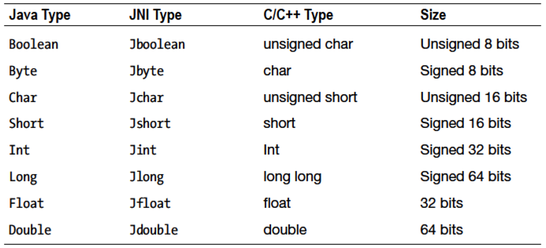
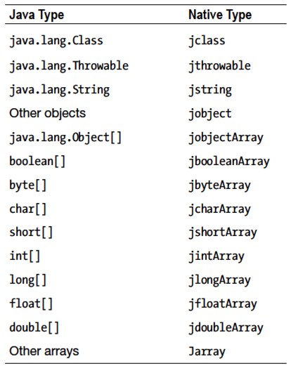
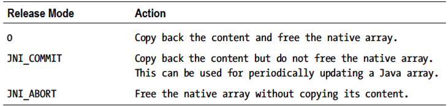

[toc]

## （未）3 JNI

### 3.2 例子开始

还是 NDK 自带示例 `hello-jni`。

HelloJni.java 的 onCreate 方法：

```java
{
    super.onCreate(savedInstanceState);
    TextView tv = new TextView(this);
    tv.setText( stringFromJNI() );
    setContentView(tv);
```

`stringFromJNI()` 是原生方法。

原生方法的声明：

```java
public native String stringFromJNI();
```

加载共享库：

```java
static {
	System.loadLibrary("hello-jni");
}
```

The library has already been unpacked into `/data/data/com.example.HelloJni/lib/libhello-jni.so` at installation time by the package manager.

The argument to `loadLibrary` does not include the location of the shared library either. The Java library path, system property `java.library.path`, holds the list of directories that the `loadLibrary` method will search for in the shared libraries. The Java library path on Android contains `/vendor/lib` and `/system/lib`.

`jni/hello-jni.c` 代码：

```c
    #include <string.h>
    #include <jni.h>
    ...
    jstring Java_com_example_hellojni_HelloJni_stringFromJNI( JNIEnv* env, jobject thiz )
    {
    return (*env)->NewStringUTF(env, "Hello from JNI !");
    }
```

The `stringFromJNI` native method is also declared with a fully qualified function named `Java_com_example_hellojni_HelloJni_stringFromJNI`.

`javah` 作用于编译好的类文件。如：

```
javah –classpath bin/classes com.example.hellojni.HelloJni
```

The `javah` tool will parse the `com.example.hellojni.HelloJni` class file, and it will generate the C/C++ header file as `com_example_hellojni_HelloJni.h`.

```h
    /* DO NOT EDIT THIS FILE - it is machine generated */
    #include < jni.h>
    /* Header for class com_example_hellojni_HelloJni */
    #ifndef _Included_com_example_hellojni_HelloJni
    #define _Included_com_example_hellojni_HelloJni
    #ifdef __cplusplus
    extern "C" {
    #endif
    /*
    * Class: com_example_hellojni_HelloJni
    * Method: stringFromJNI
    * Signature: ()Ljava/lang/String;
    */
    JNIEXPORT jstring JNICALL Java_com_example_hellojni_HelloJni_stringFromJNI (JNIEnv *, jobject);
    /*
    * Class: com_example_hellojni_HelloJni
    * Method: unimplementedStringFromJNI
    * Signature: ()Ljava/lang/String;
    */
    JNIEXPORT jstring JNICALL Java_com_example_hellojni_HelloJni_unimplementedStringFromJNI (JNIEnv *, jobject);
    #ifdef __cplusplus
    }
    #endif
    #endif
```

The C/C++ source file simply needs to include this header file and provide the implementation for the native methods, as shown in Listing 3-6.

Listing 3-6. The com_example_hellojni_HelloJni.c Source File

```c
    #include "com_example_hellojni_HelloJni.h"
    JNIEXPORT jstring JNICALL Java_com_example_hellojni_HelloJni_stringFromJNI
    (JNIEnv * env, jobject thiz)
    {
    	return (*env)->NewStringUTF(env, "Hello from JNI !");
    }
```

Although the Java method stringFromJNI does not take any parameters, the native function takes two parameters, as shown in Listing 3-7.

Listing 3-7. Mandatory Parameters of Native Methods

```h
JNIEXPORT jstring JNICALL Java_com_example_hellojni_HelloJni_stringFromJNI
(JNIEnv *, jobject);
```

The `JNIEnv` interface pointer that is passed into each native method call is also valid in the thread associated with the method call. It cannot be cached and used by other threads.

C 和 `C++` 源文件调用 JNI 函数的方法不同。In C code, `JNIEnv` is a pointer to `JNINativeInterface` structure. This pointer needs to be dereferenced first in order to access any JNI function. Since the JNI functions in C code do not know the current JNI environment, the JNIEnv instance should be passed as the first argument to each JNI function call, like so:

```c
return (*env)->NewStringUTF(env, "Hello from JNI !");
```

In `C++` code, `JNIEnv` is actually a `C++` class instance. JNI functions are exposed as member functions. Since JNI methods have access to the current JNI environment, the JNI method calls **do not** require the `JNIEnv` instance as an argument. In `C++`, the same code looks like

```c
return env->NewStringUTF("Hello from JNI !");
```

Both instance and static methods can be declared as native, and their implementations can be provided as native code through the JNI technology. Native instance methods get the instance reference as their second parameter as a `jobject` value, as shown in Listing 3-8.

```h
JNIEXPORT jstring JNICALL Java_com_example_hellojni_HelloJni_stringFromJNI
(JNIEnv * env, jobject thiz);
```

Since static methods are not tied to an instance, they get the class reference instead as their second parameter as a jclass value, shown in Listing 3-9.

```h
JNIEXPORT jstring JNICALL Java_com_example_hellojni_HelloJni_stringFromJNI
(JNIEnv * env, jclass clazz);
```

As you may have noticed in the method definitions that JNI provides its own data types to expose Java types to native code.

### 3.3 数据类型





### 3.4 引用类型的操作

Reference types are passed as opaque references to the native code rather than native data types, and they cannot be consumed and modified directly. JNI 提供一组 API 与这些引用类型交互。这些 API 通过 `JNIEnv` 指针提供给原生函数。In this section, you will briefly explore these APIs pertinent to the following types and components:

 Strings
 Arrays
 NIO Buffers
 Fields
 Methods

#### String 操作

JNI 把 Java 字符串当引用类型处理。These reference types are not directly usable as native C strings. JNI provides the necessary functions to convert these Java string references to C strings and back. 因为 Java 字符串是不可变的，JNI 也不能修改 Java 字符串的内容。

JNI 支持 Unicode 和 UTF-8 编码的字符串，and it provides two sets of functions through the `JNIEnv` interface pointer to handle each of these string encodings.

##### 新建字符串

原生代码中创建新的字符串，用 `NewString` 方法或 `NewStringUTF` 方法。二者分别创建 Unicode 字符串和 `NewStringUTF` 字符串。As shown in Listing 3-10, these functions take a C string and returns a Java string reference type, a `jstring` value.

```c
jstring javaString;
javaString = (*env)->NewStringUTF(env, "Hello World!");
```

In case of a memory overflow, these functions return `NULL` to inform the native code that an exception has been thrown in the virtual machine so the native code should not continue. We will get back to the topic of exception handling later in this chapter.

##### 将 Java 字符串转换为 C 字符串

In order to use a Java string in native code, it needs to be converted to a C string first. Java strings can be converted to C strings using the functions `GetStringChars` for Unicode strings and `GetStringUTFChars` for UTF-8 strings. These functions take an optional third argument, a pass-by-reference output parameter called `isCopy` that can allow the caller to determine whether the returned C string address points to a copy or the pinned object in the heap. This is shown in Listing 3-11.

```c
const jbyte* str;
jboolean isCopy;
str = (*env)->GetStringUTFChars(env, javaString, &isCopy);
if (0 != str) {
	printf("Java string: %s", str);
    if (JNI_TRUE == isCopy) {
        printf("C string is a copy of the Java string.");
    } else {
        printf("C string points to actual string.");
    }
```

{{文字不全}}

##### 释放字符串

{{文字不全}}
... GetStringChars and GetStringUTFChars functions need to be `ReleaseStringChars` for Unicode strings and `ReleaseStringUTFChars` for

Releasing the C Strings Returned by JNI Functions

```c
(*env)->ReleaseStringUTFChars(env, javaString, str);
```

#### 数组操作

Java arrays are handled by the JNI as reference types. The JNI provides the necessary functions to access and manipulate Java arrays.

##### New Array

New array instances can be constructed from the native code using the `New<Type>Array` function, with the `<Type>` being Int, Char, Boolean, etc. such as `NewIntArray`. As shown in Listing 3-13, the size of the array should be provided as a parameter when invoking these functions.

```c
jintArray javaArray;
javaArray = (*env)->NewIntArray(env, 10);
if (0 != javaArray) {
/* You can now use the array. */
}
```

Same as the `NewString` function, in case of a memory overflow, the `New<Type>Array` function will return `NULL` to inform the native code that an exception has been thrown in the virtual machine and that the native code should not continue.

##### 访问数组元素

JNI provides two types of access to Java array elements. Code can either get a copy of the array as a C array, or it can ask JNI to get a direct pointer to the array elements.

**Operating on a Copy**

The `Get<Type>ArrayRegion` function copies the given primitive Java array to the given C array, as shown in Listing 3-14.

```
jint nativeArray[10];
(*env)->GetIntArrayRegion(env, javaArray, 0, 10, nativeArray);
```

The native code can then use and modify the array elements as an ordinary C array. When the native code wants to commit its changes back to the Java array, the `Set<Type>ArrayRegion` function can be used to copy the C array back to Java array, as shown in Listing 3-15.

```
(*env)->SetIntArrayRegion(env, javaArray, 0, 10, nativeArray);
```

When the array sizes are big, copying the array in order to operate on them causes performance problems. In such cases, the native code should either only get or set the region of the array elements instead of getting the entire array, if possible. Otherwise, JNI provides a different set of functions to obtain a direct pointer to the array elements instead of their copies.

**Operating on Direct Pointer**

The `Get<Type>ArrayElements` function allows the native code to get a direct pointer to array elements, when possible. As shown in Listing 3-16, the function takes a third optional parameter, a pass-by-reference output parameter called `isCopy` that can allow the caller to determine whether the returned C array points to a copy or the pinned array in the heap.

```
jint* nativeDirectArray;
jboolean isCopy;
nativeDirectArray = (*env)->GetIntArrayElements(env, javaArray, &isCopy);
```

JNI does not provide a set method, since the array elements can be accessed and manipulated as an ordinary C array. JNI requires the native code to release these pointers when it finishes; otherwise memory leaks happen. JNI provides the `Release<Type>ArrayElemens` functions to enable native code to release the C arrays that are returned by `Get<Type>ArrayElements` function calls, as shown in Listing 3-17.

```
(*env)->ReleaseIntArrayElements(env, javaArray, nativeDirectArray, 0);
```

This function takes a fourth parameter, the release mode. Table 3-3 contains a list of supported release modes.



#### （未）NIO 操作

{{文本不全}}

#### 访问字段


