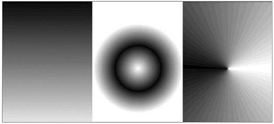

[toc]

    ###################################
    # 本书（第三版）针对 Android 4.0 （API 15）
    ###################################

### 4.8 Adapter 介绍

Adapters 负责将数据绑定到`AdapterView`的子类（如`ListView`或`Gallery`。Adapters负责创建表示底层数据项的子View。

#### 4.8.1 原生适配器介绍

两个最常用的原生适配器：

- `ArrayAdapter`：默认，`ArrayAdapter`对数组中的每个对象调用`toString`，将结果填充到`TextView`s。通过构造器可以指定更复杂的布局。
- `SimpleCursorAdapter`：The Simple Cursor Adapter enables you to bind the Views within a layout to specific columns contained within a Cursor (typically returned from a Content Provider query). You specify an XML layout to inflate and populate to display each child, and then bind each column in the Cursor to a particular View within that layout. The adapter will create a new View for each Cursor entry and inflate the layout into it, populating each View within the layout using the Cursor’s corresponding column value.

#### 4.8.2 定制 Array Adapter

覆盖`getView`，定制数据项的布局。

```java
	public class MyArrayAdapter extends ArrayAdapter<MyClass> {
		int resource;
		public MyArrayAdapter(Context context, int _resource,
			List<MyClass> items) {
			super(context, _resource, items);
			resource = _resource;
		}
		@Override
		public View getView(int position, View convertView, ViewGroup parent) {
			// Create and inflate the View to display
			LinearLayout newView;
			if (convertView == null) {
				// Inflate a new view if this is not an update.
				newView = new LinearLayout(getContext());
				String inflater = Context.LAYOUT_INFLATER_SERVICE;
				LayoutInflater li;
				li = (LayoutInflater)getContext().getSystemService(inflater);
				li.inflate(resource, newView, true);
			} else {
				// Otherwise we’ll update the existing View
				newView = (LinearLayout)convertView;
			}
			MyClass classInstance = getItem(position);
			// TODO Retrieve values to display from the
			// classInstance variable.
			// TODO Get references to the Views to populate from the layout.
			// TODO Populate the Views with object property values.
			return newView;
		}
	}
```

`getView`的`position`参数给出数据项的显示位置。`getItem`获取数据项内容。

#### 4.8.3 利用适配器将数据绑定到View

调用`AdapterView`的`setAdapter`方法，将适配器绑定到`AdapterView`。

```java
	ArrayList<String> myStringArray = new ArrayList<String>();
	int layoutID = android.R.layout.simple_list_item_1;
	ArrayAdapter<String> myAdapterInstance;
	myAdapterInstance = new ArrayAdapter<String>(this, layoutID, myStringArray);
	myListView.setAdapter(myAdapterInstance);
```


### 11.7 增强你的View

判断`Canvas`是否支持硬件加速：
```java
canvas.isHardwareAccelerated()
```

#### 11.7.1 高级 Canvas 绘图

本节介绍的多数技术都是关于`Paint`的变化，实现深度和纹理。

Android的绘制API支持变透明、渐变填充、圆角矩形、反锯齿。

Android不支持矢量绘制，支持传统的光栅（raster）图。

##### 可以绘制什么？

`Canvas`有一组`draw*`方法：
- `drawARGB`/`drawRGB`/`drawColor`：用单色填充画布
- `drawArc`：Draws an arc between two angles within an area bounded by a rectangle.
- `drawBitmap`：在画布上绘bitmap。You can alter the appearance of the target bitmap by specifying a target size or using a matrix to transform it.
- `drawBitmapMesh`：Draws a bitmap using a mesh that lets you manipulate the appearance of the target by moving points within it.
- `drawCircle`：Draws a circle of a specified radius centered on a given point.
- `drawLine(s)`：Draws a line (or series of lines) between two points.
- `drawOval`：Draws an oval bounded by the rectangle specified.
- `drawPaint`：Fills the entire Canvas with the specified Paint.
- `drawPath`：Draws the specified Path. A `Path` object is often used to hold a collection of drawing primitives within a single object.
- `drawPicture`：Draws a `Picture` object within the specified rectangle (not supported when using hardware acceleration.)
- `drawPosText`：Draws a text string specifying the offset of each character (not supported when using hardware acceleration).
- `drawRect`：绘制矩形
- `drawRoundRect`：Draws a rectangle with rounded edges.
- `drawText`：Draws a text string on the Canvas. The text font, size, color, and rendering properties are set in the `Paint` object used to render the text.
- `drawTextOnPath`：Draws text that follows along a specified path (not supported when using hardware acceleration).
- `drawVertices`：Draws a series of tri-patches specified as a series of vertex points (not supported when using hardware acceleration).

##### `Paint`

通过`Paint`，可以控制颜色、样式、字体和特效。

> 如果你使用了硬件加速，则`Paint`的部分选项将无法使用。

`setColor`设置的Paint的颜色。`setStyle`设置`Paint`的样式：是否只画出形状的轮廓（`STROKE`），只填充（`FILL`），或二者都要。

`Paint`类还支持透明，可以被 Shaders, filters, and effects 修饰。

The Android SDK includes several excellent projects that demonstrate most of the features available in the `Paint` class. They are available in the graphics subfolder of the API demos at:
`\samples\android-15\ApiDemos\src\com\example\android\apis\graphics`

###### 半透明

创建颜色：
```java
// Make color red and 50% transparent
int opacity = 127;
int intColor = Color.argb(opacity, 255, 0, 0);
int parsedColor = Color.parseColor(“#7FFF0000”);
```

设置`Paint`的透明度：
``` java
// Make color 50% transparent
int opacity = 127;
myPaint.setAlpha(opacity);
```

You can use transparency effects in any class or method that uses colors including Paint colors, Shaders, and Mask Filters.

###### Shaders

扩展`Shader`类，能让你以多种颜色填充对象。

Shaders的最常见的用法是渐变填充。渐变是向 2D 添加深度和纹理的好方式。Android包含三个渐变Shaders，及一个Bitmap Shader和一个Compose Shader。

Trying to describe painting techniques seems inherently futile, so Figure 11-7 shows how each Shader works. Represented from left to right are `LinearGradient`, `RadialGradient`, and `SweepGradient`.



###### Gradient Shaders

两种定义渐变的方式。第一种是两色渐变：
```java
int colorFrom = Color.BLACK;
int colorTo = Color.WHITE;
LinearGradient myLinearGradient =
	new LinearGradient(x1, y1, x2, y2, colorFrom, colorTo, TileMode.CLAMP);
```

第二种，指定多个渐变色：
```java
int[] gradientColors = new int[3];
gradientColors[0] = Color.GREEN;
gradientColors[1] = Color.YELLOW;
gradientColors[2] = Color.RED;

float[] gradientPositions = new float[3];
gradientPositions[0] = 0.0f;
gradientPositions[1] = 0.5f;
gradientPositions[2] = 1.0f;

RadialGradient radialGradientShader
	= new RadialGradient(centerX, centerY, radius,
		gradientColors, gradientPositions,
		TileMode.CLAMP);
```

设置使用何种Shader：
```java
shaderPaint.setShader(myLinearGradient);
```

使用此 `Paint` 的图形，将以指定的 Shader 填充，而不是 Paint 的 color。

###### Shader Tile Modes

The brush sizes of the *gradient* Shaders are defined using explicit bounding rectangles or center points and radius lengths; the Bitmap Shader implies a brush size through its bitmap size.

如果Shader brush定义的区域小于要填充的区域，`TileMode`定义剩余区域如何被填充。可用值：

- `CLAMP`：使用Shader边缘色填充额外空间
- `MIRROR`：水平/垂直反转Shader图像，让图片看上去能连起来
- `REPEAT`：重复，但不反转

###### Mask Filters

The `MaskFilter` classes let you assign **edge effects** to your Paint. **当Canvas启用硬件加速后，不支持Mask Filters**

Extensions to MaskFilter apply transformations to the alpha-channel of a Paint along its outer edge. 有以下可用的 Mask Filters:

- `BlurMaskFilter` — Specifies a blur style and radius to feather the edges of your Paint
- `EmbossMaskFilter` — Specifies the direction of the light source and ambient light level to add an embossing effect(浮雕特效)

To apply a Mask Filter, use the `setMaskFilter` method, passing in a `MaskFilter` object:
```java
// Set the direction of the light source
float[] direction = new float[]{ 1, 1, 1 };
// Set the ambient light level
float light = 0.4f;
// Choose a level of specularity to apply
float specular = 6;
// Apply a level of blur to apply to the mask
float blur = 3.5f;
EmbossMaskFilter emboss = new EmbossMaskFilter(direction, light, specular, blur);
// Apply the mask
if (canvas.isHardwareAccelerated())
	myPaint.setMaskFilter(emboss);
```

The FingerPaintAPI demo included in the SDK is an excellent example of how to use `MaskFilters`. It demonstrates the effect of both the emboss and blur filters.

###### Color Filters

Mask Filters 变换的是 Paint 的 alpha 通道。而`ColorFilter` 变换的是每个 RGB 通道。All ColorFilter-derived classes ignore the alpha channel when performing their transformations.

可用的 Color Filters:

- `ColorMatrixColorFilter`：Lets you specify a 4 x 5 ColorMatrix to apply to a Paint. Color Matrixes are commonly used to perform image processing programmatically and are useful because they support chaining transformations using matrix multiplication.
- `LightingColorFilter` — Multiplies the RGB channels by the first color before adding the second. The result of each transformation will be clamped between 0 and 255.
- `PorterDuffColorFilter` — Lets you use any one of the 16 Porter-Duff rules for digital image compositing to apply a specified color to the Paint. The Porter-Duff rules are defined here at http://developer.android.com/reference/android/graphics/PorterDuff.Mode.html.

Apply ColorFilters using the `setColorFilter` method:
```java
myPaint.setColorFilter(new LightingColorFilter(Color.BLUE, Color.RED));
```

An excellent example of using a Color Filter and Color Matrixes is in the ColorMatrixSampleAPI example:
samples\android-15\ApiDemos\src\com\example\android\apis\graphics\ColorMatrixSample.java

###### Path Effects

之前讨论的特效影响的是 Paint 的填充效果。Path Effects 控制的是轮廓（stroke）。

Path Effects are particularly useful for drawing Path primitives, but they can be applied to any Paint to affect the way the stroke is drawn.

Using Path Effects, you can change the appearance of a shape’s corners and control the appearance of the outline. Android includes several Path Effects, including the following:

- `CornerPathEffect`：Lets you smooth sharp corners in the shape of a primitive by replacing them with rounded corners.
- `DashPathEffect`：Rather than drawing a solid outline, you can use the DashPathEffect to create an outline of broken lines (dashes/dots). You can specify any repeating pattern of solid/empty line segments.
- `DiscretePathEffect` — Similar to the DashPathEffect, but with added randomness. Specifies the length of each segment and a degree of deviation from the original path to use when drawing it.
- `PathDashPathEffect` — Enables you to define a new shape (path) to use as a stamp to outline the original path.

The following effects let you combine multiple Path Effects to a single Paint:

- `SumPathEffect` — Adds two effects to a path in sequence, such that each effect is applied to the original path and the two results are combined.
- `ComposePathEffect` — Applies first one effect and then applies the second effect to the result of the first.

Path Effects that modify the shape of the object being drawn change the area of the affected shape. This ensures that any fill effects applied to the same shape are drawn within the new bounds.

Path Effects are applied to `Paint` objects using the `setPathEffect` method:
```java
borderPaint.setPathEffect(new CornerPathEffect(5));
```

The Path Effects API sample gives an excellent guide to how to apply each of these effects:

	samples\android-15\ApiDemos\src\com\example\android\apis\graphics\PathEffects.java

###### Changing the Transfer Mode

Change a Paint’s `Xfermode` to affect the way it paints new colors on top of what’s already on the Canvas. Under normal circumstances, painting on top of an existing drawing layers the new shape on top. If the new Paint is fully opaque, it totally obscures the paint underneath; if it’s partially transparent, it tints the colors underneath.

The following `Xfermode` subclasses let you change this behavior:
- `AvoidXfermode` — Specifies a color and tolerance to force your Paint to avoid drawing over (or only draw over) it.
- `PixelXorXfermode` — Applies a simple pixel XOR operation when covering existing colors.
- `PorterDuffXfermode` — This is a very powerful transfer mode with which you can use any of the 16 Porter-Duff rules for image composition to control how the paint interacts with the existing canvas image.

To apply transfer modes, use the `setXferMode` method:
```java
AvoidXfermode avoid = new AvoidXfermode(Color.BLUE, 10, AvoidXfermode.Mode.AVOID);
borderPen.setXfermode(avoid);
```

##### 利用反锯齿提高绘制质量

When you create a new `Paint` object, you can pass in several flags that affect the way the Paint will be rendered. One of the most interesting is the `ANTI_ALIAS_FLAG`, which ensures that diagonal lines drawn with this paint are anti-aliased to give a smooth appearance (at the cost of performance).

Anti-aliasing is particularly important when drawing text, as anti-aliased text can be significantly easier to read. To create even smoother text effects, you can apply the `SUBPIXEL_TEXT_FLAG`, which applies subpixel anti-aliasing.
```java
Paint paint = new Paint(Paint.ANTI_ALIAS_FLAG|Paint.SUBPIXEL_TEXT_FLAG);
```

You can also set both of these flags manually using the `setSubpixelText` and `setAntiAlias` methods:
```java
myPaint.setSubpixelText(true);
myPaint.setAntiAlias(true);
```

##### （未）Canvas 绘制最佳实践

##### （未）Advanced Compass Face Example


