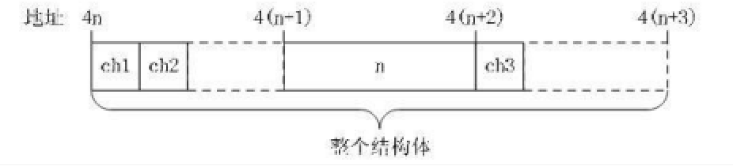

[toc]

## 结构体

### typeof结构体

typeof定义结构的别名：

```c
typedef struct my_struct {
    int m, n;
} my_struct;
```
GNU C允许新类型名与结构体名相同。此后，`my_struct`可以代替`struct my_struct`（注意省略了**struct**）。

### 对齐问题

由于硬件设计特点，CPU在读写内存时，如果地址是机器字长的整数倍，则操作效率会比较高。有些CPU甚至根本不支持读写地址不对齐的内存单元，这时需要用软件模拟，操作效率就更低了。在32位机器上，地址对齐的界线一般是4的整数倍。

尽量避免一个变量（包括结构体成员）的存储空间跨越地址对齐的界线。

```c
struct my_struct {
  char ch1; // 1 byte
  char ch2; // 2 byte
  int n; // 4 bytes
  char ch3; // 1bytes
}
```



ch1和ch2房子同一个对齐单元中，虽然它们只占2个字节；后面是2字节空白，然后是整数n，为了不让n跨越对齐界线。ch3后面虽然没有其他成员了，但仍需补充3个空闲字节。

对结构体类型使用sizeof运算符，得到的是结构体占用的内存字节数，**包括所有空闲字节**。

很多情况下结构体中不允许有空闲字节，所有成员必须一个紧挨一个存放；或者说，地址的对齐边界是1的整数倍。可以通过如下的预处理语句来制定：

```c
    #pragma pack(1)
    struct my_struct {
      char ch1; // 1 byte
      char ch2; // 2 byte
      int n; // 4 bytes
      char ch3; // 1bytes
    };
    #pragma pack()
```

GNU C支持结构体的扩展属性：

```c
    struct my_struct {
      char ch1; // 1 byte
      char ch2; // 2 byte
      int n; // 4 bytes
      char ch3; // 1bytes
    } __attribute__((packed)); // 指明此结构体是紧凑的
```

