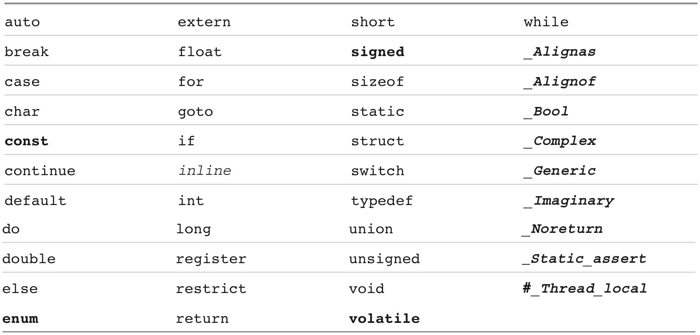

[toc]

## 1 准备

第一次标准化 C89 或称 C90。

部分编译器未能全部实现 C99。

本书提及 ANSI C，或 ANSI/ISO C 或 ISO C，指的是 C89/90 及之后标准常见的特性。

样例程序：

```c
    #include <stdio.h>
    int main(void)
    {
        printf("Concrete contains gravel and cement.\n");
        return 0;
    }
```

`#include <stdio.h>` 的效果，与你把 `stdio.h` 所有内容全部拷贝粘贴到 `#include` 这一行是一样的。

需要 `stdio.h` 是因为用到了`printf()`

## 2 介绍

注释使用 `/* */`。C99添加了 `//` 注释。

C中，所有变量都必须先声明再使用。

过去，变量声明必须放在块的开始。但 C99 和 C11 允许就近声明，只要在使用前声明即可。为了兼容老系统，本书还是遵循老习惯。

C99 和 C11 允许标示符长度任意长，但编译器只认为前63个字符是显著的。对于外部标示符（见第12章）只需要识别前31个字符。相应的，C90 只认前31个字符和前6个字符。更老的C编译器常常最多识别8个字符。Actually, you can use more than the maximum number of characters, but the compiler isn’t required to pay attention to the extra characters.

To make C more international, C99 and C11 make an extensive set of characters available for use by the Universal Character Names (or UMC) mechanism. Reference Section VII, “Expanded Character Support”, in Appendix B discusses this addition. This makes available characters that are not part of the English alphabet.

### 函数的声明、定义与调用

```c
    #include <stdio.h>
    void butler(void); /* ANSI/ISO C function prototyping */
    int main(void)
    {
    	// ...
        bulter();
    }
    void butler(void) /* start of function definition */ {
    	// ...
    }
```

`butler` 出现了三次，依次是函数原型、函数调用、函数定义。

C90 标准加入了原型，较老的编译器可能不能识别它们。原型也被称作**函数声明**。

之前的 C 支持一种更简短形式的函数声明。只指定返回值，省略参数。如 `void butler();`。C90, C99 和 C11 标准识别这些老的形式，但将来可能放弃支持，因此不要使用它们。如果维护老代码，最好将声明修改为原型。

C 标准推荐为所有函数提供原型。标准头文件负责为库函数提供原型。例如，**stdio.h** 包含 `printf()` 的原型。

### 关键字

In the following list of C keywords, boldface indicates keywords added by the C90 standard, italics indicates new keywords added by the C99 standard, and boldface italics indicates keywords added by the C11 standard.

