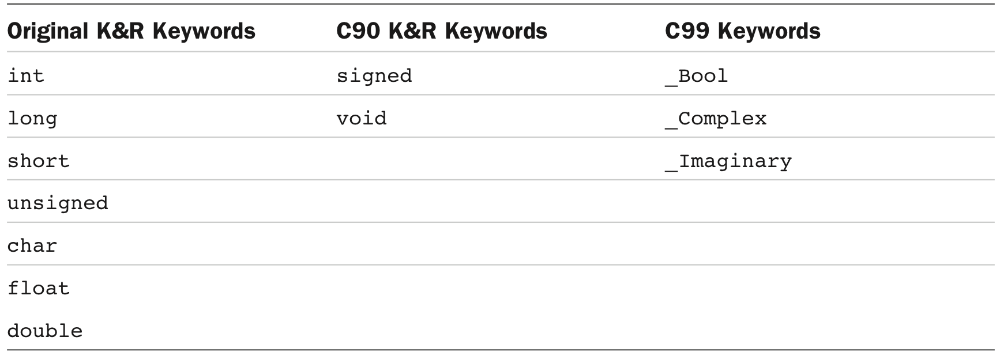

[toc]

## 3 数据

### 数据关键字



`int` 表示基本整数。`long`、 `short`、 `unsigned` 和 C90 添加的 `signed` 用于产生变体，如 `unsigned short int`、 `long long int`。

`float`, `double`, `long double` 用于表示带小数的数字。

`_Bool` 是布尔类型（`true` 和 `false`）。

`_Complex` and `_Imaginary` represent complex and imaginary numbers, respectively.

上面所有类型按表示划分为整数和浮点数两种类型。

### 基本C类型

#### int

`int` 类型是有符号整数。值范围因系统而异。一般用一个机器字存储。ISO C 规定 `int` 类型的最小范围是 **–32767** 到 **32767**。

```c
int erns;
int hogs, cows, goats;
```

在声明的时候同时初始化：

```c
int hogs = 21;
int cows = 32, goats = 14;
```

打印整数用 `%d`

```c
printf("%d minus %d is %d\n", ten, 2, ten - two );
```

十六进制加前缀 `0x` 或 `0X`。八进制加前缀 `0`。

要以八进制显示，使用 `%o`；十六进制使用 `%x`。

```c
printf("dec = %d; octal = %o; hex = %x\n", x, x, x);
printf("dec = %d; octal = %#o; hex = %#x\n", x, x, x);
```

Note that the 0 and the 0x prefixes are not displayed in the output unless you include the `#` as part of the specifier.

有三个形容词可以修饰基本整数类型：`short`、 `long` 和 `unsigned`。

- `short int` 或 `short` 可能比 `int` 小。
- `long int` 或 `long`
- `long long int` 或 `long long`（C99引入）。最少必须64位。
- `unsigned int` 或 `unsigned`，
- `unsigned long int` 或 `unsigned long`， `unsigned short int` 或 `unsigned short`，C90 引入。C99 引入 `unsigned long long int` 和 `unsigned long long`。
- The keyword `signed` can be used with any of the signed types to make your intent explicit. For example, `short`, `short int`, `signed short`, and `signed short int` are all names for the same type.

注意 C 只保证 `short` 不会比 `int` 大，`long` 不会比 `int` 小。

C 标准规定了每种类型的最小大小。`short` 和 `int` 最小范围是 `–32767` 到 `32767`，即**16位**。`long` 最小**32位**。`unsigned short` 和 `unsigned int` 最小范围 `0` 到 `65535`。`long long` 用于支持64位，最小范围 `–9,223,372,036,854,775,807` 到 `9,223,372,036,854,775,807`。

一个数字字面量默认按 `int` 存储。若超出 `int` 范围，如 1000000，按 `long int`。再大，按 `unsigned long` 存储。如果仍不够，按 `long long` 或 `unsigned long long` 处理（如果可用）。

八进制和十六进制常量当做类型 `int`。不够，处理成 `unsigned int`。再不够，处理成 `long`、 `unsigned long`、 `long long` 和 `unsigned long long`。

常量显示声明为 `long` 加后缀 `l` 或 `L`。对八进制和十六进制也适用，如 `020L`。

类似的，对于支持 `long long` 的系统，可以适用后缀 `ll` 或 `LL` 表示 `long long` 常量，如 `3LL`。加一个 `u` 或 `U` 后缀表示 `unsigned long long`，如 `5ull` 或 `10LLU`。

打印 `unsigned int` 使用符号 `%u`。打印 `long` 使用 `%ld`。如果在你的系统中 `int` 和 `long` 大小相同，`%d` 就够了；但这样可移植性不好。`l` 也可以与 `x` 和 `o` 连用，如用 `%lx` 打印十六进制的的 `long`。注意，对于打印标示，要用小写，不能大写。

C has several additional printf() formats. First, you can use an `h` prefix for `short` types. Therefore, `%hd` displays a short integer in decimal form, and `%ho` displays a short integer in octal form. Both the `h` and `l` prefixes can be used with `u` for unsigned types. For instance, you would use the `%lu` notation for printing unsigned long types. Systems supporting the long long types use `%lld` and `%llu` for the signed and unsigned versions.

#### char

`char` 实际是整数，因为字符按整数存储。`char` 类型一般定义成8位内存，因此大约只能容纳ASCII码。More generally, C guarantees that the `char` type is large enough to store the basic character set for the system on which C is implemented.

The C language defines a **byte** to be the number of bits used by type `char`, so one can have a system with a 16-bit or 32-bit byte and char type.

```c
char response;
char itable, latan;
char grade = 'A';
```

因为字符存储为数字，因此可以直接用数字赋值：

```c
char grade = 65; /* ok for ASCII, but poor style */
```

双引号包围的字符串称为 **character string**。

`printf()` 打印字符用 `%c` 标示。但如果打印 `char` 变量时用 `%d` 标示，打印出的是整数。

有的 C 实现将 `char` 作为有符号数（–128到127），有的实现为无符号数（0到255）。Your **compiler** manual should tell you which type your `char` is, or you can check the **limits.h** header file, discussed in the next chapter.

C90 开始允许 `signed`、 `unsigned` 与 `char` 连用。用 `char` 做小整数时最好显式声明式无符号还是有符号。但如果作为字符使用，直接用标准 `char` 类型，**不要使用任何修饰符**。{{暗示3种char类型，`char` 不同于 `signed char` 或 `unsigned char` —— 不一定是哪种}}

#### _Bool

`_Bool` 类型是 C99 加入的；包含布尔值 `true` 和 `false`。由于 C 用 0 作为 `false`，1 作为 `true`。`_Bool` 其实是一个整数。存储它其实只需要1位内存，即只要表示 0 或 1.

#### 可移植性的类型：stdint.h 和 inttypes.h

【C99特性】

给已存在的类型创建更多名字。这些名字定义在头文件 **stdint.h**。例如 `int32_t` 表示32位有符号整数。在32位整数的系统上，头文件可以将 `int32_t` 定义为 `int` 的别名。A different system, one with a 16-bit int and a 32-bit long, could define the same name, `int32_t`, as an alias for int. Then, when you write a program using `int32_t` as a type and include the **stdint.h** header file, the compiler will substitute `int` or `long` for the type in a manner appropriate for your particular system.

上面讨论的这些多出来的类型是“精确宽度类型”的代表；`int32_t` 就是32位，不多不少。由于底层系统可能不支持，精确宽度整数类型是可选的。

What if a system can’t support exact-width types? C99 and C11 provide a second category of alternative names that are required. This set of names promises the type is at least big enough to meet the specification and that no other type that can do the job is smaller. 这些类型称为**最小宽度类型**。如 `int_least8_t` 是能容纳8位有符号整数的最小的类型的别名。如果某个系统最小类型是16位的，则 `int8_t` 类型无法定义，但 `int_least8_t` 类型可以实现为16位的整数。

有些程序员不关心空间，更关心速度。For them, C99 and C11 define a set of types that will allow the fastest computations. These are called the **fastest minimum width types**. For example, the `int_fast8_t` will be defined as an alternative name for the integer type on your system that allows the fastest calculations for 8-bit signed values.

`intmax_t` 表示系统最大可能的整数（有符号）。`uintmax_t` 表示可用的最大的无符号类型。这些类型有可能比 `long long` 和 `unsigned long`更大，because C implementations are permitted to define types beyond the required ones。Some compilers, for example, introduced the `long long` type before it became part of the standard.

C99 and C11 not only provide these new, portable type names, they also provide assistance with input and output. For example, `printf()` requires specific specifiers for particular types. So what do you do to display an `int32_t` value when it might require a `%d` specifier for one definition and an `%ld` for another? The current standard provides some string macros (a mechanism introduced in Chapter 4) to be used to display the portable types. For example, the `inttypes.h` header file will define `PRId32` as a string representing the appropriate specifier (d or l, for instance) for a 32-bit signed value. Listing 3.6 shows a brief example illustrating how to use a portable type and its associated specifier. The `inttypes.h` header file includes `stdint.h`, so the program only needs to include `inttypes.h`.

```c
int32_t me32; // me32 a 32-bit signed variable
me32 = 45933945;
printf("me32 = %" PRId32 "\n", me32);
```

It’s not the purpose of this section to teach you all about expanded integer types. Rather, its main intent is to reassure you that this level of control over types is available if you need it. Reference Section VI, “Extended Integer Types,” in Appendix B provides a complete rundown of the inttypes.h and stdint.h header files.

#### float, double, long double

C 标准规定 `float` 必须表示至少6个显著数字，范围至少 10^–37 到 10^+37。一般系统使用32位浮点数存储。8位表示指数的值及指数的符号，24位用于表示非指数部分，称为 mantissa 或 significand，和符号。

`double` 对最小范围要求与 `float` 相同，但要求最少显著数字10位。一般`double`用64位表示。增加显著数字降低了摄入误差。

第三种浮点类型 `long double`，提供比 `double` 更高的精度。C 保证 `long double` 精度不小于 `double`。

```c
float noah, jonah;
double trouble;
float planck = 6.63e-34;
long double gnp;
```

编辑器默认浮点数常量是 `double` 精度的。利用后缀 `f` 或 `F` 显式将浮点数常量表示为 `float` 类型。如 `2.3f`。类似后缀有，`l` 或 `L` 后缀表示 `long double`。

Since C99, C has a new format for expressing floating-point constants. It uses a hexadecimal prefix (`0x` or `0X`) with hexadecimal digits, a `p` or `P` instead of e or E, and an exponent that is a power of **2** instead of a power of 10. Here’s what such a number might look like:

	0xa.1fp10

The printf() function uses the `%f` format specifier to print type `float` and `double` numbers using decimal notation, and it uses `%e` to print them in exponential notation. If your system supports the hexadecimal format for floating-point numbers, you can use `a` or `A` instead of `e` or `E`. The `long double` type requires the `%Lf`, `%Le`, and `%La` specifiers to print that type. Note that both float and double use the %f, %e, or %a specifier for output. That’s because C automatically expands type `float` values to type `double` when they are passed as arguments to any function, such as `printf()`, that doesn’t explicitly prototype the argument type. Listing 3.7 illustrates these behaviors.

##### （未）Floating-Point Overflow and Underflow

#### （未）Complex and Imaginary Types

#### 类型大小

获取类型在当前系统的大小，利用`sizeof`。例如：

    printf("Type int has a size of %zd bytes.\n", sizeof(int));
    printf("Type char has a size of %zd bytes.\n", sizeof(char));
    printf("Type long has a size of %zd bytes.\n", sizeof(long));
    printf("Type long long has a size of %zd bytes.\n", sizeof(long long));

C99 and C11 provide a `%zd` specifier for this type used by `sizeof`. Noncompliant compilers may require `%u` or `%lu` instead.