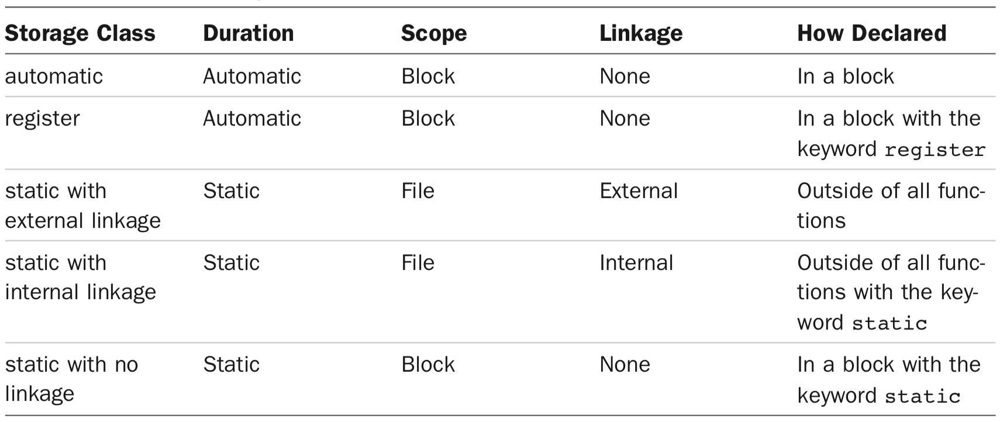

[toc]

## 12. Storage Classes, Linkage, and Memory Management

### 12.1 存储类别（Storage Classes）

C提供了集中不同的模型（*storage classes*），用于在内存中存储数据。

每个值都需要占据物理内存。C将这块内存称为*对象（object）*。对象可以存放一个或多个值。一个对象可能尚未存储任何值，但它已为存储相应值预留了正确地空间。

一个对象有*storage duration*，指它会在内存中驻留多久。用于访问对象的标示符有*scope*和*linkage*，二者决定程序的哪一部分可以使用该标示。storage classes是scope, linkage和storage duration的不同组合。标示符可以在多个源文件之间共享，可以被一个文件中的所有函数使用，或只能被一个函数使用，或只能被函数的某一部分使用。对象可以在整个程序存在期间存在，或只在某个函数执行期间存在。对于并发编程，对象只在某个线程期间存在。还可以通过显式的函数调用，来分配或释放一块数据。

#### 作用域（Scope）

Scope描述程序中可以访问某个标示符的区域。变量有以下作用域（scopes）：块作用域、函数作用域、函数原型作用域或文件作用域。块指大小括号包围的一块区域。定义在块的变量具有块作用域。函数形参，也具有块作用域，也属于所在函数的作用域。

历史上，块作用域的变量必须在块的开头声明。C99放宽了这条限制，允许你再块内任何地方声明变量。例如，现在可以在for循环的控制部分声明变量。

    for (int i = 0; i < 10; i++)
	    printf("A C99 feature: i = %d", i);

C99扩展了块作用域的概念，包含了`for`循环、`while`循环、`do while`循环或`if`控制的代码——即使不使用大括号！例如，上面的for循环，`i`属于`for`循环块。当循环执行完后，程序无法再看到`i`。

Function scope applies just to labels used with `goto` statements. This means that even if a label first appears inside an inner block in a function, its scope extends to the whole function. It would be confusing if you could use the same label inside two separate blocks, and function scope for labels prevents this from happening.

函数原型作用域适用于函数原型中得变量：

	int mighty(int mouse, double large);

函数原型作用域从变量定义处开始，到原型声明结尾。编译器只关心函数原型中参数的类型，名字是不重要的。但有些情况下名字是有用的，例如variable-length array parameters：

	void use_a_VLA(int n, int m, ar[n][m]);

If you use names in the brackets, they have to be names declared earlier in the prototype.

定义在函数之外的变量具有文件作用域。具有文件作用域的变量可见范围从定义处到文件末尾。例如下面的`units`变量。

    #include <stdio.h>
    int units = 0;
    void critic(void);
    int main(void)
    {
    ...
    }

C预处理器会将`#include`指令替换为头文件的内容。因此编译器看到的一个文件包括源文件和一些头文件。这个文件称为一个translation unit。具有文件作用域的变量，实际对整个translation unit可见。

#### 链接性（Linkage）

一个C变量具有下面某种linkages：外部链接、内部链接或无链接。块作用域、函数作用域或函数原型作用域的变量没有链接，这表明它们是它们所在的块、函数或原型私有的。文件作用域的变量可以具有外部链接或内部链接。具有外部链接的变量可以在一个多文件程序的所有地方使用。具有内部链接的变量只能在单个translation unit内使用。

```c
    int giants = 5; // 文件作用域，外部链接
    static int dodgers = 3; // 文件作用域，内部链接
    int main()
    {
        ...
    }
    ...
```

`giants`可以被同一个程序的其他文件使用。但`dodgers`只能在定义的文件中使用。

#### 存储期（Storage Duration）

Scope和linkage描述标示符的可见性。Storage duration描述标示符执行的对象的持久性。一个C对象有四种存储期：静态存储期、线程存储期、自动存储期和预分配的（allocated）存储期。

静态存储期的对象，在整个程序执行期间存在。文件作用域的变量具有静态存储期，不管是外部链接还是内部链接的。对文件作用域的变量施加`static`修改改变链接（Linkage）类型，不该存储期——总是静态存储的。

线程存储期的变量的存在，从它声明处到线程结束时。Such an object is created when a declaration that would otherwise create a file scope object is modified with the keyword `_Thread_local`. When a variable is declared with this specifier, each thread gets its own private copy of that variable.

块作用域的变量一般具有自动存储期。当程序进入块时为这些变量分配内存，退出时释放内存。

Variable-length arrays provide a slight exception in that they exist from the point of declaration to the end of the block rather than from the beginning of the block to the end.

若想块作用域的变量具有静态存储期，声明时加`static`关键字。

    void more(int number) {
        int index;
        static int ct = 0; ...
        return 0;
    }

`ct`存储与静态内存；它存储从程序被加载到程序结束。但它的作用域仅在`more()`，仅在该函数内可以使用该变量。（或者暴露它的地址，间接访问。）

作用域、链接和存储期的组合，形成5种*存储类*：automatic, register, static with block scope, static with external linkage, and static with internal linkage.



**自动变量**

利用`auto`显式声明：

    int main(void) {
	    auto int plox;

**C++**中`auto`有特殊含义。因此为了兼容**C/C++**，不要使用该关键字。

对于循环或if块，更完整地说法，an entire loop is a sub-block to the block containing it, and the loop body is a sub-block to the entire loop block.

Some compilers may not support these C99/C11 scope rules. (At this time Microsoft Visual Studio 2012 is one of those compilers.) Others may provide an option for activating these rules. For example, at the time of this writing, GCC supports many C99 features by default but requires using the `–std=c99` option to activate the features used in Listing 12.2:

	gcc –std=c99 forc99.c

Similarly, versions of GCC or Clang may require using the `–std=c1x` or `-std=c11` options to recognize C11 features.

除非显示声明，否则自动变量不会被初始化。

**寄存器变量**

Because a register variable may be in a register rather than in memory, you can’t take the address of a register variable. In most other respects, register variables are the same as automatic variables.

    int main(void) {
    	register int quick;

We say “with luck” because declaring a variable as a register class is more a request than a direct order. The compiler has to weigh your demands against the number of registers or amount of fast memory available, or it can simply ignore the request, so you might not get your wish. In that case, the variable becomes an ordinary automatic variable; however, you still can’t use the address operator with it.

You can request that formal parameters be register variables. Just use the keyword in the function heading:

	void macho(register int n)

The types that can be declared register may be restricted. For example, the registers in a processor might not be large enough to hold type `double`.

**块作用域的静态变量**

若未显式初始化，静态变量被初始化为0。

You can’t use `static` for function parameters:

	int wontwork(static int flu); // not allowed

**外部链接的静态变量**

外部存储类（静态存储、外部链接、文件作用域）的变量称为**外部变量（external variables）**。You create an external variable by placing a defining declaration outside of any function. 从文档的角度看，在函数中声明（不是定义！）一个外部变量需要`extern`关键字。当使用的外部变量不在本源文件中定义时，在使用处声明是必须得。

    int Errupt; /* 外部定义的变量 */
    double Up[100]; /* 外部定义的数组 */
    extern char Coal; /* 如果Coal定义在其他文件中，extern是必须的 */
    void next(void);
    int main(void) {
        extern int Errupt; /* optional declaration */
        extern double Up[]; /* optional declaration */
        ...
    }

若在函数中省略`extern`，会创建一个独立的自动变量。

若不显式赋值，外部变量自动被初始化成零。Unlike the case for automatic variables, you can use only constant expressions to initialize file scope variables:

	int x = 10; // ok, 10是常量
	int y = 3 + 20; // ok, 常量表达式
    size_t z = sizeof(int); // ok, 常量表达式
    int x2 = 2 * x; // 不行，不能是变量！

The C99 and C11 standards require compilers to recognize the first 63 characters for local identifiers and the first 31 characters for external identifiers. This revises the previous requirement of recognizing the first 31 characters for local identifiers and the first 6 characters for external identifiers.

一个外部变量只能被初始化一次，且只能在变量定义时初始化。不能在声明时，如：

    // file one.c
    char permis = 'N';
    ...
    // file two.c
    extern char permis = 'Y'; /* error */

**静态变量、内部链接**

You can redeclare any file scope variable within a function by using the storage class specifier extern. Such a declaration doesn’t change the linkage.

    int traveler = 1; // external linkage
	static int stayhome = 1; // internal linkage int main()
    {
        extern int traveler; // use global traveler
        extern int stayhome; // use global stayhome
        ...

**多文件**

Note that an external variable defined in one file is not available to a second file unless it is also declared (by using `extern`) in the second file.

Historically, however, many compilers have followed different rules in this regard. Many Unix systems, for example, enable you to declare a variable in several files without using the extern keyword, provided that no more than one declaration includes an initialization. If there is a declaration with an initialization, it is taken to be the definition.

### （未）12.2 随机数函数与静态变量

使用定义在其他源文件中得函数时，需要在本文件中声明。声明可以加`extern`也可以不加。

	extern int rand0(void);

### （未）12.3 Roll ’Em

### 12.4 分配内存：`malloc()`和`free()`

`malloc()`取一个参数：需要的字节数。`malloc()`返回分配内存的第一个字节的地址。可以将其赋予一个指针变量。由于`char`表示一个字节，`malloc()`一般定义为指向`char`的指针。ANSI C允许定义一种新类型，指向`void`的指针，即通用指针。然后将其强制类型转换到相应的类型。Under ANSI C, you should still typecast for clarity, but assigning a pointer-to-void value to a pointer of another type is not considered a type clash. 如果分配失败`malloc()`返回空指针。

例子，创建一个数组：

    double * ptd;
    ptd = (double *) malloc(30 * sizeof(double));

Prior to C99, you couldn’t do the following:

	double item[n]; /* pre C99: not allowed if n is a variable */

However, you can do the following, even with a pre-C99 compiler:

	ptd = (double *) malloc(n * sizeof(double)); /* okay */

`free()`的参数是`malloc()`返回的地址，释放之前分配的内存。因此分配的内存的存活期从`malloc()`到`free()`。Both `malloc()` and `free()` have prototypes in the **stdlib.h** header file.

    ptd = (double *) malloc(max * sizeof (double));
    if (ptd == NULL)
    {
        ...

The typecast to `(double *)` is optional in C but required in **C++**, so using the typecast makes it simpler to move a program from C to **C++**.

Some operating systems will free allocated memory automatically when a program finishes, but others may not. So use `free()` and don’t rely on the operating system to clean up for you.

内存分配的另一个选项是`calloc()`。

    long * newmem;
    newmem = (long *)calloc(100, sizeof (long));

Like `malloc()`, `calloc()` returns a pointer-to-char in its pre-ANSI version and a pointer-to-void under ANSI. You should use the cast operator if you want to store a different type. `calloc()`的两个参数分别是，内存单元数量，及一个内存单元的大小，二者都是无符号整数。

The `calloc()` function throws in one more feature: It sets all the bits in the block to zero. (Note, however, that on some hardware systems, a floating-point value of 0 is not represented by all bits set to 0.)

The `free()` function can also be used to free memory allocated by `calloc()`.

However, you should not try to free the same block of memory twice.

VLAs are more convenient for multidimensional arrays. You can create a two-dimensional array using `malloc()`, but the syntax is awkward. If a compiler doesn’t support the VLA feature, one of the dimensions has to be fixed, just like in function calls:

    int (* p2)[6];
    p2 = (int (*)[6]) malloc(n * 6 * sizeof(int)); // n * 6 array

Typically, a program uses different regions of memory for static objects, automatic objects, and dynamically allocated objects.

### 12.5 ANSI C Type Qualifiers

You’ve seen that a variable is characterized by both its type and its storage class. C90 added two more properties: constancy and volatility. These properties are declared with the keywords `const` and `volatile`, which create qualified types. The C99 standard added a third qualifier, `restrict`, designed to facilitate compiler optimizations. And C11 adds a fourth, `_Atomic`. C11 provides an optional library, managed by **stdatomic.h**, to support concurrent programming, and `_Atomic` is part of that optional support.

C99 granted type qualifiers a new property—they now are idempotent! Although this sounds like a powerful claim, all it really means is that you can use the same qualifier more than once in a declaration, and the superfluous ones are ignored:

	const const const int n = 6; // same as const int n = 6;

This makes it possible, for example, for the following sequence to be accepted:

	typedef const int zip;
    const zip q = 8;

#### 12.5.1 const

`const`可以处于三个位置：

	float const * pfc; // same as const float * pfc;

注意如何在多个文件之间共享常量数据。有两个策略可用。第一个策略是利用`extern`声明：

    /* file1.c -- defines some global constants */
    const double PI = 3.14159;
    const char * MONTHS[12] =
    {"January", "February", "March", "April", "May", "June", "July", "August", "September", "October", "November", "December"};
    /* file2.c -- use global constants defined elsewhere */
    extern const double PI;
    extern const * MONTHS[];


第二种方法是将常量放入头文件。

    /* constant.h -- defines some global constants */
    static const double PI = 3.14159;
    static const char * MONTHS[12] =
    {"January", "February", "March", "April", "May", "June", "July", "August", "September", "October", "November", "December"};
    /* file1.c -- use global constants defined elsewhere */
    #include "constant.h"
    /* file2.c -- use global constants defined elsewhere */
    #include "constant.h"

如果不加`static`，包含**constant.h**将导致每个源文件中包含相同标示的重复定义，这是标准不允许的。加`static`，每个文件实际获得的是同一个常量的不同拷贝。

#### 12.5.2 volatile

The `volatile` qualifier tells the compiler that a variable can have its value altered by agencies other than the program. It is typically used for hardware addresses and for data shared with other programs or threads running simultaneously. For example, an address might hold the current clock time.

The syntax is the same as for const:

    volatile int loc1; /* loc1 is a volatile location */
    volatile int * ploc; /* ploc points to a volatile location */

为什么要增加`volatile`关键字，为了优化。例如下面的代码，`x`可以放入寄存器以加速第二个读取。但仅当`x`不会被外部改变。ANSI之前，是没法优化的，因为不确定是否会被外部改变。在ANSI之后，假定不加`volatile`关键字的变量不会被外部改变，可以缓存优化。

    val1 = x;
    /* some code not using x */
    val2 = x;

A value can be both `const` and `volatile`. 顺序不重要。

    volatile const int loc;
    const volatile int * ploc;

#### （未）The `restrict` Type Qualifier

The `restrict` keyword enhances computational support by giving the compiler permission
to optimize certain kinds of code. It can be applied only to pointers, and it indicates that a pointer is the sole initial means of accessing a data object. To see why this is useful, we need to look at a few examples. Consider the following:

    int ar[10];
    int * restrict restar = (int *) malloc(10 * sizeof(int));
    int * par = ar;

Here, the pointer restar is the sole initial means of access to the memory allocated by `malloc()`. Therefore, it can be qualified with the keyword restrict. The pointer par, however, is neither the initial nor the sole means of access to the data in the ar array, so it cannot be qualified as restrict.

#### （未）The `_Atomic` Type Qualifier (C11)

#### （未）New Places for Old Keywords