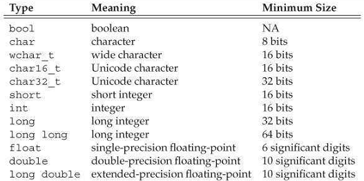
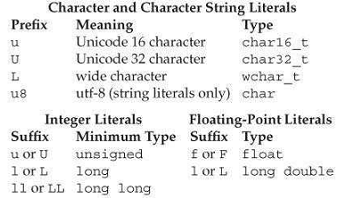
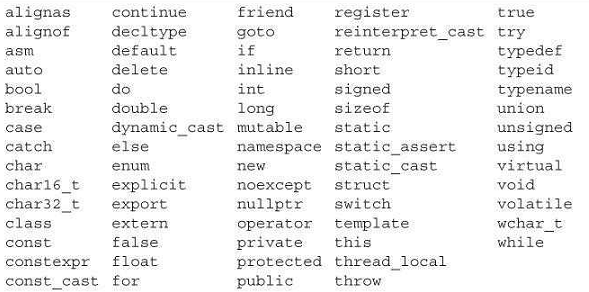
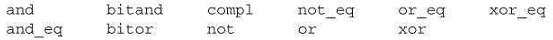

[toc]

## 2. 变量和基本类型

### 2.1 基本（Primitive）内建类型

基本类型包括算术（arithmetic）类型和 `void`。算术类型包括字符、整数、布尔、浮点数。

#### 2.1.1 算术类型

分两类：整数（包括字符、布尔）和浮点。

在不同的机器上，算术类型的大小不同。标准规定了**下限**（见下表）。允许编译器使用更大的大小。



字符类型有几种。多数用于国际化。最基本的是`char`。A char is guaranteed to be big enough to hold numeric values corresponding to the characters in the machine’s **basic** character set. That is, a char is the same size as a single machine **byte**.

剩下的字符类型（`wchar_t`, `char16_t`, `char32_t`）用于扩展字符集。`wchar_t` 保证能容纳机器上最大的字符集。`char16_t` 和 `char32_t` 用于Unicode字符。

语言保证 `int` 至少与 `short` 一样大；`long` 至少与 `int` 一样大；`long long` 至少与 `long` 一样打。`long long` 是新标准引入的。

**有符号与无符号类型**

**除了bool和扩展字符集类型**，整数类型可以是有符号的或无符号的。

标准没有规定有符号类型如何表示，只是规定范围在正数和负数之间均分。

与其他整数类型不同，基本字符类型有三种：`char`, `signed char`, `unsigned char`。注意 `char` 与 `signed char` 不是一种类型。尽管有三种类型，但只有两种表示：有符号和无符号。`char` 类型（不加任何限定的char）使用其中一种，究竟是哪一种取决于编译器。

不要在算术表达式中使用普通 `char` 或 `bool`。计算中涉及 `char` 将会带来问题 —— 因为有些机器上 `char` 是有符号的但有些机器上是无符号的。如果需要一个小整数，**显式**指定是否有符号：`signed char` 或 `unsigned char`。

#### 2.1.2 类型转换

这里讨论一种变量向另一种变量**赋值**。4.11节还会继续讨论转换问题。

把非布尔型的算术类型赋给 `bool` 变量，值为0是结果为false，其他情况为true。把 `bool` 赋给其他算术类型，如果 `bool` 是true则结果是1，false则结果是0。

把浮点值赋给整数类型，值会被截断。整数赋给浮点，小数部分是0。若整数比浮点数能容纳的打，精度（precision）会丢失。

把一个超出范围的值a赋给一个无符号类型，结果是a对目标类型能容纳的最大值取模。例如，8位无符号 `char` 可以容纳 0 到 255。若赋给它一个过大的数，则结果是对256取模后的余数。因此，给它赋值 -1，得到 255。

将超出范围的值赋给**有符号**类型结果是不确定的。程序可能崩溃，或产生垃圾值。

在期望一种类型的地方使用另一种类型的值，编辑器将进行上述的类型转换。例如：

```cpp
int i= 42;
if (i) // condition will evaluate as true
    i = 0;
```

涉及无符号类型的表达式，例如表达式中有 `unsigned` 和 `int` ，`int` 值被转换为无符号的。将 `int` 转换为 `unsigned` 就相当于我们将一个 `int` 赋值给 `unsigned`。

**从一个无符号数减去一个值（不管是否有符号），要确保结果不为负**：

```cpp
unsigned u1 = 42, u2 = 10;
std::cout << u1 - u2 << std::endl; // ok: result is 32
std::cout << u2 - u1 << std::endl; // ok: but the result will wrap around
```

> 注意：**不要混用有符号数和无符号数**。当有符号数为负数时，混用有符号数和无符号数的表达式将产生意外结果。记住**有符号数会自动转换为无符号数**。

#### 2.1.3. 字面量

字面量有类型。

##### 整型和浮点字面量

0开头是八进制。`0x`或`0X`开头是十六进制。

整数字面量的类型取决于其值和记号。默认十进制字面量是有符号的，而八进制和十六进制默认可能是有符号或无符号的。十进制的字面量的类型是 `int` 或 `long` 或 `long long` —— 取能容纳值中最小的类型。八进制和十六进制字面量类型是 `int`、 `unsigned int`、`long`、 `unsigned long`、 `long long` 或 `unsigned long long` 中能容纳字面量的最小的类型。如果最大类型都无法容纳此字面量，报错。
没有 `short` 类型的字面量。通过后缀可以覆盖这些默认特性。

Table 2.2. 指定字面量类型


技术上说，十进制字面量不会是负数。例如`-42`, 减号不是字面量的一部分。减号是**负操作符**。

浮点数字面量默认类型是`double`。

##### 字符和字符串

单引号包裹单个字符的字面量是 `char`。双引号包括零个或多个字符是字符串字面量：

```cpp
'a'  // character literal
"Hello World!"  // string literal
```

字符串字面量的类型是**常量char的数组**。编译器会向每个字符串字面量最后追加null（‘\0’）字符。

两个相邻的字符串字面量，中间有空格、Tab、换行，会被合并成单个字面量。

##### 转义

    newline    \n    horizontal tab    \t    alert (bell)    \a
    vertical tab    \v    backspace    \b    double quote  \"
    backslash    \\    question mark    \?   single quote    \'
    carriage return   \r    formfeed    \f

We can also write a generalized escape sequence, which is \x followed by one or more hexadecimal digits or a `\` followed by one, two, or three octal digits. The value represents the numerical value of the character.

Note that if a \ is followed by more than three octal digits, only the first three are associated with the \ . For example, "\1234" represents two characters: the character represented by the octal value 123 and the character 4. In contrast, \x uses up all the hex digits following it; "\x1234" represents a single, 16-bit character composed from the bits corresponding to these four hexadecimal digits. Because most machines have 8-bit chars, such values are unlikely to be useful. Ordinarily, hexadecimal characters with more than 8 bits are used with extended characters sets using one of the prefixes from Table 2.2.

##### 指定字面量的类型

可以利用前缀或后缀改变整数、浮点数、字符字面量的默认类型：

```cpp
L'a' // wchar_t
u8"hi!" // utf-8 string literal
42ULL // unsigned integer literal, type is unsigned long long
1E-3F // 但精度浮点字面量
3.14159L // long double
```

##### 布尔和指针字面量

`true` 和 `false` 是 `bool` 类型的字面量。

```cpp
bool test = false;
```

`nullptr` 是一个指针字面量。后面会细讲。

### 2.2 变量

#### 2.2.1 变量定义

简单的变量定义包含一个类型限定符，接着是一个或多个变量名（逗号分隔），最后是分号。变量后可以跟初始值：

```cpp
int sum = 0, value, units_sold = 0;
Sales_item item;
std::string book("0-201-78345-X"); // book是变量，括号内是初始值
```

##### 初始化器

在C++中，**初始化和赋值是两种不同的操作**。初始化指变量创建时被给于的值。而赋值，会消灭对象的当前值，用新值替代。

##### 列表初始化（List Initialization）

有几种不同的初始化方式。例如下面四种方式都是将 `units_sold` 初始化为0：

```cpp
int units_sold = 0;
int units_sold = {0};
int units_sold{0};
int units_sold(0);
```

`{}` 用于通用的初始化，是新标准引入的，称为**列表初始化**。之前只能在特殊情况下使用。现在可以用于所有需要初始化对象的时候，有时，也可以用于为对象赋新值（赋值）。

当变量是内建类型，若可能发生信息丢失，则编译器将不允许使用列表初始化这一初始化方式：

```cpp
long double ld = 3.1415926536;
int a{ld}, b = {ld}; // 错误：narrowing conversion required
int c(ld), d = ld; // 可以：值会被截断
```

`long double` 类型的 `ld`，即使去掉小数部分，整数部分也可能无法被 `int` 容纳。

##### 默认（Default）初始化

定义变量时若不指定初始化器，则变量将被默认初始化。默认值取决于变量类型和变量定义的位置。

内建类型的默认值取决于定义位置。函数之外定义初始化为0（一个例外见§6.1.1）。函数内定义的内建类型值是**未初始化的**。未初始化的值是不定的（§2.1.2）。尝试拷贝或访问未初始化的变量的值是错误的。

类控制如何初始化类的实例。由类决定对象是否可以不被初始化。如果不被初始化，也是由类决定默认值是什么。多数类允许不显式初始化。例如库类`string`，如果不初始化，则默认是空串：

```cpp
std::string empty; // 隐式初始化为空串
```

#### 2.2.2 变量声明（Declarations）与定义（Definitions）

为允许程序可以被分解为多个逻辑部分，C++支持separate compilation。分离编译允许我们将程序分成几个文件，每个可以被独立编译。

当程序被分解成多个文件，我们需要能够在文件之间共享代码。例如，一段代码需要用到在另一个文件中定义的变量。例如 `std::cout` 和 `std::cin`。

为支持分离编译，C++区分了声明（declarations）和定义（definitions）。声明让一个名字对程序可知。文件中若使用了定义在其他文件中的名字，需要在文件中声明此名字。定义创建相应的实体。

变量声明指定变量的类型和名称。变量定义也是声明。除了指定名字和类型，定义也会分配空间，还可能初始化值。

声明加 `extern` 关键字。不要带初始化。

```cpp
extern int i;  // declares but does not define i
int j;  // declares and defines j
```

任何包含显式初始化的声明都是定义。初始化可以跟 `extern` 一起存在，但初始化会覆盖 `extern`，及此时声明变成了定义：

```cpp
extern doublepi = 3.1416; // definition
```

如果在函数内，初始化和 `extern` 一起出现是错误的。

变量只能被定义一次，但可以被声明多次。

如果在多个文件中使用一个变量，变量需要被定义一次，声明多次。

We’ll have more to say about how C++ supports separate compilation in § 2.6.3 and § 6.1.3.

#### 2.2.3 标示符（Identifiers）

标示符可以包含字母、数字和下划线。语言不限制名字长度。标识符必须以字母或下划线开头。

保留字



Table 2.4.C++ Alternative Operator Names



标准还保留了一些名字用于标准库。我们定义的标示符不要包含两个连续的下划线，也不要出现下划线加大写字母开头。在函数外定义的标示符不要以下划线开头。

#### 2.2.4 一个名字的作用域

Most names defined outside a function has global scope.

### 2.6 定义我们自己的数据结构

库类型 string、 istream 和 ostream 都是类。

#### 2.6.1 定义 `Sales_data` 类

```cpp
struct Sales_data {
    std::string bookNo;
    unsigned units_sold = 0;
    double revenue = 0.0;
};
```

大括号后必须有一个分号。使用分号的原因是，可以在类后面跟随变量定义：

```cpp
struct Sales_data{ /* ... */ } accum, trans, *salesptr;

// equivalent, but better way to define these objects
struct Sales_data { /* ... */ };
Sales_data accum, trans, *salesptr;
```

---

**类数据成员**

新标准允许我们为数据成员提供**类内初始化（in-class initializer）**。创建对象时，类内初始化将用于初始化数据成员。没有初始化器的成员会被**默认初始化(§2.2.1)**。因此定义 `Sales_data` 对象时，`units_sold` 和 `revenue` 将被初始化为`0`，`bookNo` 将被初始化为空字符串。

类内初始化的形式是受限的(§2.2.1)：或者包裹在大括号中，或者后面跟 `=`。不能将类内初始化放入圆括号。

§7.2 将引入另一个关键字 `class`。在此之前我们将使用 `struct`。第七章会讲二者的区别。

---

#### 2.6.2 使用 `Sales_data` 类

We’ll assume that our `Sales_data` class is defined inside `Sales_data.h`.

程序结构：

```cpp
    #include <iostream>
    #include <string>
    #include "Sales_data.h"
    int main()
    {
        Sales_data data1, data2;
    }
```

```cpp
    double price = 0;
    std::cin >> data1.bookNo >> data1.units_sold >> price;
    data1.revenue = data1.units_sold * price;

    if (data1.bookNo== data2.bookNo) {
    	unsigned totalCnt = data1.units_sold + data2.units_sold;
    	double totalRevenue = data1.revenue + data2.revenue;
    	// print: ISBN, total sold, total revenue, average price per book
    	std::cout << data1.bookNo << " " << totalCnt <<" " << totalRevenue << " ";
        if (totalCnt != 0)
        	std::cout << totalRevenue/totalCnt << std::endl;
        else
        	std::cout << "(no sales)" << std::endl;
        return 0; // indicate success
    } else {
        std::cerr << "Data must refer to the same ISBN" <<std::endl;
        return -1; // indicate failure
    }
```

#### 2.6.3 编写自己的头文件

为确保所有文件中类定义相同，**类一般定义在头文件中**。

头文件一般包含只能被定义一次的实体（类定义、常量、constexpr变量）。头文件一般也要用到其他头文件。如 `Sales_data` 类有一个string成员，于是 `Sales_data.h` 必须包括 `string` 头。使用 `Sales_data` 的程序也必须包含 `string` 头。于是使用 `Sales_data` 的程序将包含string头两次。**我们的头的写法需要在多次包含时仍保证安全**。

头文件更改时，依赖的源文件必须被重新编译。

##### 预处理器简要介绍

安全的包含头多次的技术依赖**预处理器**。

预处理器变量有两种可能的状态：定义或未定义。`#define` 指令将一个名字定义为一个预处理器变量。有两个指令测试给定的预处理变量是否被定义： `#ifdef` 和 `#ifndef`。只有在测试为true时，`#ifdef` 或 `#ifndef` 内部的东西才会被处理。

```cpp
    #ifndef SALES_DATA_H
        #define SALES_DATA_H
        #include <string>
        struct Sales_data {
            std::string bookNo;
            unsigned units_sold = 0;
            double revenue = 0.0;
        };
    #endif
```

注意：预处理器变量名不遵循C++作用域规则。

为避免与普通变量名冲突，预处理变量一般全大写。