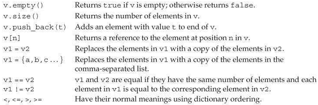

[toc]

## 3 字符串、向量、数组

`string`是变长字符串。`vector`是变长集合。

### 3.1 命名空间 `using` 声明

之前使用 `cin` 时显式列出了库名，如 `std::cin`。 `using` 可以让使用 `cin` 时不加限定。18.2.2 给出了使用命名空间中名字的另一种方式。

`using`声明的形式：

```cpp
using namespace::name;
```

例子：

```cpp
    #include <iostream>
    using std::cin;
    int main()
    {
        int i;
        cin >> i;
        cout << i; // 错误
        std::cout << i; // 可以
        return 0;
    }
```

每个名字都需要一个`using`声明：

```cpp
using std::cin;
using std::cout;
using std::endl;
```

**头文件中不要使用using声明**！在头中使用using声明，任何包含头的程序都将得到相同的using声明。可能引起冲突。

### 3.2 `string` 类型

`string` 是变长字符序列。要使用 `string` 类型，必须包含 `string` 头。 `string` 定义在 `std` 命名空间。

```cpp
    #include <string>
    using std::string;
```

本节介绍基本的string操作。§9.5 将介绍更多。

#### 3.2.1 定义和初始化string

实例化string的常见方式：

```cpp
string s1; // 默认初始化，s1是空串
string s2(s1); // s2是s1的拷贝
string s2 = s1; // 等价于s2(s1)
string s3("value"); // s3是字符串字面量的拷贝，不包括null
string s2 = "value"; // 等价于s3("value")
string s4(n, 'c'); // 重复c字符n次
```

使用 `=` 是拷贝初始化。省略 `=` 是直接初始化。

```cpp
string s5 = "hiya"; // 拷贝初始化
string s6("hiya");  // 直接初始化
string s7(10, 'c'); // 直接初始化; s7 is cccccccccc
```

#### 3.2.2 string运算

Table 3.2 lists the most common string operations.


##### 读写string

```cpp
int main()
{
    string s; // 空字符串
    cin >> s; // read a whitespace-separated string into s
    cout << s << endl;
    return 0;
}
```

读取，抛弃所有前面的空白符。然后读取直到遇到下一个空白符。

读写时，可以串入多个变量：

```cpp
string s1, s2;
cin >> s1 >> s2; // 先读入s1，再读入s2
cout << s1 << s2 << endl; // write both strings
```

##### 读取数量不定的string

```cpp
int main()
{
    string word;
    while(cin >> word) // 直到文件结尾
        cout << word << endl;
    return 0;
}
```

##### 使用 `getline` 读入整行

有时不想忽略空白符。此时，可以用 `getline` 函数。`getline` 取一个输入流和一个 `string`。读取一行（不包括换行符）到 `string` 参数。`getline` 在新行处停止读取，即使换行是行的第一个字符，此时读取到的是空串。

与输入运算符一样，`getline` 返回 `istream`。`getline` 也可以被用作条件。

```cpp
int main()
{
    string line;
    while(getline(cin, line))
        cout << line << endl;
    return 0;
}
```

##### `empty` 和 `size`

`empty`是string的成员函数，返回bool。

```cpp
while (getline(cin, line))
    if(! line.empty())
        cout << line << endl;
```

`size` 成员函数返回string长度。

```cpp
string line;
while (getline(cin, line))
    if(line.size() > 80)
        cout << line << endl;
```

##### `string::size_type` 类型

`size` 返回值的类型是 `string::size_type`。

string类（和其他库类）定义了一些伙伴类。这些伙伴类使得库可以独立于机器。

尽管无法确定 `string::size_type` 的精确类型，但可以确定它是一个**无符号**整数，达到可以容纳任何字符串的长度。用以存储字符串长度的变量的类型应该是 `string::size_type`。新标准下，可以用 `auto` 或 `decltype`：

```cpp
auto len = line.size(); // len类型是string::size_type
```

因为 `size` 返回无符号数，混合有符号和无符号数的表达式可能产生意外结果(§2.1.2)。例如如果 `n` 是 `int`，其值为**负数**，则 `s.size() < n` 几乎总是true！

##### 比较字符串

`==` 和 `!=` 可用于测试字符串是否相同（字符相同）。`<`, `<=`, `>`, `>=` 也可以使用。

##### 赋值

多数库类型支持赋值。我们可以将一个 `string` 赋值给另一个：

```cpp
string st1(10, 'c'), st2;
st1 = st2; // 赋值：st1得到st2的拷贝！
```

##### 两个字符串加

连接两个字符串，产生新字符串：

```cpp
string s1 = "hello, ", s2 = "world\n";
string s3 = s1 + s2; // s3 is hello, world\n
s1 += s2; // equivalent to s1 = s1 + s2
```

##### 字符串和字面量加

```cpp
string s1= "hello", s2 = "world";
string s3 = s1 + ", " + s2 + '\n';
```

`+` 的操作数至少有一个需要是 `string`：

```cpp
string s4= s1 + ", "; // 可以：第二个参数是字面量
string s5 = "hello" + ", "; // 错误！
string s6 = s1 + ", " + "world"; // 可以
string s7 = "hello" + ", " + s2; // 错误！第一个加两边都是字符串字面量
```

{{字符串字面量没有 `+` 运算符}}

记住，字符串字面量与 `string` 不是一回事。

#### 3.2.3. 处理 string 中的字符

下列函数定义在 `cctype` 头：

Table 3.3. cctype Functions


> **C++**版本的C库头
 `C++`库使用了C库。C库以 `.h` 结尾。`C++`版本的这些头没有 `.h`，并增加了c前缀。c表示头是C库的一部分。因此 cctype 与 ctype.h 的内容相同。`c` 开头的头文件定义在 `std` 命名空间。但 `.h` 版没有。一般来说，`C++` 程序应该使用*没有.h*版本的头文件。

##### 用范围for处理每一个字符

如果想处理每一个字符，最好用新标准引入的范围for（**range for**）。语法：

```cpp
for (declaration: expression)
    statement
```

例子：
```cpp
string str("somestring");
// print the characters in str one character to a line
for (auto c : str)  // for every char in str
    cout << c << endl;
```

##### 利用范围for改变string中的字符

如果向改变 `string` 中的字符，需要将循环变量做成引用类型：

```cpp
string s("Hello World!!!");
// convert s to uppercase
for (auto &c : s)
    c = toupper(c);
cout << s << endl;
```

{{使用 `toupper` 并不需要引入任何头文件}}

##### 只处理部分字符

有两种方式访问string中的单个字符：可以使用下标或迭代器。

下标运算符（`[]`运算符）取 `string::size_type` 值。`s[0]` 是第一个字符，最后一个是 `s[s.size() - 1]`。

越界的结果是未定义的。下标访问空串的结果是未定义的。

如果下标是一个**有符号类型**，值会先被转换为 `string::size_type` 表示的无符号类型。

只要 `string` 不是常量，我们可以给下标获得的值（变量）赋新值。｛｛因为下标返回的是左值｝｝

```cpp
string s("somestring");
s[0] = toupper(s[0]);
```

##### 使用下标迭代

```cpp
for (decltype(s.size()) index = 0; index != s.size() && !isspace(s[index]); ++index)
    s[index]= toupper(s[index]);
```

### 3.3 库vector类型

需要包含 `vector` 头：

```cpp
    #include <vector>
    using std::vector;
```

`vector` 是类模板。C++中有**类模板**和**方法模板**。

模板自身不是函数或类。可以将它们看做生成类或函数的编译器指令。编译器从模块创建类或函数的过程称为**instantiation**。

```cpp
    vector<int> ivec;
    vector<Sales_item> Sales_vec;
    vector<vector<string>> file;
```

上面的例子中，编译器会从 `vector` 模板产生三种**类型**：`vector<int>`, `vector<Sales_item>` 和 `vector<vector<string>>`。

`vector` 几乎可以容纳任意类型。因为引用不是对象，因此不能有引用类型的向量。向量的元素可以也是向量。

> 注意早期 C++，定义 vector 的 vector 有不同的语法。早起最后的尖括号与前面的尖括号直接必须有空格，如 `vector<vector<int> >`。｛｛因为 >> 是特殊符号｝｝

#### 3.3.1 定义和初始化`vector`

```cpp
	vector<T> v1; // 默认初始化，v1是空的
	vector<T> v2(v1); // v2是v1的拷贝。必须具有相同类型。
    vector<T> v3(n, val);
    vector<T> v4(n);
    vector<T> v5{a,b,c,...};
    vector<T> v5 = {a,b,c,...}; // 等价于v5{a,b,c,...}
```

可以默认初始化一个 `vector`（§2.2.1）：创建一个空向量。

可以在运行时向向量添加元素。

##### 列表初始化一个向量

新标准引入列表初始化：

```cpp
	vector<string> articles = {"a", "an", "the"};
```

使用拷贝初始化，只能提供一个值。提供类内初始化器时，只能使用拷贝初始化或大括号。传入一个列表时只能用大括号不能用小括号。

```cpp
    vector<string> v1{"a","an", "the"}; // 列表初始化
    vector<string> v2("a", "an", "the"); // 错误
```

##### 创建特定数量的元素

初始化指定数量的元素：

```cpp
    vector<int> ivec(10, -1); // 10个-1
    vector<string> svec(10, "hi!");
```

##### 值初始化

可以省略值，只提供大小。此时，库将创建一个 *value-initialized element initializer*。库产生的值将被用作初始化容器内的每个元素。元素初始化器的值取决于容器内元素的类型。

如果元素是内建类型，如 `int`，则元素初始化器是 `0`。如果元素是类类型，如 `string`，元素初始化器自己将被**默认初始化**：

```cpp
    vector<int> ivec(10); // each initialized to 0
    vector<string> svec(10); // each an empty string
```

这种形式的初始化有两个限制：第一个限制是，一些类要求我们必须提供一个显式的初始化器。如果vector容纳的对象的类不允许默认初始化，则我们必须提供一个初始元素值；只提供向量大小是不够的。

第二个限制是，只提供元素数量，不提供初始化值，必须使用直接形式的初始化：

```cpp
	vector<int> vi = 10; // 错误：只能使用直接形式传入大小
```

##### 列表初始化还是用元素数量初始化

区别：

```cpp
    vector<int> v1(10); // v1有10个元素，都是0
    vector<int> v2{10}; // v2有1个元素，值是10
    vector<int> v3(10, 1); // v3有10个元素，都是1
    vector<int> v4{10, 1}; // v4有两个元素，分别是10和1
```

若使用大括号，但大括号内的值无法用于列表初始化，则这些值将用于构建对象。例如，下面第三个声明，`10` 不是字符串，因此`{10}` 不是列表初始化：

```cpp
    vector<string> v5{"hi"};// 列表初始化：v5只有一个元素
    vector<string> v6("hi"); // 错误
    vector<string> v7{10}; // v7具有10个默认初始化的元素
    vector<string> v8{10, "hi"}; // v8有10个元素，都是"hi"
```

要列表初始化，括号内的值必须匹配元素类型。不能用 `int` 初始化一个字符串，因此 `v7` 和 `v8` 不能是元素初始化器。若列表初始化不可行，编译器会寻找其他可以使用提供的值做初始化的方式。

#### 3.3.2 添加元素

用vector成员方法 `push_back` 添加元素。

```cpp
    vector<int> v2; // 空向量
    for (int i = 0; i != 100; ++i)
    	v2.push_back(i);
```

因为向量的增长是高效的，一般不需要指定向量为特定大小，**指定了反而有性能问题**。

如果在循环中给向量添加内容，循环就不能用range for。

#### 3.3.3.向量其他操作



```cpp
    vector<int> v{1,2,3,4,5,6,7,8,9};
    for(auto &i : v) // for each element in v
    	i *= i; // square the element value
    for (auto i : v) // for each element in v
    	cout << i << " "; // print the element
    cout << endl;
```

`size()` 返回值是 `size_type`。

```cpp
    vector<int>::size_type // ok
    vector::size_type // 错误！
```

下标的类型也是 `size_type`。注意其无符号性。

下标不会增加元素。下面的写法是错误的：

```cpp
    vector<int> ivec; // 空向量
    for (decltype(ivec.size()) ix = 0; ix != 10; ++ix)
    	ivec[ix] = ix; // disaster: ivec has no elements
```

要用 `push_back`：

```cpp
    for (decltype(ivec.size())ix = 0; ix != 10; ++ix)
        ivec.push_back(ix); // ok
```

即，只能用下标访问存在的元素！

### 3.4 Iterators介绍

不是所有容器元素都支持下标访问，但基本都支持迭代器。

与指针一样，迭代器也可以是有效的或无效的。A valid iterator either denotes an element or denotes a position one past the last element in a container. All other iterator values are invalid.

#### 3.4.1 使用迭代器

```cpp
// b表示第一个元素，e表示最后一个元素
auto b = v.begin(), e = v.end();
```

`end()` 返回迭代器常被称为**off-the-end**迭代器。如果容器为空，则 `begin` 和 `end` 返回相同的迭代器。

可以使用 `==` 或 `!=` 比较迭代器。如果迭代器指向相同或**都指向end**则相等。

解引用无效指针的结果是不定的。

不能在range for过程中更改向量长度。**改变向量长度也会使向量所有迭代器失效**。更多分析见 §9.3.6。

##### 移动迭代器

使用 `++` 移到下一个元素。

```cpp
// 遍历s直到结尾或空白符
for (auto it = s.begin(); it != s.end() && !isspace(*it); ++it)
    *it = toupper(*it); // 取大写
```

##### 迭代器类型

`iterator` 和 `const_iterator` 表示迭代器的实际类型：

```cpp
    vector<int>::iterator it;
    string::iterator it2;
    vector<int>::const_iterator it3;
    string::const_iterator it4;
```

`const_iterator` 类似于常量指针，只能读元素，不能写元素。`iterator` 类型的对象可读写。如果向量或string是**常量**，可能值只能用 `const_iteratort`。对于非常量的向量或字符串，可以使用 `iterator` 或 `const_iterator`。

##### begin和end运算符

`begin` 和 `end` 的返回值取决于它们操纵的对象是否是const。如果对象是常量，`begin` 和 `end` 返回`const_iterator`；否则返回`iterator`:

```cpp
    vector<int> v;
    const vector<int> cv;
    auto it1 = v.begin(); // it1的类型是vector<int>::iterator
    auto it2 = cv.begin(); // it2的类型是vector<int>::const_iterator
```

新标准引入两个新方法 `cbegin` 和 `cend`，它们总是返回`const_iterator`：

```cpp
	auto it3 = v.cbegin(); // it3的类型是vector<int>::const_iterator
```

##### 组合解引用和成员访问

解引用一个迭代器，得到迭代器指向的对象。接着我们可能会访问成员：

```cpp
(*it).empty()
```

`*it` 外的括号是必需的。`->` 可以简化上面的表达式。`it->mem` 等价于 `(*it).mem`。

```cpp
    for (auto it = text.cbegin(); it!= text.cend() && !it->empty(); ++it)
        cout<< *it << endl;
```

#### 3.4.2 迭代器算术

`string` 和向量的迭代器还支持 `<`, `<=`, `>`, `>=`。

迭代器可以相减。结果是有符号整数，其类型是 `difference_type`。向量和string都定义了`difference_type`。有符号，因为减法可能产生负数。

例子：二分查找。

```cpp
	// text必须已排序
    auto beg = text.begin(), end = text.end();
    auto mid = text.begin() + (end - beg)/2; // 中点
    while (mid != end && *mid != sought) {
        if(sought < *mid)
        	end = mid;
        else
        	beg = mid + 1;
        mid = beg + (end - beg) / 2;
    }
```

### 3.5 数组

数组是固定大小的。

#### 3.5.1 定义和初始化内建数组

数组是复合类型。数组的说明符形如 `a[d]`，其中 `a` 是变量名，`d` 是维数。维数必须大于0。维数必须在编译期可知，即维数必须是**常量表达式**：

```cpp
unsigned cnt = 42; // 不是常量表达式
constexpr unsigned sz = 42; // 常量表达式
int arr[10];
int *parr[sz]; // 42个指针
string bad[cnt]; // 错误: cnt不是常量表达式
string strs[get_size()]; // 如果get_size是constexpr
```

数组中的元素会被默认初始化。

> 警告：与内部类型一样，内建类型的数组，在函数内定义，被默认初始化，值是不确定的。

数组存放对象。因此没有引用的数组。

##### 显式初始化数组元素

可以列表初始化数组。此时可以省略维数。如果指定了维数，初始化器的长度不能大于维数。如果维数大于初始化器长度，剩余的值将被值初始化（§3.3.1）：

```cpp
const unsigned sz = 3;
int ia1[sz] = {0, 1, 2};
int a2[] = {0, 1, 2};
int a3[5] = {0, 1, 2}; // 最后两个元素是0
string a4[3] = {"hi", "bye"}; // 最后一个元素师空串
int a5[2] = {0,1,2}; // 错误，太多初始化器
```

##### 字符数组的特殊性

字符数组有一种额外的初始化方式：可以用字符串字面量初始化。注意字符串字面量尾部有一个空字符，该字符也会拷贝进数组：

```cpp
char a1[]= {'C', '+', '+'}; // 列表初始化
char a2[] = {'C', '+', '+', '\0'}; // 列表初始化
char a3[] = "C++"; // 包含尾部的空字符
const char a4[6] = "Daniel"; // 错误：空间不够用
```

##### 没有拷贝或赋值（Assignment）

不能将数组初始化为另一个数组的拷贝。也不能将一个数组赋给另一个数组。

```app
    int a[] = {0, 1, 2};
    int a2[] = a; // 错误，不能用另一个数组初始化
    a2 = a; // 错误：不能赋值
```

##### 理解复杂的数组声明

指针的数组。数组的指针或引用。

```cpp
int *ptrs[10]; // ptrs是一个数组，元素是指向int的指针
int &refs[10] = /* ? */; // 错误！引用没有数组
int (*Parray)[10] = &arr; // Parray指向一个数组
int (&arrRef)[10] = arr; // arrRef指向一个数组
```

**类型修饰符默认从右向左绑定**。但Parray，更容易的方式是**从内向外**读，再从右向左。`*Parray` 外的括号表示 `Parray` 是一个指针。

可以同时使用多个类型修饰符：

```cpp
int *(&arry)[10] = ptrs; // arry是一个引用，指向元素是指针的数组
```

#### 3.5.2 访问数组中的元素

可以通过range for或下标访问数组元素。

下标类型是 `size_t`。`size_t` 是一个无符号类型。`size_t` 定义在 `cstddef` 头，它是 `stddef.h` 头的C++版。

由编程者负责检查下标范围。

#### 3.5.3 指针和数组

C++中指针和数组关系紧密。特别的，当我们使用数组时，**编译器一般会将数组转换为指针**。

数组有一个特殊的地方，当使用数组时，编译器自动将数组替换为指向第一个元素的指针：

```cpp
string *p2 = nums; // equivalent to p2 = &nums[0]
```

对数组的操作实际是在操作指针。例如，如果将数组作为一个变量的初始化器。推理出的类型是指针，不是数组：

```cpp
int ia[] = {0,1,2,3,4,5,6,7,8,9};
auto ia2(ia); // ia2是int*
```

`decltype` 不遵循该规则。`decltype(ia)` 推出的是10个 `int` 的数组。

```cpp
// ia3 is an array of ten ints
decltype(ia) ia3 = {0,1,2,3,4,5,6,7,8,9};
ia3 = p; // error: can't assign an int* to an array
ia3[4] = i;
```

##### 指针是迭代器

指向数组的指针与向量的迭代器具有相同操作。

```cpp
int arr[] = {0,1,2,3,4,5,6,7,8,9};
int *p = arr;
++p; // p points to arr[1]
```

获取off-the-end指针。如果数组有10个元素：

```cpp
int *e = &arr[10]; // pointer just past the last element in arr
for (int *b = arr; b != e; ++b)
    cout<< *b << endl;
```

##### begin和end库函数

新标准引入新的库函数：

```cpp
int ia[]= {0,1,2,3,4,5,6,7,8,9};
int *beg = begin(ia); // 执行ia的第一个元素
int *last = end(ia); // 执行最后一个元素后面
```

这两个函数定义在 `iterator` 头。{{`begin` 和 `end` 定义在命名空间 `std` 下}}

##### 指针算术

数组的指针，像迭代器一样，支持增加、比较、加一个整数、两指针相减。

```cpp
constexpr size_t sz = 5;
int arr[sz] = {1,2,3,4,5};
int *ip = arr;
int *ip2 = ip + 4; // ip2 points to arr[4]
auto n = end(arr) - begin(arr); // n是5，arr中元素个数
```

两指针相减的结果是 `ptrdiff_t`。`ptrdiff_t` 也定义在 `cstddef` 头文件中。因为指针相减可能为负数，`ptrdiff_t` 是有符号整数。

不能对两个不相关对象的指针使用关系运算符：

```cpp
int i = 0, sz = 42;
int *p = &i, *e = &sz;
// p和e是不相关的，比较是无意义的
while (p < e)
```

若 `p` 是一个空指针，我们可以向其加或减去一个值为0的整型常量表达式。两个空指针可以相减，结果是0。

##### 指针和下标

之前说过，使用数组名时，实际用的是指向数组第一个元素的指针。

```cpp
int *p = ia; // p指向ia的第一个元素
i = *(p + 2); // equivalent to i = ia[2]
```

可以对指针使用下标，只要它指向数组元素：

```cpp
int *p = &ia[2];
int j = p[1]; // p[1]等价于*(p + 1)，p[1]实际是ia[3]
int k = p[-2]; // p[-2] is the same element as ia[0]
```

> 与vector和string下标不同的是，内建下标运算符的index不是无符号的。

#### 3.5.4 C风格的字符字符串

尽管支持，但不应该使用。C风格的字符串导致了很多问题。

C风格的字符串不是一种类型。它们只是 character string 的一种便利表示。这种风格的字符串存放在字符数组中，以空串结尾。我们一般用指针操纵字符串。

C的字符串库定义在`cstring`头。传给这些方法的指针**必须以null结尾。**

##### 比较字符串

比较C风格的字符串与比较库string不同。比较string用普通关系运算符：

```cpp
string s1 = "A string example";
string s2 = "A different string";
if (s1 < s2) // false: s2 is less than s1
```

但不能用于比较C风格字符串：

```cpp
const char ca1[] = "A string example";
const char ca2[] = "A different string";
if (ca1 < ca2) // undefined：比较两个不相关的地址
```

`ca1 < ca2` 实际比较的是两个 `const char*` 值。由于这两个值是两个不同对象的地址，因此结果是不确定的。

比较C风格字符串用 `strcmp` 函数：`if (strcmp(ca1, ca2) < 0)`

##### 调用者负责最终字符串的大小

如果 `ca1` 和 `ca2` 是两个字符数组。`ca1 + ca2` 是在让两个指针相加，是错误的。即，`+` 不是C风格字符串的拼接运算符。需要用 `strcat` 和 `strcpy`。However, to use these functions, we must pass an array to hold the resulting string. 传入的数组必须大到能容纳产生的字符串，包括结尾的null。

```cpp
strcpy(largeStr, ca1); // copies ca1 into largeStr
strcat(largeStr, " "); // 向largeStr后追加一个空格
strcat(largeStr, ca2); // ca2连接到largeStr
```

#### 3.5.5 与旧代码交互

Cpp可能用到使用数组或C风格字符串的接口。Cpp库提供一些工具方便使用这些接口。

##### 混用库string和C风格字符串

之前我们看到可以使用字符串字面量初始化一个string：`string s("HelloWorld");`。

更普遍的，使用字符串字面量的地方，都可以使用null结尾的字符数组：

- 可以使用null结尾字符数组初始化或赋值一个string
- null结尾字符数组可以作为 `+` 运算的一个操作数，但不能两个都是字符数组。

反过来不行：在需要使用C风格字符串的地方，不能直接使用库string。例如，不能用string初始化一个字符指针。但可以使用string的成员函数 `c_str` 实现：

```cpp
char *str = s; // 错误，s是库string
const char *str = s.c_str(); // ok
```

注意返回值是 `const char*`，防止我们改变数组内容。

> 注意，如果后面改变了s的值**数组将失效**！If a program needs continuing access to the contents of the array returned by `str()`, the program must copy the array returned by `c_str`.

##### 使用数组初始化向量

用数组初始化向量，指定数组的 `begin` 和 `end`：

```cpp
    int int_arr[] = {0, 1, 2, 3, 4, 5};
    vector<int> ivec(begin(int_arr), end(int_arr));
```

两个指针指明了使用数组的哪些部分初始化向量。于是，可以只指定数组的一部分：

```cpp
    // 拷贝三个元素：int_arr[1], int_arr[2], int_arr[3]
    vector<int> subVec(int_arr + 1, int_arr + 4);
```

### 3.6. 多维数组

Cpp没有多维数组，只有数组的数组。

```cpp
    int ia[3][4];// 数组有3个元素；每个元素是一个有4个元素的数组
    int arr[10][20][30] = {0}; // 所有元素初始化为0
```

二维数组，第一维一般称为行，第二维一般称为列。

##### 初始化多维数组的元素

```cpp
    int ia[3][4] = {
        {0, 1, 2, 3},
        {4,5, 6, 7},
        {8,9, 10, 11}
    };
```

嵌套的括号是可选的。下面写法也行，只是可读性差：

```cpp
    int ia[3][4] = {0,1,2,3,4,5,6,7,8,9,10,11};
```

可以只初始化部分：

```cpp
    int ia[3][4] = {{ 0 }, { 4 }, { 8 }};
```

剩下的值会被值初始化（§3.5.1）。

##### 下标

```cpp
    int (&row)[4] = ia[1]; // binds row to the second four-element array in ia
```

记得数组下标类型是 `size_t`。

##### range for

```cpp
size_t cnt = 0;
for (auto &row : ia)
    for(auto &col : row) {
        col = cnt; // give this element the next value
        ++cnt; // increment cnt
    }
```

但下面的程序不会编译：

```cpp
for (auto row : ia)
    for(auto col : row)
```

这里的 `row` 的类型是 `int*`。此时内层for循环就无效了，`int*` 是不能被遍历的。

> 使用范围for遍历多维数组时，除了最内层循环之外的循环的循环变量都必须是**引用**。

##### 指针与多维数组

与其他数组一样，当使用多维数组时，会被自动转换为指向数组第一个元素的指针。

```cpp
    int ia[3][4];
    int (*p)[4] = ia; // p是指针指向一个有4个整数的数组
    p = &ia[2]; // p now points to the last element in ia
```

利用 `auto` 和 `decltype` 可以避免每次都要写指向数组的指针的类型：

```cpp
    // print the value of each element in ia, with each inner array on its own line
    // p points to an array of four ints
    for (auto p = ia; p != ia + 3; ++p) {
    	for(auto q = *p; q != *p + 4; ++q)
    		cout << *q << ' ';
    	cout << endl;
    }
```

利用库 `begin` 和 `end`：

```cpp
    // p points to the first array in ia
    for(auto p = begin(ia); p != end(ia); ++p) {
        // q points to the first element in an inner array
        for(auto q = begin(*p); q != end(*p); ++q)
        	cout << *q << ' ';
        cout<< endl;
    }
```

##### 类型别名简化到多维数组的指针

A type alias can make it easier to read, write, and understand pointers to multidimensional arrays. For example:

```cpp
    using int_array = int[4];
    typedef int int_array[4]; // typedef的等价形式
    // print the value of each element in ia, with each inner array on its own line
    for (int_array *p = ia; p != ia + 3; ++p) {
        for(int *q = *p; q != *p + 4; ++q)
        	cout << *q << ' ';
        cout<< endl;
    }
```


