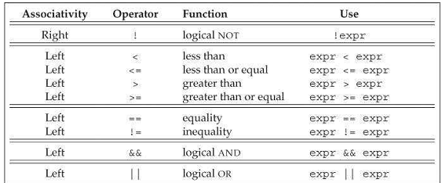

[toc]

## 4 表达式

### 4.1 基础

#### 4.1.1 基本概念

理解涉及多个运算符的表达式，需要理解运算符的优先级、结合性，及操作数的求值顺序。

**操作数转换**

经常需要将操作数从一种类型转换为另一种。尽管转换规则复杂，但多数时候转换并不反直觉。小整数类型（如bool, char, short等）一般会被提升为大整数类型，一般是 `int`。转换详见§4.11。

**运算符重载**

使用重载运算符时，运算符的语义，包括操作数类型及结果取决于运算符的定义。但，**操作数数量、优先级、结合性是不能变的**。

**左值和右值**

Cpp的表达式要么是一个左值，要么是右值。这些概念继承自C。左值可以位于赋值的左边，右值位于右边。

一些表达式产生右值，不是左值。粗略的讲，**当使用右值时，我们用的是它的值（内容）。用作左值时，我们用的是对象的标识（内存中的位置）**。

运算符的区别在于，它们需要左值还是右值，以及它们返回左值还是右值。在需要右值时可以使用左值（但有一个例外，见§13.6）。当使用左值替代右值时，使用的是对象的内容（它的值）。我们已经使用了几个需要左值的运算符：

- 赋值需要一个左值（不能是常量）作为左操作数，且将左操作数按左值返回（yield）。
- 取地址运算符需要一个左值，将指向它的指针作为右值返回。
- 内建的解引用和下标运算符，迭代器解引用，string和vector下标运算符都产生（yield）左值。
- 内建的增减运算符和迭代器的增减运算符需要左值作为操作数，前缀版本也产生（yield）左值。

使用 `decltype` 时左值与右值也有区别。对一个**表达式**（而不是变量）施加 `decltype`，如果表达式产生左值，结果是引用类型。例如，若 `p` 是 `int*`。则 `decltype(*p)` 是 `int&`。但由于取址运算符产生右值，`decltype(&p)` 是 `int**`。

#### 4.1.2 优先级和结合性

Associativity determines how to group operands with the same precedence.

#### 4.1.3 求值顺序

Precedence specifies how the operands are grouped. 但它没规定操作数的求值顺序。多数情况下，顺序都是不定的。如：`int i = f1() * f2();`。

注意，下面的输出也是不定的！！

```cpp
int i= 0;
cout << i << " " << ++i << endl; // undefined
```

但有四个运算符的顺序是一定的。`&&`、 `||`、 三元`?:`、 逗号`,`。

优先级、结合性与求值顺序无关。如 `f() + g() * h() + j()`。函数的调用顺序不定。

### 4.2 算术运算符

下面的运算符都是左结合（从左向右）的：一元 `+`，一元 `-`，`*`，`/`，`%`，`+`，`-`。这些运算符的操作数和结果都是右值。

*一元+*施加到指针或算术值时，返回值的拷贝，可能被提升。

对于多数操作数，`bool` 类型的操作数会被提升为 `int`。

整数的除法返回一个整数。如果商包含小数，截断。

```cpp
int ival1 = 21/6; // ival1 is 3;
int ival2 = 21/7; // ival2 is 3;
```

`%` 的操作数必须是整数。

语言的早期版本许诺负数商被向上或向下取整。但新标准要求商**向零取整**（即截断）。

The modulus operator is defined so that if m and n are integers and n is nonzero, then `(m/n)*n + m%n` is equal to `m`. 隐式的，如果m%n非零，它与m的符号相同。Earlier versions of the language permitted `m%n` to have the same sign as `n` on implementations in which negative `m/n` was rounded away from zero, but such implementations are now prohibited. Moreover, except for the obscure case where `-m` overflows, `(-m)/n` and `m/(-n)` are always equal to `-(m/n)`, `m%(-n)` is equal to `m%n`, and `(-m)%n` is equal to `-(m%n)`. More concretely:

```cpp
21 % 6;  /*  resultis 3  */  21 / 6;  /*  resultis 3  */
21 % 7;  /*  resultis 0  */  21 / 7;  /*  resultis 3  */
-21 % -8;  /*  resultis -5*/  -21 / -8;  /*  resultis 2  */
21 % -5;  /*  resultis 1  */  21 / -5;  /*  resultis -4  */
```

### 4.3 逻辑与关系运算符

关系运算符的操作数是算术或指针类型；逻辑运算符的操作数可以是任何能被够转换为bool类型的类型。这些运算符的返回值都是bool。值为0的算术和指针操作数是假；其他是真。操作数和结果都是右值。



**相等性测试和bool字面量**

`if (val == true) { /* ...  */} // 只有当val等于1时才为true！`

如果val不是 `bool`，**true会被转换为val的类型**。

所以还是直接写成`if(val)`。

### 4.4 赋值（Assignment）

赋值的结果是左边的操作数，是一个**左值**。结果是左边操作数的类型。右边运算符的类型转换为左边的。

Under the new standard, we can use a braced initializer list on the right-hand side:

```cpp
    int k = 0;
    k = {3.14}; // error: narrowing conversion
    vector<int> vi; // initially empty
    vi = {0,1,2,3,4,5,6,7,8,9};
```

如果左操作数是内建类型，则初始化列表中只能包含至多一个值。且这个值不能被 narrowing conversion (§2.2.1)。

对于类类型，取决于类的实现。对于 `vector`，`vector` 模板自定义了赋值运算符，可取一个初始化列表。

#### 赋值是右结合的

```cpp
int ival, jval;
ival = jval = 0; // ok: each assigned 0
```

由于赋值是右结合的，最右的赋值，`jval = 0`，是左边赋值的右操作数。由于赋值返回其左操作数，最右的赋值的结果（jval）赋给ival。

多赋值中每个对象必须与其右邻居的类型相同，or a type to which that neighbor can be converted (§4.11)。

#### 赋值的优先级低

```cpp
int i;
while ((i = get_value()) != 42) {
    // do something ...
}
```

#### 复合赋值运算符

	+=  -=  *=  /=  %=  // arithmetic operators
	<<=  >>=  &=  ^=  |=  // bitwise operators; see §4.8

### 4.5 增加减少运算符

增减运算符（`++`、 `--`）。

`*pbeg++` 是 `*(pbeg++)`。

求值顺序不定

```cpp
// the behavior of the following loop is undefined!
while (beg != s.end() && !isspace(*beg))
    *beg = toupper(*beg++); // 错误：赋值不确定
```

编译器可能有两种求值方式：

```cpp
*beg = toupper(*beg); // 相当于左边先求值
*(beg + 1) = toupper(*beg); // 右边先求值
```

### 4.6 成员访问运算符

`ptr->mem` 是 `(*ptr).mem` 的缩写。省去了括号的烦扰。

### 4.7 条件运算符

```cpp
cond ? expr1 : expr2;
```

条件运算符的优先级非常低。把它们嵌入复杂表达式，记得加括号。

### 4.8 二进制运算符

二进制运算符的操作数是整数（一些位）。这些运算符允许我们读取或设置特定的位。As we’ll see in §17.2, we can also use these operators on a library type named `bitset` that represents a flexibly sized collection of bits.

如果操作数是小整数，会先被提升为大一些的整数（§4.11.1）。操作数可以是有符号的或无符号的。


如果操作数是有符号的且为负，则符号位的处理方式取决于机器。如果左移修改了符号位，结果是未定的。

警告：因为符号位的处理是不定的，强烈建议**二进制运算符只操作无符号数**。

#### 移位运算符

The built-in meaning of these operators is that they perform a bitwise shift on their operands.

左移运算符在右边填0。右移的行为取决于操作数的类型：如果操作数是无符号的，则在左边插0。若是有符号的，结果取决于实现：可能拷贝符号位，或插入0。

#### 位移（IO）运算符是左结合的

记得，重载运算符不改变运算符的结合性和优先级。
`cout << "hi" << " there" << endl;`
等价于：
`((cout << "hi") << " there" ) << endl;`

### 4.9 sizeof 运算符

`sizeof` 运算符返回表达式或类型名的大小。运算符是右结合的。结果是常量表达式，类型是 `size_t`。运算符有两种形式：`sizeof (type)`，`sizeof expr`。

`sizeof` 并不会求值其操作数：

```cpp
Sales_data data, *p;
sizeof(Sales_data);
sizeof data;
sizeof p;
sizeof *p;
sizeof data.revenue;
```

`sizeof` 是右结合的且优先级与 `*` 相同，因此 `sizeof *p` 与 `sizeof (*p)` 等价。第二，因为 `sizeof` 不求值，因此 `p` 是否有效（初始化）不重要。

新标准，可以用作用域运算符查询类成员的大小。`sizeof Sales_data::revenue;`

The result of applying `sizeof` depends in part on the type involved:

- 求char（或类型为char的表达式）的大小保证是1。
- 求一个引用的大小，返回被引用的对象的大小。
- 求一个指针的大小，返回容纳该指针所需的大小。
- 求解引用后的指针，返回指向的类型的大小，指针不需要是有效的。
- 求数组大小，结果是整个数组的大小。此种场景，不会把数组转换为指针。
- sizeof a string or a vector returns only the size of the fixed part of these types; it does not return the size used by the object’s elements.

```cpp
    // sizeof(ia)/sizeof(*ia)返回数组中元素个数
    constexpr size_t sz = sizeof(ia) / sizeof(*ia);
    int arr2[sz]; // 可以：sizeof返回一个常量表达式
```

`sizeof` 返回一个常量表达式，可以用于指定数组维度。

### 4.10 逗号运算符

逗号运算符取两个操作数，从左到右求值——求值顺序是一定的。

左边的表达式求值后，被丢弃。逗号表达式的结果是右边的表达式的值。若右边操作数是左值则结果为左值。

逗号表达式最常见的用途：for循环：

```cpp
    vector<int>::size_type cnt = ivec.size();
    for(vector<int>::size_type ix = 0; ix != ivec.size(); ++ix, --cnt)
	    ivec[ix] = cnt;
```

### 4.11 类型转换

当两个类型可以转换时，它们是相关的（related）。例子，下面的表达式，将 `ival` 初始化为6：

```cpp
int ival= 3.541 + 3; // 编译器可能警告说会丢失精度
```

数值类型的隐式转换要尽量保留精度。例如，如果表达式有整数和浮点数，则整数会被转换为浮点数。如3会被转换为double。接下来是初始化。double类型的结果会被转换为int。

何时会发生隐式转换：

- 多数表达式中，整型的、比int小的类型先被提升到大的整型
- 在条件中，非bool表达式被转换为bool
- {{区别初始化和赋值}}在初始化中，初始化器被转换为变量类型；赋值中，右操作数转换为左操作数。
- 在算数和关系表达式中，操作数类型不同，会转换为相同类型。
- 转换也发生在函数调用时（第6章）

#### 4.11.1 算术转换

算数的转换，在 §2.1.2 介绍了。例如，若某个操作数是 `long double` 则其他操作数不管是什么类型都会转换为 `long double`。若表达式混合了浮点数和整数，整数值会被转换为响应浮点类型。

##### 整型提升

整数提升将小整数转换为更大的整数类型。`bool`, `char`, `signed char`, `unsigned char`, `short`, `unsigned short` 提升为 `int`（if all possible values of that type fit in an int）。否则，值提升为 `unsigned int`。

`bool`，false提升为0，true提升为1。

The larger char types (`wchar_t`, `char16_t`, and `char32_t`) are promoted to the smallest type of int, unsigned int, long, unsigned long, long long, or unsigned long longin which all possible values of that character type fit.

##### 无符号操作数

若某个操作数是无符号类型，则操作数转换为什么类型取决于机器上整数类型的相对大小。通常，整型提升先发生。如果结果类型匹配，不需要其他转换。若两个运算符的符号相同，则小类型的操作数转换为大类型的。

若符号不同，无符号操作数的类型等于或大于有符号操作数的类型，则有符号转换为无符号。例如，一个 `unsigned int` 和 `int`， `int` 会转换为 `unsigned int`。注意，若 `int` 是负数，the result will be converted as described in § 2.1.2, with the same results.

下面是有符号操作数的类型比无符号数的类型大的情况，这种情况取决于机器。If all values in the unsigned type fit in the larger type, then the unsigned operand is converted to the signed type.

If the values don’t fit, then the signed operand is converted to the unsigned type. 例如，若是 `long` 和 `unsigned int`，且 `int` 和 `long` 大小相同，则 `long` 可以被转换为 `unsigned int`。如果 `long` 更大，则 `unsigned int`转换为 `long`。

##### 理解算数转换

看下面的字：

```cpp
bool flag;
char cval;
short sval;
unsigned short usval;
int ival;
unsigned int uival;
long lval;
unsigned long ulval;
float fval;
double dval;
3.14159L + 'a'; // 'a'提升为int，然后int转换为long double
dval + ival; // ival -> double
dval + fval; // fval -> double
ival = dval; // dval截断为int
flag = dval; // 若dval为0，flag为false；否则true
cval + fval; // cval提升为int，然后int转换为float
sval + cval; // sval和cval提升为int
cval + lval; // cval转换为long
ival + ulval; // ival转换为unsigned long
usval + ival; // 取决于unsigned short和int的大小
uival + lval; // 取决于unsigned int和long的大小
```

#### 4.11.2 其他隐式转换

除了算术转换，还有几种其他的隐式转换，包括：

**数组到指针转换**：多数情况下，数组会被转换为指向数组第一个元素的指针：

```cpp
int ia[10];
int *ip = ia;
```

以下情况不会转换：使用 `decltype`；作为取址运算符的操作数；使用 `sizeof` 或 `typeid`（§19.2.2）。初始化到数组的引用时也会不会转换。

**指针转换**：字面量 `0` 和字面量 `nullptr` 可以被转换成任意指针类型；到任意非常量类型的指针，可以转换成 `void*`；到任意类型的指针都能被转换成 `const void*`。We’ll see in §15.2.2 that there is an additional pointer conversion that applies to types related by inheritance.

**转换到bool**：若指针或算数值为0，转换产生false；其他值产生true：

```cpp
	char *cp = get_string();
	if (cp) /* ...*/ // true if the pointer cp is not zero
	while (*cp) /* ...  */ // true if *cp is not the null character
```

**转换到常量**：将一个到非常量类型的指针转换为到相应的常量类型的指针。引用类似。

```cpp
    int i;
    const int &j = i;
    const int *p = &i;
    int &r = j, *q = p; // 错误
```

反过来的转换 —— 去掉底层常量 —— 不允许。

**由类定义的转换**：类类型可以定义编译器能自动进行的转换。The compiler will apply only one class-type conversion at a time. In §7.5.4 we’ll see an example of when multiple conversions might be required, and will be rejected. 这方面的一个例子：在期望一个库 string 的地方，放一个C风格的character string （§3.5.5），或，在条件中读取一个 `istream`：
```cpp
    string s, t = "a value"; // 字符字符串字面量转换为string类型
    while (cin >> s)
```

IO库定义了 `istream` 到 `bool` 的转换。

#### 4.11.3 显式转换

##### Named Casts

A named cast has the following form:

```cpp
	cast-name<type>(expression);
```

其中 `type` 是目标类型。如果 `type` 是引用，则结果是左值。`cast-name` 决定进行何种转换，可以是 `static_cast`,  `dynamic_cast`,  `const_cast`, `reinterpret_cast`。

We’ll cover `dynamic_cast`, which supports the run-time type identification, in §19.2.

##### `static_cast`

Any well-defined type conversion, other than those involving low-level const, can be requested using a `static_cast`.

```cpp
	// cast used to force floating-point division
	double slope = static_cast<double>(j) / i;
```

`static_cast` 常用于将较大算术类型赋给较小的类型。显式的cast告诉编译器和读者，我们有意为之，不在乎精度的损失。若不用 `static_cast`，发生这种大转小转换时编译器一般会警告。

`static_cast` 还可以用于编译器不能自动转换的时候。例如，我们可以用 `static_cast` 查询存放在 `void*` 指针中的值(§ 2.3.2)：

```cpp
    void * p = &d; // ok：任何非常量对象的地址可以存在于void*
    double *dp = static_cast<double*>(p);
```

##### `const_cast`

`const_cast` 只改变底层常量（§2.4.3）：

```cpp
    const char *pc;
    char *p = const_cast<char*>(pc); // ok: but writing through p is undefined
```

转换后，编译器不再阻止修改对象。如果对象原来不是常量，则使用强转获得写访问是合法的。但如果利用 `const_cast` 修改一个 `const` 对象，结果是不定的。

其他类型的named cast不能用于常量的转换。`const_cast` 只能用来去常量，不能改变类型。

```cpp
    const char* cp;
    // 错误：static_cast不能用于去常量
    char *q = static_cast<char*>(cp);
    static_cast<string>(cp); // ok
    const_cast<string>(cp); // 错误
```

A `const_cast` is most useful in the context of overloaded functions, which we’ll describe in §6.4.

##### `reinterpret_cast`

A `reinterpret_cast` generally performs a low-level reinterpretation of the bit pattern of its operands. As an example, given the following cast

```cpp
    int *ip;
    char *pc = reinterpret_cast<char*>(ip);
```

we must never forget that the actual object addressed by `pc` is an int, not a character. Any use of `pc` that assumes it’s an ordinary character pointer is likely to fail at run time. For example: `string str(pc);` is likely to result in bizarre runtime behavior.

The use of `pc` to initialize `str` is a good example of why `reinterpret_cast` is dangerous. The problem is that types are changed, yet there are no warnings or errors from the compiler. When we initialized `pc` with the address of an int, there is
no error or warning from the compiler because we explicitly said the conversion was okay. Any subsequent use of `pc` will assume that the value it holds is a `char*`. The compiler has no way of knowing that it actually holds a pointer to an int. Thus, the initialization of `str` with `pc` is absolutely correct—albeit in this case meaningless or worse! Tracking down the cause of this sort of problem can prove extremely difficult, especially if the cast of ipto pcoccurs in a file separate from the one in which pc is used to initialize a string.

> Warning A `reinterpret_cast` is inherently machine dependent. Safely using `reinterpret_cast` requires completely understanding the types involved as well as the details of how the compiler implements the cast.

##### 传统风格的强转

早期版本的CPP，显式强转采用下面的形式：

```cpp
	type(expr); // 函数风格的
	(type) expr; // C语言风格的强转
```

> 尽量避免强制类型转换。特别是 `reinterpret_cast`。Such casts are always hazardous. `static_cast` and `dynamic_cast`, should be needed infrequently.

根据涉及的类型，旧风格的强转与 `const_cast`、 `static_cast` 或 `reinterpret_cast` 的作用相同。When we use an old-style cast where a `static_cast` or a `const_cast` would be legal, the old-style cast does the same conversion as the respective named cast. If neither cast is legal, then an old-style cast performs a `reinterpret_cast`. For example:

```cpp
	char *pc= (char*) ip; // ip is a pointer to int
```

has the same effect as using a `reinterpret_cast`.

### 4.12 运算符优先级表

见书。


