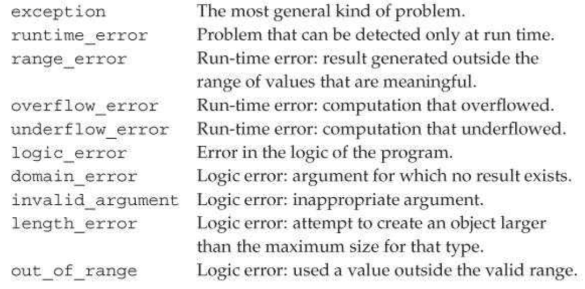

[toc]


## 5 语句

### 5.2 语句作用域

在控制结构中定义的便利只在语句内部可见，在语句结束后不可见：

```cpp
while (int i = get_num()) // 每次循环都要创建和初始化i
    cout << i << endl;
```

### 5.3 条件语句

    if (condition)
        statement

    if (condition)
        statement
    else
        statement2

    switch(ch) {
    case'a':
        ++aCnt;
        break;
    case'e':
        ++eCnt;
        break;
    case'i':
        ++iCnt;
        break;
    }

switch语句对表达式求值。表达式会被转换为整型。一个case匹配后，后面的case会继续被检查，知道switch结束或遇到 `break` 语句。

`default` 的用法：

```cpp
switch(ch) {
    case'a': case 'e': case 'i': case 'o': case 'u':
        ++vowelCnt;
        break;
    default:
        ++otherCnt;
        break;
}
```

### 5.4 循环语句

	while (condition)
		statement

	for (init-statement condition; expression)
		statement

	// Range for。新标准引入。
	for (declaration: expression)
		statement

    do
		statement
	while(condition);

### 5.5 跳转语句

CPP有四种跳转：`break`, `continue`, `goto`, `return`。

A goto statement provides an unconditional jump from the goto to a another statement in the same function.

The syntactic form of a gotostatement is
goto label;

where label is an identifier that identifies a statement. A labeled statement is any statement that is preceded by an identifier followed by a colon:
end: return;  // labeled statement; may be the target of a goto

// . . .
goto end;
int ix = 10; // error: goto bypasses an initialized variable definition
end:
// error: code here could use ix but the goto bypassed its declaration
ix= 42;

### 5.6 try与异常处理

C++中的异常处理包括：

- `throw expressions`，抛出错误
- `try blocks`，处理异常。
- 一组异常类。

#### 5.6.1 throw

`throw` 表达式一般以分号结尾，形成表达式语句。

```cpp
if (item1.isbn() != item2.isbn())
    throw runtime_error("Data must refer to same ISBN");
cout << item1 + item2 << endl;
```

抛出 `runtime_error` 类型的异常。`runtime_error` 是标准库类型，定义在 `stdexcept` 头。We’ll have more to say about these types in §5.6.3. 初始化 `runtime_error` 必须通过string或C风格字符串。

#### 5.6.2 try

    try {
    	program-statements
    } catch (exception-declaration) {
    	handler-statements
    } catch (exception-declaration) {
    	handler-statements
    } // . . .

`catch` 包括三部分：关键字 `catch`，the declaration of a (possibly unnamed) object within parentheses (referred to as an exception declaration), and a block.

```cpp
while (cin >> item1 >> item2) {
    try {
        // 这里省略的代码可能抛出一个runtime_error
    } catch (runtime_error err) {
        cout << err.what() << "\nTry Again? Entery or n" << endl;
        char c;
        cin >> c;
        if(!cin || c == 'n')
            break;  // break out of the while loop
    }
}
```

库异常类都定义了一个成员函数叫 `what`。它的返回值是C风格字符串（`const char*`）。

若没有相应catch，异常被传给一个库函数 `terminate`。`terminate` 的实现依赖于平台，一般是终止程序执行。若异常抛出，但没有 `try` 块，异常也是被 `terminate` 捕获。

#### 5.6.3 标准异常

CPP库定义了几个类，用于报告标准库中函数出现的问题。These exception classes are also intended to be used in the programs we write. These classes are defined in four headers:

- **exception** 头定义了最通用的异常类，名叫 `exception`。它只表明异常发生了，不提供任何额外信息。
- **stdexcept** 头定义了几个通用的异常类，列在下表中。
- **new** 头定义了 `bad_alloc` 异常，见 §12.1.2。
- **type_info** 头定义了 **bad_cast** 异常，见 §19.2。

Table 5.1. Standard Exception Classes Defined in `<stdexcept>`



The library exception classes have only a few operations. We can create, copy, and assign objects of any of the exception types.

只能默认初始化（§ 2.2.1） `exception`, `bad_alloc`, `bad_cast` 对象。这些对象不能使用初始化器。

其他异常类型与此相反，可以用string或C风格字符串初始化，但不能默认初始化它们。

异常类型只定义了一个简单地操作，名叫 `what`。返回一个 `const char*`（C风格字符串），描述错误。


