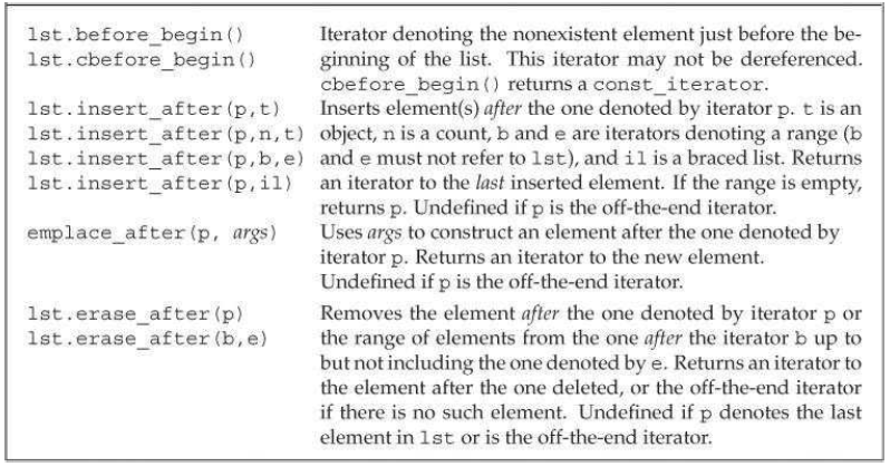
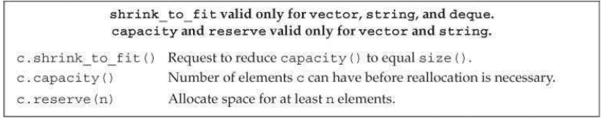
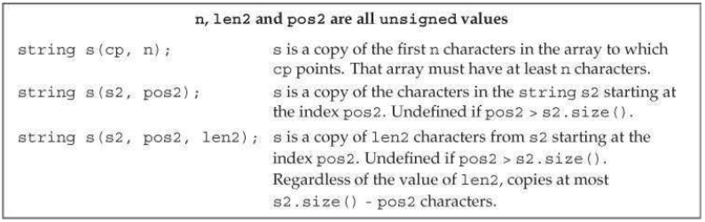
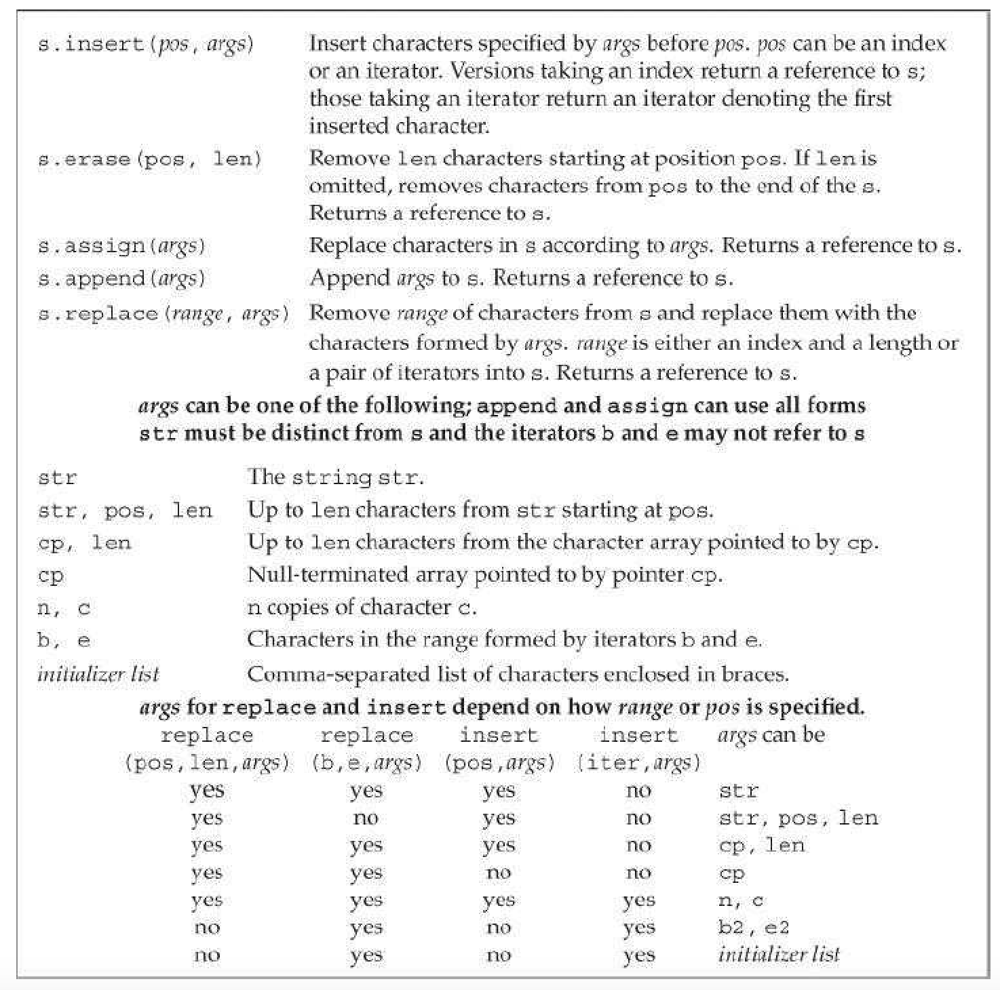
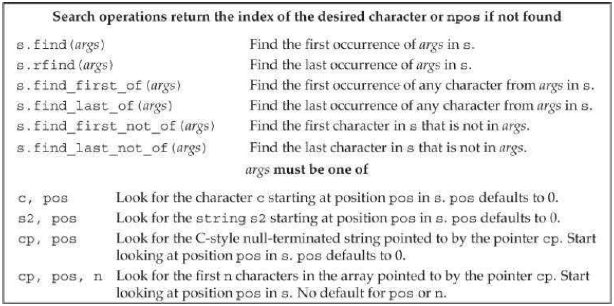
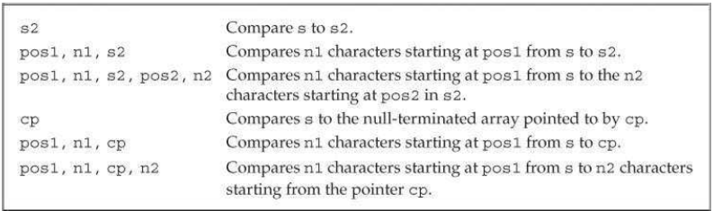
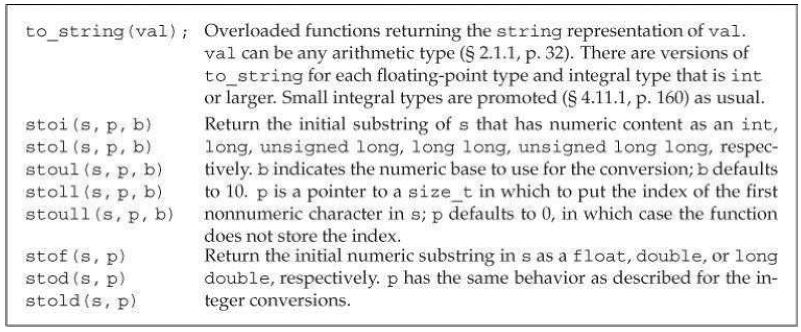
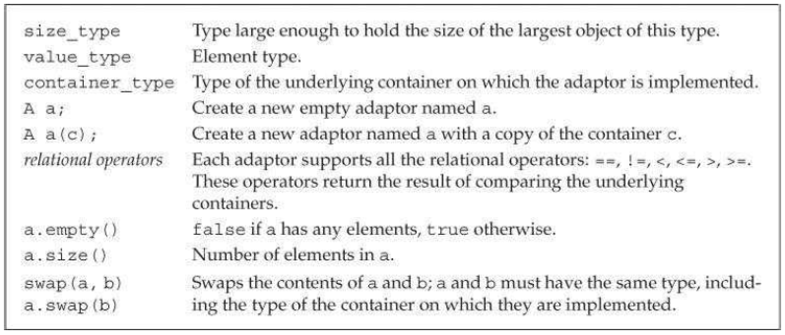
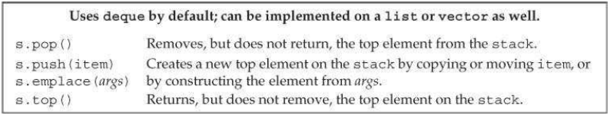
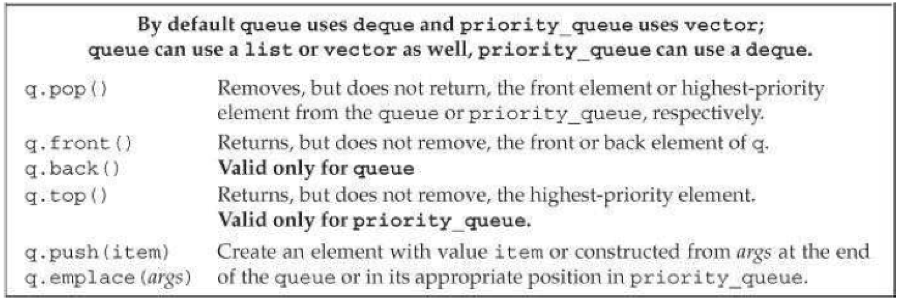

[toc]

## 9 顺序容器

本章建立在第三章（§ 3.2, § 3.3, § 3.4）的基础之上。

### 9.1 顺序容器概述

顺序容器（见下表）都提供到元素的快速的顺序访问。它们的性能在以下方面有差异：1）向元素添加删除元素的开销；2）非顺序访问容器内元素的开销。

- `vector`：大小灵活的数组。支持快速随机访问。在最后之外的位置上插入删除可能会慢。
- `deque`：双端队列。支持快速随机访问。在最前和最后的快速插入删除。
- `list`：双向链表。只支持双向顺序访问。在任何地方都可以快速插入删除。
- `forward_list`：单向链表。只支持一个方向上的顺序访问。在任何地方都可以快速插入删除。
- `array`：固定大小的数组。支持快速随机访问。**不能添加和删除元素。**
- `string`：一个特殊容器，类似于 `vector`，容纳字符。快速随机访问。在最后快速插入删除。

除 `array` 是固定容器外，其他容器提供高效灵活的内存管理：可以添加移除元素，改变容器大小。容器存储元素的策略对这些操作的性能有显著的影响。有时这些策略甚至决定某个容器是否提供特定操作。

例如 `string` 和 `vector` 在连续的内存中存储元素。因为元素连续，因此从索引计算元素地址是快速的。但在容器中部添加删除元素要花时间：目标元素之后的元素要被移动来维持连续性。有时，添加元素需要分配额外空间，此时所有元素要被移动到新空间。

`list` 和 `forward_list` 支持在容器任意位置快速添加删除元素。但不支持随机访问元素。访问元素只能通过迭代。而且这些容器与 `vector`,  `deque`,  `array` 相比，内存开销较大（substantial）。

`deque` 支持随机访问。在 `deque` 中部添加删一般是昂贵的。但在两端添加删除元素都是快速的。

新标准引入了 `forward_list` 和 `array`。`array` 比内建数组更安全、更易使用。但它仍是固定大小的。因此不支持调整容器大小。

`forward_list` 目标是媲美最好的、手写的、单向列表。因此 `forward_list` 没有 `size` 方法，因为相对于手写的链表，存储和计算大小会带来额外开销。但其他容器 `size` 是一个快速的常量时间的操作。

> 新的库容器比之前的显著的快（原因见§13.6）。库容器比最精心手写的版本效率还要高。**现代C++程序应该使用库容器**，而不是基本结构，如数组。

**应该使用哪个顺序容器？**

选择容器的经验法则：

- 多数情况下应该使用 `vector`，除非有却有原因使用其他容器。
- 如果程序有大量小的元素且空间开销很重要，不要使用 `list` 或 `forward_list`。
- 如果需要随机访问，选择 `vector` 或 `deque`。
- 如果需要在中部增删元素，选择 `list` 或 `forward_list`。
- 如果仅是在前后增删，不需要在中部，选择 `deque`
- 如果仅在读入时会在中间插入，后续却需要随机访问。则输入阶段使用 `list`，输入完成后将 `list` 拷贝到 `vector`。

如果既需要随机访问又需要在中间插入删除，则决定取决于访问 `list` 或 `forward_list` 中的元素，或在 `vector` 或 `deque` 中增删的相对开销。一般需要实测。

### 9.2 库容器概述

有一些操作是所有容器共有的：

类型别名：

- `iterator`：容器的迭代器的类型
- `const_iterator`：只读迭代器类型，不能修改元素
- `size_type`：无符号整数，确保能表示容器最大大小
- `difference_type`：有符号整数，确保能容纳两个迭代器的差
- `value_type`：元素类型
- `reference`：元素的左值类型；等价于 `value_type&`
- `const_reference`：元素的常量左值类型（`const value_type&`）

构造器：

- `C c`：默认构造，空容器
- `C c1(c2)`：拷贝 c2 到 c1
- `C c(b, e)`：范围拷贝，范围由 `b` 和 `e` 表述（不适用与`array`）
- `C c{a,b,c...}`：列表初始化

赋值与交换：

- `c1 = c2`：将c1中的元素替换成c2。
- `c1 = {a,b,c...}`：替换 `c1`。不适用于`array`。
- `a.swap(b)`：交互 `a` 和 `b` 中的元素。
- `swap(a, b)`：与 `a.swap(b)` 等价。

大小：

- `c.size()`：元素个数（不能用于`forward_list`）
- `c.max_size()`：容器能容纳的最大元素数
- `c.empty()`：容器是否为空

添加删除元素（不能用于`array`）：

- `c.insert(args)`
- `c.emplace(inits)`：使用 `inits` 构造一个元素
- `c.erase(args)`：
- `c.clear()`：

迭代器：

- `c.begin()`、 `c.end()`
- `c.cbegin()`、 `c.cend()`：返回 `const_iterator`

可反向的容器（不适用于 `forward_list`）：

- `reverse_iterator`：反向迭代器
- `const_reverse_iterator`
- `c.rbegin()`、`c.rend()`
- `c.crbegin()`、 `c.crend()`：返回 `const_reverse_iterator`

每个容器定义在自己的头文件中。头文件名一般与类型名相同。如 `deque` 在头文件 `deque` 中。容器是类模板。

```cpp
	list<Sales_data>
	deque<double>
```

**容器能容纳的类型的限制**

顺序容器基本能容纳所有类型。甚至元素本身可以又是容器。

```cpp
	vector<vector<string>> lines;
```

> 注意：之前的编译器可能要求尖括号之间有空格：`vector<vector<string> >`。

有时容器内元素需要满足一些要求。例如有的顺序容器的构造器取一个大小做参数，此时要用到元素的默认构造器。但有些类没有默认构造器。因此不能用此种构造器构造容器：

```cpp
    // assume noDefault is a type without a default constructor
    vector<noDefault> v1(10, init); // 可以：提供了初始化元素
    vector<noDefault> v2(10); // 不可以！必须提供一个初始化元素
```

#### 9.2.1 迭代器

迭代器也提供公共接口。例如所有库容器的迭代器都实现了增运算符：移到下一个元素。

迭代器范围由两个迭代器划定。一个指向第一个元素，一个指向最后一个元素后面。库使用闭开范围 `[begin, end)`。 `end` 可以等于 `begin` 但不能再超前了。编译器不做此类检查，需要我们自己保证。

```cpp
while (begin != end) {
    *begin = val;
    ++begin;
}
```

#### 9.2.2 容器的类型成员

容器定义了一些类型，如 `size_type`、 `iterator` 和 `const_iterator`。

一些容器提供反向迭代器，`++` 反向移向一个元素。

使用这些类型时，前面要加类限定：

```cpp
	list<string>::iterator iter;
	vector<int>::difference_type count;
```

#### 9.2.3. `begin` 和 `end` 成员函数

有几个版本。带 `r` 的返回反向迭代器。带 `c` 的返回常量版本：

```cpp
	list<string> a= {"Milton", "Shakespeare", "Austen"};
	auto it1 = a.begin(); // list<string>::iterator
	auto it2 = a.rbegin(); // list<string>::reverse_iterator
	auto it3 = a.cbegin(); // list<string>::const_iterator
	auto it4 = a.crbegin(); // list<string>::const_reverse_iterator
```

不带 `c` 的函数有重载版本。例如 `begin` 有两个版本。一个是常量成员函数，返回容器的 `const_iterator`。另一个是非常量成员函数，返回 `iterator`。`rbegin`, `end`, `rend` 三个函数也有两个版本。对非常量对象调用这些方法，返回 `iterator`。对常量对象调用这些方法返回常量版本的迭代器。与指向常量的指针和引用一样，可以将普通 `iterator` 转换为相应的 `const_iterator`，但反之不然。

新标准引入带 `c` 版本的目的是，让 `auto` 可用。

```cpp
    // 显式指定类型
    list<string>::iterator it5 = a.begin();
    list<string>::const_iterator it6 = a.begin();
    // iterator or const_iterator depending on a's type of a
    auto it7 = a.begin(); // const_iterator only if a is const
    auto it8 = a.cbegin(); // it8 is const_iterator
```

`auto` 和 `begin`、 `end` 连用，迭代器的类型取决于容器的类型。与我们打算如何使用迭代器无关。而 `c` 版本的函数总是得到 `const_iterator`，不管容器是否为常量。

> 最佳实践：当不需要写访问时，使用 `cbegin` 和 `cend`。

#### 9.2.4 定义和初始化一个容器

每个容器类型都定义了一个默认构造器。默认构造器创建一个空容器（`array` 除外）。还有一个构造器指定容器大小和初始值（`array` 除外）。

##### 通过拷贝另一个容器初始化

可以拷贝整个容器，或一个范围（`array` 除外）。

通过拷贝另一个容器创建新容器，容器和元素类型需要一致。但若传入迭代器，则容器类型可以不相同。新旧容器的元素类型也可以不同，只要能转化。

```cpp
	list<string> authors = {"Milton", "Shakespeare", "Austen"};
    vector<const char*> articles = {"a", "an", "the"};
    list<string> list2(authors); // ok: types match
    deque<string> authList(authors); // 错误：容器类型不匹配
    vector<string> words(articles); // 错误：元素类型不匹配
    // 可以：const char*可以转换为string
    forward_list<string> words(articles.begin(), articles.end());
```

##### 列表初始化

新标准允许用列表初始化容器

```cpp
	list<string> authors = {"Milton", "Shakespeare", "Austen"};
	vector<const char*> articles = {"a", "an", "the"};
```

##### 容器容量相关的构造器（顺序容器）

顺序容器（`array` 除外），可以通过一个大小和一个可选的初始化元素初始化。若不提供元素初始化器，库使用值初始化（§3.3.1）：

```cpp
    vector<int> ivec(10, -1); // 10个元素，每个初始化为-1
    list<string> svec(10, "hi!");
    forward_list<int> ivec(10); // 10个元素，初始化为0
    deque<string> svec(10); // 10个元素，初始化为空串
```

##### 库 `array` 大小固定

正如内建的数组的大小是其类型的一部分，库 `array` 的大小也是其类型的一部分。定义 `array` 时除了要指定元素类型，也要指定容器大小：

```cpp
	array<int, 42>  // type is: array that holds 42 ints
	array<string, 10> // type is: array that holds 10 strings
```

因为要指定 `array` 大小，`array` 不支持常见容器的构造器。

与其他容器不同的是，默认构造器构造的 `array` 不是空的：`array` 定义了多大就有多少个元素。这些元素是默认初始化的（§2.2.1）（与内建数组的情况一样，§3.5.1）。若想列表初始化数组，初始列表数量必须小于等于 `array` 的大小。若初始化器少于 `array` 大小，后面缺少的元素被值初始化（§3.3.1）。

```cpp
    array<int, 10> ia1; // 10个默认初始化的整数
    array<int, 10> ia2 = {0,1,2,3,4,5,6,7,8,9}; // 列表初始化
    array<int, 10> ia3 = {42}; // ia3[0] is 42, 剩下的是0
```

不能拷贝和赋值内建数组。但 `array` 没有此限制：

```cpp
	int digs[10] = {0,1,2,3,4,5,6,7,8,9};
	int cpy[10] = digs; // 错误：内建数组不支持拷贝或赋值
	array<int, 10> digits = {0,1,2,3,4,5,6,7,8,9};
	array<int, 10> copy = digits; // ok: so long as array types match
```

As with any container, the initializer must have the same type as the container we are creating. For arrays, the element type and the size must be the same, because the size of an array is part of its type.

#### 9.2.5 赋值和交换

赋值操作将左面的容器整个替换成右边的：

```cpp
c1 = c2;
c1 = {a, b, c}; // after the assignment c1 has size 3
```

`swap(a, b)` 或 `a.swap(b)`。交换往往比拷贝快得多。

`seq.assign(b, e)`：替换 `seq` 中的元素，`b` 和 `e` 是迭代器。迭代器不能引用 `seq` 中的元素。
`seq.assign(il)`：用列表初始化 `seq`。
`seq.assign(n, t)`：n个t元素。

`assign` 不能用于 `array` 或关联容器。

如果左右容器原来的大小不同，**赋值后左容器大小等于右容器**。

与内建数组不同，库 `array` 支持赋值。运算符左右两侧必须是相同类型：

```cpp
	array<int, 10> a1 = {0,1,2,3,4,5,6,7,8,9};
	array<int, 10> a2 = {0}; // elements all have value 0
	a1 = a2; // replaces elements in a1
	a2 = {0}; // 错误！大括号列表不能赋给一个 array
```

**因为右边操作数的大小可能与左边不同**，`array` 不支持 `assign`，也不允许用列表赋值。

##### 使用 `assign`（只有顺序容器能用）

赋值运算符要求左右两个操作数类型相同。它将右侧操作数的所有元素拷贝到左侧，左侧元素全被替换。顺序容器（除了`array`）还有一个成员函数 `assign`，允许不同但兼容的类型的赋值，or assign from a subsequence of a container。例如，可以利用 `assign`，把`vector<const char*>` 中的一块范围赋给 `string`：

```cpp
    list<string> names;
    vector<const char*> oldstyle;
    names = oldstyle; // 错误：容器类型不匹配
    // ok: can convert from  const char* to string
    names.assign(oldstyle.cbegin(), oldstyle.cend());
```

第二个版本的 `assign`，指定重复数量的元素：

```cpp
    // followed by slist1.insert(slist1.begin(), 10, "Hiya!");
    list<string> slist1(1); // one element, which is the empty string
    slist1.assign(10, "Hiya!"); // ten elements; each one is Hiya!
```


##### 使用 `swap`

`swap` 交换两个类型相同的容器的内容。

```cpp
    vector<string> svec1(10); // vector with ten elements
    vector<string> svec2(24); // vector with 24 elements
    swap(svec1, svec2);
```

除 `array` 外，交换操作保证是快速的 —— 元素本身不会被交换；交换的只是内部数据结构。除 `array` 外，`swap` 不会拷贝、删除元素，保证在常量时间完成。

元素不会被移动意味着，（除 `string` 外），迭代器、指向容器的引用和指针不再有效。它们仍旧指向 `swap` 之前的元素。但 `swap` 后，这些元素到了另一个容器内。

与其他容器不同，`swap` 两个 `array` 会交换元素。因此交换 `array` 的时间正比于元素数目。`swap` 后，指针、引用、迭代器仍旧指向 `swap` 之前它们指向的元素。Of course, the value of that element has been swapped with the corresponding element in the other array.

新标准有两个交互方法，分别是成员方法和非成员方法。之前只有成员版本。非成员版本的 `swap` 在泛型算法中具有重要作用。就习惯来说，最好使用非成员版本的 `swap`。

#### 9.2.6 容器大小操作

容器提供三个大小相关操作。`size` 返回容器内元素数量；`empty` 当容器为空是返回true；`max_size` 返回容器可以容纳的元素数量，或多于这个数量。

`forward_list`只提供 `max_size` 和 `empty`，不提供 `size`。

#### 9.2.7 关系运算符

所有容器都支持 `==` 和 `!=`；所有容器（除了无序的关联容器）支持关系运算符（`>`, `>=`, `<`, `<=`）。两个运算数必须是相同容器且元素类型相同。即 `vector<int>` 不能与 `vector<double>` 比较。

比较两个容器是在比较对应元素对：

- 若两个容器大小一致，且所有元素相等，则两个容器相等；否则不相等。
- 若长度不等，且短的容器所有元素与长容器对应元素相等，则短容器小于长容器。
- 否则，比较取决于第一个不等元素对的相对大小。

**关系运算符使用元素的关系运算符**

要使用关系运算符比较容器，元素类型必须定义有比较运算符。

例如前面的 `Sales_data` 并没有定义 `==` 或 `<` 原酸。因此我们不能比较两个包含  `Sales_data` 的容器：

```cpp
	vector<Sales_data> storeA,storeB;
	if (storeA < storeB) // 错误
```

### 9.3 顺序容器操作

顺序容器与关联容器的区别在于如何组织元素。此区别应元素的存储、访问、添加、删除。前面讲了所有容器共有的操作，接下来是顺序容器特有的操作。

#### 9.3.1 向顺序容器添加元素

除 `array` 外的所有库容器都提供了灵活的内存管理。可以在运行时动态增删元素，改变容器大小。

下面的操作不适用与 `array`。
`forward_list` 有特殊版本的 `insert` 和 `emplace`。
`push_back` 和 `emplace_back` 对 `forward_list` 无效。
`push_front` 和 `emplace_front` 对 `vector` 和 `string` 无效：

- `c.push_back(t)`，`c.emplace_back(args)`：用t创建一个元素，或通过args构造一个元素，插入c的尾部。返回void。
- `c.push_front(t)`，`c.emplace_front(args)`：用t创建一个元素，或通过args构造一个元素，插入c的头部。返回void。
- `c.insert(p, t)`，`e.emplace(p, args)`：用t创建一个元素，或通过args构造一个元素；在迭代器p之前插入，返回指向新元素的迭代器。
- `c.insert(p, n, t)`：在迭代器p之前插入元素t，插入n次。返回指向插入的第一个的迭代器。如果n为零，返回p。
- `c.insert(p, b, e)`：在迭代器p之前插入一个范围。b和e不能指向c中的元素。返回指向插入的第一个的迭代器。如果范围为空，返回p。
- `c.insert(p, il)`：在迭代器p之前插入。il是大括号包围的一组元素。返回指向插入的第一个的迭代器。如果范围为空，返回p。

> 警告：向 `vector`, `string`, `deque` 插入元素可能使已存在的迭代器、指向容器的引用和指针失效。

##### 使用 `push_back`

除 `array` 和 `forward_list` 外，每个容器，包括 `string` 都支持 `push_back`。

```cpp
    string word;
    while (cin >> word)
    container.push_back(word); // container 可以是 vector
```

新插入的元素是 `word` 的一个**拷贝**！！

可以利用 `push_back` 向 `string` 尾部添加字符：

```cpp
void pluralize(size_tcnt, string &word)
{
    if(cnt > 1)
    word.push_back('s'); // same as word += 's'
}
```

> 核心概念：容器元素是被拷贝的！！
> 使用一个对象初始化一个容器，或将对象插入容器，放入容器的是对象值的拷贝，不是对象自身。就像向非引用形参传递参数一样，容器内的元素与初始对象没有关系。

##### 使用 `push_front`

`list`, `forward_list`, `deque` 支持 `push_front`。该操作在容器开头插入元素：

```cpp
	list<int> ilist;
	// add elements to the start of ilist
	for (size_t ix = 0; ix != 4; ++ix)
		ilist.push_front(ix);
```

`deque` 与 `vector` 一样挺高快速随机访问，但提供 `vector` 不具备的 `push_front`功能。`deque` 保证在头尾插入删除元素都是常量时间的。

##### 在容器特定位置插入元素

`insert` 允许我们在容器的任一点插入零到多个元素。支持 `insert` 的有 `vector`, `deque`, `list`, `string`。

`insert` 函数家族的第一个参数都是一个迭代器。元素在迭代器指向的元素之前插入新元素。

```cpp
slist.insert(iter, "Hello!"); // insert "Hello!" just before iter
```

对于不支持 `push_front` 的容器，可以利用 `insert` 在头部插入新元素。

```cpp
    vector<string> svec;
    list<string> slist;
    // equivalent to calling slist.push_front("Hello!");
    slist.insert(slist.begin(), "Hello!");
    svec.insert(svec.begin(), "Hello!");
```

##### 插入一块元素

重复插入一个元素：

```cpp
svec.insert(svec.end(), 10, "Anna");
```

插入一堆迭代器指示的范围，或插入一个初始化列表：

```cpp
	vector<string> v = {"quasi", "simba", "frollo", "scar"};
	// insert the last two elements of v at the beginning of slist
	slist.insert(slist.begin(), v.end() - 2, v.end());

	slist.insert(slist.end(), {"these", "words", "will",
    	"go","at", "the", "end"});
	// run-time error: iterators denoting the range to copy from
```

新版本的 `insert`，重复插入的版本和插入范围的版本，返回指向第一个插入元素的迭代器。老版本返回 void。

##### 使用 `insert` 的返回值

We can use the value returned by insert to repeatedly insert elements at a specified position in the container:

```cpp
    list<string> 1st;
    auto iter = 1st.begin();
    while (cin >> word)
    	iter = 1st.insert(iter, word); // 始终指向当前第一个元素，于是相当于push_front
```

##### Emplace 操作

新标准引入了三个新成员函数：`emplace_front`, `emplace`, `emplace_back`。它们**构造**而不拷贝元素。

对于 push 或 insert，插入的元素会被拷贝进容器。但调用 `emplace` 函数时，传入的是构造元素的构造器的实参。例如，若 `c` 是容纳 `Sales_data` 的容器：

```cpp
// 利用Sales_data的三参数构造器
c.emplace_back("978-0590353403", 25, 15.99);
// 错误：there is no version of `push_back` that takes three arguments
c.push_back("978-0590353403", 25, 15.99);
// ok: we create a temporary Sales_data object to pass to push_back
c.push_back(Sales_data("978-0590353403", 25, 15.99));
```

emplace 函数的参数取决于元素类型。实参必须匹配元素类的一个构造器：

```cpp
// iter refers to an element in c, which holds Sales_data elements
c.emplace_back(); // 用Sales_data的默认构造器
c.emplace(iter, "999-999999999"); // uses Sales_data(string)
// uses the Sales_data constructor that takes an ISBN, a count, and a price
c.emplace_front("978-0590353403", 25, 15.99);
```

#### 9.3.2 访问元素

下面列出了访问顺序容器中元素的方法。

**若容器内没有元素，访问操作的结果是不确定的。**

at和下标运算符只对 `string` `vector` `deque` `array` 有效。`back` 对 `forward_list` 无效。

- `c.back()`：返回到c中最后一个元素的引用。如果c为空，未定义。
- `c.front()`：返回到c中第一个元素的引用。如果c为空，未定义。
- `c[n]`：n是无符号整数。返回到元素的引用。如果 `n >= c.size()`，未定义。
- `c.at(n)`：返回下标指定的元素的引用。入股下标越界，抛出 `out_of_range` 异常。

在空容器上调用 `front` 或 `back`，与下标越界一样都是严重错误。

所有的顺序容器，包括 `array` 都有 `front` 成员。除 `forward_list` 之外的容器有 `back `成员。

```cpp
// check that there are elements before dereferencing an iterator or calling front or back
if (!c.empty()) {
    // val和val2是第一个元素的拷贝
    auto val = *c.begin(), val2 = c.front();
    // val3和val4是最后一个元素的拷贝
    auto last = c.end();
    auto val3 = *(--last); // can't decrement forward_list iterators
    auto val4 = c.back(); // not supported by forward_list
}
```

##### 访问成员返回的是引用

访问容器内元素的成员函数返回的是引用。如果容器是常量对象，则返回的是到常量的引用。

```
if (!c.empty()){
    c.front() = 42; // assigns 42 to the first element in c
    auto &v = c.back(); // get a reference to the last element
    v = 1024; // changes the element in c
    auto v2 = c.back(); // v2不是引用，是c.back()的一个拷贝
    v2 = 0; // no change to the element in c
}
```

与其他情况一样，若使用 `auto` 存储这些方法的返回值时，若期望得到引用，记得加 `&`。

##### 下标与安全随机访问

提供快速随机访问的容器（`string`, `vector`, `deque`, `array`）也提供下标运算符。返回的是引用。由程序自己检查下标越界，下标运算符不会检查。

下标越界是验证的程序错误，编译器无法检测出。

`at` 成员函数与下标类似，但如果越界，将抛出 `out_of_range` 异常(§5.6)：

```cpp
    vector<string> svec; // empty vector
    cout << svec[0]; // run-time error: there are no elements in svec!
    cout << svec.at(0); // throws an out_of_range exception
```

#### 9.3.3 移除元素

下面的运算会改变容器大小，因此 `array` 不支持。`forward_list` 有一个特殊版本的erase。`pop_back` 对 `forward_list` 无效；`pop_front` 对 `vector` 和 `string` 无效。

- `c.pop_back()`：移除c中的最后一个元素。如果c为空未定义。返回void。
- `c.pop_front()`：移除c中的第一个元素。如果c为空未定义。返回void。
- `c.erase(p)`：移除迭代器p指定的元素。返回其后元素的迭代器。如果p位于最后一个元素后，结果未定义。
- `c.erase(b, e)`：移除范围。返回被移除的最后一个元素之后元素的迭代器。
- `c.clear()`：移除c的所有元素。返回void。

在开头结尾之外的位置移除元素，使得 `deque` 的迭代器、引用、指针失效。对于 `vector` 和 `string`，移除点之后的迭代器、引用、指针失效。

移除元素的成员函数不会检查参数。需要在移除前确保它们存在。

##### `pop_front` 和 `pop_back`

`pop_front` 对 `vector` 和 `string` 无效。`pop_back` 对 `forward_list` 无效。

不能在空容器上删除元素。

##### 在任意位置移除

例子：移除奇数。

```cpp
	list<int> lst = {0,1,2,3,4,5,6,7,8,9};
    auto it = lst.begin();
    while (it != lst.end())
    	if(*it % 2) // if the element is odd
    		it = lst.erase(it); // erase this element
    	else
    		++it;
```

##### 移除多个元素

```cpp
elem1 = slist.erase(elem1, elem2); // after the call elem1 == elem2
```

清空操作等价方式：

```cpp
slist.clear(); // delete all the elements within the container
slist.erase(slist.begin(), slist.end()); // equivalent
```

#### 9.3.4 `forward_list` 的特殊操作

对于单向列表，在某元素前面添加或删除元素是困难的。因此 `forward_list` 的操作都是在指定位置后面插入删除。`forward_list` 不支持 insert、 emplace 或 erase 操作。它定义了自己的成员：`insert_after`、 `emplace_after` 和 `erase_after`。为支持这些操作，`forward_list` 还定义了 `before_begin`，返回一个其实元素之前的迭代器。该迭代器使我们可以在首位插入或删除元素。



一边遍历一边插入/删除需要我们维护两个指针，一个指向目标元素，一个指向目标元素之前的元素：

```cpp
    forward_list<int> flst = {0,1,2,3,4,5,6,7,8,9};
    auto prev = flst.before_begin();
    auto curr = flst.begin();
    while (curr != flst.end()) {
	    if (*curr % 2) // if the element is odd
    		curr = flst.erase_after(prev); // erase it and move curr
    	else {
            prev = curr; // move the iterators to denote the next
            ++curr; // 移到下一个元素
        }
    }
```

#### 9.3.5 调整容器大小

除 `array` 外，可以调整容器大小。若导致容器变小，后部的元素会被删除；如果容器需要扩大，可以指定新元素添加到后面，若让新元素被值初始化：

```cpp
    list<int> ilist(10, 42); // ten ints: each has value 42
    ilist.resize(15); // 后面加5个0（值初始化）
    ilist.resize(25, -1); // 添加10个-1
    ilist.resize(5);
```

#### 9.3.6 操纵容器可能导致迭代器失效

添加删除容器元素可能导致到容器元素的指针、引用、迭代器失效。无效的指针、引用、迭代器不再指向容器内的元素。使用无效的指针、引用、迭代器是严重的编程错误，与使用未经初始化的指针一样。

在向容器添加元素后：

- 对于 vector 和 string，或引起容器重新分配，指针、引用、迭代器失效。若不会导致重新分配，则插入位置之前的元素的间接引用仍有效；后面的无效。
- 对于 `deque`，在除最前和最后之外的位置插入元素，迭代器、指针、引用失效。在最前或最后添加元素，迭代器失效，但到已存在元素的引用和指针仍有效。
- 对于 `forward_list` 和 `list`，迭代器，指针和引用（包括 off-the-end 和 before-the-beginning 迭代器）仍有效。

删除元素后，

- 对于 `list` 和 `forward_list`， 所有的迭代器、引用或指针仍有效。
- 对于 `deque`，在开头和结尾之外的地方删除，所有的迭代器、引用、指针失效。若在尾部删除， off-the-end 迭代器失效，但其他迭代器、引用、指针不受影响；从前部删除它们也不受影响。
- 对于 vector 和 string，在删除点之前的迭代器、引用和向量仍有效。off-the-end 迭代器总是失效。

**编写改变容器的循环**

若循环会增删元素，vector, string, deque 要面对迭代器、引用或指针可能失效。每次循环后可能需要刷新它们。若增删是通过 `insert` 或 `erase` 进行的，更新比较方便，因为它们返回迭代器：

```cpp
// 删除偶数，重复奇数
	vector<int> vi = {0,1,2,3,4,5,6,7,8,9};
	auto iter = vi.begin();
	while (iter != vi.end()) {
		if (*iter % 2) {
			iter = vi.insert(iter, *iter);
			iter += 2; // 跳过当前元素和新插入的元素
		} else
        	iter = vi.erase(iter);
			// 不需要修改迭代器，正好指向下一个
	}
```

Remember, insert inserts before the position it is given and returns an iterator to the inserted element. Thus, after calling insert, iter denotes the (newly added) element in front of the one we are processing. We add two to skip over the element we added and the one we just processed.

**避免存储 `end` 返回的迭代器**

在 vector 或 string 中增删元素，或在 deque 非头部增删元素，都会让 `end` 返回的迭代器失效。因此，循环应该每次调用 `end`，而不是预先缓存。部分因为该原因，C++ 标准库一般将 `end()` 实现为一个非常快速的操作。

### 9.4 vector 如何增长

为支持随机访问，vector 的元素是连续存储的。

向 vector 或 stirng 插入元素，若没有位置放新元素，则只能新分配更长的**连续**空间，将原来的元素和新元素考入，将原来的空间释放。如果每次插入元素都要重新分配，性能肯定很差。

办法是预分配额外空间。实践中，其性能足够好，甚至 vector 的增长比 list 或 deque 更有效率。

**管理存储能力的成员**

下面列出了内存分配相关的成员函数。`capacity` 告诉我们下次分配前容器还能容纳多少元素。`reserve` 操作告诉容器要预留多少元素。`reserve` 不会影响容器内已有元素。



A call to reserve changes the capacity of the vector only if the requested space exceeds the current capacity. If the requested size is greater than the current capacity, reserve allocates at least as much as (and may allocate more than) the requested amount.

If the requested size is less than or equal to the existing capacity, reserve does nothing. In particular, calling reserve with a size smaller than capacity does not cause the container to give back memory. Thus, after calling reserve, the capacity will be greater than or equal to the argument passed to reserve.

新标准下我们可以对 deque、 vector 或 string 调用 `shrink_to_fit` 方法，要求释放不需要的内存。调用该方法表示我们不再需要额外的存储了。但实现可以选择忽略该请求。

**capacity 和 size**

`size` 是已经容纳的元素数量。

### 9.5 string 的其他操作

#### 9.5.1 构建 string 的其他方式



```cpp
const char *cp = "Hello World!!!"; // null-terminated array
char noNull[] = {'H', 'i'}; // not null terminated
string s1(cp); // copy up to the null in cp; s1 == "Hello World!!!"
string s2(noNull,2); // copy two characters from no_null; s2 == "Hi"
string s3(noNull); // undefined: noNull not null terminated
string s4(cp + 6, 5);// copy 5 characters starting at cp[6]; s4 == "World"
string s5(s1, 6, 5); // copy 5 characters starting at s1[6]; s5 == "World"
string s6(s1, 6); // copy from s1 [6] to end of s1; s6 == "World!!!"
string s7(s1,6,20); // ok, copies only to end of s1; s7 == "World!!!"
string s8(s1, 16); // throws an out_of_range exception
```

Ordinarily when we create a `string` from a `const char*`, the array to which the pointer points must be null terminated; characters are copied up to the null. If we also pass a count, the array does not have to be null terminated.

**substr**

`substr` 返回一个新的 string，是原来 string 的部分或全部。

```cpp
string s("hello world");
string s2 = s.substr(0, 5); // s2 = hello
string s3 = s.substr(6); // s3 = world
string s4 = s.substr(6, 11); // s3 = world
string s5 = s.substr(12); // throws an out_of_range exception
```

#### 9.5.2 修改 string 的其他方式

对于 string，`insert` 和 `erase` 不仅可以传迭代器，还可以传索引。The index indicates the starting element to erase or the position before which to insert the given values:

```cpp
s.insert(s.size(), 5, '!'); // 在s尾部添加5个叹号
s.erase(s.size() - 5, 5); // 删除s最后5个字符
```

The string library also provides versions of insert and assign that take C-style character arrays. For example, we can use a null-terminated character array as the value to insert or assign into a string:

```cpp
const char *cp = "Stately, plump Buck";
s.assign(cp, 7); // s == "Stately"
s.insert(s.size(), cp + 7); // s == "Stately, plump Buck"
```

We can also specify the characters to insert or assign as coming from another `string` or substring thereof:

```cpp
string s = "some string", s2 = "some other string";
s.insert(0, s2); // insert a copy of s2 before position 0 in s
// insert s2.size() characters from s2 starting at s2[0] before s[0]
s.insert(0, s2, 0, s2.size());
```

**append 和 replace**

The string class defines two additional members, append and replace, that can change the contents of a string. Table 9.13 summarizes these functions. The `append` operation is a shorthand way of inserting at the end:

```cpp
string s("C++ Primer"), s2 = s; // initialize s and s2 to "C++ Primer"
s.insert(s.size(), " 4th Ed."); // s == "C++ Primer 4th Ed."
s2.append(" 4th Ed."); // equivalent: appends " 4th Ed." to s2; s == s2
```



The `replace` operations are a shorthand way of calling erase and insert:

```cpp
// equivalent way to replace "4th" by "5th"
s.erase(11, 3); // s == "C++ Primer Ed."
s.insert(11, "5th"); // s == "C++ Primer 5th Ed."
// starting at position 11, erase three characters and then insert "5th"
s2.replace(11, 3, "5th"); // equivalent: s == s2
```

In the call to replace, the text we inserted happens to be the same size as the text we removed. We can insert a larger or smaller string.

#### 9.5.3 string 搜索操作

`string` 提供了6种搜索函数，每个都有4版重载。如下表。这些方法的返回值都是 `string::size_type`（无符号类型），即找到的位置。若没有匹配，方法返回一个静态成员 `string::npos`（无符号类型）。



`find` 最简单，返回第一个匹配。

```cpp
string name("AnnaBelle");
auto pos1 = name.find("Anna"); // pos1 == 0
```

`find_first_of` 匹配搜索串中任意字符，如下面，找出第一个数字：

```cpp
string numbers("0123456789"), name("r2d2");
auto pos = name.find_first_of(numbers);
```

相关方法是 `find_first_not_of`，找出第一个不在搜索串里的字符。

```cpp
string dept("03714p3");
auto pos = dept.find_first_not_of(numbers);
```

**指定从哪开始搜索**

利用该功能，可以实现搜索到所有出现的位置：

```cpp
string::size_type pos = 0;
// each iteration finds the next number in name
while ((pos = name.find_first_of(numbers, pos)) != string::npos) {
    cout << "found number at index: " << pos
    << " element is " << name[pos] << endl;
    ++pos; // move to the next character
}
```

**向后搜索**

`rfind` 从后向前搜索。

#### 9.5.4 compare 函数

Like `strcmp`, `s.compare` returns zero or a positive or negative value depending on whether `s` is equal to, greater than, or less than the string formed from the given arguments.

下面是6个版本的 `compare`：



#### 9.5.5 数字转换

新标准提供了一些转换函数。

```cpp
int i = 42;
string s = to_string(i); // 整数转字符串
double d = stod(s); // 字符串转浮点
```



```cpp
string s2 = "pi = 3.14";
d = stod(s2.substr(s2.find_first_of("+-.0123456789")));
```

If the string can’t be converted to a number, These functions throw an `invalid_argument` exception. If the conversion generates a value that can’t be represented, they throw `out_of_range`.

### 9.6 容器适配器

除了顺序容器，库还定义了三个顺序容器适配器：`stack`、 `queue` 和 `priority_queue`。适配器是库中一个通用的概念。容器、迭代器、函数适配器。容器适配器取一个已存在的容器类型，让它看上去像另外一个容器。例如 `stack` 取一个顺序容器（ `array` 和 `forward_list` 除外），让它看上去像一个栈。Table 9.17 lists the operations and types that are common to all the container adaptors.



#### 定义一个适配器

适配器有两个构造器。默认构造器创建一个空对象。另一个构造器取一个容器，将其拷贝到适配器。若 `deq` 是一个 `deque<int>`，则可以：

```cpp
	stack<int> stk(deq); // copies elements from deq into stk
```

`stack` 和 `queue` 默认在 `deque` 基础上实现。`priority_queue` 默认在 `vector` 基础上实现。或者我们在创建适配器时可以指定容器：

```
    // 通过 vector 实现
    stack<string, vector<string>> str_stk;
    stack<string, vector<string>> str_stk2(svec);
```

适配器能用的底层容器是受限的。
所有适配器都要能添加或删除元素。因此不能基于 `array`。同样也不能用 `forward_list`，因为所有的适配器都需要在尾部增删或访问元素。
`stack` 只需要 `push_back`、 `pop_back` 和 `back` 操作。因此剩下所有的容器都可以用作 stack。
`queue` 需要 `back`、 `push_back`、 `front` 和 `push_front`，因此可以用 list 或 deque；但不能用 vector。
`priority_queue` 需要支持随机访问，以及 front, push_back, pop_back；因此可用 vector 或 deque，但不能用 list。

#### Stack 适配器

`stack` 定义在头 `stack`。用法示例：

```cpp
    stack<int> intStack; // empty stack
    // fill up the stack
    for (size_t ix = 0; ix != 10; ++ix)
    	intStack.push(ix); // intStackholds 0 ... 9 inclusive
    while (!intStack.empty()) {
    	int value = intStack.top();
    	// code that uses value
    	intStack.pop(); // pop the top element, and repeat
    }
```

除了底层类型支持的操作，stack 还支持：



#### Queue 适配器

queue 和 priority_queue 适配器定义在 queue 头。
`queue` 是先进先出的结构。
`priority_queue`，优先级队列。新插入的元素会被放在所有优先级更低的元素之前。一般使用 `<` 计算相对优先级。




