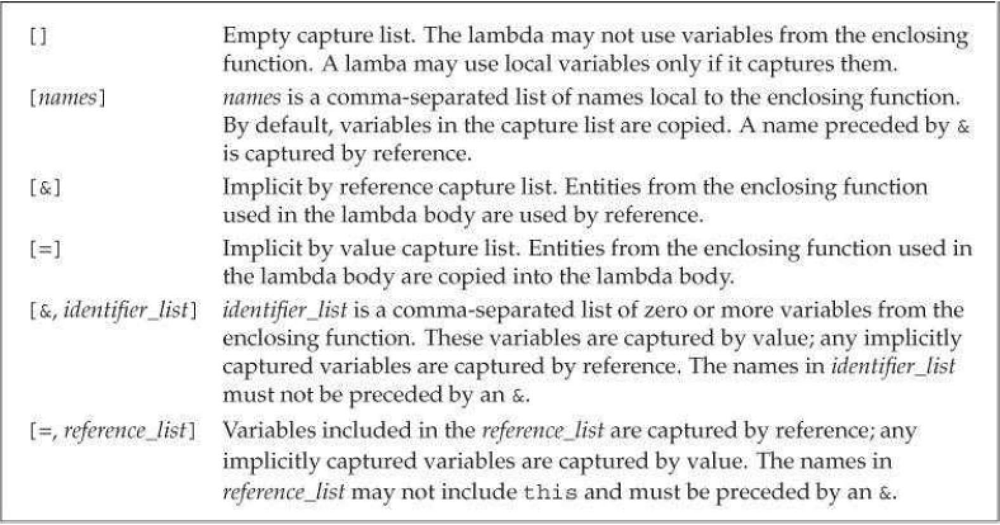
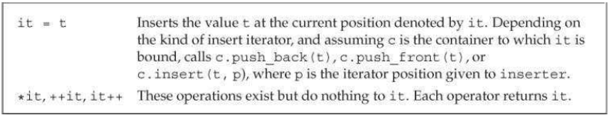
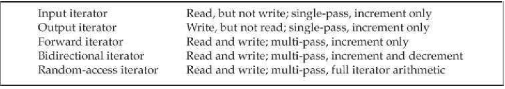
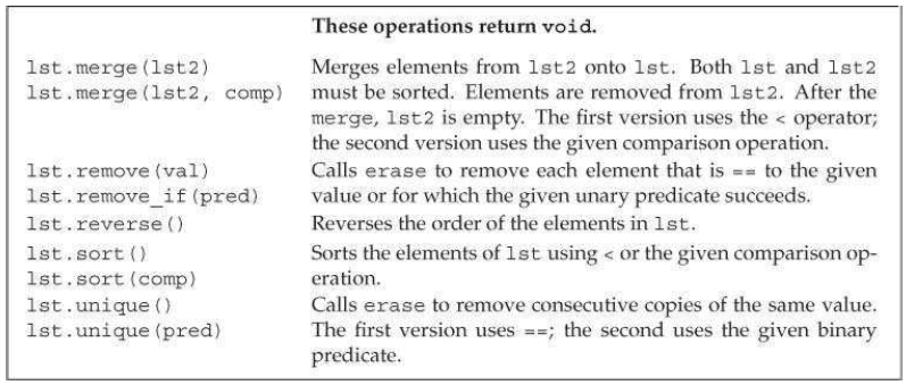
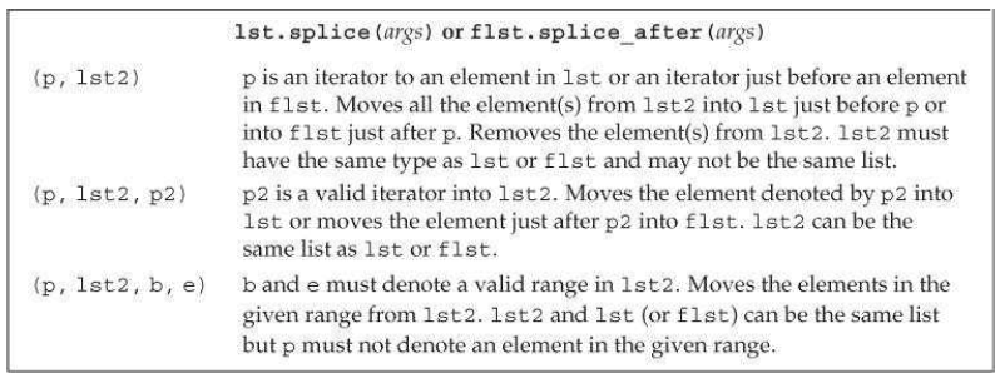

[toc]

## 10 通用算法

算法是通用的，能用于多数容器。

### 10.1 概述

多数算法定义在 `algorithm` 头。 一些数值算法定义在 `numeric` 头。

算法不直接与容器交互，而是与容器的迭代器。如搜索某个值：

```cpp
int val = 42; // value we'll look for
auto result = find(vec.cbegin(), vec.cend(), val);
// report the result
cout << "The value " << val
	<< (result == vec.cend() ? " is not present" : " is present")
    << endl;
```

若找不到 `find` 返回传入的第二个迭代器（这里是 `vec.cend()`）。

因为指针相对于数组的迭代器，因此同一算法可以用于数组：

```cpp
int ia[] = {27, 210, 12, 47, 109, 83};
int val = 83;
int* result = find(begin(ia), end(ia), val);
```

`begin` 和 `end` 都是库函数。

算法会用到等于、小于等运算符，需要元素类型定义。

### 10.2 算法第一眼

库提供了超过100种算法。本节介绍它们的结构和共性。Appendix A lists all the algorithms classified by how they operate.

#### 10.2.1 只读算法

如 `accumulate` 函数，求和。定义在头 `numeric`。有三个参数，前两个是范围迭代器，第三个是初始值，同时决定了返回值的类型。

```cpp
int sum = accumulate(vec.cbegin(), vec.cend(), 0);
```

因为 `string` 也实现了 `+` 运算符，因此我们可以用 `accumulate` 把一个字符串 `vector` 拼接在一起：

```cpp
string sum = accumulate(v.cbegin(), v.cend(), string(""));
```

注意如果第三个参数传了一个字符串字面量，就错了

```cpp
// error: no + on const char*
string sum = accumulate(v.cbegin(), v.cend(), "");
```

`equal` 判定两个序列是否相同。

```cpp
// roster2 should have at least as many elements as roster1
equal(roster1.cbegin(), roster1.cend(), roster2.cbegin());
```

容器类型和元素类型都不需要一样。如 `vector<string>` 和 `list<const char*>` 做比较。

`equal` 要求第二个序列至少要与第一个序列一样长。因为并没有指定第二个容器的尾迭代器。

#### 10.2.2 写容器元素的算法

算法不会改变容器大小。因此容器必须能容纳算法可能对元素的修改。

`fill` 取一个迭代器范围，第三个参数是一个值，将给定范围元素都替换为该值：

```cpp
fill(vec.begin(), vec.end(), 0); // reset each element to 0
// set a subsequence of the container to 10
fill(vec.begin(), vec.begin() + vec.size()/2, 10);
```

`fill_n` 取一个迭代器，一个数量，一个值。

```cpp
    vector<int> vec; // empty vector
    fill_n(vec.begin(), vec.size(), 0); // 全部置为0
```

`fill_n` 假设容器能容纳期望的元素。并且不会检查。我们要自己保证。例如下面的代码，容器是空的，因此头开头开始的10个元素都是无效的！

```cpp
	vector<int> vec; // empty vector
	// disaster: attempts to write to ten (nonexistent) elements in vec
	fill_n(vec.begin(), 10, 0);
```

**back_inserter**

一种保证有空间的方法是利用插入迭代器。通过该迭代器做赋值操作，新元素会被添加都容器。插入迭代器会在 §10.4.1 细讲。目前我们仅以 `back_inserter` 为例子（定义在头 `iterator`）。`back_inserter` 返回绑定到容器的插入迭代器。当我们向这个迭代器指向的元素赋值时，会通过 `push_back` 方法将值加入到容器：

```cpp
    vector<int> vec; // empty vector
    auto it = back_inserter(vec);
    *it = 42; // vec now has one element with value 42
```

算法经常需要使用 `back_inserter` 创建的迭代器。例如：

```cpp
	vector<int> vec; // empty vector
	fill_n(back_inserter(vec), 10, 0); // appends ten elements to vec
```

**拷贝算法**

`copy` 取三个迭代器，前两个表示输入范围，第三个表示目标。调用者要保证自目标开始有足够空间容纳输入的范围。例子，利用 `copy` 将一个内建数组拷贝到另一个：

```cpp
int a1[] = {0,1,2,3,4,5,6,7,8,9};
int a2[sizeof(a1) / sizeof(*a1)]; // 两个数组大小相同
auto ret = copy(begin(a1), end(a1), a2); // copy a1 into a2
```

`replace` 将一个值全部替换为另一个只。函数前两个参数是一个迭代器范围，表示搜索范围。第三四的参数是要替换的值和替换后的值：

```cpp
// replace any element with the value 0 with 42
replace(ilst.begin(), ilst.end(), 0, 42);
```

如果我们想让源序列不变，可以使用 `replace_copy`。该算法取第三个迭代器，表示调整后的序列写到哪里：

```cpp
// use back_inserter to grow destination as needed
replace_copy(ilst.cbegin(), ilst.cend(), back_inserter(ivec), 0, 42);
```

#### 10.2.3 调整顺序的算法

例子。消除容器内重复元素。先用 `sort` 排序：

```cpp
    void elimDups(vector<string> &words)
    {
        sort(words.begin(), words.end());
        // end_unique指向调整后的序列的尾部
        auto end_unique = unique(words.begin(), words.end());
        // 移除多余的元素
        words.erase(end_unique, words.end());
    }
```

库算法操纵的是迭代器，不是容器。因此，算法不能直接添加或删除元素。因此在上面的例子，我们只能用容器方法删除元素。

### 10.3 定制操作

很多算法用到了比较。一般通过元素类型的 `<` 或 `==` 运算符。也允许我们定制比较方法。

#### 10.3.1 向算法传一个函数

`sort` 的第三个参数是一个断言（可选）。The predicates that we supply to `sort` must meet the requirements that we’ll describe in §11.2.2. 这里我们忽略复杂性，直接上例子。下面的 `isShorter` 可以作为断言传给 `sort`。

```cpp
// comparison function to be used to sort by word length
bool isShorter(const string &s1, const string &s2)
{
	return s1.size() < s2.size();
}
// sort on word length, shortest to longest
sort(words.begin(), words.end(), isShorter);
```

若需要稳定排序算法，用 `stable_sort`。稳定排序算法维持相等元素的之前的顺序不变。

#### 10.3.2 Lambda 表达式

`find_if` 算法从一个范围（前两个参数）中选择符合断言（第三个参数）的元素的迭代器。

可以向算法传一个 callable 对象。callable 对象或表达式指可以应用调用运算符的对象或表达式。例如，若 `e` 是一个 callable 表达式，我们可以写 `e(args)`。

之前使用过的 callable 是函数及函数指针。还有两种 callables：重写了 function-call 运算符的类（§14.8）和 lambda 表达式。

【新标准】lambda 表达式与函数一样，有返回值类型、参数列表和函数正文：

	[capture list] (parameter list) -> return type { function body }

`capture list` 是 lambda 用到的外围局部变量的列表，一般为空。 lambda 的返回值必须放在后面。

参数列表和返回类型可以省略。但 capture list 和函数正文必须有：`auto f = [] { return 42; };`。
调用 lambda 的方式与调用普通函数一样：`cout << f() << endl; // prints 42`。

**向 lambda 传参数**

前面 `isShorter` 函数的 lambda 版本：

```cpp
	[](const string &a, const string &b) { return a.size() < b.size();}
```

相应的，改写排序：

```cpp
	stable_sort(words.begin(), words.end(),
    	[](const string &a, const string &b)
        	{ return a.size() < b.size();});
```

**Capture List**

在函数中定义的 lambda 可以使用函数中的局部变量。此时必须在 capture list 中显式将使用哪些（非静态的）局部变量列出。静态的局部变量可以直接使用，不必列出。

```cpp
	[sz](const string &a) { return a.size() >= sz; };
```

**for_each 算法**

for_each 算法对输入范围内的每个元素调用一个 callable 对象：

```cpp
    for_each(wc, words.end(), [](const string &s){cout << s << " ";});
    cout << endl;
```

#### 10.3.3 Lambda 捕获和返回

定义一个 lambda，编译器会产生一个新的（无名）类。详见 §14.8.1。当我们把一个 lambda 传给一个函数，我们定义了一个新类型同时定义了该类型的一个对象。

捕获到的变量会成为产生的类的数据成员。

**Capture by Value**

与参数传递一样，捕获可以捕获值或引用。下表列出了捕获列表可能的结构。上面的例子，都是捕获值，即要发生拷贝。值捕获，或者拷贝发生在 lambda 创建时。例子：

```cpp
void fcn1()
{
    size_t v1 = 42; // local variable
    // copies v1 into the callable object named f
    auto f = [v1] { return v1; };
    v1 = 0;
    auto j = f(); // j is 42; f stored a copy of v1 when we created it
}
```



**Capture by Reference**

示例：

```cpp
void fcn2()
{
    size_t v1 = 42; // local variable
    // the object f2 contains a reference to v1
    auto f2 = [&v1] { return v1; };
    v1 = 0;
    auto j = f2(); // j is 0; f2 refers to v1; it doesn't store it
}
```

捕获引用与函数返回引用具有相同的问题和限制。捕获的引用，在 lambda 执行时必须存在。若捕获的是局部变量，但 lambda 在函数结束后才执行，此时局部变量已消失，引用失效。

函数可以返回一个 lambda。此时，与函数不能返回到局部变量的引用一样，返回的 lambda 不能包含到局部变量的引用。

**隐式捕获**

除了显式列出捕获的局部变量，我们还可以让编译器自己推断。在捕获列表中，`&` 和 `=` 分别表示隐式按引用捕获或按值捕获。

```cpp
    // sz implicitly captured by value
    wc = find_if(words.begin(), words.end(), [=](const string &s) { return s.size() >= sz; });
```

若一些变量按值捕获，一些按引用捕获，我们可以混用显式和隐式捕获。

```cpp
    void biggies(vector<string> &words, vector<string>::size_type sz,
    	ostream &os = cout, char c = ' ')
    {
        // other processing as before
        // os 隐式捕获引用；c 显式捕获值
    	for_each(words.begin(), words.end(),
        	[&, c](const string &s) { os << s << c; });
        // os 显式捕获应用；c 隐式捕获值
    	for_each(words.begin(), words.end(),
    		[=, &os](const string &s) { os << s << c; });
    }
```

若隐式捕获的是值，则显式捕获只能是引用；反之亦然。

**Mutable Lambdas**

默认，按值捕获的变量无法修改。若想，需要在参数列表后加关键字 `mutable`。此时空的参数列表不能被生路额。

```cpp
void fcn3()
{
    size_t v1 = 42; // local variable
    // f can change the value of the variables it captures
    auto f = [v1] () mutable { return ++v1; };
    v1 = 0;
    auto j = f(); // j is 43
}
```

而如果捕获的是引用，只要引用的对象不是常量就能修改。

**指定 Lambda 返回类型**

若 lambda 中只有一个 `return` 语句，我们可以不指定返回类型，由编译器推断。但如果 lambda 中包含有非 `return` 语句，编译器推断出的返回类型是 `void`。

例如，下面的写法，编译器能推断出正确返回值类型：

```cpp
transform(vi.begin(), vi.end(), vi.begin(),
	[](int i) { return i < 0 ? -i : i; });
```

但改成 if 语句就不行了：

```cpp
// error: cannot deduce the return type for the lambda
transform(vi.begin(), vi.end(), vi.begin(),
    [](int i) { if (i < 0) return -i; else return i; });
```

必须显式指定返回值类型：

```cpp
transform(vi.begin(), vi.end(), vi.begin(),
	[](int i) -> int { if (i < 0) return -i; else return i; });
```

#### 10.3.4 绑定实参（argument）

若 lambda 用到了捕获变量，将其替换成普通函数就难了。例如之前的 `isShorter`，替换成函数，需要两个参数，把原本捕获到的变量显式传进入：

```cpp
bool check_size(const string &s, string::size_type sz)
{
	return s.size() >= sz;
}
```

但 `find_if` 的断言只会传一个参数。

解决方法是使用【新标准】的库函数 `bind`（定义在头 `functional`）。

`bind` 函数可以看做是一个通用目的的函数适配器。它将一个 callable 对象包装成一个新的 callable 对象。

`bind` 的形式如：

	auto newCallable = bind(callable, arg_list);

调用 `newCallable`，会转为调用 `callable`，同时传入 `arg_list`。`arg_list` 可以包含 `_n` 形式的参数。它们是占位符，表示 `newCallable` 相应位置上的参数。如 `_1` 是 `newCallable` 的第一个参数。

例子，我们适配一下 `check_size`，把参数 `sz` 绑定掉。

```cpp
auto check6 = bind(check_size, _1, 6);

string s = "hello";
bool b1 = check6(s); // check6(s) 调用 check_size(s, 6)
```

之前的 lambda 换成通过函数绑定：

```cpp
	auto wc = find_if(words.begin(), words.end(),
    	[sz](const string &a)
        ...
```

```cpp
	auto wc = find_if(words.begin(), words.end(),
		bind(check_size, _1, sz));
```

**占位名**

`_n` 实际定义在命名空间 `std::placeholders` 下。上面的例子，直接用 `_1`，其实是假设了前面有 `using std::placeholders::_1;`。

如果用到多个占位符，一个个列出 `using` 声明很麻烦。可以直接用：
`using namespace std::placeholders;`

`placeholders` 命名空间也定义在 `functional` 头。

**参数绑定**

`bind` 还可以用来调整参数顺序：

```cpp
// g is a callable object that takes two arguments
auto g = bind(f, a, b, _2, c, _1);
```

利用参数重排，我们可以反转 `isShorter` 的含义：

```cpp
// sort on word length, shortest to longest
sort(words.begin(), words.end(), isShorter);
// sort on word length, longest to shortest
sort(words.begin(), words.end(), bind(isShorter, _2, _1));
```

**绑定引用参数**

默认，非占位符参数会被拷贝进返回的 callable 对象。但有时我们想传引用，或我们只得传引用，不能拷贝。此时我们需要用刀库函数 `ref`。

例子，我们想替换掉下面的 lambda：

```cpp
// os is a local variable referring to an output stream
// c is a local variable of type char
for_each(words.begin(), words.end(),
    [&os, c](const string &s) { os << s << c; });
```

`os` 不能被拷贝，因此：

```cpp
ostream &print(ostream &os, const string &s, char c)
{
    return os << s << c;
}

for_each(words.begin(), words.end(), bind(print, ref(os), _1, ' '));
```

The `ref` function returns an object that contains the given reference and that is itself copyable. There is also a `cref` function that generates a class that holds a reference to `const`. `ref` 和 `cref` 函数也都定义在头 functional。

> 老版本的 C++ 提供一种功能受限的绑定功能。库定义了两个函数 bind1st 和 bind2nd。它们只能绑定方法的第一个或第二个参数。新标准已经弃用了该功能。

### 10.4 迭代器再探

`iterator` 头还定义了一些迭代器：

- Insert iterators：绑定到容器，可以用于向容器插入元素。
- Stream iterators: These iterators are bound to input or output streams and can be used to iterate through the associated IO stream.
- Reverse iterators: 这些迭代器向后移动。除了 `forward_list` 之外的库容器都有反向迭代器。
- Move iterators: These special-purpose iterators move rather than copy their elements.

We’ll cover move iterators in §13.6.2.

#### 10.4.1 Insert Iterators

插入迭代器是一种适配器，取一个容器，返回一个迭代器。通过该迭代器赋值，迭代器调用容器的方法在容器的特定位置添加元素。The operations these iterators support are listed in Table 10.2 (overleaf).



有三种插入迭代器。区域自傲与插入位置：

- `back_inserter`：通过 `push_back` 插入元素。
- `front_inserter`：通过 `push_front`
- `inserter`：通过 `insert`。该函数有第二个参数，必须是给定容器的迭代器，元素在该迭代器指定位置之前插入。

We can use `front_inserter` only if the container has `push_front`. Similarly, we can use `back_inserter` only if it has `push_back`.

`inserter(c, iter)`，连续使用时，始终是在 `iter` 指定的元素之前插入。即 `* it = va1;`，相对于：

```cpp
it = c.insert(it, val); // it 指向新插入的元素
++it; // 增加it于是它仍指向之前指向的元素
```

#### （未）10.4.2 iostream Iterators

#### 10.4.3 Reverse Iterators

可以通过 `rbegin`、 `rend`、 `crbegin`、 `crend` 获取到反向迭代器。

反向迭代器和算法连用可以达到一些效果。如实现降序，

```cpp
sort(vec.begin(), vec.end()); // sorts vec in ''normal'' order
// sorts in reverse: puts the smallest element at the end of vec
sort(vec.rbegin(), vec.rend());
```

反向迭代器需要迭代器支持 `--` 和 `++`。因为流不能后移，因此流也不支持反向迭代器。

假设 `line` 是一个 `string`。里面是逗号分隔的单词。我们要获取最后一个单词，可以先利用反向迭代器找到最后一个逗号的位置：

```cpp
// find the last element in a comma-separated list
auto rcomma = find(line.crbegin(), line.crend(), ',');
```

获取到 `rcomma` 后，我们不能直接用，因为它是一个反向的迭代器。需要先转换成普通的向前的迭代器。我们可以利用 `reverse_iterator` 的 `base` 成员：

```cpp
// ok: get a forward iterator and read to the end of line
cout << string(rcomma.base(), line.cend()) << endl;
```

### 10.5 通用算法的结构

每个算法都对迭代器需要支持的操作有要求。例如 `find` 要求可以通过迭代器访问元素，增加迭代器，比较两个迭代器相等。而 `sort`，要求读、写和随机访问元素。算法对迭代器的要求分为五类，如下。



For example, `ostream_iterator` have only increment, dereference, and assignment. Iterators on vector, strings, and deques support these operations and the decrement, relational, and arithmetic operators.

Iterators are categorized by the operations they provide and the categories form a sort of hierarchy. With the exception of output iterators, an iterator of a higher category provides all the operations of the iterators of a lower categories.

> Many compilers will not complain when we pass the wrong category of iterator to an algorithm.

#### 10.5.1 The Five Iterator Categories

**输入迭代器**：can read elements in a sequence. 输入迭代器必须提供：

- 相等和不等运算符，用于比较两个迭代器。
- 前缀和后缀增加运算符（++），移动迭代器
- 解引用运算符（`*`），用于读取元素；解引用只会出现在赋值的右边。
- `->` 及 `(* it).member`。

Input iterators may be used only sequentially. We are guaranteed that *it++ is valid, but incrementing an input iterator may invalidate all other iterators into the stream. As a result, there is no guarantee that we can save the state of an input iterator and examine an element through that saved iterator. 输入迭代器，因此只能用于单次通过的算法。`find` 和 `accumulate` 算符需要输入迭代器；`istream_iterator` 是一个输入迭代器。

**输出迭代器**：必须提供，

- 前缀和后缀增加运算符（++），移动迭代器
- 解引用运算符（`*`）只会出现在赋值的左边。

We may assign to a given value of an output iterator only once. 与输入迭代器一样，输出迭代器只能用于单次通过的算法。例如 `copy` 的第三个参数是一个输出迭代器。 `ostream_iterator` 是一个输出迭代器。

**前向迭代器**：可以读写给定序列。只会沿序列移动一次。前向迭代器支持输入和输出迭代器的所有方法。但它们可以读写同一个元素多次。Therefore, we can use the saved state of a forward iterator. Hence, algorithms that use forward iterators may make multiple passes through the sequence. `replace` 算法需要一个前向迭代器； `forward_list` 的迭代器是一个前向迭代器。

**双向迭代器**：can read and write a sequence forward or backward. 除了支持前向迭代器的所有功能，双向迭代器还支持前缀和后缀减运算符（`--`）。 `reverse` 算法需要双向迭代器。除 `forward_list` 之外的库容器的迭代器，是双向迭代器。

**随机访问迭代器**：访问序列中任意位置都是常量事件。它们支持双向迭代器的所有功能。除此之外，

- 关系运算符（<, <=, >, >=）比较两个迭代器的相对位置。
- 加减运算符（+, +=, -, -=）使得迭代器一次可以移动多个元素的距离
- 两个迭代器相减，产生元素个差
- 下标运算符（`iter[n]`）等价于 `* (iter + n)`。

`sort` 算符需要随机访问运算符。`array`、 `deque`、 `string` 和 `vector` 的迭代器都是随机访问迭代器，内建数组的指针也是。

#### 10.5.3 算法的命名约定

引起元素顺序变换的算法默认在原容器中操作。保持原容器不变，结果产生一个新容器的，以 `_copy` 结尾：

```cpp
reverse(beg, end); // reverse the elements in the input range
reverse_copy(beg, end, dest);// copy elements in reverse order into dest
```

### 10.6 容器特有的算法

与其他容器不同的是，`list` 和 `forward_list` 将一些算法定义成了它们的成员。如 `list` 定义了自己版本的 `sort`、 `merge`、 `remove`、 `reverse`、 `unique`。通用版本的 `sort` 需要随机访问迭代器。因此 `sort` 不能用于 `list` 和 `forward_list`。

The generic versions of the other algorithms that the list types define can be used with lists, but at a cost in performance. These algorithms swap elements in the input sequence. A list can “swap” its elements by changing the links among its elements rather than swapping the values of those elements. As a result, the list-specific versions of these algorithms can achieve much better performance than the corresponding generic versions.

These list-specific operations are described in Table 10.6. Generic algorithms not listed in the table that take appropriate iterators execute equally efficiently on lists and forward_listss as on other containers.



**`splice` 成员**

The list types also define a `splice` algorithm, which is described in Table 10.7. This algorithm is particular to list data structures. Hence a generic version of this algorithm is not needed.



**List特有的操作会修改容器**

Most of the list-specific algorithms are similar—but not identical—to their generic counterparts. However, a crucially important difference between the list-specific and the generic versions is that the list versions change the underlying container. For example, the list version of remove removes the indicated elements. The list version of unique removes the second and subsequent duplicate elements.

Similarly, merge and splice are destructive on their arguments. For example, the generic version of merge writes the merged sequence to a given destination iterator; the two input sequences are unchanged. The list merge function destroys the given list—elements are removed from the argument list as they are merged into the object on which merge was called. After a merge, the elements from both lists continue to exist, but they are all elements of the same list.


