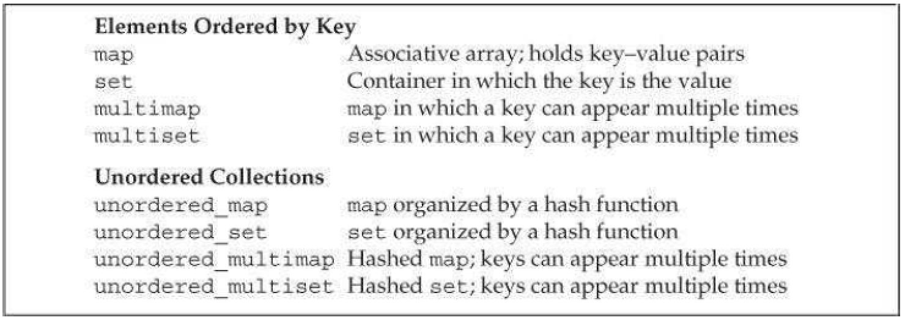
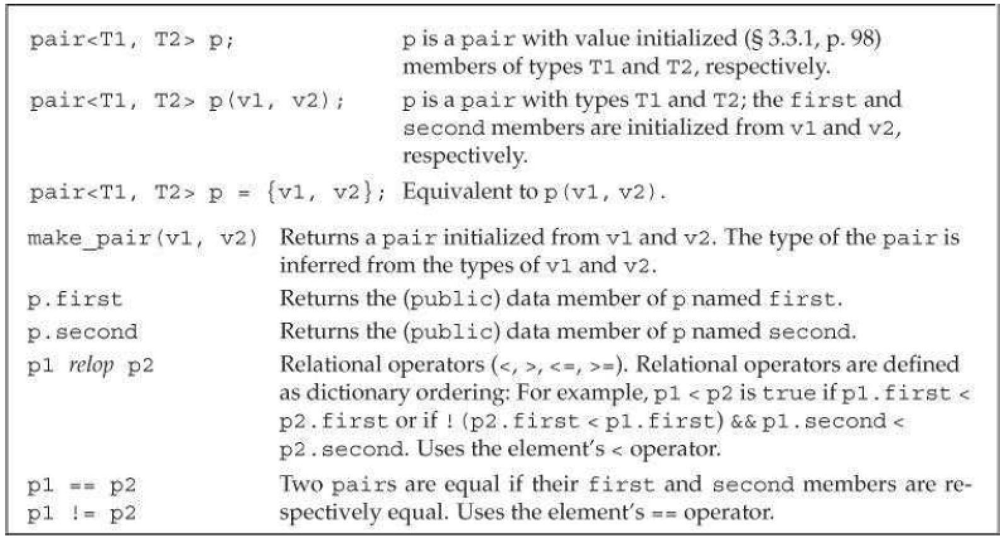
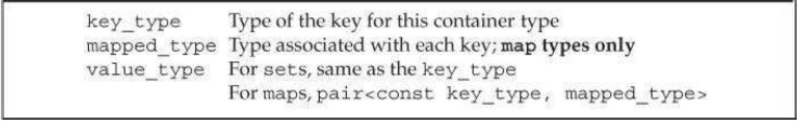
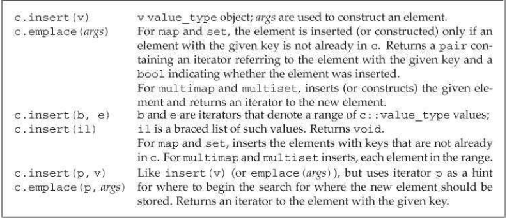
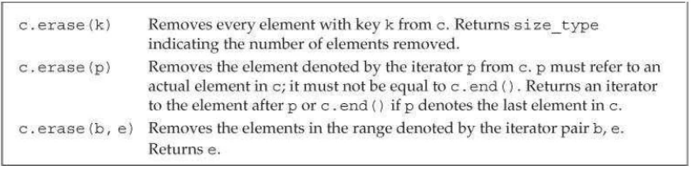
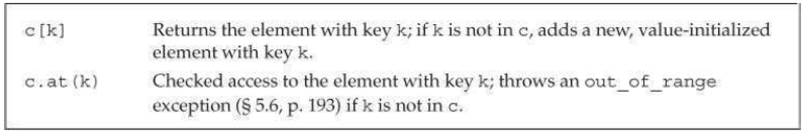
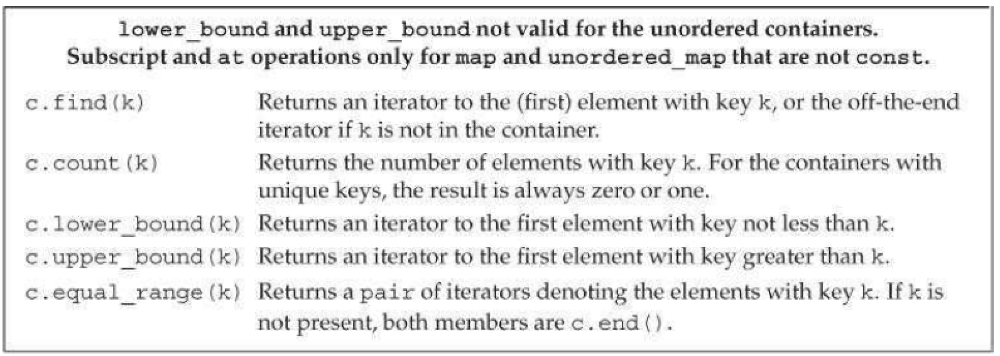
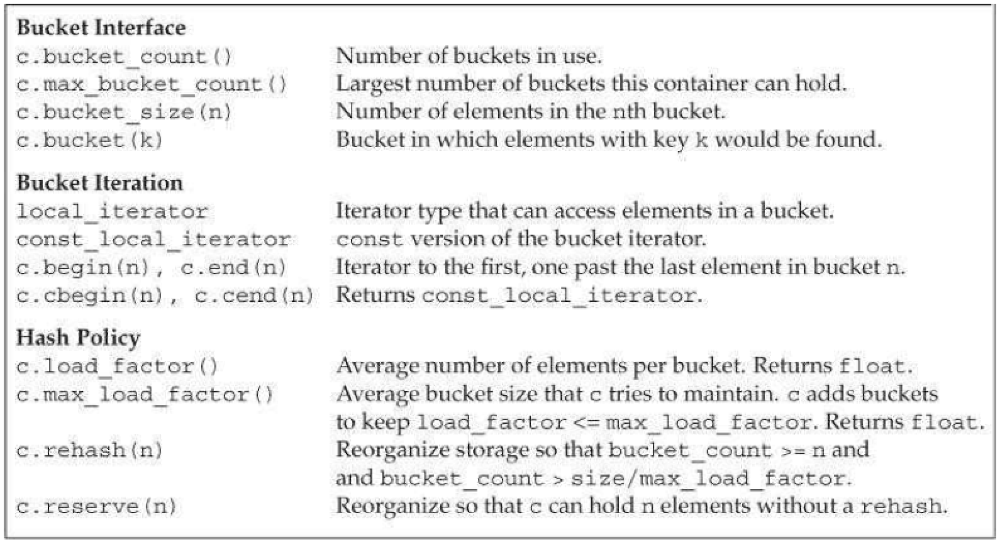

[toc]

## 11 关联容器

Elements in an associative container are stored and retrieved by a key. 两个主要的关联容器是 `map` 和 `set`。库提供了共8个关联容器。它们不是 set 就是 map。他们在于是否允许键重复，以及存储是否有序。允许键重复的容器有关键字 `multi`。键无序的容器有关键字 `unordered`。



`map` 和 `multimap` 定义在头 `map`；`set` 和 `multiset` 定义在头 `set`；无序版本定义在 `unordered_map` 或 `unordered_set` 头。

### 11.1 使用关联容器

The `map` type is often referred to as an associative array.

**使用 map**

经典例子是单词计数：

```cpp
    map<string, size_t> word_count; // empty map
    string word;
    while (cin >> word)
    	++word_count[word];
    for (const auto &w : word_count)
	    cout << w.first << " occurs " << w.second
    		<< ((w.second > 1) ? " times" : " time") << endl;
```

迭代 map 每次得到一个 `pair` 类型的变量。变量有两个成员，`first` 和 `second`，分别表示键和值。

**使用 set**

扩展上一节的例子，不统计助词：

```cpp
    map<string, size_t> word_count; // empty map
    // 列表初始化 set<string>
    set<string> exclude = {"The", "But", "And", "Or", "An", "A",
    	"the", "but", "and", "or", "an", "a"};
    string word;
    while (cin >> word)
        // count only words that are not in exclude
        if (exclude.find(word) == exclude.end())
        	++word_count[word];
```

### 11.2 关联容器概述

关联容器的迭代器是双向的。

#### 11.2.1 定义一个关联容器

关联容器有默认构造器。新标准还允许列表初始化。

```cpp
    map<string, size_t> word_count; // empty
    // list initialization
    set<string> exclude = {"the", "but", "and", "or", "an", "a",
    	"The", "But", "And", "Or", "An", "A"};
    // three elements; authors maps last name to first
    map<string, string> authors = { {"Joyce", "James"},
    	{"Austen", "Jane"}, {"Dickens", "Charles"} };
```

初始化一个 multimap 或 multiset

map 或 set 必须唯一；一个键轸念对应一个元素；`multimap` 和 `multiset` 无此限制；一个键可以对应多个元素。

```cpp
    // 定义20个元素，其中两两重复
    vector<int> ivec;
    for (vector<int>::size_type i = 0; i != 10; ++i) {
        ivec.push_back(i);
        ivec.push_back(i); // duplicate copies of each number
    }
    set<int> iset(ivec.cbegin(), ivec.cend());
    multiset<int> miset(ivec.cbegin(), ivec.cend());
    cout << ivec.size() << endl; // prints 20
    cout << iset.size() << endl; // prints 10
    cout << miset.size() << endl; // prints 20
```

#### 11.2.2 键类型的约束


无序集合对键的要求参见 §11.4。对于有序集合 map, multimap, set, multiset，键的类型要能比较。库默认用 `<` 比较键。

**自定义操作替代小于运算符**

像算法一样，我们可以自定义比较运算。The specified operation must define a **strict weak ordering** over the key type. We can think of a strict weak ordering as “less than,” although our function might use a more complicated procedure. However we define it, the comparison function must
have the following properties:

- 两个键不能相互小于对方。
- 传递性。若 k1 小于 k2， k2 小于 k3，则 k1 小于 k3。
- 若两个键，都不小于对方，则二者相等。相等也具有传递性。

> In practice, what’s important is that a type that defines a < operator that “behaves **normally**” can be used as a key.

例如我们不能定义 `Sales_data` 的 `multiset`，因为 `Sales_data` 没有 `<` 运算符。但我们可以通过函数 `compareIsbn`，它定义了 strict weak ordering：

```cpp
bool compareIsbn(const Sales_data &lhs, const Sales_data &rhs)
{
	return lhs.isbn() < rhs.isbn();
}
```

使用 `compareIsbn`，一方面要将其传入初始化器。另一方面，要将其指针（类型）加入到泛型声明：

```cpp
	multiset<Sales_data, decltype(compareIsbn)*> bookstore(compareIsbn);
```

#### 11.2.3 pair 类型

`pair` 定义在头 `utility`。一个 `pair` 对象有两个数据成员。与容器一样， `pair` 是一个模板，需要两个类型；两个成员分属这两个类型。

```cpp
    pair<string, string> anon; // holds two strings
    pair<string, size_t> word_count; // holds a string and an size_t
    pair<string, vector<int>> line; // holds string and vector<int>
```

`pair` 的默认构造器会把两个数据成员**值初始化**（§3.3.1）。或我们可以提供两个成员的初始化值：

```cpp
	pair<string, string> author{"James", "Joyce"};
```

`pair` 的两个数据成员都是公有的，名分别是 `first` 和 `second`，

```cpp
cout << w.first << " occurs " << w.second
	<< ((w.second > 1) ? " times" : " time") << endl;
```

`pair` 的操作：



若函数需要返回一个 `pair`，新标准允许我们列表初始化返回值：

```cpp
    pair<string, int> process(vector<string> &v)
    {
        if (!v.empty())
        	return {v.back(), v.back().size()}; // list initialize
        else
        	return pair<string, int>();
    }
```

之前，通过构造器显式创建 `pair`：

```cpp
if (!v.empty())
	return pair<string, int>(v.back(), v.back().size());
```

或利用 `make_pair`：

```cpp
if (!v.empty())
	return make_pair(v.back(), v.back().size());
```

### 11.3 关联容器的操作

关联容器定义的附加类型：



对于 set，`key_type` 和 `value_type` 相同。对于 `map`，`pair` 的键部分是常量：

```cpp
    set<string>::value_type v1; // v1 is a string
    set<string>::key_type v2; // v2 is a string
    map<string, int>::value_type v3; // v3 is a pair<const string, int>
    map<string, int>::key_type v4; // v4 is a string
    map<string, int>::mapped_type v5; // v5 is an int
```

#### 11.3.1 关联容器的迭代器

解引用一个迭代器，得到的是容器的 `value_type` 类型的值。对于 `map`，`value_type` 是一个 `pair`：

```cpp
    // get an iterator to an element in word_count
    auto map_it = word_count.begin();
    // *map_it is a reference to a pair<const string, size_t> object
    cout << map_it->first; // prints the key for this element
    cout << " " << map_it->second; // prints the value of the element
    map_it->first = "new key"; // 错误！键是常量
    ++map_it->second; // ok: we can change the value through an iterator
```

**set 的迭代器是 const**

尽管 set 定义了 `iterator` 和 `const_iterator` 两个类型，但它们给我们的都是对元素的只读访问。与 map 一样， set 的键也是常量。我们可以用 set 的迭代器读元素值，但不能写。

```cpp
    set<int> iset = {0,1,2,3,4,5,6,7,8,9};
    set<int>::iterator set_it = iset.begin();
    if (set_it != iset.end()) {
        *set_it = 42; // 错误：只读的
        cout << *set_it << endl; // ok: can read the key
    }
```

**关联容器的迭代器**

`map` 和 `set` 提供 Table 9.2 里面所有的 `begin` 和 `end`。

```cpp
auto map_it = word_count.cbegin();
while (map_it != word_count.cend()) {
    cout << map_it->first << " occurs "
        << map_it->second << " times" << endl;
    ++map_it; // increment the iterator to denote the next element
}
```

> 迭代器遍历 map, multimap, set, multiset，按键的升序。

**关联容器与迭代器**

#### 11.3.2 添加元素

`insert` 方法添加一个元素或范围，或一个初始化列表。

```cpp
    vector<int> ivec = {2,4,6,8,2,4,6,8}; // ivec has eight elements
    set<int> set2; // empty set
    set2.insert(ivec.cbegin(), ivec.cend()); // set2 has four elements
    set2.insert({1,3,5,7,1,3,5,7}); // set2 now has eight elements
```



**向 map 添加元素**

插入的是 `pair`：

```cpp
    // four ways to add word to word_count
    word_count.insert({word, 1});
    word_count.insert(make_pair(word, 1));
    word_count.insert(pair<string, size_t>(word, 1));
    word_count.insert(map<string, size_t>::value_type(word, 1));
```

**测试 insert 的返回值**

`insert` 或 `emplace` 的返回值取决于容器类型和参数。若容器具有唯一键，`insert` 或 `emplace` 插入单个元素，则返回的 `pair` 可以告诉我们插入是否实际发生：若键已存在，插入不会进行！（**不会覆盖掉上一个值！！！**）`first`  member of the pair is an iterator to the element with the given key； `second` 是一个布尔，表示是否插入。

As an example, we’ll rewrite our word-counting program to use `insert`:

```cpp
    map<string, size_t> word_count; // empty map
    while (cin >> word) {
        // inserts an element with key equal to word and value 1;
        // if word is already in word_count, insert does nothing
    auto ret = word_count.insert({word, 1});
    if (!ret.second) // word was already in word_count
    	++ret.first->second; // increment the counter
    }
```

`insert` 的返回值 `ret` 的类型是 `pair<map<string, size_t>::iterator, bool>`。

**向 multiset 或 multimap 添加元素**

Because keys in a multi container need not be unique, `insert` on these types always inserts an element:

```cpp
    multimap<string, string> authors;
    // adds the first element with the key Barth, John
    authors.insert({"Barth, John", "Sot-Weed Factor"});
    // ok: adds the second element with the key Barth, John
    authors.insert({"Barth, John", "Lost in the Funhouse"});
```

For the containers that allow multiple keys, the `insert` operation that takes a single element returns an iterator to the new element. There is no need to return a `bool`, because `insert` always adds a new element in these types.

#### 11.3.3 擦除元素

可以擦除一个或一片元素。



```cpp
// erase on a key returns the number of elements removed
if (word_count.erase(removal_word))
	cout << "ok: " << removal_word << " removed\n";
else cout << "oops: " << removal_word << " not found!\n";
```

#### 11.3.4 下标与 map

`map` 和 `unordered_map` 支持下标运算符和相应的 `at` 函数。但 `multimap` 或 `unordered_multimap` 不支持，因为有可能有多余一个值与键关联。与其他下标运算符一样， map 的下标运算符返回的是左值。



与其他下标运算符不同，若对应元素不存在，会插入新的值。值被值初始化。不过注意此时 map 不能是常量。

```cpp
    map <string, size_t> word_count; // empty map
    word_count["Anna"] = 1;
```

{{
值初始化的意思是，只要出现了下标访问，即便是用作右值，也会导致插入新值。如 `cout << word_count["Anna"];`，若 `"Anna"` 原本不存在，会插入！！值被值初始化。
}}


#### 11.3.5 访问元素

若只关心是否存在，用 `find`。 `count` 返回键有几个关联的值。



因此下标运算符的副作用（会插入值），因此我们**不能用下标运算符判定元素是否存在**！！我们得用 `find` 等函数。

**Finding Elements in a multimap or multiset**

若 multimap 或 multiset 中，存在一个键有多个关联值，它们在容器中位置相邻。

例如若有一个映射，作者和书名，一对多。要找出一个作者的所有书，可以利用 `count`，

```cpp
string search_item("Alain de Botton"); // author we'll look for
auto entries = authors.count(search_item);
auto iter = authors.find(search_item); // 找到第一项
// 循环次数
while(entries) {
    cout << iter->second << endl; // print each title
    ++iter; // advance to the next title
    --entries; // keep track of how many we've printed
}
```

**`lower_bound` 和 `upper_bound` 函数**

另一种解决问题的方法，用 `lower_bound` 和 `upper_bound` 方法。二者取一个键，返回迭代器，分别指向与键关联的第一个实例和最后一个实例的后面。若指定键不在容器中， `lower_bound` 和 `upper_bound` 返回相等的迭代器，且都指向此键可以插入容器的位置（考虑键的顺序性后）。

重写上一节例子：

```cpp
for (auto beg = authors.lower_bound(search_item),
	end = authors.upper_bound(search_item);
    beg != end; ++beg)
    cout << beg->second << endl; // print each title
```

**`equal_range` 函数**

第三种方式是最直接的一种，用 `equal_range`。它返回一个 `pair`。若键存在，则 `first` 和 `second` 分别是指向第一个元素和最后一个元素后面的迭代器。若未找到键，则 `first` 和 `second` 迭代器都指向该键可以插入容器的位置。

再次改写：

```cpp
for (auto pos = authors.equal_range(search_item);
	pos.first != pos.second; ++pos.first)
    cout << pos.first->second << endl; // print each title
```

#### （未）11.3.6 A Word Transformation Map

### 11.4 无序的容器

新标准定义了四个无序关联容器。它们不再使用比较运算符组织元素，而是用一个哈希函数和键的 `==` 运算符。

无序容器用于：1、键的类型没有明显的顺序关系；2、维护顺序开销太大。

Although hashing gives better average case performance in principle, achieving good results in practice often requires a fair bit of performance testing and tweaking. 因此使用有序容器一般更简单，性能更好。

无序容器的操作与有序容器基本相同，如 `find`，`insert`。

无序容器版的单词计数：

```cpp
    unordered_map<string, size_t> word_count;
    string word;
    while (cin >> word)
    	++word_count[word]; // fetch and increment the counter for word
    for (const auto &w : word_count)
        cout << w.first << " occurs " << w.second
            << ((w.second > 1) ? " times" : " time") << endl;
```

**Managing the Buckets**

The unordered containers are organized as a collection of buckets, each of which holds zero or more elements. These containers use a hash function to map elements to buckets. To access an element, the container first computes the element’s hash code, which tells which bucket to search. The container puts all of its elements with a given hash value into the same bucket. If the container allows multiple elements with a given key, all the elements with the same key will be in the same bucket. As a result, the performance of an unordered container depends on the quality of its hash function and on the number and size of its buckets.

The unordered containers provide a set of functions, listed in Table 11.8, that let us anage the buckets. These members let us inquire about the state of the container and force the container to reorganize itself as needed.



**无序容器对键类型的要求**

无序容器默认使用键类型的 `==` 运算符比较元素。利用一个 `hash<key_type>` 类型的对象产生元素的哈希吗。库为内建类型提供了 hash 模板，还有指针和一些库类型，如 `string` 和智能指针。对于这些键类型，我们可以直接定义它们的无序集合。

However, we cannot directly define an unordered container that uses a our own class types for its key type. Unlike the containers, we cannot use the hash template directly. Instead, we must supply our own version of the hash template. We’ll see how to do so in §16.5.

Instead of using the default hash, we can use a strategy similar to the one we used to override the default comparison operation on keys for the ordered containers (§11.2.2). 例如，若要将 `Sales_data` 作为键，我们需要提供函数，替代 `==` 运算符和计算哈希码。

```cpp
    size_t hasher(const Sales_data &sd)
    {
        return hash<string>()(sd.isbn());
    }
    bool eqOp(const Sales_data &lhs, const Sales_data &rhs)
    {
        return lhs.isbn() == rhs.isbn();
    }

    using SD_multiset = unordered_multiset<Sales_data, decltype(hasher)*, decltype(eqOp)*>;
    // arguments are the bucket size and pointers to the hash function and equality operator
    SD_multiset bookstore(42, hasher, eqOp);
```

If our class has its own `==` operator we can override just the hash function:

```cpp
    // use FooHash to generate the hash code; Foo must have an == operator
    unordered_set<Foo, decltype(FooHash)*> fooSet(10, FooHash);
```


