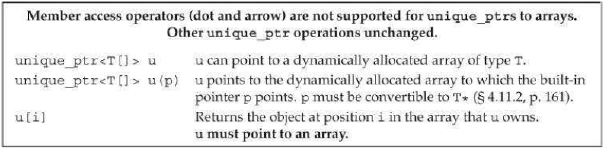

[toc]

## 12 动态内存

我们之前编写的程序，其中的对象都有明确的生命周期。全局对象在程序启动时分配，在程序结束后销毁。局部、自动对象随定义它们的块的进入退出而创建、销毁。局部、静态对象在第一次使用前分配，在程序结束后销毁。

除了自动和静态对象，C++还允许我们动态分配对象。这些对象的生命周期独立于其创建的位置；它们一直存在，直到被显式的释放。

释放动态对象是BUG的一大来源。为了安全的使用动态对象，库定义了两个智能指针类型，动态的管理分配的对象。智能指针确保它们指向的对象在合适的时机被自动释放。

之前我们的程序只使用**静态内存**或**栈内存**。静态内存用于局部静态对象(§6.1.1)、类的静态数据成员(§7.6)、定义在函数之外的变量。栈内存用于定义在函数内的非静态对象。分配在静态内存和栈内存的对象由**编译器**{{不是运行时}}自动创建和销毁。
除了静态和栈内存，每个程序还有一块内存池可使用。这块内存被称为 **free store** 或堆。堆用于动态分配的对象 — —即程序在**运行时**分配的对象。程序控制动态对象的生命周期；代码必须显式销毁这些对象。

### 12.1 动态内存与智能指针

C++中动态内存由一些运算符操纵：`new` 在动态内存中分配对象（初始化可选），并返回该对象的指针；`delete` 取动态对象的指针，销毁该对象，释放分配的内存。

动态内存难用的原因是难以确保在正确的时机释放内存：忘记释放内存（造成内存泄漏），或释放了仍有指针指向的内存（造成指针引用失效）。为了简化动态内存的使用，提高安全性，库新引入了两个智能指针。智能指针跟普通指针很像，只是它们能够自动释放指向的对象。两个智能指针的区别在于如何管理底层的指针： `shared_ptr` 允许多个指针指向同一个对象， `unique_ptr` 拥有它指向的对象。

库还定义了一个伙伴类 `weak_ptr`，它是一个到 `shared_ptr` 管理的对象的弱引用。这三个指针类型都定义在头 `memory`。

#### 12.1.1 `shared_ptr` 类

与 `vector` 一样，指针指针是模板。因此必须提供指针指向的类型。

```cpp
	shared_ptr<string> p1; // shared_ptr that can point at a string
	shared_ptr<list<int>> p2; // shared_ptr that can point at a list of ints
```

默认初始化的指针是一个null指针(§2.3.2)。其他初始化指针的方式见 §12.1.3。智能指针的使用类似于其他指针：解引用返回指向的对象。用在条件中等价于判断其是否为 null：

```cpp
// if p1 is not null, check whether it's the empty string
if (p1 && p1->empty())
    *p1= "hi";
```

下面是 `shared_ptr` 和 `unique_ptr` 共有的操作。

- `shared_ptr<T> sp`、 `unique_ptr<T> up`：指向T对象的智能指针，初始化为null。
- `p`：用作条件时，如果p指向对象则为true
- `*p`：解引用p，获得其指向的对象
- `p->mem`：访问成员mem
- `p.get()`：返回p中的指针。
- `swap(p, q)`、`p.swap(q)`：交换p和q中的指针。

`shared_ptr` 特有的操作：

- `make_shared<T>(args)`：返回一个 `shared_ptr` 指向动态分配的对象。用args初始化对象。
- `shared_ptr<T> p(q)`：`p` 是 `q` 的一个拷贝。`q` 也是一个 `shared_ptr`。增加 `q` 中的计数。`q` 中的指针必须指向`T *`。
- `p = q`：`p` 和 `q` 都是 `shared_ptr`，且可以转换。减少 `p` 的引用计数，增加 `q` 的计数。如果 `p` 的计数为0则从内存中删除 `p` 的指向内存。
- `p.unique()`：如果 `p.use_count()` 是1返回true。
- `p.use_count()`：返回与 `p` 共享的数量，该操作可能很慢，一般用于调试。

##### `make_shared` 函数

分配和使用动态内存最安全的方式是调用一个库函数 `make_shared`。该函数分配并初始化一个动态对象，返回指向该对象的 `shared_ptr`。`make_shared` 也定义在 `memory` 头。

```cpp
    // shared_ptr that points to an int with value 42
    shared_ptr<int> p3 = make_shared<int>(42);
    // p4 points to a string with value 9999999999
    shared_ptr<string> p4 = make_shared<string>(10, '9');
    // p5 points to an int that is value initialized (§ 3.3.1) to 0
    shared_ptr<int> p5 = make_shared<int>();
```

与顺序容器的 `emplace` 方法类似，`make_shared` 利用其参数构建给定类型的对象。例如，调用 `make_shared<string>` 时传入的参数必须匹配 `string` 的一个构造器。如果不传参，则对象被值初始化(§3.3.1)。

一般情况下，我们使用 `auto` 作为 `make_shared` 返回结果的类型：

```cpp
	// p6 points to a dynamically allocated, empty vector<string>
	auto p6 = make_shared<vector<string>>();
```

##### `shared_ptrs` 的拷贝和赋值

拷贝或赋值 `shared_ptr` 时，每个 `shared_ptr` 都会跟踪有多少个其他 `shared_ptr` 指向同一个对象：

```cpp
    auto p = make_shared<int>(42);
    auto q(p); // p 和 q 指向相同对象，p和q指向的对象现在有两个使用者
```

可以想象 `shared_ptr` 维护一个引用计数。当我们拷贝 `shared_ptr` 时，计数增加，包括：

- 使用 `shared_ptr` 初始化另一个 `shared_ptr`；
- 把它作为赋值运算的右值；
- 将它传给给函数且是按值传递；
- 从函数返回值(§6.3.2)。

当我们给 `shared_ptr` 赋新值，或当 `shared_ptr` 本身被销毁时，引用计数减少，例如，当局部 `shared_ptr` 离开作用域。

一旦 `shared_ptr` 计数器变成零，`shared_ptr` 自动释放其管理的内存：

```cpp
    auto r = make_shared<int>(42);
    r = q; // r 现在指向另一个地址
    // 增加q指向对象的引用计数，减少r指向对象的引用计数
    // r指向对象的引用计数零，对象被自动释放
```

> ！！实现可能不选择使用引用计数器，而使用其他结构追踪引用。

##### `shared_ptr` 自动销毁对象……

当最后一个 `shared_ptr` 被销毁时，`shared_ptr` 类自动释放 `shared_ptr` 指向的对象。完成该操作通过另一个特殊的成员函数，称为 **destructor**。

析构器一般会释放对象获得的内存。`string` 构造器（和其他 `string` 成员）会分配存储字符串的内存。而 `string` 析构器释放内存。

`shared_ptr` 的析构器减少它指向对象的引用计数{{注意是谁的，不是对象的，是智能指针本身的，不是引用对象被销毁，而是智能指针本身被销毁}}。当计数为零时 `shared_ptr` 销毁对象，释放内存。

> 如果你把一些 `shared_ptr` 放入了容器，后续你知需要其中部分了，记得把不用的删除。

##### 含有动态生命周期的资源的类

程序使用动态内存处于以下目的：

1. 它们不清楚它们将
2. 它们不清楚对象的准确类型。例子见第15章。
3. 想在多个对象之间共享数据。

容器类出于第一个目的使用动态内存。

本节为偶们的例子是定义一个类，使得多个对象可以共享底层数据。

之前我们创建的类，分配的资源与对象存活期一致。例如，`vector` 中的元素被容器所拥有。当我们拷贝一个 `vector` 时，原来 `vector` 中的元素和拷贝后的 `vector` 中的元素是独立的。当 `vector` 被销毁时，`vector` 中的元素也被销毁。

一些类分配的资源的生命周期独立于原来的对象。例如，我们定义一个容器 `Blob`。`Blob` 的拷贝共享相同的元素。即当我们拷贝一个 `Blob` 时，原来的与拷贝的指向相同的底层元素。此时，一个 `Blob` 被销毁时不会简单的销毁底层对象：

```cpp
    Blob<string> b1;  // empty Blob
    { // new scope
        Blob<string> b2 = {"a", "an", "the"};
        b1 = b2; // b1 和 b2 共享元素
    } // b2 被销毁
```

##### 定义` StrBlob` 类

最终我们会将 `Blob` 实现为模板。但定义模板在 §16.1.2。于是现在我们定义一个简单的，只管理字符串的 `StrBlob`。实现集合类型最简单的方法是**利用已有的库容器**。这里使用 `vector`。

为实现共享，`StrBlob` 利用 `shared_ptr` 动态分配 `vector`。`shared_ptr` 负责跟踪多少个 `StrBlob` 共享相同的 `vector`。使用某个 `vector` 的最后一个 `StrBlob` 被销毁时销毁 `vector`。

类有两个构造器，默认构造器和取 `initializer_list<string>`（§6.2.6）的构造器。

```cpp
class StrBlob {
public:
    typedef std::vector<std::string>::size_type size_type;
    StrBlob();
    StrBlob(std::initializer_list<std::string> il);
    size_type size() const { return data->size(); }
    bool empty() const { return data->empty(); }
    // add and remove elements
    void push_back(const std::string &t) {data->push_back(t);}
    void pop_back();
    // element access
    std::string &front();
    std::string &back();
private:
    std::shared_ptr<std::vector<std::string>> data;
    // throws msg if data[i] isn't valid
    void check(size_type i, const std::string &msg) const;
};
```

Each constructor uses its constructor initializer list (§7.1.4) to initialize its data member to point to a dynamically allocated vector. The default constructor allocates an empty `vector`:

```cpp
	StrBlob::StrBlob(): data(make_shared<vector<string>>()){}
	StrBlob::StrBlob(initializer_list<string> il):
		data(make_shared<vector<string>>(il)){}
```

**拷贝、赋值和销毁 StrBlob**

`StrBlob` 使用默认版本的拷贝、赋值和销毁操作（§7.1.5）。这些默认操作会拷贝、赋值或销毁数据成员。我们 `StrBlob` 只有一个数据成员，`shared_ptr`。因此，当我们拷贝、赋值或销毁 `StrBlob`，`shared_ptr` 将得到拷贝、赋值和销毁。

拷贝 `shared_ptr` 增加其引用计数；赋值增加右值的引用计数，减少左值的；销毁 `shared_ptr` 减少计数。当 `shared_ptr` 的计数为零时，`shared_ptr` 指向的对象会被自动销毁。

#### 12.1.2 直接管理内存

语言自身定义了两个操作符 `new` 和 `delete` 用于分配和释放动态内存。使用这两个操作符操作内存比使用智能指针容易出错的多。使用直接管理内存的类，相比于使用智能指针的类，**不能依赖默认的拷贝、赋值和销毁操作**（§7.1.4）。使用智能指针对的程序更加易于编写和调试。

> 除非学习了第13章，否则你应该使用智能指针管理动态内存。

##### 用 new 动态的分配和初始化对象

分配在 free store 的对象是无名的。`new` 返回的是指向对象的指针。动态分配的对象默认是默认初始化的(§2.2.1)：内建类型的对象或符合类型的值是不定的；类类型的对象由其默认构造器初始化。

```cpp
string *ps = new string;  // 初始化为空串
int *pi = new int;  // pi指向未初始化的int
```

可以使用**直接初始化**（§3.2.1）初始化动态分配的对象。可以使用传统的构造器（括号）或使用新标准的列表初始化（尖括号）：

```cpp
    int *pi = new int(1024); // pi指向的int的值是1024
    string *ps = new string(10, '9');  // *ps是"9999999999"
    // vector with ten elements with values from 0 to 9
    vector<int> *pv = new vector<int> {0,1,2,3,4,5,6,7,8,9};
```

也可以**值初始化**(§3.3.1)，只要在类型名后跟空括号：

```cpp
string *ps1 = new string;  // 默认初始化，空串
string *ps = new string(); // 值初始化，空串
int *pi1 = new int; // 默认初始化，*pi1 是未定的
int *pi2 = new int(); // 值初始化为0
```

类类型是否请求值初始化不重要；不管是否，对象都被默认构造器初始化。但对于内建类型，区别就大了；经过值初始化的内建类型具有确定的值，但默认初始化的对象不具有。不过，类中具有内建类型的成员，且默认构造器是合成的，这些成员也是未初始化的（§7.1.4）。

若初始化器是单个对象，我们可以用 `auto`，让编译器根据初始对象推断指针类型；而且要放在圆括号内。注意其他初始化方式不能用 `auto`。
```cpp
auto p1 = new auto(obj);  // p指向对象的类型与obj相同
auto p2 = new auto{a,b,c}; // 错误！必须使用圆括号
```

##### 动态分配const对象

可以用 `new` 分配常量对象：

```cpp
const int *pci = new const int(1024);
// 默认初始化的空字符串
const string *pcs = new const string;
```

与其他常量一样，动态分配的常量对象必须被初始化。具有默认构造器的类可以被隐式初始化。但其他类型必须显式初始化。

##### 内存耗尽

内存不够，`new` 将失败，抛出 `bad_alloc` 类型的异常（§5.6）。另一种形式的 new 不会抛异常，而是返回空。

```cpp
int *p1 = new int; // if allocation fails, new throws std::bad_alloc
int *p2 = new (nothrow) int; // 如果初始化失败，返回null指针
```

For reasons we’ll explain in §19.1.2 this form of new is referred to as **placement new**. A **placement new** expression lets us pass additional arguments to new. In this case, we pass an object named `nothrow` that is defined by the library. When we pass `nothrow` to `new`, we tell new that it must not throw an exception. If this form of new is unable to allocate the requested storage, it will return a null pointer. `bad_alloc` 和 `nothrow` 类都定义在 `new` 头。

##### 释放动态内存

通过 `delete` 释放两个内存。

```cpp
delete p; // p必须是一个动态分配的指针或null
```

删除一个不是动态分配的指针，或删除同一个指针多次，结果不定。

##### 动态分配的对象一直存在直到释放

返回返回动态内存的指针（不是智能指针），将释放内存的负担交给了调用者。

Unlike class types, nothing happens when objects of built-in type are destroyed. 如果指针离开作用域，指针指向的对象不会有任何操作。如果该指针指向动态内存，内存不会被自动释放。

三种常见的动态内存的错误：1、忘记调用delete。2、使用已delete的对象。3、delete同一个对象多次。这三个错误都可以用智能指针避免。

##### delete 后重新给指针赋值……

delete指针后，很多机器仍将其指向原来的位置。此时指针变成一个悬空指针。悬空指针指向的内存本来是个对象但现在已不是。因此释放后，最后给指针赋值 `nullptr`，显式表示它不再指向任何对象。

可能有多个指针指向同一个内存区域（如通过`auto q = p`）。删除一个指针其他指针并不会得到通知。避免这个问题是很难的。

#### 12.1.3. `shared_ptr` 与 `new` 共同使用

也可以使用 `new` 返回的指针初始化一个智能指针：

```cpp
	shared_ptr<double> p1; // shared_ptr that can point at a double
	shared_ptr<int> p2(new int(42)); // p2 points to an int with value 42
```

其他定义和改变 `shared_ptr` 的方式：

- `shared_ptr<T> p(q)`：q是一个内建指针，由 `new` 创建，必须能够转换为 `T *`。
- `shared_ptr<T> p(u)`：p assumues ownership from the `unqiue_ptr u`; make u null.
- `shared_ptr<T> p(q, d)`：q是一个内建指针，由 `new` 创建，必须能够转换为`T *`。p利用 callable 对象`d`（§10.3.2）替代 delete 释放 q
- `shared_ptr<T> p(p2, d)`：p是 `shared_ptr p2` 的一个拷贝。只是p利用 callable 对象d（§10.3.2）替代delete
- `p.reset()`，`p.reset(q)`,`p.reset(q, d)`：

The smart pointer constructors that take pointers are `explicit`(§7.5.4). 因此无法隐式地将内建指针转换为智能指针；只能使用直接形式的初始化（§3.2.1）：

```cpp
    shared_ptr<int> p1 = new int(1024); // 错误
    shared_ptr<int> p2(new int(1024)); // 可以：这是直接形式
```

用于初始化智能指针的指针默认必须是动态指针，因为智能指针会用 `delete` 释放其空间。若我们将智能指针绑定到其他资源，必须提供我们自己的操作替代 `delete`。参见 §12.1.4。

##### 不要混用普通指针和智能指针

`shared_ptr` 能管理好销毁，前提是其他 `shared_ptr` 都是自己的拷贝。为此我们才鼓励使用 `make_shared`，不要使用 `new`。前者让我们在创建对象的同时绑定到 `shared_ptr` 。使我们不可能不小心将同一块内存绑定到其他独立创建的 `shared_ptr`。

假如有这样一个函数，

```cpp
    // ptr is created and initialized when process is called
    void process(shared_ptr<int> ptr)
    {
		// use ptr
    } // ptr goes out of scope and is destroyed
```

参数是按值拷贝的，拷贝一个 `shared_ptr` 将增加引用计数。若调用该函数前对象的引用计数为 n（大于0），进入函数后变成 n+1，退出函数后计数回到 n。因为计数不为零，不会引起对象回收。

正确使用该函数的方式是传入一个 `shared_ptr`：

```cpp
    shared_ptr<int> p(newint(42)); // reference count is 1
    process(p); // 拷贝p增加计数，在 process 函数内引用计数是2
    int i = *p; // 引用计数回到1
```

但如果我们掺入的是一个通过内建指针构建的 `shared_ptr`，将会出错：

```cpp
    int *x(new int(1024)); // 危险：x只是一个普通指针，不是智能指针
    process(x); // 错误：不能将 int* 转换为 shared_ptr<int>
    process(shared_ptr<int>(x)); // 有效：但函数调用后计数为0，内存会被删除
    int j = *x; // 未定义：x是悬空指针！
```

当我们把一个普通指针绑定到 `shared_ptr`，我们把管理那块内存的**责任转交给**了智能指针。此时我们不能再使用内建指针！

##### 不要用 `get` 返回的内建指针初始化其他智能指针

智能指针的 `get` 方法返回智能指针管理的内建指针。该方法的用于期望内建指针，不接受智能指针的地方。使用 `get` 返回的指针的代码，不能删除该指针。也不能将该指针绑定到其他智能指针。

In this case, both pand qpoint to the same memory. Because they were created independently from each other, each has a reference count of 1. When the block in which qwas defined ends, qis destroyed. Destroying qfrees the memory to which q points. That makes pinto a dangling pointer, meaning that what happens when we attempt to use pis undefined. Moreover, when pis destroyed, the pointer to that memory will be deleted a second time.

##### 其他 shared_ptr 操作

利用 `reset` 向智能指针分配一个新指针：

```cpp
p = new int(1024); // 错误，不能直接将一个指针赋给智能指针
p.reset(new int(1024)); // ok: p points to a new object
```

`reset` 会更新引用计数{{减少计数}}，若需要，删除 `p` 指向对象。

`reset` 一般与 `unique` 连用，在修改底层对象前，先检查我们自己是否是唯一用户；若不是，新创建一个对象使用：

```cpp
if (!p.unique())
	p.reset(new string(*p)); // we aren't alone; allocate a new copy
*p += newVal; // 现在指针指向的对象是我们独占的
```

#### 12.1.4 智能指针与异常

使用指南指针时，它会保证需要时释放内存，不论所在函数是正常退出还是异常退出。

但如果我们直接管理内存，发生异常后内存不会自动释放。若在 new 之后，delete 之前抛出异常，内存不会被释放。

**释放其他资源**

管理动态内存的计数，可以用来管理其他资源，如网络连接。配合使用析构器和智能指针。

例子，网络连接。如果 `connection` 有析构器，那么在退出函数后会自动调用析构器，关闭连接。但目前 `connection` 未定义析构器。

```cpp
struct destination; // represents what we are connecting to
struct connection; // information needed to use the connection
connection connect(destination*); // open the connection
void disconnect(connection); // close the given connection
void f(destination &d /* other parameters */)
{
    // 获取连接
    connection c = connect(&d);
    // 使用连接
    // 如果我们忘记释放
}
```

解决方法是利用 `shared_ptr`。但这里我们并不是使用默认行为：释放指针指向的内存。为此我们需要定义一个函数替代默认的 delete：

```cpp
void end_connection(connection *p) { disconnect(*p); }
```

创建 shared_ptr 时传入这个函数：

```cpp
void f(destination &d /* other parameters */)
{
    connection c = connect(&d);
    shared_ptr<connection> p(&c, end_connection);
    // 使用连接
    // 当函数退出时（包括因异常退出），连接会被自动释放
}
```

**智能指针使用注意事项**

- Don’t use the same built-in pointer value to initialize (or reset) more than one smart pointer.
- Don’t delete the pointer returned from get().
- Don’t use get() to initialize or reset another smart pointer.
- If you use a pointer returned by get(), remember that the pointer will become invalid when the last corresponding smart pointer goes away.

#### 12.1.5 unique_ptr

`unique_ptr` 拥有它指向的对象。一次只能有一个 `unique_ptr` 指向某个对象。当 `unique_ptr` 销毁时销毁它指向的对象。下表是 `unique_ptr` 特有的操作。


没有类似 `make_shared` 的库函数可以创建 `unique_ptr`。只能通过绑定一个 new 创建的指针来创建 unique_ptr。与 `shared_ptr` 一样，只能使用直接形式的初始化：

```cpp
    unique_ptr<double> p1;
    unique_ptr<int> p2(new int(42));
```

因为 unique_ptr 拥有它指向的对象，因此不支持普通拷贝或赋值：

```cpp
    unique_ptr<string> p1(new string("Stegosaurus"));
    unique_ptr<string> p2(p1); // 错误：不能拷贝
    unique_ptr<string> p3;
    p3 = p2; // 错误：不能赋值
```

通过 `release` 或 `reset` 可以转移控制权：

```cpp
    // 控制权由 p1 转向 p2
    unique_ptr<string> p2(p1.release()); // release makes p1 null
    unique_ptr<string> p3(new string("Trex"));
    // 控制权由 p3 转向 p2
    p2.reset(p3.release()); // reset 删除p2原指向的内存
```

**传递和返回 unique_ptr**

不能拷贝 `unique_ptr` 有一个例外：可以拷贝或赋值一个即将销毁的 `unique_ptr`。最常见的例子是从函数返回一个 `unique_ptr`：

```cpp
    unique_ptr<int> clone(int p) {
        // ok: explicitly create a unique_ptr<int> from int*
        return unique_ptr<int>(new int(p));
    }
```

也可以返回局部对象的拷贝：

```cpp
    unique_ptr<int> clone(int p) {
        unique_ptr<int> ret(new int (p));
        // . . .
        return ret;
    }
```

上面的例子，编译器会进行一种特殊特的拷贝（§13.6.2）。

**向后兼容：auto_ptr**

早期版本库有一个 `auto_ptr` 类，类似于 `unique_ptr`。In particular, it was not possible to store an auto_ptr in a container, nor could we return one from a function. 不要使用 `auto_ptr`，使用 `unique_ptr`。

**Passing a Deleter to unique_ptr**

However, for reasons we’ll describe in §16.1.6, the way `unique_ptr` manages its deleter is differs from the way `shared_ptr` does.

覆盖 `unique_ptr` 的删除器，影响 `unique_ptr` 的类型及如何构建和 reset 对象。为此，删除器的类型也要作为泛型的一部分。We supply a callable object of the specified type when we create or reset an object of this type:

```cpp
    // p 指向 objT 类型的对象，利用 delT 类型的对象释放
    // it will call an object named fcn of type delT
    unique_ptr<objT, delT> p (new objT, fcn);
```

我们用 `unique_ptr` 替代 `shared_ptr` 重新实现前面的例子：

```cpp
void f(destination &d /* other needed parameters */)
{
    connection c = connect(&d); // open the connection
    // when p is destroyed, the connection will be closed
    unique_ptr<connection, decltype(end_connection)*>
    p(&c, end_connection);
    // use the connection
    // when f exits, even if by an exception, the connection will be properly closed
}
```

#### 12.1.6 weak_ptr

`weak_ptr` 也是一个智能指针，但不控制指向对象的生命周期。`weak_ptr` 指向的对象由 `shared_ptr` 管理。绑定 `weak_ptr` 到 `shared_ptr` 不改变 `shared_ptr` 的引用计数。对象可被删除，即使有 `weak_ptr` 指向它。


通过 `shared_ptr` 初始化 `weak_ptr`：

```cpp
    auto p = make_shared<int>(42);
    weak_ptr<int> wp(p);
```

因为对象可能不存在了，因此不能直接用 `weak_ptr`。要使用对象，必须先调用 `lock`。 `lock` 会先检查指向的对象是否存在，若存在，`lock` 返回一个 `shared_ptr`。

```cpp
    if (shared_ptr<int> np = wp.lock()) { // true if np is not null
    	// inside the if, np shares its object with p
    }
```

### 12.2 动态数组

语言支持一个分配一个数组。有两种方式：

- 语言定义了第二种 new，用于分配和初始化一个数组。
- 库提供一个模板类 `allocator`，可以荣昂我们分离分配和初始化。

`allocator` 一般呢个提供更好的性能和更灵活的内存管理（§12.2.2）。

多数时候应用不会需要直接使用动态数组。应该使用库容器，如 `vector`。在新标准下，使用库容器的优势更明显（§13.6），性能相比之前有非常大的提升。

使用容器的类，可以使用默认版本的拷贝、赋值和析构器。但如果使用动态数组，类必须重新定义这些操作，来管理分配的内存。

> Do not allocate dynamic arrays in code inside classes until you have read Chapter 13.

#### 12.2.1 new 与数组

在中括号内制定要分配的对象数量。括号内必须是整形，但不必是常量。返回指向第一个对象的指针：

```cpp
// call get_size to determine how many ints to allocate
int *pia = new int[get_size()];
```

利用类型别名分配数组：

```cpp
typedef int arrT[42]; // arrT names the type array of 42 ints
int *p = new arrT;
```

**我们所指的动态数组其实并不是一个数组类型**

`new T[]` 分配的实际不是一个动态数组。它确实分配了一堆对象，但返回指向第一个的指针。因为分配的不是一个数组**类型**，因此不能调用 `begin` 或 `end`（§3.5.3）。这两个函数需要用到数组维度（数组维度是数组类型的一部分）。因此也不能用范围 for 便利动态数组。

**初始化动态数组**

默认是默认初始化的。还可以用值初始化（§3.3.1），在中括号后跟一个空的圆括号。

```cpp
    int *pia = new int[10]; // 未初始化的int
    int *pia2 = new int[10](); // 初始化为0
    string *psa = new string[10]; // 初始化为空串
    string *psa2 = new string[10](); // 也是空串
```

新标准允许提供大括号列表：

```cpp
int *pia3 = new int[10]{0,1,2,3,4,5,6,7,8,9};
// 后面6个值初始化
string *psa3 = new string[10]{"a", "an", "the", string(3,'x')};
```

若初始化器中初始值个数多于数组长度，new 将失败，抛出 `bad_array_new_length` 类型的异常。该异常类与 `bad_alloc` 一样定义在 new 头。

**可以分配空数组**

数组长度不可以为零。但动态数组长度可以为零。

```cpp
char arr[0]; // 错误：不能为零
char *cp = new char[0]; // ok: but cp can't be dereferenced
```

分配长度为零的动态数组，new 返回一个有效的、非空指针。该指针是一个 off-the-end pointer (§3.5.3)。The pointer cannot be dereferenced—after all, it points to no element.

**释放动态数组**

要释放动态数组，要在 delete 后跟 `[]`。

```cpp
delete [] pa; // pa是指针
```

数组中的元素按相反顺序销毁。最后一个元素先销毁。

**智能指针与动态数组**

要用 `unique_ptr` 管理动态数组，在对象类型后要加 `[]`：

```cpp
    unique_ptr<int[]> up(new int[10]);
    up.release(); // 会使用 delete[] 销毁数组
```

指向数组的 `unqiue_ptr`，支持额外操作。如下标运算符。

```cpp
for (size_t i = 0; i != 10; ++i)
	up[i] = i; // assign a new value to each of the elements
```



与 `unique_ptr` 不同，`shared_ptr` 不直接支持管理动态数组。如果想用 `shared_ptr` 管理动态数组，我们必须显式指定删除器：

```cpp
    shared_ptr<int> sp(new int[10], [](int *p) { delete[] p; });
    sp.reset(); // 这步操作会用到上面提供的删除器
```

上面的例子，我们传入了一个 lambda (§10.3.2)。

`shared_ptr` 不直接支持动态数组，是的我们不能用下标运算符访问元素，也不支持指针的算术运算，只能先拿到底层的指针，

```cpp
for (size_t i = 0; i != 10; ++i)
	*(sp.get() + i) = i; // 利用 get 获取内建指针
```

#### 12.2.2 allocator 类

new 实际上市分配内存和构建对象两步操作的组合。类似的，delete 是释放内存和析构对象两步操作的组合。分配单个对象，组合分配内存与初始化是有意义的，此时我们一般确定对象该具有什么值。

也有一种情况，我们分配一块内存，但不要马上将这些内存构建成对象。想在这些内存中按需构建对象。即我们要把分配内存与构建对象分开。

另一方面，没有默认构造器的类，不能用于动态数组。

**allocator 类**

库类型 `allocator` 定义在头 memory，允许我们分离分配和构建。它的内存分配会考虑特定类型。In §13.5, we’ll see an example of how this class is typically used.


`allocator` 是一个模板，需要指定将来要分配的对象的类型。

```cpp
	allocator<string> alloc;
	auto const p = alloc.allocate(n); // 分配n个字符串空间，但不构造对象
```

`construct` 取一个指针和一些参数，在指定位置构建一个对象。附加参数用于初始化对象。如果对象是类类型，则这些参数要与类的某个构造器匹配。

```cpp
auto q = p; // q指向上一个构建的元素的下一个位置
alloc.construct(q++); // *q 是一个空串
alloc.construct(q++, 10, 'c'); // *q is cccccccccc
alloc.construct(q++, "hi"); // *q is hi!
```

对象用完后，可以用 `destroy` 销毁它。它取一个指针，调用指向对象的析构器。

```cpp
while (q != p)
	alloc.destroy(--q); // free the strings we actually allocated
```

At the beginning of our loop, `q` points one past the last constructed element.

元素被销毁后，我们可以重用它做其他用途，或将内存归还给系统。`deallocate` 可以释放内存：`alloc.deallocate(p, n);`。`p` 必须是 `allocate` 返回的指针（不能移动位置）。Moreover, the size argument passed to `deallocate` must be the same size as used in the call to `allocate`. {{不能不分释放，只能全部释放}}

**拷贝和填充未初始化内存的算法**

库还定义了两个算法用于在初始化的内存中构建对象。这些函数，定义在 memory 头。


例子，分配一块内存。前半部分，从一个 vector 中拷贝。后半部分，填充值 `42`。

```cpp
auto p = alloc.allocate(vi.size() * 2);
auto q = uninitialized_copy(vi.begin(), vi.end(), p);
uninitialized_fill_n(q, vi.size(), 42);
```

### （未）12.3 Using the Library: A Text-Query Program