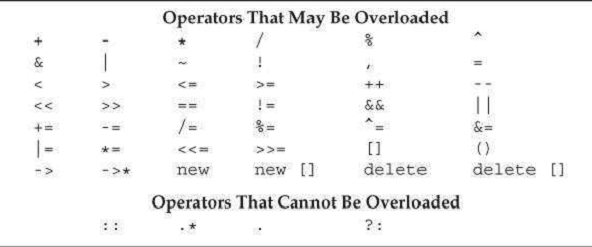

[toc]

## 14. Overloaded Operations and Conversions

C++允许我们定义运算符对类类型的对象的意义。It also lets us define conversions for class types. Class-type conversions are used like the built-in conversions to implicitly convert an object of one type to another type when needed.

As an example, because our original `Sales_item` class type (§ 1.5.1) defined the input, output, and addition operators, we can print the sum of two Sales_items as

```cpp
	cout << item1 + item2; // print the sum of two Sales_items
```

In contrast, because our Sales_data class (§ 7.1) does not yet have overloaded operators, code to print their sum is more verbose and, hence, less clear:

```cpp
	print(cout, add(data1,data2)); // print the sum of two Sales_datas
```

### 14.1. 基本概念

重载运算符是具有特殊名称的函数：关键字`operator`接着运算符符号。与其他函数一样，重载运算符也有返回值、参数列表、函数体。重载运算符函数的参数数量等于运算符的操作数数量。一元运算符只有一个参数；二元有两个，第一个是左操作数，第二个是右操作数。Except for the overloaded function-call operator, `operator ()`, an overloaded operator may not have default arguments (§6.5.1).

如果运算符函数是一个成员函数，第一个操作数绑定到隐式的`this`指针。因为第一个操作数已绑定，因此函数参数比操作数少一个。

运算符函数必须是类的成员函数，或至少有一个参数是类类型。
```cpp
    // error: cannot redefine the built-in operator for ints
    int operator+(int, int);
```

这个限制意味着，不能改变作用于内建类型操作数的运算符的语义。

多数但不是所有运算符可重载。Table 14.1 shows whether or not an operator may be overloaded. We’ll cover overloading `new` and `delete` in § 19.1.1.



只能覆盖存在的运算符，不能发明新运算符。例如，不能定义`**`提供乘方操作。

四个符号（+, -, *, &）可以做一元也可以做二元运算符。Either or both of these operators can be overloaded. The number of parameters determines which operator is being defined.

An overloaded operator has the same precedence and associativity (§ 4.1.2) as the corresponding built-in operator. Regardless of the operand types.

##### 直接调用重载的运算符函数

```cpp
	// equivalent calls to a nonmember operator function
	data1 + data2;  // normal expression
	operator+(data1, data2); // equivalent function call
```

上面两个调用是等价的。

We call a member operator function explicitly in the same way that we call any
other member function. We name an object (or pointer) on which to run the function
and use the dot (or arrow) operator to fetch the function we wish to call:
Click hereto view code image
data1 +=data2;  // expression-based ''call''
data1.operator+=(data2);  // equivalentcall to a member operator
function
Each of these statements calls the member function operator+=, binding thisto
the address of data1and passing data2as an argument.
