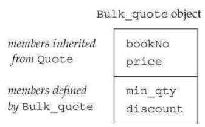

[toc]

## 15 面向对象编程

### 15.1 OOP 概述

**继承**

定价策略。基类 `Quote`，表示不打折的书。子类 `Bulk_quote` 表示数量折扣。这些类含有以下两个成员函数：

- `isbn()`：返回ISBN。不依赖子类的特性。
- `net_price(size_t)`：购买特定数量的价格，各个类实现不同。

在基类中定义为 `virtual` 的函数期望被子类再定义。

```cpp
class Quote{
public:
    std::string isbn() const;
    virtual double net_price(std::size_t n) const;
};
```

定义子类，类名后跟类派生列表：冒号开头，逗号分隔的父类列表，每个父类可选访问控制符（public, protected, or private）：

```cpp
class Bulk_quote: public Quote {
    Bulk_quote() = default;
    Bulk_quote(conststd::string&, double, std::size_t, double);
    double net_price(std::size_t) const override;
private:
    std::size_tmin_qty = 0; // 启用折扣需要的最少购买数量
    double discount = 0.0;  // fractional discount to apply
};
```

子类计划 **定义** 的父类的虚函数，都要先**声明**。声明时 `virtual` 可加可不加。新标准规定可以显式通过 `override` 关键字表示此函数打算覆盖父类函数。（如果成员是常量或引用函数，`override` 关键字在 `const` 或引用修饰符之后）。

**动态绑定**

C++ 中，动态绑定发生在，通过基类的引用（或指针）调用虚函数时。

动态绑定有时称为运行时绑定。

### 15.2 定义基类和子类

#### 15.2.1 定义基类

`Quote` 的完整定义：

```cpp
class Quote {
public:
    Quote() = default;
    Quote(conststd::string &book, double sales_price):
        bookNo(book), price(sales_price) { }
    std::string isbn() const { return bookNo; }
    virtual double net_price(std::size_t n) const
        {return n * price; }
    virtual ~Quote() = default;
private:
    std::string bookNo; // ISBN number of this item
protected:
    double price = 0.0; // normal, undiscounted price
};
```

基类的析构器一般都是虚的。

父类必须区别两种函数：期望子类覆盖的（加 `virtual` 关键字）、期望子类原封不动继承的。

构造器和静态成员函数之外的函数可以加 `virtual`。`virtual` 用在函数**声明**处，不能用在函数定义处。虚函数在子类中也是虚函数。

非虚函数在编译器绑定。

**可见性**

子类可以访问父类 public 和 protected 成员。但不能访问 private 成员。

#### 15.2.2 定义子类

当继承是 public，则基类中 public 成员变成子类接口的一部分。而且，若类B公开继承类A，则我们可以将B类的实例绑定到A类的引用或指针。

如果子类不覆盖父类的虚函数，则子类继承父类版本，就像继承普通成员一样。

##### 子类到父类的转换

规范没有规定，子类的对象在内存中布局。我们可以假定像下面这样分成两部分。注意规范并未规定这两部分是连续的。



我们可以将一个基类的引用或指针绑定到子类对象的基类部分：

```cpp
Quote item; // 基类的对象
Bulk_quote bulk; // 子类对象
Quote *p = &item;
p = &bulk;
Quote &r = bulk;
```

这种转换常称为子类到基类的转换（derived-to-base）。与其他转换一样，编译器会隐式进行子类到基类的转换（§4.11）。

这种转换使得我们，在期望一个到基类的引用的地方，我们传子类对象或到子类对象的引用。在期望一个到基类的指针的地方，我们可以使用到子类的指针。

##### 子类的构造器

子类必须用父类的构造器构造对象的父类部分。

基类部分，和子类的数据成员，在构造器的初始化阶段初始化（§7.5.1）。子类构造器利用其构造器初始化列表向基类构造器传递参数。如：

```cpp
Bulk_quote(const std::string &book, double p, std::size_t qty, double disc) : Quote(book, p), min_qty(qty), discount(disc) { }
```

父类 `Quote` 的构造器正文执行后，父类部分的对象才初始化完。接下来才是子类成员 `min_qty` 和 `discount` 的初始化。最后执行 `Bulk_quote` 构造器正文。

子类对象父类部分的数据成员，除非我们显示处理，是默认初始化的。

尽管子类可以访问父类 public 和 protected 成员，但在构造时，不要直接赋值，还是使用父类的构造器初始化父类部分。

子类作用域嵌套在父类内。因此子类使用自己定义的成员和使用父类的是一样的。

##### static 成员

父类定义的静态成员，在整个类体系中，只存在一个实例。

静态成员的可见性与非静态的相同。

访问静态成员时可以通过父类或子类（如果可见）。

```cpp
class Base {
    public:
        static void statmem();
};
class Derived : public Base {
    void f(const Derived&);
};

void Derived::f(constDerived &derived_obj)
{
    Base::statmem();  // 可以：父类定义了 statmem
    Derived::statmem();// 可以：子类继承了 statmem
    // ok: derived objects can be used to access static from base
    derived_obj.statmem();// accessed through a Derived object
    statmem();  // accessed through this object
}
```

##### 子类的声明

子类与其他类的声明一样。只包括类名，不包括继承列表。

```cpp
class Bulk_quote: public Quote; // 错误：不应该有继承列表
class Bulk_quote; // ok: right way to declare a derived class
```

声明的目的是公布一个名字的存在，及公布其类型（变量、函数、类？）。

##### 用作父类的类

一个类在用作父类前，必须被定义，只被声明是不够的。

##### 禁止继承

新标准规定，若不想类被继承，在类名后加 `final`。

```cpp
class NoDerived final { /*  */}; // NoDerived不能被继承
class Base { /*  */};
// Last is final; we cannot inherit from Last
class Last final : Base { /*  */}; // Last can't be a base class
class Bad : NoDerived { /*  */};  // error: NoDerived is final
class Bad2 : Last { /*  */};  // error: Last is final
```

#### 15.2.3 转换与继承

当引用（或指针）指向父类类型时，我们不知道引用或指针指向的实际类型。

> 与内建指针一样，智能指针支持子类到父类的转换：we can store a pointer to a derived object in a smart pointer to the base type.

##### 静态类型与动态类型{{？}}

区分一个变量（或其他表达式）的静态类型，及，表达式表示的动态类型。

**若表达式不是引用或指针，则动态类型总是与静态类型相同**。The dynamic type of an expression that is neither a reference nor a pointer is always the same as that expression’s static type.

##### 不存在基类到子类的隐式转换

子类到基类转换是存在的。但反之不行。

即使基类指针或引用实际指向子类对象，也不能实现父类向子类转：

```cpp
Bulk_quote bulk;
Quote *itemP = &bulk; // ok: dynamic type is Bulk_quote
Bulk_quote *bulkP = itemP; // error: can't convert base to derived
```

在决定转换是否合法时，编译器只看静态类型。

如果子类有一个或多个虚函数，我们可以使用 `dynamic_cast`，执行运行时检查转换。如果我们确信父类转子类是安全的，可以使用 `static_cast`。

##### 也不存在对象之间的转换

子类到父类的自动转换只适用于对引用或指针的转换。没有子类类型到父类类型的转换。Nevertheless, it is often possible to convert an object of a derived class to its base-class type. However, such conversions may not behave as we might want.

初始化或赋值一个类类型的对象，其实是在调用一个函数。初始化时调用的是构造器；赋值时调用的是赋值运算符。These members normally have a parameter that is a reference to the `const` version of the class type. Because these members take references, the derived-to-base conversion lets us pass a derived object to a base-class copy/move operation. 这些操作不是虚的。把一个子类对象传给父类构造器时，此构造器定义在父类中。这个构造器只知道父类中的成员。类似的，如果把一个子类对象赋给父类对象，赋值运算符调用的是定义在父类的版本，该运算符也只知道父类的成员。

Like any member, the derived-to-base conversion may be inaccessible due to access controls. We’ll cover accessibility in §15.5.

### 15.3 虚函数

普通函数可以只声明不定义。但对于虚函数，由于编译器无法确定运行时会用到哪个版本的虚函数，因此虚函数必须被定义。

如果表达式不是引用也不是指针，则调用虚函数时，在编译期绑定。对象的类型是固定。

#### 子类中的虚函数

子类覆盖虚函数时，不必重复 `virtual` 关键字。一旦函数被声明为虚函数，在所有子类中保持虚。

子类的虚函数的返回类型也必须与父类的匹配。例外是，如果返回的是引用或指针。例如，若D是B的子类，父类返回 `B*`，则子类可以返回 `D*`。不过，需要保证子类到父类的转换是可访问的（15.5节）。

#### `final` 与 `override`

子类可以定义一个与父类虚函数同名但参数不同的函数。这个函数并不覆盖父类的虚函数。有时这不是我们期望的。新标准允许使用 `override` 显式指出此函数是为了覆盖父类的函数。

```cpp
struct B {
    virtual void f1(int) const;
    virtual void f2();
    void f3();
};
struct D1 : B {
    void f1(int) const override; // ok: f1 matches f1 in the base
    void f2(int) override; // error: B has no f2(int) function
    void f3() override;  // error: f3 not virtual
    void f4() override;  // error: B doesn't have a function named f4
};
```

We can also designate a function as `final`. Any attempt to override a function that has been defined as `final` will be flagged as an error:

```cpp
struct D2: B {
    // inherits f2() and f3() from B and overrides f1(int)
    void f1(int) const final; // 后续类不能再覆盖f1(int)
};
struct D3 : D2 {
    void f2(); // ok
    void f1(int) const; // error: D2 declared f2 as final
};
```

`final` and `override` specifiers appear after the parameter list (including any `const` or reference qualifiers) and **after** a trailing return (§ 6.3.3).

#### 虚函数与默认参数

虚函数也可以有默认实参。如果使用默认参数调用，则使用的实参是静态类型定义的：通过基类的引用或指针调用，默认实参使用在基类中定义的。即使运行的是子类版本的函数，也仍使用基类版本的实参。

#### 绕过虚函数机制

有时不想用动态绑定，想要强制使用额定版本。可以通过作用域运算符实现。下面的调用将在编译器解析：

```cpp
double undiscounted = baseP->Quote::net_price(42);
```

> 一般只有在成员函数内（或友元内）才该使用作用域运算符绕过虚函数机制。

### 15.4 抽象基类

纯虚函数可以不被定义。要指定纯虚函数，在类中的方法声明后加 `= 0`。

```cpp
class Disc_quote : public Quote {
public:
    Disc_quote() = default;
    Disc_quote(conststd::string& book, double price,
		std::size_tqty, double disc):
        Quote(book,price),
        quantity(qty),discount(disc) { }
    double net_price(std::size_t) const = 0;
protected:
    std::size_t quantity = 0;
    double discount = 0.0;
};
```

如果想为纯虚函数提供一个定义，必须在类外。

#### 含有纯虚函数的类是抽象基类

含有纯虚函数的类，或继承但未覆盖的类，是抽象基类。抽象类不能创建对象。

```cpp
// Disc_quote 定义了一个纯虚函数，Bulk_quote 已覆盖
Disc_quote discounted; // 错误，不能的定义
Bulk_quote bulk; // ok: Bulk_quote has no pure virtual functions
```

#### 子类构造器只实例化它的直接父类

让 `Bulk_quote` 继承 `Disc_quote`，`Disc_quote` 继承 `Quote`：

```cpp
class Bulk_quote : public Disc_quote {
public:
    Bulk_quote() = default;
    Bulk_quote(conststd::string& book, double price,
        std::size_tqty, double disc):
        Disc_quote(book, price, qty, disc) { }
	double net_price(std::size_t) const override;
};
```

`Bulk_quote` 直接继承 `Disc_quote`，间接继承 `Quote`。

### 15.5 继承与访问控制

#### protected 成员

protected 成员不能被类的使用者使用。但 protected 成员能被子类及子类的友元使用。

子类的成员或友元，只能通过子类的**对象**访问基类受保护的成员。子类不能通过基类的**对象**访问受保护的成员。如下：

```cpp
class Base{
protected:
    int prot_mem; // protected member
};
class Sneaky : public Base  {
    friend void clobber(Sneaky&); // 可以访问Sneaky::prot_mem
    friend void clobber(Base&); // 不能访问Base::prot_mem
    int j; // j is private by default
};
// ok: clobber可以访问Sneaky的私有和受保护的成员
void clobber(Sneaky &s) { s.j = s.prot_mem = 0; }
// 错误！clobber不能访问Base受保护的成员
void clobber(Base &b) { b.prot_mem = 0; }
```

#### public, private 和 protected 继承

类继承来的成员的可访问性由父类中成员的访问说明符，及子类的继承列表中的访问说明符控制。

“继承访问说明符”不影响子类成员（及友元）看直接基类成员的可见性。基类成员的可见性由定义在基类中的成员的访问说明符决定。

```cpp
class Base{
public:
    void pub_mem(); // public member
protected:
    int prot_mem; // protected member
private:
    char priv_mem; // private member
};
struct Pub_Derv : public Base {
    // ok: derived classes can access protected members
    int f() { return prot_mem; }
    // 错误
    char g() { return priv_mem; }
};
struct Priv_Derv : private Base {
    // 即使是私有继承也不影响直接子类
    int	f1() const { return prot_mem; }
};
```

“继承访问说明符”影响子类（B）使用者及子类（B）的子类（C）对基类（A）的可访问性。

```cpp
Pub_Derv d1; // members inherited from Base are public
d1.pub_mem(); // ok：pub_mem在子类中是公有的
Priv_Derv d2; // members inherited from Base are private
d2.pub_mem(); // 错误：pub_mem在子类中是私有的
```

```cpp
struct Derived_from_Public: public Pub_Derv {
    // ok: Base::prot_mem remains protected in Pub_Derv
    intuse_base() { return prot_mem; }
};
struct Derived_from_Private : public Priv_Derv {
    // error: Base::prot_mem is private in Priv_Derv
    intuse_base() { return prot_mem; }
};
```

`Priv_Derv` 从 `Base` 继承的所有成员都是私有的。

假如 `Prot_Derv` 使用 `protected` 继承，则 `Base` 的公有成员在子类是受保护的。

#### 子类到父类转换的可访问性

子类到父类的转换的可访问性取决于，是谁的代码想要进行转换，也取决于子类继承的可见性。假设 `D` 继承 `B`：

- 仅当 D 是公有继承时，D 的使用者才做子类到父类转换。其他两种情况不能做转换。
- 不管使用何种可见性的继承，D 的成员函数和友元都可以将 D 转换为 B。
- 在继承是公有或受保护的情况下，D 的子类（比如F）的成员函数和友元可以使用 D 到 B 的转换。

> 如果基类的公有成员是可访问的，则子类到父类的转换是可访问的；反之不然。

#### 友元与继承

Just as friendship is not transitive (§7.3.4), 友元也是不继承的。基类的友元对子类的成员没有特殊的权限，子类的友元对基类也没有特殊的权限。

```cpp
class Base {
    friend class Pal;
};
class Pal {
public:
    int f(Base b) { return b.prot_mem; } // ok
    int f2(Sneaky s) { return s.j; } // 错误：Pal不是Sneaky的友元
    // 对基类的访问受基类控制，即使在子类中
    int f3(Sneaky s) { return s.prot_mem; } // ok: Pal is a friend
};
```

The fact that `f3` is legal may seem surprising, but it follows directly from the notion that each class controls access to its own members. Pal is a friend of Base, so Pal can access the members of `Base` objects. That access includes access to Base objects that are **embedded** in an object of a type derived from Base.

When a class makes another class a friend, it is only that class to which friendship is granted. The base classes of, and classes derived from, the friend have no special access to the befriending class:

```cpp
// D2 has no access to protected or private members in Base
class D2 : public Pal {
public:
    int mem(Base b) {return b.prot_mem; } // error: friendship doesn't inherit
};
```

#### 改变继承成员的可见性

有时想改变继承来的成员的访问级别。We can do so by providing a `using` declaration (§3.1):

```cpp
    class Base{
    public:
    	std::size_t size() const { return n; }
    protected:
    	std::size_t n;
    };
    class Derived : private Base {  //  note: private inheritance
    public:
    	// maintain access levels for members related to the size of the object
    using Base::size;
    protected:
    	using Base::n;
    };
```

由于继承背身是私有的，继承来的成员`size`和`n`默认是私有的。The using declarations adjust the accessibility of these members. `using`后可以跟任何可访问的名字（即不能是父类或祖先的私有的成员）。Access to a name specified in a using declaration depends on the access specifier preceding the using declaration. 如果using声明出现在类的私有部分，则这个名字只能被成员或友元访问。If the declaration is in a public section, the name is available to all users of the class. If the declaration is in a protected section, the name is accessible to the members, friends, and derived classes.

> A derived class may provide a using declaration only for names it is
permitted to access.

#### Default Inheritance Protection Levels

In §7.2 we saw that classes defined with the struct and class keywords
have different default access specifiers. Similarly, the default derivation specifier depends on which keyword is used to define a derived class. By default, a derived class defined with the `class` keyword has `private` inheritance; a derived class defined with `struct` has `public` inheritance:

```cpp
    class Base{ /* ...  */};
    struct D1 : Base { /* ...  */};  // public inheritance by default
    class D2 : Base { /* ...  */};  // private inheritance by default
```

一个常见的误解是，认为用`struct`定义的类和用`class`定义的类有巨大的区别。The only differences are the default access specifier for members and the default derivation access specifier. 没有其他区别了。

### 15.6. 继承与类作用域

Each class defines its own scope (§7.4, p. 282) within which its members are defined. Under inheritance, the scope of a derived class is nested (§2.2.4, p. 48) inside the scope of its base classes. If a name is unresolved within the scope of the derived class, the enclosing base-class scopes are searched for a definition of that name.

#### Name Lookup Happens at Compile Time

对象（包括引用、指针）的静态类型决定可见的成员。即使静态类型与动态类型不同。As an example, we might add a member to the Disc_quoteclass that returns a pair(§11.2.3, p. 426) holding the minimum
(or maximum) quantity and the discounted price:

```cpp
    class Disc_quote: public Quote {
    public:
    	std::pair<size_t, double> discount_policy() const
    		{return {quantity, discount}; }
    	// other members as before
    };
```

仅当对象（指针、引用）的静态类型是`Disc_quote`或其子类时，才能用`discount_policy`。

```cpp
    Bulk_quote bulk;
    Bulk_quote *bulkP = &bulk;
    Quote *itemP = &bulk; // static and dynamic types differ
    bulkP->discount_policy(); // ok: bulkP has type Bulk_quote*
    itemP->discount_policy(); // error: itemP has type Quote*
```

#### 继承与命名冲突

子类可以重用父类中的名字，重用后隐藏父类中的名字。

```cpp
    struct Base{
    	Base(): mem(0) { }
    protected:
    	int mem;
    };
    struct Derived : Base {
    	Derived(int i): mem(i) { } // initializes Derived::mem to i
    	// Base::mem is default initialized
    	int get_mem() { return mem; }  // returns Derived::mem
    protected:
    	int mem;  // hides mem in the base
    };
```

The reference to `mem` inside `get_mem` is resolved to the name inside Derived. Were we to write

```cpp
    Derived d(42);
    cout<< d.get_mem() << endl;  // prints 42
```

then the output would be 42.

> A derived-class member with the same name as a member of the base class hides direct use of the base-class member.

#### 利用Scope Operator访问被隐藏的成员

We can use a hidden base-class member by using the scope operator:

```cpp
    struct Derived: Base {
    	int get_base_mem() { return Base::mem; }
    	//...
    };
```

> 最佳实践：Aside from overriding inherited virtual functions, a derived class usually should not reuse names defined in its base class.

#### 名字查找发生在类型检查之前

As we’ve seen, functions declared in an inner scope do not overload functions declared in an outer scope (§6.4.1). 同样，定义在子类的函数不同**重载（overload）**定义在父类中的函数。As in any other scope, if a member in a derived class (i.e., in an inner scope) has the same name as a base class member (i.e., a name defined in an outer scope), then the derived member hides the base-class member within the scope of the derived class. 父类的成员被隐藏，**即使函数的参数列表不同**：

```cpp
    struct Base {
    	int memfcn();
    };
    struct Derived: Base {
    	int memfcn(int);  // hides memfcn in the base
    };
    Derived d; Base b;
    b.memfcn(); // calls Base::memfcn
    d.memfcn(10); // calls Derived::memfcn
    d.memfcn(); // error: memfcn with no arguments is hidden
    d.Base::memfcn(); // ok:calls Base::memfcn
```

子类声明的`memfcn`隐藏了父类中的`memfcn`——即使参数不同。

To resolve this call, the compiler looks for the name memfcn in Derived. That class defines a member named memfcn and the search stops. 一旦名字被找到，编译器不会再继续找。

#### 虚函数与作用域

现在我们知道了虚函数为什么必须在子类和父类中有相同的参数列表。If the base and derived members took arguments that differed from one another, there would be no way to call the derived version through a reference or pointer to the base class. For example:

```cpp
    class Base{
    public:
    	virtual int fcn();
    };
    class D1 : public Base {
    public:
    	// 隐藏父类中的fcn，这个fcn不是虚的
    	// D1 inherits the definition of Base::fcn()
    	int fcn(int);  // parameter list differs from fcn in Base
    	virtual void f2(); // new virtual function that does not exist in Base
    };
    class D2 : public D1 {
    public:
    	int fcn(int); // 非虚函数隐藏了D1::fcn(int)！
    	int fcn(); // 覆盖了Base的虚函数fcn
    	void f2(); // 覆盖了D1的虚函数f2
    };
```

#### 通过父类调用隐藏的虚函数

接着上面定义的类：
```cpp
    Base bobj;
    D1 d1obj;
    D2 d2obj;
    Base *bp1 = &bobj, *bp2 = &d1obj, *bp3 = &d2obj;
    bp1->fcn(); // virtual call, will call Base::fcn at run time
    bp2->fcn(); // virtual call, will call Base::fcn at run time
    bp3->fcn(); // virtual call, will call D2::fcn at run time
    D1 *d1p = &d1obj; D2 *d2p = &d2obj;
    bp2->f2(); // error: Base has no member named f2
    d1p->f2(); // virtual call, will call D1::f2() at run time
    d2p->f2(); // virtual call, will call D2::f2() at run time
```

The first three calls are all made through pointers to the base class. Because `fcn` is virtual, the compiler generates code to decide at run time which version to call. That decision will be based on the actual type of the object to which the pointer is bound.

In the case of `bp2`, the underlying object is a D1. That class did not override the `fcn` function that takes no arguments. Thus, the call through `bp2` is resolved (at run time) to the version defined in Base.

The next three calls are made through pointers with differing types. Each pointer
points to one of the types in this hierarchy.

For completeness, let’s look at calls to the nonvirtual function `fcn(int)`:

```cpp
    Base *p1= &d2obj; D1 *p2 = &d2obj; D2 *p3 =  &d2obj;
    p1->fcn(42);  // error: Base has no version of fcn that takes an int
    p2->fcn(42);  // statically bound, calls D1::fcn(int)
    p3->fcn(42);  // statically bound, calls D2::fcn(int)
```

However, the dynamic type doesn’t matter when we call a nonvirtual function. The version that is called depends only on the static type of the pointer.

#### Overriding Overloaded Functions

与其他函数一样，成员函数（不管虚不虚）可以被重载。A derived class can override zero or more instances of the overloaded functions it inherits. 如果子类想能够给通过它的类型访问所有重载的函数，则它需要覆盖所有或一个也不覆盖。Sometimes a class needs to override some, but not all, of the functions in an overloaded set. It would be tedious in such cases to have to override every base-class version in order to override the ones that the class needs to specialize.

Instead of overriding every base-class version that it inherits, a derived class can provide a `using` declaration (§15.5, p. 615) for the overloaded member. A using declaration specifies only a name; it may not specify a parameter list. Thus, a using declaration for a base-class member function adds **all** the overloaded instances of that function to the scope of the derived class. Having brought all the names into its scope, the derived class needs to define only those functions that truly depend on its type. It can use the inherited definitions for the others.

The normal rules for a `using` declaration inside a class apply to names of overloaded functions (§15.5, p. 615); every overloaded instance of the function in the base class must be accessible to the derived class. The access to the overloaded versions that are not otherwise redefined by the derived class will be the access in effect at the point of the using declaration.

### （及以下未）15.7. Constructors and Copy Control


