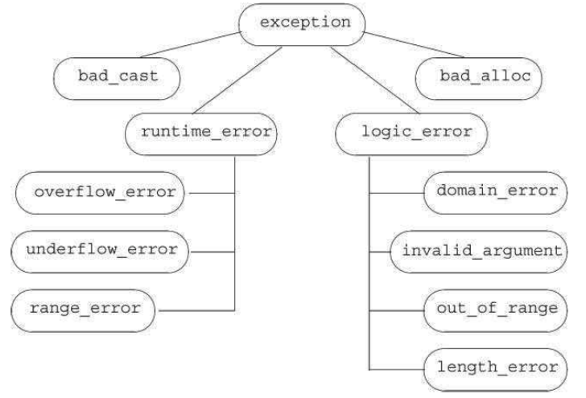

[toc]

## 18 用于大型程序的工具

### 18.1 异常处理

#### 18.1.1 抛出一个异常

捕获部分可能与抛出部分在同一个函数，或在调用链上的一个函数。The fact that control passes from
one location to another has two important implications:

- Functions along the call chain may be prematurely exited.
- When a handler is entered, objects created along the call chain will have been destroyed.

未捕获的异常会导致程序结束。If no matching catch is found, the program calls the library `terminate` function.

在栈回退的过程中，类类型的局部对象会被自动调用析构器。

析构器不要抛出任何异常，自己要捕获。否则程序会崩溃。

##### 异常对象

编译器利用抛出的表达式拷贝初始化一个特殊的对象，称为异常对象。As a result, the expression in a throw must have a complete type (§ 7.3.3). Moreover, if the expression has class type, that class must have an accessible destructor and an accessible copy or move constructor. If the expression has an array or function type, the expression is converted to its corresponding pointer type.

异常对象驻留在由编译器管理的空间中，保证在catch调用时可访问。异常对象在异常被处理后销毁。

As we’ve seen, when an exception is thrown, blocks along the call chain are exited until a matching handler is found. When a block is exited, the memory used by the local objects in that block is freed. 因此，抛出一个指向局部对象的指针基本上总是错的。

When we throw an expression, the static, compile-time type (§ 15.2.3) of that expression determines the type of the exception object. This point is essential to keep in mind, because many applications throw expressions whose type comes from an inheritance hierarchy. If a throw expression dereferences a pointer to a base-class type, and that pointer points to a derived-type object, then the thrown object is sliced down (§ 15.2.3); only the base-class part is thrown.

#### 18.1.2 捕获一个异常

We can omit the name of the catch parameter if the catch has no need to access the thrown expression.

The type of the declaration determines what kinds of exceptions the handler can catch. The type must be a complete type (§ 7.3.3). The type can be an lvalue reference but may not be an rvalue reference (§ 13.6.1).

进入 catch 时，异常对象传给声明的参数。与函数参数一样，如果 catch 的参数不是引用类型，则异常对象拷贝给参数；在 catch 中对参数的修改时对本地变量的修改，不影响异常对象。若参数是引用类型，则与其他引用类型一样，catch 参数仅是异常对象的另一个名字。

若 catch 参数是一个基类类型，则可以被一个子类类型的异常对象初始化。若 catch 参数是非引用类型，则异常对象将被 sliced down (§ 15.2.3)。如果是到基类的引用类型，则正常绑定。

Again, as with a function parameter, the static type of the exception declaration determines the actions that the catch may perform. If the catch parameter has a base-class type, then the catch cannot use any members that are unique to the derived type.
一般来说，想利用继承的异常类型的 catch 参数应市一个引用。

##### 寻找匹配的处理器

第一个匹配的胜出，不管它是不是最佳匹配。

异常与异常声明的匹配，比实参与形参的匹配受限的多。两者类型必须完全相同，或只允许以下转换：

- Conversions from nonconst to const are allowed. That is, a throw of a nonconst object can match a catch specified to take a reference to const.
- Conversions from derived type to base type are allowed.
- An array is converted to a pointer to the type of the array; a function is converted to the appropriate pointer to function type.

In particular, neither the standard arithmetic conversions nor conversions defined for class types are permitted.

##### 重新抛出

A rethrow is a `throw` that is not followed by an expression: `throw;`

An empty throw can appear only in a catch or in a function called (directly or indirectly) from a catch. If an empty throw is encountered when a handler is not active, `terminate` is called.

重新抛出不指定表达式，它抛出的是当前的异常对象。

In general, a catch might change the contents of its parameter. If, after changing its parameter, the catch rethrows the exception, then those changes will be propagated only if the catch’s exception declaration is a reference:

```cpp
catch (my_error &eObj) { // 引用类型
	eObj.status = errCodes::severeErr; // 修改异常对象
    throw; // the status member of the exception object is severeErr
} catch (other_error eObj) { // 非引用类型
	eObj.status = errCodes::badErr; // modifies the local copy only
    throw; // the status member of the exception object is unchanged
}
```

##### 捕获全部

To catch all exceptions, we use an ellipsis for the exception declaration. Such handlers, sometimes known as catch-all handlers, have the form `catch(...)`. A catch-all clause matches any type of exception.

A catch(...) is often used in combination with a rethrow expression. The catch does whatever local work can be done and then rethrows the exception:

```cpp
void manip() {
	try {
		// actions that cause an exception to be thrown
	} catch (...) {
    	// work to partially handle the exception
		throw;
	}
}
```

If a `catch(...)` is used in combination with other catch clauses, it must be last. Any catch that follows a catch-all can never be matched.

#### 18.1.3 Function try Blocks 与构造器

异常可能发生于构造器初始化器。由于构造器初始化器先于构造器正文执行，因此构造器正文内的 catch 不会捕获构造器初始化器抛出的异常。

To handle an exception from a constructor initializer, we must write the constructor as a **function try block**. A function try block lets us associate a group of catch clauses with the initialization phase of a constructor (or the destruction phase of a destructor) as well as with the constructor’s (or destructor’s) function body.

```cpp
    template <typename T>
    Blob<T>::Blob(std::initializer_list<T> il) try :
    	data(std::make_shared<std::vector<T>>(il)) {
    	/* empty body */
    } catch(const std::bad_alloc &e) { handle_out_of_memory(e); }
```

It is worth noting that an exception can happen while initializing the constructor’s parameters. Such exceptions are not part of the function try block. The function try block handles only exceptions that occur once the constructor begins executing. 与其他函数调用一样，如果异常发生在参数初始化过程中，在调用者的上下文中处理。

#### 18.1.4 The noexcept Exception Specification

It can be helpful both to users and to the compiler to know that a function will not throw any exceptions.

编译器知道代码不会抛出异常，可能做出优化。

Under the new standard, a function can specify that it does not throw exceptions by providing a `noexcept` specification. The keyword `noexcept` following the function parameter list indicates that the function won’t throw:

```cpp
void recoup(int) noexcept; // won't throw
void alloc(int); // might throw
```

The noexcept specifier must appear on all of the declarations and the corresponding definition of a function or on none of them. The specifier precedes a trailing return (§ 6.3.3). We may also specify `noexcept` on the declaration and definition of a function pointer. It may not appear in a `typedef` or type alias. In a member function the `noexcept` specifier follows any const or reference qualifiers, and it precedes `final`, `override`, or `= 0` on a virtual function.

##### Violating the Exception Specification

It is important to understand that the compiler does not check the `noexcept` specification at compile time. In fact, the compiler is not permitted to reject a function with a noexcept specifier merely because it contains a throw or calls a function that might throw (however, kind compilers will warn about such usages):

```cpp
// this function will compile, even though it clearly violates its exception specification
void f() noexcept // promises not to throw any exception
{
	throw exception(); // violates the exception specification
}
```

As a result, it is possible that a function that claims it will not throw will in fact throw. If a noexcept function does throw, `terminate` is called, thereby enforcing the promise not to throw at run time. It is unspecified whether the stack is unwound. As a result, noexcept should be used in two cases: if we are confident that the function won’t throw, and/or if we don’t know what we’d do to handle the error anyway.

Specifying that a function won’t throw effectively promises the callers of the nonthrowing function that they will never need to deal with exceptions. Either the function won’t throw, or the whole program will terminate; the caller escapes responsibility either way.

##### Arguments to the noexcept Specification

The `noexcept` specifier takes an optional argument that must be convertible to bool: If the argument is true, then the function won’t throw; if the argument is
false, then the function might throw:

```cpp
void recoup(int) noexcept(true); // recoup won't throw
void alloc(int) noexcept(false); // alloc can throw
```

##### The noexcept Operator

Arguments to the `noexcept` specifier are often composed using the `noexcept` operator. The `noexcept` operator is a unary operator that returns a bool rvalue constant expression that indicates whether a given expression might throw. Like `sizeof` (§ 4.9), `noexcept` does not evaluate its operand. For example, this expression yields true:

```cpp
noexcept(recoup(i)) // true if calling recoup can't throw, false otherwise
```

because we declared recoup with a noexcept specifier. More generally, `noexcept(e)` is true if all the functions called by e have nonthrowing specifications and e itself does not contain a throw. Otherwise, noexcept(e) returns false.

We can use the `noexcept` operator to form an exception specifier as follows:

```cpp
void f() noexcept(noexcept(g())); // f has same exception specifier as g
```

If the function `g` promises not to throw, then `f` also is nonthrowing. If `g` has no exception specifier, or has an exception specifier that allows exceptions, then `f` also might throw.

##### （未）Exception Specifications and Pointers, Virtuals, and Copy Control

#### （未）18.1.5 异常类体系

The standard-library exception classes (§ 5.6.3) form the inheritance hierarchy (Chapter 15) as shown in Figure 18.1.



The only operations that the `exception` types define are the copy constructor, copy-assignment operator, a virtual destructor, and a virtual member named `what`. The `what` function returns a `const char*` that points to a null-terminated character array, and is guaranteed not to throw any exceptions.

The exception, `bad_cast`, and `bad_alloc` classes also define a default constructor. The `runtime_error` and `logic_error` classes do not have a default constructor but do have constructors that take a C-style character string or a library `string` argument. Those arguments are intended to give additional information about the error. In these classes, what returns the message used to initialize the exception object. Because `what` is virtual, if we catch a reference to the base-type, a call to the `what` function will execute the version appropriate to the dynamic type of the exception object.

### 18.2 命名空间


