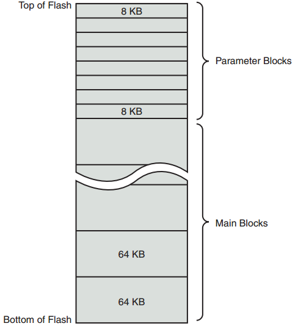

[toc]

## 2.  整体脉络

## 2.1.1 BIOS 与 Bootloader

BIOS一般存储在Flash中，为的是BIOS程序能升级。

BIOS是一个复杂的系统配置软件。它了解硬件架构的底层细节。上电后先由BIOS接管处理器的控制。它的主要责任是初始化硬件，特别是内存子系统，从硬盘上加载一个操作系统。

对于嵌入式系统，bootloader起到了BIOS的作用。bootloader也要为特定板子做定制开发。幸运的是，可以在几个优秀的开源bootloaders上定制（第7章，Bootloaders）。bootloader的主要任务有：

- 初始化关键的硬件组件，如SDRAM控制器，I/O控制器，图形控制器。
- 初始化系统内存，准备将控制权交给操作系统。
- 分配系统资源，如内存和中断电路，给外网控制器。
- 提供一个机制，定位、加载操作系统镜像。
- 加载并将控制器交给操作系统。传递必需对的启动信息，包括内存大小、时钟频率、串口速度和其他底层硬件的配置数据。

### 2.2 嵌入式系统剖析

可以通过RS-232连接到嵌入式开发板。**Minicom**是Linux平台下最常使用的串口终端应用。但我喜欢用**screen**替代minicom。它更灵活，especially for capturing traces, and it’s more forgiving of serial line garbage often encountered during system bringup or troubleshooting. To use screen **in this manner** on a **USB-attached** serial dongle, simply invoke it on your serial terminal and specify the speed:

	$ screen /dev/ttyUSB0 115200

#### 2.2.2 启动目标版

启动电源后，目标板上的 bootloader 立即接管处理器，初始化底层硬件，包括处理器、内存、UART控制的串口，以太网控制器等。下面是串口收到的信息：

    U-Boot 2009.01 (May 20 2009 - 09:45:35)
    CPU: 8548E, Version: 2.1, (0x80390021)
    Core: E500, Version: 2.2, (0x80210022)
    Clock Configuration:
        CPU:990 MHz, CCB:396 MHz,
        DDR:198 MHz (396 MT/s data rate), LBC:49.500 MHz
    L1: D-cache 32 kB enabled
    	I-cache 32 kB enabled
    Board: CDS Version 0x13, PCI Slot 1
    CPU Board Revision 0.0 (0x0000)
    I2C: ready
    DRAM: Initializing
        SDRAM: 64 MB
        DDR: 256 MB
    FLASH: 16 MB
    L2: 512 KB enabled
    Invalid ID (ff ff ff ff)
    	PCI: 64 bit, unknown MHz, async, host, external-arbiter
    				Scanning PCI bus 00
    PCI on bus 00 - 02
    	PCIE connected to slot as Root Complex (base address e000a000)
    PCIE on bus 3 - 3
    In: serial
    Out: serial
    Err: serial
    Net: eTSEC0, eTSEC1, eTSEC2, eTSEC3
    =>

For this example, we have chosen a target board from Freescale Semiconductor, the PowerQUICC III MPC8548 Configurable Development System (CDS). It contains the MPC8548 PowerQUICC III processor. U-Boot bootloader已经预装在系统中。

启动的最后，U-Boot 等待通过串口输入，显示提示符`=>`。

#### 2.2.3 启动内核

所有 bootloader 都会提供相应命令，加载和执行一个操作系统镜像。下面列出 U-Boot 手工启动Linux内核的方法：

    => tftp 600000 uImage
    Speed: 1000, full duplex
    Using eTSEC0 device
    TFTP from server 192.168.0.103; our IP address is 192.168.0.18
    Filename ‘uImage’.
    Load address: 0x600000
    Loading: #################################################################
    #############################################################
    done
    Bytes transferred = 1838553 (1c0dd9 hex)
    => tftp c00000 dtb
    Speed: 1000, full duplex
    Using eTSEC0 device
    TFTP from server 192.168.0.103; our IP address is 192.168.0.18
    Filename ‘dtb’.
    Load address: 0xc00000
    Loading: ##
    done
    Bytes transferred = 16384 (4000 hex)
    => bootm 600000 - c00000
    ## Booting kernel from Legacy Image at 00600000 ...
        Image Name: MontaVista Linux 6/2.6.27/freesc
        Image Type: PowerPC Linux Kernel Image (gzip compressed)
        Data Size: 1838489 Bytes = 1.8 MB
        Load Address: 00000000
        Entry Point: 00000000
		Verifying Checksum ... OK
    ## Flattened Device Tree blob at 00c00000
        Booting using the fdt blob at 0xc00000
        Uncompressing Kernel Image ... OK
        Loading Device Tree to 007f9000, end 007fffff ... OK
    Using MPC85xx CDS machine description
    Memory CAM mapping: CAM0=256Mb, CAM1=0Mb, CAM2=0Mb residual: 0Mb
    ...
    < Lots of Linux kernel boot messages, removed for clarity >
    ...
    freescale-8548cds login: <<--- Linux login prompt

`tftp`命令通过TFTP3协议将内核镜像**uImage**通过网络加载到内存。内核镜像位于开发机器上。`tftp`命令的第一个参数指定将内核镜像加载到开发板内存的哪个位置。细节会在第7章详细解释。

第二个`tftp`命令加载一个板子配置文件，称为*device tree*。它的其他名称还有 *flat device tree* 、 *device tree binary* 或 *dtb*。第7章将详述。目前你只需要知道这个文件包含了内核启动板子需要的信息。包括内存大小，时钟速率，板上设备，总线，Flash布局。

接下来，**bootm** (boot from memory image) 开始启动内核。In this example of using the bootm command, we instruct U-Boot to load the kernel that we put at 0x600000 and pass the *device tree binary (dtb)* we loaded at 0xc00000 to the kernel. 该命令将控制权交给Linux内核。

与桌面PC的BIOS不同，多数嵌入式系统的架构是，Linux内核接管控制后，bootloader不再存在！控制权回到bootloader的唯一办法是重启。

U-Boot的消息到下面这句就结束了。后面的启动消息由Linux内核产生——我们要知道U-Boot是在哪里离开的，内核是在哪里接管的。

	Loading Device Tree to 007f9000, end 007fffff ... OK

#### 2.2.4 内核初始化：概述

Linux启动过程会打印很多消息。上面的例子就有200多个`printk`行。下面是其中部分消息。完整的启动过程会在第5章讲。注意这里内核从 192.168.0.9 挂载了一个NFS作为其**根**文件系统。根文件系统中包括应用程序、系统库、工具等。

    ...
    Looking up port of RPC 100005/1 on 192.168.0.9
    VFS: Mounted root (nfs filesystem).
    Freeing unused kernel memory: 152k init
    INIT: version 2.86 booting
    ...
    freescale-8548cds login:

Linux跟其他嵌入式操作系统的一个很大区别是：**Linux必须有一个文件系统**。

这里使用NFS是为了开发方便。产品环境可能还是直接挂载硬盘等设备。

#### 2.2.5 第一个用户空间进程：`init`

启动日志有这样一条：

	INIT: version 2.86 booting

在此之前内核在内核上下文中执行。在该状态下，内核拥有全部的系统内存，对系统资源有完全的权限。内核可以访问所有的物理内存、所有的I/O子系统。它在内核虚拟地址空间执行代码，使用内核自己创建、拥有的栈。

内核完成内部初始化、挂载好根文件系统后，默认将执行（spawn）一个应用程序，称为`init`。`init`在用户空间执行。模式对系统的访问受限，必须通过系统调用请求内核服务，如设备和文件I/O。用户空间进程运行在内核管理、分配的一个虚拟内存空间内。内核与处理器中专用的内存管理硬件一起，进行用户空间虚拟-物理地址的转换。这样做的好处是，一个进程的错误不会污染另一个进程的内存空间。

### 2.3 存储的问题

#### 2.3.1 Flash Memory

如Compact Flash和SD卡。它们可以看做固态硬盘。没有转动的部分，运行在一个电压下。Flash memory comes in a variety of electrical formats, physical packages, and capacities.

Flash的写入和擦除受软件控制。机械硬盘目前仍是最快的可写入的截至。Flash写入和擦除的速度已经显著提高，但仍比机械硬盘慢。

Flash被划分为相对交大的擦除单元，称为擦除块（erase blocks）。典型的NOR Flash芯片，软件可以控制从1变成0，一次写一位，直接修改。但从0编程1，整个擦除块必须被整个擦除，使用Flash芯片的一系列特殊指令。

一个4MB的Flash芯片可能包含64个擦除块，每个64KB。Flash memory is also available with nonuniform erase block sizes, to facilitate flexible data-storage layouts. These are commonly called boot block or boot sector Flash chips. 一般 bootloader 放在较小的块中，而内核和其他数据存储在较大的块中。Figure 2-3 illustrates the block size layout for a typical top boot Flash.



Flash的块大小一般比传统硬件大。例如一个典型的高性能硬盘的可写扇区（sector）一般512或1024字节。Write times for updating data in Flash memory can be many times that of a hard drive, due in part to the relatively large quantity of data that must be erased and written back to the Flash for each update. 最坏的情况，可能花费几秒。

Flash的另一个问题是擦写次数有限。一个NOR Flash块大约为十万次。但如果Flash存储算法有问题（或BUG），导致有些块被反复使用，有些块一直未被使用。则整个设备会很快不能用。例如不要将系统日志写到Flash设备。

#### 2.3.2 NAND Flash

NAND Flash是一种较新的Flash计数。When **NAND Flash** hit the market, traditional Flash memory such as that described in the preceding section was called **NOR Flash**. These distinctions relate to the internal Flash memory cell architecture.

NAND Flash改进了NOR Flash的一些问题：块大小更小，更快、更有效的写操作，更有效的使用Flash array。NOR Flash设备到微处理器的接口，与微处理器的很多外围设备类似。即，它们有一个并行的数据和地址总线，直接连接到微处理器的数据/地址总线。Each byte or word in the Flash array can be individually addressed in a random fashion. In contrast, NAND devices are accessed serially through a complex interface that varies among vendors. NAND设备的运行模型更像传统的硬盘及其关联的控制器。Data is accessed in serial bursts, which are far smaller than NOR Flash block size. Write cycle lifetime for NAND Flash is an order of magnitude greater than for NOR Flash, although erase times are significantly smaller.

总结，NOR Flash可以被处理器直接访问，代码甚至可以在NOR Flash上直接执行。（出于性能考虑，很少会这样做。）In fact, many processors cannot cache instruction accesses to Flash, as they can with DRAM. This further degrades execution speed. In contrast, NAND Flash is more suitable for bulk storage in file system format than raw binary executable code and data storage.

#### 2.3.3 Flash的使用

An embedded system designer has many options in the layout and use of Flash memory. In the simplest of systems, in which resources are not overly constrained, raw binary data (perhaps compressed) can be stored on the Flash device. 启动后，存储于Flash中的文件系统镜像读入到Linux的ramdisk设备，挂载为文件系统，只能被RAM访问。这种设计适用于Flash中数据不太需要更新的情况。Any data that does need to be updated is relatively small compared to the size of the ramdisk. 对ramdisk中文件的任何修改都会在重启后丢失。

Figure 2-4 illustrates a common Flash memory organization that is typical of a simple embedded system in which nonvolatile storage requirements of dynamic data are small and infrequent.


The bootloader is often placed in the top or bottom of the Flash memory array. bootloader后面的空间是Linux内核镜像和ramdisk文件系统镜像（里面是根文件系统）。Linux内核和ramdisk文件系统镜像一般是压缩的，由bootloader负责在启动时解压。

Flash划分出专门一小块，用于存储需要在重启间维持的动态数据。这种典型配置用于存储少量配置数据的嵌入式系统，如无线热点。

#### 2.3.4 Flash文件系统

简单Flash布局方案的局限可以被一个Flash文件系统克服。文件系统采用类似于硬盘的数据组织方式管理Flash上的数据。Flash文件系统的早期实现包含一个简单的块设备层，模拟硬盘的512字节扇区（sector）。模拟层允许以文件的形式访问数据，而不是以未格式化的bulk形式。但它们有一些性能上的限制。

对Flash文件系统的第一个增强是结合磨损调平（wear leveling）。Flash写寿命是有限的。Wearleveling algorithms are used to distribute writes evenly over the physical erase blocks of the Flash memory in order to extend the life of the Flash memory chip.

Another limitation that arises from the Flash architecture is the risk of data loss during a power failure or premature shutdown. Consider that the Flash block sizes are relatively large and that average file sizes being written are often much smaller relative to the block size. You learned previously that Flash blocks must be written one block at a time. 因此要写一个 8KB 文件，必须擦除、重写整个Flash块，一般是 64KB 或 128KB；最坏的情况，需要几秒才能完成；这这段时间，若掉电即可能发生丢失。

JFFS2（Journaling Flash File System 2）是目前最常见的Flash文件系统。它旨在提高整体性能，增加Flash生命周期，减小掉电造成的数据丢失概率。The more significant improvements in the latest JFFS2 file system include improved wear leveling, compression and decompression to squeeze more data into a given Flash size, 及支持Linux硬链接。详情见第9和第10章。

#### 2.3.5 内存空间

几乎所有过去的嵌入式系统都将内存看做一个单个的、扁平的地址空间。即That is, a microprocessor’s address space exists from 0 to the top of its physical address range. 例如，若微处理器有24根物理地址线，则内存的上限是16MB，地址范围是 0x00000000 到 0x00ffffff。Hardware designs commonly place DRAM starting at the bottom of the range, and Flash memory from the top down. Unused address ranges between the top of DRAM and bottom of Flash would be allocated for addressing of various peripheral chips on the board. This design approach is often dictated by the choice of microprocessor. 下面展示了一个简单的嵌入式系统典型的内存布局。


传统的嵌入式系统，OS和应用访问系统资源的权限是一样的。一个应用的BUG可能影响其他应用使用的内存。

高性能的微处理器包含复杂的硬件，称为Memory Management Units (MMUs)。它的作用是让OS站在更高的位置管理它自己及分配给进程的地址空间。包括访问权限控制内存地址的转换（虚拟化）。

Linux内核利用这些硬件的MMU创建一个虚拟内存的操作系统。虚拟内存使得系统看起来有比物理内存更多的内存。例子见2.3.7节。

#### 2.3.6 执行上下文

Linux最先做的工作之一，是配置处理器上的硬件 MMU，启用地址转换。这步工作完成后，内核进入它自己的虚拟内存空间。最近的内核版本，虚拟内核地址默认选在`0xC0000000`。If we looked at the kernel’s symbol table, we would find kernel symbols linked at an address starting with `0xC0xxxxxx`. As a result, any time the kernel executes code in kernel space, the processor’s instruction pointer (program counter) contains values in this range.

Linux分内核上下文和用户空间上下文。

当内核代表某个进程执行时，称处于内核的进程上下文。与此相对，the interrupt service routine (ISR)处理 IDE设备，不代表任何进程执行，称为中断上下文。

#### 2.3.7 进程虚拟内存

进程产生（spawned）后，内核向进程分配一些内存和一部分虚拟内存地址。这些底气与内核的使用地址或其他进程的使用地址没有固定的关系。板上的物理地址与进程使用的虚拟地址之间也没有必然关系。实际上，由于分页和交换，进程在其生命周期内，可能使用主存上不同的地址段。

下面代码展示了内核分配给进程的地址空间的一些特性。这段代码运行的环境包含一个256MB的DRAM。

```c
    #include <stdio.h>
    int bss_var; /* 未初始化的全局变量 */
    int data_var = 1; /* 已初始化的全局变量 */
    int main(int argc, char **argv)
    {
        void *stack_var; /* 栈内的局部变量 */
        stack_var = (void *)main; /* Don’t let the compiler */
        /* optimize it out */
        printf(“Hello, World! Main is executing at %p\n”, stack_var);
        printf(“This address (%p) is in our stack frame\n”, &stack_var);
        /* bss section contains uninitialized data */
        printf(“This address (%p) is in our bss section\n”, &bss_var);
        /* data section contains initializated data */
        printf(“This address (%p) is in our data section\n”, &data_var);
        return 0;
    }
```

    root@192.168.4.9:~# ./hello
    Hello, World! Main is executing at 0x10000418
    This address (0x7ff8ebb0) is in our stack frame
    This address (0x10010a1c) is in our bss section
    This address (0x10010a18) is in our data section
    root@192.168.4.9:~#

Main函数的位置（`0x10000418`） 恰好位于256MB的边界（0x10000418 == 256MB）。栈的地址（`0x7ff8ebb0`）大约处于一个32位地址空间中间位置，显然已超出了256MB RAM的范围。看起来有2GB的DRAM可用。但实际这些虚拟地址会被内核映射回256MB RAM的范围。

虚拟内存系统的一大特征是，当可用的物理内存小于预设的阈值时，内核可以将最不常用的内存交换到硬盘等存储器上。嵌入式开发者常常禁用交换，因为嵌入式系统的性能和资源限制。For example, it would be ridiculous in most cases to use a relatively slow Flash memory device **with limited write life cycles** as a swap device. Without a swap device, you must carefully design your applications to exist within the limitations of your available physical memory.

####  2.3.8 交叉开发环境

Indeed, if you have a toolchain that runs on your target board, you can natively compile applications for your target’s architecture. In fact, one great way to stress-test a new embedded kernel and custom board is to repeatedly compile the Linux kernel on it.

详细讨论见第12章和第14章。

### 2.4 嵌入式Linux分发

http://elinux.org/Embedded_Linux_Distributions


