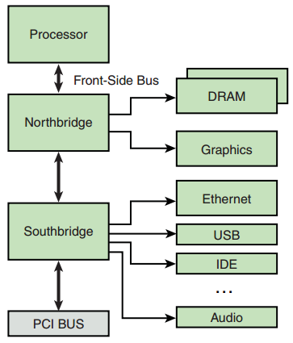

[toc]

## （未）3. 处理器基础

本章我们只讨论包含硬件内存关联单元（MMU）的处理器。Linux是一个虚拟内存操作系统（虽然也支持不含MMU的处理器）。

### 3.1 独立处理器（Stand-alone processors）

独立处理器是专注“处理”功能的处理器。与集成处理器（integrated processors）不同的是，独立处理器需要额外的支持电路才能正常工作。它们负责DRAM控制器、系统总线寻址配置、外围设备（如键盘控制器、串口）。Stand-alone processors often offer the highest overall CPU performance.

Numerous processors exist in both 32-bit and 64-bit implementations2 that have seen widespread use in embedded systems. These include the IBM Power Architecture 970/970FX, the Intel Pentium M, and the Freescale MPC74xx Host Processors, among others. The Intel Atom family of processors has found a niche in embedded applications.

The following sections describe processors from each of the major manufacturers of stand-alone processors. These processors are well supported under Linux and have been used in many embedded Linux designs.

#### 3.1.1 IBM 970FX

The IBM 970FX processor core is a high-performance 64-bit-capable stand-alone processor. The 970FX is a superscalar architecture. This means that the core can fetch, issue, and obtain results from more than one instruction at a time. This is done through a pipelining architecture, which provides the effect of multiple streams of instruction simultaneously under ideal circumstances. The IBM 970FX contains up to 25 stages of pipelining, depending on the instruction stream and operations contained therein.

Some of the key features of the 970FX are as follows:

- A 64-bit implementation of the popular **Power Architecture**
- Deeply pipelined design, for very-high-performance computing applications
- Static and dynamic power-management features
- Multiple sleep modes, to minimize power requirements and maximize battery life
- Dynamically adjustable clock rates, supporting lower-power modes
- Optimized for high-performance, low-latency storage management

The IBM 970FX has been incorporated into a number of high-end server blades and computing platforms, including IBM’s own Blade Server platform.

#### 3.1.2 Intel Pentium M

Certainly one of the most popular architectures, x86 in both 32- and 64-bit flavors has been employed for embedded devices in a variety of applications. In the most common form, these platforms are based on a variety of commercial off-the-shelf (COTS) hardware implementations. Numerous manufacturers supply IA32/64 single-board computers and complete platforms in a variety of form factors. Section 3.2 discusses the more common platforms in use today.

The Intel Pentium M has been used in a wide variety of laptop computers and has found a niche in embedded products. Like the IBM 970FX processor, the Pentium M is a **superscalar** architecture. These characteristics make it attractive in embedded applications:

- sThe Pentium M is based on the popular x86 architecture and thus is widely supported by a large ecosystem of hardware and software vendors.
- It consumes less power than other x86 processors.
- Advanced power-management features enable low-power operating modes and multiple sleep modes.
- Dynamic clock speed capability enhances battery-powered operations such as standby.
- On-chip thermal monitoring enables automatic transition to lower power modes to reduce power consumption in overtemperature conditions.
- Multiple frequency and voltage operating points (dynamically selectable) are designed to maximize battery life in portable equipment.

Many of these features are especially useful for embedded applications. It is not uncommon for embedded products to require portable or battery-powered configurations. The Pentium M has enjoyed popularity in this application space because of its power- and thermal-management features.

#### 3.1.3 Intel Atom™

The Intel Atom™ has enjoyed success in Netbooks and a range of embedded systems. The Intel Atom™ family of processors features low power consumption and binary compatibility with older 32-bit Intel processors, enabling a wide range of off-the-shelf software solutions. Like the other stand-alone processors described in this section, the Atom™ is paired with companion chipset(s) to build a complete solution. The N270 and Z5xx series of processors have been widely used in low-power products. The author’s Dell Mini 10, on which portions of this second-edition manuscript were written, contains the Intel Atom™ Z530 processor. More information about Intel Atom™ processors can be found via the URL given in the last section of this chapter.

#### 3.1.4 Freescale MPC7448

The Freescale MPC7448 contains what is referred to as a fourth-generation Power Architecture core, commonly called G4. This high-performance 32-bit processor is commonly found in networking and telecommunications applications. Several companies manufacture blades that conform to ATCA, an industry-standard platform specification, including this and other similar stand-alone Freescale processors. Section 3.3 examines these platforms.

The MPC7448 has enjoyed popularity in a wide variety of signal-processing and networking applications because of its advanced feature set:

- Operating clock rates in excess of 1.5GHz
- 1MB onboard L2 cache
- Advanced power-management capabilities, including multiple sleep modes
- Advanced AltiVec vector-execution unit
- Voltage scaling for reduced-power configurations

The MPC7448 contains a Freescale technology called AltiVec to enable very fast algorithmic computations and other data-crunching applications. The AltiVec unit consists of a register file containing 32 very wide (128-bit) registers. Each value within one of these AltiVec registers can be considered a vector of multiple elements. AltiVec defines a set of instructions to manipulate this vector data effectively in parallel with core CPU instruction processing. AltiVec operations include such computations as sum-across, multiply-sum, simultaneous data distribute (store), and data gather (load) instructions.

Programmers have used the AltiVec hardware to enable very fast software computations commonly found in signal-processing and network elements. Examples include fast Fourier Transform, digital signal processing such as filtering, MPEG video encoding and decoding, and fast generation of encryption protocols such as DES, MD5, and SHA1.

Other chips in the Freescale lineup of stand-alone processors include the MPC7410, MPC7445, MPC7447, MPC745x, and MPC7xx family.

#### 3.1.5 Companion Chipsets

Stand-alone processors such as those just described require support logic to connect to and enable external peripheral devices such as main system memory (DRAM), ROM or Flash memory, system buses such as PCI, and other peripherals, such as keyboard controllers, serial ports, IDE interfaces, and the like. This support logic often is accomplished by companion chipsets, which may even be purpose-designed specifically for a family of processors.

For example, the Pentium M is supported by one such chipset, called the 855GM. The 855GM chipset is the primary interface to graphics and memory—thus the suffix GM. The 855GM has been optimized as a companion to the Pentium M. Figure 3-1 illustrates the relationship between the processor and chipsets in this type of hardware design.

Note the terminology that has become common for describing these chipsets. The Intel 855GM is an example of what is commonly referred to as a **northbridge chip** because it is directly connected to the processor’s high-speed front-side bus (FSB). Another companion chip that provides I/O and PCI bus connectivity is similarly referred to as the **southbridge chip** because of its position in the architecture. The southbridge chip (actually, an I/O controller) in these hardware architectures is responsible for providing interfaces such as those shown in Figure 3-1, including Ethernet, USB, IDE, audio, keyboard, and mouse controllers.

On the Power Architecture side, the Tundra Tsi110 Host Bridge for Power Architecture is an example of a chipset that supports the stand-alone Power Architecture processors. The Tsi110 supports several interface functions for many common stand-alone Power Architecture processors. The Tundra chip supports the Freescale MPC74xx and the IBM PPC 750xx family of processors. These processors can use the Tundra chip to provide direct interfaces to the following peripherals:

- Dual data rate (DDR) DRAM, integrated memory controller
- Ethernet (the Tundra provides four Gigabit Ethernet ports)
- PCI Express (supports two PCI Express ports)
- PCI/X (PCI 2.3, PCI-X, and Compact PCI [cPCI])
- Serial ports
- I2C
- Programmable interrupt controller
- Parallel port

Many manufacturers of chipsets exist, including VIA Technologies, Marvell, Tundra (now IDT), nVidia, Intel, and others. Marvell and Tundra primarily serve the Power Architecture market, whereas the others specialize in Intel architectures. Hardware designs based on one of the many stand-alone processors, such as Intel x86, IBM, or Freescale Power Architecture, need to have a companion chipset to interface with system devices.

One of the advantages of Linux as an embedded OS is rapid support of new chipsets. Linux currently supports the chipsets mentioned here, as well as many others. Consult the Linux source code and configuration utility for information on your chosen chipset.

### 3.2 集成处理器：SoC

Several major processor architectures exist, and each architecture has examples of integrated SOCs. Power Architecture has been a traditional leader in many networking- and telecommunications-related embedded applications, and MIPS may have the market lead in lower-end consumer-grade equipment. ARM is used in many cellular phones. These architectures and, of course, IA32/64 represent the major architectures in widespread use in embedded Linux systems. However, as you will see in Chapter 4, “The Linux Kernel: A Different Perspective,” Linux支持超过20种硬件架构。

#### 3.2.1 Power Architecture

Power Architecture is the modern term that refers to the family of technology and products conforming to the various versions of the Power Architecture Instruction Set Architecture. Many good documents describe Power Architecture in great detail. Consult the last section of this chapter as a starting point.

Power Architecture processors have found their way into embedded products of every description. From automotive, consumer, and networking applications to the largest data and telecommunications switches, Power Architecture is one of the most popular and successful architectures for embedded applications. Because of this popularity, there exists a large array of hardware and software solutions from numerous manufacturers targeted at Power Architecture.

