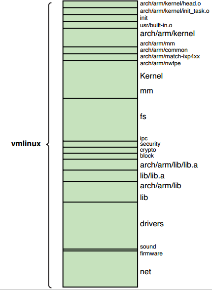
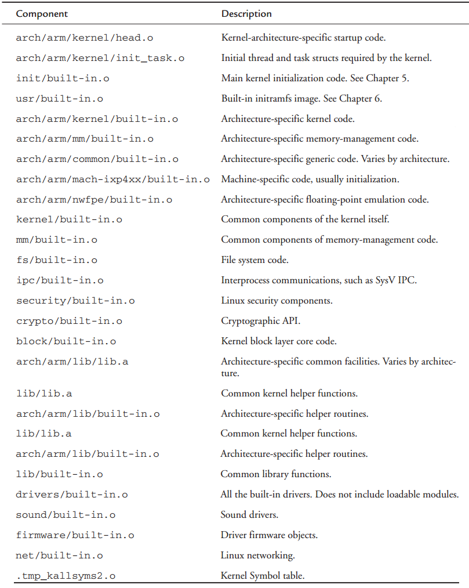

[toc]

## 4. Linux内核：另一个视角

### 4.1 背景

#### 4.1.1 内核版本

The first few lines of the top-level makefile in a kernel source tree detail the exact kernel version represented by a given instance. It looks like this for the **2.6.30** kernel release:

    VERSION = 2
    PATCHLEVEL = 6
    SUBLEVEL = 30
    EXTRAVERSION =
    NAME=Man-Eating Seals of Antiquity

Later in the same makefile, these macros are used to form a version-level macro, like this:

	KERNELVERSION=$(VERSION).$(PATCHLEVEL).$(SUBLEVEL)$(EXTRAVERSION)

This macro is used in several places in the kernel build system to indicate the kernel version. Its use has diminished in more recent kernels to a few locations in the scripts directory. 它已经被一个更复杂的描述字符串`KERNELRELEASE`替代。This string contains the kernel version as well as a tag that correlates to a source control revision level that comes from `git`.

`KERNELRELEASE` is used in several places within the kernel source tree. This macro is also built into the kernel image so that it can be queried from the console. 在一个运行的系统中，可以通过命令行查看：

	$ cat /proc/version
	Linux version 2.6.13 (chris@pluto) (gcc version 4.0.0 (DENX ELDK 4.0 4.0.0)) #2 Thu Feb 16 19:30:13 EST 2006

One final note about kernel versions: You can make it easy to keep track of the kernel version in your own kernel project by customizing the `EXTRAVERSION` field. For example, if you are developing **enhancements** for some new kernel feature, you might set `EXTRAVERSION` to something like this:

	EXTRAVERSION=-foo

Later, when you use `cat /proc/version`, you would see `Linux version 2.6.13-foo`, and this would help you distinguish between development versions of your own kernel.

#### 4.1.2 Kernel Source Repositories

Linux内核官方仓库是www.kernel.org。

另外的一些源码树，一般是架构特定的开发。For example, a developer working on the MIPS architecture might find a suitable kernel at www.linux-mips.org. Normally, work done in an architecture tree is eventually submitted to the mainline kernel maintainers.

Most architecture developers try to sync with the mainline kernel often, to keep up with new developments whenever possible.

If you are wondering how to find a kernel for your particular application, the best way to proceed is to obtain the latest stable Linux source tree. Check to see if support for your particular processor exists, 还要搜索Linux kernel mailing lists，寻找相干的补丁。Also find the mailing list that most closely matches your interest, and search that archive as well.

Appendix E, “Open Source Resources,” contains several good references and sources of information related to kernel source repositories, mailing lists, and more.

### 4.2 Linux内核结构

下面几节探寻Linux内核的组织结构。

#### 4.2.1 顶层目录

源码一般放在`/usr/src/linux-x.y.z`。本书中`.../`指代源码根目录。
顶层目录有：

    arch/ firmware/ kernel/ scripts/
    block/ fs/ lib/ security/
    crypto/ include/ mm/ sound/
    Documentation/ init/ net/ usr/
    drivers/ ipc/ samples/ virt/

目前最庞大的一个目录是`.../drivers`。这里面是设备驱动。`.../arch`是第二大的目录，包含对20多种处理器架构的支持。

源码根目录下，还有一个顶级的Makefile，及一个配置文件。

Finally, two important build targets are found in the top-level kernel source tree after a successful build: `System.map` and the kernel proper, `vmlinux`. Both are described in the next section.

#### 4.2.2 编译内核

内核构建系统的输出包含一些通用的文件，及一些架构特定的二进制模块。通用的文件不管什么架构都会产生。`System.map`和`vmlinux`就是两个通用的文件。前者对内核调试有用。It contains a human-readable list of the kernel symbols and their respective addresses. 后者是一个架构特定的ELF文件（ Executable and Linking Format, a de facto standard format for binary executable files）。它由顶级内核Makefile产生。If the kernel was compiled with symbolic debug information, it will be contained in the vmlinux image. 实际中，尽管它是一个ELF可执行文件，但该文件不会被直接启动。

下面将为ARM XScale架构做一次编译。The kernel source tree was configured for the ADI Engineering Coyote reference board based on the Intel IXP425 network processor using the following command:

	$ make ARCH=arm CROSS_COMPILE=xscale_be- ixp4xx_defconfig

上述命令并不是在编译内核；他是在配置内核源码，准备编译XScale架构。它产生一个默认配置文件（the dot-config file），基于 ixp4xx_defconfig 文件。配置过程会在4.3节详述。下面是实际编译：

    $ make ARCH=arm CROSS_COMPILE=xscale_be- zImage
        CHK include/linux/version.h
        UPD include/linux/version.h
        Generating include/asm-arm/mach-types.h
        CHK include/linux/utsrelease.h
        UPD include/linux/utsrelease.h
        SYMLINK include/asm -> include/asm-arm
        CC kernel/bounds.s
        GEN include/linux/bounds.h
        CC arch/arm/kernel/asm-offsets.s
        .
        . <hundreds of lines of output omitted here>
        .
        LD vmlinux
        SYSMAP System.map
        SYSMAP .tmp_System.map
        OBJCOPY arch/arm/boot/Image
        Kernel: arch/arm/boot/Image is ready
        AS arch/arm/boot/compressed/head.o
        GZIP arch/arm/boot/compressed/piggy.gz
        AS arch/arm/boot/compressed/piggy.o
        CC arch/arm/boot/compressed/misc.o
        AS arch/arm/boot/compressed/head-xscale.o
        AS arch/arm/boot/compressed/big-endian.o
        LD arch/arm/boot/compressed/vmlinux
        OBJCOPY arch/arm/boot/zImage
        Kernel: arch/arm/boot/zImage is ready
        ...

调用make时，指定了架构（`ARCH=arm`）和工具链（`CROSS_COMPILE=xscale_be-`）。`zImage`是构建目标。很多架构都用该目标，详情见第5章。现代的内核的默认构建会正确构建，因此可以省略指定`zImage`，或任何其他目标。

The next thing you might notice is that the actual commands used for each step have been hidden and replaced with a shorthand notation. The motivation behind this was to clean up the build output to draw more attention to intermediate build issues, particularly compiler warnings. In earlier kernel source trees, each compilation or link command was output to the console verbosely, which often required several lines for each step. The end result was virtually unreadable, and compiler warnings slipped by unnoticed in the noise. The new system is definitely an improvement, because any anomaly in the build process is easily spotted. If you want or need to see the complete build step, you can force verbose output by defining `V=1` on the make command line:

	$ make ARCH=arm CROSS_COMPILE=xscale_be- V=1 zImage

在所有中间文件，库编译好后，它们被放入一个ELF构建目标，称为`vmlinux`。尽管`vmlinux`是架构特定的，`vmlinux`是每个架构都会输出的。且位置位于源码根目录。

#### 4.2.3 The Kernel Proper: vmlinux

上一节的构建输出中有一行：

	LD vmlinux

The `vmlinux` file is the actual *kernel proper*. 它是一个完全独立（stand-alone）的、单体的（monolithic）ELF镜像。即，vmlinux没有任何未解析的外部引用。When caused to execute in the proper context (by a bootloader designed to boot the Linux kernel), it boots the board on which it is running, leaving a completely functional kernel. （但实际该vmlinux ELF目标很少被直接使用。几乎总是用其压缩的形式；压缩在格式在构建最后阶段产生；后文会细讲。）

下面分析vmlinux内核对象的结构。Listing 4-2 reproduces the actual link stage of the build process that resulted in the vmlinux ELF object. We have formatted it with line breaks (indicated by the UNIX line-continuation character, \) to make it more readable, but otherwise it is the exact output produced by the vmlinux link step in the build process from Listing 4-1. If you were building the kernel by hand, this is the link command you would issue from the command line.

LISTING 4-2 Link Stage: vmlinux

    $ xscale_be-ld -EB -p --no-undefined -X -o vmlinux \
    -T arch/arm/kernel/vmlinux.lds \
    arch/arm/kernel/head.o \
    arch/arm/kernel/init_task.o \
    init/built-in.o \
    --start-group \
        usr/built-in.o \
        arch/arm/kernel/built-in.o \
        arch/arm/mm/built-in.o \
        arch/arm/common/built-in.o \
        arch/arm/mach-ixp4xx/built-in.o \
        arch/arm/nwfpe/built-in.o \
        kernel/built-in.o \
        mm/built-in.o \
        fs/built-in.o \
        ipc/built-in.o \
        security/built-in.o \
        crypto/built-in.o \
        block/built-in.o \
        arch/arm/lib/lib.a \
        lib/lib.a \
        arch/arm/lib/built-in.o \
        lib/built-in.o \
        drivers/built-in.o \
        sound/built-in.o \
        firmware/built-in.o \
        net/built-in.o \
    --end-group \
    .tmp_kallsyms2.o

#### 4.2.4 Kernel Image Components

From Listing 4-2, you can see that the vmlinux image consists of several composite binary images. 目前还不需要知道每个组件的用途。What is important is to understand the top-level view of what components make up the kernel. The first line of the link command in Listing 4-2 specifies the output file (`-o vmlinux`). The second line specifies the linker script file (`-T vmlinux.lds`), a detailed recipe for how the kernel binary image should be linked.

The third and subsequent lines in Listing 4-2 specify the object modules that form the resulting binary image. Notice that the first object specified is `head.o`. This object was assembled from `.../arch/arm/kernel/head.S`, an architecture-specific assembly language source file that performs very low-level kernel initialization. If you were searching for the first line of code to be executed by the kernel, it would make sense to start your search here, because it will ultimately be the first code found in the binary image created by this link stage. We examine kernel initialization in detail in Chapter 5.

The next object, `init_task.o`, sets up initial thread and task structures that the kernel requires. Following this is a large collection of object modules, each having a common name: `built-in.o`. You will notice, however, that each `built-in.o` object comes from a specific part of the kernel source tree, as indicated by the path component preceding the `built-in.o` object name. These are the binary objects that are included in the kernel image. An illustration might help make this more clear.

Figure 4-1 illustrates the binary makeup of the `vmlinux` image. It contains a section for each line of the link stage. Some components are tiny. For example, sound and firmware are each 8 bytes in this build, because they are empty object files. (Sound is compiled as modules, and this build has no firmware.) 三个最大的二进制组件是文件系统代码、网路代码和内建的驱动。If you take the kernel code and the architecture-specific kernel code together, this is the next-largest binary component. Here you find the scheduler, process and thread management, timer management, and other core kernel functionality. Naturally, the kernel contains some architecture-specific functionality, such as low-level context switching, hardware-level interrupt and timer processing, processor exception handling, and more. This is found in `.../arch/arm/kernel`.

You can see the machine-specific binary components in Figure 4-1 as `arch/arm/mach-ixp4xx`. Each architecture and machine type (processor/reference board) has different elements in the architecture-specific portions of the kernel, so the makeup of the `vmlinux` image is slightly different. When you understand one example, you will find it easy to navigate others.

To help you understand the breakdown of functionality in the kernel source tree, Table 4-1 lists each component in Figure 4-1 and describes each binary element that makes up the `vmlinux` image.

### 4.3 内核构建系统

最近的内核有超过1200个Makefile。

#### 4.3.1 The Dot-Config

dot-config文件是内核构建的配置蓝本。通过一些编辑器，编辑好内核配置后，输出到源码根目录的`.config`文件。一些make命令会清除配置，如`make distclean`；执行后源码处于未配置的状态。（以点开头的文件在Linux系统中是隐藏文件。）

`.config`文件中是一系列**定义**。下面是该文件的一个片段。

	...
    # USB support
    #
    CONFIG_USB=m
    # CONFIG_USB_DEBUG is not set
    # Miscellaneous USB options
    #
    CONFIG_USB_DEVICEFS=y
    # CONFIG_USB_BANDWIDTH is not set
    # CONFIG_USB_DYNAMIC_MINORS is not set
    # USB Host Controller Drivers
    #
    CONFIG_USB_EHCI_HCD=m
    # CONFIG_USB_EHCI_SPLIT_ISO is not set
    # CONFIG_USB_EHCI_ROOT_HUB_TT is not set
    CONFIG_USB_OHCI_HCD=m
    CONFIG_USB_UHCI_HCD=m
    ...

Linux是一个整体（monolithic）结构；即整个内核被编译、链接成一个静态的、单个的可执行文件（linked executable）。但还可以编译、增量链接一部分代码到单个对象模块，然后动态插入到运行中的Linux内核。这是提供设备驱动的常见方法。在Linux中它们称为可加载的模块；或者通称设备驱动。内核启动后，一个特殊的应用程序将可加载的模块加入运行中的内核。

上面的`.config`片段是一部分USB配置。`CONFIG_USB=m`表示USB子系统将编译成动态加载的模块（`=m`）。若该选项配置成`CONFIG_USB=y`，则USB模块将静态链接，作为内核镜像的一部分；进入`.../drivers/built-in.o`。

注意`CONFIG_USB_DEVICEFS=y`。`USB_DEVICEFS` 不是一个模块，而是USB驱动中的一项特性，这是表示是否启动它。而不是说一个新的模块要链接进内核了。

#### 4.3.2 配置的编辑器

内核配置子系统有一些配置用的目标；最近的版本有11个。

- `config`：Update current config using a line-oriented program
- `menuconfig`：使用菜单程序**更新**当前配置。
- `xconfig`：Update current config using a QT-based front end
- `gconfig`：Update current config using a GTK-based front end
- `oldconfig`：Update current config using a provided .config as the base
- `silentoldconfig`：Same as oldconfig but silently
- `randconfig`：New config with random answer to all options
- `defconfig`：New config with default answer to all options
- `allmodconfig`：New config that selects modules, when possible
- `allyesconfig`：New config in which all options are accepted with yes
- `allnoconfig`：New minimal config

 例如，调出基于GTK的配置编辑器，执行`make gconfig`。退出编辑器时，询问是否保存，若保存，则全局配置文件`.config`将被更新；若不保存，`.config`不会被修改。

多数内核模块会间接的读取`.config`的配置：构建过程中，`.config`文件被处理到一个C头文件中：`.../include/linux/autoconf.h`。不用手工编辑该文件。很多内核源文件会使用`#include`包含该头文件。每条编译名都会通过gcc的`-include`指令包含该文件：

	gcc ... -include include/linux/autoconf.h ... <somefile.c>

LISTING 4-5 Linux autoconf.h

    $ cat include/linux/autoconf.h | grep CONFIG_USB
    #define CONFIG_USB_ARCH_HAS_EHCI 1
    #define CONFIG_USB_HID 1
    #define CONFIG_USB_EHCI_BIG_ENDIAN_DESC 1
    #define CONFIG_USB_ARCH_HAS_OHCI 1
    #define CONFIG_USB_EHCI_BIG_ENDIAN_MMIO 1
    #define CONFIG_USB_STORAGE 1
    #define CONFIG_USB_SUPPORT 1
    #define CONFIG_USB_EHCI_HCD 1
    #define CONFIG_USB_DEVICEFS 1
    #define CONFIG_USB_OHCI_HCD 1
    #define CONFIG_USB_UHCI_HCD 1
    #define CONFIG_USB_OHCI_LITTLE_ENDIAN 1
    #define CONFIG_USB_ARCH_HAS_HCD 1
    #define CONFIG_USB 1

#### 4.3.3 Makefile目标

输入`make help`，将列出一系列内核可以产生的目标。最场景的用法是调用make，不指定任何目标：产生内核ELF文件`vmlinux`和你选择的架构默认的二进制镜像（如x86是`bzImage`）；此外还会构建配置中指定的、所有的设备驱动模块（内核可加载的模块）。

很多架构和机器类型需要架构或bootloader专用的目标。这类目标中最常见的是`zImage`。新手常犯的错误是指定`bzImage`作为目标。但其实`bzImage`是x86架构专用的；它未经过压缩，适用于兼容机和PC风格的BIOS。

即便是`make help`中的help目标也是架构特定的。

    $ make ARCH=arm help
    Cleaning targets:
    	Clean - Remove most generated files but keep the config and
    			enough build support to build external modules
        mrproper - Remove all generated files + config + various backup files
		distclean - mrproper + remove editor backup and patch files
    ...
    Other generic targets:
	  All - Build all targets marked with [*]
    * vmlinux - Build the bare kernel
    * modules - Build all modules
	...
    Architecture specific targets (arm):
    * zImage - Compressed kernel image (arch/arm/boot/zImage)
	  Image - Uncompressed kernel image (arch/arm/boot/Image)
    ...
      ixp4xx_defconfig - Build for ixp4xx
	...
      omap_2430sdp_defconfig - Build for omap_2430sdp
      omap_3430sdp_defconfig - Build for omap_3430sdp
      omap3_beagle_defconfig - Build for omap3_beagle
	...

前面加星的目标是被默认构建的。注意到有很多默认的配置，以`_defconfig`。记得在4.2.2接，我们预配置一个源码树时，指定了架构和一个默认配置。那时用的默认配置是`ixp4xx_defconfig`，在上面的列表中就有——通过`make help`，你可以了解架构下所有的默认配置。

### 4.4 内核配置

`Kconfig`（或带扩展名的文件，如`Kconfig.ext`）存在于300多个内核子目录。Kconfig驱动所在目录功能的配置过程。Kconfig的内容由配置子系统解析，它告诉用户都有哪些配置项，以及对其做出解释。

The configuration utility (such as gconf, presented earlier) reads the Kconfig files starting from the `arch` subdirectory’s `Kconfig` file. It is invoked from the Kconfig makefile with an entry that looks like this:

    ifdef KBUILD_KCONFIG
    Kconfig := $(KBUILD_KCONFIG)
    else
    Kconfig := arch/$(SRCARCH)/Kconfig
    endif
    ...
    gconfig: $(obj)/gconf
    $< $(Kconfig)

Depending on which architecture you are building, gconf reads this architecture-specific Kconfig as the top-level configuration definition. Contained within Kconfig are a number of lines that look like this:

	source “drivers/pci/Kconfig”

该指令告诉配置编辑器工具读入另一个Kconfig文件。每个架构都包含很多像这样的Kconfig文件；它们一起决定了配置内核的完整的菜单项。每个Kconfig文件都可以在其内部任何地方`source`其他Kconfig文件。配置工具，如`gconf`，递归读取Kconfig文件。

Listing 4-7 is a partial tree view of the Kconfig files associated with the ARM architecture. In a recent Linux 2.6 source tree from which this example was taken, the kernel configuration was defined by 473 separate Kconfig files. This listing omits most of those for the sake of space and clarity; the idea is to show the overall structure. Listing them all in this tree view would take several pages.

LISTING 4-7 Partial Listing of Kconfig for ARM Architecture

    arch/arm/Kconfig <<<<<< (top level Kconfig)
        |-> init/Kconfig
        | ...
        |-> arch/arm/mach-iop3xx/Kconfig
        |-> arch/arm/mach-ixp4xx/Kconfig
        | ...
        |-> net/Kconfig
        |      |--> net/ipv4/Kconfig
        |      |       |--> net/ipv4/ipvs/Kconfig
        | ...
        |-> drivers/pci/Kconfig
        | ...
        |-> drivers/usb/Kconfig
        |      |--> drivers/usb/core/Kconfig
        |      |--> drivers/usb/host/Kconfig
        | ...
        |-> lib/Kconfig

Looking at Listing 4-7, the file .../arch/arm/Kconfig would contain a line like this:

	source “net/Kconfig”

The file net/Kconfig would contain a line like this:

	source “net/ipv4/Kconfig”

and so on.

#### 4.4.1 定制的配置选项

有时需要向Linux内核增加新功能，以支持定制硬件。The configuration management architecture just described makes it easy to customize and add features. A quick peek into a typical Kconfig file shows the structure of the configuration script language. As an example, assume that you have two hardware platforms based on the IXP425 network processor, and that your engineering team has dubbed them Vega and Constellation. Each board has specialized hardware that must be initialized early during the kernel boot phase. Let’s see how easy it is to add these configuration options to the set of choices presented to the developer during kernel configuration. Listing 4-8 is a snippet from the top-level ARM Kconfig file.

LISTING 4-8 Snippet from .../arch/arm/Kconfig

    source “init/Kconfig”
    menu “System Type”
    choice
        prompt “ARM system type”
        default ARCH_RPC
    config ARCH_CLPS7500
    	bool “Cirrus-CL-PS7500FE”
    config ARCH_CLPS711X
    	bool “CLPS711x/EP721x-based”
    ...
    source “arch/arm/mach-ixp4xx/Kconfig”

In this Kconfig snippet, you see the menu item `System Type` being defined. After the ARM System type prompt, you see a list of choices related to the ARM architecture. Later in the file, you see the inclusion of the IXP4xx-specific Kconfig definitions. In this file, you add your custom configuration switches. Listing 4-9 reproduces a snippet of this file. Again, for readability and convenience, we’ve omitted irrelevant text, as indicated by the ellipsis.

LISTING 4-9 Snippet from .../arch/arm/mach-ixp4xx/Kconfig

    menu “Intel IXP4xx Implementation Options”
    comment “IXP4xx Platforms”
    config ARCH_AVILA
        bool “Avila”
        help
        	Say ‘Y’ here if you want your kernel to support...
    config ARCH_ADI_COYOTE
        bool “Coyote”
        help
        	Say ‘Y’ here if you want your kernel to support
   			 the ADI Engineering Coyote...
    # (These are our new custom options)
    config ARCH_VEGA
        bool “Vega”
        help
        	Select this option for “Vega” hardware support
    config ARCH_CONSTELLATION
        bool “Constellation”
        help
            Select this option for “Constellation”
            hardware support
    ...

Shortly, you’ll see how you can use this configuration information in the source tree to conditionally select objects that contain support for your new boards.

After the configuration editor (gconf in these examples) is run and you select support for one of your custom hardware platforms, the .config file introduced earlier contains macros for your new options. As with all kernel-configuration options, each is preceded with CONFIG_ to identify it as a kernel-configuration option. As a result, two new configuration options have been defined, and their state has been recorded in the .config file. Listing 4-10 shows the new .config file with your new configuration options.

LISTING 4-10 Customized .config File Snippet

    ...
    #
    # IXP4xx Platforms
    #
    # CONFIG_ARCH_AVILA is not set
    # CONFIG_ARCH_ADI_COYOTE is not set
    CONFIG_ARCH_VEGA=y
    # CONFIG_ARCH_CONSTELLATION is not set
    # CONFIG_ARCH_IXDP425 is not set
    # CONFIG_ARCH_PRPMC1100 is not set
    ...

Notice two new configuration options related to your Vega and Constellation hardware platforms. As shown in Figure 4-4, you selected support for Vega; in the .config file, you can see that the new CONFIG_ option representing the Vega board is selected and set to the value y. Notice also that the CONFIG_ option related to Constellation is present but not selected.

#### 4.4.2 Kernel Makefiles

When building the kernel, the makefiles scan the configuration and decide what subdirectories to descend into and what source files to compile for a given configuration.
To complete the example of adding support for two custom hardware platforms, Vega and Constellation, let’s look at the makefile that would read this configuration and take some action based on customizations.

Because you’re dealing with hardware-specific options in this example, assume that the customizations are represented by two hardware-setup modules called `vega_setup.c` and `constellation_setup.c`. We’ve placed these C source files in the `.../arch/arm/mach-ixp4xx` subdirectory of the kernel source tree. Listing 4-11 contains the complete makefile for this directory from a recent Linux release.

LISTING 4-11 Makefile from .../arch/arm/mach-ixp4xx Kernel Subdirectory

    #
    # Makefile for the linux kernel.
    #
    obj-y += common.o common-pci.o
    obj-$(CONFIG_ARCH_IXDP4XX) += ixdp425-pci.o ixdp425-setup.o
    obj-$(CONFIG_MACH_IXDPG425) += ixdpg425-pci.o coyote-setup.o
    obj-$(CONFIG_ARCH_ADI_COYOTE) += coyote-pci.o coyote-setup.o
    obj-$(CONFIG_MACH_GTWX5715) += gtwx5715-pci.o gtwx5715-setup.o

You might be surprised by the simplicity of this makefile. Much work has gone into the development of the kernel build system for just this reason. For the average developer who simply needs to add support for his custom hardware, the design of the kernel build system makes these kinds of customizations very straightforward.

Looking at this makefile, it might be obvious what must be done to introduce new hardware setup routines conditionally based on your configuration options. Simply add the following two lines at the bottom of the makefile, and you’re done:

    obj-$(CONFIG_ARCH_VEGA) += vega_setup.o
    obj-$(CONFIG_ARCH_CONSTELLATION) += costellation_setup.o

These steps complete the simple addition of setup modules specific to the hypothetical sample custom hardware. Using similar logic, you should now be able to make your own modifications to the kernel configuration/build system.

### 4.5 Kernel文档

A wealth of information is available in the Linux source tree. It would be difficult to read it all, because the .../Documentation directory contains nearly 1,300 documentation files in 118 subdirectories. Be cautious in reading this material: Given the rapid pace of kernel development and release, this documentation tends to become outdated quickly. Nonetheless, it often provides a great starting point from which you can form a foundation of knowledge on a particular kernel subsystem or concept.

Do not neglect the Linux Documentation Project, found at www.tldp.org, where you might find the most up-to-date version of a particular document or man page. Of particular interest to the previous discussion is the Kbuild documentation, found in the kernel .../Documentation/kbuild subdirectory.

No discussion of kernel documentation would be complete without mentioning Google. One day soon, Google will appear in Merriam-Webster’s as a verb! Chances are, many problems you might have and questions you might ask have been addressed and answered. Spend some time becoming proficient in searching the Internet for answers to questions. You will discover numerous mailing lists and other information repositories full of invaluable information related to your specific project or problem.

Appendix E contains a useful list of open-source resources.

### 4.6 获取定制的Linux内核

开发嵌入式Linux系统需要：

- 一个bootloader，移植到你的硬件平台
- 一个交叉编译器和工具链
- 一个文件系统，包含库、可执行文件等，已移到到你的平台
- 设备驱动
- 开发环境
- Linux内核源码树

